# Facebook 即时文章:如何设置 WordPress

> 原文：<https://kinsta.com/blog/facebook-instant-articles/>

Facebook Instant Articles 于 2015 年推出，是一种移动发布格式，允许新闻出版商通过脸书应用程序发布文章。

像 [Google AMP](https://kinsta.com/blog/google-amp/) 一样，这些**文章的加载和显示速度比标准移动网络快 10 倍**，创造了更好的用户体验。出版商最初对遵守这一新的脸书倡议犹豫不决，但那些最有兴趣将其内容提供给新受众的出版商接受了这一新的内容格式化系统。

脸书承诺他们会帮助出版商从他们出版的内容中获得利润，这当然没有坏处。脸书将保留他们销售的任何广告的 100%的广告收入，出版商可以从脸书为他们销售的任何广告中抽取 70%。

为了参与其中，出版商需要做的就是调整他们的文章，使其采用 Facebook Instant Articles 的新格式。Buzzfeed、Mashable 和 Techcrunch 是广受欢迎的媒体网站，它们几乎立刻就做出了回应。由于文章预览中附带的闪电图标，可以识别 Facebook 即时文章和其他文章。

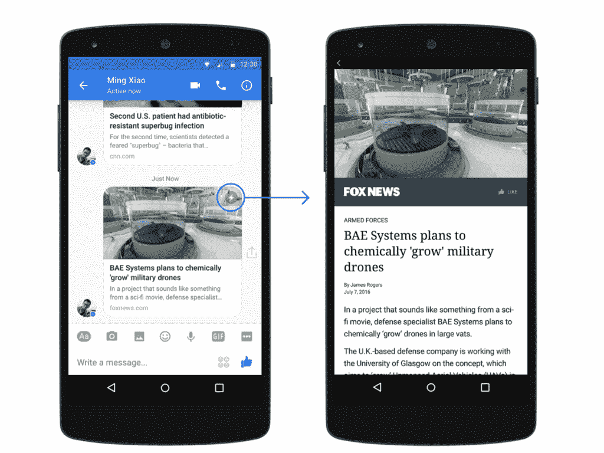

Facebook instant articles (Image source: [Facebook](https://www.facebook.com/instantArticles/))

## 使用 Facebook 即时文章:利弊

让现有内容适应新格式不可避免地会带来挑战。以下是在你的 WordPress 网站上使用 Facebook 即时文章的一些优点和缺点:

**Facebook 即时文章:优点**

*   更快的网站加载速度=增强的用户体验。
*   用户可能会更多地分享你的内容。
*   让出版商获得新的盈利选择。
*   接触新的受众和扩大覆盖面。

**Facebook 即时文章:缺点**

*   只显示你的文章:脸书不会显示任何与你文章内容不直接相关的东西，比如你的重要[小工具](https://kinsta.com/blog/wordpress-widgets/)或[电子邮件注册表单](https://kinsta.com/blog/wordpress-lead-generation/)。
*   限制照片、视频和广告块(尽管你仍然可以稍加修改就使用它们)。
*   这是一家公司试图提供你自己内容的另一种方式。换句话说，当人们不再点击你原来的网站时，你的控制力就降低了。人们对谷歌 AMP 表达了类似的担忧。
*   你必须得到脸书的人工批准。

## 如何格式化 Facebook 即时文章

有几种方法可以格式化 Facebook 即时文章。

一种方法是创建即时文章模板。也就是说，这种方法适用于当你没有使用 WordPress 或者没有通过第三方工具发布文章的时候。

然而，如果你使用 WordPress 或者通过第三方工具发布文章，你可以通过三种方式导入你的文章:

*   Facebook 即时文章 API
*   [RSS 订阅源](https://kinsta.com/blog/wordpress-rss-feed/)
*   支持第三方发布工具，如 Facebook 即时文章 WordPress 插件

如果你使用的是定制 CMS ，前两种方法是可行的，但是如果你使用的是 Drupal 或 WordPress 等 CMS，并且没有开发团队，最后一种选择(使用 WordPress 插件)是最好的。它使独立出版商能够像大出版商一样利用 Facebook 即时文章。

## 如何为 WordPress 设置 Facebook 即时文章

WordPress 是当今世界上使用的最大的内容管理系统，33%的网站使用的是[。了解到这一点，脸书决定与 WordPress 的母公司 Automattic 合作，为 WordPress 用户提供一个免费插件，方便他们在脸书上分享即时文章格式的内容。然而，我们已经看到了一些关于](https://kinsta.com/wordpress-market-share/)[官方插件](https://wordpress.org/plugins/fb-instant-articles/)的**关键性能问题**。

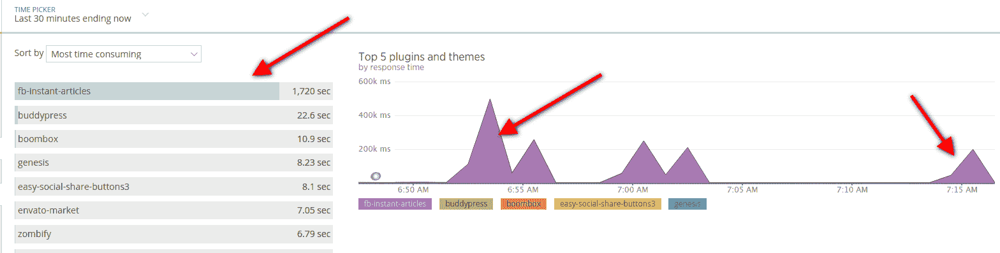

Facebook Instant Articles performance

正因为如此，我们建议使用非官方的第三方插件。为了在你的 WordPress 网站上设置 Facebook 即时文章，你需要:

*   WordPress 网站
*   与你的 WordPress 网站背后的业务相关的脸书页面(建议阅读:[如何创建脸书页面](https://kinsta.com/blog/how-to-create-a-facebook-page))
*   脸书页面管理器应用(在[谷歌 Play 商店](https://play.google.com/store/apps/details?id=com.facebook.pages.app&hl=en)或 [iTunes 商店](https://itunes.apple.com/us/app/facebook-pages-manager/id514643583?mt=8)或[出版工具](https://developers.facebook.com/docs/instant-articles/guides/publishertools)下载)
*   至少 10 篇 WordPress 文章
*   一个脸书即时文章 WordPress 插件(其中一些我们将在下面提到)

### 第一步

首先:访问 Facebook 即时文章网站并注册。

[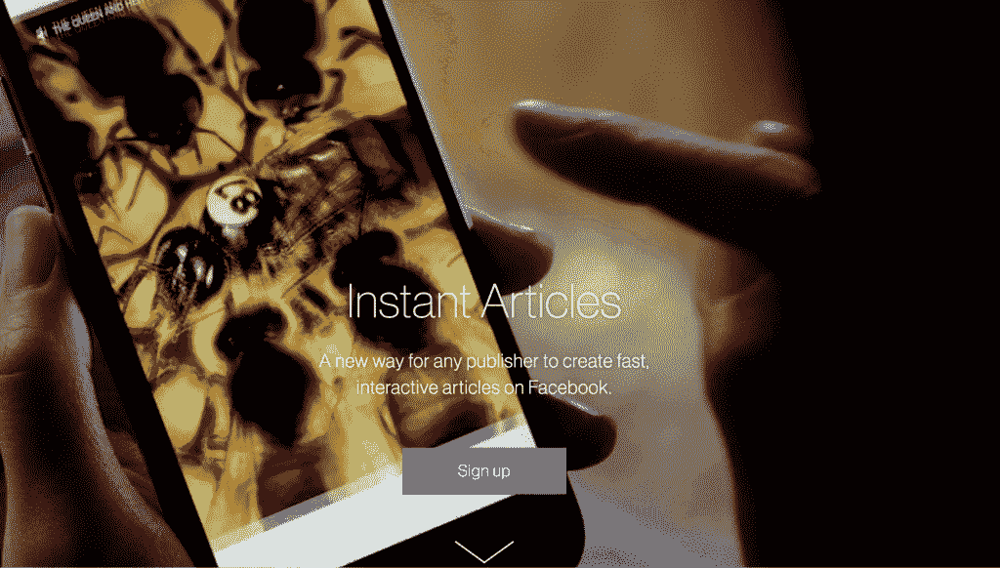](https://instantarticles.fb.com/)

Facebook Instant Articles website

脸书会要求你为你的网站选择一个脸书页面。选中同意条款的复选框，然后单击“访问即时文章工具”按钮。

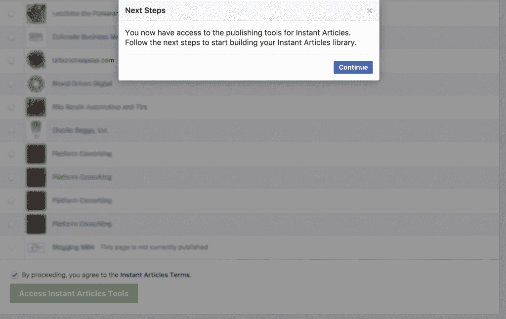

Access Instant Articles Tools

这将把你带到你的脸书页面上的 publisher tools，现在它将有一个*即时文章*部分。

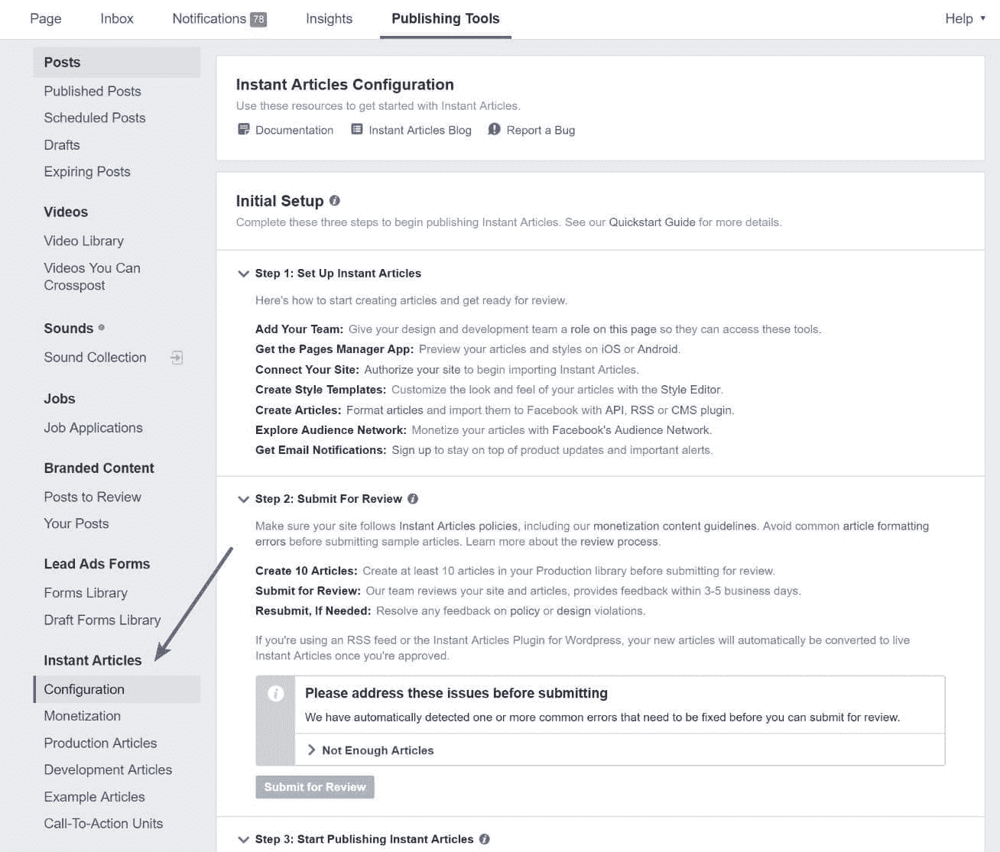

Facebook Instant Articles publishing tools

### 第二步

通过申请你的网址来证明你的网站的所有权。在“即时文章→配置→工具→连接您的站点”下，您会找到您的页面 ID。将此复制到您的剪贴板。

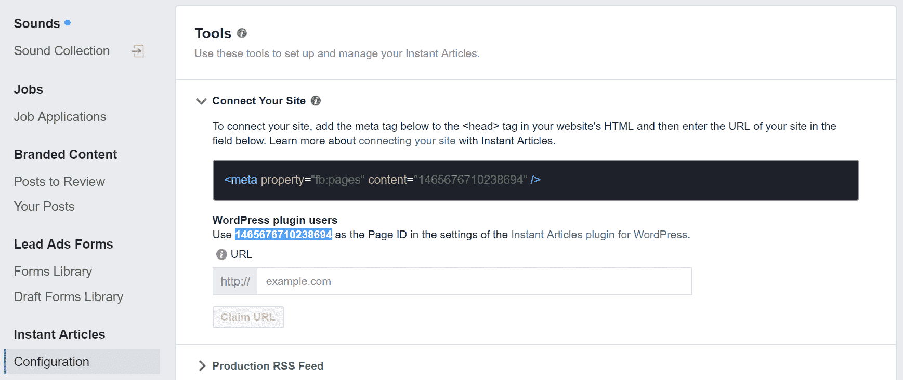

Facebook Instant Articles connect site

### 第三步

在你的 WordPress 网站上下载并安装 [WP 原生文章](https://wp-native-articles.com/)插件。这不是官方插件，但是如果你关心性能的话，我们推荐这个插件。

## 注册订阅时事通讯

### 想知道我们是怎么让流量增长超过 1000%的吗？

加入 20，000 多名获得我们每周时事通讯和内部消息的人的行列吧！

[Subscribe Now](#newsletter)

最有用和有趣的特性之一是内容解析，它纠正了一些 WordPress 内容的非结构化性质。通过添加适当的结构和格式，WP Native Article 的内容解析功能有助于内容加载，甚至比标准插件产品更快。它还可以让你整合谷歌分析，广告等。

[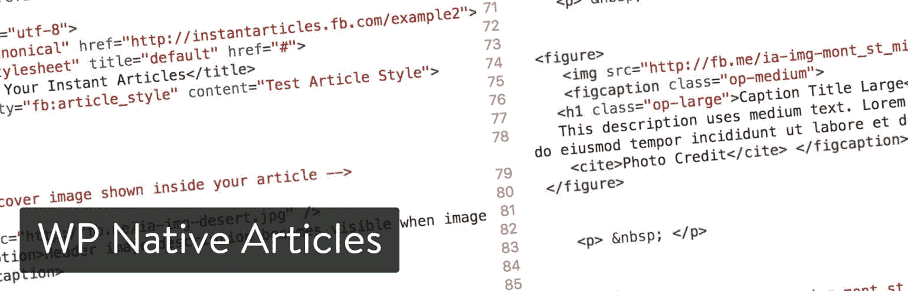](https://wp-native-articles.com/)

WP Native Articles WordPress plugin

虽然核心的 WP 原生文章插件是免费的，但有一个单独网站的[高级版本](https://wp-native-articles.com/)起价 49 美元。高级版本带有 API 同步、高级文章分析和高级支持，如果您在部署时遇到任何问题。

### 第四步

把你在步骤 2 中复制的页面 ID 粘贴到 WP 原生文章 WordPress 插件的授权 ID 字段中。

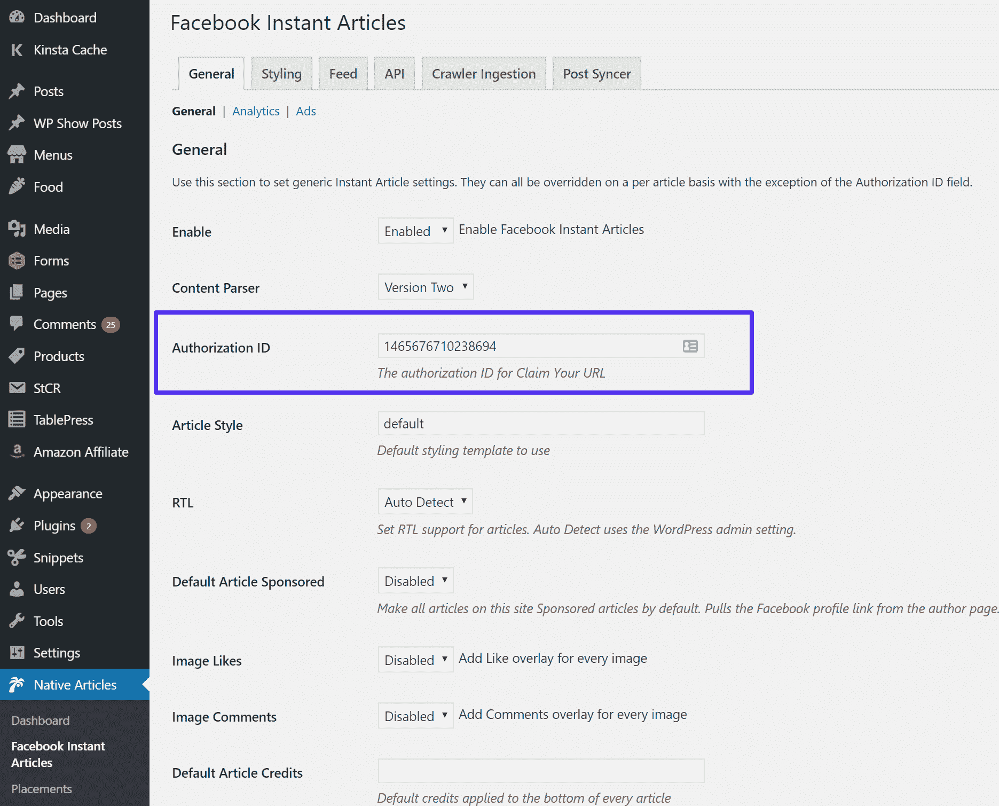

Facebook Instant Articles authorization ID

然后点击“保存更改”

### 第五步

将您的页面 ID 添加到插件设置后，返回到您的脸书页面的发布工具。在您之前复制的代码下方添加您的网站 URL，然后单击声明 URL 按钮。注意:你可能需要[首先清空你的 WordPress 站点](https://kinsta.com/blog/wordpress-clear-cache/)上的缓存，这样它才能获得修改。

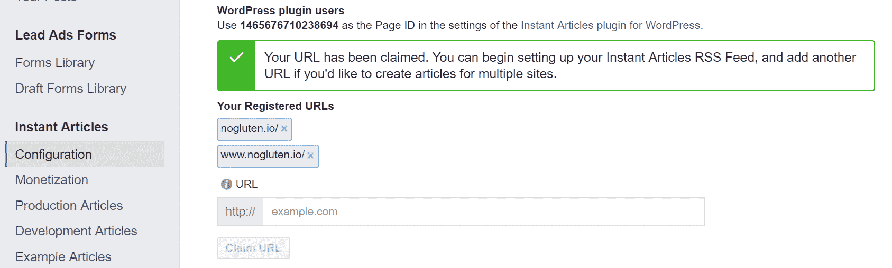

Claimed Facebook Instant Articles URL

如果您收到以下错误，这似乎是某些人的已知问题。

> 提供的 URL 不被接受，因为该网站的读者人数很少，这违反了即时文章政策([https://developers . Facebook . com/docs/Instant-articles/policy/](https://developers.facebook.com/docs/instant-articles/policy/))。请提供不同的 URL。

以下是获得 Facebook 即时文章批准的一些技巧:

Struggling with downtime and WordPress problems? Kinsta is the hosting solution designed to save you time! [Check out our features](https://kinsta.com/features/)

*   确保你的 WordPress 网站上已经有足够多的内容。不要尝试在空白网站申请。
*   内容不能在付费墙后面。
*   有一个链接指向你网站的隐私政策。

### 第六步

然后你应该让你的脸书帖子符合你网站的品牌。我们建议至少添加您的徽标并更改颜色。打开脸书发布工具，在“即时文章→配置→工具→样式”下，你可以创建和编辑默认的样式。

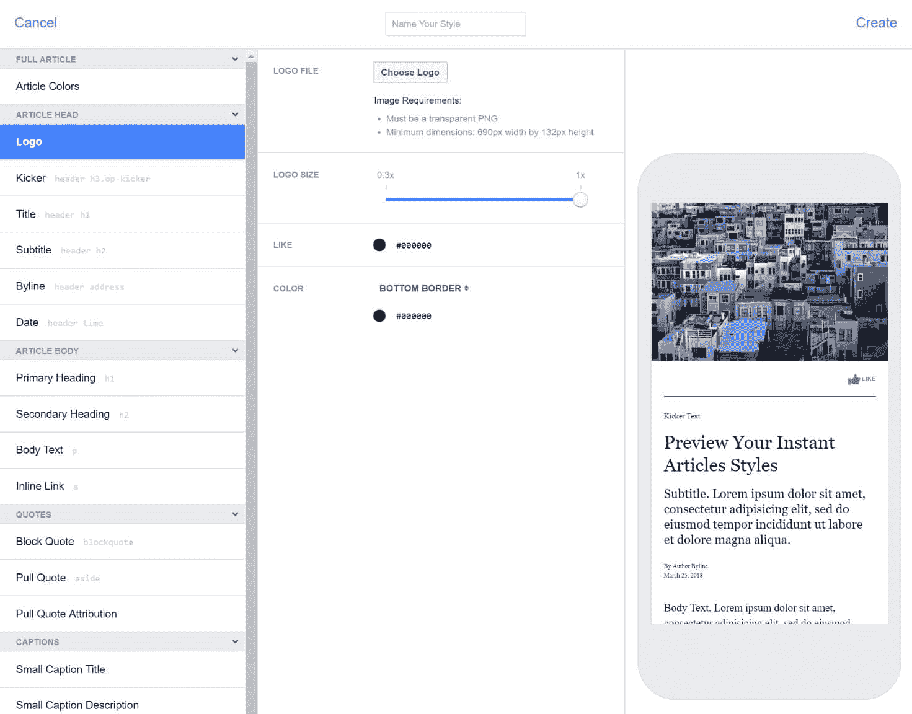

Facebook Instant Articles style editor

### 第七步

WordPress 插件会自动为你的 WordPress 站点生成一个即时文章源。要获取提要 URL，请在您的网站 URL 后添加扩展名`/feed/facebook-instant-articles/`。你也可以在 WP 原生文章插件的“Feed”标签下找到它。

例如:`https://yourdomain.com/feed/facebook-instant-articles/`

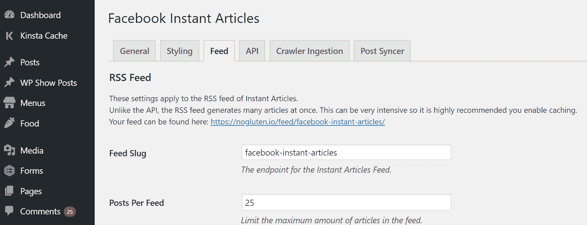

Facebook Instant Articles RSS feed

复制 URL 并切换回脸书页面发布工具部分。然后进入“即时文章→配置→工具→制作 RSS Feed”。将 URL 粘贴到那里并保存您的更改。

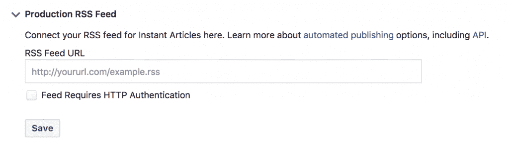

Facebook Instant Articles production RSS Feed

脸书通过 RSS 订阅方式获取帖子可能需要一个小时。

### 第八步

当脸书消化了 10 篇文章后，您可以在配置页面提交它们进行审核。审查通常需要 3-5 天，一旦获得批准，您的即时文章将是活的。如果即时文章版本可用，您分享到脸书页面的任何帖子现在都将自动使用即时文章版本。

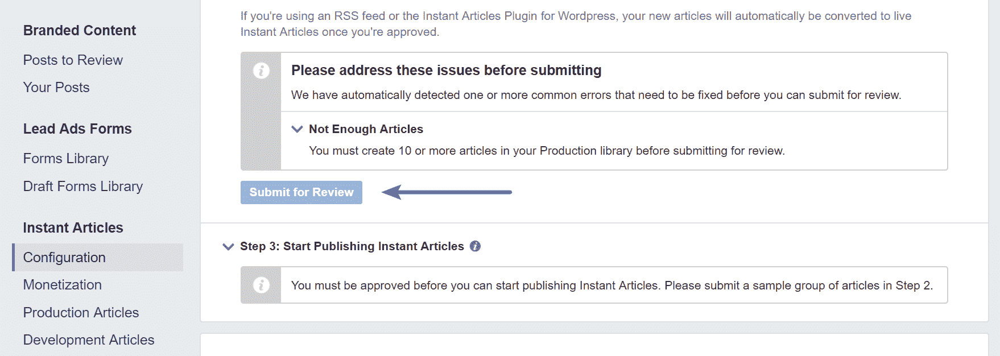

Facebook Instant Articles submit for review

### 替代脸书即时文章插件

和任何 WordPress 网站一样，在你当前安装的插件和你的主题组合中，有时一个插件可能比另一个更好。如果你对已经提到的插件有任何问题，你可能也想看看这些其他即将出现的选项:

#### LH 即时文章

LH Instant Articles 以创建“无膨胀”的 Facebook Instant Articles 而自豪，这要感谢它为你现有的 WordPress 内容创建了一个符合脸书标准的 RSS feed。

[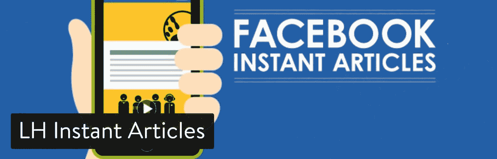](https://wordpress.org/plugins/lh-instant-articles/)

LH Instant Articles WordPress plugin

高级功能包括添加相关帖子、分析和广告的能力。与其他一些选项相比，它还声称更容易实现——对于不太擅长编码和故障排除的人来说，这是一个理想的选择。

## WordPress 的 Facebook 即时文章

Facebook 的即时文章功能对希望通过内容吸引新受众的大型和独立出版商都很有帮助。

在脸书的即时文章平台上(尽管有一些反弹和[出版商将](http://fortune.com/2017/04/17/instant-articles-bait-and-switch/))可以给你带来额外的优势，因为脸书已经引入了一个叫做[探索提要](https://blog.hubspot.com/marketing/facebook-explore-feed)的新功能(允许你发现与你兴趣相关的内容)。此外，即时文章比常规的 WordPress 内容更容易分享，加载速度更快，并且可以与脸书整合，在新闻订阅中获得更高的优先级。

你有什么想法？你在你的 WordPress 网站上尝试过 Facebook 即时文章吗？

* * *

让你所有的[应用程序](https://kinsta.com/application-hosting/)、[数据库](https://kinsta.com/database-hosting/)和 [WordPress 网站](https://kinsta.com/wordpress-hosting/)在线并在一个屋檐下。我们功能丰富的高性能云平台包括:

*   在 MyKinsta 仪表盘中轻松设置和管理
*   24/7 专家支持
*   最好的谷歌云平台硬件和网络，由 Kubernetes 提供最大的可扩展性
*   面向速度和安全性的企业级 Cloudflare 集成
*   全球受众覆盖全球多达 35 个数据中心和 275 多个 pop

在第一个月使用托管的[应用程序或托管](https://kinsta.com/application-hosting/)的[数据库，您可以享受 20 美元的优惠，亲自测试一下。探索我们的](https://kinsta.com/database-hosting/)[计划](https://kinsta.com/plans/)或[与销售人员交谈](https://kinsta.com/contact-us/)以找到最适合您的方式。