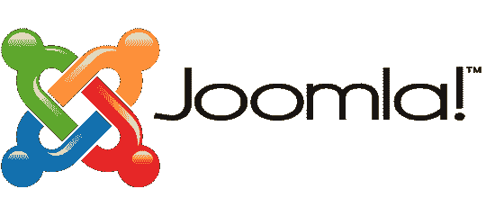
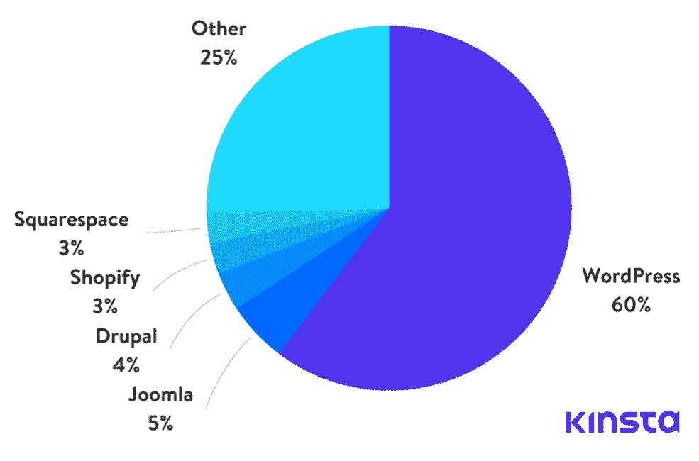
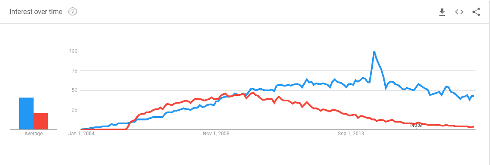
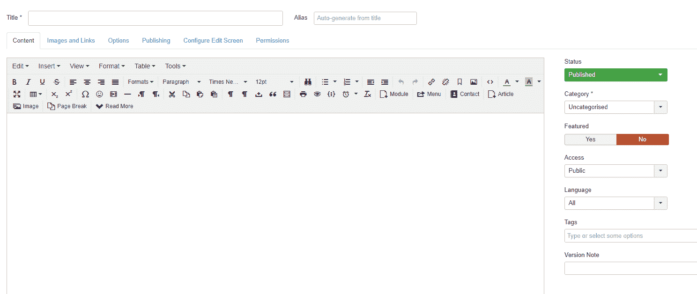
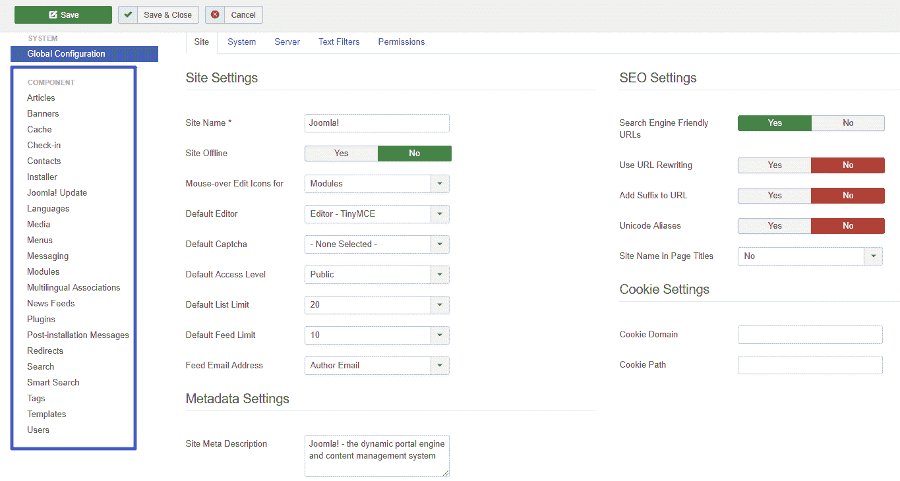
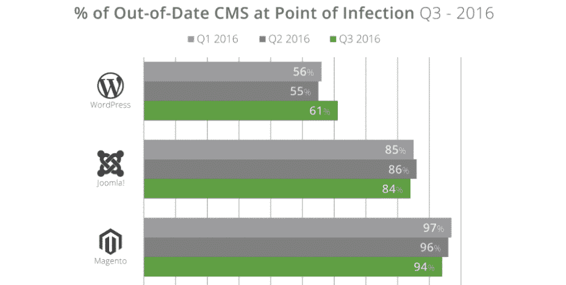

# Joomla 和 WordPress 哪个更好？(赞成和反对)

> 原文：<https://kinsta.com/blog/joomla-vs-wordpress/>

试图在 Joomla 和 WordPress 之间选择你的下一个网站？虽然有大量的理由使用 WordPress，但我们认识到 WordPress 并不是唯一一个帮助你建立网站的 T2 内容管理系统。

我们已经花了时间研究了 Drupal 与 WordPress 的对比，以及 T2 与 Squarespace 等托管解决方案的对比。现在，我们回来为 Joomla 做同样的事情。

我们将深入研究每个内容管理系统，让您更好地了解每个平台的优缺点。

而且，为了让这更有帮助，我们将遵循与我们的 [Drupal 与 WordPress 对比](https://kinsta.com/blog/wordpress-vs-drupal/)完全相同的格式，这样你就可以很容易地比较所有三个平台。

## Joomla vs WordPress:简介和数字说明什么

WordPress 和 Joomla 都是自托管、开源的内容管理系统，已经存在了 10 多年。

WordPress 最初于 2003 年作为一个博客平台推出，现在是一个多功能的内容管理系统，为互联网上超过 43.3%的网站提供动力*不仅仅包括博客！*)。就内容管理系统市场的市场份额而言，WordPress 占据了[更大的 65.1%的市场份额](https://kinsta.com/wordpress-market-share/)。

Joomla 于 2005 年推出，几乎和 WordPress 一样古老。Joomla 是仅次于 WordPress 的第二大流行的内容管理系统，为互联网上 3%的网站提供支持，并占有内容管理系统市场的 5.4%。

> 需要在这里大声喊出来。Kinsta 太神奇了，我用它做我的个人网站。支持是迅速和杰出的，他们的服务器是 WordPress 最快的。
> 
> <footer class="wp-block-kinsta-client-quote__footer">
> 
> 
> 
> <cite class="wp-block-kinsta-client-quote__cite">Phillip Stemann</cite></footer>

[View plans](https://kinsta.com/plans/)

CMS market share

虽然 Joomla 目前仍然保持着第二名的桂冠，但至少从 2010 年开始，其内容管理系统市场份额[一直在萎缩](https://w3techs.com/technologies/history_overview/content_management/ms/y)，其网站市场[的总体份额在 2017 年首次萎缩](https://w3techs.com/technologies/history_overview/content_management/all/y)。

如果你看一下从 2004 年到现在“WordPress”和“Joomla”之间的谷歌趋势比较，你可以直观地看到这种趋势。直到 2010 年 WordPress 开始占据主导地位之前，Joomla 实际上一直处于领先或同等地位:

Joomla vs WordPress at Google Trends

总而言之——WordPress 仍在增长，而 Joomla 正朝着相反的方向缓慢前进。但是，这并不意味着 Joomla 没有什么可以提供的！

## WordPress 和 Joomla 有哪些广为人知的优点？

如果你搜索 Joomla vs WordPress，你会发现两个阵营的开发者之间存在大量的意识形态之争。总的来说，您会从各个方面看到为什么一个平台是最好的一些主要原因:

### WordPress 优势

*   易用性——WordPress 通常被认为是最容易使用的内容管理系统，尤其是对非开发者而言。
*   **更适合写博客**–WordPress 包含了开箱即用的“博客文章”和“静态页面”的区别，而 Joomla 只包含了一个“文章”类型，你可以用类别来操作。
*   **可扩展性**——WordPress 拥有迄今为止最大的生态系统，包括 [WordPress 插件](https://kinsta.com/best-wordpress-plugins/)和 [WordPress 主题](https://kinsta.com/best-wordpress-themes/)，这使得用各种不同的功能扩展你的网站变得容易。
*   巨大的支持社区——因为 WordPress 如此受欢迎，通过博客、脸书团体和开发者的庞大第三方生态系统很容易找到帮助。
*   **更低的开发成本**–这个巨大的社区也意味着你通常可以以更低的成本完成开发工作。

### Joomla 优势

*   **更高级的用户管理**–Joomla 提供了一个开箱即用的更高级的用户访问控制和用户管理系统。
*   **灵活适应不同的内容类型**–Joomla 的组件和模块为您显示非标准内容类型提供了更多的灵活性。
*   **多语言支持**–Joomla 的核心内置了多语言支持，而 WordPress 则要求你使用第三方插件。
*   多种模板–Joomla 允许你为不同的内容使用不同的模板，然而你只能[使用一个 WordPress 主题](https://kinsta.com/blog/how-to-install-a-wordpress-theme/)。

## 使用 WordPress 和 Joomla 有多容易？

虽然 Joomla 比 Drupal 更适合初学者，但 WordPress 仍然是创建网站最简单快捷的方式。

### WordPress 易用性和学习曲线

如果你只是在创建一个有静态内容和/或博客的“常规”网站，有可能在几个小时内就能创建并运行一些看起来不错的东西。

大多数主机都包含 WordPress 自动安装程序，甚至预装了 WordPress。

从这里开始，WordPress 界面非常简单，大多数普通用户可以马上开始创建内容。

像 WordPress Customizer 这样的新增功能现在也让人们可以更容易地进行安全的、[无代码主题更改](https://kinsta.com/blog/change-wordpress-theme/)，这尤其有帮助，因为越来越多的 WordPress 主题正在以有趣的方式拥抱 Customizer:

The WordPress theme customizer

对于更高级的内容设计，[无数的页面构建器插件](https://kinsta.com/blog/wordpress-page-builders/)使得使用拖放来构建布局变得容易，而即将推出的[古腾堡编辑器](https://kinsta.com/blog/gutenberg-wordpress-editor/)将使用户更容易创建独特的内容。

### Joomla 易用性和学习曲线

像 WordPress 一样，大多数网络主机都有 Joomla 自动安装程序，可以很容易地安装 Joomla 软件。

从那以后，你需要在你的网站上投入更多的时间和精力。正如我们所说的，Joomla 结合使用了**文章**和**类别**。因此，在开始创建内容之前，您需要为您想要创建的内容类型创建类别。

这没有什么太大的难度，但是比 WordPress 要复杂一些，特别是对于非开发人员来说。

Joomla TinyMCE 文章编辑器与 WordPress 的 TinyMCE 编辑器的实现几乎相同，所以在这方面没有太大的区别:

The Joomla text editor

但是那些还不熟悉 Joomla 界面的人会被各种管理界面中的大量选项所困扰:

An example of how many options the Joomla dashboard has

也就是说，Joomla 确实有一些用户友好的编辑工具，比如页面生成器扩展，这使得事情不那么面向开发人员。

## 注册订阅时事通讯

### 想知道我们是怎么让流量增长超过 1000%的吗？

加入 20，000 多名获得我们每周时事通讯和内部消息的人的行列吧！

[Subscribe Now](#newsletter)

说到扩展…

## 如何用 Joomla 和 WordPress 扩展你的网站？

Joomla 和 WordPress 都提供了多种插件类型，你可以用它们来扩展你的站点:

*   功能性——WordPress 称这些**插件为**，而 Joomla 称它们为**扩展**
*   美学——WordPress 称这些**主题为**，而 Joomla 称之为**模板**

就数量而言，WordPress 的扩展市场更大，但两个平台都有很大的多样性。

### WordPress 有多少插件和主题？

目前，WordPress 已经:

*   WordPress.org 官方插件目录中有 54，000 个+ **免费**插件，外加数千个高级插件
*   WordPress.org 官方插件目录中的 5000 个+ **免费**主题，外加数千个高级主题

### Joomla 有多少扩展和模板？

目前，Joomla 已经:

*   Joomla 官方扩展库中列出了大约 8，000 个扩展

没有官方的 Joomla 模板库，所以很难找到可用的 Joomla 模板。不过，一些基本的谷歌搜索会出现大量(大部分)高级 Joomla 模板。

## WordPress 和 Joomla 同样安全吗？

Joomla 和 WordPress 的核心软件都是安全的。此外，每个平台还具有第三方插件或扩展以增加额外的安全性，以及方便的仪表板更新系统以帮助保持一切最新。

Struggling with downtime and WordPress problems? Kinsta is the hosting solution designed to save you time! [Check out our features](https://kinsta.com/features/)

也就是说…人为错误总是真实存在的，而且因为每个平台都是可扩展的，所以必然会有安全问题。

根据 Sucuri 的数据，Joomla 网站似乎经历了更多的被黑网站*与其市场份额*相比。但是，在大多数情况下，每个平台都没有内在的安全性。

### WordPress 安全

根据 [Sucuri 被黑网站报告-2016/Q3](https://blog.sucuri.net/2017/01/hacked-website-report-2016q3.html)，在 Sucuri 的样本中，WordPress 占[被黑网站](https://kinsta.com/blog/wordpress-hacked/)的 74%，比其市场份额 58.9%(当时*)高出约 25%；*

Joomla vs WordPress hacked website stats

尽管如此，根据 Sucuri 的数据，WordPress 实际上比 Joomla 表现得更好…

### Joomla 安全公司

在同一份报告中，Joomla 网站占所有被黑网站的 17%，比 Joomla 当时 7.3%的市场份额高出约 132%。

然而有趣的是，84%被黑的 Joomla 网站在被感染时运行的是过期软件，相比之下，WordPress 网站只有 61%:

% out-of-date CMS when hacked

这支持了“平台并非不安全”的观点。过时的平台是不安全的。”

## 从 Joomla 迁移到 WordPress

如果你目前正在使用 Joomla，并且正在寻找一种简单的方法来迁移到 WordPress，我们推荐你去看看[wordheed](https://wordherd.io/partners/kinsta/)。他们是 Kinsta 的官方合作伙伴，提供全面的网站迁移服务，将数据从任何 CMS (Joomla)平台转移到 WordPress 。

[T2】](https://wordherd.io/partners/kinsta/)

WordHerd 处理从小型企业到大型企业的各种规模的迁移。除了 CMS 迁移之外，WordHerd 团队也非常擅长协助 CRM 数据迁移。

如果你想要一个更 DIY 的方法，你可以看看下面的插件:

*   [CMS 2 CMS:Joomla 到 WordPress 的自动迁移](https://wordpress.org/plugins/cms2cms-joomla-to-wp-migration/)
*   [FG Joomla 到 WordPress](https://wordpress.org/plugins/fg-joomla-to-wordpress/)

## Joomla vs WordPress:哪个更好？

就像我们的 Drupal 比较一样，我们认为问“哪个更好？”本身就是一个有缺陷的问题。两个平台都有各自的优势，没有一个在所有情况下都是最优的。

相反，你应该问，“对于我正在创建的网站的特定需求，哪个平台更好？

WordPress 可能更适合大多数网站，并且应该是大多数情况下的默认选择，因为:

*   这是最用户友好的内容管理系统，尤其是对非开发者而言
*   您可以快速建立并运行一个有吸引力的网站，而无需大量的开发时间/成本
*   如果你遇到任何问题，很容易找到免费的专业帮助

但是如果你是一名开发人员，或者愿意雇佣一名开发人员，Joomla 可以为你显示不同类型的内容和管理用户提供更多的灵活性。

这里要考虑的一件事是 Joomla 的市场份额正在下降，但 WordPress 和 Drupal 的情况并非如此。

虽然 Joomla 仍然排在第二位，而且不会很快消失，但当你展望未来时，有必要选择一个不断增长的内容管理系统。

谈到 Joomla vs WordPress，你同意还是不同意？请在评论中告诉我们！

[逐鹿！](https://www.joomla.org/)标志是开源公司的注册商标

* * *

让你所有的[应用程序](https://kinsta.com/application-hosting/)、[数据库](https://kinsta.com/database-hosting/)和 [WordPress 网站](https://kinsta.com/wordpress-hosting/)在线并在一个屋檐下。我们功能丰富的高性能云平台包括:

*   在 MyKinsta 仪表盘中轻松设置和管理
*   24/7 专家支持
*   最好的谷歌云平台硬件和网络，由 Kubernetes 提供最大的可扩展性
*   面向速度和安全性的企业级 Cloudflare 集成
*   全球受众覆盖全球多达 35 个数据中心和 275 多个 pop

在第一个月使用托管的[应用程序或托管](https://kinsta.com/application-hosting/)的[数据库，您可以享受 20 美元的优惠，亲自测试一下。探索我们的](https://kinsta.com/database-hosting/)[计划](https://kinsta.com/plans/)或[与销售人员交谈](https://kinsta.com/contact-us/)以找到最适合您的方式。