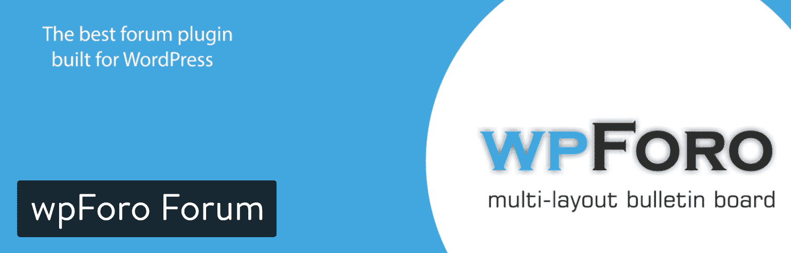
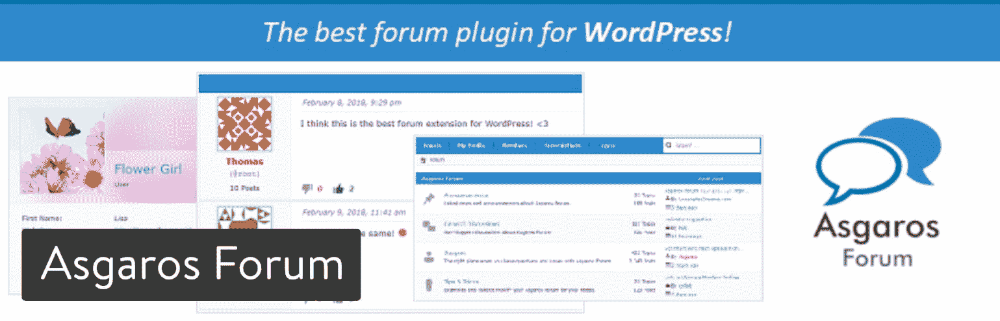
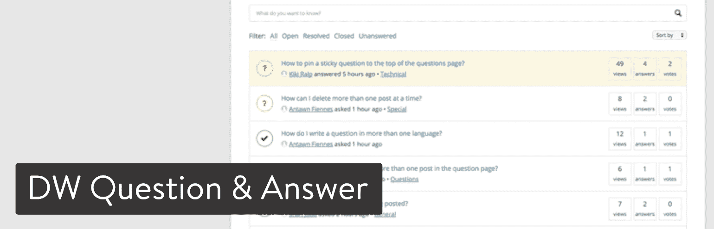

# 讨论热门话题的 9 大 WordPress 论坛插件

> 原文：<https://kinsta.com/blog/wordpress-forum-plugins/>

从聊天室到论坛，从社交网络到电子邮件，上网可以让人们保持联系，并找到志同道合的人来讨论某些话题。

尤其是论坛，因为其对话记录、社区建设和与网站的轻松集成而具有极大的吸引力。网上有很多论坛可供选择。如果你喜欢园艺，在谷歌上快速搜索就会发现几个论坛。

篮球、网页设计、电子邮件营销也是如此，甚至还有一个长发男士论坛。为了创建你自己的社区，你必须考虑一个 WordPress 论坛插件，将社区部分整合到你当前的网站中。

WordPress forum

也有可能把你的整个网站变成一个论坛，但是在这种情况下，你最有可能使用 WordPress 论坛主题而不是插件。

论坛很酷的一点是它们已经进化了很多年。那些有着长线程和有时令人困惑的对话的旧论坛仍然存在，但那是因为格式似乎有效。我们也开始看到一些其他的论坛格式，比如 Quora 和 Stack Overflow 等网站上的问答布局，或者 Reddit 等网站上的上/下投票安排。

好消息是，你可以利用下面的一些论坛插件选项来实现类似的论坛风格。我们将概述每个插件的最佳特性，并讨论它的价格。一些论坛插件是众所周知的，但是如果你对论坛更新感兴趣或者你想让你的论坛看起来比其他数百万的论坛更独特，你应该看看其中的几个。

论坛的世界一直在增长，你可以用你自己的 WordPress 论坛插件成为其中的一部分。所以，继续读下去，找到适合自己的。

## 选择 2022 年最好的 WordPress 论坛插件

插件需要测试来弄清楚你是否会喜欢用户体验，喜欢它出现在你网站前端的方式。对于论坛来说尤其如此，因为你必须[管理社区](https://kinsta.com/blog/wordpress-project-management-plugins/)并让论坛看起来更漂亮，这样人们才会想回来。所以，我们为你整理了一个快速列表，让你浏览 WordPress 论坛插件并自己测试它们。但是，我们也强烈建议您查看以下的深度评论。

1.  [bb 按下](#bbpress)
2.  [BuddyPress](#buddypress)
3.  [WPForo 论坛](#wpforo)
4.  [Asgaros Forum](#asgaros-forum)
5.  [DW 问答](#dw-question-and-answer)
6.  [WP Symposium Pro 社交网络插件](#wp-symposium)
7.  [讨论板 WordPress 论坛插件](#discussion-board)
8.  [萨白讨论](#sabai-discuss)
9.  [来自 WPMU Dev 的论坛](#forums-wpmu-dev)

从设置过程到论坛管理，这些插件中的功能构成了你在网站上的体验。其中一些是轻量级的，适用于更小、更简单的网站，而另一些为投票、用户配置文件和消息传递提供了强大的功能集。让我们看看每一个是如何脱颖而出的。

### 1.bbPress

bbPress 插件是最流行的 WordPress 论坛插件之一。这部分是因为它已经存在了一段时间，所以当时没有太多的竞争。然而， [bbPress 也提供熟悉度](https://kinsta.com/knowledgebase/bbpress/)。前端看起来就像你所期望的那样，它有一个轻量级的构建和开放的接口。bbPress 插件有点像去麦当劳，而不是去汉堡店。它不会让你大吃一惊，但你很清楚你会得到什么。这个插件以它应该的方式工作，它有基本的定制工具来调整颜色，制作键盘快捷键，并在用户书写时启用可视化编辑器。

bbPress WordPress forum plugin

bbPress 插件是完全免费的，所以你可以去网站，而不必担心一些随机的促销活动会突然出现。这是一个开源项目，所以有几个开发者为这个插件做贡献。对于用户来说，开源意味着你可以经常获得一致的更新，当然，插件是免费的。bbPress 网站也提供了一些有趣的资源来改进你的论坛。

例如，一个页面充满了 bbPress 扩展，而另一个页面有不同的主题，与论坛插件配合得很好。您还可以找到高质量的文档和完整的博客。您可能已经猜到了，这种支持完全是通过论坛提供的。

#### 这个 WordPress 论坛插件的突出特点是什么？

*   你不用付钱，以后也永远不用付钱。所有的扩展也是免费的。
*   说到扩展，你可以选择用超过 200 个扩展中的一个来改进你的论坛(它们在技术上是插件，但这有点令人困惑，因为 bbPress 也是插件)。一些扩展包括基本的用户头像支持、附件、社交分享、面包屑等等。
*   bbPress 是最简单的 WordPress 论坛插件之一。它完全集成了所有著名的主题，并且不会降低你的网站速度。
*   它允许多站点论坛，您可以从一个仪表板管理您的每个论坛。
*   bbPress 插件有几个可定制的模板，有简单而有用的设置来改变颜色和样式。
*   bbPress 内置了完整的 Akismet 支持，这样你就不会看到任何垃圾邮件通过你的论坛。
*   这是你能得到的最接近传统论坛的东西，它运行起来就像它应该的那样。如果那是你需要的，那就是优质产品。

### 2\. BuddyPress

BuddyPress 经常和 bbPess 出现在同一个对话中，这是因为两者都是在线社区的首选解决方案。哦，是的，它们都是由同一个开发小组开发的。然而，BuddyPress 有点不同。它用于创建一个社交网络或在线社区，用户可以在那里创建个人资料、加入群组和发送私人消息。BuddyPress 接口允许发送友谊请求，你可以为运动队、公司和学校等建立特殊的群组。

BuddyPress WordPress forum plugin

和 bbPress 类似，BuddyPress 是免费开源的。该界面易于导航，你应该不会有任何麻烦让它在你的网站上启动。这是一个真正的小型社交网络，你可以打开它，把你的网站访客变成一个真正的社区。最棒的是，你可以将 bbPress 和 BuddyPress 结合起来，提供一个标准的论坛部分，以及一个让人们在更社交化的层面上建立关系的区域。

与脸书等网站类似，BuddyPress 有一个活动流，可以查看你的朋友在做什么。收藏夹、提及和所有你通常会在社交网络上找到的酷功能都包含在这里。最好的部分是，你可以为自己的品牌定制它，并为你的利基市场开发一个社交网站。

#### 这个 WordPress 论坛插件的突出特点是什么？

*   BuddyPress 是免费的，开发正在进行中。
*   每天都有数百个 BuddyPress 兼容插件被开发出来。例如，您可能需要一个带有注册选项的 BuddyPress 系统。有一个插件可以做到这一点。你可能想把 BuddyPress 和 LearnDash 集成在一起——一个插件也可以解决这个问题。
*   该插件将你网站的一部分(或全部)变成一个完整的社交网络。您收到了用户制作个人资料、发送私人消息和交朋友的工具。
*   BuddyPress 已被翻译成世界各地的各种语言。因此，你不应该担心你生活在哪个国家。
*   活动流是大多数 BuddyPress 站点的主要枢纽。幸运的是，它很时尚，并且有供人们评论、收藏或删除的选项。
*   这个插件有一个扩展概要文件的工具。因此，如果您想添加自己的自定义字段，这是完全可能的。
*   管理员和用户都会收到通知。这意味着当有人与用户交互时，用户会收到通知，管理员可以选择向整个社区发送消息。

### 3.WPForo 论坛

[WPForo 论坛](https://wordpress.org/plugins/wpforo/)是一个免费的 WordPress 论坛插件，但是该公司通过[出售附加组件](https://gvectors.com/product-category/wpforo/)来赚钱。这个附加集合提供了自定义用户字段、广告管理、投票、私人消息等选项。如果你去附加页，你会注意到大多数扩展的售价从 11 美元到 95 美元不等。

我们喜欢 WPForo 论坛插件，是为了那些对比 bbPress 更现代的设计感兴趣的人。颜色看起来更亮，线程组织得很好，用户很难混淆。提供了几个布局供您入门，所有布局都具有现代和响应的设计。也有几种翻译，从瑞典语到捷克语，从波兰语到俄语。

wpForo Forum plugin

关于 WPForo 论坛的好消息是，它是为小型和超大型论坛社区设计的。它还有内置的搜索引擎优化和缓存功能，这样你就可以在谷歌上找到合适的人，让你的论坛以最快的速度运行。反垃圾邮件和 Akismet 都集成到论坛插件中，这意味着您可以击退一些在论坛中臭名昭著的垃圾邮件。我非常喜欢 WPForo 论坛的一个主要原因是因为它有很大的彩色计数器区域，可以告诉用户每个线程有多少投票、回答和查看。

#### 这个 WordPress 论坛插件的突出特点是什么？

*   这是一个比 bbPress 和其他一些竞争对手更现代的论坛布局。
*   用户可以投票并回答问题。
*   个人资料系统相当先进，有会员评级和给出可信度的徽章。
*   论坛管理系统使用[拖放编辑器](https://kinsta.com/blog/wordpress-page-builders/)运行。因此，你不必弄乱任何设置开关或代码。
*   用户可以订阅某些主题，然后在主题更新时收到通知。
*   WPForo 论坛提供了三种布局:一种是扩展论坛，另一种是简化论坛，最后一种是问答格式。
*   开发者不断地制作其他插件来兼容 WPForo 论坛。例如，一个插件用于高级附件，另一个用于博客发布。

### 4\. Asgaros Forum

如果你想在当前网站上创建一个轻量级的论坛页面，Asgaros 论坛是一个不错的选择。通过在所需页面中插入一个短代码来添加论坛。因此，对于管理员来说，它让事情变得又快又简单。结构简单而优雅，带有强大的编辑器和通知系统。用户创建个人资料，然后出现在您的成员列表中。人们还可以完成上传、搜索和发送消息等操作。

Asgaros Forum plugin

Asgaros 论坛是一个完全免费的插件。如果你想为他们的工作做贡献，开发者在网站上有一个捐赠按钮。至于其他功能，版主可以看到谁一直在线。这个插件也可以和插件一起工作，在你的论坛中添加不同的模块。Asgaros Forum 是一个[多站点兼容插件](https://kinsta.com/blog/wordpress-multisite-plugins/)，它为你的用户在他们的移动设备上进行对话提供了一个移动主题。

#### 这个 WordPress 论坛插件的突出特点是什么？

*   主题和帖子管理就像它来的时候一样简单。
*   允许发表访客帖子，但您可以选择关闭此功能。
*   Asgaros 论坛免费使用。一路上没有任何追加销售。
*   统计页面是一个很好的方式来查看你的论坛表现如何。你也可以使用管理工具来禁止和搜索不同的用户。
*   许多文件类型都支持上传到论坛。
*   WordPress 多站点功能非常适合那些有站点网络的人。
*   这是一个轻量级的传统论坛布局，设计中带有一丝现代主义。

### 5.DW 问答

如果你想创建一个像 Quora 或 Yahoo Answers 这样的社区，试试 DW 问答插件。在这种配置下，它仍然是一个论坛——有线程和对话——但它的表达方式就像一个 Q & A。通常这类网站都有投票系统，所以最好的答案会出现在最上面。这是与普通论坛的主要区别，因为这些主要是所有回复的巨大列表。使用 DW 问答，您可以更好地控制质量，因为答案有问题的人会被发送到页面底部。

DW Question & Answer

DW 问答是另一个免费的开源项目。它还有一些额外的免费插件，如减价、社交分享、排行榜和[验证码](https://kinsta.com/blog/wordpress-captcha/)。支持数十种语言，包括泰语、加泰罗尼亚语、越南语和捷克语。如果你想快速地将论坛插入你网站的某个页面，你也可以使用短代码。

## 注册订阅时事通讯

### 想知道我们是怎么让流量增长超过 1000%的吗？

加入 20，000 多名获得我们每周时事通讯和内部消息的人的行列吧！

[Subscribe Now](#newsletter)

有了通知和投票系统，DW 问答插件带来了惊喜，尤其是考虑到如此多的论坛正在转换成这种类型的问答设置。

#### 这个 WordPress 论坛插件的突出特点是什么？

*   论坛以问答形式组织。这与投票系统相结合，因此最佳答案最终会首先显示出来。
*   有一个验证码，包括保持垃圾邮件发送者。
*   短码有助于在几秒钟内将你的论坛放到页面上。
*   您还可以为公司内部讨论或特定用户群创建私人问答部分。
*   有几个附件可供下载。例如，其中一个会在你的论坛上添加排行榜，而另一个会激活社交分享。

### 6.WP Symposium Pro 社交网络插件

WP Symposium Pro 社交网络插件类似于 BuddyPress，它也把你的 WordPress 网站变成了一个社交网络。这包括一个完整的论坛和活动墙，但你会收到一些其他元素，只有在像脸书这样的社交网络上才能找到。安装后，用户会访问您的网站并创建描述文件。他们可以管理这些个人资料，并添加他们想要交流的朋友。采取行动时会发送电子邮件提醒。因此，如果你喜欢朋友页面上的某样东西或者给他们发信息，他们会收到一条解释该行为的信息。

WP Symposium plugin

由于论坛对于讨论游戏、俱乐部、约会和技术非常有用，有时扩展它的对话部分并添加更高级的社交资料是有意义的。WP Symposium Pro 脱颖而出的原因之一是其定制工具的集合。创造性的改变通常是通过短代码来完成的，你可以在页面上添加短代码，调整颜色、字体、按钮等等。

如果你想改善你的社交网络，还可以使用其他几个扩展。例如，您可能需要以下一些功能来完善您的社交网络，只需升级即可:

*   论坛订阅
*   私人信息
*   组
*   选择性共享
*   YouTube 和图像附件
*   美术馆
*   配置文件安全性

该插件的专业版提供了许多高级功能。WP Symposium Pro 的售价为 29 美元，这个价格包括来自开发者的一些像样的支持。

#### 这个 WordPress 论坛插件的突出特点是什么？

*   溢价定价并没有那么糟糕。
*   这个插件将你的论坛功能扩展成一个强大的社交网络。你仍然可以看到那些论坛，但是更多了。
*   WP 专题讨论会比其他 WordPress 论坛插件选项有更多独特的功能。举个简单的例子，选择性分享和 YouTube 视频附件在别处很难找到。
*   在短代码的帮助下，WP Symposium 是更容易定制的论坛插件之一。
*   您可以微调论坛的访问和权限。
*   自定义字段可用于论坛帖子和回复。
*   提供了喜欢和不喜欢，但如果你愿意，你也可以关闭它。

### 7.讨论板 WordPress 论坛插件

[讨论板](https://wordpress.org/plugins/wp-discussion-board/) WordPress 论坛插件提供了一个简约、现代的论坛，你可以把它放在你的 WordPress 网站的任何地方。对于初学者来说，一键安装使事情变得简单，用户注册过程采用了我们都知道和喜欢的关于论坛的内容，但使它更加实用。为这些注册显示一个[前端表单](https://kinsta.com/blog/wordpress-contact-form-plugins/)，然后用户可以通过另一个简单的表单发布主题。这似乎是推动讨论板流行的原因，因为我们看到了热烈的评论和一些用户转向它而不是更好的选项。

Struggling with downtime and WordPress problems? Kinsta is the hosting solution designed to save you time! [Check out our features](https://kinsta.com/features/)

Discussion Board plugin

这个 WordPress 论坛插件有一个标准论坛功能的精简版。这个版本很可能适用于大多数组织。专业版起价 29 美元，最高 49 美元，取决于你想在多少网站上使用它。

至于该插件的专业版所具有的特性，我们可以期待如下:

*   媒体上传。
*   用户配置文件。
*   类别和标签支持。
*   针对不同主题的多个讨论板。
*   主题状态(如已解决和打开)。
*   人们跟踪特定主题的能力。
*   董事会权限和管理员批准。
*   一个完整的所见即所得编辑器。

如你所见，拥有多个讨论板的特性只在 Pro 插件中提供。因此，免费版本对于只需要一个主板的小型组织和学校来说最有意义。然而，29 美元的价格标签对于您可能需要的任何附加功能来说都是一个很小的代价。

#### 这个 WordPress 论坛插件的突出特点是什么？

*   你可以免费获得一个简单的论坛，或者只需 29 美元就可以选择一些强大的功能。
*   讨论板插件有一个更干净、更现代的界面。
*   用户管理轻而易举，论坛用户可以通过一个基本的表单从前端登录。提交表单也不复杂，比我们过去看到的更容易使用。
*   论坛内置了垃圾邮件减少功能，允许您将垃圾帖子和机器人拒之门外，这些帖子和机器人可能会降低您的论坛对普通用户的吸引力。
*   WordPress 论坛插件包括三种布局，大部分定制是通过 WordPress 定制器完成的。
*   您还可以获得列表、登录表单、内容等项目的几个短代码。
*   专业版有设置文章状态的工具(对客户支持来说很棒)，还有版块权限和主题关注。

### 8.萨拜讨论

售价 23 美元(一次性付款)，在 CodeCanyon 上有着令人印象深刻的评论，[Sabai discuse](https://codecanyon.net/item/sabai-discuss-plugin-for-wordpress/3455723)实际上是我在 CodeCanyon 上推荐的唯一 WordPress 论坛插件之一。Sabai 的好处是开发者非常积极，愿意在销售前和销售后帮助用户。至于论坛插件本身，Sabai Discuss 有一个讨论流，就像一个标准的论坛，还有一个问答工具。所以，你可以把你的网站变成 Reddit 或者 Quora。或者，你可以选择坚持使用更标准的论坛布局。

投票系统上下移动答案，向所有用户显示最佳答案。您还可以获得灵活的访问控制，如果您不想让某些用户看到所有的板，这将非常方便。再加上用户信誉系统，从你发布的那一刻起，你就有了一个好的论坛体验。投票中最酷的部分是网站的大部分审核都是为你做的。

Sabai Discuss plugin

更重要的是，萨白有举报滥用制度。因此，你的论坛常客可以让你知道他们是否认为另一个用户在论坛中没有遵守规则或尊重他人。考虑 Sabai 的另一个原因是，您可以在整个站点中添加多个论坛实例。你也有机会用你的网站网络做到这一点，如果你有几个网站，这可能会派上用场。最后，萨拜迎合了想要新时代设计的用户。它是完全响应的、扁平的，偏离了过去数字时代的论坛设计。总的来说，它更有可能满足那些拥有现代网站的人，因为用户体验感觉是当前的，它看起来像一个十年前的论坛。

#### 这个 WordPress 论坛插件的突出特点是什么？

*   23 美元的一次性费用为您提供了广泛的工具，以及出色的客户支持和现代论坛。
*   你会收到五个短代码和九个 WordPress 小部件，提高了你的论坛设计过程的灵活性。
*   电子邮件通知会自动发出。该插件包括 10 个这样的电子邮件通知模板，这样你就不用自己写了。
*   该论坛特别集成了积分系统，如 MyCRED 和 Cubepoints。
*   可以配置超过 40 种权限来限制某些用户查看内容。
*   声誉系统将荣誉给予那些在论坛上贡献最大的人。投票模块确保只有最好的答案会出现在论坛的顶部。
*   搜索栏有一个智能建议功能，可以在论坛中快速移动并找到合适的主题。这个页面上的大多数其他 WordPress 论坛插件都有搜索栏，但是没有智能建议。

### 9.来自 WPMU 开发的论坛

**更新:**截至 2019 年 5 月，该插件已经退役，不再受 WPMU Dev 支持。他们[已经在 Github](https://github.com/wpmudev/forums) 上发布了代码，供那些可能想要根据自己的需要派生和维护代码的技术人员使用。

我们名单上的最后一个解决方案叫做 WPMU Dev 的[论坛——但是仅仅因为它排在第 9 位并不意味着它是最差的。事实上，我认为论坛插件是你能找到的最好的插件之一。唯一棘手的部分是你必须注册一个 WPMU Dev 会员。对于开发人员来说，这个决定可能是显而易见的。毕竟，你只需要每月支付 49 美元就可以获得你需要的几乎所有类型的插件。这包括安全、营销、搜索引擎优化、备份等插件。不仅如此，发展会员](https://github.com/wpmudev/forums)[还提供了一些很棒的主题](https://kinsta.com/blog/wordpress-free-vs-paid-themes/)供你在多个客户网站上使用。

如果你正在考虑建立一个或两个论坛，那么每月 49 美元的价格是很难接受的。当你看到竞争时，一个论坛通常不到 50 美元(一次性费用)，或者你可以免费下载。无论如何，我不想跳过论坛 WPMU 开发插件，因为开发者喜欢它，你可以从你的会员资格中得到很多。

Forums from WPMU Dev

论坛插件允许你在网络中的每一个站点上建立一个论坛。论坛可以嵌入到任何帖子或页面中，并且您可以创建的论坛数量没有限制。我如此喜欢论坛插件的原因是因为它很容易使用。样式选项对于添加正确的颜色和设计非常有用，而嵌入是通过一些基本代码完成的。如果你想限制社区的规模，甚至有一个工具可以设置论坛的最大数量。

#### 这个 WordPress 论坛插件的突出特点是什么？

*   定制工具非常简单。您可以在一个自定义区域中设置边框大小、更改颜色和调整字体。
*   简单的嵌入代码使得配置表单更加容易。不仅如此，你还可以把嵌入代码放到你网络中的任何页面、帖子或网站上。
*   因为 WPMU Dev 的论坛插件是为了和 WordPress multisite 一起工作，所以它有专门的论坛。
*   这个插件可以让你限制每页的主题数量，每页的文章数量，或者你网站上的论坛数量。
*   它有一个快速，强大的论坛搜索栏，人们可以找到合适的主题。

## 哪个 WordPress 论坛插件适合你？

WordPress 论坛插件仍然非常受欢迎，无论是大型还是小型组织都需要它来产生对话。当你完成你的搜索时，你可能想用一个可靠的插件，比如 bbPress，或者你厌倦了这个界面，想要一些更现代的东西，比如 WPForo。另一方面，一些组织和社区对社交网络更感兴趣。在这种情况下，像 BuddyPress 这样的插件最有意义。

如果你在选择 WordPress 论坛插件时仍然有问题，这里有一些缩小搜索范围的想法:

*   **最实惠的 WordPress 论坛插件:** bbPress。
*   **最佳值:** WPForo。
*   如果你想在你的论坛上建立一个社交网络: BuddyPress 或 WP Symposium Pro。
*   **更干净、更现代的设计:** WPForo 或讨论板。
*   **开发者最好的 WordPress 论坛插件:**WPMU Dev 的论坛。
*   **制作一个问答式论坛的最佳插件:** DW 问答和萨白讨论。

这就是我们要说的关于 WordPress 论坛插件的全部内容！如果你对我们的选择有任何问题，或者你想陈述你对一些插件的看法，请在下面的评论区告诉我们。

* * *

让你所有的[应用程序](https://kinsta.com/application-hosting/)、[数据库](https://kinsta.com/database-hosting/)和 [WordPress 网站](https://kinsta.com/wordpress-hosting/)在线并在一个屋檐下。我们功能丰富的高性能云平台包括:

*   在 MyKinsta 仪表盘中轻松设置和管理
*   24/7 专家支持
*   最好的谷歌云平台硬件和网络，由 Kubernetes 提供最大的可扩展性
*   面向速度和安全性的企业级 Cloudflare 集成
*   全球受众覆盖全球多达 35 个数据中心和 275 多个 pop

在第一个月使用托管的[应用程序或托管](https://kinsta.com/application-hosting/)的[数据库，您可以享受 20 美元的优惠，亲自测试一下。探索我们的](https://kinsta.com/database-hosting/)[计划](https://kinsta.com/plans/)或[与销售人员交谈](https://kinsta.com/contact-us/)以找到最适合您的方式。