# 调试 WordPress 性能问题:“事情发生”清单

> 原文：<https://kinsta.com/blog/debugging-wordpress-performance/>

我们都爱 WordPress。在金斯塔，我们中的许多人在工作之外以不同的方式为 WordPress 社区做贡献。我自己经营着一个营销博客，在那里我分享一些独特的方法，让你的 WordPress 网站更上一层楼。你可能会想，既然我在一家托管公司工作，我的网站就会神奇地运行，永远不会有任何问题。然而，WordPress 并不总是阳光和玫瑰。你肯定会偶尔遇到问题，这就是为什么当你遇到问题时，准备好工具和支持团队是如此重要。

今天我将深入探讨我是如何在我的网站上调试一个奇怪的(可能是百万分之一)WordPress 性能问题的，以及拯救我的工具和策略。虽然像这样的每个案例都相当独特，但故障排除的工作流程通常是相同的。所以我把我喜欢称之为“T0”的事情发生了:WP 性能清单。希望下次当你发现自己陷入无法理解或控制的 WordPress 性能问题时，你可以使用这个方法。

[Let's be honest... diagnosing #WordPress performance ⚡ issues can be downright difficult sometimes. That's why you need a premium host you can rely on.Click to Tweet](https://twitter.com/intent/tweet?url=https%3A%2F%2Fkinsta.com%2Fblog%2Fdebugging-wordpress-performance%2F&via=kinsta&text=Let%27s+be+honest...+diagnosing+%23WordPress+performance+%E2%9A%A1+issues+can+be+downright+difficult+sometimes.+That%27s+why+you+need+a+premium+host+you+can+rely+on.)

## WordPress 性能清单(当事情发生时)

这个性能清单有点不同。与其分享你如何加快你的 WordPress 站点的速度，不如关注下一次你发现自己陷入困境时该做些什么。还有下一次，你可以放心。也许你的主机已经达到说你的网站是超载的服务器。或者你可能已经注意到有什么东西拖了你的网站，就像曾经非常流行的 admin-ajax.php 请求。

在举起你的双手并宣布放弃之前，请遵循下面的建议。每件事都有一个答案，但有时找到它会很困难。

1.  [实施性能监控](#performance-monitoring)
2.  [利用像 New Relic 这样的工具](#new-relic)
3.  [利用分期——它的存在是有原因的](#wordpress-staging)
4.  [投资高级 WordPress 托管服务](#premium-wordpress-hosting)
5.  [维修公司更进一步](#wordpress-maintenance-companies)
6.  [不要害怕向开发者提出问题](#wordpress-developer)
7.  你总是可以雇佣一个 WP 开发者

### 1.实施正常运行时间和性能监控

在这类问题上，你怎么准备都不为过。你能做的最好的事情之一就是确保你在你的访问者之前了解你的网站，那就是**实现正常运行时间和性能监控**。事实上，这就是我最初发现我的网站有问题的原因。Kinsta 每两分钟检查一次我们托管的所有网站的状态。这相当于每天对每个托管网站进行 720 次检查。


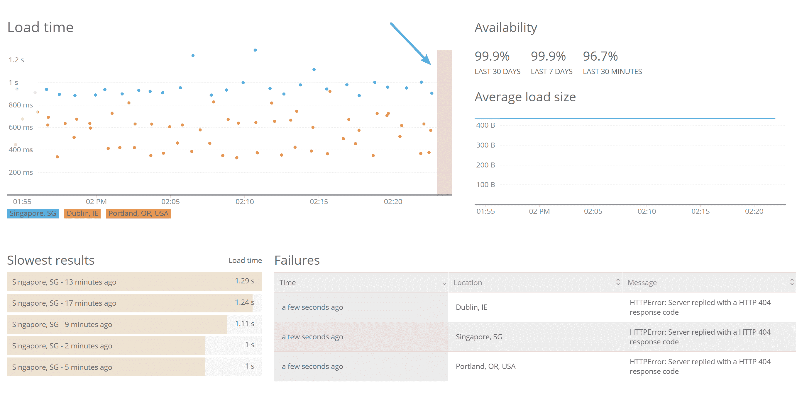

Uptime monitoring.


事实上，多亏了 [New Relic](https://kinsta.com/blog/wordpress-performance-new-relic/) Synthetics 和 [APM](https://kinsta.com/blog/apm-tools/) ，如果需要的话，我们也有能力监控相当多关于 WordPress 网站的不同数据点:

*   最终用户加载时间
*   应用服务器加载时间
*   错误率
*   吞吐量
*   成功率(正常运行时间)
*   [Apdex 分数](https://docs.newrelic.com/docs/apm/new-relic-apm/apdex/apdex-measuring-user-satisfaction)

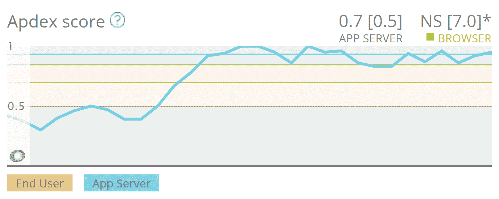

Apdex scores.


这涉及正常运行时间和性能监控。如果一个网站宕机，Kinsta 团队会比你先知道。如果我们监控的网站超出了可接受的内部性能阈值，我们也会联系您，帮助您解决网站的问题。

有时，这可能涉及拉拢第三方开发人员，尤其是如果糟糕的代码是来源。或者这可能意味着需要增加 PHP 工作人员。最后，这可能是容易解决的问题。

我们希望你成功，为你的访问者提供一个快捷的网站一直是我们最优先考虑的事情之一。如果我们能确定是插件 A 导致了你的网站关闭，我们希望你知道。我们经常会看到许多性能问题源于糟糕的插件更新、拙劣的代码或者不支持 PHP 的最新版本[等等。
T3】](https://kinsta.com/blog/php-versions/)

#### 正常运行时间和性能监控工具

如果您没有使用 Kinsta，仍然有许多第三方工具可以用来提醒您正常运行时间和性能。这里有一些你可能想看看:

*   [updown.io](https://updown.io/) (正常运行时间监控)
*   [Pingdom](https://www.pingdom.com/product) (正常运行时间和性能监控)
*   [运行时间机器人](https://uptimerobot.com/)(运行时间监控)
*   [状态记录](https://www.statuscake.com/our-pricing/)(正常运行时间和性能监控)
*   [ManageWP](https://managewp.com/) (正常运行时间和性能监控)

### 2.利用像 New Relic 这样的工具(它们是非常宝贵的)

像 [New Relic](https://newrelic.com/) 这样的工具不仅仅是用于监控正常运行时间和性能，它们对于解决源于的性能问题的**故障来说也是非常宝贵的。Kinsta 有一个新的遗留集成，允许用户轻松利用自己的许可证密钥。虽然这不包括在我们的托管中，但我们的支持团队可以在我们这边实现这一点，并在需要时帮助您跟踪问题。或者你可以尝试使用一个免费的插件，比如[查询监视器](https://wordpress.org/plugins/query-monitor/)。**

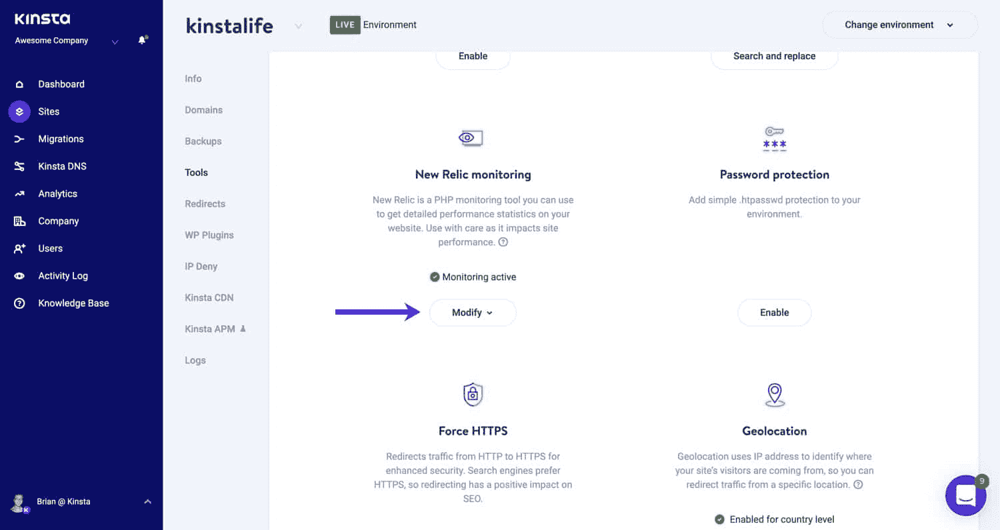

Enable New Relic monitoring in MyKinsta.


New Relic 中有几个地方可以帮助快速缩小性能问题。第一个是“WordPress →插件和主题”标签。在我的 woorkup 网站上，我今天用它作为案例研究，我可以立即看到我遇到的问题很可能来自我正在运行的“gp-premium”插件。但是为什么呢？好吧，我们会说到的。

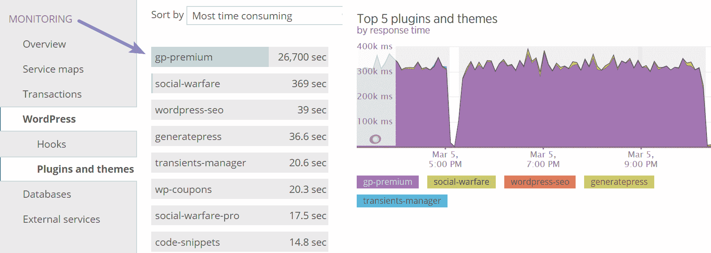

New Relic plugins and themes.


注意:新遗迹上面的部分并不总是 100%准确。在这种情况下，它是。但总是建议至少先去那里看看。

所以在看到它后，我有一种好的感觉或预感，这是我的“gp-premium”插件中的东西(这是我的[generate press WordPress theme](https://kinsta.com/blog/fastest-wordpress-theme/#generatepress)的扩展)。了解这一点后，我转到“交易”选项卡。我们可以立即看到，admin-ajax.php 的交易数量是通过屋顶！

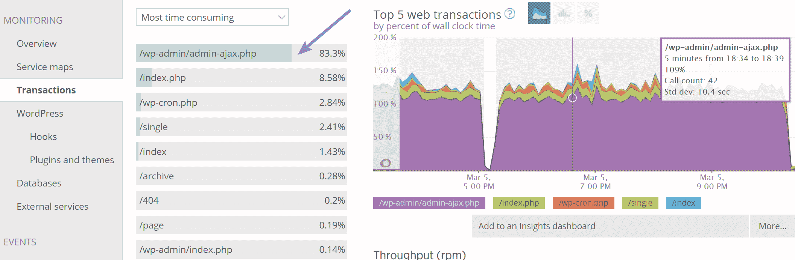

New Relic admin-ajax.php issue.


对于那些没有 New Relic 的人，一定要看看我们关于如何诊断你的 WordPress 站点上的[高 admin-ajax 使用率的伟大教程。我还可以在我的](https://kinsta.com/blog/admin-ajax-php/) [WordPress 日志](https://kinsta.com/knowledgebase/wordpress-error-log/)中看到持续的 admin-ajax 请求。您还可以利用我们内置的 [Kinsta APM 工具](https://kinsta.com/apm-tool/)。


WordPress error log admin ajax requests.


下一步是深入研究 admin-ajax.php 事务，查看消耗时间最多的数据库查询。您可以点击进入“跟踪详细信息”或“数据库查询”选项卡。

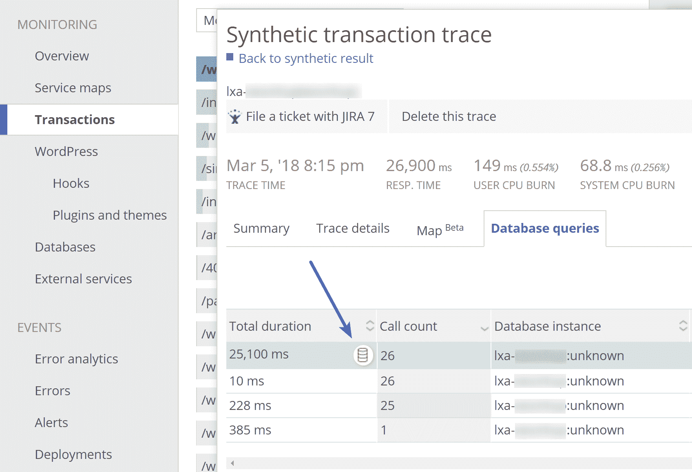

Database query trace.


有时，查询本身将是问题所在的指示器，但在这种情况下，它不是。但是立刻有别的东西脱颖而出，那就是`/gp-premium/`文件夹。记得从上面我们看到“gp-premium”应该是导致这个问题的插件。通常，如果你在插件/主题部分和跟踪部分都看到它，这是一个很好的指示，这是一个很好的开始。

```
…s/gp-premium/library/image-processing-queue/includes/wp-background-process.php
```

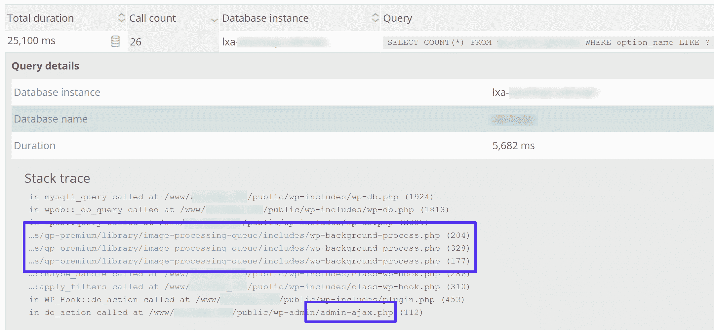

Stack trace.


下一步是去谷歌！是的，在这种情况下，谷歌确实很有帮助。

[Sometimes to debug #WordPress performance issues you have to do a little detective work. 🕵Click to Tweet](https://twitter.com/intent/tweet?url=https%3A%2F%2Fkinsta.com%2Fblog%2Fdebugging-wordpress-performance%2F&via=kinsta&text=Sometimes+to+debug+%23WordPress+performance+issues+you+have+to+do+a+little+detective+work.+%F0%9F%95%B5)

所以我搜索了“图像处理队列”返回的第一个结果是 Delicious Brain 的[图像处理队列](https://wordpress.org/plugins/image-processing-queue/)插件。在阅读描述时，我可以看到这是用于 WordPress 主题的图像处理。本质上，图像大小是使用 WP 队列在后台悄悄生成的。

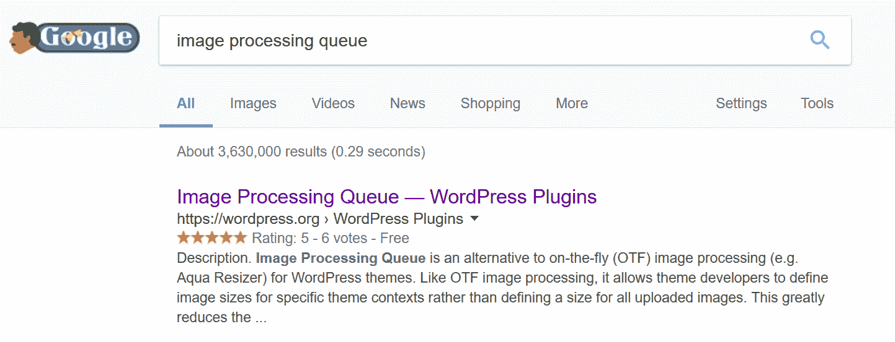

Image Processing Queue.


快速搜索这个词和“GeneratePress ”,会出现他们最近的[变更日志](https://generatepress.com/gp-premium-1-5-alphabeta/)。Tada！是的，最近在 GeneratePress 中图像缩放器已经从 Aqua Resizer 更改为图像处理队列。这是我更新我的主题的时候，我的网站上没有什么变化。这就是**为什么变更日志如此重要！**它们可以像面包屑一样用于故障排除。

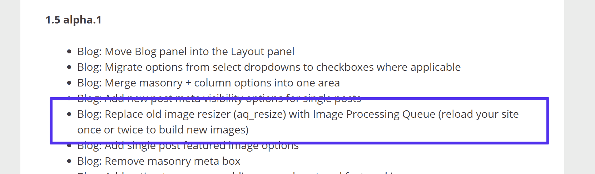

GP Update.


令人困惑的是，我有其他运行 GeneratePress 的网站没有这个问题。因此，虽然我可能对正在发生的事情有一个很好的线索，但我仍然不是 100%确定。所以下一步是拿出我的暂存环境开始[调试 WordPress](https://kinsta.com/blog/wordpress-debug/) 。
T3】

### 3.在不影响生产的情况下利用中转站点

老实说，如果没有暂存环境，我不知道该怎么办。当涉及到像这样的故障诊断问题时，它们非常方便。幸运的是，Kinsta 有易于使用的[暂存环境](https://kinsta.com/help/staging-environment/)。所以我跳进 MyKinsta 仪表板，将我的生产站点的一个副本推送到 staging。如果你的 WordPress 主机不提供 staging 环境，你也可以使用类似 [WP Staging](https://wordpress.org/plugins/wp-staging/) 的插件，尽管这并不容易。

[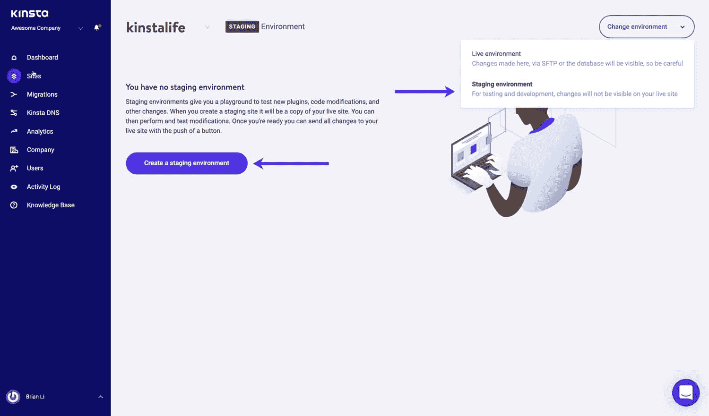](https://kinsta.com/wp-content/uploads/2019/01/mykinsta-create-staging-environment.jpg)

Create a WordPress staging environment.


在我建立并运行我的开发网站后，我做的第一件事就是批量禁用我所有的插件。我注意到很多人倾向于忽略这个简单的步骤。这几乎就像认为重启电脑不会解决问题。我以前在计算机支持部门工作，所以我们不会去那个兔子洞。🐰

重要的是**总是首先禁用你所有的插件。**这是目前最简单的缩小问题范围的方法之一。只需进入插件，选择所有插件，并从批量选项中选择“停用”。

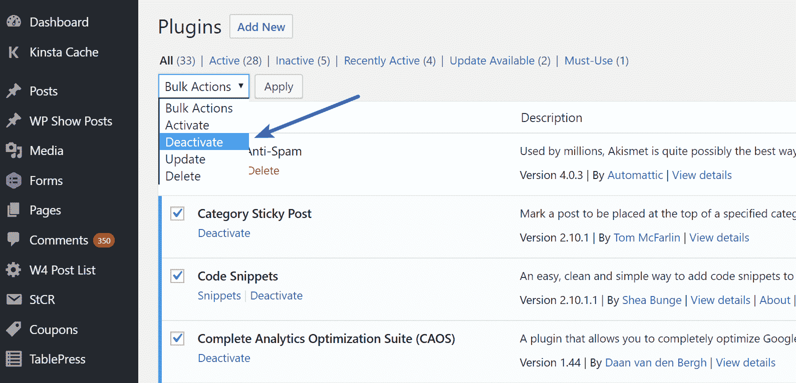

Disable all WordPress plugins.


在这样做之后，我的网站上 New Relic 的响应时间立即回落到正常水平。所以我知道是插件导致了这个问题。由于我已经在上面做了一些故障排除，我有预感它仍然是“gp-premium”插件。

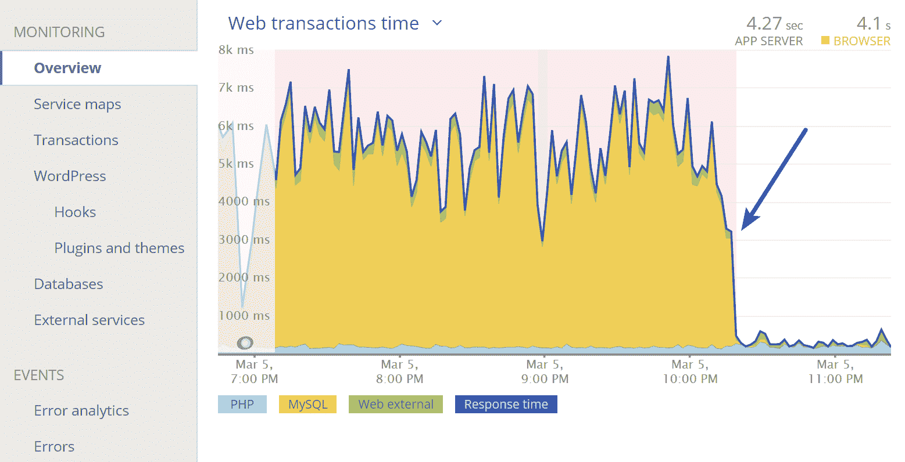

Normal response times.


所以我重新启用了“gp-premium”插件来验证我可以重现这个问题。是的，加载时间(web 事务时间)立即恢复了。

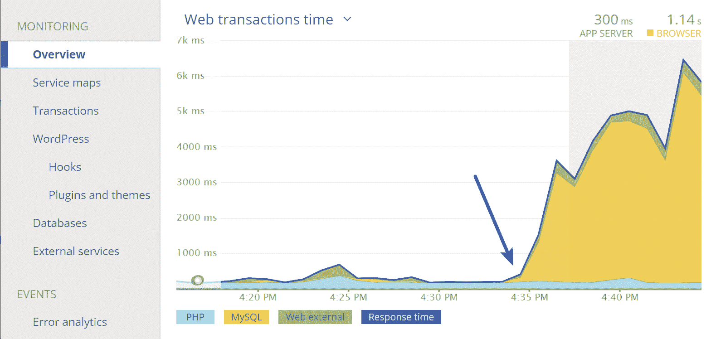

Long response times again.


太好了！所以我可以 100%确定这是插件。但是现在呢？这无助于解决我的问题。嗯，由于它似乎来自图像处理队列，下一个提示是检查 [CRON 作业](https://kinsta.com/knowledgebase/wordpress-cron-job/)和瞬态。每当您有任何类型的队列时，总是检查这些区域。事实上，我一直建议检查它们。[自动加载数据](https://kinsta.com/knowledgebase/wp-options-autoloaded-data/)也是另一个常见的原因。

## 注册订阅时事通讯


### 想知道我们是怎么让流量增长超过 1000%的吗？

加入 20，000 多名获得我们每周时事通讯和内部消息的人的行列吧！

[Subscribe Now](#newsletter)

建议阅读:[如何修复 WordPress 错过日程错误(2 种方法)](https://kinsta.com/knowledgebase/wordpress-missed-schedule/)。

[瞬态](https://codex.wordpress.org/Transients_API)是 WordPress 缓存的一种简单形式，附带到期时间。为了快速查看我的瞬变，我安装了 Pippin Williamson 的免费[瞬变管理器](https://wordpress.org/plugins/transients-manager/)插件。一启动它，又有什么东西立刻吸引了我的目光，那是一个名为`wp_image_processing_queue_process_lock`的短暂项目。“此外，它被设置为在 1 分钟内到期，新的不断出现。

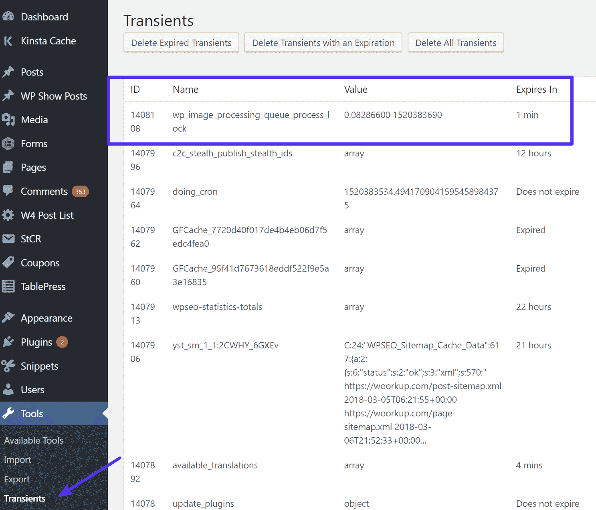

Transients.


虽然插件本身有删除瞬变的方法，但它不起作用。所以现在是时候查看数据库[和](https://kinsta.com/knowledgebase/wordpress-database/)了。于是我登录了 [phpmyadmin](https://kinsta.com/help/wordpress-phpmyadmin/) 。瞬态存储在`wp_options`表中，所以我从“Search”选项卡进行了快速查询，以找到包含该选项名称的任何行。

```
SELECT * FROM wp_options WHERE option_name LIKE '%wp_image_processing%'
```

呀！结果是**我有 695，846 行**和`%wp_image_processing%`。😲

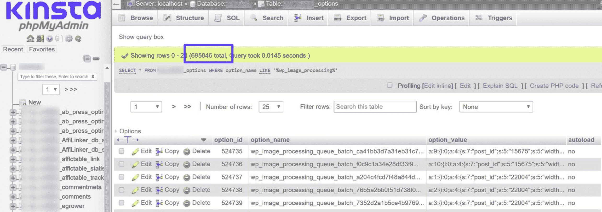

wp_image_processing.


这就是分期派上用场的地方。因为破坏或测试东西没有害处，所以我继续手动删除包含这个的所有行。我从“SQL”选项卡运行了以下查询，以删除包含此选项名称的所有行:

```
DELETE FROM wp_options WHERE option_name LIKE '%wp_image_processing%'
```

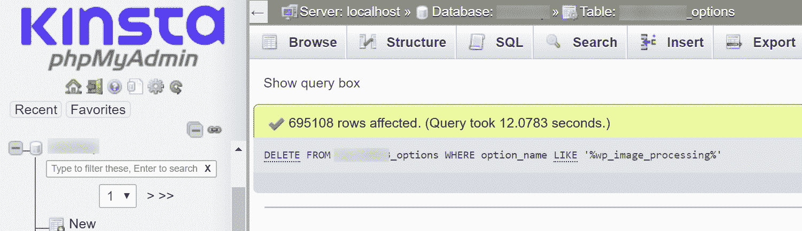

Delete rows.


就像变魔术一样，删除这些行之后，我的站点的响应时间马上恢复正常。👏

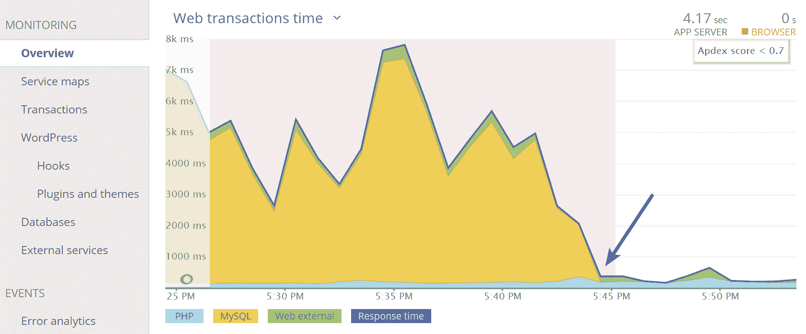

Fixed WordPress performance issue.


就像我之前说的，这并没有发生在我其他使用 GeneratePress 的网站上。他们在数据库中也没有那些额外的临时行。也许在升级的时候，有些东西没有被删除。因此，这似乎不是开发人员的错，而很可能只是临时缓存的损坏。

这可能发生在任何插件或主题上。事实上，GeneratePress 是我最喜欢的 WordPress 产品之一。害怕了吗？嗯，这些是伴随 WordPress 的一些乐趣！

如果您不理解以上任何一项，那么我强烈建议您在解决此类问题时，看看下面的其余步骤。


### 4.投资拥有世界一流支持的优质主机

类似上述的问题正是为什么投资一个像 Kinsta 这样的高级管理的 WordPress 主机很重要。

不像有些人可能会让你相信的那样，不存在能够神奇地修复糟糕代码的架构或主机。尽管我的 woorkup 网站位于 Kinsta，但像一个糟糕的插件更新这样的小事，或者在这种情况下，腐败的瞬变，都能让 WordPress 崩溃！这就是为什么我们有[自动备份](https://kinsta.com/help/wordpress-backups/)、[暂存环境](https://kinsta.com/help/staging-environment/)和新的遗留集成的一个原因。这些功能和工具有助于保护您的站点并快速解决问题。

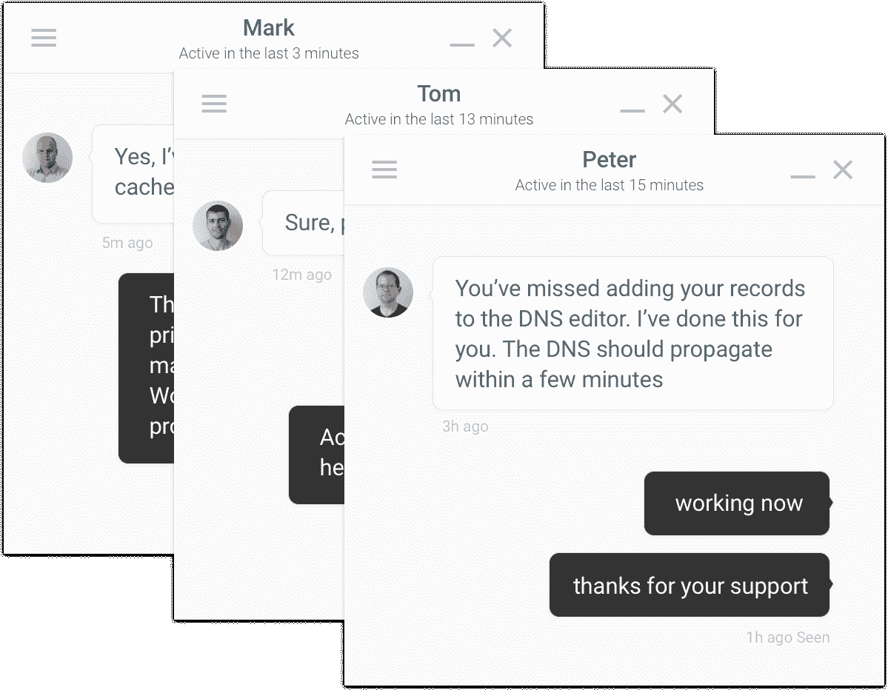

[WordPress support](https://kinsta.com/blog/wordpress-support/).


这也是我们在 Kinsta 的专家支持团队可以帮助你解决上述疯狂问题的地方。我们的支持团队每天都在处理像这样独特而复杂的问题。即使我们不能为您修复糟糕的代码，我们通常至少可以帮助您找到正确的方向。这可能涉及一个类似的过程，比如启用 New Relic，让它运行一段时间，然后让我们的团队暂时成为 WordPress 侦探。

Struggling with downtime and WordPress problems? Kinsta is the hosting solution designed to save you time! [Check out our features](https://kinsta.com/features/)

如果你不是 Kinsta 的客户，我们建议无论你选择什么主机，确保他们的支持团队是一流的！我们非常重视这一点，以至于申请加入我们团队的申请人不到 1%。

当然，基础设施在性能和不屈服于负载方面确实很重要。以下是 Kinsta 帮助您保持网站快速运行的几种方法，这样您就不会遇到性能问题:

*   我们利用隔离的 LXC 软件容器，这意味着没有资源共享。
*   我们允许客户从全球 20 个[数据中心](https://kinsta.com/knowledgebase/google-cloud-data-center-locations/)中进行选择，不收取额外费用。无论您身在何处，这都会减少延迟。
*   我们利用谷歌云平台的高级层网络(非标准层)。这确保了闪电般的网络速度。
*   我们总是实现最新最好的 PHP 版本。我们是第一个部署 PHP 7.2 的托管主机，它比 PHP 5.6 快 3 倍。我们也有可用的 PHP 7.3，它比 PHP 7.2 平均快 9%。 [PHP 8.1](https://kinsta.com/blog/php-8-1/) 现在也可以用了。查看我们的 [PHP 基准测试](https://kinsta.com/blog/php-benchmarks/)。
*   我们与一家专注于高性能的 CDN 提供商合作。

你可以查看 Kinsta 与众不同的所有其他[方面](https://kinsta.com/why-us/)。

### 5.需要更多帮助吗？有一个维修公司

在过去五年左右的时间里，一种新型的公司在这个行业中出现了。这些公司提供的服务与我们在 Kinsta 的服务略有不同，在某些情况下，它们可以接管你所有繁琐的 WordPress 任务。以下是几个例子:

*   [谷歌搜索控制台](https://kinsta.com/blog/google-search-console/)设置
*   [谷歌分析整合](https://kinsta.com/blog/google-analytics-wordpress/)
*   每周关键词排名报告+分析报告
*   社交媒体分析应用
*   移动+平板电脑优化
*   插件开发
*   无限制的编辑(没错，有些甚至会做一些小任务，比如更新你的 logo，添加 WooCommerce 产品等等)

是的，**很多都提供每日或每周的正常运行时间和性能监控**。下面是一些你应该看看的 [WordPress 维护](https://kinsta.com/blog/wordpress-maintenance/%E2%80%8E)公司。注意:我们非常重视我们的建议！

### 暴涨 WP

提供 WordPress 维护服务、支持和托管解决方案，为那些希望发展业务的人处理 WordPress。我们甚至与他们一起做了一个[案例研究](https://kinsta.com/clients/skyrocketwp/)，请务必看一看！

[](https://skyrocketwp.com/)

SkyrocketWP.


### WP-滋补品

WP-Tonic 为忙碌的企业主提供真正的精品礼宾支持和维护服务。没有时间解决你的 WordPress 问题？让 WP-Tonic 帮你搞定。他们还运行一个流行的播客，在播客中他们采访 WordPress 企业主和开发者，以获得行业内正在发生的内幕消息。一定要看看我们对他们的创始人的[采访。](https://kinsta.com/blog/interview-jonathan-denwood/)

[](https://www.wp-tonic.com/)

WP-Tonic.


### WP Buffs

WP 爱好者为严肃的网站所有者和白牌代理合作伙伴提供 WordPress 关怀计划。正如他们在自己的页面上所说:“向你的新 WP CTO 问好！”顺便说一句。 [WP Buffs](https://kinsta.com/clients/wp-buffs/) 由 Kinsta 自豪地主持。

[](https://www.wpbuffs.com/)

WP Buffs.


### 6.不要害怕向开发者提出问题

在你缩小了 WordPress 性能问题的原因之后，不要害怕向开发者提出这个问题！很多时候，开发人员非常乐意提供帮助，事实上，他们想知道什么时候会出问题，这样他们就可以为每个人推出补丁。

我联系了 GeneratePress 的开发者汤姆，他立刻回复了我，一如既往。我们把这个问题抛给了腐败的瞬变，但是正如你所看到的，他实际上正在改变他们的图像排队方法(部分原因就在于此)。所以你作为一个用户的反馈肯定可以帮助开发者做出更高层次的决定，关于在他们的插件或主题中什么可能是最好的实现或改变。

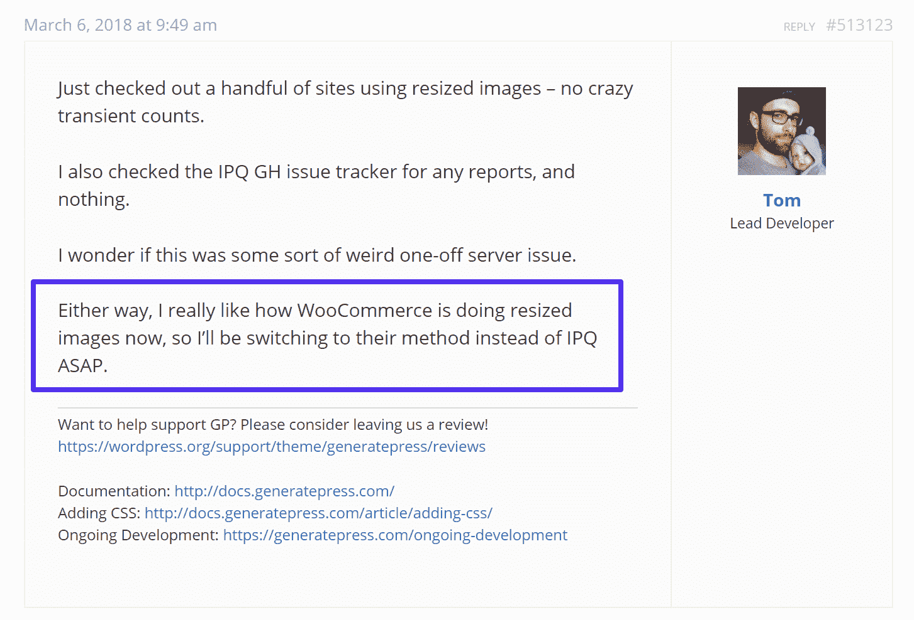

Response from WordPress developer.


### 7.你可以雇佣一个 WordPress 开发者

如果出现最坏的情况，你可以雇佣一个 WordPress 开发者来解决你的问题。也许你发现你正在使用的插件确实有一些坏代码，而创建者不能或不愿修复它。或者，您可能需要额外的性能优化，这超出了我们 Kinsta 支持团队的范围。

雇佣一个开发者最困难的部分是你如何找到一个声誉好并且擅长他们工作的人？

我们强烈推荐[可编码](http://codeable.io/),因为它们与我们在 Kinsta 团队使用的相同选择性流程相似。他们的开发人员在被允许加入服务之前都经过了预先筛选，由可编码的工作人员亲自审查[的投资组合](https://kinsta.com/blog/wordpress-portfolio-plugins/)和简历。他们有超过 25，000 个客户，只有 300 个 WordPress 专家。**只有 2%的申请者被录取。**他们只想要最好中的最好，这反过来可以为您节省大量的时间和客户的挫折感。

[](http://codeable.io/)

WordPress Developer jobs at Codeable.


他们致力于提供 WordPress 外包服务，并完全专注于为有才华的开发者和客户牵线搭桥。我们有幸采访了 Codeable 的首席执行官 Per Esbensen，看到他们致力于建立一个 WordPress 开发者社区，令人耳目一新。

我们还必须向专注于性能优化的全职可编码开发人员 Mike Andreasen 表示感谢，他帮助了许多在 Kinsta 进行复杂安装的客户，使他们的网站更上一层楼。

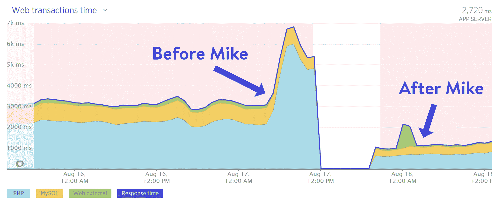

Web performance audit with Mike.


## 额外资源

在金斯塔，我们可能比大多数人更痴迷于性能。正因为如此，这里有一些我们写的额外的资源来帮助解决你的 WordPress 调试性能问题:

*   [用新的遗物发现 WordPress 的性能瓶颈](https://kinsta.com/blog/wordpress-performance-new-relic/)
*   [如何使用查询监视器](https://kinsta.com/blog/query-monitor/)
*   [如何消除渲染阻塞 JavaScript 和 CSS](https://kinsta.com/blog/eliminate-render-blocking-javascript-css/)
*   [如何修复利用浏览器缓存警告](https://kinsta.com/blog/leverage-browser-caching/)
*   [如何修复 500 内部服务器错误](https://kinsta.com/blog/500-internal-server-error/)
*   [如何修复 504 网关超时错误](https://kinsta.com/blog/504-gateway-timeout/)
*   [如何修复 502 坏网关错误](https://kinsta.com/blog/502-bad-gateway/)

## 摘要

无论你是否精通技术，当涉及到解决 WordPress 性能问题时，总有解决方案可供你使用。第一个显而易见的建议是，选择一个不仅拥有坚如磐石的基础设施，而且拥有世界级支持团队的托管服务提供商，为自己的成功做好准备。你最不希望发生的事情就是你的 WordPress 站点关闭或者开始爬行，仅仅是因为你不知道下一步该做什么。

利用像 New Relic 这样的令人惊奇的工具，它会在调试问题时简单地节省你的时间。说到底，社区里有很多有才华的 WordPress 开发者。不要害怕雇佣一个。

你有没有遇到过任何让你感觉像是认输的表现问题？如果有，请在下面的评论中告诉我们！

* * *

让你所有的[应用程序](https://kinsta.com/application-hosting/)、[数据库](https://kinsta.com/database-hosting/)和 [WordPress 网站](https://kinsta.com/wordpress-hosting/)在线并在一个屋檐下。我们功能丰富的高性能云平台包括:

*   在 MyKinsta 仪表盘中轻松设置和管理
*   24/7 专家支持
*   最好的谷歌云平台硬件和网络，由 Kubernetes 提供最大的可扩展性
*   面向速度和安全性的企业级 Cloudflare 集成
*   全球受众覆盖全球多达 35 个数据中心和 275 多个 pop

在第一个月使用托管的[应用程序或托管](https://kinsta.com/application-hosting/)的[数据库，您可以享受 20 美元的优惠，亲自测试一下。探索我们的](https://kinsta.com/database-hosting/)[计划](https://kinsta.com/plans/)或[与销售人员交谈](https://kinsta.com/contact-us/)以找到最适合您的方式。