# 如何改变你的 WordPress 域名(保持 SEO 优势)

> 原文:[https://kinsta.com/blog/wordpress-change-domain/](https://kinsta.com/blog/wordpress-change-domain/)

起初，改变域名似乎是一项令人望而生畏的任务，但事实并非如此。通常，这包括将流量从您的旧域(newdomain.com)路由到您的新域(newdomain.com)。许多人最大和有效的关注之一是如何在整个过程中保持 SEO 的好处(排名，流量，反向链接)，而不损害你的业务。

我们在 Kinsta 看到了很多这种类型的迁移，所以我们把下面这个深入的指南和你需要知道的关于如何安全地改变 WordPress 域名的所有东西放在一起，而不破坏你已经做的所有努力。👍

## 更改域名的原因

有很多不同的原因，你可能会想改变域名。以下是一些常见的例子:

*   你的企业从一个名字更名为另一个名字，你有了一个新的域名。
*   也许你使用的是一个不太受欢迎的顶级域名(TLD) (如[)。网](https://kinsta.com/knowledgebase/net-vs-com/)或者[。io](https://kinsta.com/knowledgebase/what-is-io/) )并最终获得了那个崭新而闪亮的。为您的业务。
*   将多处房产合并成一个区域。
*   你的旧域名正在遭受全网站范围的惩罚，你需要从头开始。

### 需要考虑的重要事项

当谈到改变你的域名，有一些警告和重要的事情要记住。

#### URL 结构

如果你只是改变域名，那么建议保持相同的网址结构。例子:`olddomain.com**/about-us/**`到`newdomain.com**/about-us/**`。理论上你可以同时改变名字和结构，但是一般来说，当涉及到 [SEO](https://kinsta.com/blog/what-does-seo-stand-for/) 的时候，改变越少越好。域名变更已经是一个相当大的变化了。😉

如果你的旧网站没有使用[漂亮的永久链接](https://kinsta.com/blog/wordpress-permalinks/)(这对 SEO 更好)，那么最好先换成你的新域名，等六个月，然后改变结构。

<link rel="stylesheet" href="https://kinsta.com/wp-content/themes/kinsta/dist/components/ctas/cta-mini.css?ver=2e932b8aba3918bfb818">

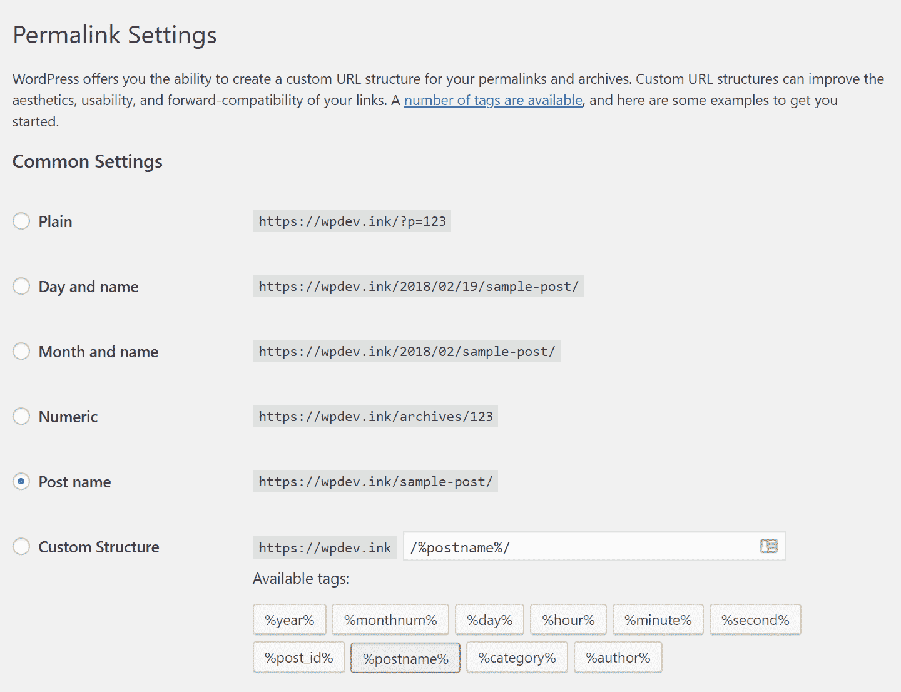

WordPress permalinks

#### HTTPS

如果你当前的网站运行在 HTTP 上，那么现在是迁移到 HTTPS 的最佳时机。这与改变你的整个 URL 结构略有不同，从长远来看，你会得到回报。截至 2018 年 7 月，谷歌 Chrome 开始**将所有非 HTTPS 网站标记为“不安全”**HTTPS 的其他好处包括加密，更好的推荐数据，使用 [HTTP/2](https://kinsta.com/learn/what-is-http2/) 的性能改进，它甚至是一个 SEO 排名信号。

你可以很容易地迁移到 HTTPS，而改变域名。

此外，如果你的网站已经在 HTTPS，**在继续之前为你的 301 重定向**制定一个计划是很重要的。这是因为客户端需要在看到重定向之前建立到主机的 SSL 连接。跳到我们的 [301 重定向部分](#301-redirects)，在那里我们会详细讨论这个问题。

#### 索引和爬网

当你改变你的 WordPress 域名时，如果你发现流量暂时有所下降，不要惊慌。这是正常的，因为谷歌需要几个星期来重新索引和抓取你的新网址。

[Changing your website's domain name can seem like a daunting task! 😳 But it doesn't have to be. Follow our in-depth guide.Click to Tweet](https://twitter.com/intent/tweet?url=https%3A%2F%2Fkinsta.com%2Fblog%2Fwordpress-change-domain%2F&via=kinsta&text=Changing+your+website%27s+domain+name+can+seem+like+a+daunting+task%21+%F0%9F%98%B3+But+it+doesn%27t+have+to+be.+Follow+our+in-depth+guide.&hashtags=SEO%2CWordPress) <kinsta-advanced-cta language="en_US" type-int-post="19850" type-int-position="0">## 如何改变 WordPress 域名

按照下面的步骤来改变你的 WordPress 域名。

1.  [备份你当前的 WordPress 站点](#backup-wordpress-site)
2.  [创建新站点，克隆或更新现有站点地址](#new-site-clone-update)
3.  [更新所有内部和硬编码链接](#update-internal-links)
4.  [添加 301 重定向](#301-redirects)
5.  [更新谷歌和必应的网页属性](#google-bing)
6.  [提交新的网站地图文件](#submit-sitemap)
7.  [更新谷歌分析和谷歌搜索控制台](#google-analytics)
8.  [杂项发布域名变更更新](#misc-updates)

### 1.备份当前的 WordPress 站点

在改变你的 WordPress 域名之前，你应该做的第一件事就是备份你当前的站点。这样，无论发生什么，如果需要，您都可以随时恢复。

#### 选项 1–针对 Kinsta 客户端的一键式备份

如果你是 Kinsta 的客户，你可以在你的 MyKinsta 仪表板上使用我们简单的备份工具。在“站点”部分选择您的站点，然后单击“备份”选项卡。您将看到可用备份的列表。只需点击“立即备份”，选择一个备份名称(如 beforedomainchange)，它将创建一个额外的备份/还原点。

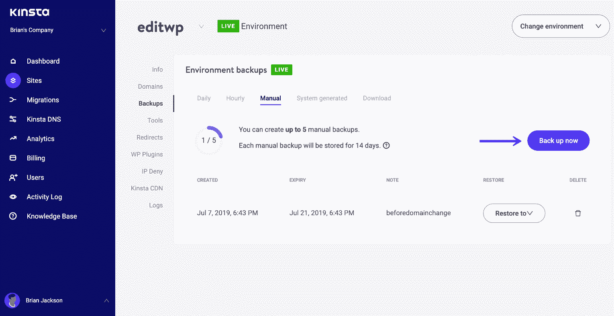

Create WordPress backup

然后你可以在任何时候通过点击[恢复你的备份](https://kinsta.com/help/wordpress-backups/#restoring-backups)。

#### 选项 2——用 WordPress 插件备份你的网站

你也可以用第三方插件来备份你的 WordPress 站点。我们总是建议使用那些具有**增量备份选项**的备份。尽管对于本教程来说，您可能不需要增量特性，但是您应该熟悉这些特性或者进行长期投资，因为增量特性减少了服务器负载、磁盘空间，并且有助于提高可靠性。以下是推荐的插件列表:

*   [VaultPress](https://vaultpress.com/) (溢价)
*   [管理 WP 备份](https://managewp.com/features/backup)(高级)
*   [WP Time Capsule](https://wordpress.org/plugins/wp-time-capsule/) (高级版中的增量选项)

或者如果你只是想要一个一次性的备份，你可以使用免费的复制插件和[创建一个本地存档备份](https://kinsta.com/help/migrate-wordpress-duplicator-plugin/#creating-archive)。

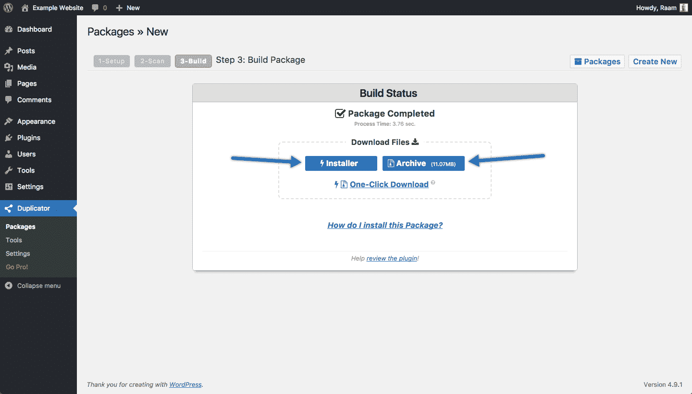

Create WordPress backup with the Duplicator plugin

#### 选项 3-手动备份你的 WordPress 站点

你的第三个选择是手动备份你的 WordPress 站点，方法是[导出你的 MySQL 文件](https://kinsta.com/knowledgebase/mysql-backup-database/)，通过 SFTP 连接到你的站点并下载你的文件。除非你有特殊的配置，通常你只需要下载你的`/wp-content/`文件夹(因为这包含你的插件、主题和上传的媒体)。

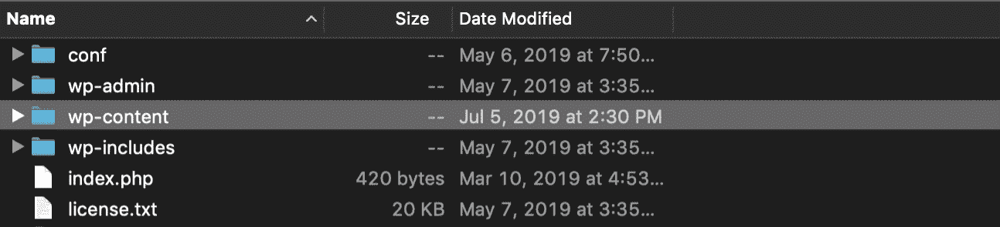

WordPress wp-content folder

如果您是 Kinsta 客户，您还可以从 MyKinsta 仪表板中创建整个站点(MySQL 文件和文件)的手动备份。点击“备份”，然后点击“下载”点击“立即创建备份”,您将收到一封电子邮件，其中包含您的。zip 存档文件。

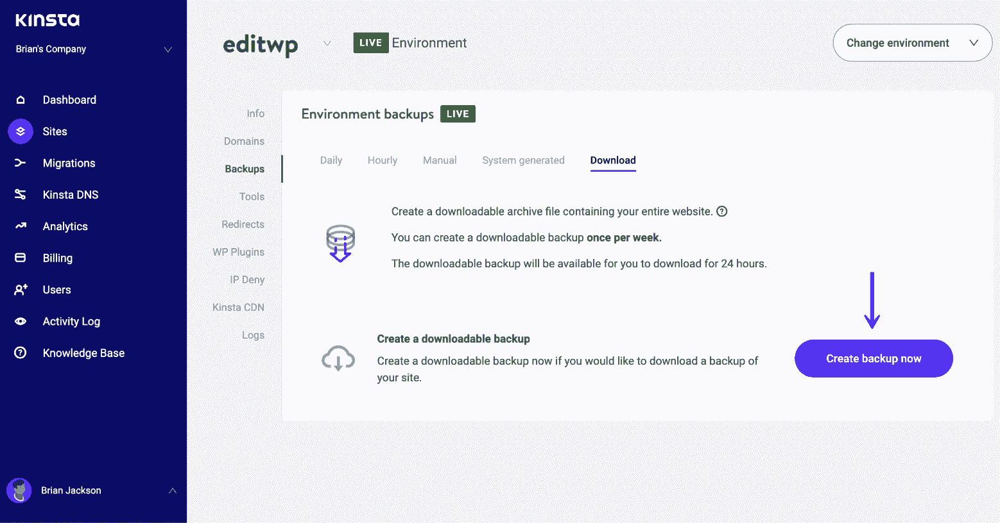

Create manual WordPress backup

### 2.创建新站点，克隆或更新现有站点地址

一旦你有了网站的备份，下一步就是更新你的 WordPress URL 和网站地址。有几种方法可以解决这个问题。

*   **选项 1**–[创建新站点](#create-new-site)
*   **选项 2**–[用 Kinsta 克隆你的网站](#clone-site)
*   **选项 3**–[更新现有域名](#update-existing-site)

#### 选项 1–创建新站点/帐户

你的第一个选择是用你的新域创建一个全新的 WordPress 安装，然后迁移你的数据。然后，您会在事后更改域。为什么采用这种方法？有时候，人们更愿意让他们的旧网站保持完整一段时间，作为另一个备份。或者在这个过程中，你也可能转移到一个新的 WordPress 主机上。

在这种情况下，您只需创建第二个站点。如果你是一个 Kinsta 客户端，你会希望[添加一个新的安装](https://kinsta.com/help/new-site/)并确保你的新域被设置为主域。然后你可以[迁移你的 WordPress 站点的副本](https://kinsta.com/blog/wordpress-migration-plugins/)过来。使用 [WordPress 复制插件](https://kinsta.com/help/migrate-wordpress-duplicator-plugin/)查看我们的深入教程。

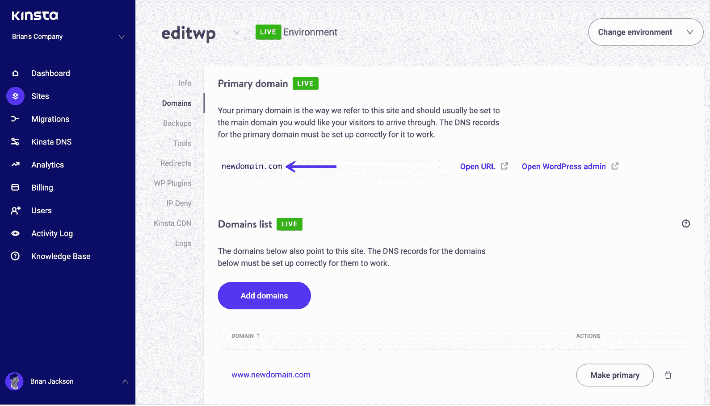

Kinsta primary domain

#### 选项 2–Kinsta 的克隆功能

如果你是 Kinsta 的客户，你可以走一条更简单的路线，利用我们的一键式克隆功能。这允许你立即创建一个现有 WordPress 站点的副本到第二个帐户。

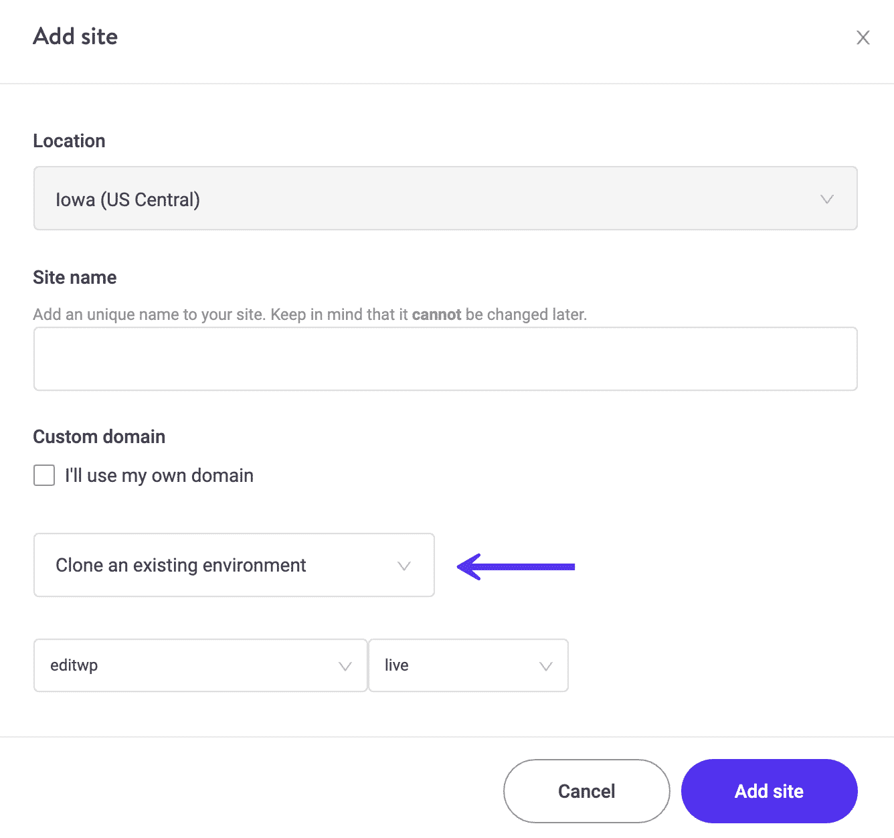

Clone WordPress site

#### 选项 3-更新现有的 WordPress URL 和网站地址

第三个也是最后一个选择是简单地更新你现有站点的 WordPress URL 和站点地址。即使您在上面创建或克隆了一个新站点，您仍然需要遵循这些步骤。

编辑这些值时要小心，因为如果输入错误，可能会导致整个网站瘫痪。在左侧的“设置”下，点击“常规”然后，您可以更新以下内容:

*   你的 WordPress 核心文件的地址。
*   **站点地址(URL):** 到达你的博客的地址。

两者应该匹配，除非你[给 WordPress 自己的目录](https://codex.wordpress.org/Giving_WordPress_Its_Own_Directory)。记住，点击“保存更改”后，你的 WordPress 仪表盘现在只能通过新域访问。

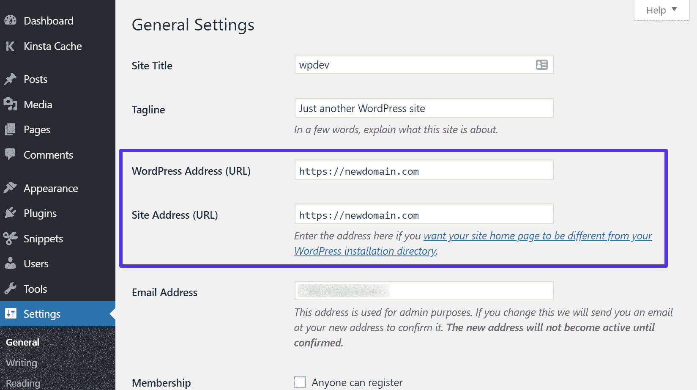

Update WordPress address and site URL

查看更新这些值的其他方法[，比如用你的 wp-config.php 文件，直接在](https://kinsta.com/knowledgebase/wordpress-change-url/) [WordPress 数据库](https://kinsta.com/knowledgebase/wordpress-database/)中，或者用 WP-CLI。
<kinsta-advanced-cta language="en_US" type-int-post="19850" type-int-position="1"></kinsta-advanced-cta>

### 3.更新所有内部链接和硬编码链接

现在你已经把你的 WordPress 站点地址和 URL 改成了新的域名，是时候更新你所有的内部链接和硬编码链接了。一般来说，不建议对 URL 进行硬编码，但是随着时间的推移，你很可能会这样做，我们都会这样做。这包括你自己的内容、媒体之间的链接，你网站上 JavaScript 和 CSS 的链接，等等。下面是几个更新链接的选项。

#### 选项 1–Kinsta 搜索和替换工具

如果你是 Kinsta 的客户，我们的 MyKinsta 仪表板上有一个易于使用的[搜索和替换工具](https://kinsta.com/knowledgebase/wordpress-search-and-replace/)。

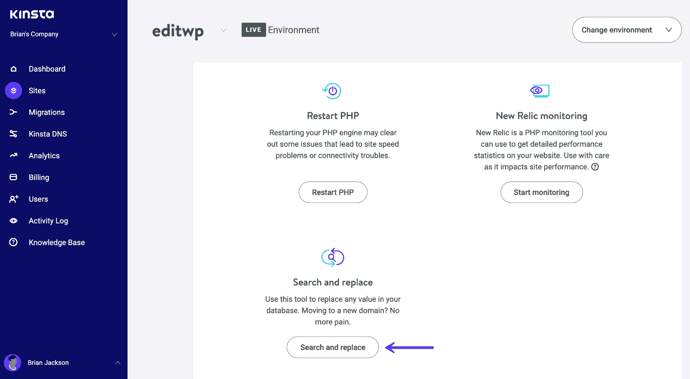

Kinsta search and replace tool

以下是将旧域更新到新域的简单步骤:

1.  在**搜索字段**中输入您想要在数据库中搜索的值，在本例中是我们的旧域:`https://olddomain.com`。(确保使用正确的协议:HTTP://或 HTTPS://)
2.  在**替换字段**中输入用于替换您正在搜索的值的新值。在这种情况下，它是我们的新域名:`https://newdomain.com`。
3.  确保首先选择“**试运行**”选项，因为这将计算在没有实际进行更换的情况下将进行多少次更换。然后点击“替换”
4.  然后，您可以在不选择模拟运行的情况下再次运行“替换”来对数据库进行更改。

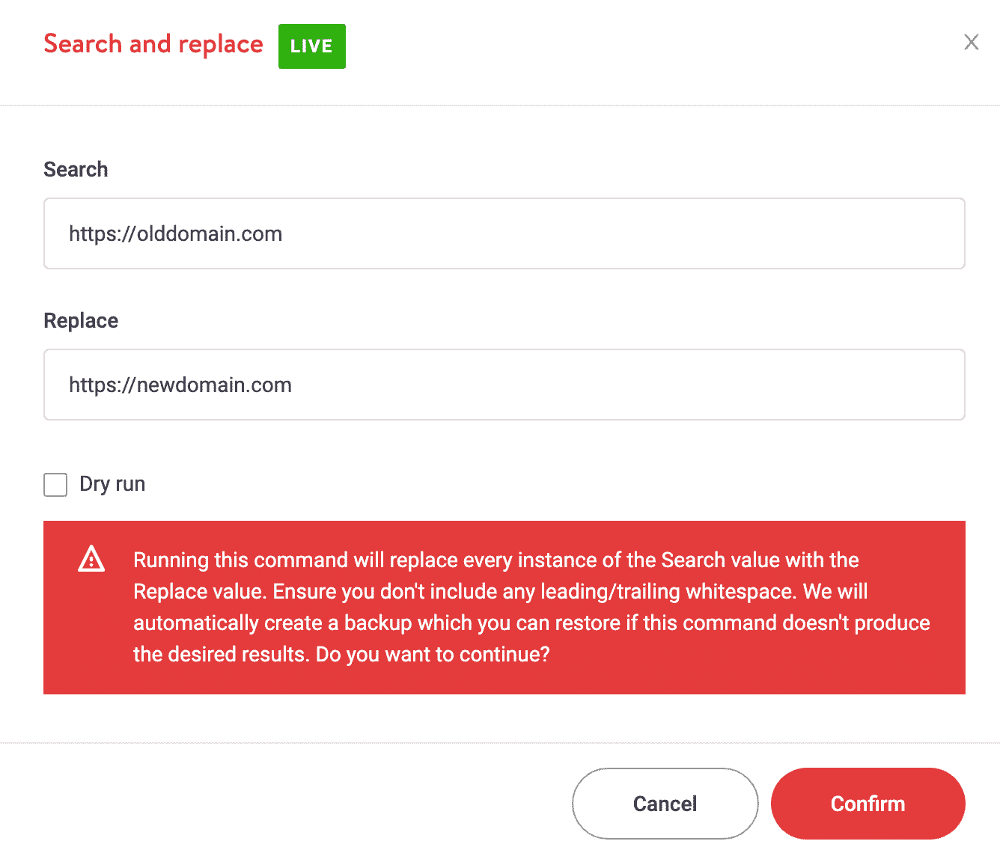

Search and replace in WordPress database

查看我们的[搜索和替换教程](https://kinsta.com/knowledgebase/wordpress-search-and-replace/#kinsta-search-replace-tool)了解更多细节。如果您需要这方面的帮助，您可以随时联系我们的支持团队。

#### 选项 2——用 WordPress 插件更新链接

你可以使用的另一个简单方法是一个叫做 [Better Search Replace](https://wordpress.org/plugins/better-search-replace/) 的免费插件，由 [Delicious Brains](https://deliciousbrains.com/) 的 WordPress 团队开发。简单地安装它，进入你的旧域名和新域名，你就大功告成了！

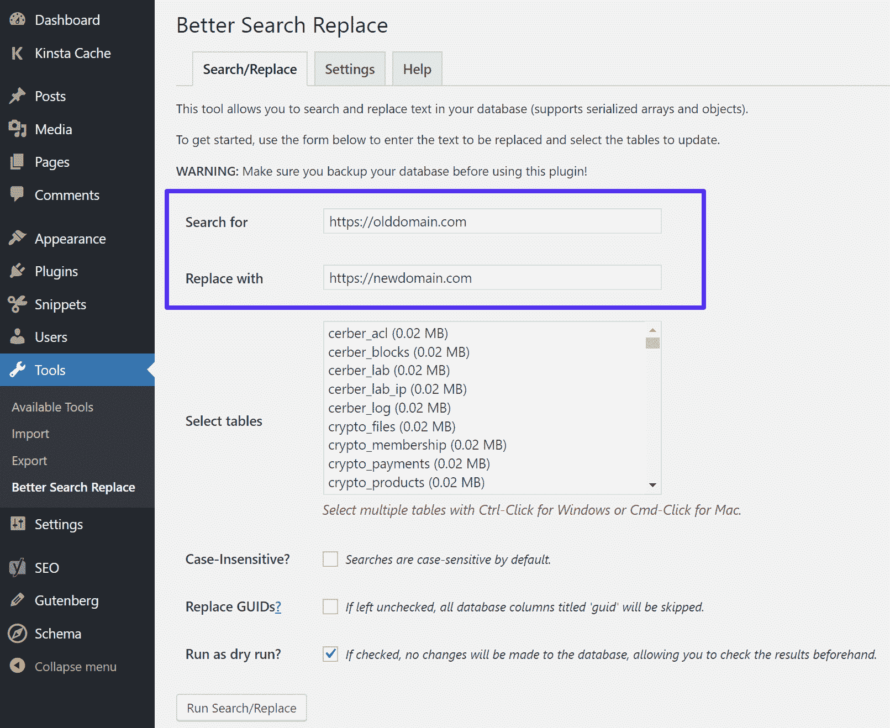

Update domain with Better Search Replace

#### 选项 3–使用 WP-CLI 进行搜索和替换

对于不喜欢离开命令行的技术人员和开发人员，您也可以使用 [WP-CLI](https://kinsta.com/blog/wp-cli/) 更新您的链接。我们建议查看这个高级的[搜索和替换 WP-CLI 指南](https://guides.wp-bullet.com/advanced-wordpress-database-https-search-replace-with-wp-cli/)。

#### 更新您的 CDN

如果你使用的是 CDN 和 CNAME，比如 cdn.domain.com，你可能还想再次运行我们上面分享的步骤，但是这次要替换你自定义的 CDN URL。这是因为有时在复制和粘贴的过程中，东西会被意外地硬编码。

 ## 注册订阅时事通讯

### 想知道我们是怎么让流量增长超过 1000%的吗？

加入 20，000 多名获得我们每周时事通讯和内部消息的人的行列吧！

[Subscribe Now](#newsletter)

将`https://cdn.olddomain.com`替换为`https://cdn.newdomain.com`。

由于您的域名已经更改，您很可能还需要[为您的 CDN 添加一个新的 CNAME](https://kinsta.com/help/dns/#cname-record) DNS 记录。

### 4.添加 301 重定向

接下来，是时候添加 301 重定向了。这是迄今为止域名变更最重要的部分之一。这可以确保来自旧域(newdomain.com)的所有流量自动路由到新域(newdomain.com)。以下是 301 重定向如此重要的几个原因:

*   随着时间的推移，人们会反向链接到你的网站和内容。反向链接被谷歌用作排名信号。因此，你不想失去任何他们称之为“链接果汁”的东西换句话说，链接具有权威性，如果你突然失去了它们，可能会严重损害你网站的搜索引擎优化，并且需要很长时间才能恢复。根据许多 SEO 和案例研究，301 重定向通过了 90-99%的链接。
*   除了关于反向链接的 SEO，重定向对于可用性也很重要。你最不希望看到的就是有人点击了一个反向链接，然后他们就不再访问你的网站了。断开的链接从来都不是好事。
*   社交信号是另一种排名因素，尽管有些人可能不同意这一点。不管怎样，从社交媒体网站如 Pinterest 或 Twitter 到你的网站的链接突然不能用了是不好的。

如果你不添加重定向，毫无疑问会损害你的网站。

> 令人失望的几个月…客户端移动域名不会重定向以前的域名。更糟糕的是，他们让旧域名过期&它已经被别人抢去了。我们给了他们大量的警告…它有一百万个链接指向它😱[pic.twitter.com/Zbd0hC44W2](https://t.co/Zbd0hC44W2)
> 
> —威尔·奥哈拉👨🏽‍💻(@ willo hara)[2019 年 5 月 26 日](https://twitter.com/willohara/status/1132750204661305351?ref_src=twsrc%5Etfw)</kinsta-advanced-cta>