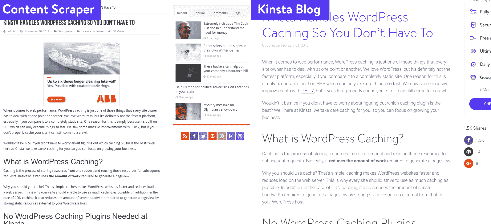
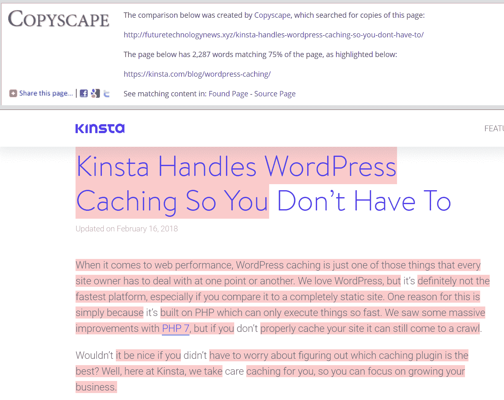
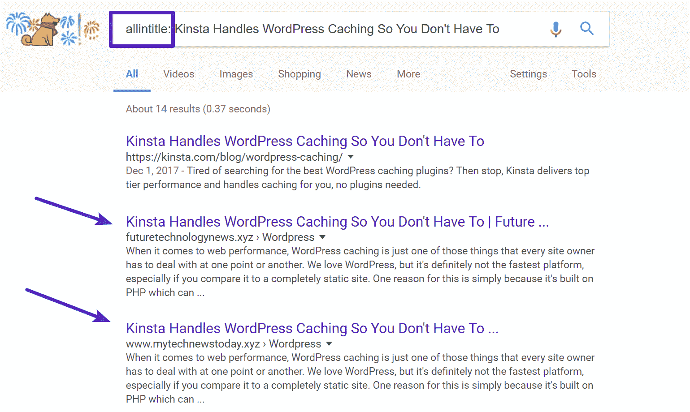
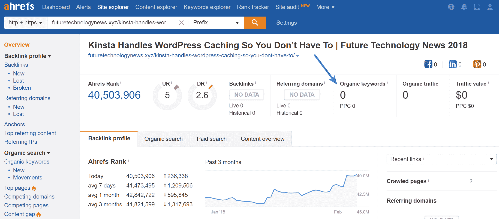
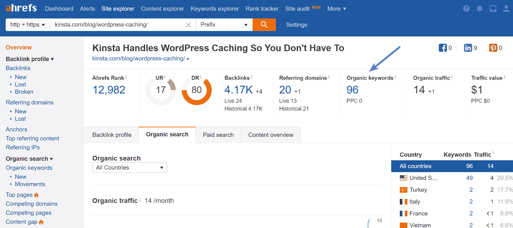
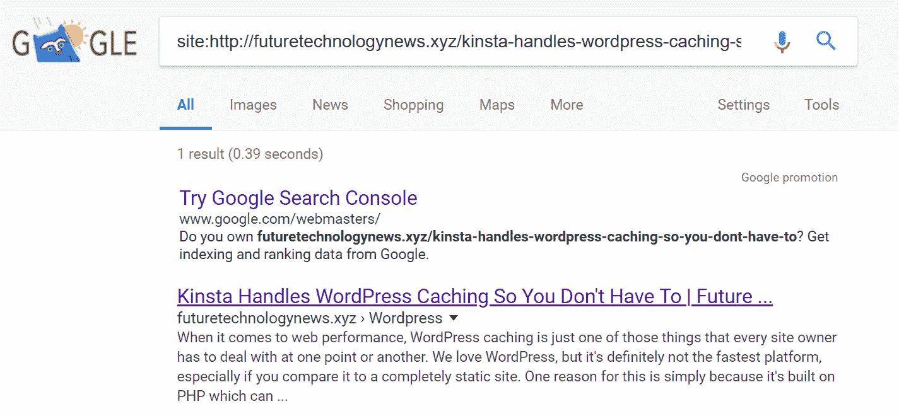
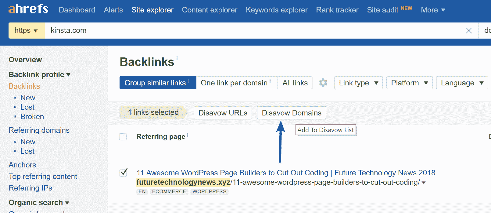
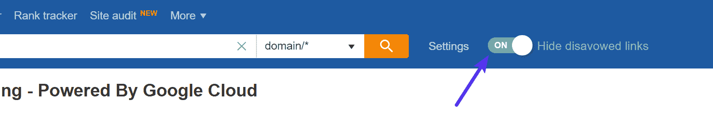
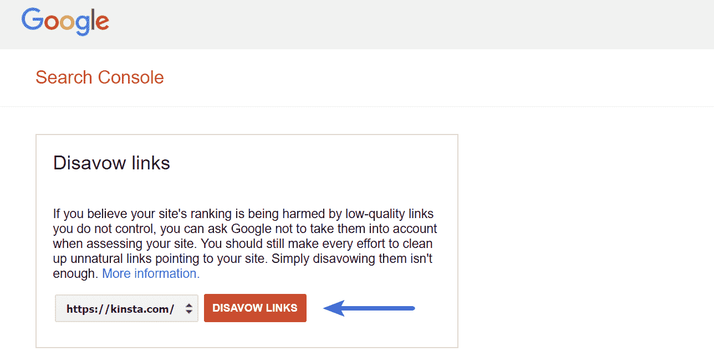
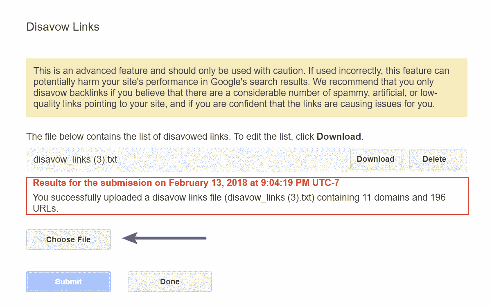

# 内容抓取:反击还是无视？

> 原文：<https://kinsta.com/blog/content-scraping/>

内容抓取，或者我们喜欢称之为“**内容窃取**”，自互联网出现以来就一直是个问题。对于任何定期发表文章或从事搜索引擎优化(SEO)的人来说，这实际上是非常令人恼火的。😠你成长得越大，你就会越注意到有多少内容抓取农场。我们在 Kinsta 发布大量内容，内容抓取是我们经常处理的问题。问题是，你是应该努力反击，还是干脆无视他们，继续前进？今天我们将深入探讨双方的一些利弊。

## 什么是内容抓取？

内容抓取基本上是指某人获取你的内容并在他们自己的网站上使用(手动或通过插件或机器人自动使用)，而不给你任何归属或信用。这通常是希望以某种方式获得流量，搜索引擎优化，或新用户。这实际上违反了美国和其他一些国家的版权法。谷歌也不会宽恕这一点，并建议你应该创建自己独特的内容。

这里有几个谷歌提到的抓取内容的[例子:](https://support.google.com/webmasters/answer/2721312?hl=en&ref_topic=6001971)

*   从其他网站复制和重新发布内容的网站**，而不添加任何原始内容或价值**
*   从其他网站复制内容的网站，**稍微修改它**(例如，通过替换同义词或使用自动化技术)，并重新发布它
*   从其他站点复制内容源的站点，但不向用户提供某种类型的独特组织或好处
*   致力于嵌入内容(如视频、图像或来自其他网站的其他媒体)的网站，对用户没有实质性的附加值

这不要与[内容聚合](https://www.brafton.com/blog/distribution/the-dos-and-donts-of-syndicating-your-content/)混淆，后者通常是指你重新发布自己的内容以获得更广泛的影响。辛迪加内容也可以由第三方完成，但这和内容抓取之间有一条细微的界限。如果有人在联合发布内容，应该总是使用特殊的标签，如`rel=canonical`或`noindex`。

现在有很多第三方 WordPress 插件可以让你自动抓取第三方 [RSS 提要](https://kinsta.com/blog/wordpress-rss-feed/)。不幸的是，虽然开发人员的意图是好的，但有时会被滥用，用于内容抓取。WordPress 如此受欢迎的原因之一是易于使用，但有时也会适得其反。

[内容抓取和内容聚合之间只有一线之隔。总是在该表扬的地方给予表扬。👍 点击推文](https://twitter.com/intent/tweet?url=https%3A%2F%2Fbit.ly%2F3irk1Nr&via=kinsta&text=There+is+a+fine+line+between+content+scraping+and+content+syndication.+Always+give+credit+where+credit+is+due.+%F0%9F%91%8D&hashtags=inbound%2Ccontentmarketing)

### 内容抓取场的实例

当同一个所有者在几十个网站上抓取内容时，我们称之为“农场”。这些通常很容易发现，因为网站所有者通常在所有网站上使用相同的主题，甚至只是域名之间的轻微变化。

> Kinsta 把我宠坏了，所以我现在要求每个供应商都提供这样的服务。我们还试图通过我们的 SaaS 工具支持达到这一水平。
> 
> <footer class="wp-block-kinsta-client-quote__footer">
> 
> 
> 
> <cite class="wp-block-kinsta-client-quote__cite">Suganthan Mohanadasan from @Suganthanmn</cite></footer>

[View plans](https://kinsta.com/plans/)

我们在今天的帖子里用了一个活生生的例子！我们毫不羞愧地指出这些类型的网站，因为它们不提供任何价值，只会否定内容出版商所做的努力。这是一个内容抓取场的例子。我们对每个链接都进行了存档，以防将来网站关闭。你可以点击他们中的每一个，看到他们都使用相同的主题，和相同的内容。典型的抓取器会从很多不同的来源抓取内容，我们的博客就是其中之一。

*   thetechworld.xyz ( [存档链接](https://web.archive.org/web/20180302022803/http://thetechworld.xyz/)
*   mytechnewstoday.org([存档链接](https://web.archive.org/web/20180302022803/http://mytechnewstoday.org/))
*   mytechcrunch.com([存档链接](https://web.archive.org/web/20180221001459/http://mytechcrunch.com))
*   technewssites.xyz ( [存档链接](https://web.archive.org/web/20180213231451/http://technewssites.xyz))
*   technewssites.info ( [存档链接](https://web.archive.org/web/20180302022806/http://technewssites.info/)
*   www.thetechworld.info ( [存档链接](https://web.archive.org/web/20180302022806/http://www.thetechworld.info/))
*   www.mytechnewstoday.xyz ( [存档链接](https://web.archive.org/web/20180224153255/http://www.mytechnewstoday.xyz/))
*   www . future technology news . info([存档链接](https://web.archive.org/web/20180302022808/http://www.futuretechnologynews.info/))
*   futuretechnologynews.xyz ( [存档链接](https://web.archive.org/web/20180224153312/http://futuretechnologynews.xyz/))

你可以在下面看到，他们**只是逐字抓取我们的博客文章**，以及我们在上述所有领域的所有文章。

Example (click to view larger) – Content scraper blog post: [archived link](https://web.archive.org/web/20180303181226/http://futuretechnologynews.xyz/kinsta-handles-wordpress-caching-so-you-dont-have-to/) / Kinsta [original blog post](https://kinsta.com/blog/wordpress-cache/)

## 如何找到他们？

找到它们的一个最简单的方法是利用像 [Copyscape](https://www.copyscape.com/) 或 [Ahrefs](https://ahrefs.com/) 这样的工具(如果他们也在复制你的内部链接的话)。Copyscape 甚至允许你提交你的站点地图文件，并让它在扫描网页并找到内容时自动通知你。

Copyscape

你也可以使用“allintitle”标签手动搜索谷歌。只需输入标签和文章标题。例子:allintitle: Kinsta 处理 WordPress 缓存，所以你不必

Search Google with allintitle tag

allintitle 关键字提示 Google 只在文章标题中搜索这些词。第二种也是更有效的方法是在你的文章中搜索一些文本，搜索词用双引号括起来。加上双引号告诉 Google 搜索完全相同的文本。你的标题搜索可能会得到误报，因为有人可能会使用相同的标题，但第二种方法更有效，因为某人几乎不可能有完全相同的句子或段落。

## 内容抓取会影响 SEO 吗？

你可能会问的下一个问题是，这对 SEO 有什么影响？因为在上面的例子中，内容抓取农场没有使用`rel=canonical`标签、给予信用或`noindex`标签。这意味着当谷歌机器人抓取它时，它会认为这是他们的原创内容。**你可能会认为这不公平。你说得对，不是。**我们发布了内容，然后他们就把它删掉了。然而，在你开始恐慌之前，重要的是要了解幕后到底发生了什么。

首先，尽管谷歌爬虫可能会把它视为他们的内容，但谷歌算法很可能不会。谷歌并不愚蠢，它有许多规则和检查来确保原创内容所有者仍然得到荣誉。我们是怎么知道的？好吧，让我们从 SEO 的角度来看看这些帖子。

这个人早在 2017 年 11 月就抓取了我们的博客帖子，所以如果它打算排名的话，它有足够的时间来排名。因此，我们使用我们的便捷工具 Ahrefs T1 来查看他们的帖子当前的关键词排名。我们可以看到**没有对任何关键词**进行排名。所以就有机流量而言，他们根本不会从这篇文章中受益。

Content scraping SEO

如果我们在 Ahrefs 中调出我们的原始博客帖子，我们可以看到我们对 96 个关键词进行了排名。

Original content SEO

当谷歌看到你可能认为是重复的内容时，它会使用许多不同的信号和数据点来找出最初是谁写的内容，以及应该对哪些内容进行排名。这里有几个例子:

*   发布日期(尽管在这种情况下，内容是在同一天抓取的)
*   域名权威和页面排名。是的，谷歌可能还在内部使用页面排名
*   社交信号
*   交通
*   反向链接

同样，这些都是安全的假设，因为没有人真正知道谷歌用的是什么。但这里的要点是，你可能不需要因为有人抓取你的内容而失眠。然而，你可能还是想做点什么。别人用你自己的内容超过你也不是不可能的。我们将在下面进一步讨论这个问题。

## 注册订阅时事通讯

### 想知道我们是怎么让流量增长超过 1000%的吗？

加入 20，000 多名获得我们每周时事通讯和内部消息的人的行列吧！

[Subscribe Now](#newsletter)

## 我们如何处理内容抓取

创造有用的、独特的、值得分享的内容并不容易，它会占用你很多宝贵的时间(通常会花很多钱)，所以你一定要保护它。但是这里有一些你可能不想忽略刮刀的其他原因。

1.  如果一个有大量流量的网站抓取你的内容，并用它来补充他们的其他内容，很可能他们从中受益。这肯定是不对的，因为你是内容的原始所有者。
2.  诸如此类的事情会严重扭曲您的报告工具中的数据，让您的生活更加艰难。例如，**这些将在 Ahrefs 或 Majestic 等工具的反向链接报告**中显示。你越大，事情就越乱。
3.  你想完全信任谷歌来判断是他们的还是你的是原创内容吗？尽管他们在这一点上相当聪明，但我们肯定不知道。此外，尽管他们的帖子没有任何关键字的搜索引擎排名，但它实际上是被谷歌索引的(如下所示)。

Scraped content is indexed

### 联系网站所有者并提交 DMCA 投诉

为了确保我们得到信用，我们通常首先联系网站的所有者，要求删除。我们建议创建几个电子邮件模板，你可以重复使用，以加快这个过程，而不是浪费你的时间。如果我们试了几次都没有收到他们的回复，我们会进一步向 DMCA 投诉。

DMCA 投诉可能有点棘手，因为你需要查找网站的 IP 地址，找到主机等。但不用担心，我们有关于如何轻松提交 DMCA 投诉的所有步骤的文档，以及追踪所有者。你也可以直接向谷歌提出[合法删除请求](https://support.google.com/legal/answer/3110420)。

就上面的实际案例研究而言，看起来是时候采取下一步行动了，因为我们还没有联系到网站所有者。😩

### 更新否认文件

为了确保这些不会以任何方式影响我们的网站(不管 DMCA 的投诉发生了什么)，我们还**将这些完整的域名添加到我们的否认文件**中。这告诉谷歌我们不想和他们有任何瓜葛，我们也不想以任何方式操纵 SERPs。

Struggling with downtime and WordPress problems? Kinsta is the hosting solution designed to save you time! [Check out our features](https://kinsta.com/features/)

如果你是为了一个更高质量的网站这样做，你也可以只提交否认的 URL，而不是整个域。虽然通常我们不会看到高质量的网站抓取内容。

#### 第一步

在 Ahrefs 中，我们选择有问题的域，然后单击“dis away Domains”这确保了这个内容抓取网站上的任何内容都不会影响我们。

Ahrefs disavow domain

Ahrefs 在处理这类问题时最大的优点是他们的“隐藏否认链接”选项。然后，它会自动隐藏域名和网址，使其不会出现在您的主报告中。这对组织和保持你的理智非常有帮助，特别是如果你专门使用 Ahrefs 来管理你的反向链接。👍

Hide disavowed links

#### 第二步

正如你在下面看到的，我们将内容抓取场中的所有域都添加到了 Ahrefs 中的否认链接部分。下一步是点击“导出”并获得我们需要在[谷歌搜索控制台](https://kinsta.com/blog/google-search-console/)中提交的否认文件(TXT)。

Export disavow file

#### 第三步

然后去谷歌的否认工具。选择您的谷歌搜索控制台配置文件，并点击“否认链接。”

Disavow links

#### 第四步

选择您从 Ahrefs 导出的否认文件并提交它。这将覆盖您以前的否认文件。如果您以前没有使用过 Ahrefs，并且已经存在否认文件，建议下载当前文件，将其与新文件合并，然后上传。从那时起，如果你只是使用 Ahrefs，你可以简单地上传和覆盖。

Disavow file

### 阻挡铲运机的 IPs

你还可以更进一步，拦截刮刀的 IP。一旦您确定了异常流量(这有时很难做到)，您可以使用[在您的服务器上拦截它。htaccess 文件](https://kinsta.com/knowledgebase/wordpress-htaccess-file/)或 [Nginx](https://kinsta.com/knowledgebase/what-is-nginx/) 规则。如果您是 Kinsta 的客户，我们的支持团队也可以为您阻止 IPs。或者，如果你使用第三方 WAF，如 Sucuri 或 Cloudflare，它们也可以阻止 IP。

## 摘要

内容抓取农场可能并不总是影响你的搜索引擎优化，但它们肯定不会为用户增加任何价值。我们强烈建议花点时间把它们取下来。我们有一整张特雷罗卡专门用于“外卖”请求。这有助于使网络成为一个对每个人都更好的地方，并确保你的独特内容只在你的网站上被看到和排名。

你怎么看待内容抓取？你是试图与他们抗争还是无视他们？我们希望在下面的评论中听到你的想法。

* * *

让你所有的[应用程序](https://kinsta.com/application-hosting/)、[数据库](https://kinsta.com/database-hosting/)和 [WordPress 网站](https://kinsta.com/wordpress-hosting/)在线并在一个屋檐下。我们功能丰富的高性能云平台包括:

*   在 MyKinsta 仪表盘中轻松设置和管理
*   24/7 专家支持
*   最好的谷歌云平台硬件和网络，由 Kubernetes 提供最大的可扩展性
*   面向速度和安全性的企业级 Cloudflare 集成
*   全球受众覆盖全球多达 35 个数据中心和 275 多个 pop

在第一个月使用托管的[应用程序或托管](https://kinsta.com/application-hosting/)的[数据库，您可以享受 20 美元的优惠，亲自测试一下。探索我们的](https://kinsta.com/database-hosting/)[计划](https://kinsta.com/plans/)或[与销售人员交谈](https://kinsta.com/contact-us/)以找到最适合您的方式。