# 2022 年 Pinterest 营销技巧和策略

> 原文：<https://kinsta.com/blog/pinterest-marketing/>

许多人误以为 Pinterest 是 DIY 妈妈和新娘的快乐“软”社交媒体网站，在那里一切都是完美和时髦的。虽然这种假设不一定是错误的，但 Pinterest 作为一种实用的营销工具经常被忽视，这对那些没有花时间在 Pinterest 营销策略上的人不利。

诚然，与其他顶级社交网站相比，人们低估了 Pinterest。事实上，许多人甚至不会称它为 [*社交网络*](https://kinsta.com/blog/wordpress-social-media-plugins/) [网站](https://kinsta.com/blog/wordpress-social-media-plugins/)——从技术上讲，它是一个“社交书签工具”。

不管你叫它什么，Pinterest 实际上比世界上的 Facebooks 和 Instagrams 更容易掌握。至少与这些巨头相比，Pinterest 拥有几乎不受限制的有机覆盖范围和轻松的学习曲线，这要归功于重大更新较少这一事实。

尽管你可能会被贴上“小”的标签，但 Pinterest 背后的数字却讲述了另一个故事。Pinterest 的视觉搜索引擎吸引了 [2 亿月度活跃用户](https://techcrunch.com/2017/09/14/pinterest-crosses-200-million-monthly-active-users/)，[超过 20 亿月度搜索](https://blog.pinterest.com/en/2-billion-monthly-idea-searches-and-counting)，以及超过 1000 亿月度 pin。

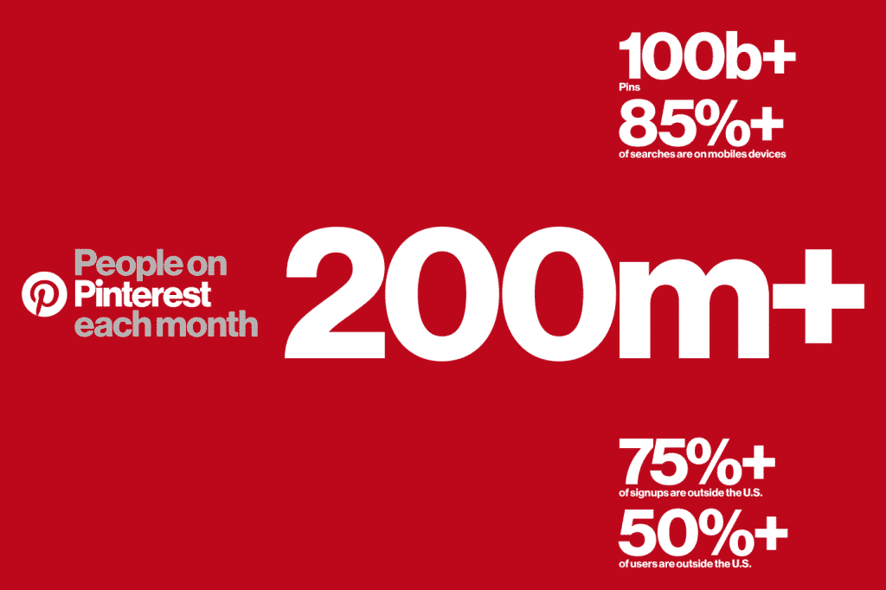

Pinterest users (Img Source: Pinterest)

仍然不相信 Pinterest 是你应该去的地方？这个怎么样——网站的视觉特性让人们进入购物状态，比任何其他社交网络都更能促使人们做出合理的购买决定。看看这个:

*   87%的 pinners 已经[购买了他们在网站上看到的东西](https://business.pinterest.com/en/blog/new-study-shows-that-most-pinners-have-made-a-purchase), 93%的 Pinterest 用户计划未来的购买
*   Pinterest 为[电子商务网站](https://kinsta.com/blog/ecommerce-strategies/)带来了 [17%的流量](http://www.businessinsider.com.au/pinterest-is-poised-to-become-a-major-social-commerce-platform-2016-10?r=US&IR=T)
*   别针的⅔展示一个品牌或产品

Pinterest 最好的一点是它有持久力。如果你更有兴趣花时间[创造持久的常青内容](https://kinsta.com/learn/content-marketing/)而不是创造短暂的内容(比如 Instagram、脸书和 Snapchat 上的故事)，那么 Pinterest *可能*就是你最适合的商务社交网络。

Pinterest 上的常青树内容是所有社交网站中半衰期最长的——151，200 分钟(也就是 105 天！).相比之下，脸书邮报的 90 分钟和推特的 24 分钟，你花在 Pinterest 营销上的时间已经可以证明有更好的回报。

别忘了阅读我们的相关帖子:[视觉内容策略:如何使用视觉效果获得更多流量](https://kinsta.com/blog/visual-content-strategy/)

当然，在你追随 Pinterest 潮流之前，你必须先确定它是否适合你的品牌。

## Pinterest 人口统计

尽管越来越多的男性加入 Pinterest(40%的新注册用户是男性)，但它仍然主要是女性的游戏。Pinterest 声称其用户代表了 [45%的网络女性](https://www.socialmediatoday.com/social-networks/top-social-network-demographics-2017-infographic)，相比之下只有 17%的网络男性。

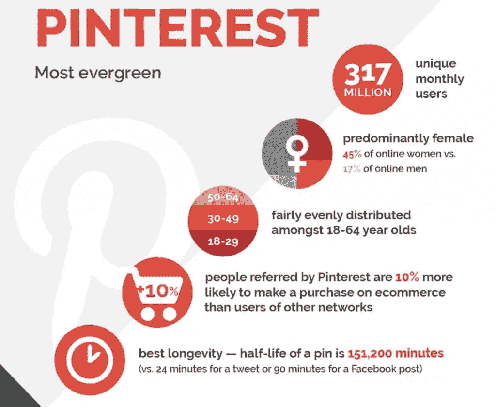

Pinterest Demographics (Img Source: Social Media Today)

根据明尼苏达大学和佐治亚理工学院的一项研究，Pinterest 上最受欢迎的话题包括:

*   食物和饮料
*   工艺
*   家居装饰
*   女性时尚

Pinterest 上最受男性欢迎的话题是:

*   摄影
*   艺术
*   设计
*   家居装饰

Pinterest 在所有年龄段都很受欢迎。其最大的观众群是千禧一代(36%)，紧随其后的是 34%的 X 一代(30-49 岁)。

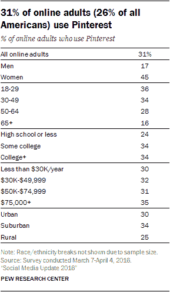

Pinterest age demographics

与推动购买意向一致，Pinterest 非常有抱负。47%的用户报告称，他们使用 Pinterest 来[帮助规划生活事件](https://www.millwardbrowndigital.com/pinterest-and-the-power-of-future-intent/)。这为相关品牌(尤其是奢侈品牌)提供了一个制定 Pinterest 营销策略的机会。

尽管这些统计数据代表了 Pinterest 上的一些最佳目标人口统计数据，但它们无法回答每个人关于 Pinterest 营销对他们公司来说是否是一项好投资的问题。要做到这一点，你必须使用这一指导作为一个初始的气压计，然后潜入并尝试一下。

为了获得最佳效果，请遵循 Pinterest 的营销策略:

## 如何在你的博客上使用 Pinterest

就推荐流量而言，Pinterest 可以成为你最好的“社交媒体”来源。仅仅这个简单的事实就使得考虑将 Pinterest 营销整合到你的博客中是值得的。

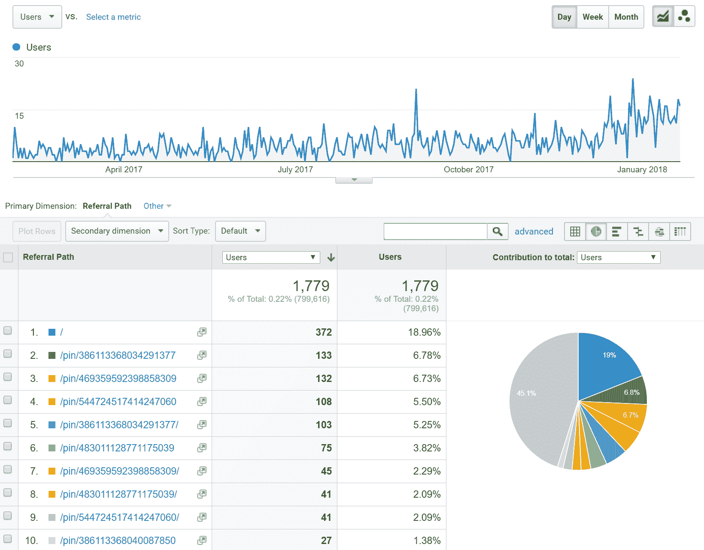

Pinterest referral traffic

值得注意的是，Pinterest 在内容显示方式上不同于其他社交媒体账户。“图钉”，或个人 Pinterest 帖子的名称，可以查看:

*   在主页提要上，通常根据用户级别上与您最相关的内容进行排序
*   当使用搜索来查找与某些关键字相关的 pin 时
*   当浏览食物和饮料、动物或家居装饰等类别时
*   在您的个人资料中，在您自己的主题图板下(“图板”是相关图钉的集合)

这种多方面的组织方式使用户更容易有机地找到你的内容，当他们对你提供的内容感兴趣时。正因为如此，专注于 Pinterest 营销策略可能意味着将人们直接推向你销售漏斗的“购买”阶段。

有几种方法可以将 Pinterest 整合到您的网站中，有三个方面可以优化 Pinterest:

*   轮廓
*   纸板
*   腿

现在，我们将把我们的 Pinterest 技巧特别集中在图钉上，因为它们构成了 Pinterest 内容的基础。

## Pinterest 图片的最佳实践

有几种方法可以增加你的 Pinterest 图片的可见性，比如使它们在视觉上吸引人，[为网站使用正确的图片](https://kinsta.com/blog/optimize-images-for-web/)，以及使用正确的关键词来提高可发现性。

### 使用正确大小的图像

发布到平台的图像被缩放。具体来说，图像的宽度缩放到 236 像素。当您单击扩展给定图钉的图像时，图像将缩放到 564 像素的[宽度，并且图像的高度也相应缩放。](https://kinsta.com/blog/social-media-image-sizes/#pinterest-image-sizes)

据 Pinterest 报道，最好的图像长宽比在 2:3 到 1:3.5(宽高比)之间，最小宽度为 600 像素。

### Pinterest 为美丽的 Pinterest 图片提示

创建吸引人的 Pinterest 图片的一些快速技巧:

*   使用有品味的品牌。 Pinterest 认为，有品位的品牌有助于增加回帖和参与度。包括你的产品包装的照片，或者你的[品牌的标志](https://www.logaster.com/blog/transparent-logo/)/水印。如果你还没有一个标志，试着现在就用 [Logaster](https://www.logaster.com/logo/) 创建它。
*   使用[生活方式图片](https://kinsta.com/blog/free-images-for-wordpress/)和文字覆盖图**来吸引注意力并帮助**理解这个想法。列表图片和信息图也是 Pinterest 图片的流行类型。
*   看看你发布的帖子上当前的颜色和设计，然后调整你的 Pinterest 图片，使其从云中脱颖而出。

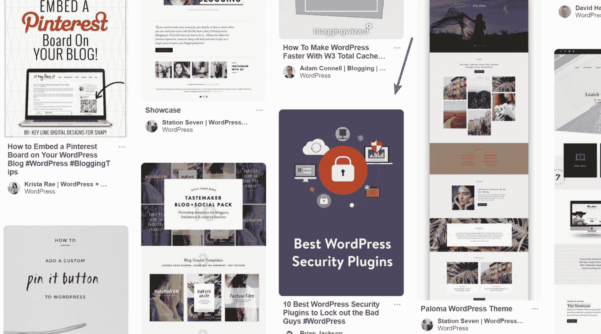

Pinterest stand out

### 使用正确的关键词

Pinterest 是互联网上最大的搜索引擎之一，所以就[关键词研究](https://kinsta.com/blog/keyword-research/)(和使用)而言，也是如此。虽然 Pinterest SEO 的完整入门超出了本文的范围(但是如果你对评论中的后续文章感兴趣，请告诉我们！)，原则很大程度上与谷歌的 SEO 相同。

Pinterest 为搜索引擎优化提供的一些快捷技巧:

*   Use your **favorite keyword research tool** (like Google Keyword Planner or my personal favorite, [Ahrefs](http://www.ahrefs.com)) and compare results with the more niche [Pinterest Keyword Tool](http://www.pinterestkeywordtool.com/).

    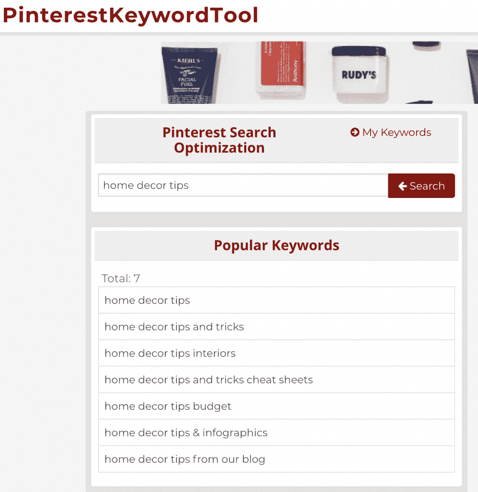

    Pinterest 关键词工具

    

*   回头参考一下**你应该在 Pinterest** 上优化的三个方面:图钉、图板和你的个人资料。
*   使用您的关键字，建立 20+板与 100+针，每个。

## 如何在你的博客中加入 Pinterest

在 Pinterest 上获取你的内容只是成功的一半。另一半呢？让别人为你做这件事。

用户可以通过三种方式获取 Pinterest 论坛的内容:

*   **从您的电脑上传内容。**你将负责添加一个链接和描述，以确保它能被相关的 Pinners 找到。
*   **重新锁定某人已经上传的图片**。
*   **Pin 按钮**，在网站上可以找到(或者在你的浏览器中，作为[安装的扩展](https://chrome.google.com/webstore/detail/pinterest-save-button/gpdjojdkbbmdfjfahjcgigfpmkopogic?hl=en))。单击时，这些引脚按钮会自动生成引脚预览，并提示用户要将其保存到哪个电路板。

[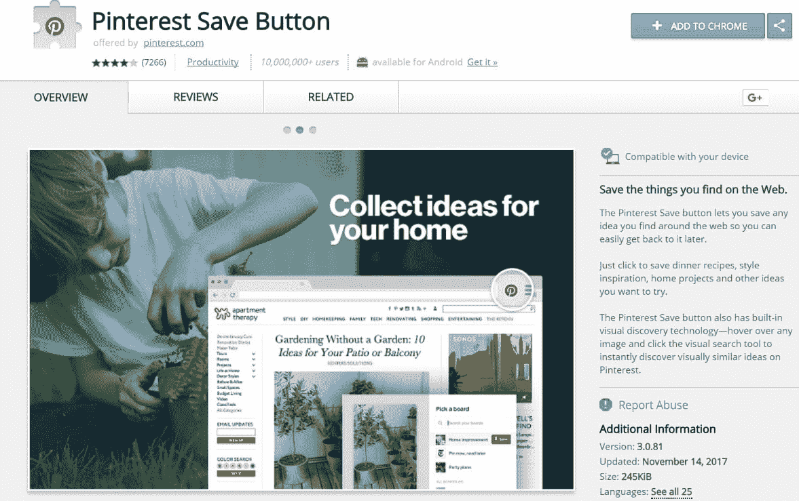](https://chrome.google.com/webstore/detail/pinterest-save-button/gpdjojdkbbmdfjfahjcgigfpmkopogic?hl=en)

Pinterest save button

下面的 Pinterest 技巧主要是让人们在平台上锁定你的内容并关注你。

## Pinterest 大头针按钮

有两种大头针按钮:

*   大头针按钮
*   关注 Pinterest 按钮

“关注 Pinterest”按钮会弹出一个小对话框，预览你账户的最新 pin，这样你的访问者就不必离开你的网站来关注你。

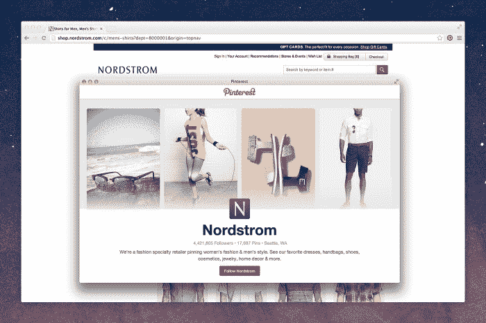

Follow Pinterest button

您可以通过两种不同的方式将大头针按钮添加到您的网站:

*   作为一个通用按钮，用户可以点击它将您的网页固定到 Pinterest
*   当用户将鼠标悬停在图像上时，该按钮会出现在网站上的每个图像上

[社交分享插件](https://kinsta.com/blog/wordpress-social-media-plugins/)通常带有可配置的 Pinterest Pin 按钮，访问者可以使用这些按钮来分享你的网站内容。一些 Pinterest 营销插件被编程为固定帖子的第一张图片，而另一些则允许你设置固定哪些特定图片。

如果你有一个 WordPress 网站，social share 就是一个这样的插件，它可以使用社交分享按钮和 Pinterest 营销。除了能够使用它来设置自定义 Pinterest 图像和回退，他们的 Pro 版本还有一个独特的功能，称为“[Pin image for browser extensions](https://warfareplugins.com/support/options-page-advanced-tab-advanced-pinterest-settings/)”。当切换到 ON 位置时，当访问者使用浏览器扩展来锁定时，此开关会将您的自定义 Pinterest 图像添加到要锁定的图像选项中。[Social war Pro](https://warfareplugins.com/buy-now/)一个网站的许可费起价为 29 美元/年。

## 注册订阅时事通讯

### 想知道我们是怎么让流量增长超过 1000%的吗？

加入 20，000 多名获得我们每周时事通讯和内部消息的人的行列吧！

[Subscribe Now](#newsletter)

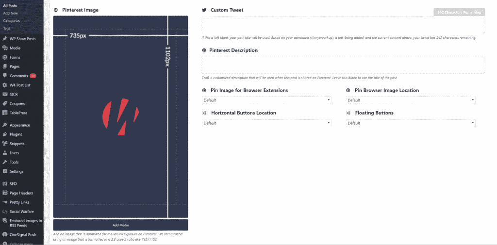

Custom Pinterest image in WordPress

除了使用大头针按钮，你还可以选择在其他网站/社交网络上添加预先格式化的大头针链接，鼓励人们使用该链接来固定图片。Pretty Presets 的劳拉·托马斯(Laura Thomas)相当成功地做到了这一点，她将 10%的销售额归功于 Pinterest。

## Pinterest 小工具

另一种让网站访问者访问(并关注)你的 Pinterest 论坛的方法是嵌入 [WordPress widgets](https://kinsta.com/blog/wordpress-widgets/) :嵌入的 Pinterest 论坛、你的 Pinterest 个人资料或你最新的 pin。

[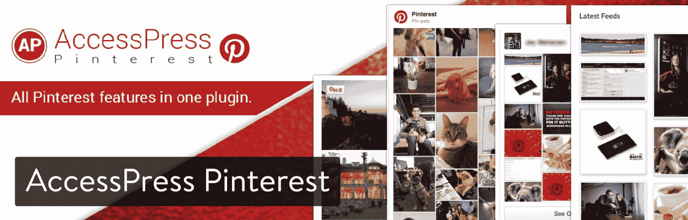](https://wordpress.org/plugins/accesspress-pinterest/)

AccessPress Pinterest WordPress plugin

一种方法是安装 [AccessPress Pinterest 插件](https://wordpress.org/plugins/accesspress-pinterest/)。AccessPress Pinterest 插件是免费的，功能丰富，允许你在你的 WordPress 网站上设置与 Pinterest 相关的功能，包括:

*   将它钉在图片上
*   关注你网站上的 Pinterest 按钮
*   Pin 板小工具
*   Pinterest 个人资料小工具
*   最新引脚馈送

一旦你激活了插件，你就可以开始通过一个小部件或者短代码来嵌入 Pinterest 板。

Pinterest 还提供了一个 [widget builder](https://developers.pinterest.com/tools/widget-builder/?type=board&boardHeight=240&boardWidth=400&imageWidth=80&template=square) ，允许你为你的网站/应用程序创建/添加按钮/widget——不需要插件。只需按照他们的指示复制/粘贴结果代码。

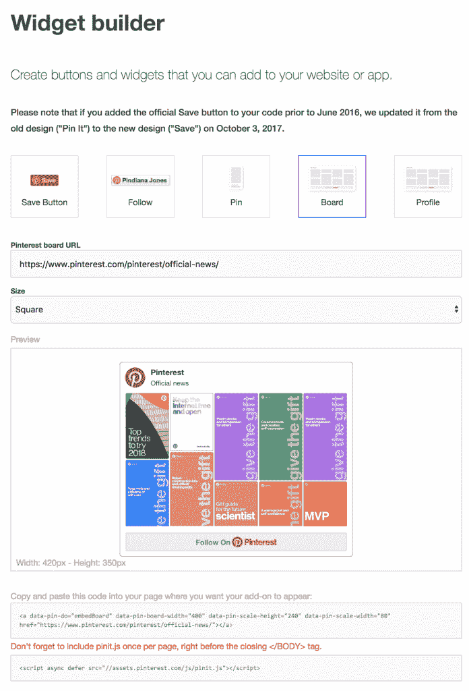

Pinterest Widget builder

Pinterest 的网站按钮和 widget 产品包括:

*   保存按钮
*   跟随按钮
*   粉红色的
*   一块木板
*   您的个人资料

## 你需要了解的 Pinterest 功能和工具

Pinterest 已经从一个简单的在线公告板发展到提供支持其业务和营销功能的功能。

### Pinterest 商业账户

Pinterest 在 2012 年推出了商业账户功能。

如果你已经有一个 Pinterest 账户，你可以很容易地免费将你的个人账户转换成商业账户。如果你是一家刚刚开始使用 Pinterest 的企业，你可以直接注册一个[企业账户](https://business.pinterest.com/en)。

创建 Pinterest 商业帐户意味着可以使用其他特性和功能，包括:

*   更好地使用平台的教育内容，如案例研究和 Pinterest 最佳实践
*   独家商业帐户功能，如丰富的个人识别码、促销个人识别码(Pinterest 广告)和可购买的个人识别码
*   像其他社交媒体分析套件一样，Analytics 可以帮助你了解人们是如何与你的公司互动的:在 Pinterest 和其他网站上。

### Pinterest 分析

Pinterest 分析套件分析三类数据:

Struggling with downtime and WordPress problems? Kinsta is the hosting solution designed to save you time! [Check out our features](https://kinsta.com/features/)

*   你的 Pinterest 档案:显示分为四个部分的数据:浏览量、保存量、点击量和历史记录。
*   **你接触到的人**:看到你的图钉、关注你的图板或以某种方式与你的内容互动的人的详细信息。这也显示了你的大多数观众来自哪个国家和城市，性别，语言等等。
*   **来自你网站的活动**:要访问该功能，Pinterest 将要求你验证你的网站，一旦你这样做了，你将能够看到人们在你的网站上参与最多的内容。您还可以查看链接回您网站的链接的每日平均浏览量、保存量(重新链接)和点击量。

### 丰富的引脚

当你注册 Pinterest 商业账户时，你将获得丰富的 pin 码。丰富的大头针是提供关于大头针的额外上下文的大头针——如果你熟悉 SEO，这是一个类似于[丰富片段](https://moz.com/blog/a-visual-guide-to-rich-snippets)的概念。

有四种类型的富 pin:

*   **App:** 显示安装按钮，鼓励下载；截至本文撰写时，仅兼容 iOS 应用程序。
*   **文章**:通过显示文章的标题、作者和简介，帮助 Pinners 保存对他们重要的故事。
*   **产品**:让购物更简单。包括定价、可用性以及在哪里可以买到该产品。
*   **食谱:**包括配料、准备时间和烹饪说明等信息，以食谱为特色。

如果您有一个经过验证的帐户，您网站的商标将被添加到所有 Rich Pins 中。你可以在 [Pinterest 的开发者区](https://developers.pinterest.com/tools/url-debugger/)进行操作。

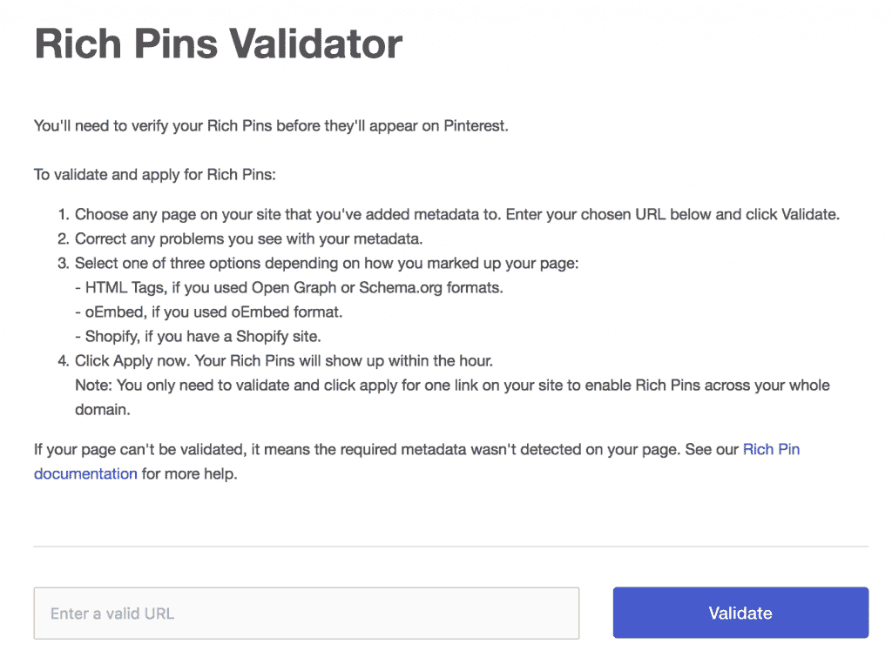

Pinterest rich pins validator

丰富的图钉有助于改善潜在读者对图钉的体验——将它们视为内容的广告文案。

由于成功使用了丰富的 pin 码，家居装饰品牌 decor 的网站访问量增加了 36%，转化率增加了 51%，交易量增加了 106%，收入增加了 173%。

### 如何在 Pinterest 上获得丰富的图钉

如上所述，要访问 Pinterest 的丰富 pin，你必须首先验证你的网站。

这可以通过向您的站点添加元数据(meta 标签)或 oEmbed point 来实现。如果你在这方面有困难，试着向你的网站开发者寻求帮助。

为了确认这一点，测试 Rich Pins，然后申请在 Pinterest 上访问。

### 可购买的别针

可购买的 pin 是 Pinterest 的一个相对较新的功能，允许人们无需离开 Pinterest 就可以购买你的产品——类似于新的 Instagram Shoppable feed。

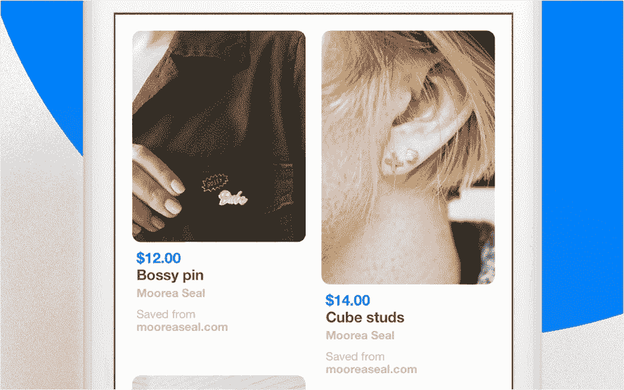

Buyable pins

可购买的 pin 在与电子商务平台整合时效果最佳，如 [Salesforce Commerce Cloud](https://www.demandware.com/pages/pinterest) 、 [BigCommerce](https://www.bigcommerce.com/pinterest/) 和 [Shopify](https://kinsta.com/blog/shopify-alternatives/) 。上面提到的这些电子商务平台的 Pinterest 页面都链接到如何申请和设置可购买 pin 的说明。

可购买的 pin 码在手机和网络平台上都有效。一旦您被批准使用可购买的 pin 码(可能需要 5 个工作日)，您将在您的 Pinterest 个人资料页面上看到一个蓝色的“商店”链接。您所有活跃的可购买 pin 将显示在此板上，因此您可以在一个地方轻松跟踪您所有的可购买 pin。

坏消息呢？目前在 Woocommerce 上[还不支持可购买的 pin 码(与 WordPress 整合的很好)。由于 Woocommerce 掌控了](http://ideas.woocommerce.com/forums/133476-woocommerce/suggestions/10128828-support-for-pinterest-buyable-pins) [42%的在线商店](https://wptavern.com/woocommerce-powers-42-of-all-online-stores)，我们对在不久的将来获得支持抱有希望。更多关于可购买 pin 的信息，请查看 [Pinterest 的](https://business.pinterest.com/en/getting-started-with-buyable-pins)文章。

### Pinterest 广告

像脸书和许多其他顶级社交媒体网站一样，Pinterest 有一个功能，允许用户付费推广他们的 pin 以获得更多的浏览量。

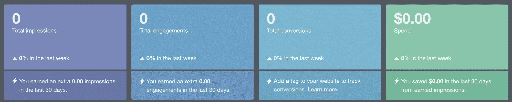

Promote pins on Pinterest

推广大头针，也被称为 Pinterest 广告，就像普通的大头针，实际上看起来不太像广告——在广告拦截器和受够了互联网用户的时代是有益的。由于 pin 会永久存在，因此您可以在任何需要的时候提升相关 pin。Pinterest 报道称，当使用推广的 pin 时，点击量增加了 20%。

该功能目前仅在美国、加拿大、澳大利亚、爱尔兰、英国和新西兰可用。您可以直接从您的 Pinterest 商业档案或通过 Pinterest 广告管理器推广 Pin。

Pinterest 提供了三种广告活动类型来使用推广的 pin 码与您的业务目标保持一致:

*   意识
*   约会
*   [交通](https://kinsta.com/blog/how-to-drive-traffic-to-your-website/)

广告形式包括推广大头针、推广视频、一键大头针(只需轻轻一点，就能把人们带到内容来源的网站)、推广应用大头针和电影大头针(比如当你滚动经过脸书的视频时，它们就会开始移动)。

Pinterest 最近发布的一项关于广告的更新涉及[搜索广告](https://techcrunch.com/2017/10/18/pinterest-opens-up-search-advertising-in-its-ads-manager/)，这让企业有机会在搜索者对某个想法或产品表达某种意图或兴趣时，将广告放在他们面前(这是使用 Pinterest 鼓励购买意图的又一个胜利)。

与其他社交网站一样，你只有在获得结果时才会为 Pinterest 广告付费，这使得它成为你的 Pinterest 营销工作的一项相当安全的投资。

## Pinterest 营销策略

Pinterest 营销获得普遍成功的几个快速技巧:

*   **Use horizontal images.** You can easily create a visually-appealing [template on Canva](https://www.canva.com/templates/social-graphics/pinterest-graphic/).

    

    Pinterest 图文模板

    

*   与其他博主、有影响力的人和名人建立关系。 Instagram 并不是*唯一一个*你可能想和有影响力的人一起工作的地方。例如，Target 曾与顶级 Pinterest 账户 Oh Joy、Wit & Delight 和 Poppytalk 合作。Pinterest 目前正在研究创建一个工具，让品牌更容易[与影响者](http://www.businessinsider.com/pinterest-wants-to-make-it-easier-for-brands-to-work-with-influencers-2017-9)合作(Instagram 已经做到了这一点)。与影响者一起工作可能包括创建社区论坛，给影响者产品巧妙的风格和别针。如果你追求这种类型的影响者/Pinterest 营销，你可能还会要求影响者管理来自其他创作者的内容(有点像风格指南)。
*   **加入 Pinterest 集团董事会。**群组讨论板是共享的讨论板，邀请许多不同的用户参与讨论。它们通过使用一个特殊的组图标来区别于个人讨论板。关注群组板的 Pinner 仅作为所有者的关注者出现，但是*来自所有贡献者的群组板的所有*pin 可以出现在关注它的每个 Pinner 的主页 feed 中。想想加入一个有超过 100，000 名追随者的贡献者的小组委员会意味着什么！使用像 [PinGroupie](http://pingroupie.com/) 这样的工具来决定你应该加入哪个小组。
*   **启动 Pinterest 群组板块。**除了寻求成为一个受欢迎的 Pinterest group 董事会的成员，你还可以创建一个并邀请你的客户。这可以帮助你建立社会证明，思想领导，或执行客户研究。可以创建一个社交验证板，邀请人们展示他们如何使用你的产品。客户研究板可用于邀请客户就未来或当前产品提供意见。
*   举办一场竞赛或赠送活动。让在 Pinterest 或 repinning 上关注你成为竞赛机制的一部分。
*   钉在日程表上。理想情况下，你会[在 Pinterest 上每天发布 4-5 次](https://www.searchenginepeople.com/blog/16082-pinterest-marketing-seo.html)。
*   **Post during peak times** to get more eyes on your Pin. Pinterest peak times are 8-11PM in your local timezone, especially on Saturdays. Other [high traffic times](http://coschedule.com/blog/best-times-to-post-on-social-media/#pinterest) include Fridays at 3PM; 2-4 AM and PM, every day; 9 PM daily (which is considered to be the best peak time).

    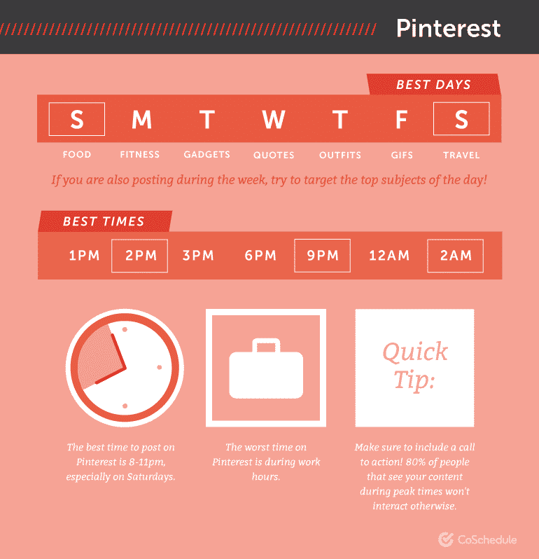

    在 Pinterest 上发帖的最佳时间(Img src: CoSchedule)

    

*   **重新钉别人的内容。**如果你是一个品牌，品牌标识应该有 20%是你自己的，80%是别人的。
*   **经常重新锁定你自己的内容**，这样用户会一直看到你的锁定。

### 锁定程序

频繁地在 Pinterest 上发帖可能会很困难，因为内容是常青树，在任何给定的 Pin 获得关注之前可能需要一段时间。当涉及到对时间敏感的大头针时，就像在比赛中使用的那些一样，确保在比赛结束后删除大头针，或者将比赛结束日期直接放在图像上。

幸运的是，有像 [Tailwind](https://www.tailwindapp.com/) 这样的 Pin 调度工具。这些程序允许您安排您的 Pin 并循环(重新发布)旧 Pin，甚至可以分析数据，根据观众参与度找到您的最佳 Pin 时间。

## 针对网站用户的 Pinterest 营销

Pinterest 不仅仅是一个可爱的网站——它是一个可视化搜索引擎，已经发展成为一个强大的后期漏斗营销平台，拥有大量功能。

Pinterest 的用户大多是女性，由于该网站的视觉特性，他们很容易购买。除了驱动购买行为，还代表了内容保质期最长的社交平台。

注册一个商业帐户，并获得 pin！如果你有任何令人敬畏的 Pinterest 营销技巧要分享，请发微博到[@ Kinsta](http://www.twitter.com/Kinsta)——我们会分享我们的最爱！

—

由 [F Design](https://www.iconfinder.com/icons/312537/pinterest_icon) 创作的“Creative Commons Pinterest icon”在 [CC 下由 2.5](https://creativecommons.org/licenses/by/2.5/) 授权

* * *

让你所有的[应用程序](https://kinsta.com/application-hosting/)、[数据库](https://kinsta.com/database-hosting/)和 [WordPress 网站](https://kinsta.com/wordpress-hosting/)在线并在一个屋檐下。我们功能丰富的高性能云平台包括:

*   在 MyKinsta 仪表盘中轻松设置和管理
*   24/7 专家支持
*   最好的谷歌云平台硬件和网络，由 Kubernetes 提供最大的可扩展性
*   面向速度和安全性的企业级 Cloudflare 集成
*   全球受众覆盖全球多达 35 个数据中心和 275 多个 pop

在第一个月使用托管的[应用程序或托管](https://kinsta.com/application-hosting/)的[数据库，您可以享受 20 美元的优惠，亲自测试一下。探索我们的](https://kinsta.com/database-hosting/)[计划](https://kinsta.com/plans/)或[与销售人员交谈](https://kinsta.com/contact-us/)以找到最适合您的方式。