# WordPress 网站成本——网站建设背后的真实真相

> 原文：<https://kinsta.com/blog/wordpress-website-cost/>

WordPress 可能是从一个简单的博客平台开始的。但近年来，它不仅成为了最好的博客平台，也成为了成熟的 T2 CMS。像[白宫](https://www.whitehouse.gov/)， [jQuery](http://jquery.com/) ， [Dyn](http://dyn.com/) ， [NGINX](https://www.nginx.com/) ，[纽约时报](https://www.nytco.com/)，所有[都称 WordPress 为他们的网上家园](https://kinsta.com/blog/wordpress-site-examples/)。

不过，他们只是精英。根据 BuiltWith 的数据，另外 19，922，280 个在线网站(还在增加)也使用 WordPress。这么多网站使用它是有原因的。与其对他们的企业级 CMS 收费，其背后的创始公司[automatic](https://automattic.com/)选择保持开源。

所以技术上来说，是“免费的”然而，没有什么是真正免费的。总会有某种代价。那么，它到底值多少钱？运营一个中等规模的网站或者与 Mashable 或 TechCrunch 的网站竞争的网站会花费你多少钱？让我们找出答案。

## 为什么 WordPress 实际上不是免费的

WordPress.org 会告诉你这是完全免费的。但是……嗯，不是的。至少，如果你想让你的 WordPress 网站成为一个全功能的在线实体，这是不可能的。那样的话，你需要一些额外的东西。你需要启动和运行的*额外费用*就是额外成本的来源。

这些额外成本转化为以下几类:

*   [虚拟主机](#web-hosting)
*   [一个域名](#domain-name)
*   [设计和主题](#design-and-themes)
*   [插件/扩展(也称为应用程序)](#plugins)
*   [电子商务功能](#ecommerce-features)
*   [你的时间](#time)

我将向您介绍每一个类别，以及它们的实际价格。许多其他在线企业都在使用 WordPress，但这并不意味着它是你企业的正确解决方案。为了帮助您确定它是否正确，让我们来看一看每一个类别。
T3】

## 虚拟主机(35-1650 美元)

当你创建你的 WordPress 网站时，决定投资哪一个主机是你要做的最重要的选择之一。使用 Kinsta 的 WordPress 托管服务从每月 35 美元到每月 1650 美元不等。

> Kinsta 把我宠坏了，所以我现在要求每个供应商都提供这样的服务。我们还试图通过我们的 SaaS 工具支持达到这一水平。
> 
> <footer class="wp-block-kinsta-client-quote__footer">
> 
> 
> 
> <cite class="wp-block-kinsta-client-quote__cite">Suganthan Mohanadasan from @Suganthanmn</cite></footer>

[View plans](https://kinsta.com/plans/)

这是一个巨大的范围。但是好消息是你可以选择一个最符合你理想带宽和预算的计划。

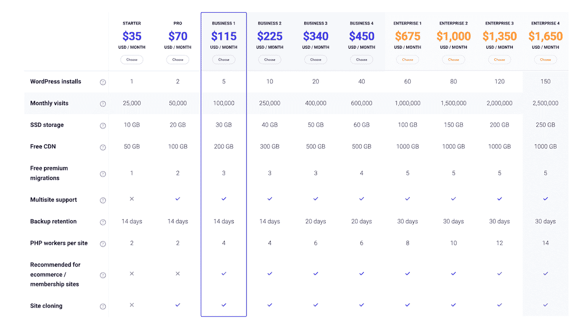

Kinsta plans

当然，你也可以直接在 WordPress 上托管你的网站。

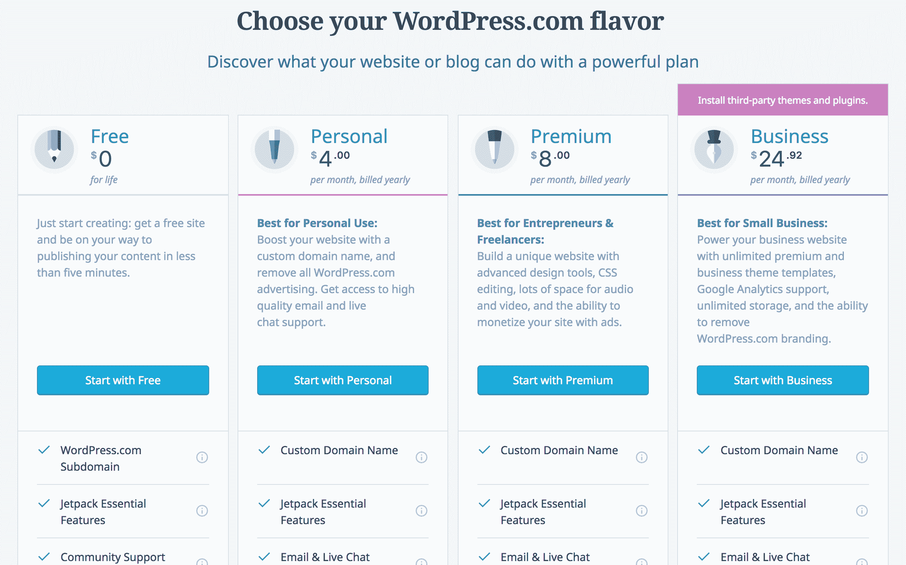

WordPress.com hosting

不幸的是，对于 WordPress 的提议来说，托管是你所能做的全部事情。虽然价格较低，但 WordPress 不会帮你监控你的网站，也不会帮你解决第三方插件之间的差异。

另一方面，金斯塔会。你需要选择一个你能负担得起的计划，但你也需要选择一个能给你的企业带来最大成功机会的计划。对你们中的许多人来说，这个价格点会落在中间的某个地方。有了网站托管，你会得到你所支付的。

记住:你选择的主机越便宜，一般来说质量会越低。[廉价托管](https://kinsta.com/blog/cheap-wordpress-hosting/)倾向于偷工减料，过度拥挤的服务器来盈利。这可能会极大地影响网站的性能。

另一方面，更高成本的主机通常更灵活，包括资源隔离等高级功能，这意味着你不会与其他网站共享资源。这可以确保您的网站在流量激增时保持在线。无论您选择什么，请选择一个价格合适、功能灵活且提供急需支持的选项。

### 加密套接字协议层

根据你的主机或你的特殊需求，你可能还得花钱买一个 SSL 证书。例如，Kinsta 有[免费的 SSL 证书](https://kinsta.com/blog/free-ssl-certificate/)，但并不是每个主机都提供这种服务(确保查看我们关于如何向 WooCommerce 添加 [SSL 证书的深入指南)。](https://kinsta.com/knowledgebase/woocommerce-ssl/)

此外，如果您需要一个扩展验证 SSL 证书，这将花费您。这些费用每年从 50 美元到 200 美元不等。

## 域名(10 至 30 美元)

当你注册一个域名时，你就购买了一个网站的 URL 或地址，用户可以在那里查看你的网页内容。

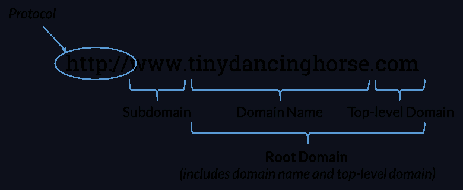

Domain name (Img src: [Moz](https://moz.com/learn/seo/domain))

你可以从很多不同的地方购买域名，但是 T2 的 GoDaddy 和 T4 的 Namecheap 是两个实惠的选择。一个域名可能会让你每年花费 10 到 30 美元。

无论你做什么，**不要使用 WordPress 的免费域名选项**看起来像“www . your domain name . WordPress . com”。如果你想让人们认真对待你的业务，那么你需要[转移到自托管的 WordPress](https://kinsta.com/blog/wordpress-com-to-wordpress-org/) 并获得自己的域名。我们在另一篇文章[中广泛讨论了这个话题，如何选择域名](https://kinsta.com/blog/choose-domain-name/)–脱颖而出的 8 个技巧。

你还应该知道域名隐私保护，或 [WhoisGuard 保护](https://www.namecheap.com/security/whoisguard.aspx)。通常，当您购买域名时，您的个人信息会公布在 Whois 目录中。这对你来说可能是个坏消息，因为任何人都可以获得这些信息，除非你保护好它。从垃圾邮件发送者到黑客，任何人都可以准确地看到如何联系您。

但是一旦你注册了一个域名，你就可以购买这个插件来保护你的个人联系信息。这项附加服务可能会让你每年多花 10 到 15 美元，但这是一项你不应该忽视的服务。或者你可以为你的域名支付一点额外的费用，在像 Google domains 这样的注册商那里，Whois 保护是免费的。
T3】

## 设计和主题(0-50，000 美元)

WordPress 有许多可供所有用户使用的主题。有些是免费的，但有些要 200 美元以上。免费的 WordPress 主题对于初学者来说很棒，但是对于严肃的企业主来说，它们通常没有必要的功能。

WordPress 有一个巨大的主题库，你可以通过浏览找到你想要的。你可以在以后用插件修改这个主题，所以关键是找到一个符合你希望你的网站整体感觉的主题。你希望你的网站简单吗？专业？快速导航？好玩？耐人寻味？你可以找到一个给你的网站这种感觉的主题。下面是如何安装一个 WordPress 主题的方法。

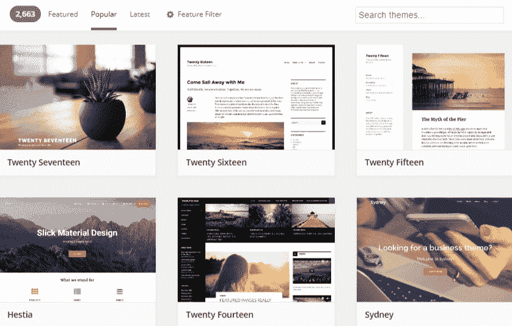

WordPress theme repository

您还可以根据与您的视觉相关的布局、功能和主题来过滤搜索结果。但是，你不必使用 WordPress 的预制模板。你可以从不同的网站找到预制的网站模板，比如 [Template Monster](https://www.templatemonster.com/) ，价格从 75 美元到 200 美元不等。

[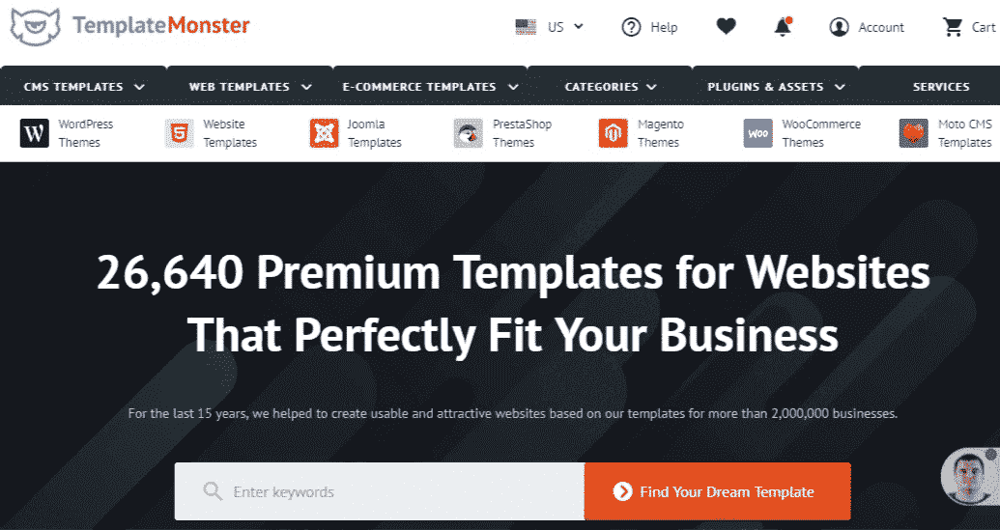](https://www.templatemonster.com/)

TemplateMonster

你也可以在 [Envato Market](https://market.envato.com/) 上找到它们，价格从 13 美元到 1200 美元不等。

## 注册订阅时事通讯

### 想知道我们是怎么让流量增长超过 1000%的吗？

加入 20，000 多名获得我们每周时事通讯和内部消息的人的行列吧！

[Subscribe Now](#newsletter)

[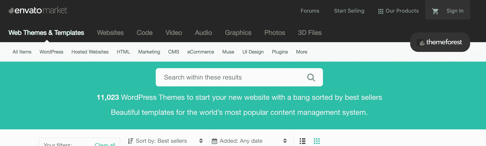](https://market.envato.com/)

Envato Market

或者是 Mojo Marketplace 的价格从 59 美元到 79 美元不等。

[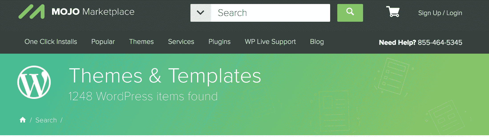T2】](http://www.mojomarketplace.com/themes/wordpress?page=1&sorting=newest&productType%5B0%5D=Themes&category%5B0%5D=wordpress)

你可能还想看看其他一些著名的主题商店，包括[优雅主题](https://www.elegantthemes.com/gallery/)、[保护主题](https://www.proteusthemes.com/)、[主题岛](https://themeisle.com/)、[神话商店](https://mythemeshop.com/themes/)、[访问主题](https://accesspressthemes.com/)、[高级编码](https://premiumcoding.com/premiumcoding-wordpress-themes/)和[特斯拉主题](https://teslathemes.com/wordpress-themes/)。另外，这里有一篇关于 WordPress 主题的误解的好文章。

当你选择一个主题的时候，也要确保你选择一个手机友好的主题。来自移动设备的在线零售额正在上升。2016 年，移动商务行业价值高达 5390 亿美元。这个数字预计到 2021 年将会翻倍。

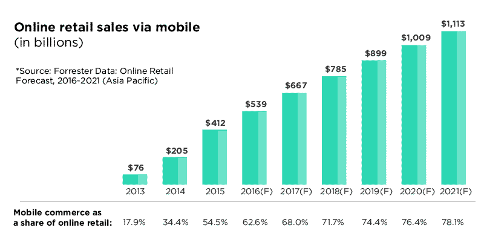

Retail sales from mobile devices (Img src: [YourStory](https://yourstory.com/2017/02/e-commerce-forrester-research/))

但是请记住:当你从第三方 SaaS 公司购买主题时，你可能会使用一个不会自动与你网站上想要的本地插件集成的模板。[预先做好的模板也很难定制](https://kinsta.com/blog/how-to-customize-wordpress-theme/)，除非你知道如何[读写 HTML](https://kinsta.com/blog/wordpress-vs-static-html/) 和 CSS。如果你没有，那么你所看到的就是你所得到的。

不过，有些人不会对你找到的任何主题感到满意。在这种情况下，考虑雇佣一个网络开发者来创建你自己的主题。根据你雇佣的人的不同，你可以期望的价格从 700 美元到 10000 美元不等。如果你的企业有广泛的需求，你甚至可以考虑接近 50，000 美元的价位。

如果你选择让别人为你的 WordPress 站点设计一个自定义主题，那么你可能需要一些内部开发人员来帮助你做未来的改变。否则，你会因为缺乏编码知识而受到严重限制。考虑浏览 [Codeable](http://codeable.io/) 来寻找一个符合你需求的开发者。

[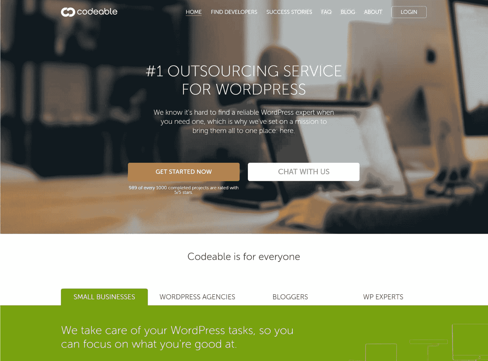](http://codeable.io/)

Codeable

或者看看这些其他[推荐的雇佣 WordPress 开发者的地方](https://kinsta.com/blog/hire-wordpress-developer/)。

## 插件/扩展(426-1587 美元)

WordPress 插件是你可以添加到网站上的小代码。一些插件(也称为扩展)是免费的，但高级选项从 47 美元到 200 美元不等。收费可以是一次性的，也可以是经常性的。你可以在 WordPress.org 上搜索[全部 53123 个。](https://wordpress.org/plugins/)

Struggling with downtime and WordPress problems? Kinsta is the hosting solution designed to save you time! [Check out our features](https://kinsta.com/features/)

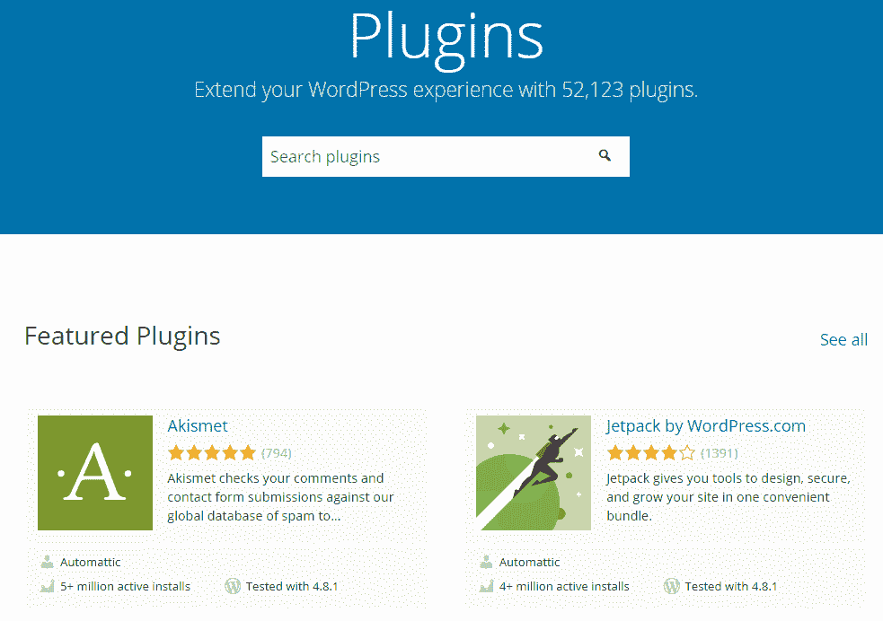

WordPress plugins

特别是，这里有一个你需要考虑在你的网站上实现的插件列表。看看他们到底做了什么，花了多少钱。

*   Yoast SEO **($0 到$89)** — Yoast 允许你为搜索引擎优化你网站上的每一个页面。这意味着你有最好的机会在你的目标 SERP 上排名并产生被动流量。在这里阅读我们的高级 [Yoast SEO 教程](https://kinsta.com/blog/yoast-seo/)。
*   [Gravity Forms](https://www.gravityforms.com/)**($ 59)**——Gravity Forms 让你可以为 MailChimp、 [Slack](https://kinsta.com/blog/how-to-use-slack/) 、Stripe、PayPal、Twilio 等提供商创建选择加入表单。
*   [高级定制字段](https://www.advancedcustomfields.com/) **($0 到$100)** —此插件允许您在不同的页面字段上包含额外的定制。建议阅读:[高级自定义字段教程:你的终极指南](https://kinsta.com/blog/advanced-custom-fields/)
*   [MailChimp](https://kinsta.com/blog/how-to-use-mailchimp/) — **(每月 0 至 35 美元或更高)** —电子邮件营销软件，可快速轻松地与你的 WordPress 网站集成，包括其他第三方插件。实际上，Kinsta 使用 MailChimp。你也可以看看其他的[电子邮件营销软件解决方案](https://kinsta.com/blog/email-marketing-software/)。
*   [HubSpot WordPress 插件](https://www.hubspot.com/products/wordpress) **($0)** —有了 HubSpot，你可以创建响应性的时事通讯发送到你的联系人数据库。所有的电子邮件都会自动记录在你的 CRM 中[，包括打开和点击的报告。每月最多 2000 封邮件是免费的。](https://kinsta.com/blog/wordpress-crm/)
*   [Bloom](https://www.elegantthemes.com/plugins/bloom/) **(一年 89 美元或终身 249 美元)** — Bloom 让你利用侧边栏表单、浮动栏、退出意图叠加和其他功能来提高网站的转化率。金斯塔在这个博客上使用布鲁姆。
*   Sucuri **(每年 199.99 美元到 499.99 美元)** — Sucuri 为你的 WordPress 网站提供急需的防火墙保护。
*   [UpdraftPlus](https://updraftplus.com/) **(每年 0 美元至 145 美元)** —该插件确保您不会因数据灾难而丢失关键信息。
*   [ShareThis](https://www.sharethis.com/) **(免费)** — ShareThis 允许你在你的 WordPress 页面上添加分享按钮，这样访问者就可以很容易地在社交媒体上分享你的内容。
*   [CSS Hero](https://www.csshero.org/) **(每年 19 到 79 美元)** —想在不摆弄 CSS 的情况下对你的 WordPress 网站做些改变吗？这个插件允许你这样做。

有了所有这些插件，你的网站将准备好与最老练的 WordPress 专家竞争。但是您只想安装业务所需的插件。一般来说，插件越少意味着网站越快。

因此，减少混乱，只集成必要的扩展。你也可以考虑让内部开发人员清理插件代码，以更好地适应你的网站主题。不管你怎么做，一定要找到你需要的，扔掉你不需要的。

## 电子商务功能(450-1000 美元)

创建网上商店听起来可能是一项艰巨的任务，但事实并非如此。默认情况下，WordPress 没有内置任何电子商务功能，但是有很多解决方案可以让你启动并运行。

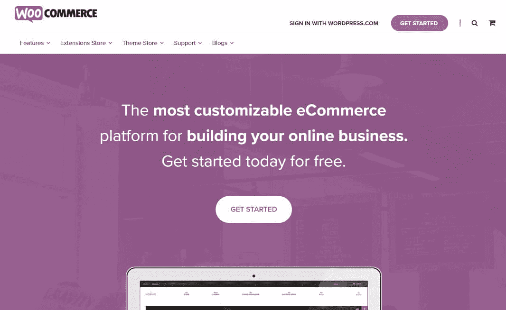

WooCommerce

*   WooCommerce **(免费)** —这是一个为你的 WordPress 网站提供的一体化电子商务解决方案插件。
*   [轻松的数字下载](https://easydigitaldownloads.com/) **【免费】** —这是销售数字下载和服务的电子商务商店的绝佳解决方案。
*   [Shopp](https://wordpress.org/plugins/shopp/) **【免费】**——有了这个插件，你可以经营销售、添加新产品、更新库存、运送订单等等。
*   [库存来源](http://www.inventorysource.com/how-it-works/) **(每月 50 美元至 175 美元)** —如果你想与你的电子商务商店直接合作，那么库存来源——直接与 WooCommerce 整合——将帮助你组织所有的运输信息。

虽然其中许多是免费的，但你很可能需要一些高级插件来确保它们按照你需要的方式运行。例如，如果你是一名开发人员，销售一款可轻松进行数字下载的插件，并使用定期订阅模式，以下是你最有可能需要的一些插件:

*   [定期支付](https://easydigitaldownloads.com/downloads/recurring-payments/) **(每年 199 美元)**—EDD 的附加服务，允许您为您的下载或数字产品设置定期订阅。
*   [Stripe 支付网关](https://easydigitaldownloads.com/downloads/stripe-gateway/)**(89 美元一年)** —让您在 EDD[通过 Stripe](https://kinsta.com/blog/stripe-vs-paypal/) 安全地接受信用卡。
*   [软件许可](https://easydigitaldownloads.com/downloads/software-licensing/) **(每年 199 美元)** —提供完整的许可密钥生成、激活和检查系统。
*   **【99 美元一年】** —许多插件和主题开发者需要一种方式将联盟营销计划整合到 EDD。AffiliateWP 是目前最好的解决方案。

如你所见，在 **WordPress 中获得你想要或需要的所有电子商务功能并不总是便宜的**。这可以根据你的电子商务需求变化很大。

## 你的时间

你应该考虑的另一个重要因素是你的时间。你的时间对你来说值多少钱？这是在启动网站时不经常讨论的事情，但它可能是最重要的事情之一。阿明、莎莉和约翰都是 WordPress 的开发者和设计师，他们在下面的评论中提到了这一点，所以值得强调一下。

> 时间——这是最重要也是最少被考虑的因素。你自己的时间！人们总是认为如果你自己做，基本上是免费的，但事实并非如此。尤其是因为即使你自己做了一个非常简单的网站，你也会花上几天时间。如果你是一名自由职业者，你已经知道如何计算你的时间价值。你自己有效地做这件事和让别人做这件事花费的一样多。–[阿明](https://twitter.com/seltzdesign)

> 商店设置和配置非常耗时，最好由有经验的人来完成，除非你自己的时间真的一文不值，而且你不会因为学习曲线和多花几周时间来设置你的商店而牺牲任何收入。–[莎莉](https://twitter.com/salliegoetsch)

> 一个很好的经验法则是决定你是时间多还是钱多(大多数企业的钱比时间多)。在这种情况下，最好是聘请专家来建立您的网站。–[约翰](https://twitter.com/Lockedown_)

此外，不要忘记事后的持续维护。

## 最后的统计是多少？

最终，你将花费**从 566 美元到 52，817 美元**不等。[价格取决于](https://websitesetup.org/website-cost/)你希望你的网站做什么，你希望它运行多快，你希望它多安全，你希望它处理多少流量。换句话说，你花的钱的多少会直接反映出你的网站能力有多强。

当然，WordPress 有能力处理你的流量、线索、选择加入、转化和客户。但前提是你使用正确的主题并添加正确的插件。

## 结论

世界上一些最强大的网站使用 WordPress。如果他们可以使用它，你也可以使用它。但是不要被骗了，以为这不会让你付出代价。

首先，你需要一个地方来托管你的网站。而且你付的越多，托管越好。你还需要一个域名来支撑你的在线财产，以及一个符合你网站意图的主题。然后，你需要添加正确的插件。如果你经营一家电子商务商店，你需要投入特别的注意力(和金钱)来使用正确的电子商务解决方案和添加正确的扩展。

当该说的都说了，该做的都做了，所有这些因素都会让你的钱包变薄。但是它们也会增加你的成功。换句话说，这钱花得值。😎

* * *

让你所有的[应用程序](https://kinsta.com/application-hosting/)、[数据库](https://kinsta.com/database-hosting/)和 [WordPress 网站](https://kinsta.com/wordpress-hosting/)在线并在一个屋檐下。我们功能丰富的高性能云平台包括:

*   在 MyKinsta 仪表盘中轻松设置和管理
*   24/7 专家支持
*   最好的谷歌云平台硬件和网络，由 Kubernetes 提供最大的可扩展性
*   面向速度和安全性的企业级 Cloudflare 集成
*   全球受众覆盖全球多达 35 个数据中心和 275 多个 pop

在第一个月使用托管的[应用程序或托管](https://kinsta.com/application-hosting/)的[数据库，您可以享受 20 美元的优惠，亲自测试一下。探索我们的](https://kinsta.com/database-hosting/)[计划](https://kinsta.com/plans/)或[与销售人员交谈](https://kinsta.com/contact-us/)以找到最适合您的方式。