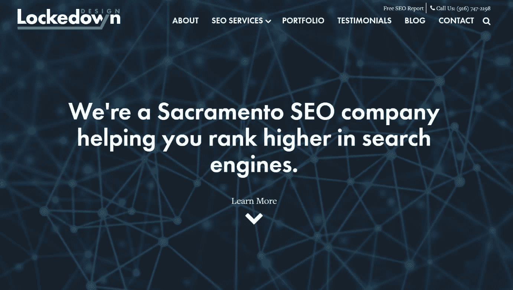

# 金斯塔·金并:约翰·洛克访谈录

> 原文：<https://kinsta.com/blog/interview-john-locke/>

你可以在 LinkedIn 或 T2 的 Twitter 上找到约翰。这是我们最近对他的采访，作为我们[金斯塔·金并](https://kinsta.com/?post_type=post&s=kingpin)系列的一部分。

### Q1:你的背景是什么，你是如何开始使用 WordPress 的？

我来 web 开发比较晚。最初，我在餐馆和面包店工作。我第一次来到萨克拉门托是因为工作调动，当时我在一家公司担任面包店经理。在我三十多岁的时候，我看到面包店工作的未来不会像那时那样。就在那时，我决定学习网页设计与开发。我在轮班期间学习了大约两年，然后开始为家人和朋友建立网站，只是为了练习和让代表们进来。

2012 年年中，我开设了[locked down Design](https://www.lockedowndesign.com/)，开始为网站建设收费。从那以后，这就成了我的全职工作。我在 2011 年左右发现了 WordPress。我为朋友建立的许多早期网站都在 WordPress 上。大约在 2013 年初，我还加入了当地的 WordPress 和 web 社区。从那以后，我的人生道路发生了巨大的变化。

Lockedown Design

### Q2:读者应该知道你最近在 WordPress 做了些什么？

最近，我更加关注 SEO，而不仅仅是另一个多面手。和我交谈过的许多在 WordPress 做得很好的人也是专业的。我认为曾经有一段时间成为一名 WordPress 专家就足够了，但我不确定现在是否还是这样。

发现一些你更感兴趣并且擅长做的事情需要时间，但我认为这是值得的，因为当人们有特定需求时，你会更加突出。我仍然在 WordPress 上开发定制网站，但这不再是我强调的主要卖点了。我喜欢关注 SEO，因为展示一个项目的 ROI 要清晰得多。

### Q3:在职业生涯中，你遇到了哪些挑战？

回想起来，我当时真的以为创业会比现在容易。我从没想过会很容易，但我现在所处的位置，我可以诚实地说，我低估了我现在所处的位置需要多长时间。明确地说，学习如何进行开发是挑战性较小的部分。这需要时间和练习。但是做业务发展是我真正需要学习的技能。

在我以前的生活中，我喜欢相信自己是企业家，但管理和企业家之间有着天壤之别。这是一个不同的场景，当你必须得到你自己的线索，然后关闭它们，然后做工作，然后做持续的支持。也就是说，我认为每个人都应该实践业务开发。如果你的工作或雇主出了什么事，这是一项很有用的技能。

[There's a world of difference between being managerial and being entrepreneurial. 😉 - JohnClick to Tweet](https://twitter.com/intent/tweet?url=https%3A%2F%2Fbit.ly%2F2AuTjPH&via=kinsta&text=There%27s+a+world+of+difference+between+being+managerial+and+being+entrepreneurial.+%F0%9F%98%89+-+John&hashtags=startup%2Centrepreneur)

### 在 WordPress 的世界里，有没有什么让你感到惊讶的事情？

真正让我吃惊的一件事是，我通过 WordPress 社区交了多少我从未见过面的朋友。这就是网络最初的魅力，能够在全世界范围内形成社区。我有很多朋友可以说同样的话:他们通过 WordPress 交了朋友，结成了联盟，距离不是一个因素。

## 注册订阅时事通讯

### 想知道我们是怎么让流量增长超过 1000%的吗？

加入 20，000 多名获得我们每周时事通讯和内部消息的人的行列吧！

[Subscribe Now](#newsletter)

### Q5:你认为 WordPress 世界的未来会是怎样的？

我看到自己继续帮助我在 WordPress 世界中称之为朋友的人，即使 WordPress 本身变得不同了。像许多人一样，我很想知道古腾堡会走向何方。希望这个项目继续将 WordPress 发展成人们继续热衷的东西。无论 web 开发的世界将我们带到哪里，我都希望关注接下来会发生什么。现在，代理商可以通过整体了解在线营销来提供价值，以及 WordPress 如何帮助支持这一点，所以这是我关注的事情。

### 你在 WordPress 主机中寻找什么？

我在主机中最看重的是页面速度、支持和工具，比如升级和迁移。能够轻松设置新实例或安装也很重要。现在，我认为托管 WordPress 主机推动了主机市场的许多创新。即使在五年前，托管市场看起来也有很大不同。

但是，即使现在有很好的主机选择，许多企业仍然使用低端主机，不能满足他们的需求或提供很好的服务。有时小企业最终会选择家乡的托管公司，他们更新 PHP 之类的东西很慢，或者安装 SSL 证书需要很长时间。我希望看到所有严肃的业务都有一个高质量的主机。

### 问题 7:当你离开笔记本电脑时，你喜欢做什么？

我喜欢弹吉他。早在 20 世纪 80 年代末和 90 年代初，我曾在车库乐队里写歌和演奏。今天，我仍然每天拿起吉他弹几下。卡拉 ok 对我来说也很有趣，现在你知道为什么了。

### 问题 8:接下来我们应该采访谁&为什么？

11Web 的萨拉·邓恩。我认为 Sara 对那些试图成长为代理公司的顾问有很多好的建议。

* * *

让你所有的[应用程序](https://kinsta.com/application-hosting/)、[数据库](https://kinsta.com/database-hosting/)和 [WordPress 网站](https://kinsta.com/wordpress-hosting/)在线并在一个屋檐下。我们功能丰富的高性能云平台包括:

*   在 MyKinsta 仪表盘中轻松设置和管理
*   24/7 专家支持
*   最好的谷歌云平台硬件和网络，由 Kubernetes 提供最大的可扩展性
*   面向速度和安全性的企业级 Cloudflare 集成
*   全球受众覆盖全球多达 35 个数据中心和 275 多个 pop

在第一个月使用托管的[应用程序或托管](https://kinsta.com/application-hosting/)的[数据库，您可以享受 20 美元的优惠，亲自测试一下。探索我们的](https://kinsta.com/database-hosting/)[计划](https://kinsta.com/plans/)或[与销售人员交谈](https://kinsta.com/contact-us/)以找到最适合您的方式。