# 14 个棒极了的 WordPress 页面生成器，可以省去编码

> 原文：<https://kinsta.com/blog/wordpress-page-builders/>

不久以前，可视化页面生成器还不存在。这意味着任何没有编码知识的人，如果他们想为他们的企业推出一个简单的销售页面或一个登陆页面来宣传一项新发明，那就太不幸了。

你不得不完全依赖网页开发者和设计者——而这需要很高的成本。此外，这些开发人员和设计人员不得不使用 CSS 和 HTML 在网站上做出哪怕是最轻微的风格改变——这项任务花费的时间远远超过任何人愿意承认的时间。

最终，短代码出现了，加速了那些想跳过整个 HTML 的人的开发过程。

但是真正的革命始于 WordPress 页面生成器——这是对 WordPress 的一个令人印象深刻的补充，它将设计变成了一个更加可视化的过程。

Web 开发者现在可以在很短的时间内制作更多的网站(为更多的客户和金钱让路)。此外，初学者和初创公司不必依赖昂贵的开发者，因为他们可以通过拖放元素来构建网站，如传送带、图像、视频、专栏、产品图库、[作品集](https://kinsta.com/blog/wordpress-portfolio-plugins/)等等。

## WordPress 页面生成器有什么意义？

你曾经尝试过创建像联系我们这样简单的页面吗？您可以在表单中包含用户姓名、网站、电子邮件地址和信息字段。然后，您可能希望插入一张通往您办公室的地图，以及一些指向您的支持页面和公司信息的链接。别忘了你的电话号码！

尽管联系我们页面是构建的最基本的页面之一，但是如果没有可视化的构建器，完成这个过程需要大量的格式化、编码和令人头疼的事情。然而，当你安装了一个 WordPress 页面生成器，这一切都改变了。不仅有经验的开发者可以加快开发过程，新手也不用再担心那一堆乱七八糟的代码。

此外，大部分内容会显示在屏幕上，就像它会显示在您的网站上一样。没有调整和点击预览按钮了！正如我们所建议的，联系我们页面是你能制作的最简单的网页，但是当你有一排排的内容时，WordPress 页面生成器提供了更多的优势。

以一个[电子商务主页](https://kinsta.com/blog/ecommerce-strategies/)为例。像这样的页面可能需要以下一些内容:

*   一个[滑块](https://kinsta.com/blog/wordpress-slider/)显示最近的促销活动。
*   一个 [WooCommerce 产品展示区](https://kinsta.com/learn/woocommerce-guide/)，展示商店中最受欢迎的商品。
*   最新版本的“添加到购物车”按钮。
*   过去客户的[推荐书清单](https://kinsta.com/blog/best-wordpress-review-plugins/)。
*   宣布最近产品发布的倒计时定时器。
*   顶部有一个[导航菜单](https://kinsta.com/blog/wordpress-menu-plugins/)，引导顾客找到最好的类别。
*   [社交分享按钮](https://kinsta.com/blog/wordpress-social-media-plugins/)。
*   动画标题来解释你的公司和它销售的产品。

安排所有这些需要相当多的时间，但是如果你习惯了构建器的界面，WordPress 页面构建器可能会把时间减少到 20 分钟。之后，最好的页面生成器允许列和内容重新定位、调整大小、列配置、填充、颜色等等。最精彩的部分？这些任务通常通过使用鼠标来完成。

[No coding, no problem... thanks to these easy-to-use page builders! 🚀Click to Tweet](https://twitter.com/intent/tweet?url=https%3A%2F%2Fkinsta.com%2Fblog%2Fwordpress-page-builders%2F&via=kinsta&text=No+coding%2C+no+problem...+thanks+to+these+easy-to-use+page+builders%21+%F0%9F%9A%80&hashtags=NoCode%2CHTML)

## 2022 年最好的 WordPress 页面生成器选项快速列表

我们将深入讨论每一个 WordPress 页面生成器，但是如果你想马上试用它们，请随意点击下面的列表。

## 为你的网站找到最好的 WordPress 页面生成器

互联网上有相当多的 WordPress 页面生成器，这使得选择一个变得相当棘手。好消息是，根据我们的测试，我们已经将您的选择缩减为具有优秀评级和令人难以置信的功能的选择。

对我们来说，页面生成器与大多数 WordPress 主题兼容也很重要。因此，我们将概述最好的，并谈论一些你可能会考虑一个 WordPress 页面生成器而不是另一个的情况。

### 1.元素者

Elementor 可以免费下载，但是你也可以选择付费购买 [Pro 版](https://elementor.com/pro/)。专业版一个网站起价 49 美元，无限量网站起价 199 美元。正如你会发现下面列出的特性，以及 Elementor 的易用性，这是相当便宜的。

免费的 Elementor 下载提供了一个简单而强大的 WordPress 页面生成器，拥有你能找到的最快的界面之一。从实时编辑到即时页面加载，一切都是即时的。标准页面生成器功能包括动画、形状分隔线、渐变背景和标题效果。甚至还有一个模板库，里面有令人惊叹的 WordPress 模板，你可以从中挑选。Elementor 的免费版本也是移动友好的，有一些方便的工具用于[维护模式](https://kinsta.com/blog/wordpress-maintenance-mode/)，正在建设的页面，登陆页面等等。

Elementor WordPress page builder

至于整体性能和功能集，你是选择专业版还是免费版并不重要。这主要取决于你的特定网站需要什么。也就是说，Elementor 的专业版是一个美丽的东西。

首先，Elementor Pro 包括超过 26 个小部件，用于设计完美的页面，无论是电子商务、作品集还是普通的商业网站。例如，你可以在整个网站中插入脸书按钮、页面和评论，同时还可以利用 WooCommerce 的小部件，比如类别、产品或元素模块。实时表单编辑器意味着您不必再花时间在后端处理表单。更不用说，您可以保存您的小工具，以传递到其他页面或网站。

#### 以下是你可能会考虑这个 WordPress 页面生成器的原因:

*   免费版有模板、快速设计区和真正的现场设计体验。
*   一个网站的付费版只需 49 美元起。
*   您将不必安装其他插件进行维护，即将推出，并登陆页面。
*   保存编辑过的 widgets，以便在整个网站上使用。
*   从超过 26 个小工具中选择，其中一些[包括视频](https://kinsta.com/blog/embed-youtube-video-wordpress/)、按钮、图标、社交图标、图片库和计数器。
*   你可以把你的网站翻译成几十种其他语言。
*   开发者 API 对 Elementor 插件开放，可以扩展并集成到其他系统中。

别忘了看看我们对 Elementor 的开发者 Ben Pines 的采访。

### 2.GeneratePress 用 GenerateBlocks 表示

GeneratePress 是一个免费的 WordPress 主题，但是我们认为它是一个简单的页面生成器解决方案，非常适合想要一个简单、快速的可视化生成器的初级网站管理员、博客作者和开发者。此外，你可以使用 GeneratePress Premium 及其免费的 [GenerateBlocks 插件](https://generateblocks.com/) 来可视化地构建几乎任何类型的网站。

先说主题本身。GeneratePress 是一个简单、轻量级、免费的 WordPress 主题，好评如潮，为登陆页面、博客、商业网站和销售页面提供了漂亮的布局。很难想象有哪个市场不能利用 GeneratePress 的主题，因为它是如此现代和干净。

不用说，如果你厌倦了笨重、缓慢的主题，值得看看 GeneratePress。

当使用免费主题时，大多数编辑是通过基于块的编辑器完成的，但是当您选择主题的高级版本时，您可以访问更多的模块(附加组件)。

[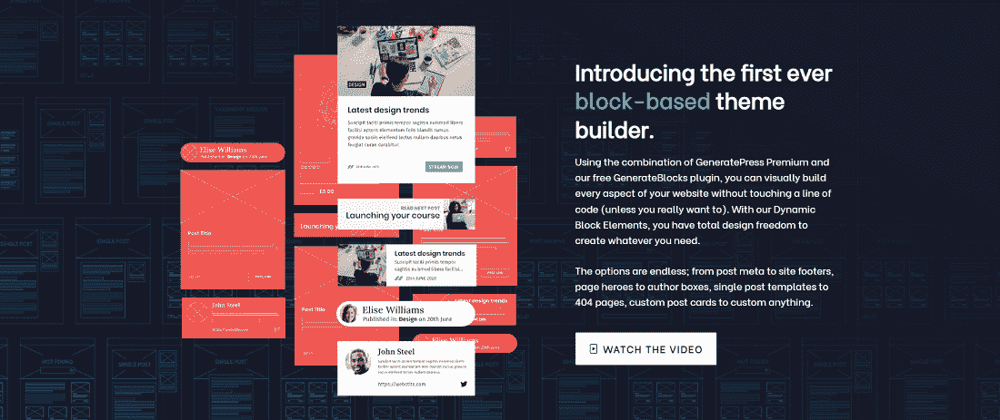](https://kinsta.com/wp-content/uploads/2017/12/GeneratePress-Theme-with-GenerateBlocks-Plugin.png)

GeneratePress theme with its GenerateBlocks plugin add-on.

即使没有 GenerateBlocks，GeneratePress 也提供了一种非常快速的方法来构建一个漂亮的网站。然而，一旦你添加了免费的 GenerateBlocks 插件，它就为广泛的设计打开了许多大门。如果您需要更多功能，您可以选择 GeneratateBlocks Pro。

简而言之，这个插件允许你添加一个块，然后向这个块添加内容，比如媒体、文本、标题、颜色和背景色。因此，你可以设计一个产品特性列表，用粗体文本、图片和链接。

正如我们提到的，GeneratePress 和 GenerateBlocks 的组合都与速度有关。一旦创建了所有的块，就可以通过拖放界面来移动它们。积木一个接一个地叠在一起，所以大部分的移动都是垂直进行的。

#### 以下是你可能会考虑这个 WordPress 页面生成器的原因:

*   GeneratePress 提供了在几分钟内创建和管理专业网站的潜力。
*   有一个免费的主题可以创造奇迹，但是你可以选择支付大约 59 美元/年的高级主题，它带有主题生成器、网站库和高级支持。
*   GenerateBlocks 插件为几个块添加了非常需要的多功能性，所以你所要做的就是移动你的内容来组织它们。
*   您可以在多达 500 个站点上使用 GeneratePress 的高级版本(对于大多数用例几乎没有限制)。换句话说，开发商或代理商只需支付 59 美元就可以为所有客户提供一个主题。
*   你可以得到很棒的模块，比如颜色、WooCommerce、排版、菜单、页眉、博客、背景、间距和挂钩。
*   您可以获得精心开发的性能优化，如动态 CSS 缓存、系统字体堆栈的默认选项(无字体文件)、无 jQuery 和更小的字体 Awesome essentials。

### 3.海狸建造者

Beaver Builder 为创意型用户提供了一个强大的 WordPress 页面生成器，这些创意型用户仍然渴望比以前的生成器更简单的东西。有免费的精简版和高级版。价格比大多数建筑商高一点。然而，你可以在不限数量的网站上使用 Beaver Builder，起价 99 美元。

代理计划中提供了白色标签(399 美元)，因此很明显，Beaver Builder 的员工也在考虑与客户一起开发房屋。

至于 WordPress 页面生成器，它允许你获得对你的设计元素的完全控制，这一切都是从现代和漂亮的模板开始，用一个拖放系统清理你的网站。Beaver Builder 拥有可视化构建器的精确性，这使它领先于其他具有挑剔控件的选项。

[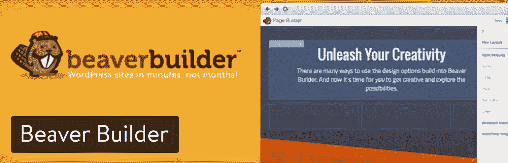](https://wordpress.org/plugins/beaver-builder-lite-version/)

Beaver Builder WordPress page builder

现场前端编辑是 Beaver Builder 发挥其威力的地方，因为在进行调整时，您不必一直点击预览按钮或猜测。它是一个移动友好的构建器，对 WooCommerce 的支持对那些在线商店很有用。您可以保存和重用行和模块以备后用，同时当第三方插件没有与 Beaver Builder 集成时，还可以利用短代码和小部件。

除了可重用的模板、开放的 API 和导入/导出功能，很难找到一个像 Beaver Builder 一样拥有如此多功能的 WordPress 页面生成器。

#### 以下是你可能会考虑这个 WordPress 页面生成器的原因:

*   现场前端编辑是实时进行的，因此没有猜测，您也不必等待屏幕上的变化。
*   页面生成器与 WooCommerce 配合得很好。
*   一些高级计划带有 Beaver Builder 主题，其特点是简单而强大的设计和一些精彩的预设，只需点击一个按钮即可制作几十种不同的风格。
*   你会得到几十个拖放模块，包括(但不限于)照片、[文本编辑器](https://kinsta.com/blog/best-text-editors/)、分隔符、折叠、行动号召、数字计数器、订阅表单和价格表。
*   代理计划提供白色标签、全网络设置和 DIY 网络发布平台，为您的客户提供最佳服务环境。
*   您的所有布局都可以保存并在网站上的其他地方重复使用。你甚至可以尝试将这些布局转移到其他网站。

### 4.红利

Divi 已经为自己赢得了一个名字，因为它来自优雅主题的令人印象深刻的开发者。和所有优雅主题产品一样，你必须加入成为会员才能解锁优雅主题提供的所有插件、主题和其他酷功能。这是一个开发者和机构的中心，他们需要一个充满了 [WordPress 插件](https://kinsta.com/best-wordpress-plugins/)和 [WordPress 主题](https://kinsta.com/best-wordpress-themes/)的库。也就是说，会员费起价仅为每年 89 美元，所以很难反对。

对于 Divi Builder 来说，这是一颗宝石，展现了无限的布局可能性。通过利用 46 个内容模块，您可以在任何主题上使用它。例如，一些模块包括:

*   手风琴
*   音频播放器
*   酒吧柜台
*   评论
*   圆规
*   电子邮件选择加入
*   投资组合
*   滑块
*   证明书

[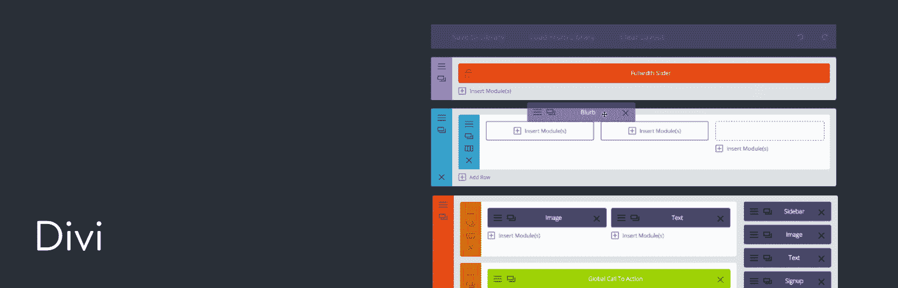](https://www.elegantthemes.com/plugins/divi-builder/)

Divi WordPress page builder

Divi Builder 允许多列，但是优雅主题网站上一些更有趣的设计显示了博客和登录页面的长格式内容。事实上,《优雅的主题》指出，Divi 非常适合用图像和互动元素的垂直展示来讲述一个诱人的故事。

简单的配置选项确保您不需要了解任何关于编码的知识。但是，如果您在 Divi 中找不到任何东西，或者您想加入一个完全独特的元素，您可以添加自己的自定义 CSS。和这个列表中的许多 WordPress 页面生成器一样，Divi 也有一个简单的点击就可以复制任何元素的功能。如果你想保存某个模块以备后用或者阻止其他人编辑，你甚至可以在后台隐藏或锁定它。

#### 以下是你可能会考虑这个 WordPress 页面生成器的原因:

*   Divi 拥有 46 个内容模块，是可供选择的最大的网站元素库之一。
*   你甚至可以得到一些漂亮的模板来开始工作。
*   复制、禁用和锁定项目。
*   Divi 提供了一个独特的“折叠”功能，用于整合您的视图和清理区域，以减少杂乱的设计体验。
*   Divi 还提供无限的重做和撤消。因此，您可以返回到很久以前所做的修订，并且仍然可以跳回到该修订。

推荐阅读: [Divi vs Elementor: WordPress 页面生成器插件对比](https://kinsta.com/blog/divi-vs-elementor/)

### 5.布里兹

Brizy 由开发 ThemeFuse、Unyson 和 Pixelkit 的团队制作。在 ThemeFuse，他们已经创建 WordPress 模板很多年了，所以他们知道用户需要什么，想要什么。他们致力于尽可能简单地为你的网站设计页面。

Brizy WordPress 有免费版和专业版。免费版附带了一组有限的功能和设计。专业版包括一切，单个网站的起价为 49 美元/年，100 个网站的起价为 99 美元/年(他们的自由职业者计划)，500 个网站的起价为 199 美元/年。

代理计划甚至可以使用完全去除 Brizy 品牌的白色标签。Brizy 还提供一些终身交易，这些交易没有重复成本。

Brizy WordPress page builder plugin

最后，Brizy 还提供了他们网站构建器的云版本。Brizy 用户只需点击一下，就可以在 Brizy Cloud 和 Brizy WordPress 之间迁移网站。

#### 以下是你可能会考虑这个 WordPress 页面生成器的原因:

*   负担得起的定价模式，特别是自由职业者和机构。
*   完整的白标功能，你可以以自己的品牌名称转售 Brizy(包括获得自己的白标 WP 插件)。
*   我们在页面生成器插件中见过的设计更好的用户界面之一。
*   130+完整的网站设计。
*   500 多个预制积木，打造您自己的设计。
*   有一个了不起的自动保存功能，这意味着你永远不会丢失你的工作。
*   有一个[脸书群](https://www.facebook.com/groups/brizy)可以和其他 Brizy 用户聊天，寻求更多的支持和想法。

### 6.WP 页面生成器

[WP 页面构建器](https://wordpress.org/plugins/wp-pagebuilder/)，免费的 WordPress 页面构建器于 2018 年 8 月 1 日上市，目前已经声名鹊起。这个页面生成器提供的特性是有原因的。据说 [Themeum](https://www.themeum.com/) 团队已经在研发上投入了数年时间&来交付完美的产品。

[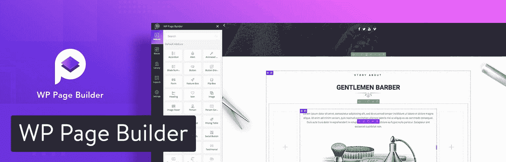](https://www.themeum.com/product/wp-pagebuilder/)

WP Page Builder plugin

这个页面生成器的圆滑和简单的设计将帮助你更快地理解它，即使你以前从未使用过任何页面生成器。工具栏非常容易理解，使得行和列的使用更加容易。创建附加组件是为了执行一组特定的任务，并且能够完美地执行它们。库部分允许您在工作的任何时候保存由一组附加模块组成的任何行。这项功能让您可以重复使用您的工作，从而节省大量时间。

WP 页面生成器的预设计块和布局是非常有用的元素。只需利用简单的拖放功能，您就可以通过单击创建一个页面。这些积木的内容非常丰富，提供了一个伟大的设计。布局包是一个很好的工具，可以在几秒钟内创建一个现成的页面。这些包包含一个或多个页面，因此可以只使用一个包中的一个页面。如果你想了解更多关于这个解决方案，你可以在这里阅读我们详细的 [WP 页面生成器评论](https://kinsta.com/blog/wp-page-builder/)。

#### 以下是你可能会考虑这个 WordPress 页面生成器的原因:

*   页面生成器侧重于前端编辑，为用户提供他们工作的良好视觉效果。对于那些喜欢实时现场编辑的人来说，这是一款完美的产品。
*   该页面生成器的简单拖放功能将允许您使用其附加组件、块和布局在任何页面上移动和管理它们。
*   它允许您禁用或隐藏任何现有的元素，以便以后清理，并允许您保存它们供以后使用。
*   您将可以访问一些预先设计的块和布局包，这将使您能够更快地工作，而不必担心新的设计概念。
*   使用 WP 页面生成器不需要任何编码技能，但是如果你想应用更高级的设计，你可以利用自定义 CSS 选项。

### 7.按站点来源的页面生成器

SiteOrigin 的 Page Builder 有免费版和收费版，售价 29 美元。您可以下载 SiteOrigin widget 包，无需提供电子邮件地址或支付额外费用。提供的小部件包括谷歌地图、标题、图像网格、价格表、邮政传送带等模块。将它与反应灵敏的 WordPress 页面生成器结合起来，你会发现你自己是一个适合所有体验层次的简单的内容创建界面。

## 注册订阅时事通讯

### 想知道我们是怎么让流量增长超过 1000%的吗？

加入 20，000 多名获得我们每周时事通讯和内部消息的人的行列吧！

[Subscribe Now](#newsletter)

这是一个简单的拖放系统，使用基于网格的技术以及与 SiteOrigin 和第三方小部件的集成。因此，您可以使用一些您更熟悉的小部件来构建您的网站。页面生成器具有实时前端编辑功能，但是您也可以选择在后端页面生成器中移动元素。这在你的内容顶部提供了一个简单的工具栏，带有添加小部件、添加行、使用预建模块或查看你的历史的按钮。

[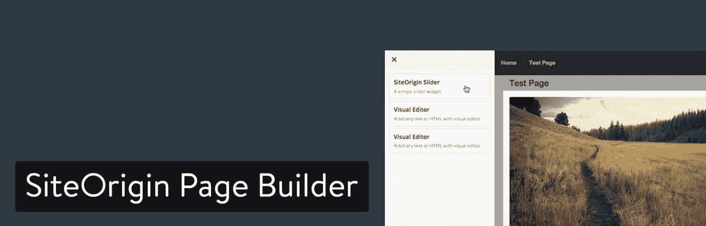](https://siteorigin.com/page-builder/)

SiteOrigin Page Builder

正如我们上面谈到的，SiteOrigin 的页面生成器是免费提供的，不需要升级支持或更新。但是，如果您需要额外的附加组件，如 SiteOrigin 自定义帖子类型生成器，可以升级到高级版本，这有助于进一步增强您的站点。

#### 以下是你可能会考虑这个 WordPress 页面生成器的原因:

*   如果你对一个平滑的没有价格标签的页面生成器感兴趣。这包括大量免费的小部件。
*   您不介意在论坛或文档中解决自己的客户支持问题。
*   你想要一个后端和前端实时页面生成器。
*   SiteOrigin 页面生成器提供了一个简洁的工具栏，易于理解。您可以添加最重要的元素，如行和小部件。
*   SiteOrigin 完美地集成了它自己的窗口小部件和你可能习惯在你的站点上拥有的任何其他第三方窗口小部件。

### 8.视觉作曲家

[视觉作曲](https://visualcomposer.io/)背后有强大的团队！它是由 WPBakery 的创建者开发的，WP bakery 是 CodeCanyon 上最受欢迎的页面生成器之一。除了易于使用之外，它还包含了中级和高级 web 开发人员会喜欢的特性。

例如，您可以获得 50 多个优质内容元素和 100 个预定义的布局。超过 40 个网格设计模板让您有一个良好的开端，超过 200 个独家第三方插件不会让您出错。Visual Composer 提供了前端和后端可视化编辑器。前端解决方案在你调整网站时向你显示实时结果，而后端编辑器更像是一个基于网格的界面，可以拖放模块。

[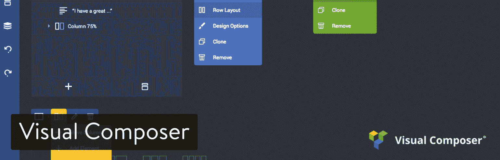](https://visualcomposer.io/)

Visual Composer WordPress page builder

正如您现在可能已经假设的那样，使用 Visual Composer 插件时不需要编码。事实上，开发人员已经添加了一种叫做“树形视图”的东西，它可以将你的构建器变成一个分层的界面，就像 Photoshop 或 Sketch 图层一样。

如果有一次你不能让一个设计元素看起来正确，或者你想变得有创意，让你的网站的一部分完全独特，你可以进入自定义 CSS 或自定义 Javascript 部分。当你需要给你的整个网站添加某种风格的时候，这可以在全球范围内或局部范围内完成。

#### 以下是你可能会考虑这个 WordPress 页面生成器的原因:

*   使用简单的拖放编辑器在页面中移动和管理您的布局和元素。
*   单独购买只需要 59 美元。
*   从技术上讲，你会得到一个 3-1 编辑器，带有后端、实时前端编辑器和树形视图。
*   Visual composer 允许您隐藏元素并保存它们以备后用，清理您的设计区域并提醒您有关该模块的信息。
*   WordPress 页面生成器不需要任何代码知识，但是那些有足够经验的人可以完全控制定制的 CSS 和 Javascript 区域。

### 9.页面生成器三明治

Page Builder Sandwich 主要作为一个免费插件，但也可以升级到 Page Builder Premium，它可以为您提供 1700 多个矢量图标、一个定制版本的谷歌地图、数百个短代码和插件，以及添加自己的 CSS 的能力。

我们喜欢初学者的页面生成器三明治，因为它主要依赖于一个前端可视化页面生成器。因此，你不必考虑任何后端设计，不需要了解任何代码。拖放元素非常简单，只有简单的文本框和图像。您可以使用鼠标自定义颜色和大小，并实时查看您所做的所有更改。

[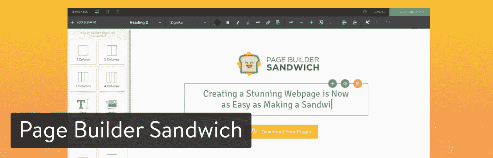](https://wordpress.org/plugins/page-builder-sandwich/)

Page Builder Sandwich

虽然没有后端拖放编辑器，但是页面生成器三明治很好地集成了默认的 WordPress 内容编辑器。因此，您可以跳回到那个编辑器来调整图像或文本，而来自可视化编辑器的代码不会被弄乱。

这个 WordPress 页面生成器是 Divi 和 Elementor 等选项的一个有些淡化的版本，但是如果你想清理混乱的话，它可以创造奇迹。例如，10 个整页模板作为起点是不错的，但是其他页面生成器有更大的库。

#### 以下是你可能会考虑这个 WordPress 页面生成器的原因:

*   免费版基本够一般站长跳进去开始设计，不需要培训。
*   高级版本有数百个插件和短代码，以及数千个矢量图标。
*   插件附带了 10 个页面模板，因此您不必从头开始构建您的网站。
*   WordPress 页面生成器呈现了一个漂亮的前端动态编辑器，这与对后端编辑器的任何编辑都不冲突。

### 10.氧

Oxygen 应用与普通的 WordPress 页面生成器略有不同，因为它通过一个独立的沙盒模块工作——仍然与 WordPress 相连——但实际上我认为它是独立的。我真正喜欢 Oxygen 的一个方面是，它去掉了你通常会在 WordPress 上看到的大部分主标签和工具栏，只关注页面生成器选项，如制作容器、段落和文本块的按钮。

氧气的定价是 99 美元。这包括 30 天退款保证和无限量网站的终身更新。因此，您不必为简单的支持和更新支付年费。

[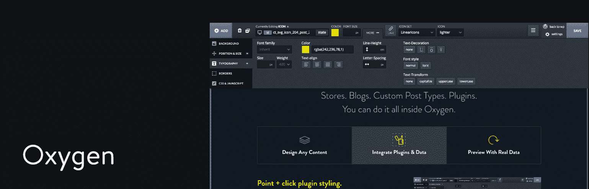](https://oxygenbuilder.com/)

Oxygen WordPress page builder

Oxygen 的目的是在几分钟内创建网站，预建的组件允许你快速生成自己的设计。如果你想以一种更传统的方式建立你的网站，HTML 元素也包括在内。Oxygen 具有导入/导出功能，可以快速将设计从一个站点转移到另一个站点。此外，你可以使用 Oxygen 和其他页面生成器，比如 Visual Composer、Beaver Builder 和 Elementor。如果你在每一个你喜欢的 WordPress 页面生成器中找到某些功能，这是一个很大的优势。

对我来说，Oxygen 的界面看起来和 Photoshop 的界面很像。一旦你做了一些练习，它就很容易理解，而且如果你学会如何使用它们，它有大量的工具。然而，我认为这对于第一次使用的人来说有点吓人。也就是说，更有经验的开发人员应该会发现它很有用，尤其是在支持 Javascript、HTML、PHP 和 CSS 的情况下。

需要一个给你带来竞争优势的托管解决方案吗？Kinsta 为您提供了令人难以置信的速度、一流的安全性和自动伸缩功能。[查看我们的计划](https://kinsta.com/plans/?in-article-cta)

#### 以下是你可能会考虑这个 WordPress 页面生成器的原因:

*   Oxygen 提供了完整的编码能力(Java、HTML、PHP 和 CSS)以及一个可靠的可视化前端构建器。
*   您可以将 Oxygen 与 Elementor 等其他页面生成器结合使用，以防您喜欢两者的功能。
*   这个 WordPress 页面生成器为你提供终身更新和支持，你可以在任何你想要的客户站点上使用它。

### 11.现场作曲家

Live Composer 是另一个免费的开源 WordPress 页面生成器，所以你可以通过输入你的电子邮件地址和名字导航到这个网站并下载插件。它提供了一个前端拖放界面，所以你不需要知道任何关于编码。编辑器做出了一个响应式的设计，它带有 40 多个内容模块，可以快速轻松地进行开发。

Live Composer 有两个主题供您开始设计，它提供了一个特定的 WooCommerce 集成，您可以花 69 美元购买。这提供了从产品页面到购物车页面的全面定制。

[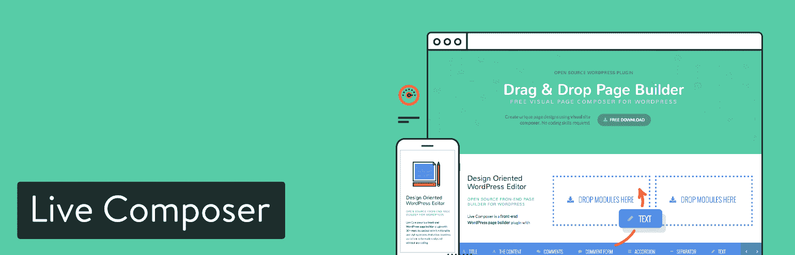](https://livecomposerplugin.com/)

Live Composer WordPress page builder

你唯一需要支付的部分是你是否需要 WooCommerce 的支持或者许多扩展之一。这些扩展套装售价 49 美元。

除此之外，Live Composer 插件是一个基本的、直观的、适用于所有技能水平的构建器。我希望看到一个更全面的免费版模块列表，但是如果需要的话，你可以利用这些扩展。

#### 以下是你可能会考虑这个 WordPress 页面生成器的原因:

*   您不必为页面生成器支付一分钱。
*   你可以选择付费购买一个完整的拖放式 WooCommerce 编辑器。
*   该公司还出售谷歌地图、视频嵌入、图库图像和动画等高级扩展。

### 12. **MotoPress 内容编辑器**

MotoPress 内容编辑器页面生成器的曝光度不如列表中一些更受欢迎的选项。然而，这是一个负担得起的解决方案(每年 39 美元)，支持所有主题、页面、帖子和自定义帖子类型。此外，如果你注册了 MotoPress 会员，这个页面生成器是免费的(尽管它们有点贵)。

MotoPress 内容编辑器与 WordPress 编辑器相结合，创建了一个完全可视化的前端编辑体验。更不用说，如果你有一个网站网络，这个插件是兼容的。

标准插件提供了几个预制的主题和一个多语言界面来改变你的网站文本，让每个人都能理解。即使你只对完整的 Woocommerce 支持或附带的 Google Web 字体感兴趣，MotoPress 的可视化页面生成器也值得一看。

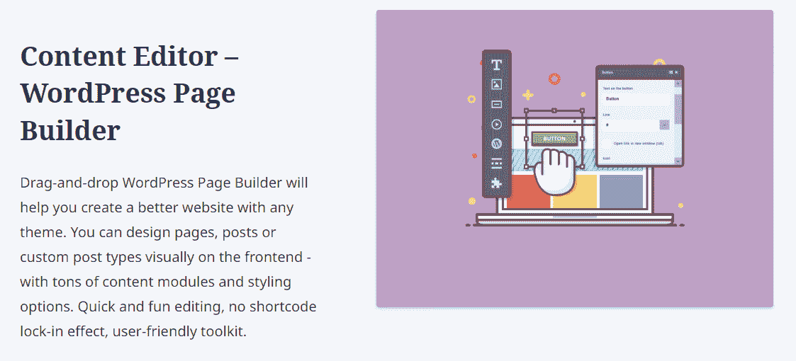

MotoPress

如果你选择成为 MotoPress 俱乐部的年度会员(起价 299 美元)，你还可以使用他们的其他高级插件。一些插件包括以下选项:

*   白色标签支持
*   视频滑块和视频灯箱
*   谷歌地图专业版
*   定价表
*   简单的[联系方式](https://kinsta.com/blog/wordpress-contact-form-plugins/)
*   图像热点
*   倒计时模块
*   一个扩展的 WooCommerce 插件

#### **这就是为什么你可能会考虑这个 WordPress 页面生成器:**

*   对于一个高级页面构建者来说，这是相对便宜的。
*   该插件更侧重于实时可视化页面生成器，所以如果你对后端不感兴趣，它会很棒。
*   你在标准插件中获得了一点 WooCommerce 支持。
*   WordPress 页面生成器包括一些预制的页面模板和主题。
*   [插件与 WordPress multisite 兼容](https://kinsta.com/blog/wordpress-multisite-plugins/)。

### 13.主题化生成器

主题化构建器有一个明显的优势，就是内置在所有的主题化主题中，所以如果你偶然发现一个符合你需求的主题化主题，你不必担心集成第三方 WordPress 页面构建器或支付任何额外的费用。

还有一个 Builder Pro 选项，价格为 69 美元，包含 25 个附加组件。在这些附加组件中，您可以选择 WooCommerce 支持、价格表元素、地图集成等等。

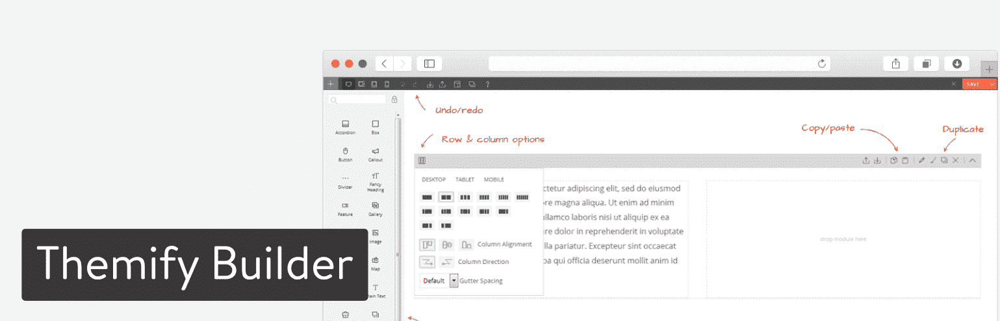

Themify Builder

或者，有一个免费版本的主题构建器，你可以使用任何主题。免费的页面生成器具有跨所有分辨率的响应元素。前端实时预览编辑消除了后端的混乱，而默认的拖放模块包括以下内容:文本，音频，手风琴，画廊，帖子，小部件，等等。

高级主题化页面生成器为高级开发人员提供了更多，因为它有一个区域可以键入您自己的自定义 CSS。这开启了各种定制的可能性，同时也很好地与可重用部件特性相结合，用于定制 CSS 模块并在其他地方重用它们。

高级版的主要优势是 60 多种预先设计的构建器布局。您还可以获得超过 60 个动画效果和最真实的设计中心的响应样式。

在这个版本中，修订控制也被扩展了，它允许你保存无限数量的布局版本。最后，附加组件帮助你把 WordPress 页面生成器变成你唯一需要的插件之一。一些附加组件允许:

*   幻灯片放映
*   无限帖子
*   打字机效果
*   背景视频滑块
*   专业地图
*   进度条
*   时间表
*   计数器
*   A/B 图像显示

Themify 的 Builder Pro 的一个缺点是，许多这些附加组件都是其他页面生成器现成包含的功能，如幻灯片显示和滑动图库。因此，除非您使用主题化主题，否则可能会有更好的页面生成器选项。

#### 以下是你可能会考虑这个 WordPress 页面生成器的原因:

*   付费版包括 25 个附件。
*   它包含在他们的任何主题中。
*   主题化生成器有超过 60 种预先设计的生成器布局和 60 种动画效果。
*   它提供了一个不寻常的工具，允许你根据所使用的设备隐藏一些网站元素。
*   你也可以选择自定义 CSS，以防你想回到更传统的设计方法。

### **14。古腾堡(块编辑器)**

古腾堡，也被称为[块编辑器](https://kinsta.com/blog/gutenberg-wordpress-editor/)是 WordPress 的一个相对较新的补充。它已经存在了几年，在那段时间里，它从一些人认为是噱头的东西成长为一个非常有能力的页面生成器。

Gutenberg

可以说，块编辑器不是页面生成器，因为它是 WordPress 核心的一部分。然而，它显然是为了提供更直观的编辑体验而设计的，模仿了页面生成器。

使用块编辑器，您可以访问预构建的块(您也可以[制作自己的](https://kinsta.com/blog/gutenberg-blocks/))、拖放功能和可定制的元素。此外，有很多*插件为 WordPress 添加新的模块，包括 WooCommerce，全部免费。*

在块的顶部，编辑器还允许您创建可重用的内容部分，并允许您访问少量的模板。如果你使用一个“支持阻止”的主题，你可以使用编辑器自定义它的页面模板并添加新的模板。这意味着不再需要使用代码从头开始创建页面模板。

如果您以前使用过其他页面生成器，那么块编辑器可能会有点笨拙。你没有太多的选项来定义布局，而且编辑器可能缺少高级模块，除非你安装了附加插件。然而，如果你不想花钱买一个高级页面生成器或者安装另一个插件，Block Editor 提供了很多免费的升级。

#### **这就是为什么你可能会考虑这个 WordPress 页面生成器:**

*   这是 WordPress 的默认编辑器(这意味着它是免费的)
*   你可以使用插件来扩展块库(大部分是免费的)
*   大多数现代主题旨在提供块编辑器的良好体验
*   您可以使用块来构建可重用的页面部分
*   一些主题使您能够使用块编辑器来创建和定制页面模板

### **附加页面生成器和多用途主题**

市场上有如此多的页面生成器，我们无法一一介绍，但这里有几个额外的值得一提。

*   [Pootle Pagebuilder](https://wordpress.org/plugins/pootle-page-builder/) (免费和付费)
*   [茁壮成长建筑师](https://thrivethemes.com/architect/)来自茁壮成长主题(premium)
*   [OptimizePress](https://www.optimizepress.com/) (高级)

当然，我们不能忘记流行的主题，如 [Avada](https://avada.theme-fusion.com/) 和 [X WordPress 主题](https://theme.co/x/)。Avada 内置了自己的 Fusion Builder，X 主题捆绑了 Visual Composer 和自己的 Cornerstone。Cornerstone 也可单独购买。但是我们会在另一篇文章中更深入地讨论[多功能主题](https://kinsta.com/knowledgebase/what-is-a-wordpress-theme/)。😉

## **WordPress 页面生成器缺点**

就像每个产品或插件一样，总有一些缺点，WordPress 页面生成器可能会有一些争议，这取决于你问的是谁。下面是用户和开发人员对页面生成器的两个主要批评:

*   一些页面构建者可能会增加你网站的加载时间。这是因为他们不得不[加载额外的 CSS 和 JS](https://kinsta.com/blog/eliminate-render-blocking-javascript-css/) 来让事情在没有代码的情况下为你工作。我们总是建议在安装页面生成器之前和之后对你的 WordPress 站点进行[速度测试](https://kinsta.com/blog/website-speed-test/)。
*   你做出了承诺，把自己锁进了设计页面生成器。确保你选择了一个定期更新的，并且拥有你长期需要的一切的。

[Build more sites in less time, thanks to these page builders ✅Click to Tweet](https://twitter.com/intent/tweet?url=https%3A%2F%2Fkinsta.com%2Fblog%2Fwordpress-page-builders%2F&via=kinsta&text=Build+more+sites+in+less+time%2C+thanks+to+these+page+builders+%E2%9C%85&hashtags=NoCode%2CHTML) ## 现在轮到你选择最好的 WordPress 页面生成器了

当你在谷歌上搜索 WordPress 页面生成器时，你一定会找到各种各样的结果。希望本指南能让你减少选择，并根据你的预算、经验水平和你想要的功能做出明智的决定。

为了让你更容易理解，下面是一些最终结论:

*   如果你想让你的钱发挥最大作用(物超所值):考虑 Elementor、Divi、Beaver Builder 或 Brizy。
*   如果你对一个快速简单的页面生成器感兴趣:试试 GenerateBlocks 的 GeneratePress，SiteOrigin 的页面生成器，或者 WP 页面生成器。
*   如果你想要一个免费的 WordPress 页面生成器:看看 Elementor，page builder Sandwich，Live Composer，或者 SiteOrigin 的 Page Builder。
*   如果你正在寻找一个更强大的支持高级编码的页面生成器:看看 Divi、Themify、Visual Composer 或 Oxygen。

如果你对最好的 WordPress 页面生成器有任何疑问，请在下面的评论中告诉我们。此外，与您使用过的页面生成器分享您的经验，以便其他人可以了解更多。

* * *

让你所有的[应用程序](https://kinsta.com/application-hosting/)、[数据库](https://kinsta.com/database-hosting/)和 [WordPress 网站](https://kinsta.com/wordpress-hosting/)在线并在一个屋檐下。我们功能丰富的高性能云平台包括:

*   在 MyKinsta 仪表盘中轻松设置和管理
*   24/7 专家支持
*   最好的谷歌云平台硬件和网络，由 Kubernetes 提供最大的可扩展性
*   面向速度和安全性的企业级 Cloudflare 集成
*   全球受众覆盖全球多达 35 个数据中心和 275 多个 pop

在第一个月使用托管的[应用程序或托管](https://kinsta.com/application-hosting/)的[数据库，您可以享受 20 美元的优惠，亲自测试一下。探索我们的](https://kinsta.com/database-hosting/)[计划](https://kinsta.com/plans/)或[与销售人员交谈](https://kinsta.com/contact-us/)以找到最适合您的方式。