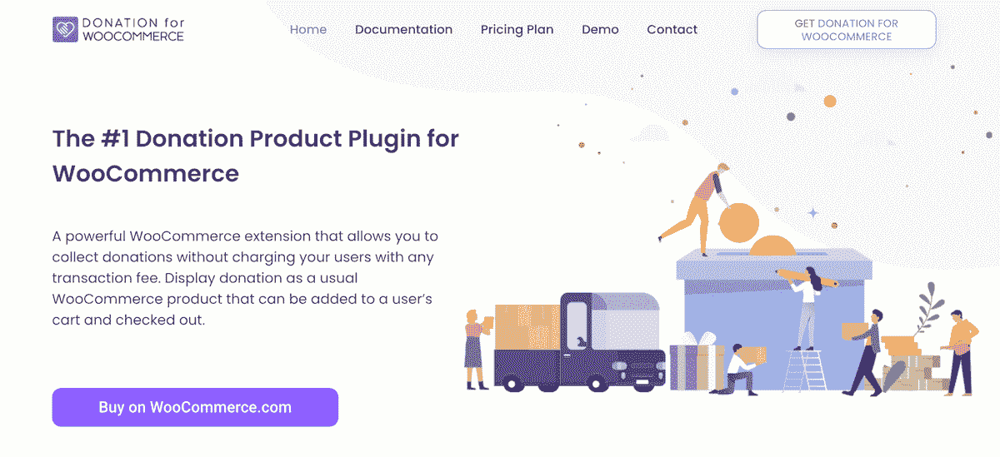
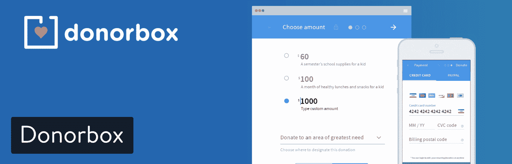
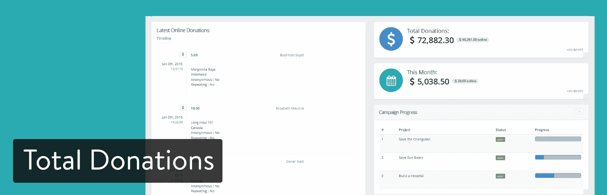

# 11 个用于慈善、救济和支持的 WordPress 捐赠插件

> 原文：<https://kinsta.com/blog/wordpress-donation-plugins/>

如果你提供一些东西作为回报，那就不是乞求了！许多职业创造了艺术、幸福、繁荣或世界变化，但都无法像普通企业那样销售产品和赚钱。

有时是雨林活动家阻止大公司砍伐树木。有时候是一个博主，每天发布鼓舞人心的文章。从设计师到作家，从政治家到慈善机构，有时销售产品或服务并不在考虑范围之内。

这时候他们就会求助于捐赠。我认识很多致力于捐赠的博客作者和开发者。大多数政治活动、教堂和非营利组织也是如此。

看起来你需要出去向富人讨钱，但是你需要的只是一个 WordPress 捐赠插件和一些其他的元素。

*   为什么 WordPress 对慈善机构如此有吸引力？
*   [通过你的网站接受捐赠需要什么](#wordpress-donations)
*   [最好的 WordPress 捐赠插件](#wordpress-donation-plugins)

## 为什么 WordPress 对慈善机构如此有吸引力？

卵巢癌国家联盟是非营利组织的一个很好的例子，它在全国范围内开展业务，并为当地的合作组织提供支持。他们正在使用一个定制的响应主题，该主题已经与一个电子商务解决方案集成在一起(在本例中是 [WooCommerce](https://kinsta.com/blog/woocommerce-tutorial/) )。让我们来看看使 WordPress 成为管理你的慈善机构的数字存在的理想平台的关键特性:

### 它是开源和免费的

不要被 WordPress 是开源和免费的事实所吓倒！庞大的用户基础让这个平台成为今天的发电站。如果你的慈善机构需要一些特定的网站功能，99%的把握可以在 WordPress 平台上完成。开源也意味着保持 WordPress 平稳运行的代码不被某个专注于从你的使用中获利的公司所拥有或控制。

### 它是可扩展的

无论你的慈善机构现在规模有多大，你都希望选择一个能在未来几年支持你成长的平台。拥有超过 120 个 WordPress 的修订版和超过 10 年的发展历史，WordPress 很难被击败。

> Kinsta 把我宠坏了，所以我现在要求每个供应商都提供这样的服务。我们还试图通过我们的 SaaS 工具支持达到这一水平。
> 
> <footer class="wp-block-kinsta-client-quote__footer">
> 
> 
> 
> <cite class="wp-block-kinsta-client-quote__cite">Suganthan Mohanadasan from @Suganthanmn</cite></footer>

[View plans](https://kinsta.com/plans/)

### 它拥有庞大的用户群和支持系统

让 WordPress 成为如此令人惊叹的平台的部分原因是围绕着它的生态系统。无论你需要有人从零开始开发一个主题，定制一个预建的主题，还是设计一个符合你特定要求的[插件](https://kinsta.com/knowledgebase/wordpress-plugin/)，你都可以轻松找到你想要的。

### 这对社区来说很好

如果你的慈善机构依赖于社区的参与，WordPress 也为你提供了帮助。BuddyPress 通过管理员面板快速轻松地安装。一个免费插件 [BuddyPress](https://buddypress.org/) ，可以让你在自己的网站上发展和壮大一个社区或社交网络。你可以使用 BuddyPress 创建内部团队，并与专注于不同筹款工作、项目或社区活动的内部团队进行沟通。

### 它是高度可定制的

从简单的颜色调整到复杂的布局和结构变化，WordPress 已经涵盖了所有的基础。几乎平台的每个方面都可以调整，以适应您的慈善机构的需求。许多基本的更改可以在几分钟内完成，而更复杂的更改可能需要有经验的开发人员钻研代码。

### 它提供了大量的主题选择

对于大多数慈善组织来说，保持低成本是很重要的。你会发现 WordPress 有一个免费和付费主题的完整目录，其中许多是专门为慈善机构设计的。请记住，一个便宜的付费主题通常可以满足你最初的需求。

## 通过你的网站接受捐赠你需要什么

*   免费下载流行的 CMS 软件，运行你想要的任何类型的网站。
*   **优质托管**–[Kinsta 为所有非营利组织提供托管折扣。虚拟主机通过存储和管理网站文件让你上网。](https://kinsta.com/web-hosting-for-nonprofits/)
*   **域名**–这是您的非营利网站的名称。它通常类似于慈善机构或非盈利机构的名称。
*   慈善或非政府组织主题–你可以得到一个普通的 WordPress 主题，但是慈善主题有捐款按钮、时间安排系统和筹款信息部分。
*   一个 WordPress 捐赠插件——我们将在下面讨论这些。
*   **支付网关**——通过你的捐赠插件处理和接受支付的系统。

一开始看起来可能有点吓人，但是在配置好之后，你通常不需要考虑托管。WordPress 和你的域名也是一样。唯一需要维护的元素是 WordPress 捐赠插件，那是因为你正在收集捐赠，并且在想新的方法为你的组织积累更多的钱。

## 2022 年最佳 WordPress 捐赠插件

这是我们将要讨论的内容的简要概述。如果你想了解每个 WordPress 捐赠插件的主要好处，请继续阅读。

T3】

### 1.捐赠插件和筹款平台

有时候很难挑出最喜欢的，但是在 WordPress 捐赠插件世界里，完全不是这样。在价格、美观、功能和附加组件方面， [Give](https://wordpress.org/plugins/give/) 捐赠插件远远领先于其他插件。该插件通过免费增值模式赚钱，但没有任何附加内容会推给你。事实上，大多数非营利组织和慈善机构都可以使用默认的捐赠形式，不需要任何附加条款。

从下面的截图(以及 Give 网站上的[演示)中你可能会注意到，开发人员在设计漂亮的表单方面投入了大量的工作。这些形式比列表中的大多数其他插件都要好，而且没有必要定制它们。](https://givewp.com/demos/)

Give WordPress plugin

免费的 WordPress 捐赠插件包括光滑的捐赠表格，全功能的报告，完整的捐赠者管理，以及与任何你喜欢的主题或页面生成器集成的可能性。就像我之前说的，大多数组织不需要更多。

然而，你可以考虑一个[附加包](https://givewp.com/addon-bundles/)(每月 15 美元起)或者单独支付附加包。

无论您的支付方式如何，以下是一些可供您选择的附加组件:

*   经常性捐赠
*   表单字段管理器
*   费用回收
*   贡品
*   PDF 收据
*   多个支付网关，如 Stripe、PayPal 和 Authorize.net(如果你不知道 Stripe 和 PayPal 哪一个更好[阅读这个比较](https://kinsta.com/blog/stripe-vs-paypal/)
*   谷歌分析捐赠跟踪
*   [萨帕尔](https://kinsta.com/blog/woocommerce-zapier/)
*   人工捐赠
*   更多的

#### 为什么这个 WordPress 捐赠插件？突出的特点:

*   捐赠表格看起来很专业，包括报告和捐赠者管理，全部免费。
*   您可以根据自己需要的附加组件付费。
*   默认捐赠表单包括基本的经常性捐赠功能。
*   将自定义字段和目标放在您的捐赠表格上，以吸引更多人捐赠。
*   这些表单可以定制，但是它们在任何主题上看起来都非常好，开箱即用。
*   Give support 文档不仅令人印象深刻，而且在您付费之前，它还有一整页的演示。这是我见过的最好的 WordPress 插件网站之一。
*   您不会被收取任何交易费用。

### 2.慈善捐赠插件

[慈善捐赠](https://wordpress.org/plugins/charitable/)提供免费的 WordPress 捐赠插件，支持地理定位、简单更新、视频、用户头像、匿名捐赠，甚至一年的高级支持。开发者要求你“支付你想要的”,这样你就可以选择支持这个插件或者免费获得它。

如果你看看这里的[高级会员资格](https://www.wpcharitable.com/)，你会注意到它们从每年 99 美元开始，到每年 249 美元。考虑到您可以获得时事通讯集成、礼品援助、对轻松数字下载的支持以及高级支付网关，这是一个不错的定价计划。

Charitable WordPress plugin

最贵的版本(每年 249 美元的计划)提供以下一些功能:

*   经常性捐赠
*   点对点筹款
*   [众筹平台](https://kinsta.com/blog/crowdfunding-options-wordpress/)
*   自动众筹支付
*   你从低价计划中得到的一切

所以，慈善肯定有其独特之处。我们特别喜欢免费版本中的视频和地理定位工具。也很高兴看到匿名捐款支持，因为不是每个人都喜欢看到自己的名字在捐款后被贴满互联网。

#### 为什么这个 WordPress 捐赠插件？突出的特点:

*   根据地点募集捐款。
*   慈善不收交易费。
*   连接热门的支付网关，如 Stripe、Authorize.net、PayUMoney 和 PayFast。
*   有一个点对点的筹款扩展来扩大你的影响。
*   大约 [15 个扩展被出售](https://www.wpcharitable.com/extensions?utm_source=readme&utm_medium=description-tab&utm_content=extensions&utm_campaign=plugin-page-referrals)用于扩展你的捐赠表格的功能。
*   与您的贡献者共享活动更新。
*   所有的慈善定价计划都允许一个站点许可和一年的高级客户支持。
*   在线支持包括票务系统、 [FAQ](https://kinsta.com/blog/wordpress-faq-plugins/) 、文档和博客。

### 3.为 WooCommerce 捐款

WooCommerce 的捐赠是一个强大的 WooCommerce 插件，可以帮助你为慈善机构筹集资金，而不需要向你的客户收取交易费。捐赠将作为一个标准的 WooCommerce 产品呈现，可以添加到用户的购物车中并进行结账。在捐赠产品的帮助下，您可以添加“捐赠接受”作为标准的 [WooCommerce 产品](https://kinsta.com/knowledgebase/how-to-add-products-in-woocommerce/)，这样捐赠就可以放入访客的购物车并在那里进行支付。

Donation for WooCommerce

你可以在捐赠标签页上同时显示几个筹款活动。在前端，选项卡显示为选项。此外，您可以显示您的捐赠活动的客观进展(筹款栏)。这将帮助您改进捐赠小部件的功能。

这是一个为非营利组织、慈善机构、非政府组织、俱乐部和其他在你的电子商务网站上接受捐赠的事业筹款的好方法。与流行的假设相反，如果你有合适的工具和插件，贡献系统对每个人来说都很容易管理。

此外，您可以在捐赠窗口小部件上展示您的捐赠活动摘要(标题和描述)。通过为 WooCommerce 捐款，您可以调整捐款活动的最终目标。通过这个，你可以看到进度，并点击重置。

#### 为什么这个 WordPress 捐赠插件？突出的特点:

*   利用 WooCommerce 订阅扩展来接受经常性捐款。
*   为你的活动结束时应该收到的捐款设定一个目标。
*   用户可以选择同时支持多个活动。
*   每天、每周或每月定期捐款。
*   当活动达到目标时，展示独特的“感谢信息”
*   使用[短代码](https://kinsta.com/ebooks/wordpress/woocommerce-shortcodes/)在网站的网页上展示贡献小部件。
*   用户可以选择一次性支持不同的活动。

### 4.PayPal 捐款

[PayPal 捐款](https://wordpress.org/plugins/paypal-donations/)听起来可能不像你在寻找的东西，但你会惊讶于这个小东西是多么光滑和强大。事实上，PayPal 知道如何正确地进行捐赠是有道理的，因为该公司已经收取款项有一段时间了。

我向任何喜欢 PayPal 产品简单性的人推荐 PayPal 捐款。PayPal 的所有东西初学者都可以用，和你的组织一起成长没有任何问题。

PayPal Donations WordPress plugin

请记住，这个 WordPress 捐赠插件实际上不是由 PayPal 创建的。它使用支付网关，但你不应该指望贝宝的客户支持。

也就是说，PayPal 捐赠为你的 WordPress 仪表盘添加了一个捐赠短码。这样，您可以在任何页面上插入短代码，或者在侧边栏或页脚中激活小部件。这就是全部了。当然，你必须链接到你的贝宝账户，但这只需要一分钟。

## 注册订阅时事通讯

### 想知道我们是怎么让流量增长超过 1000%的吗？

加入 20，000 多名获得我们每周时事通讯和内部消息的人的行列吧！

[Subscribe Now](#newsletter)

#### 为什么这个 WordPress 捐赠插件？突出的特点:

*   这是在你的网站上开始募集捐款最快最简单的方法。
*   插件中已经内置了大约 15 种翻译，大部分不再需要安装额外的翻译插件。
*   PayPal 捐款按钮已经为您设计好了。这减少了开发时间。这也很好，因为这么多人认可并信任 PayPal 品牌。
*   shortcode 和 widget 很容易找到并添加到页面、侧栏或帖子中。

### 5.无缝捐赠

与许多其他 WordPress 捐赠插件类似，你可以免费下载[无缝捐赠](https://wordpress.org/plugins/seamless-donations/)，然后根据需要购买附加组件和扩展。开发者声称你可以在五分钟内安装好插件。所有需要做的就是连接到你的贝宝账户和一些设置。

与其他顶级捐赠插件一样，无缝捐赠不收取交易费。相反，它通过附加销售赚钱。

Seamless Donations WordPress plugin

至于基本的插件功能，可以从收集循环捐款开始。之后，该插件有跟踪捐赠者和捐赠的工具。感谢信息也包含在功能集中，允许你感谢一些 VIP 捐赠者。

无缝捐赠插件有强大的货币和语言支持，所以你更有可能收到来自世界各地的捐款。

此外，这里列出了最受欢迎的附加组件:

*   捐赠级别经理
*   增强型感谢信息
*   删除捐赠、捐赠者和基金
*   反垃圾邮件
*   CSV 导出

#### 为什么这个 WordPress 捐赠插件？突出的特点:

*   经常性的捐赠被嵌入到插件中，所以没有必要再添加了。
*   许多货币(如泰铢和匈牙利福林)都被接受。翻译也是如此。
*   该插件对捐赠者和基金使用标准的帖子类型，因此更容易跟踪你的捐赠网站上发生了什么。
*   插件开发者通过 [FAQ](https://kinsta.com/blog/wordpress-faq-plugins/) 、文档、视频教程和论坛提供支持。

### 6.WooCommerce 捐赠插件

如果你目前正在经营一家网上商店，或者想成为你的慈善/非营利网站的一部分，安装 [WooCommerce 捐赠插件](https://codecanyon.net/item/woocommerce-donation-plugin/6648465?)以通过你的电子商务商店接受捐赠是值得的。基本功能是将捐赠作为常规产品添加，然后客户将该产品添加到购物车中，为其付款，然后并没有得到实际的产品作为回报。另一个选择是在购物车中包含一个捐赠栏，提示顾客在他们已经支付的基础上再额外捐赠一点。

WooCommerce Donation plugin

购物车中的字段接收任何面额的捐款，然后将捐款添加到客户的总额中。报告在后台提交，你可以决定多少收入来自捐赠，多少来自常规产品。

许多非营利组织已经在销售帽子、杯子和 t 恤等商品，那么为什么不加入捐赠选项，看看人们是否想变得更加慷慨？

#### 为什么这个 WordPress 捐赠插件？突出的特点:

*   这并没有改变你的网上商店，但是它给了顾客一个在订单上捐款的机会。
*   简单的报告引导你决定是否继续捐赠计划。这些也有助于了解捐款的来源。
*   您可以让捐赠字段包含一个带有预定义值的下拉列表或一个空白字段，供人们键入自己的捐赠。
*   可以命名活动以便更好地跟踪。
*   WordPress 捐赠插件只需支付 18 美元的一次性费用。

### 7.明智的捐赠

智能捐赠是一个 WordPress 插件，有非常简单的捐赠按钮。这些按钮可以放在你网站的任何地方，你也可以设定目标来说服更多的人花钱。

Struggling with downtime and WordPress problems? Kinsta is the hosting solution designed to save you time! [Check out our features](https://kinsta.com/features/)

需要记住的一点是，免费版实际上是没有用的。然而，[高级会员计划](http://rednao.com/smartdonations.html)起价仅为 19.99 美元，最高可达 49.99 美元。这些都是一次性付款，不需要在未来花费任何东西。

Donations Made Easy WordPress plugin

这个智能捐赠插件提供了看起来有点现代的捐赠按钮，以及一个小部件接口，用于将按钮放置在边栏、页脚和小部件所在的主题上的任何地方。

分析和经常性支付很好，但我考虑这个插件的真正原因是如果我想显示我离实现目标还有多远。这类似于一个众包平台，你设定一个目标，随着报价器越来越接近目标，你就可以制造轰动效应。

#### 为什么这个 WordPress 捐赠插件？突出的特点:

*   您可以设定目标来展示您的活动进展，并向客户展示您离目标有多近。
*   这个插件主要通过按钮运行，但是如果你想从贡献者那里得到更多的信息，你可以创建表单。
*   经常性支付被嵌入到插件中。
*   有捐赠墙。捐款墙基本上是一个名人墙，排名靠前的捐款人会显示在网站上，并因他们的慷慨而受到表扬。
*   你不能打败聪明捐赠定价。

### 8.捐赠箱

Donorbox 不仅仅是一个 WordPress 捐赠插件。是的，它与 WordPress 集成得很好，但是许多其他网站建设者和 CMS 也可以使用 Donorbox。Donorbox 背后的好处是，它在几秒钟内嵌入到你的网站，然后显示一个美丽的循环捐赠系统。这个过程可能需要 15 分钟，而且这一切都是建立在那些经常性的捐赠之上的。

Donorbox

Donorbox 的缺点是，一旦你开始每月收取超过 1000 美元的交易费。当然，每月 0.89%的费用并不算高，但是这个列表中的大多数 WordPress 捐赠插件都不收费。该平台的定价也是免费的，直到你达到每月 1000 美元的捐款额。之后起价 26.70 美元。

尽管经常性的支付在表格上被压得很紧，你仍然可以给你的捐赠者一个一次性支付按钮。

#### 为什么这个 WordPress 捐赠插件？突出的特点:

*   它非常注重经常性支付，消除了您支付附加费用的需要，同时还引导您转向通常最有利可图的商业模式。
*   如果你每月的捐款保持在 1000 美元以下，你一毛钱也不用付。
*   接受通过卡、ACH 银行转帐、PayPal 和 Stripe 支付。
*   所有捐赠者对他们的经常性捐赠计划拥有完全的控制权。这意味着捐赠者可以取消每月付款，调整为每年支付。
*   这个 WordPress 捐赠插件支持几十种货币和语言，将你的触角延伸到世界各地。

### 9.WordPress 的捐款总额

**更新**:该插件不再可用。2019 年 1 月，WordFence 公布了 WordPress 网站因该插件的零日漏洞而被入侵的调查结果。因此，如果你还在使用它，我们强烈建议你**换一个替代的**。

WordPress 插件的[总捐赠通过 CodeCanyon 出售，但是你可以在](https://wordpress.org/plugins/total-donations/)[这个网站](https://totaldonations.com/)上找到一些方便的功能、演示和知识库。如果您正在寻找一个易于实现(和运行)的捐赠模块，这可能是一个适合您的。它是最基本的，但是你可以在那里调整 CSS 或者 [HTML 来得到更高级的设计](https://kinsta.com/blog/wordpress-vs-static-html/)。

标准捐赠模块询问客户他们愿意捐赠多少。还有一个自定义金额字段用于填写任何面额。

Total Donations WordPress plugin

客户可以选择他们愿意在哪个活动上花钱，同时也可以选择他们愿意捐款的频率。所有这些设置都可以在你自己网站的后端定制。PayPal 和 Stripe 支付都是可以接受的，这两种支付都有很棒的经常性支付跟踪工具来查看您的组织今年应该期望多少。

#### 为什么这个 WordPress 捐赠插件？突出的特点:

*   该插件有一个可靠的拖放表单生成器，用于添加复选框、文本区域和单选按钮等项目。
*   WordPress 捐赠插件在前端和后端都是完全响应的。
*   你可以定制捐赠窗口部件来包含进度条或者显示最近的捐赠。
*   自动生成的消息会发送给捐赠者。这些信息有用于填写个人信息的短码。
*   该插件支持多种语言。

### 10.捐赠内容寄存柜

捐赠内容锁顾名思义:它将内容锁在付费墙后面，直到用户捐款。这类似于一些在线杂志在你注册成为订户之前封锁网站的一部分。唯一的区别是，在这种情况下，客户被视为捐赠者。

所以，这取决于你愿意用你的非营利或慈善机构创造什么类型的内容。如果你有博客、[播客](https://kinsta.com/blog/wordpress-podcast/)、视频课程、电子书或任何类似的东西，这些都是有价值的。

Donation Content Locker WordPress plugin

你使用捐赠内容拦截器的唯一原因是如果你想用内容交换捐赠。如果不是这样，请寻找另一个插件。

请记住，你不必运行一个非盈利的有用的。事实上，我可以看到很多 WordPress 插件开发者在使用这个。博客作者可能也会发现这很有帮助。

#### 为什么这个 WordPress 捐赠插件？突出的特点:

*   这个插件只卖 15 美元。
*   它有效地阻止了你网站的某些部分，这取决于你想得到什么报酬。
*   捐赠表格看起来很现代，只需几个步骤就能收到款项。
*   通过 PayPal、Payza、Authorize.net 或 InterKassa 等网关接受付款。
*   您的内容受到通过电子邮件发送给捐赠者的激活链接的保护。
*   您可以阻止共享激活链接的捐赠者。
*   设计过程由所见即所得编辑器和短代码推动。

### 11.WordPress 的捐赠管理器

WordPress 插件的[捐赠管理器轻松嵌入网站，处理网站上的捐赠，并支持多个支付网关。突出的主要特点是独特的支付网关支持。您可以连接到 InterKssa、Skrill、AlertPay、EgoPay 和 Payza 等网关。有些人可能不认为这些网关是独一无二的，但对于美国人来说，它们相当晦涩难懂。](https://codecanyon.net/item/donation-manager-for-wordpress/2380174?)

Donation Manager WordPress plugin

所以，如果你对 PayPal 不感兴趣(或者如果你的操作得不到 PayPal 的批准)，这个 WordPress 捐赠插件可能会解决你的问题。如果你想的话，最近的捐款会显示在页面上，还有一个“要达到的目标”栏，让人们知道还需要多少钱。更重要的是，用户实际上可以选择他们希望通过支付网关进行支付。

#### 为什么这个 WordPress 捐赠插件？突出的特点:

*   支持多种支付网关，其中许多是独特的或特定于地区的。
*   显示你需要赚多少钱。
*   你可以向你的捐赠者发送感谢信息。
*   该插件是翻译准备接受来自世界各地的付款。

## 缩小 WordPress 捐赠插件的范围

*   **为了获得最佳价值**——选择 Give WordPress 捐赠插件
*   **最简单的设置**–选择 PayPal 捐款
*   **地理定位和视频支持**–选择慈善插件
*   **对于最受支持的货币**–选择无缝捐赠
*   **对于不常用的支付网关**——选择 WordPress 的捐赠管理器
*   **锁定您的内容**–选择捐赠内容锁定插件
*   **通过 WooCommerce 请求捐赠**——选择 WooCommerce 捐赠插件
*   **更多地关注经常性支付**-考虑一下 Donorbox

你有它！这些 WordPress 捐赠插件是精英中的精英。你不会在所有的插件中找到相同的特性，但这就是为什么我们试图缩小范围并解释你可能使用每个插件的情况。如果以上都不符合你的需求，你也可以试试 [CiviCRM](https://civicrm.org/) ，这是一个为[非营利组织](https://kinsta.com/blog/wordpress-for-nonprofits/)和非政府组织开发的开源 CRM。是的，它确实集成了 WordPress。

如果你有任何使用以上 WordPress 捐赠插件的经验，或者如果你想问一个问题，请在下面的评论中留言。如果你还有问题，一定要看看另一个详细的指南:[创建慈善网站:你的完整指南](https://www.anarieldesign.com/charity-wordpress-guide/)。

* * *

让你所有的[应用程序](https://kinsta.com/application-hosting/)、[数据库](https://kinsta.com/database-hosting/)和 [WordPress 网站](https://kinsta.com/wordpress-hosting/)在线并在一个屋檐下。我们功能丰富的高性能云平台包括:

*   在 MyKinsta 仪表盘中轻松设置和管理
*   24/7 专家支持
*   最好的谷歌云平台硬件和网络，由 Kubernetes 提供最大的可扩展性
*   面向速度和安全性的企业级 Cloudflare 集成
*   全球受众覆盖全球多达 35 个数据中心和 275 多个 pop

在第一个月使用托管的[应用程序或托管](https://kinsta.com/application-hosting/)的[数据库，您可以享受 20 美元的优惠，亲自测试一下。探索我们的](https://kinsta.com/database-hosting/)[计划](https://kinsta.com/plans/)或[与销售人员交谈](https://kinsta.com/contact-us/)以找到最适合您的方式。