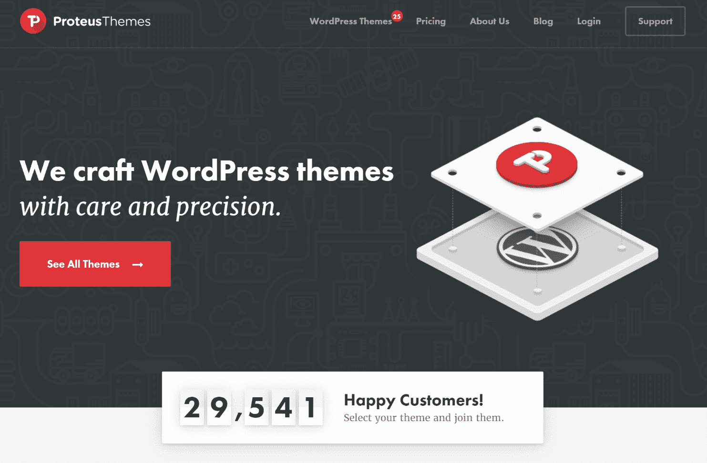
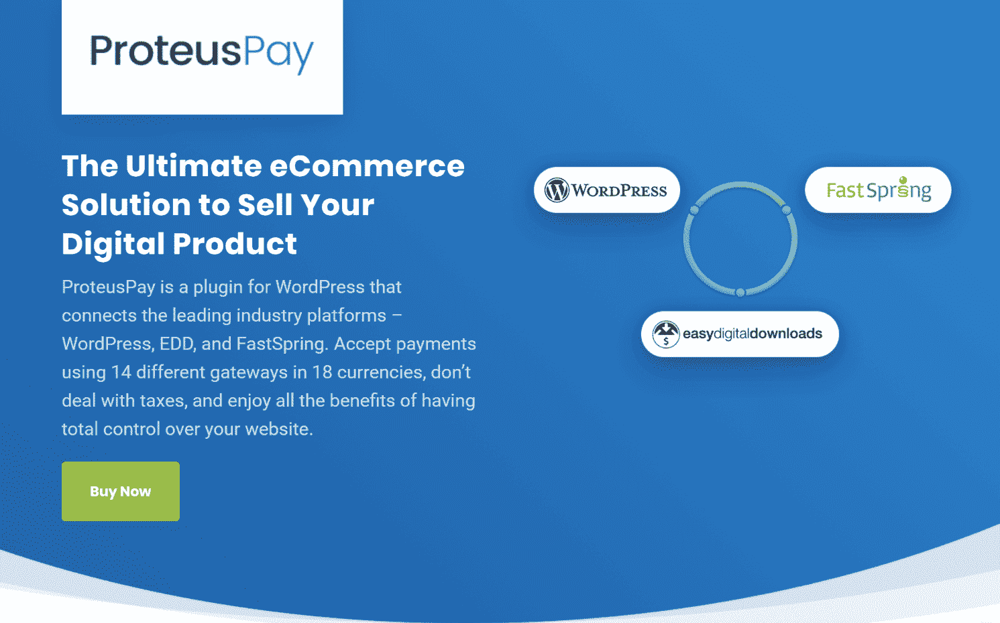

# 金斯塔·金并:普利莫兹·齐格勒访谈

> 原文：<https://kinsta.com/blog/interview-primoz-cigler/>

你可以在 LinkedIn 或者 T2 的 Twitter 上找到 Primoz。这是我们最近对他的采访，作为我们[金斯塔·金并](https://kinsta.com/?post_type=post&s=kingpin)系列的一部分。

### Q1:你的背景是什么，你是如何开始使用 WordPress 的？

嗨，👋谢谢你邀请我！

我是来自斯洛文尼亚的普里摩兹·齐格勒。我第一次听说 WordPress 是在 2006 年，并很快在我自己的博客中采用了它，那时我开始接触 PHP 和其他网络技术。从天体物理学专业毕业后，我远离了学术生涯，并(到目前为止)创办了两家 WordPress 公司。

### Q2:读者应该知道你最近在 WordPress 做了些什么？

五年前，我和设计师 Jaka 一起创立了 ProteusThemes。这是一个 WordPress 主题商店，面向为当地企业建立网站的机构和自由职业者。

ProteusThemes website

最近，就在 1 个月前，我启动了[ProteusPay](https://proteuspay.com/)——一个电子商务 WP 插件，它极大地简化了销售数字产品和订阅，尤其是对 EU-的企业。我们根据自己对 ProteusThemes 的需求构建了它，但是由于很多人联系我并询问解决方案，我们重构了代码并将其作为独立的 WordPress 电子商务插件发布。

在那之前，我一直在暑假做自由职业者，当我不用上学的时候，我尝试了一些其他的在线赚钱的事情:从卖股票照片到写博客和赚取代销商佣金。

### Q3:在职业生涯中，你遇到了哪些挑战？

2017 年最大的挑战之一是将 ProteusThemes 从 100%依赖市场收入转变为个人主题商店。我们低估了经营主题业务的努力，在 2017 年，在一些成熟玩家过度饱和的市场中发展主题业务非常困难。

> 需要在这里大声喊出来。Kinsta 太神奇了，我用它做我的个人网站。支持是迅速和杰出的，他们的服务器是 WordPress 最快的。
> 
> <footer class="wp-block-kinsta-client-quote__footer">
> 
> 
> 
> <cite class="wp-block-kinsta-client-quote__cite">Phillip Stemann</cite></footer>

[View plans](https://kinsta.com/plans/)

然而，通过坚持高质量标准和关注客户当前解决方案的痛点，我们已经设法解决了正确的问题，并为 WP 主题买家今天面临的问题提供了解决方案。

[Stick to high-quality standards and pay attention to customer's pain points. 👍 - @primozciglerClick to Tweet](https://twitter.com/intent/tweet?url=https%3A%2F%2Fbit.ly%2F2NPwH2n&via=kinsta&text=Stick+to+high-quality+standards+and+pay+attention+to+customer%27s+pain+points.+%F0%9F%91%8D+-+%40primozcigler)

从我的经验来看，最大的问题之一是**大而臃肿的多用途主题**试图成为任何类型网站的合适选择。这是以巨大的代码库为代价的，许多功能没人需要，它们很难使用，经常出错，而且非常慢。我们的团队正在努力理解当地企业网站成功的关键要素。我们的主题中的大部分附加值不是来自于功能，而是来自于服务于商业目的的布局和设计，主题是为商业目的而创建的。也就是说，代理机构更容易通过我们的主题提案来接管潜在客户，并且他们花更少的时间来实施和交付最终的网站。

## 注册订阅时事通讯

### 想知道我们是怎么让流量增长超过 1000%的吗？

加入 20，000 多名获得我们每周时事通讯和内部消息的人的行列吧！

[Subscribe Now](#newsletter)

我们没有在主题中捆绑各种无用的功能，而是确保与各种插件的最大兼容性。与此相关的一个挑战是，如何证明我们的主题与竞争对手的主题价格相同甚至更高是合理的。随着时间的推移，我意识到我们最好的客户是那些尝试过多种用途主题，并意识到这不是他们所需要的。

这听起来很有趣，但对我们来说，更容易与之前一直在处理其他主题的线索达成交易。他们倾向于和我们在一起呆得更久，通常对我们采取的方法和遵循的哲学更满意。

### 在 WordPress 的世界里，有没有什么让你感到惊讶的事情？

总的来说，我很难过这个领域的软件工程师如此之少。在插件&主题业务中尤其如此。大多数产品都是由那些足够了解他们的人制造和维护的，他们有能力把一个工作方案组合起来，但不是一个可靠的方案。很多次，我发现自己处于这样一种情况:我向这个社区中享有最高声誉的人解释行业最佳实践。

另一个积极的极端是社区对每个人都很友好和热情。

### Q5:你认为 WordPress 世界的未来会是怎样的？

与大多数 WordPress 企业主相比，我很期待看到 Gutenberg 和 5.0 版本给 WordPress 带来的新鲜空气。我确信新的技术将会让 WordPress 与今天其他的网站创建工具并驾齐驱。希望它也能鼓励那些在过去 10 年里对自己的技术知识完全满意的人开始学习新东西。

Struggling with downtime and WordPress problems? Kinsta is the hosting solution designed to save you time! [Check out our features](https://kinsta.com/features/)

我们刚刚推出的 [ProteusPay](https://proteuspay.com/) 有很大的潜力。目前我们正在销售独立插件，但这只是最终目标的中间步骤。我希望在未来 6 个月内，它能过渡到 SaaS 主办的[电子商务平台](https://kinsta.com/blog/ecommerce-platforms/)。

ProteusPay for ecommerce

在目前的形式下，它只是一个更大的拼图中的一块，因此它只对知道如何做所有其他事情的人感兴趣(安装、设置和维护 WordPress，连接主题和插件以很好地一起玩等等)。).通过开放一个平台，你不再向为别人建立网站的人出售任何东西，而是向直接使用你的产品并获得直接利益的人出售。

### 你在 WordPress 主机中寻找什么？

我是个技术型的人，喜欢 DevOps。第一件事是肯定 SSH 访问与 WP-CLI 预装或至少一个选项来安装它。没有这一点，我无法有效地工作。第二件事是支持，这应该是及时的，能够快速识别更大的问题，并委托给正确的团队。第三个是栈的速度。让我们加密集成是一大优势。

### 问题 7:当你离开笔记本电脑时，你喜欢做什么？

我是一个帆板爱好者。我围绕着**远程优先的理念**建立了公司和团队，这使得团队中的每个人都可以独立地工作。我一年去旅行 2-4 个月，其他一些员工在夏天花更多的时间在海边，并在那里工作。

### 问题 8:接下来我们应该采访谁&为什么？

肯定是来自 SiteOrigin 的 Greg Priday。我们在他们所有的主题中成功地使用了他们的页面生成器插件已经很多年了。他们的视频作为一种交流方式也很出色。我对格雷格&和整个 SiteOrigin 团队怀有高度的敬意。

* * *

让你所有的[应用程序](https://kinsta.com/application-hosting/)、[数据库](https://kinsta.com/database-hosting/)和 [WordPress 网站](https://kinsta.com/wordpress-hosting/)在线并在一个屋檐下。我们功能丰富的高性能云平台包括:

*   在 MyKinsta 仪表盘中轻松设置和管理
*   24/7 专家支持
*   最好的谷歌云平台硬件和网络，由 Kubernetes 提供最大的可扩展性
*   面向速度和安全性的企业级 Cloudflare 集成
*   全球受众覆盖全球多达 35 个数据中心和 275 多个 pop

在第一个月使用托管的[应用程序或托管](https://kinsta.com/application-hosting/)的[数据库，您可以享受 20 美元的优惠，亲自测试一下。探索我们的](https://kinsta.com/database-hosting/)[计划](https://kinsta.com/plans/)或[与销售人员交谈](https://kinsta.com/contact-us/)以找到最适合您的方式。