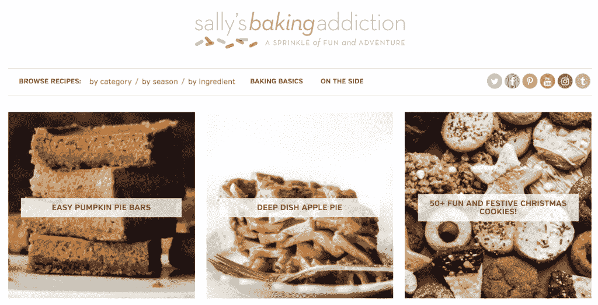
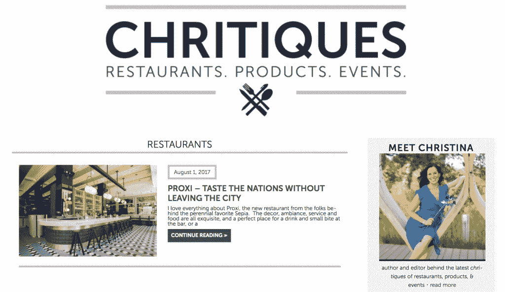
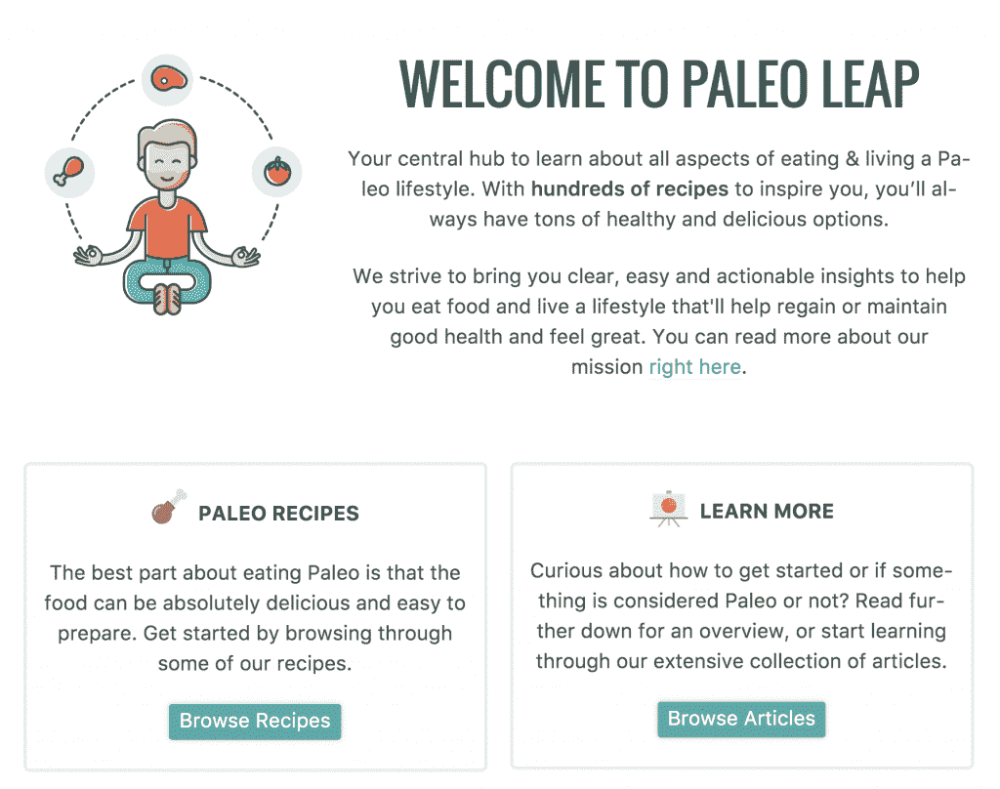
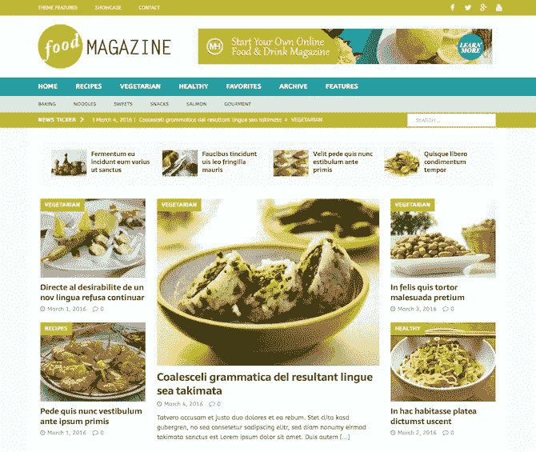
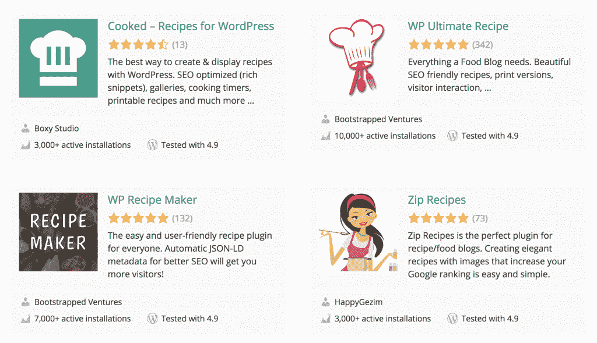
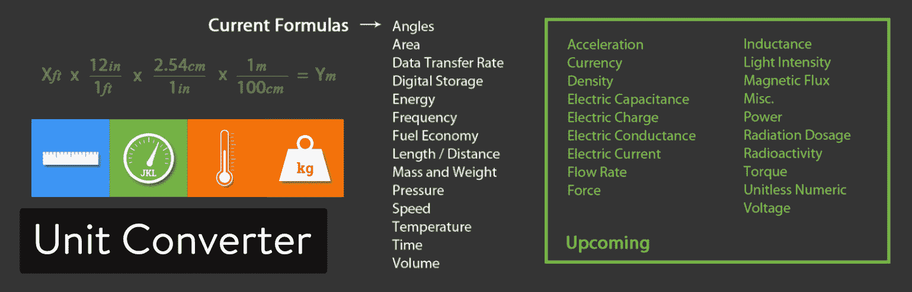
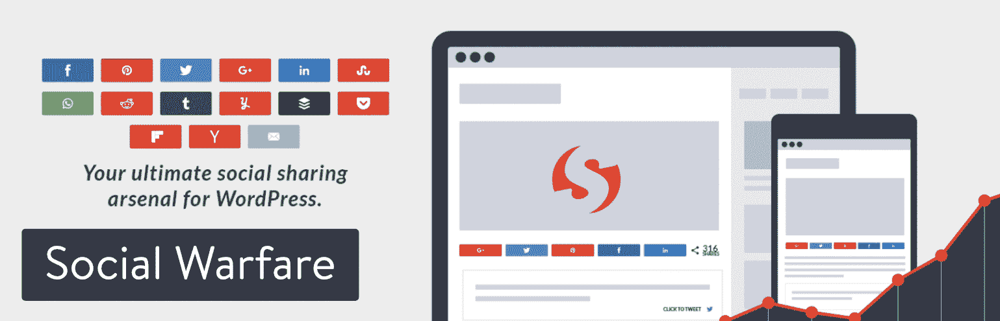
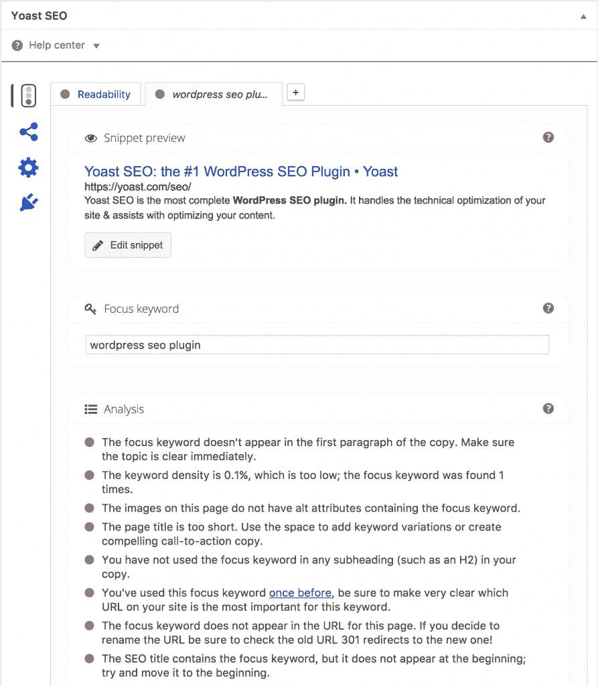

# 如何开始你的美食博客 Kickstart 和推广指南

> 原文：<https://kinsta.com/blog/how-to-start-a-food-blog/>

几乎每个话题都有一个博客空间，有些话题比其他话题更能引起大众的兴趣。随着时尚的到来，人们会涌向特定的利基市场。说到时尚，有时利基市场会演化出新的含义。时尚已经成为一种生活方式，成为一种旅行——你懂的。

虽然有些利基市场是时尚的，但有些是永恒的。一个完美的例子是美食博客的利基，由于饥饿顾客的超级接受观众，它似乎永远不会过时。每个人都要吃饭，许多人涌向互联网，寻找关于如何做到这一点的信息，关于某些饮食限制，过敏，以及改进你已经知道的菜肴的想法。

由于美食博客的流行(就可用资源和受众规模而言)，那些有特定饮食需求和偏好的人不必满足于此——他们可以咨询博客圈，以创造出味道惊人的美食，不管他们有什么限制。

让我们来看看**如何开始一个美食博客**的过程，从最重要的*为什么开始。*

## 为什么要开一个美食博客

为什么有人会想阅读或关注一个特定的美食博客，这似乎是显而易见的……但是为什么*要开始*一个呢？

开设美食博客的决定最终归结于激情和动力，因为任何类型的博客都需要相当大的精力来维护。为了更具体一点，考虑一下创建美食博客的原因:

*   **你热爱烹饪**，这是你的热情所在，你想与世界分享。
*   你想挑战你的技能。你只能发布某一种美食和你已经知道的事情，否则你的观众会开始感到厌烦。维持一个美食博客将意味着在学习新事物的过程中把自己推出舒适区，以吸引人们再次光顾。学习新的食谱或技术不仅仅是*。经营一个美食博客意味着学习其他技能，比如如何使用 WordPress，如何有效地进行社交媒体营销，以及如何拍摄精彩的美食照片。*
*   成为社区的一部分。美食博客社区非常庞大，创建者非常热情，乐于助人，尤其是对新手。成为社区的活跃成员将有助于你结交朋友和寻找合作者。
*   给你一个创造性的出口。无论你是否有具体的最终目标，美食博客都为你提供了一个出口，让你以多种不同的方式释放你的创造力:烹饪、写作和摄影(仅举几例！).
*   建立信誉和专业知识。你的美食博客也可以作为一种[在线作品集](https://kinsta.com/blog/wordpress-portfolio-plugins/)。如果你从事过与食品相关的职业，并且有一些建议或见解可以分享，你将在表现专家方面占有优势。如果你*没有那种经历，你仍然可以建立信誉——尤其是当你的美食博客变得流行的时候。人们可能会因为你的专业知识和不同的机会来找你，比如写你自己的烹饪书，自由职业，甚至是咨询职位。*
*   **赚钱潜力。**除了上面列出的创建美食博客的原因，你还可以从美食博客的联盟营销和赞助中获利。当然，如果你开设美食博客的主要动机是赚钱，你可能会失去长期维持下去的兴趣。

不管你的动机是什么，让我们来具体探讨一下如何创建一个美食博客。

## 如何开始一个美食博客

如何开始一个美食博客有 4 个主要步骤:

> Kinsta 把我宠坏了，所以我现在要求每个供应商都提供这样的服务。我们还试图通过我们的 SaaS 工具支持达到这一水平。
> 
> <footer class="wp-block-kinsta-client-quote__footer">
> 
> 
> 
> <cite class="wp-block-kinsta-client-quote__cite">Suganthan Mohanadasan from @Suganthanmn</cite></footer>

[View plans](https://kinsta.com/plans/)

*   **研究**:选择你的主题、定位，并确定是什么让你与市场上已有的产品不同。
*   **设置**:建立你的美食博客的技术步骤，比如选择你的域名和主机提供商，设置 WordPress，以及[定制你的 WordPress 主题](https://kinsta.com/blog/how-to-customize-wordpress-theme/)。
*   **内容创建**:创建文章和其他内容/媒体来填充你的博客。
*   推广:让更多的读者了解你的目标受众。

## 如何开始一个美食博客:研究

尽管人们通常喜欢美食博客，但在这一点上，美食博客已经不稀罕了。

当你开始着手创建一个美食博客时，试着想办法让你的博客脱颖而出。最好选择一个非常具体的利基市场，因为涵盖太多不同主题的美食博客将很难吸引注意力*和*很难从搜索引擎获得流量。

具有独特利基角度的美食博客往往在搜索引擎优化方面表现更好，因为当人们搜索他们感兴趣的食谱或烹饪技术时，他们通常会搜索一般博客无法权威提供的非常具体的术语。选择一个合适的位置，编织你的故事，随着时间的推移，它会变得更有吸引力。

### 美食博客细分市场

“美食博客”是一个非常包罗万象的术语。

美食博客是一个记录任何东西的博客，从作者想要尝试或试验的食谱、餐馆评论，甚至是关于一个人生活选择的日志式的交付。博客是个人的事情——没有正确或错误的内容焦点。

以下是对美食博客细分市场的一些建议:

*   **Recipes**: ~[99% of food](http://www.amateurgourmet.com/2013/01/10-food-blog-posts-thatll-get-you-traffic.html) [blogs](http://www.amateurgourmet.com/2013/01/10-food-blog-posts-thatll-get-you-traffic.html) incorporate this format, with recipes that are usually accompanied by personal stories. [Sally’s Baking Addiction](https://sallysbakingaddiction.com/) is a popular blog that uses this formula, specifically featuring recipes of sweets. A variation of this would involve a food blog that documents general cooking adventures (like [Budget Bytes](https://www.budgetbytes.com/)), or can focus on certain cuisines (like [The Hungary Buddha Eats the World](http://thehungarybuddha.com/)).

    

    美食博客举例

    

*   **Restaurant and food product reviews**: Detailed dining guides and reviews of consumer packaged food goods, such as [Chritiques](http://chritiques.com/category/restaurants/) or [Urban Cheap Ass](http://www.urbancheapass.com/category/food/).

    

    用餐指南

    

*   **Super niche**: Cataloging very niche subjects within food itself and sometimes even incorporating advice about certain lifestyle choices, like Paleo food blogs ([Paleo Leap](https://paleoleap.com/) by Sébastien is one of the most popular *and* is hosted on Kinsta!), vegan blogs, and so on.

    

    古食品博客

    

### 当你开始一个美食博客时，问自己的问题

当你在如何开始一个美食博客的最初步骤中思考这个概念时，这些问题可以帮助你做出决定:

*   我喜欢食物的什么？
*   我的优点和缺点是什么？
*   哪些博客启发了我，我怎样才能比他们更好/与众不同？
*   我如何帮助我的目标受众？
*   这个博客的最终目标是什么？

一个保证你成功的好方法？**寻找市场缺口**。在你开始建立你的美食博客之前，你必须把你的品牌和独特的销售/价值主张拍下来，以帮助指导你通过你将长期做出的许多决定。

## 如何开始一个美食博客:设置

一旦你想好了要写什么，就开始设置你的美食博客，保持势头。

### 专业博客的要素

如果你正在为一个读者创建一个博客，你会希望确保你的设置是以专业水平进行的。以下是展示你作为美食博客老板的身份所需要的:

*   一个可靠而灵活的博客平台。你的博客平台或[内容管理系统](https://kinsta.com/knowledgebase/content-management-system/)是你写和储存所有帖子的地方。就我们而言，唯一值得考虑的是 WordPress.org。WordPress.org 是最具灵活性的顶级竞争者。像 WordPress.com 和博主[这样的免费选项对于开始来说是不错的，但不是真正的长期成功解决方案。为了增加一些背景，WordPress.com 甚至不允许你做广告收入。花一点钱在 WordPress](https://kinsta.com/blog/wordpress-vs-blogger) 的[自托管版本上，以取得良好的开端。](https://kinsta.com/blog/why-use-wordpress/)
*   **唯一的域名。域名是你博客的主要标识符。虽然[有免费的博客平台](https://kinsta.com/blog/best-blogging-platform/)可以为你提供一个链接网址(即**你的名字** .WordPress.com)，但是[拥有一个域名](https://kinsta.com/blog/how-much-does-a-domain-name-cost/)显示了你的承诺，最终会让人觉得你更专业。当[决定一个域名](https://kinsta.com/blog/choose-domain-name/)的时候，确保它容易回忆，容易拼写，并且不要太长。如果你正在寻找一个[域名注册商](https://kinsta.com/blog/best-domain-registrar/)，这里有一些建议。**
*   一个可靠的网络主机。网络主机是存储文件、内容和图像的地方。当你在一个免费的博客平台上注册时，该平台将为你存储你的文件，但如果你选择走自托管路线，你需要找到一个(最好是有好的 [WordPress 特定选项](https://kinsta.com/plans/))。

### WordPress 主题和插件

在你完成了基本的网络主机、域名和 WordPress 设置之后，是时候更具体地关注你的博客的外观了。

无需深入细节，您可以从以下内容开始:

### 选择 WordPress 主题

你可以从付费和免费选项中进行选择。有许多专门迎合美食博客的主题。刚入门的时候，不要想太多主题。如果你是博客新手，可以从一个免费的主题开始，以后再改变它。下面是[如何安装一个 WordPress 主题](https://kinsta.com/blog/how-to-install-a-wordpress-theme/)。

许多美食博主使用的一个流行的高级主题是来自 MH Themes 的 [MH 杂志主题](https://arrayinternet.com/wordpress/how-create-food-blog-recipe-website/)。

MH magazine theme for food blogs

### 安装插件

插件是你安装在你的 WordPress 网站上的代码，用来添加特定类型的功能。

如果你打算开一个食谱美食博客，你会想要考虑各种可用的[食谱插件](https://wordpress.org/plugins/search/recipe/)。这些插件有助于展示你的食谱，让它们脱颖而出，提高可读性，同时有些插件还包括内置的 SEO 好处。

## 注册订阅时事通讯

### 想知道我们是怎么让流量增长超过 1000%的吗？

加入 20，000 多名获得我们每周时事通讯和内部消息的人的行列吧！

[Subscribe Now](#newsletter)

WordPress recipe plugins

当你开始一个美食博客时，这里有三种其他类型的插件可以考虑使用:

*   **图片优化:**美食博客倾向于使用非常大的高分辨率图片。如果没有优化，这会大大降低你的美食博客的速度。利用图像优化插件，如 [Imagify](https://wordpress.org/plugins/imagify/) 、 [ShortPixel 图像优化器](https://wordpress.org/plugins/shortpixel-image-optimiser/)、 [Optimus WordPress 图像优化器](https://wordpress.org/plugins/optimus/)、 [WP Smush](https://wordpress.org/plugins/wp-smushit/) 、 [TinyPNG](https://wordpress.org/plugins/tiny-compress-images/) 或 [EWWW 图像优化器云](https://wordpress.org/plugins/ewww-image-optimizer-cloud/)。如需更多提示，请查看我们深入的[图像优化指南](https://kinsta.com/blog/optimize-images-for-web/)。

*   [**Unit Converter**](https://wordpress.org/plugins/jkl-unit-converter/): Once it’s published on the internet, your blog is accessible to a global audience. Depending on who’s reading your blog, they may need to employ the use of a unit converter to adjust measurements to what they’re most used to.

     

    单位转换器 WordPress 插件

    

*   **Pinterest button**: Pinterest is a visual search engine and beautiful food photography tends to perform well on the network. Make it easy to pin your mouth-watering images to [drive more traffic to your website](https://kinsta.com/blog/how-to-drive-traffic-to-your-website/). [Social Warfare](https://wordpress.org/plugins/social-warfare/) offers a comprehensive option for social share buttons (including a Pinterest button).

     

    社交战 WordPress 插件

    

### 搜索引擎优化

SEO，或者说[搜索引擎优化](https://kinsta.com/blog/what-does-seo-stand-for/)，是通过搜索引擎排名的努力来提高网站流量质量和数量的过程。

SEO 是一个非常广泛的领域，全面优化一个网站有几个因素，但不管你的 SEO 经验水平如何，这里有一些基本的事情你都可以做:

*   **安装** [**Yoast 插件**](https://kinsta.com/blog/yoast-seo/) 。这个插件给你具体的提示，让你的帖子用初学者友好的语言写得更加 SEO 友好。
    
*   **让你的网站移动友好**。首先要选择一个移动响应的 WordPress 主题。手机友好性是最重要的[谷歌排名因素之一](https://backlinko.com/google-ranking-factors)。
*   **创造伟大的、相关的内容**。谷歌在为搜索特定术语的人提供搜索结果时，会查看你发布的内容的相关性。
*   确保你使用了正确的模式。如果你在美食博客上使用食谱，确保在适用的地方使用合适的[模式标记](https://kinsta.com/blog/schema-markup-wordpress/)。如果你不这样做，谷歌可能会失去你在谷歌中所有丰富的片段。基本上，一份食谱需要包括配料和步骤。你可以使用一个 WordPress 插件，比如 [WP Recipe Maker](https://bootstrapped.ventures/wp-recipe-maker/) 来确保你使用了正确的非食物模式和食谱模式标记。

> 提醒:如果你是一个食谱、DIY 或生活方式的博客作者，你不能用食谱模式标记不可食用的内容。新一轮的手动操作通知在今天上午发出。这里是“洗澡和淋浴炸弹”——不是超级开胃。你这样做，你失去了所有丰富的片段！不好玩。1/2 个 pic.twitter.com/cr9nM9MFQa
> 
> —凯西·马基(@ MediaWyse)[2019 年 1 月 25 日](https://twitter.com/MediaWyse/status/1088844561768624128?ref_src=twsrc%5Etfw)