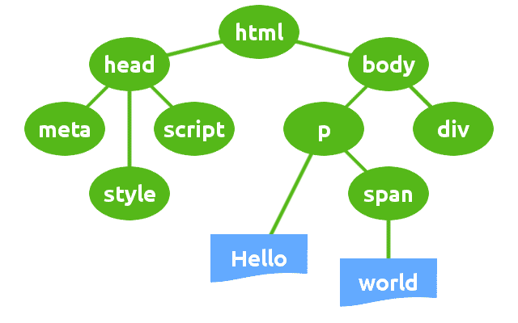
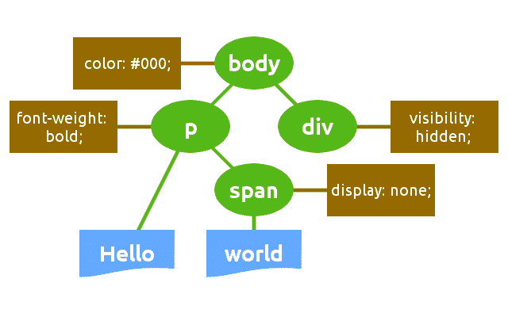
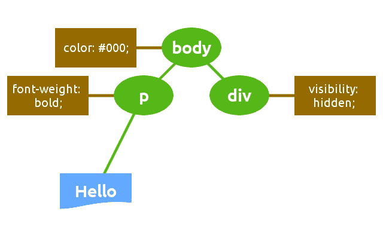
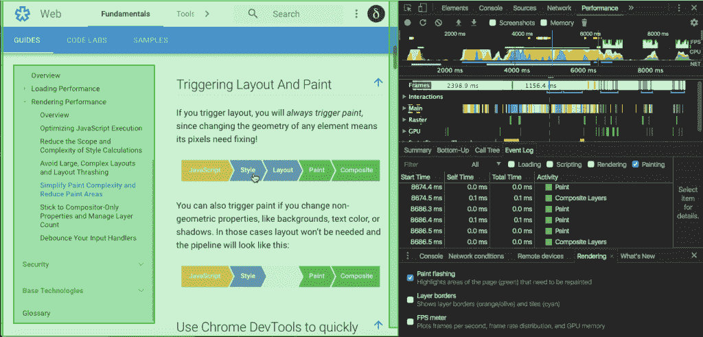
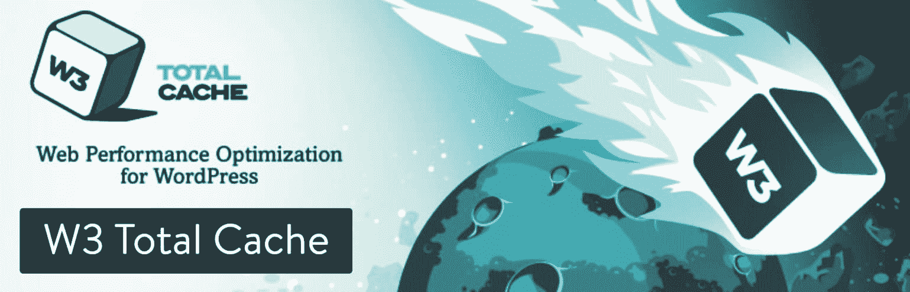
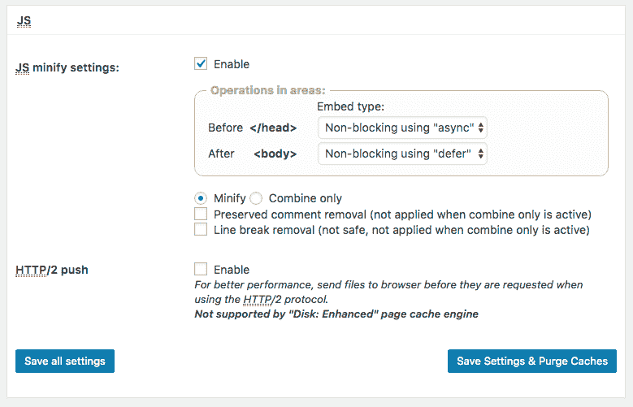
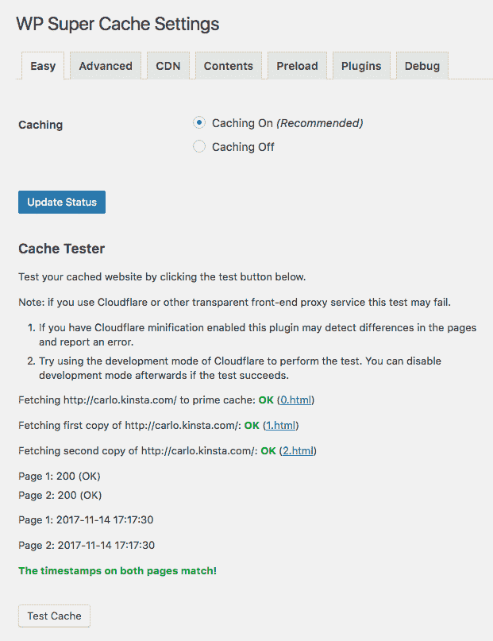
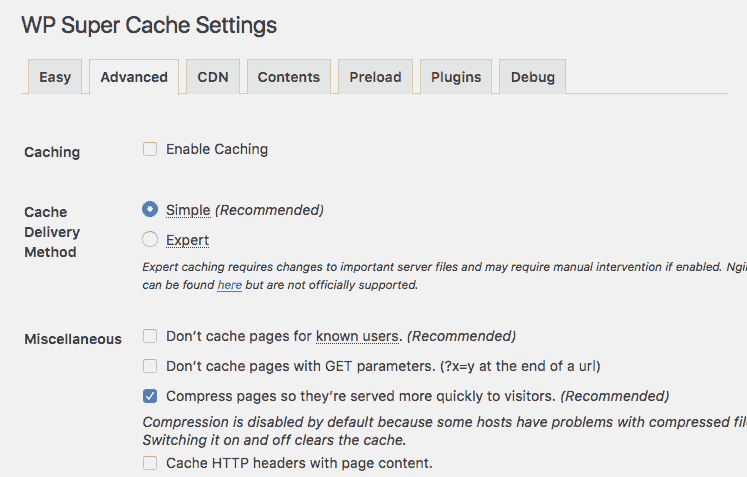
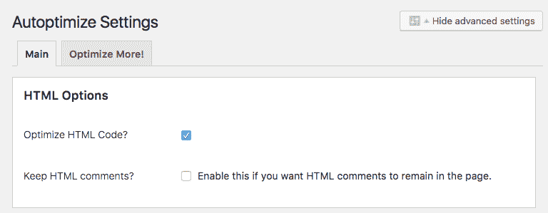

# 如何优化 WordPress 中的关键渲染路径

> 原文：<https://kinsta.com/blog/critical-rendering-path/>

关键呈现路径是浏览器首先在屏幕上呈现页面时执行的任务序列，即下载、处理和转换 HTML、CSS 和 JavaScript 代码为实际像素并在屏幕上绘制它们。

> 关键呈现路径优化是最小化浏览器执行与当前用户动作相关的内容的优先显示序列的每个步骤所花费的时间的过程。

这个过程的大部分都与不向下滚动浏览器窗口就能看到的页面部分有关。该部分也被称为褶皱上方的**。为了获得更好的可用性，应该尽快呈现 ATF，这可以通过最大限度地减少网络往返次数来实现。呈现 ATF 所需的资源被认为是关键的，优化以上折叠意味着最小化关键资源对第一页呈现时间的影响。**

在这篇文章中，我们将通过关键的渲染路径优化序列。

*   首先，我将概述浏览器呈现页面内容的任务。
*   接下来，我将剖析我们可以执行的最相关的操作，以优化关键的渲染路径。
*   最后，我会列出一些有用的(和流行的)WordPress 优化插件。

## 关键渲染路径序列

下面是浏览器呈现页面时执行的一系列步骤:

*   首先，浏览器下载并解析 HTML 标记，然后构建 DOM
*   然后，它下载并处理 CSS 标记，并构造 CSS 对象模型
*   它结合了在呈现树中呈现页面所需的 DOM 和 CSSOM 节点，呈现树是所有可见节点的树结构
*   它计算页面上每个对象的尺寸和位置
*   最后，它在屏幕上绘制像素

### 那只狗

正如 Google 的[关键渲染路径优化指南](https://developers.google.com/web/fundamentals/performance/critical-rendering-path/constructing-the-object-model)中所解释的，浏览器通过四个步骤构建文档对象模型:


*   首先，浏览器读取行字节，并将它们翻译成单独的字符。
*   然后，它将尖括号中的字符串转换成标记。
*   这些令牌被转换成节点对象。
*   节点对象链接在一个树状数据结构中，该结构包含 HTML 内容、属性和节点之间的关系。这个结构就是**文档对象模型**。

这里需要注意的重要一点是，浏览器是以增量方式构造 DOM 的。这允许我们通过创建高效的 DOM 结构来加速页面的呈现。



DOM structure


### CSSOM

当解析器遇到一个引用外部 CSS 样式表的`link`标记时，它会阻止解析并发出一个对该资源的请求。一旦接收到 CSS 文件，浏览器就开始构建 CSS 节点的树形数据结构。

*   浏览器读取。css 文件并将它们翻译成单独的字符
*   它将花括号中的字符串转换成标记
*   这些令牌被转换成节点对象
*   节点对象链接在一个树状数据结构中，该结构包含每个节点的 CSS 属性和节点之间的关系。这个结构就是 **CSS 对象模型** ( **CSSOM** )。

与 DOM 构造不同，CSSOM 构造不是增量的。浏览器不能使用样式表的一部分，因为样式可以在同一个样式表中细化和重新声明。因此，浏览器会阻止呈现过程，直到它接收并解析所有 CSS。这意味着 **CSS 正在呈现阻塞**。



CSSOM structure.


### 渲染树

浏览器将 DOM 和 CSSOM 组合到呈现树中，最终的树结构包含用于将页面呈现到屏幕上的所有节点和属性。

> 呈现树仅包含呈现页面所需的节点。因此，不可见的节点被省略。

浏览器使用渲染树来计算节点尺寸和位置，作为绘制过程的输入。



Render Tree structure.


### 布局和油漆

在布局阶段，浏览器计算渲染树的每个节点的尺寸和位置。浏览器从渲染树的根开始遍历渲染树，并在此阶段生成一个盒子模型。该信息最终用于将渲染树的每个节点转换为屏幕上的实际像素。


## 关键渲染路径优化

运行整个过程所需的时间是可变的。这取决于文档大小、请求数量、应用的样式、用户设备等。
最相关的谷歌建议之一是对可见内容进行优先排序，以尽可能快地呈现上述内容，并提供了两个主要规则供遵循:

*   构建 HTML 以首先加载关键的、高于文件夹的内容
*   减少 HTML、CSS 和 JS 资源使用的数据量

正如在 [Google 的 PageSpeed guide](https://developers.google.com/speed/docs/insights/PrioritizeVisibleContent) 中所解释的，如果渲染 ATF 所需的数据量超过了初始拥塞窗口(14.6kb)，将需要在服务器和浏览器之间进行额外的网络往返。在高延迟的移动网络上，这将显著延迟页面加载([阅读更多关于延迟](https://kinsta.com/blog/network-latency/))。
浏览器增量地构建 DOM，允许我们通过构建 HTML 来首先加载上面的文件夹，然后延迟页面的其余部分，从而减少呈现 ATF 所需的时间。


The Above the Fold content varies depending on the user device


但是优化并没有随着有效 DOM 结构的构建而结束。相反，这是一个改进和测量的过程，涉及到整个关键的渲染路径序列。

让我们深潜。

## 最小化资源维度

我们可以通过缩小、压缩和缓存 HTML、CSS 和 JavaScript 资源来减少浏览器将要下载的数据量:

*   **缩小**是从源代码中删除不必要的字符，如注释和空白的过程。这些字符有助于开发，但对于呈现页面却毫无用处。
*   **压缩**是指网络服务器和客户端减少传输文件大小以提高速度和带宽利用率的能力
*   **缓存**:每个浏览器都有一个 **HTTP 缓存**的实现。我们需要做的是确保每个服务器响应都提供正确的 HTTP 头，以指示浏览器应该在何时缓存所请求的资源以及缓存多长时间

## 优化 CSS

现在我们知道，浏览器必须等到获取并处理 CSS 代码后才能呈现页面( [CSS 正在呈现阻塞](https://kinsta.com/blog/eliminate-render-blocking-javascript-css/))。**但并不是所有的 CSS 资源都被渲染阻塞**。

CSS 可以被限定在特定的条件下，我们可以使用媒体类型和媒体查询来优化它。如果您正在屏幕上查看网页，浏览器将发送一个打印媒体类型请求，但它不会阻止此资源的页面渲染。
取下面的`link`标签:

```

```

该标记引用的样式表适用于任何条件，与当前媒体类型、屏幕分辨率、设备方向等无关。这意味着 CSS 资源总是呈现阻塞的。

幸运的是，我们可以在特定条件下发送 CSS 资源请求。我们可以将打印样式移动到一个单独的文件中，并使用`media`属性告诉浏览器，指定的样式表应该只在打印页面时加载，它不需要阻止屏幕上的呈现:

```

```

浏览器仍然下载 *print.css* 样式表，但是不会阻止渲染。此外，浏览器必须为主 CSS 文件下载更少的数据，这将有助于我们加快下载速度。我们可以在`link`属性上指定任何媒体查询，因此我们可以将 CSS 分成多个文件并有条件地加载它们:

```


```

请确保您的样式确实是呈现页面所必需的。您可以将适当的值添加到“媒体标签”属性中，如果没有，则取消阻止渲染。

媒体类型和查询可以帮助我们加快页面渲染速度，但我们还可以做得更多。

*   **Minify CSS** :空白和注释只帮助我们阅读 CSS 声明。通过从样式表中移除注释和空白，我们可以显著减少 CSS 文件的字节数。
*   组合多个 CSS 文件:这将[减少 HTTP 请求的数量](https://kinsta.com/blog/make-fewer-http-requests/)。这个动作在移动连接中很重要，在那里性能受到高延迟的影响([阅读更多关于延迟的内容](https://kinsta.com/blog/network-latency/))。
*   内联关键 CSS :有些样式很关键，因为它们需要呈现页面的上方。最好总是考虑将关键样式直接内联到 HTML 标记中，以避免额外的 HTTP 请求。但是要避免内联大的 CSS 文件，因为这可能需要额外的往返来渲染，从而导致页面速度警告。

你可以从你的 [MyKinsta dashboard](https://kinsta.com/mykinsta/) 中直接缩小你的代码来快速简单地提升你的网站。只需使用为您提供的[代码缩减特性](https://kinsta.com/help/kinsta-cdn-code-minification/)，点击一个按钮即可实现 CSS 和 Javascript 的自动修改。

## 注册订阅时事通讯


### 想知道我们是怎么让流量增长超过 1000%的吗？

加入 20，000 多名获得我们每周时事通讯和内部消息的人的行列吧！

[Subscribe Now](#newsletter)

## 加速布局和油漆过程

浏览器布局文档所花费的时间取决于要布局的 DOM 元素的数量以及这些布局的复杂性。

*   如果有很多 DOM 元素，浏览器可能需要很长时间来计算它们的位置和尺寸:尽可能避免布局。
*   更喜欢新的 Flexbox 模型，因为它比旧的 Flexbox 和浮动布局更快。
*   避免使用 JavaScript 强制同步布局。

计算元素大小和位置需要时间，并且会降低性能。使 DOM 尽可能简单，避免使用 JavaScript 来预测布局过程，这将有助于浏览器加速页面呈现([阅读更多关于布局优化的内容](https://developers.google.com/web/fundamentals/performance/rendering/avoid-large-complex-layouts-and-layout-thrashing))。

与布局紧密相关的是绘制过程，这可能是关键渲染路径序列中最耗时的阶段。每当您更改元素或任何非几何属性的布局时，浏览器都会触发绘制事件。在这个阶段使事情尽可能简单可以帮助浏览器加速绘画过程。例如，需要计算的`box-shadow`属性比实心边框颜色需要更长的绘制时间。



Chrome DevTools allow identifying portions of the page being painted.


优化页面绘制过程可能不那么容易，您应该利用浏览器的开发工具来测量浏览器触发每个绘制事件需要多长时间。你可以在[谷歌的渲染性能指南](https://developers.google.com/web/fundamentals/performance/rendering/simplify-paint-complexity-and-reduce-paint-areas)中读到更多关于这个主题的内容。

## 使 JavaScript 解除阻塞

当浏览器遇到脚本标签时，它必须停止解析 HTML 代码。内联脚本在文档中的确切位置执行，并阻塞 DOM 构造，直到 JS 引擎完成运行。换句话说，内联 JavaScript 会显著延迟页面的初始呈现。但是 JavaScript 也允许操作 CSS 属性，所以浏览器必须暂停脚本执行，直到它完成下载和构建 CSSOM。这意味着 **JavaScript 被解析器阻塞了**。

对于外部 JS 文件，解析器还必须等待，直到从缓存或远程服务器获取资源，这可能会大大降低第一页呈现的时间。
话虽如此，我们能做些什么来减少浏览器加载和执行 JavaScript 的时间呢？

*   **异步加载 JavaScript**:`script`标签的布尔`async`属性指示浏览器异步执行脚本，如果可能的话，不阻塞 DOM 构造。浏览器发送对脚本的 HTTP 请求，并继续解析 DOM。此外，该脚本不会阻塞 CSSOM 构造，这意味着它不会阻塞关键的渲染路径(参见 [MDN 文档](https://developer.mozilla.org/en-US/docs/Web/HTML/Element/script)了解关于**脚本**标签属性的更多信息)
*   **延迟 JavaScript**:`script`标签的布尔`defer`属性告诉浏览器在解析文档之后，触发`DOMContentLoaded`事件之前执行脚本。如果缺少 src 属性，即内联脚本，则不得使用该属性(阅读关于 [Mozilla Hacks](https://hacks.mozilla.org/2009/06/defer/) 的更多信息)
*   **推迟内联 JavaScript** :许多脚本不操作 DOM 或 CSSOM，所以没有好的理由阻止[解析](https://kinsta.com/blog/defer-parsing-of-javascript/)。不幸的是，我们不能为内联脚本使用`async`和`defer`属性，所以在文档加载后加载它们的唯一方法是将它们移到底部。优点是内联脚本不需要额外的 HTTP 请求。然而，在几个页面中使用的内联脚本会导致冗余代码。

## 包装优化规则

那是很多东西，不是吗？让我们喘口气，写下到目前为止所描述的优化行为的列表。

*   缩小、压缩和缓存 HTML、CSS 和 JavaScript 资源。
*   尽量减少使用渲染阻塞资源(特别是 CSS)
    *   对`link`标签使用媒体查询
    *   拆分样式表和内联关键 CSS
    *   组合多个 CSS 文件
*   最小化解析器阻塞资源的使用(JavaScript)
    *   在脚本标签上使用`defer`属性
    *   在脚本标签上使用`async`属性
    *   内嵌 JavaScript 并将`script`标签移动到文档的底部

现在我们知道了关键渲染路径优化的基本概念，我们可以看看一些 WordPress 流行的优化插件。

## 优化 WordPress 中的关键渲染路径

WordPress 用户可以利用几个插件，这些插件几乎涵盖了优化过程的每个方面。你可以安装一个全功能插件或者一次安装几个插件，每个插件提供特定的优化功能。

Struggling with downtime and WordPress problems? Kinsta is the hosting solution designed to save you time! [Check out our features](https://kinsta.com/features/)

> 如果你的网站由 Kinsta 托管，你就不需要缓存插件，因为在 Kinsta 不需要 WordPress 缓存插件。

### W3 总缓存

这个插件几乎覆盖了关键渲染路径优化过程的每个阶段。乍一看，插件配置可能会让人不知所措。尽管如此，一旦您对关键的渲染路径序列更加熟悉，您将能够利用强大的性能工具集。

[](https://wordpress.org/plugins/w3-total-cache/)

W3 Total Cache WordPress plugin


以下是一些插件特性的列表:

*   HTML(文章和页面)、CSS 和 JavaScript 缓存在内存、磁盘或 CDN 中
*   提要、搜索结果、数据库对象、WordPress 对象和片段的缓存
*   HTML(帖子和页面)缩小
*   JavaScript 和 CSS 小型化
*   使用`async`和`defer`进行 JavaScript 优化
*   使用缓存控制、未来过期标题和实体标签的浏览器缓存
*   HTTP (gzip) [压缩](https://kinsta.com/blog/enable-gzip-compression/)
*   WordPress 仪表盘上的 Google PageSpeed 结果

这些只是 W3TC 众多特性中的一部分。在这个详细的指南中，你可以读到更多关于所有[插件的特性、设置和选项](https://kinsta.com/blog/w3-total-cache/)。



W3 Total Cache JavaScript minify settings


### WP 超级缓存

WP 超级缓存是另一个流行的网站性能插件。

[](https://wordpress.org/plugins/wp-super-cache/)

WP Super Cache WordPress plugin


它提供了许多优化特性，但是它没有之前的 W3 Total Cache 全面，对于新手和中级用户来说可能更实惠。



WordPress Super Cache tester


基本上，它提供了缓存特性和 HTTP 压缩，但是缺少资源缩减和带有`async`和`defer`属性的 JavaScript 优化。然而，超过一百万的活跃安装证明该插件值得一试。



GZIP option in WP Super Cache


### 自动优化

拥有超过 1，000，000 个活跃安装，[auto timize](https://wordpress.org/plugins/autoptimize/)是最受欢迎的用于缩小的免费插件之一。

[](https://wordpress.org/plugins/autoptimize/)

Autoptimize WordPress plugin


它带有一个选项页面，分为几个部分，网站管理员可以分别配置 HTML，CSS 和 JavaScript 缩小。



Autoptimize HTML optimization option


您还可以聚合独立的脚本或样式表，并为特定资源设置例外。此外，Autoptimize 允许在磁盘或 CDN 上缓存缩小的资源，并将优化的资产保存为静态文件。为了找到你的 WordPress 网站的最佳设置，你可以点击这里的跟随我们的[详细的自动优化指南。](https://kinsta.com/blog/autoptimize-settings/)

您可能想尝试的其他优化插件:

*   [缩小 HTML 标记](https://wordpress.org/plugins/minify-html-markup/)
*   [WP 超级迷你](https://wordpress.org/plugins/wp-super-minify/)
*   [快速速度缩小](https://wordpress.org/plugins/fast-velocity-minify/)
*   [JCH 优化](https://wordpress.org/plugins/jch-optimize/)

### 快速性能

[Swift Performance](https://swteplugins.com/product/swift-performance/) 是另一个你可能想看看的插件。这个高级插件可以帮助提高你的性能分数，它是专门为帮助你达到那些[100/100 Google page speed Insights](https://kinsta.com/blog/google-pagespeed-insights/)分数而开发的。

[](https://swteplugins.com/product/swift-performance/)

Swift Performance WordPress plugin


它的一些主要功能包括:

*   你不仅可以缩小和合并 CSS 和 javascript 文件，还可以为你的页面动态创建关键的 CSS。
*   智能缓存，以及 AJAX 和动态请求。
*   内置无损图像压缩。
*   CDN 支持。

你会在[如何消除渲染阻塞的 JavaScript 和 CSS](https://kinsta.com/blog/eliminate-render-blocking-javascript-css/) 中找到 WordPress 优化插件的更深入的观点。

## 结论

关键的呈现路径优化是一个改进和衡量的过程，需要清楚地理解浏览器执行的每一项任务，以将代码转换为像素并在屏幕上呈现页面。你可以在[谷歌的优化指南](https://developers.google.com/web/fundamentals/performance/critical-rendering-path/)中了解更多关于关键渲染路径的信息。

在 Kinsta 博客上，我们试图涵盖性能优化的任何方面。以下是进一步阅读的清单:

*   [网络延迟——比较对你的 WordPress 网站的影响](https://kinsta.com/blog/network-latency/)
*   [WordPress CDN——为什么你应该使用一个](https://kinsta.com/blog/wordpress-cdn/)
*   [如何针对网页和性能优化图像](https://kinsta.com/blog/optimize-images-for-web/)
*   [如何减少 TTFB 以改善 WordPress 页面加载时间](https://kinsta.com/blog/ttfb/)
*   [深入了解 GTmetrix 速度测试工具](https://kinsta.com/blog/gtmetrix-speed-test/)
*   [为 WordPress 用户提供的 14 个免费网站速度测试工具](https://kinsta.com/blog/website-speed-test/)
*   8 个鲜为人知(但很有用)的 WordPress 性能插件
*   [如何用 WordPress 在 Google PageSpeed Insights 中打 100/100 分](https://kinsta.com/blog/google-pagespeed-insights/)

*优化网站的关键渲染路径需要多长时间？优化过程的哪些方面是你最难掌握的？请在下面的评论中告诉我们。*

* * *

让你所有的[应用程序](https://kinsta.com/application-hosting/)、[数据库](https://kinsta.com/database-hosting/)和 [WordPress 网站](https://kinsta.com/wordpress-hosting/)在线并在一个屋檐下。我们功能丰富的高性能云平台包括:

*   在 MyKinsta 仪表盘中轻松设置和管理
*   24/7 专家支持
*   最好的谷歌云平台硬件和网络，由 Kubernetes 提供最大的可扩展性
*   面向速度和安全性的企业级 Cloudflare 集成
*   全球受众覆盖全球多达 35 个数据中心和 275 多个 pop

在第一个月使用托管的[应用程序或托管](https://kinsta.com/application-hosting/)的[数据库，您可以享受 20 美元的优惠，亲自测试一下。探索我们的](https://kinsta.com/database-hosting/)[计划](https://kinsta.com/plans/)或[与销售人员交谈](https://kinsta.com/contact-us/)以找到最适合您的方式。