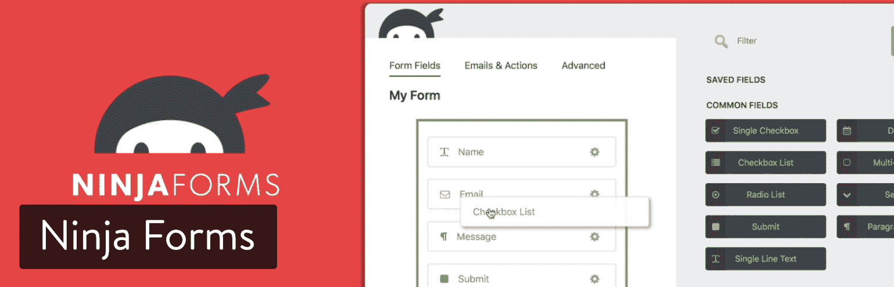
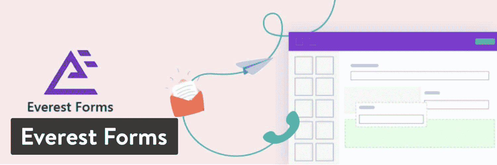
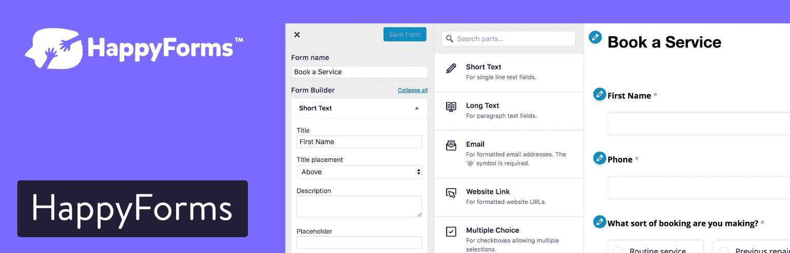
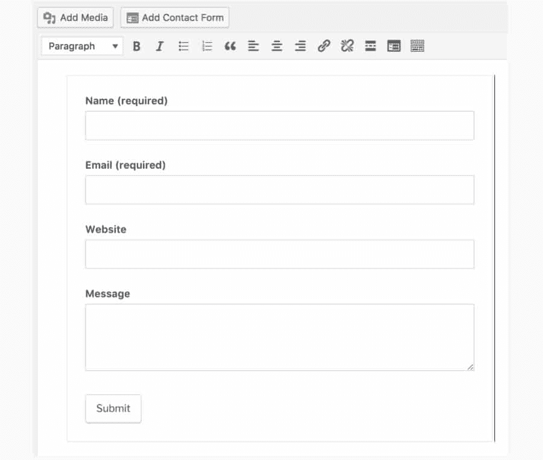
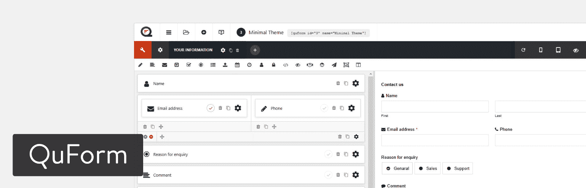
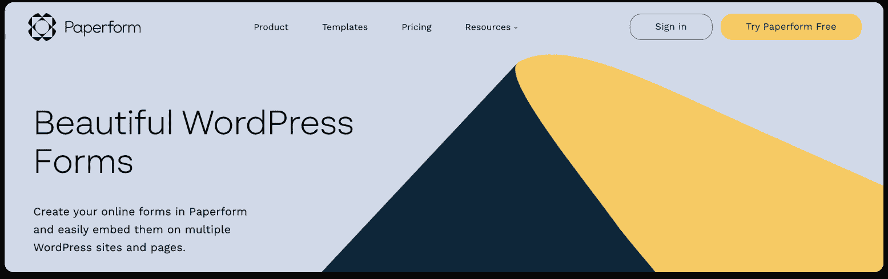
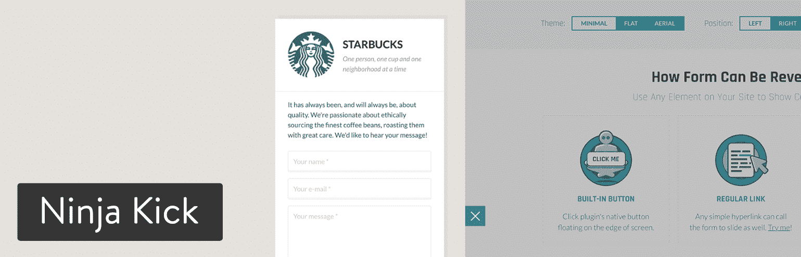
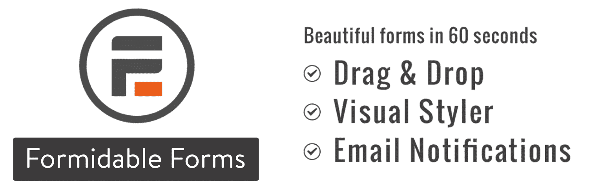
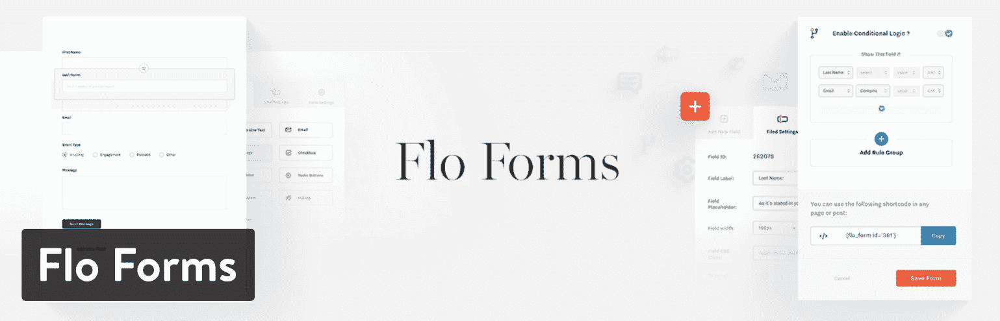

# 18 个最佳 WordPress 联系表单插件(回顾和比较)

> 原文：<https://kinsta.com/blog/wordpress-contact-form-plugins/>

你已经像一件艺术品一样拼凑好了你的新 WordPress 网站。一切就绪:徽标、[小型电子商务商店](https://kinsta.com/learn/woocommerce-guide/)、[菜单](https://kinsta.com/blog/wordpress-menu-plugins/)、[关于我们的页面](https://kinsta.com/blog/about-us-page/)，以及定制的博客。是时候扣动扳机了，对吧？等一下。你忘了网站最基本的一部分了吗？没错:**联系人表单**。

一些开发人员知道马上添加它，因为忘记这种交流形式是多么容易，令人难以置信。跳过联系表格是一种耻辱，因为许多客户对打电话到你的客户支持热线的想法嗤之以鼻，而其他人无意放下工作去坐在实时聊天模块上。

这就是这些 WordPress 联系表单插件发挥作用的地方。客户可以在不花费太多时间的情况下快速发送电子邮件，带有表单的网站可以及时输入消息。不仅如此，联系表单[还能防止垃圾邮件](https://kinsta.com/blog/email-authentication/)并允许你扩展与客户互动的方式(比如条件逻辑，它根据用户的反应更新表单)。

这些 WordPress 联系表单插件有多种形式，所以谨慎的做法是浏览比较，看看哪一个适合你。毕竟，有些网站需要一个昂贵、强大的 WordPress 联系方式，而其他网站只需要基本的。

## WordPress 联系人表单插件功能

最基本的，WordPress 联系表单插件提供了一些字段和最小的设计工具。这意味着让你的客户和你保持联系。另一方面，更高级的联系人表单插件支持条件逻辑、设计工具和文件提交选项。这绝不是一个完整的列表，但这里有一些值得期待的特性:

*   **自定义表单**–包含多个字段、选项和品牌工具。
*   可视化构建器–拖放编辑器很棒，但并不完全需要。
*   **条件逻辑**–根据用户在表单上的选择显示或隐藏某些元素(如按钮、字段或表单部分)。这也有助于将客户发送到不同的部门。
*   **通信**——某种电子邮件通信系统，让合适的人知道有新消息到达。
*   **前端文件提交**–让客户以文档形式上传想法。这对客户支持也很有帮助，用户[可以截图](https://kinsta.com/blog/how-to-screenshot-on-mac/)他们的问题并提交。
*   **响应性**–您会希望表单显示在所有设备上，无论大小。
*   **垃圾邮件防护**–表单首先是为了防止一些垃圾邮件。但是你应该期待从你的 WordPress 联系表单插件得到更多的保护。

## 2022 年最佳 WordPress 联系表单插件

如果你赶时间，看看下面的 WordPress 联系方式列表。对于更深入的评论和比较，定价的细节，以及每个插件的主要特性，请在简短列表之外继续。注意:这些没有特别的顺序。

### 1.重力式——每年 59 美元起

[Gravity Forms](https://www.gravityforms.com/) 结合了简洁的界面和用户友好的工具，这些工具对于改进客户支持网站来说仍然有些先进。通过 Gravity 表单，表单、条目和条件逻辑都是不受限制的，而且它还支持文件上传和多页表单。

Gravity Forms WordPress plugin

标准的 Gravity Forms 支持包括一个完整的票务系统、一个 [FAQ 页面](https://kinsta.com/blog/wordpress-faq-plugins/)、文档、语言翻译和其他一些资源。只有当您选择最昂贵的计划(每年 259 美元)时，优先支持才可用，这样会让您排在最前面。

没有实时聊天或电话支持，但正如你将看到的大多数联系人表单插件，这些都不是真正必要的。

#### 使重力形成一个伟大的选择的特征:

*   丰富的文档包括入门指南、关于附加组件的信息、流行特性和开发人员文档。
*   Gravity Forms 支持广泛的附加组件和外部集成。你可以在这里找到几十个，包括 AWeber、Dropbox、Freshbooks、GetResponse、MailChimp、PayPal Pro 和 Stripe。
*   你得到的所有功能的价格都很棒。
*   您可以访问 30 多个表单字段。
*   条件逻辑是内置的。
*   Gravity Forms 支持电子邮件通知、文件上传以及保存并继续的选项。
*   根据用户提交的内容执行高级计算。(可能用于金融或[房地产网站](https://kinsta.com/blog/wordpress-real-estate-plugins/))。
*   您可以选择限制通过表单提交的数量。您还可以计划表单。
*   Gravity Forms 允许前端用户提交内容，这些内容会发布到你的 WordPress 博客上。

### 2.忍者表格-免费(会员资格每年 99 美元起)

忍者形态在 WordPress 图书馆有免费版本，但是我们认为大多数合法公司会考虑 T2 高级版本会员资格。免费的联系表单插件提供了一个漂亮的用户界面来构建你自己的联系表单。对于表单、字段或接收的电子邮件没有任何限制，并且您可以保存表单以备后用。

免费版本中的大多数字段和功能都很基本，但是很容易配置您的表单，并使它们在您的网站上看起来很漂亮。这个插件可以和 Contact Form 7 的插件相媲美。

Ninja Forms WordPress plugin

注册成为会员后，您可以访问许多附加组件、客户支持、更新、布局、多部分表单、条件逻辑等等。此外，当你决定购买一个包或会员资格而不是一两个附加组件时，Ninja Forms 在保持低成本方面做得很好。

#### 使忍者形态成为最佳选择的特征:

*   Ninja Forms 有 40 多个插件，包括一个用于条件逻辑、多部分表单、前端发布、文件上传、布局和样式的插件。
*   你可以把你的表格挂在 MailChimp 、Campaign Monitor 和 AWeber 等[服务上。](https://kinsta.com/blog/email-marketing-software/)
*   借助 PayPal Express 或许多其他支付处理程序，直接通过您的表格收取付款。
*   与 [Zapier](https://kinsta.com/blog/woocommerce-zapier/) 联系，消除集成和自动化方面的大多数限制。
*   与你最喜欢的 CRM 联系起来，比如 SalesForce。
*   价格也不错。

### 3.珠穆朗玛峰表格——免费(年费 49 美元起)

当谈到形式建设，珠穆朗玛峰形式是一个坚实的选择。中的[免费版本](https://wordpress.org/plugins/everest-forms/)提供了许多功能，通过拖放式表单生成器，你可以轻松地为你的 WordPress 站点创建无限的联系人表单和其他类型的表单。

Everest Forms WordPress plugin

该插件提供了广泛的模板，所以你不必总是从头开始。您可以根据需要更改表单设置和自定义表单。一个漂亮的预览功能可以让你看到表单是如何在前端显示的。

还有一个 [pro 版本](https://wpeverest.com/wordpress-plugins/everest-forms/)，为你的 WordPress 表单带来了更多的特性和功能，比如 14 个额外的表单域，用户提交的专用条目标签，以及集成。

#### 使珠穆朗玛峰成为绝佳选择的特征:

*   无限的表单和直观的用户界面。
*   支持[短码](https://kinsta.com/blog/wordpress-shortcodes/)，所以你可以通过页面、文章和侧边栏将你的表单添加到你的网站上。
*   该插件完全支持翻译，并且与[翻译插件](https://kinsta.com/blog/wordpress-multilingual/)兼容。
*   使用 [Google reCaptcha](https://kinsta.com/blog/wordpress-captcha/) 保护您的表单免受恶意垃圾邮件和 bot 的攻击。
*   14 个扩展插件特性的附加组件，例如条件逻辑、改变外观和感觉的样式定制器、用于逐步表单提交的多部分表单等等。
*   与 Mailchimp，[convert kit](https://kinsta.com/blog/mailchimp-alternatives/#15-convertkit)，Zapier，Stripe，PayPal 集成，为您的表单添加更多功能。
*   创建除联系人表单之外的高级表单，如用户注册、提交帖子等。
*   调查、测验和民意测验附加模块使收集反馈和增加用户互动变得更加容易。
*   多文件上传功能，以便您可以允许您的用户在表单上上传多个文件。

### 4.Metform 免费(每年 39 美元起)

Metform 是 WordPress 唯一一个基于[元素或](https://kinsta.com/blog/wordpress-elementor/)的拖放式表单生成器，可以让你创建令人惊叹的联系人表单。使用这个优雅而高效的插件，你可以在几分钟内为你的 WordPress 站点创建任何类型的联系表、反馈表或订阅表。目前，它拥有超过 [100，000+的活跃安装](https://wordpress.org/plugins/metform/)。该附加组件提供了高级功能和模板，允许用户创建任何类型的所需联系人表单。

Metform

#### 使 Metform 成为最佳选择的特性:

*   用 [Elementor 页面生成器](https://kinsta.com/blog/elementor-import-template/)构建，一个完全功能化的拖拽&表单生成器，有 40 多个 Elementor 小部件
*   确保用户体验的安全可信的支付系统是重中之重。Metform 允许所有流行的支付网关通过 [Paypal、Stripe](https://kinsta.com/blog/stripe-vs-paypal/) 等让用户的生活变得轻松了许多。
*   智能条件逻辑允许用户显示或隐藏表单中的字段。它只对选定的部分显示，否则在用户的站点上是不可见的。
*   高级验证字段，允许用户通过高级验证字段添加多个字段。
*   使用多步骤联系人表单小部件，在尽可能短的时间内，轻松地将大量联系人表单划分为多个步骤表单
*   在几分钟内编辑描述中的联系人表单验证字段(例如，基于单词长度、字符或表达式)。
*   您可以通过连接 Hubspot 和 Zoho 等流行的 [CRM 服务](https://kinsta.com/blog/wordpress-crm/)来存储用户表单提交的数据(如电子邮件地址、电话号码、密码、姓名等)。
*   简单计算智能功能允许您在联系人表单字段中使用任何数学逻辑样式并显示结果。
*   30 多个预定义的联系人表单模板–通过使用 Metform 的预定义模板布局，在 Elementor building 页面上创建您想要的表单比以往任何时候都更容易！
*   支持短代码-现在，在您的联系人表单中添加强大的功能可以通过最简单的短代码完成-随时随地！
*   Google reCAPTCHA——集成 Google reCAPTCHA，保护您的 Elementor 页面生成器免受[垃圾邮件和滥用流量的侵害](https://kinsta.com/blog/wordpress-spam-comments/)
*   电子邮件通知——使用 Metform 的电子邮件通知功能，可以轻松地通过 Elementor 联系表单发送确认电子邮件和其他通知。
*   新闻简报集成–集成第三方 API 部分，如 [Mailchimp](https://kinsta.com/blog/how-to-use-mailchimp/) 、AWeber、Convertkit、ActiveCampaign、GetResponse 等。

在这个插件的帮助下，你可以在几分钟内为你的网站创建表格。它具有重要的集成功能，使得表单构建过程更加有效和高效。

Metform 有[免费](https://wordpress.org/plugins/metform/)和[付费](https://wpmet.com/plugin/metform/pricing/)两个版本。

### 5.快乐表单-免费

HappyForms 是最新的联系人表单插件之一，但是我们真正喜欢它的一点是它完全内置在 WordPress 定制器中。这意味着你不需要学习一个新的用户界面，这是你可能已经熟悉的东西。它由主题铸造厂开发和维护，他们非常了解 WordPress 空间，因为他们已经设计主题很多年了。

HappyForms contact form plugin

HappyForms 在代码和性能方面都是超级轻量级的。它是 100%免费的，非常适合那些只需要快速简单的东西的人。

#### 使 HappyForms 成为最佳选择的特性:

*   免费的！
*   它使用了你可能已经知道的拖放式表单生成器。
*   消息被复制到 WordPress 管理仪表板上，同时还有一个方便的通知。当然，你也可以把它们发到你的邮箱里。
*   它包括一键蜜罐和[谷歌 ReCaptcha](https://kinsta.com/blog/wordpress-captcha/) 垃圾邮件预防。
*   你可以很容易地将表单放在页面、文章甚至小部件区域的任何地方。

注意:表格底部有一个小小的“由 HappyForms 提供动力”。一些企业可能不喜欢这样。

### 6.联系表 7-免费

联系方式 7 不仅非常受欢迎，而且从我记事起就一直是免费的。这个极简主义的宝石提供了大多数博客和小企业需要的东西:稳定可靠的基本联系方式。起初，你可能会认为[联系方式 7](https://kinsta.com/blog/contact-form-7/) 最好的部分是它是完全免费的(没有额外收费计划)，但这个插件不仅仅如此。

事实上，你可能会说支持是最好的部分，因为这个免费插件包括文档、FAQ、支持论坛和完整的网站信息。这比你用一些高级插件得到的要多。

Contact Form 7 WordPress plugin

至于特性，您可以创建无限数量的表单，使用几种类型的字段，如日期、URL、电子邮件和文本，同时还包括您选择的电子邮件地址，以接收来自客户的消息。

#### 使 Contact Form 7 成为最佳选择的特性:

*   它不会花费你任何东西。
*   Contact Form 7 看起来是你能找到的最时尚、最小的。
*   您支持几个独特的字段，如验证码、文件提交、[测验](https://kinsta.com/blog/wordpress-quiz-plugins/)、接受、单选按钮、复选框和下拉菜单。
*   文档、常见问题和支持链接都在 WordPress 仪表盘的右边。
*   你可以使用[简单短码](https://kinsta.com/blog/wordpress-shortcodes/)将联系表格放在任何你想放的地方。

### 7.HubSpot 一体化营销

HubSpot 的 WordPress 插件不仅仅是传统的表单生成器。这个插件允许你将 HubSpot CRM 和 WordPress 连接起来，这样你就可以很容易地将你的联系人组织和分类到列表中。

HubSpot All-In-One Marketing WordPress plugin

有了 HubSpot，你就有了一个线索生成仪表板、线索捕捉工具，如[弹出窗口](https://www.hubspot.com/products/marketing/pop-up-form)、[滑动窗口](https://www.hubspot.com/products/marketing/scroll-box)和[退出意向表](https://www.hubspot.com/products/marketing/exit-intent)、静态[表单生成器](http://hubspot.com/products/marketing/forms)、联系人数据库，以及线索捕捉后前七天网站活动的线索洞察。所有这些特性都是开箱即用的，不需要任何开发帮助。

#### 使 HubSpot 一体化营销成为最佳选择的特性:

*   免费的！
*   直观的拖放界面
*   无限制的字段和提交
*   兼容其他插件，如忍者形态和重力形态
*   内置的分析来分析你最好的网页
*   无缝集成 CRM 来管理您的联系人数据库
*   实时聊天和机器人

### 8.we forms–免费(年费 39 美元起)

[weForms](https://wordpress.org/plugins/weforms/) 是市面上较新的联系人表单插件。它是由 weDevs 的团队创建的，他们以其他插件而闻名，如 WP 项目管理器 Pro、WP 用户前端 Pro 和 [WP ERP](https://kinsta.com/blog/wordpress-crm/) 。

令人惊讶的是，免费版包含了相当多的功能，包括能够在 WordPress admin 中看到联系表单提交数据。

weForms WordPress plugin

#### 使 weForms 成为最佳选择的特性:

*   每年 39 美元的和其他高级联系形式插件的价格差不多。
*   与 MailChimp、AWeber、MailPoet、Constant Contact、Campaign Monitor、Get Response 和 Convert Kit 的集成(有些只有高级版本)。
*   weForms 还与 Zapier、Trello、Google Sheets 和 Slack 进行了其他巧妙的集成(建议阅读:[如何有效地使用 Slack](https://kinsta.com/blog/how-to-use-slack/))。
*   轻松地在您的联系表单中嵌入短代码。
*   谷歌的 reCaptcha 内置了防止垃圾邮件的功能。
*   有一个漂亮的 AJAX 拖放建设者即时实时预览。他们的建设者可能是最快的！
*   支持多步形式，已被证明可以提高转化率。
*   将您的表单重定向到 URL。

### 9.Jetpack 联系表-免费

如果你只能选择一个 WordPress 插件安装在你的网站上，Jetpack 可能会排在列表的最前面。这样做的原因是因为它包括了从反垃圾邮件到缓存支持，以及社交媒体工具到 [Jetpack 联系表单](https://jetpack.com/support/contact-form/)的所有内容。因此，如果您已经实现了 Jetpack，那么查看 contact form 元素可能是值得的。

正如你在下面的截图中看到的，添加联系表单按钮被放置在每个页面和文章创建区域的上方。这使得在任何需要的地方插入表单变得更加容易。

## 注册订阅时事通讯

### 想知道我们是怎么让流量增长超过 1000%的吗？

加入 20，000 多名获得我们每周时事通讯和内部消息的人的行列吧！

[Subscribe Now](#newsletter)

Jetpack WordPress plugin

选择“联系人表单”按钮并设计您的表单后，您将得到一个专业、实用的联系人表单，没有任何花哨的功能。

Jetpack contact form

#### 使 Jetpack Contact 成为最佳选择的功能:

*   Jetpack 是免费的，许多 WordPress 用户已经在他们的网站上安装了它。更不用说，Jetpack 是不会给你带来任何网站速度或插件冲突问题的插件之一。
*   易于访问的一键式“表单插入”按钮加快了这一过程。
*   电子邮件通知会发送到您选择的电子邮件地址。
*   在帖子或页面编辑器中调整所有表单设置。这包括主题字段、表单字段、电子邮件地址等。
*   Jetpack 插件与 Akismet 集成，以清除每个表单提交中的垃圾邮件。
*   这是最基本的联系方式之一，不会给你带来任何问题。简而言之，我们最喜欢小型企业和只需要最简单形式的博客。

### 10.form craft——39 美元

FormCraft 在你购买之前没有任何免费或精简版本可以玩。然而，这是一个强大的 WordPress 联系人表单插件，它的设计比你目前所讨论的任何插件都要漂亮得多。WordPress 联系人表单插件包括设计精美的模板，以及几十个扩展你如何使用表单的插件。

FormCraft WordPress plugin

更重要的是，这个高级的 WordPress 联系表单插件包括一些特殊的功能，比如内置的弹出表单和数学公式。你可以通过 PayPal Standard 或 Stripe 收款，Zapier 的集成肯定会使你的一些流程自动化。通过附加组件，您可以使[多站点兼容](https://kinsta.com/blog/wordpress-multisite-plugins/)。

总的来说，使用 FormCraft 插件，你会得到更有创造性的、可定制的模板和设计。它不会花你一大笔钱，而且附加组件提供了常规插件可能缺少的功能。

#### 使 FormCraft 成为最佳选择的特性:

*   39 美元的费用只是一次性支付。
*   拖放构建器是这个列表中最强大的一个。
*   设计也非常不可思议。
*   大量的模板被打包到 FormCraft WordPress 联系表单插件中。
*   一些免费的插件包括 Mailster、MailChimp、MailPoet、reCAPTCHA 和 Campaign Monitor。
*   一些额外的附加功能包括多页表单、Stripe、PayPal 标准和对 WordPress multisite 的支持。
*   FormCraft 是最好的插件之一，可以让你的设计更有创意，并通过你的联系方式建立更多的品牌。

### 11.quform-29 美元

这个列表中的许多 WordPress 联系表单插件仅仅是为了联系的目的而制作的。QuForm 有点不同，因为它是为构建任何类型的表单而设计的，尤其是那些具有高度高级特性和领域的表单。

Quform WordPress plugin

拖放编辑器值得入场费，但你也得到大量的选项，19 种元素类型，和一个简单的主题化系统。我认为这个拖放编辑器远不如我们见过的其他编辑器好，但它仍然很直观。这些是移动友好的 webforms，并且它们具有非常自适应的样式。这就是我们喜欢这个价格的原因。

它给所有公司一个机会，看看如何设计作品，所有没有吹预算。

#### 使 QuForm 成为最佳选择的特性:

*   QuForm 插件是性能优化的，所以它不会降低你的网站速度。
*   你不必付太多钱。其实插件只需要一次性费用。
*   QuForm 插件有九个验证器和六个过滤器。
*   增强型文件上传工具非常适合客户支持和与客户合作。
*   当通过您的表单做出特定答复时，使用条件自动查看某些元素。
*   reCAPTCHA 保护你免受垃圾邮件。
*   WordPress 联系表单插件包括 19 种元素类型。
*   插件中包含了几个表单主题。

### 12.纸质表单—每年 20 美元起

多亏了 Paperform 的专用 WordPress 插件，嵌入在线表单再简单不过了。Paperform 的 WordPress 插件的设计感觉像一个 Word doc，而不是相同的经过验证的真实拖放界面。

想让你的联系方式流行吗？插入图像、嵌入视频，甚至包括条件逻辑和内置分析等高级功能。

Paperform 的灵活性超越了编辑器，延伸到了您共享创作的方式。只需在编辑器中的新行上键入“/paperform”，复制并粘贴表单的 URL，然后哒哒！假设您决定稍后调整或编辑您的表单。你甚至可以禁用自动滚动，或者设置一个偏移量来适应站点上固定的导航条。

Paperform WordPress plugin

无论你想创建一个弹出窗口，一个聊天机器人表单，[测验](http://paperform.co/templates/category/quizzes)，还是一个调查，无论你做什么，你都可以放心地知道它既漂亮又聪明。

Struggling with downtime and WordPress problems? Kinsta is the hosting solution designed to save you time! [Check out our features](https://kinsta.com/features/)

#### 使 Paperform 成为最佳选择的功能:

*   无限制的表单，可无限制访问 28 个以上的问题字段(包括新的矩阵字段、约会和计算)
*   自动化工作流功能，包括与流行应用程序(如 like、Slack 和 Trello)的 3，000 多个集成。
*   直观的自由文本界面(就像 word 文档一样工作)。
*   650 多个专家设计的表单模板。
*   高级定制和主题化。

### 13.忍者踢——19 美元

我想比较一下[忍者踢](https://codecanyon.net/item/ninja-kick-wordpress-contact-form-plugin/6598780)插件和我们上面说的 FormCraft 插件。两者都有坚实的形式设计，超越了传统的“平面”格式，取而代之的是一些额外的味道。您还会注意到，联系人表单可以放在不同的区域，比如从屏幕左侧滑入。

忍者踢提供丰富的定制和灵活的设置。例如，您可以轻松配置动画、标签样式、[配色方案](https://kinsta.com/blog/website-color-schemes/)等等。忍者踢插件打包了三个主题。这没有我们从其他插件中看到的多，但是主题看起来很棒。

Ninja Kick WordPress plugin

至于整体界面，忍者踢比较基础，容易理解。它似乎不会与其他插件或主题冲突，并且它是一个非常轻量级的联系形式插件。

#### 忍者踢是一个很好的选择:

*   模板和整体设计比其他插件更独特。
*   19 美元的一次性费用涵盖您一年的支持。如果您需要更长时间的支持，您可以选择小额额外付款。
*   定制选项看起来很强大。
*   选择动画和幻灯片来吸引客户的注意力，让人们联系你。
*   忍者踢外挂其实可以和接触形态 7 整合。这将多种功能结合在一起，提供了更强大的定制体验。基本上，它允许您以一种更高级的方式来设计 Contact Form 7 shortcodes。
*   您创建的所有表单都可以在移动设备上查看。
*   该插件支持多种语言的本地化，如法语、英语、德语、意大利语和西班牙语。
*   包括一个人工测试工具来防止大量的垃圾邮件通过你的 WordPress 联系表单。
*   你可以使用测试模式在公众看不到的情况下开发你的 WordPress 联系表单。

### 14.强大的表单——免费(年费 49 美元起)

如果你正在寻找一个免费或付费的联系表单插件，强大的表单是另一个很好的选择。在撰写本文时，它已经有超过 200，000 次的活跃安装，获得 4.5 分的五星评级。轻松创建联系表单、投票和调查、潜在客户生成表单、电子邮件表单和您想象的任何其他表单。

Formidable Forms contact form plugin

你需要符合 GDPR 标准的表格吗？没问题。关闭 IP 跟踪或设置以保存您提交的表单，或者向您的表单添加复选框字段以收集同意。与其他联系方式插件相比，这个插件的免费版本实际上有相当多的功能。但是它们也允许你用它们的高级版本或附加组件添加更多的特性。

#### 使强大的表单成为最佳选择的特性:

*   出色的性能选项。允许您在设置中选择是否希望他们的脚本和样式加载到所有页面上，或者只加载到您的表单所在的适用页面上。
*   与 reCAPTCHA 轻松集成，防止垃圾邮件。
*   允许您在 WordPress 仪表盘(免费版)中查看联系人表单条目。
*   有一个很棒的样式编辑器，你可以在其中为你的表单调整 CSS(错误颜色，成功提交颜色等)。)
*   拥有超过 17 个高级插件，可轻松与 MailChimp、Stripe、PayPal、WooCommerce、Zapier、AWeber 等集成。

### 15.ARForms–起价 37 美元(终身更新)

ARForms 插件是 WordPress 联系表单构建者排行榜中最成熟的解决方案之一。它已经存在五年了，为数以千计的 WordPress 用户提供服务，并产生了积极的反馈。

ARForms WordPress plugin

最突出的特点，使这个球员领先的包是一个非常直观的拖放式实时表单生成器，让您自定义控制每个领域，28+领域(包括多个文件上传，复选框和单选按钮，密码等)。)，这是一个豪华的造型工具集和一整套用于创建品牌表单的其他工具。

另一个旨在消除设计限制的伟大功能是 40 多个随时可用的专业联系人表单模板。任何一个现代模板都可以在一个高级版本中免费下载。

对一个真正高触感的插件演示感兴趣？你可以注册一个免费的试用账户，并在付钱之前在后台彻底检查所有选项。

最重要的是，ARForms 将为大多数注重价格的人提供最佳性价比，因为高级版本以可承受的价格包含了几乎所有的按需功能。

#### 使 ARForms 成为最佳选择的特性:

*   该插件进行了深度优化，以获得更好的性能，让您可以托管轻量级表单而不会臃肿。
*   易于处理的条件逻辑和数学计算特性被内置到基本插件中。
*   您可以在移动和平板设备上运行表单的实时预览，而无需离开编辑区域。
*   便捷的条目管理和深入的表单分析。
*   您可以将长表单分解成多个步骤，为用户提供更好的 UX。
*   现成的 [SMTP 支持](https://kinsta.com/blog/free-smtp-server/)。
*   使用可调整大小的字段轻松构建多列响应表单。
*   reCaptcha 反垃圾邮件免费扩展是免费的。
*   内置的弹出功能，具有针对营销需求的明智触发器。
*   为了适应 WordPress 编辑的新时代，该插件提供了 Gutenberg 支持(尽管它仍然可以与 WPBakery 和 Cornerstone 等其他流行播放器完美配合)。
*   内置与流行的电子邮件营销自动化工具的集成:总共 10 个流行的系统，包括 MailChimp，Aweber，Active Campaign 和其他。
*   几十个高级需求的付费插件，如 PDF Creator、PayPal gateway、Zapier、SMS 通知等等。

### 16.Flo 表格-免费

Flo 表单是一个易于使用的拖拽表单生成器。由来自 [Flothemes](https://flothemes.com/) 的人们创建，这是自 2013 年以来为创意人员提供优质 WordPress 主题的领先提供商之一。

Flo Forms WordPress plugin

它易于设置和定制，并包括大量的高级功能:条件逻辑，电子邮件提醒，灵活的布局选项等等。Flo 表单是免费使用的，它包含了你需要的几乎所有东西来创建带有高级选项的好看的表单。

您可以在几分钟内在站点上部署一个表单，因为不需要任何编码技能。它允许你从访问者那里收集你需要的信息，并把他们转化为顾客。

#### 使 Flo 成为绝佳选择的特性:

*   100%响应，窗体在移动和桌面设备上看起来很棒。
*   将您的所有查询直接存储在您的网站上。
*   当你错过一封电子邮件时，电子邮件提醒。
*   GDPR 就绪，添加一个复选框和链接到您的隐私政策。
*   条件逻辑，允许你创建动态表单。
*   自定义成功消息或重定向到新页面。
*   向用户发送提交确认电子邮件。
*   查看、编辑、下载直接存储在服务器上的用户信息。
*   灵活的布局，创建具有 1 列和 2 列的独特布局。
*   兼容多语言网站。
*   添加单选按钮、下拉菜单、日期、电话和电子邮件字段。

### 17.简单的基本联系方式-免费

简单的基本联系方式是一个非常棒的免费插件，专为那些需要快速、易于设置、功能强大、轻量级的插件的人设计。它是由 WPKube 的优秀团队开发和维护的。

Simple Basic Contact Form WordPress plugin

用 WP API 构建的简单的基本联系人表单插件提供了比大多数其他联系人表单插件更好的安全性和性能。因为它不需要 JavaScript 就能工作，所以加载速度快得多，并且通过阻止垃圾邮件和发送格式化的纯文本消息完美地完成了工作。

#### 使简单的基本接触成为最佳选择的特征:

*   使用短代码在网站的任何地方显示。
*   使用干净的代码进行优化，以实现更快的加载速度和最佳性能。
*   使用验证码挑战问题防止垃圾邮件。
*   发送格式化的纯文本消息。
*   易于安装和定制。
*   永远完全免费使用！

### 18.卡利表格——29 美元

Kali Forms 是一个 WordPress 插件，结合了简洁的用户界面和许多强大的功能，对于那些只想创建简单联系表单的人来说，这些功能非常容易使用和调整。

Kali Forms plugin

Kali 表单已经包含了很多你应该从其他表单插件中得到的东西，包括条件逻辑、多页表单和文件上传。最重要的是，这个插件非常快，因为它是用 React 构建的。

#### 使 Kali 表格成为最佳选择的特性:

*   支持广泛的表单域，使创建使用条件逻辑的复杂、多步骤表单变得极其容易。
*   只需一次单击即可导入的预设计模板。
*   Kali Forms 条件逻辑功能内置于插件中，不需要安装额外的扩展。这使得创建高级表单变得容易，但是选项放置方便，并且在不需要时不会妨碍创建常规表单。
*   支持触发多个电子邮件通知、文件上传的表单，并能够根据用户输入的数据立即生成输出。

## 选择一个 WordPress 联系人表单插件

*   **当你不想付钱的时候**——选择 HappyForms，Contact Form 7，Jetpack Contact Form，Flo Forms，或者威猛。
*   **如果你想要漂亮的形态模板**——选择忍者踢、形态工艺、weForms、重力形态或强大形态。
*   如果你对一个难以置信的拖放编辑器感兴趣，那就选择 weForms 或 ARForms。
*   **当你寻找最佳价值的时候**——选择重力形态，形态工艺，忍者踢。
*   如果你正在使用 HubSpot CRM——使用 HubSpot 一体化营销，这是让 WordPress 与 HubSpot 协同工作的无缝方式。
*   如果你需要最基本的 WordPress 联系表单插件——使用 HappyForms、联系表单 7 或简单的基本联系表单。

联系方式不仅是与你的客户保持联系的一种方式，也表明你是一个合法的企业。你愿意与用户交流，这可能是获得销售或新读者的全部条件。如果你对这些 WordPress 联系表单插件有任何想法，请在下面的评论区告诉我们。

你喜欢这些联系表单插件中的哪一个吗？

(建议:[2022 年使用的前 13 个 WordPress 项目管理插件和工具](https://kinsta.com/blog/wordpress-project-management-plugins/))。

* * *

让你所有的[应用程序](https://kinsta.com/application-hosting/)、[数据库](https://kinsta.com/database-hosting/)和 [WordPress 网站](https://kinsta.com/wordpress-hosting/)在线并在一个屋檐下。我们功能丰富的高性能云平台包括:

*   在 MyKinsta 仪表盘中轻松设置和管理
*   24/7 专家支持
*   最好的谷歌云平台硬件和网络，由 Kubernetes 提供最大的可扩展性
*   面向速度和安全性的企业级 Cloudflare 集成
*   全球受众覆盖全球多达 35 个数据中心和 275 多个 pop

在第一个月使用托管的[应用程序或托管](https://kinsta.com/application-hosting/)的[数据库，您可以享受 20 美元的优惠，亲自测试一下。探索我们的](https://kinsta.com/database-hosting/)[计划](https://kinsta.com/plans/)或[与销售人员交谈](https://kinsta.com/contact-us/)以找到最适合您的方式。