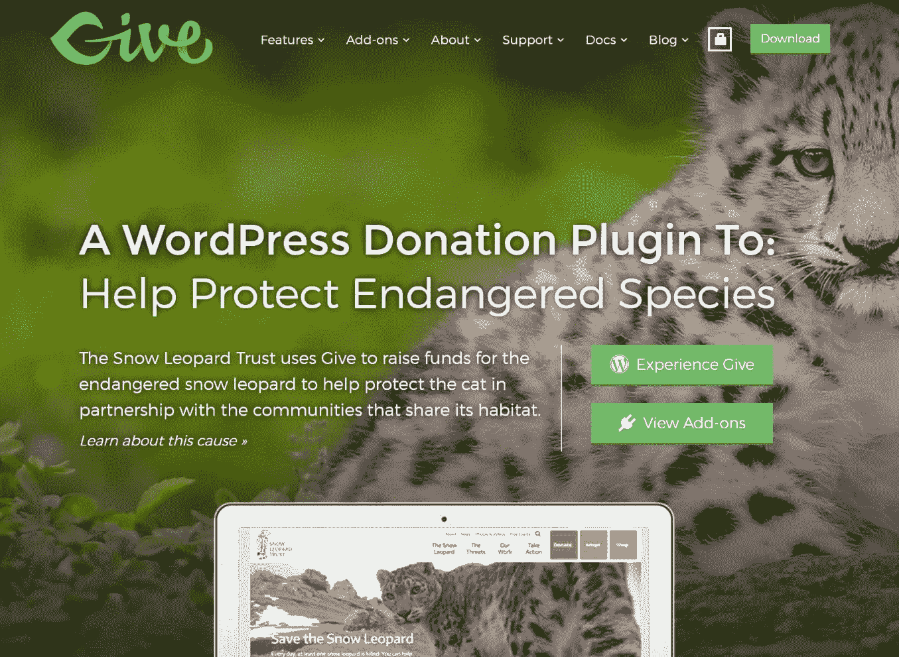

# 金斯塔·金并:德文·沃克访谈

> 原文：<https://kinsta.com/blog/interview-devin-walker/>

你可以在 [LinkedIn](https://www.linkedin.com/in/devin-walker-883023a/) 或 [Twitter](https://twitter.com/innerwebs) 上找到 Devin。这是我们最近对他的采访，作为我们[金斯塔·金并](https://kinsta.com/?post_type=post&s=kingpin)系列的一部分。

### Q1:你的背景是什么，你是如何开始使用 WordPress 的？

当我从亚利桑那大学大学毕业时(加油野猫队！我开始在一家大公司的 IT 部门工作。我工作的那家公司让我从事大量的 Microsoft SharePoint 管理工作，比如构建公司范围内的内部网，以及帮助将系统扩展为面向客户的门户网站。这份工作既有趣又有挑战性，但我发现。NET 和 MS 技术令人沮丧和困难。不过，它的好处是它确实让我了解了内容管理系统的世界，并激起了我的好奇心，想看看外面还有什么。

我在开源世界的第一次经历是使用 Mambo，它最终变成了 Joomla。与 SharePoint 相比，我真的很喜欢这个平台的简单性，以及它的免费使用方式。这个概念在当时对我来说是全新的，来自专有 MS 许可的世界。Mambo 最终引导我修补 Joomla 和 [Drupal](https://kinsta.com/blog/wordpress-vs-drupal/) ，最终我遇到了 [WordPress](https://wordpress.org/) 。

我记得我对 WordPress 的第一印象是它的用户界面，易用性，以及多种多样的主题和插件扩展选项。在使用了一段时间后，我发现了 WP 社区和当地的聚会，并从那里迷上了它。从那以后，我几乎不看其他任何东西，使用 WordPress 已经成为我的职业。

### Q2:读者应该知道你最近在 WordPress 做了些什么？

我们致力于用 [GiveWP](https://givewp.com/) 为 WordPress 提供最好的捐赠和筹款平台。这真的是我们的旗舰产品，我每天花 90%的时间在这上面。我们喜欢通过向个人和组织提供免费插件来帮助他们为他们的事业筹集资金，从而让世界变得更美好。除了 GiveWP，我们还将推出一个插件，在你的网站上显示来自 Yelp、脸书、谷歌等各种网络的商业评论。它叫做 WP 商业评论，将在接下来的几周内进入测试阶段。

GiveWP website

### Q3:在职业生涯中，你遇到了哪些挑战？

我面临的最大挑战是试图独自创业。直到我与马特·克伦威尔和 T2·杰森·克尼尔合作，生意才真正开始增长。我们每个人都知道彼此的长处和短处，我们共同组成了一个真正完整的技能组合。之前，我试图身兼数职，并发现**作为一名独立企业家真的很难脱颖而出**。

### 在 WordPress 的世界里，有没有什么让你感到惊讶的事情？

在 WordPress 世界工作时，我有很多惊喜。最近对几家公司的收购令人惊讶，但这是好的方面。这表明我们的行业正在扩大和成熟。然而令人惊讶的是，许多收购细节从未被披露。这似乎不符合开源的精神，但我能理解为什么。

## 注册订阅时事通讯

### 想知道我们是怎么让流量增长超过 1000%的吗？

加入 20，000 多名获得我们每周时事通讯和内部消息的人的行列吧！

[Subscribe Now](#newsletter)

### Q5:你认为 WordPress 世界的未来会是怎样的？

前途一片光明！有了这么大的社区，就很容易有更多的讨论质疑 WordPress 的未来和它的发展方向( [Gutenberg](https://kinsta.com/blog/gutenberg-wordpress-editor/) ， [Jetpack](https://kinsta.com/knowledgebase/wordpress-jetpack/) 等等)。)但我个人是乐观的。我们将继续在 WordPress 平台上成长、贡献和建设，直到未来。有所作为的最佳方式是参与其中，这也是我和我们公司一直努力的方向。

[The best way to make a difference is to be involved. 🙌 -- Devin WalkerClick to Tweet](https://twitter.com/intent/tweet?url=https%3A%2F%2Fbit.ly%2F38pRi7d&via=kinsta&text=The+best+way+to+make+a+difference+is+to+be+involved.+%F0%9F%99%8C+--+Devin+Walker&hashtags=WordPress%2Cnptech)

### 你在 WordPress 主机中寻找什么？

我使用过许多最流行的主机，从共享主机到高度优化的堆栈。然而，我主要寻找的是支持有多好？当然，速度和正常运行时间很重要，但同样重要的是知道你有一条愿意付出额外努力的生命线，而不只是把问题当成你的而不是他们的。当你的业务在 WordPress 上运行时，主机的支持人员应该对这个平台了如指掌。拥有自信的支持是我选择一家公司而不是另一家公司的主要原因。

### 问题 7:当你离开笔记本电脑时，你喜欢做什么？

近年来，旅游已经成为我生活中的一大部分。今年我去了印度两次，在那里演讲并赞助了多个单词营。同样，去年我成功地去了欧洲参加了世界夏令营，今年我计划再去一次。值得庆幸的是，我妻子也喜欢旅行，所以我们试图把工作和休闲结合起来，让旅行成为一种“工作场所”。效果很好，我们计划继续下去。除此之外，我还是一个狂热的吉他手和圆盘高尔夫球手。

### 问题 8:接下来我们应该采访谁&为什么？

当然是乔希·波洛克。这家伙是一个你从未见过的编码奇才。他也是 WordPress 社区的重要成员，他开发了一个名为 Caldera Forms 的插件，活跃安装量已经超过 100，000 次。他也是一个好人，不仅是我自己的朋友，也是我们整个公司的朋友。

* * *

让你所有的[应用程序](https://kinsta.com/application-hosting/)、[数据库](https://kinsta.com/database-hosting/)和 [WordPress 网站](https://kinsta.com/wordpress-hosting/)在线并在一个屋檐下。我们功能丰富的高性能云平台包括:

*   在 MyKinsta 仪表盘中轻松设置和管理
*   24/7 专家支持
*   最好的谷歌云平台硬件和网络，由 Kubernetes 提供最大的可扩展性
*   面向速度和安全性的企业级 Cloudflare 集成
*   全球受众覆盖全球多达 35 个数据中心和 275 多个 pop

在第一个月使用托管的[应用程序或托管](https://kinsta.com/application-hosting/)的[数据库，您可以享受 20 美元的优惠，亲自测试一下。探索我们的](https://kinsta.com/database-hosting/)[计划](https://kinsta.com/plans/)或[与销售人员交谈](https://kinsta.com/contact-us/)以找到最适合您的方式。