# 如何重新安装 WordPress:根据你的需要有 5 种不同的方法

> 原文：<https://kinsta.com/blog/reinstall-wordpress/>

如果你的 WordPress 站点有问题，一个潜在的解决方法是重新安装 WordPress，以确保问题不是由任何损坏的文件引起的。做得好，这确保你有干净的核心 WordPress 文件，而不影响你现有的内容。或者，如果你想从一个完全空白的状态重新启动你的 WordPress 站点，你可能想彻底销毁你现有的 WordPress 站点并重新安装一个新的 WordPress 副本来从头开始。

无论你想完全重新安装 WordPress 还是仅仅重新安装 WordPress 的核心软件而不影响你现有的内容，我们都可以在这篇文章中找到你。

我们唯一要求的是**你在使用这些方法**之前做一个备份。尽管前两种方法是为了帮助你重新安装 WordPress 而不丢失任何内容，但是有一个新的备份总是一个好主意，以防出错！如果你是 Kinsta 的客户，只需点击一下，你就可以快速[进行 WordPress 备份](https://kinsta.com/help/wordpress-backups/)。

一旦你有了最新的备份，点击下面跳到你选择的教程:

*   [如何在保留现有内容的同时从 WordPress 仪表盘重新安装 WordPress](#dashboard)
*   [如何通过 FTP 手动重新安装 WordPress，同时保留现有内容](#ftp)
*   [如何通过 WP-CLI 手动重新安装 WordPress，同时保留现有内容](#wp-cli)
*   [如何完全重新安装 WordPress 并从 100%空白开始](#complete)
*   [如何重新安装 WordPress 主题或插件](#plugin)

## 如何在保留现有内容的同时重新安装 WordPress

以下三种方法告诉你如何重新安装核心 WordPress 软件**而不影响你现有的任何软件:**

*   内容
*   主题
*   插件

从稍微更专业的角度来说，这意味着这两种方法都不会影响你的 WordPress 站点:

*   [数据库](https://kinsta.com/knowledgebase/wordpress-database/)
*   [**wp-config.php**文件](https://kinsta.com/blog/wp-config-php/)
*   **wp-content** 文件夹

每个方法**只有**重新安装核心 WordPress 软件。
T3】


> Kinsta 把我宠坏了，所以我现在要求每个供应商都提供这样的服务。我们还试图通过我们的 SaaS 工具支持达到这一水平。
> 
> <footer class="wp-block-kinsta-client-quote__footer">
> 
> 
> 
> <cite class="wp-block-kinsta-client-quote__cite">Suganthan Mohanadasan from @Suganthanmn</cite></footer>

[View plans](https://kinsta.com/plans/)

### 如何从你的仪表板自动重新安装 WordPress 核心软件

如果你只是想重新安装 WordPress 的核心文件，你可以直接从你的 WordPress 仪表盘进行安装(如果你不能访问你的 WordPress 仪表盘，你应该跳到下一节，学习如何通过 FTP 进行同样的操作！).

出奇的简单。在你的 WordPress 仪表盘中，进入侧边栏的**仪表盘→更新**。然后，点击按钮**重新安装**:

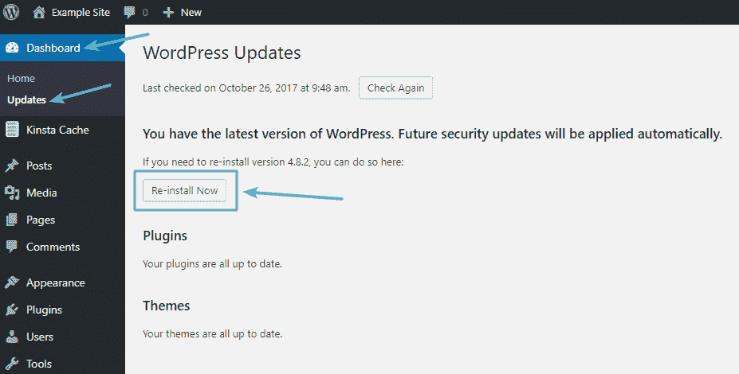

WordPress dashboard updates area


一旦你点击按钮，WordPress 将自动下载并重新安装 WordPress 的最新版本。当你从你的仪表板更新 WordPress 时，你本质上只是手动重新运行 WordPress 执行的正常的**更新**过程。

这可能需要几秒钟——但是一旦这个过程完成，你应该已经安装了一个新的 WordPress。

### 如何通过 FTP 重新安装 WordPress 核心软件

如果你因为一个错误而不能访问你的 WordPress 仪表盘(或者只是喜欢通过 FTP 工作)，你可以通过 FTP 执行一个类似的过程。你基本上是手动复制 WordPress 在上面部分中为你做的事情。

简单来说，这个过程如下:

*   下载 WordPress 的最新版本
*   提取 ZIP 文件
*   上传除了之外的所有东西**到 **/wp-content/** 文件夹**

让我们更详细地看一下每个步骤…

首先，[前往 WordPress.org](https://wordpress.org/)下载 WordPress 的最新版本:

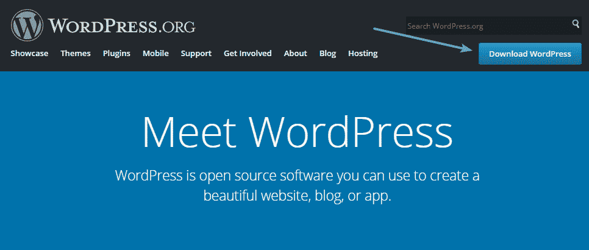

Download the most recent copy of WordPress


下载完成后，将 ZIP 文件的全部内容解压缩到您的计算机上。然后，**删除****WP-content**文件夹。

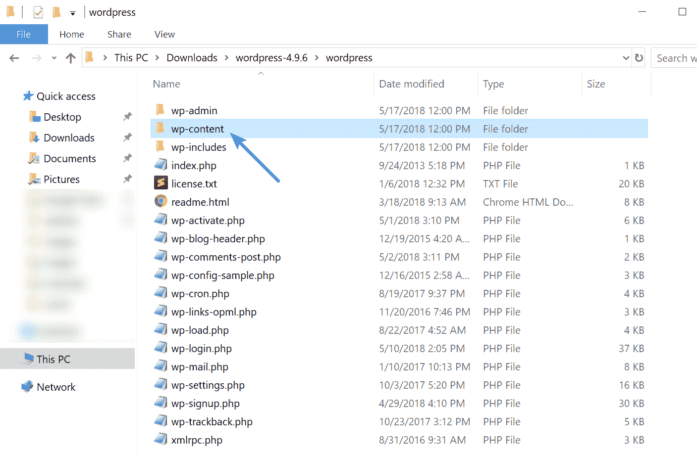

Delete wp-content


一旦你完成了这些，通过 FTP 连接到你的主机，把剩下的文件上传到你最初安装 WordPress 的文件夹。通常，这是你的根文件夹，名为 **public** 或 **public_html** 。

当你开始上传文件时，你的 FTP 程序会提示你一条类似于**目标文件已经存在**的信息。发生这种情况时，确保选择**覆盖**选项并继续:

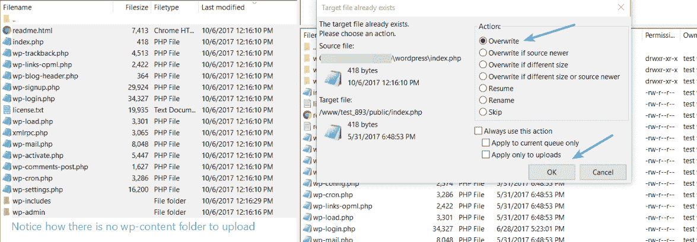

Upload remaining files via FTP


因为你已经删除了 **wp-content** 文件夹，这将覆盖所有的核心 WordPress 文件，而不会影响你的任何主题或插件。一旦上传完成，你应该有一个新安装的 WordPress 核心文件的副本，一切都有希望顺利运行。

### 如何通过 WP-CLI 重新安装 WordPress 核心

你也可以使用 WP-CLI 重新安装 WordPress core。WP-CLI 是一个命令行工具，用于管理 WordPress 安装的许多方面。它可以添加/删除用户，文章，类别，插入测试数据，在数据库中搜索和替换，等等。下面的命令将下载没有默认主题和插件的 WordPress 核心。

## 注册订阅时事通讯


### 想知道我们是怎么让流量增长超过 1000%的吗？

加入 20，000 多名获得我们每周时事通讯和内部消息的人的行列吧！

[Subscribe Now](#newsletter)

```
wp core download --skip-content --force
```

阅读更多关于 WP-CLI 命令的信息。

## 如何完全卸载并重新安装 WordPress

**Important:** If you follow this method, **you will lose all of your existing content**. this section deals with uninstalling WordPress and installing a fresh, 100% blank copy.

**这种方法不会保留您现有的任何内容**。除非你想彻底清除你现有的 WordPress 站点，否则不要跟随它。基本上，您需要:

*   删除你现有的所有 WordPress 文件
*   用你想要的方法安装一个新的 WordPress

如果听起来很简单，那是因为它就是！要删除所有现有文件，您可以通过 FTP 连接到您的站点，或者如果您的主机使用 cPanel，则通过 cPanel 文件管理器。

选择安装 WordPress 的文件夹中的所有文件并删除它们:

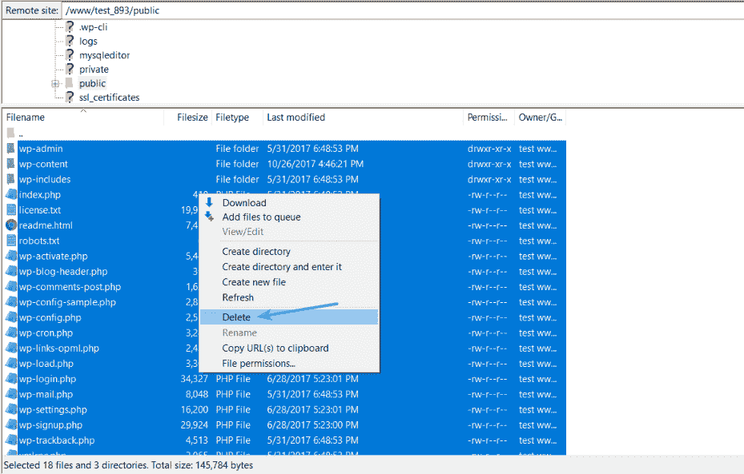

Delete current WordPress files


出于整洁的原因，你可能也想删除你的 WordPress 站点使用的现有数据库，尽管你可以使用一个新的数据库，即使你跳过删除现有数据库。如果您的主机使用 cPanel，您可以从 cPanel 的 **MySQL** **数据库**区域删除您现有的数据库:

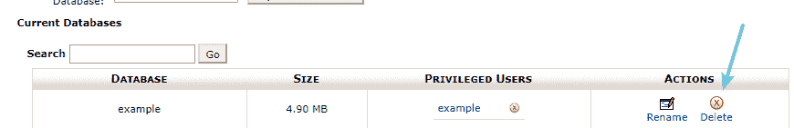

Delete database in cPanel


否则，您可以使用 phpMyAdmin 来**删除数据库**:

Struggling with downtime and WordPress problems? Kinsta is the hosting solution designed to save you time! [Check out our features](https://kinsta.com/features/)

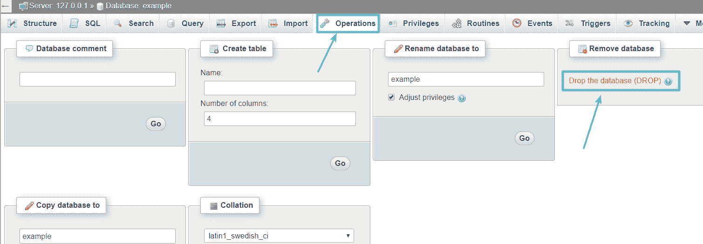

Delete database in phpMyAdmin


一旦你清理了现有的 WordPress 文件，你需要做的就是安装一个新的 WordPress，就像你安装一个全新的网站一样。根据您的主机，您可以执行以下操作:

*   通过一键安装程序，如 Softaculous 或 Fantastico
*   手动使用[著名的 5 分钟 WordPress 安装](https://codex.wordpress.org/Installing_WordPress)

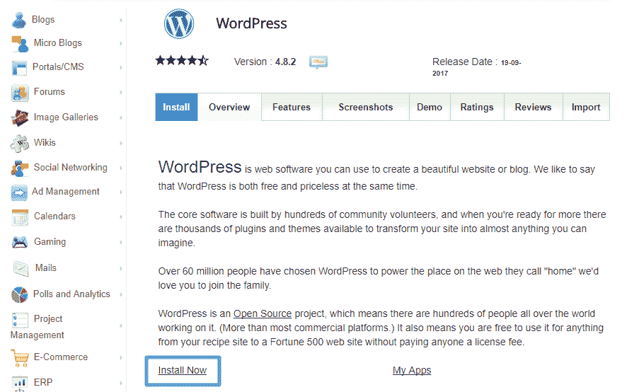

Reinstall WordPress via your preferred method


一旦你安装完 WordPress 的新版本，你就可以从一张白纸开始构建你的新网站。如果你不能登录你的 WordPress 仪表盘，请阅读我们关于如何更改你的密码的指南。
T3】

## 如何重新安装 WordPress 主题和插件

虽然上面的方法是专门针对 WordPress 核心软件的，但你也可能遇到需要在你的网站上重新安装特定主题或插件的情况。谢天谢地，这很简单。以下是最安全的方法:

首先，通过 FTP 连接到您的站点，并导航到您的 **wp-content** 文件夹。然后，根据你是想重新安装一个主题还是插件，导航到**主题**或者**插件**文件夹:

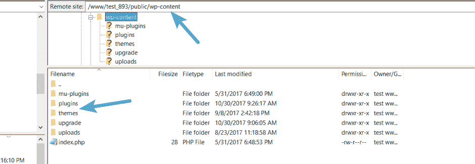

Find wp-content folder


找到您想要重新安装的插件或主题的文件夹。然后，重命名该文件夹，并将“_old”附加到原始文件名的末尾:

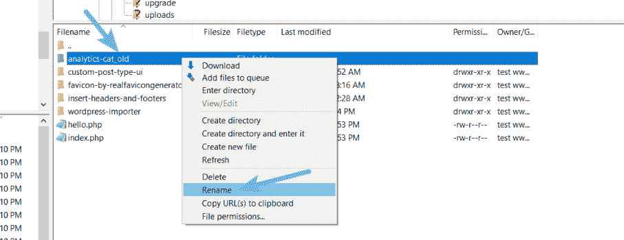

Rename folder for desired plugin or theme


此时，你可以像平常一样安装一个新的主题或插件。它的功能应该和以前一样，并保留您以前的所有设置和配置。

一旦确认重新安装的版本运行正常，您就可以返回 FTP 程序并删除旧文件夹:

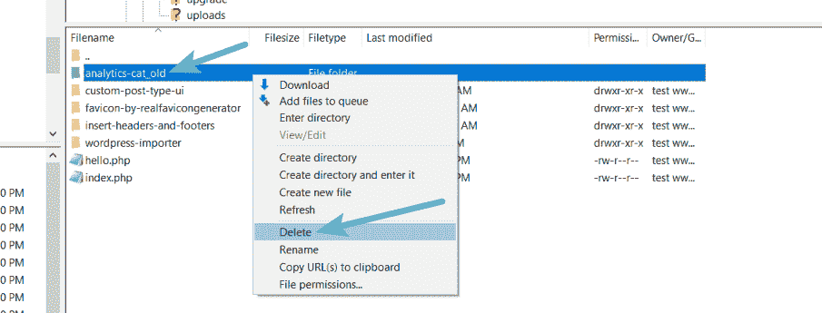

Delete old folder after making sure things are functioning normally


## 最后的想法

最后，重新安装 WordPress 相当简单。如果你只是想重新安装 WordPress 核心软件，你可以通过以下方式:

*   使用内置的 WordPress 更新功能
*   重新上传 WordPress 的最新版本到你的服务器，不包括 **wp-content** 文件夹和【wp-config-sample.php】T2 文件。

如果你想完全从头开始，你需要做的就是删除你现有的:

*   文件
*   数据库ˌ资料库

通过你喜欢的任何方法安装一个新的 WordPress。最后，要重新安装一个特定的主题或插件，你需要做的就是通过 FTP 重命名现有的文件夹，然后像平常一样安装一个新的副本。

建议阅读:[如何本地安装 WordPress】。](https://kinsta.com/blog/install-wordpress-locally/)

* * *

让你所有的[应用程序](https://kinsta.com/application-hosting/)、[数据库](https://kinsta.com/database-hosting/)和 [WordPress 网站](https://kinsta.com/wordpress-hosting/)在线并在一个屋檐下。我们功能丰富的高性能云平台包括:

*   在 MyKinsta 仪表盘中轻松设置和管理
*   24/7 专家支持
*   最好的谷歌云平台硬件和网络，由 Kubernetes 提供最大的可扩展性
*   面向速度和安全性的企业级 Cloudflare 集成
*   全球受众覆盖全球多达 35 个数据中心和 275 多个 pop

在第一个月使用托管的[应用程序或托管](https://kinsta.com/application-hosting/)的[数据库，您可以享受 20 美元的优惠，亲自测试一下。探索我们的](https://kinsta.com/database-hosting/)[计划](https://kinsta.com/plans/)或[与销售人员交谈](https://kinsta.com/contact-us/)以找到最适合您的方式。