# 为什么使用 WordPress？深入探究 10 个好理由

> 原文：<https://kinsta.com/blog/why-use-wordpress/>

如果你发现自己想知道，“为什么使用 WordPress？”你来对地方了。思考这个问题意味着你至少研究过一些 WordPress 或者从朋友或同事那里听说过它。但这并不意味着你已经完全权衡了利弊，或者深入研究了这些特性。

因此，我们想为你分析一下使用 WordPress 的好处，清楚地说明为什么它是世界上最流行的内容管理系统和网站建设软件。WordPress 真的可以做任何事情！

## 网站困境——为什么使用 WordPress？

对于一般的企业主来说，像 [WordPress](https://kinsta.com/knowledgebase/what-is-wordpress/) 、 [Joomla](https://kinsta.com/blog/joomla-vs-wordpress/) 、 [Shopify](https://kinsta.com/blog/woocommerce-vs-shopify/) 、 [Magento](https://kinsta.com/magento-market-share/) 、 [Wix](https://kinsta.com/blog/wix-vs-wordpress/) 和[weely](https://kinsta.com/blog/weebly-vs-wordpress/)这样的名字听起来可能像是陌生的名字。建立网站的过程将这些名字带入你的生活，因为它们都是用来建立网站的平台。每一个都有自己的好处，而许多更常用于有特定目的的利基网站。例如，Shopify 只有在你经营网上商店时才有意义。这不是一个你可以用来开博客然后变成电子商务商店的平台(查看 [Shopify 替代方案](https://kinsta.com/blog/shopify-alternatives/)来比较解决方案)。Magento 也在同一条船上。其他网站建设者和平台有更多的灵活性，这些通常是最受欢迎的。

从 [Squarespace](https://kinsta.com/blog/squarespace-vs-wordpress/) 到 Wix 的所有东西都有针对特定技能水平的优秀工具，但是我们将解释为什么你应该在所有这些工具上使用 WordPress。

1.  该软件是免费和开源的
2.  [它可以适应，所以你可以制作任何类型的网站](#adapts)
3.  [支持多种媒体类型](#media-types)
4.  [它很容易学习，而且有一个庞大的社区](#easy-to-learn)
5.  [您可以使用主题和插件来扩展您的网站](#scale)
6.  [管理并不需要天才](#manageable)
7.  [SEO 第一](#seo)
8.  [您可以完全控制您的网站](#full-control)
9.  [博客无疑是业内最好的](#blogging)
10.  [每个人都在做](#popular)

### 1。该软件是免费和开源的

WordPress.com 和 WordPress.org 都可以完全免费使用。你可以[在这里](https://kinsta.com/blog/wordpress-com-vs-wordpress-org/)了解两者的区别，但简而言之，WordPress.org 是一个自托管版本，在这里你可以控制你的网站，并利用[高级插件](https://kinsta.com/best-wordpress-plugins/)。WordPress.com 对完全的初学者来说很棒，但对计划赚钱的企业来说不完全是最好的，所以[离开 WordPress.com](https://kinsta.com/blog/wordpress-com-to-wordpress-org/)是有意义的。它确实有更高的付费计划，但我们推荐它用于个人和爱好博客。

但是继续前进， **WordPress 是任何人都可以免费下载的**。这是一个自 2003 年就存在的开源项目。这意味着 WordPress 是由一群贡献者开发的。开源项目通常是免费的，有大型的社区。用户经常作为 beta 测试者或简单的品牌倡导者加入这个社区，但是如果这不是你的风格，就不需要任何参与。

> Kinsta 把我宠坏了，所以我现在要求每个供应商都提供这样的服务。我们还试图通过我们的 SaaS 工具支持达到这一水平。
> 
> <footer class="wp-block-kinsta-client-quote__footer">
> 
> 
> 
> <cite class="wp-block-kinsta-client-quote__cite">Suganthan Mohanadasan from @Suganthanmn</cite></footer>

[View plans](https://kinsta.com/plans/)

警告:虽然 WordPress 软件是免费的，但你最终很可能会花一点钱。WordPress 是自托管的，所以需要托管。对于非常便宜的共享服务器来说，这可以从每月 3 美元左右开始，对于需要终极速度和性能的人来说，可以一直到每月数百美元(像 Kinsta)。

你通常可以找到免费的主题和插件，但是付费的通常会提供更好的特性和质量支持。最后，许多 WordPress 用户最终[会为额外的服务](https://kinsta.com/blog/wordpress-website-cost/)付费，不管是来自自由职业者还是代理商。例如，你可能会付钱给一个自由职业者，让他为你设计一个标志或者调整你网站上的 CSS 代码。其他 WordPress 用户热衷于让图形设计师或维护专家随叫随到。这完全取决于你的经验和你网站的规模。

但是总的来说，你绝对可以将你的 WordPress 成本保持在最低。很多站长最后只为托管付费。

#### 观看它的实际应用:

当你导航到[WordPress.org](https://wordpress.org/)网站时，它解释了关于这个平台的基础知识，但是唯一的按钮(除了常规的[菜单](https://kinsta.com/blog/wordpress-menu-plugins/)之外)是一个“获取 WordPress”的链接

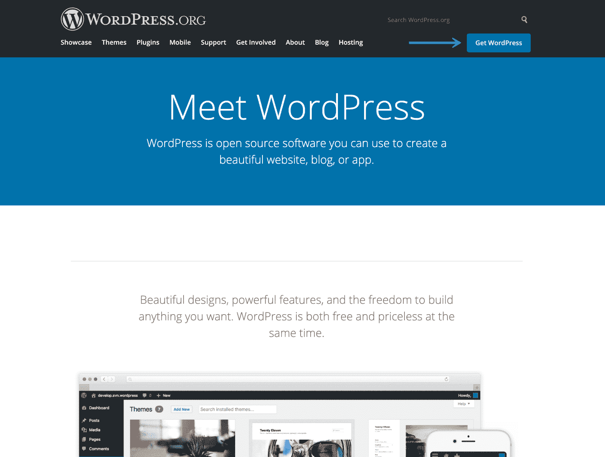

WordPress.org

这会把你带到一个免费的[下载页面](https://wordpress.org/download/)，这个页面会根据最新的版本频繁更新(目前是 [WordPress 5.2](https://kinsta.com/blog/wordpress-5-2/) +)。这提供了 WordPress 软件如何呈现给用户的即时体验。你不会被横幅广告轰炸，也不会在下载免费软件前被提示完成调查。您会看到一个基本页面，上面有一些描述、测试版、需求、源代码、档案和下载计数器。它提供了[多种下载选项](https://kinsta.com/blog/wordpress-download-manager/)(比如。拉上拉链。tar.gz 文件和正确的说明一起安装你自己的 WordPress 软件。

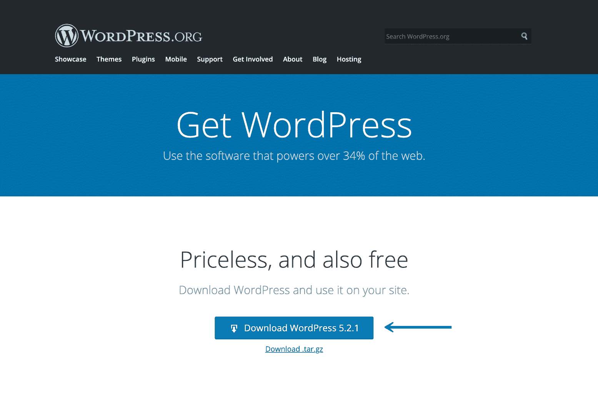

Download latest version of WordPress

#### 简单的安装方法

如果你正在寻找一个更简单的安装方法，我们建议你找你的主机公司。最著名的主机都有[一键式安装](https://kinsta.com/help/new-site/)按钮，让 WordPress 在几分钟内运行。在 Kinsta，安装 WordPress 就像点击“添加站点”一样简单

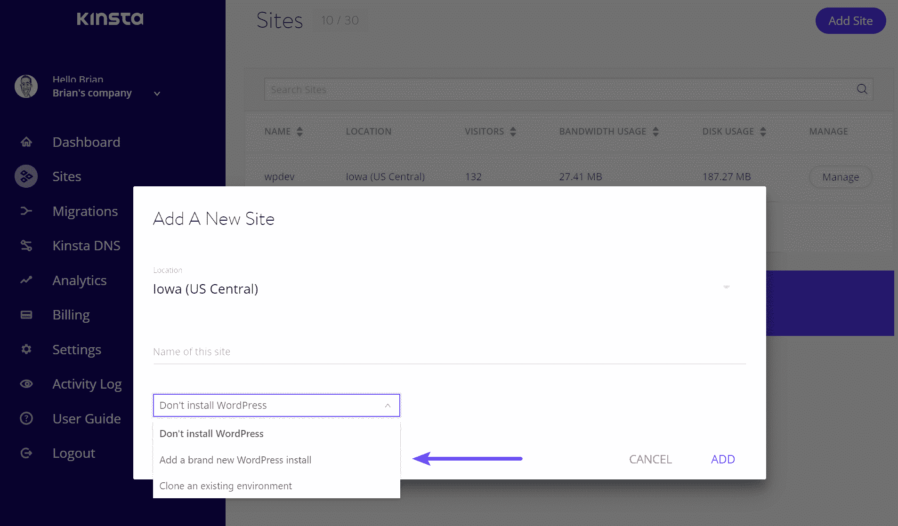

Install WordPress

这样就不需要管理文件并通过 FTP 上传。托管 WordPress 托管公司更进一步，处理整个安装、维护、安全和备份。

至于更新，你不必每次发布新的 WordPress 版本时都回到下载页面。相反，WordPress 让你在仪表板中了解更新，在那里你通常可以在不到一分钟内完成这个过程。
T3】

### 2。它可以适应，所以你可以做任何类型的网站

关于 WordPress 的一个常见误解是它主要是用来建立博客的。事实上，在某个时间点上确实如此。WordPress】是作为博客平台开发的，但是随着这些年来各种新版本的发布，这已经发生了巨大的变化。

事实上，WordPress 的优势在于它的博客根基。这是迄今为止最干净、最快捷的写和发布博客文章的方式之一，并且从一开始就包含了所有的内容。一些网站建设工具首先考虑的是设计和应用程序，然后博客界面才是后来才想到的。

WordPress 则不是这样，所以你可以创建一个漂亮的电子商务网站，并且知道博客是开发过程中不可或缺的一部分。

#### 观看它的实际应用:

列表是无穷无尽的，但是这里有一些你可以用 WordPress 创建的网站类型:

*   博客
*   商业网站
*   文件夹
*   论坛
*   电子商务网站
*   评级网站
*   会员网站
*   电子学习模块
*   闲聊室
*   美术馆
*   自我推销的个人网站
*   工作公告板
*   商业目录
*   像 Quora 这样的问答网站
*   收集捐款的非营利网站
*   [维基和知识库](https://kinsta.com/blog/wordpress-wiki/)
*   像 YouTube 这样以媒体为中心的网站
*   拍卖和优惠券网站

显然，这个清单还在继续。WordPress 的好消息是，像论坛和电子商务网站这样的功能可以通过简单的插件和 T4 主题来实现。例如，如果我想为我的网页设计业务制作一个在线作品集，我可以选择下面的主题。它所需要的只是一笔很小的一次性费用，一些演示数据的上传，以及我想自己做的任何改变。

WordPress portfolio site

下面的截图是一个相当受欢迎的电子商务主题，与 WooCommerce 插件配对。WooCommerce 是将你的常规 WordPress 网站转变成一个功能正常的在线商店的主要方式之一，它有支付处理、购物车和产品展示区。查看这篇关于如何安装 WooCommerce 的深入教程。

WordPress ecommerce store

还有许多其他电子商务插件，如[简易数字下载](https://easydigitaldownloads.com/)(通常用于销售数字产品)和 [WP 电子商务](https://wordpress.org/plugins/wp-e-commerce/)。查看这篇关于[如何安装简易数字下载](https://kinsta.com/blog/easy-digital-downloads/)的深度教程。

下面的最后一个例子显示了一个论坛。这个网站是使用一个主题构建的，但是你也可以考虑在互联网上寻找一些论坛插件。如果你已经有了一个很酷的主题，但它没有论坛功能，有几个是可用的。这就是如何用 WordPress 完成不同类型的网站。写下你需要的功能，然后去谷歌看看有没有适合你需求的插件或者主题。我打赌你总能找到好结果。

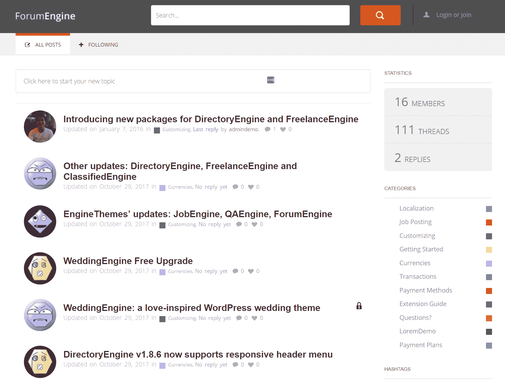

WordPress 论坛示例

### 3。它支持多种媒体类型

随意查看 WordPress 接受的文件类型的[长列表，但是要知道以下主要类别都是被接受的:](https://en.support.wordpress.com/accepted-filetypes/)

*   形象
*   文档
*   声音的
*   录像

以我自己的经验，我从来没有让 WordPress 告诉我一个文件不被支持。您可以上传常见的文件，如。jpg，。png，。gif。pdf，。doc，。pptx，. mp3，. m4a，. mp4，.mov，。除此之外，你不会有任何问题，更模糊的文件类型，如。odt，。键，。ogg 和. 3gp。

虽然有些文件格式，如 SVG，是不允许的，但有很好的解决方案来解决这个问题。看看这篇关于如何在 WordPress 中安全地[上传 SVG 的教程。简而言之，如果你想在你的网站上放一张照片、gif、视频或文档，这通常是 WordPress 的公平游戏。甚至在网站上托管文档和演示文稿而不在特定页面上发布也很常见。](https://kinsta.com/blog/what-is-an-svg-file/)

#### 一句警告

是的，WordPress 几乎支持任何类型的媒体。但是，您应该遵守规则，只合法使用您拥有的、开放供免费下载的或在给予信用时可用的媒体。

以下是一些可以找到照片和视频等合法媒体的地方:

*   [视觉搜索](https://visualhunt.com/)
*   [去飞溅](https://unsplash.com/)
*   [轴](https://www.pexels.com/)
*   [股票快照](https://stocksnap.io/)

查看这个完整的列表，为 WordPress 寻找[免费图片。](https://kinsta.com/blog/free-images-for-wordpress/)

#### 观看它的实际应用:

作为 WordPress 媒体支持的一个很好的例子，[索尼音乐](https://www.sonymusic.com/)网站同时推广音乐曲目和视频。因此，你经常可以在网站上找到几种形式的视频和音频剪辑。此外，这是一个图片丰富的网站，你可以在标题中看到肯尼·切斯尼的大幅图片。尽管一些网站建设者在媒体支持方面做得越来越好，但你似乎总是会发现一些不被允许的事情。

Sony – WordPress media example

综艺网站也使用 WordPress，其主页上散落着背景图片、视频短片、电影预告片、动画、音乐曲目以及电影和电视节目的图库。很难找到比《综艺》更好的例子，因为为娱乐杂志写的每一篇文章都与媒体有关。

Variety – WordPress media example 2

### 4。它很容易学习，有一个巨大的社区

WordPress 作为一款开源软件，任何人都可以使用。用户群不受价格、高级客户支持甚至技能水平的限制。当然，有很多关于 WordPress 的东西需要学习，但是任何人都可以在仪表盘上玩 10 分钟，然后开始理解界面是如何工作的。

由于获得该软件没有太多障碍，用户已经创建了博客、论坛、在线课程、研讨会、网络研讨会和书籍，这些都概述了 WordPress 平台的不同方面。然后是来自 WordPress 的更官方的客户支持。你可以为专门的支持支付额外的钱，或者通过 WordPress 论坛工作。

令人难以置信的是，有这么多的资源可以用来学习 WordPress 或者回答快速开发的问题。例如，你可能会关注这样一个博客，在你的电子邮件收件箱里收到持续不断的 WordPress 提示。另一方面，你也可以搜索谷歌来定位即时解决方案(WPBeginner 以快速修复著称)。

#### 观看它的实际应用:

我们认为 WordPress 社区有助于学习过程的两个部分:

*   有组织的长期知识培训。
*   快速解决你的 WordPress 问题。

WordPress 培训可以是免费的，也可以是收费的，但有一点是肯定的:最好的在线课程是组织良好的，负担得起的，并且包含了你可以自己使用、给客户或与你的员工分享的信息。例如， [WP101 网站](https://www.wp101.com/)是一个著名的培训点，提供关于以下主题的完美视频课程:

*   WordPress 101
*   WooCommerce 101
*   Yoast SEO 插件

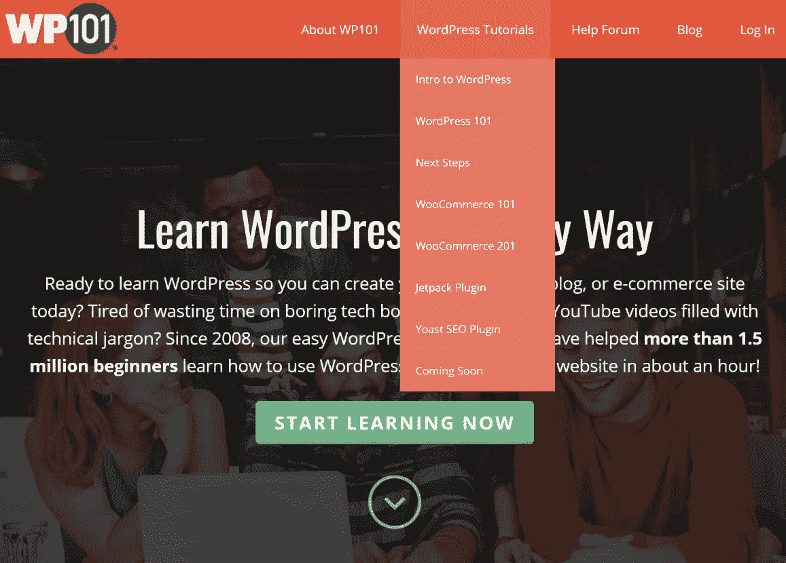

Learn WordPress tutorials

一旦你通过培训课程学习了 WordPress，你将会最终使用你自己的网站。由于传统的专门支持不是通过 WordPress 提供的，[你需要转向博客、论坛、谷歌和其他在线社区](https://kinsta.com/blog/learn-wordpress/)。[主要的 WordPress 支持论坛](https://kinsta.com/blog/wordpress-support/)应该可以满足你的大多数开发需求。在下面的截图中，显示了修复 WordPress、WordPress 联网、 [localhost 安装](https://kinsta.com/knowledgebase/what-is-localhost/)、常规安装等主题。我个人更倾向于“谷歌一下，看看会出现什么”类型的研究者，但是论坛和博客对于及时解决问题都是至关重要的。

至于高级插件和主题，那些开发者通常通过知识库、[论坛](https://wordpress.org/support/forums/)、票务系统和电子邮件提供他们自己的专门支持。

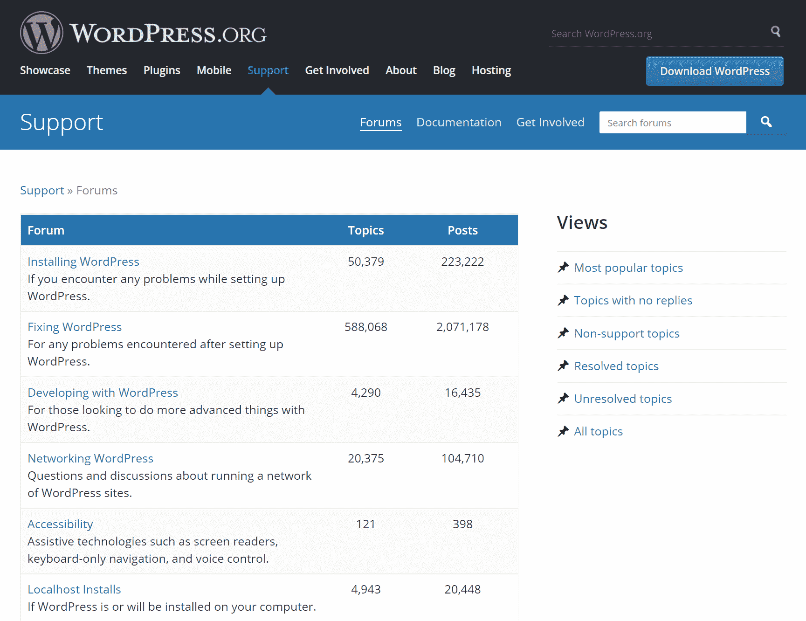

WordPress support forums

### 5。你可以用主题和插件来扩展你的网站

我们已经讨论了 WordPress 的主题和插件是如何让你轻松地构建一个网站的，但是这些元素对于网站的扩展也是必不可少的。对于一个标准的博客，你将[安装一个主题](https://kinsta.com/blog/how-to-install-a-wordpress-theme/)，调整设计，然后开始写博客。商业网站或[作品集](https://kinsta.com/blog/portfolio-website/)也是如此。

主题作为网站的基础是很常见的。在此之后，除了一些颜色的变化，标志的增加，当然，新的网页和博客帖子，设计工作是最小的。

但是每隔一段时间，你就会意识到你的网站需要添加一些新的东西。也许你的客户要求在你的网站上设立会员专区，或者你意识到每月一次的测验是让客户与你的品牌互动的好方法。在这两种情况下，插件可以解决问题。

例如，有很多优秀的会员插件可以将你网站的一部分转化成一个社区。其中一些是免费的，而另一些是你必须付费的。测验插件也是如此。我们有一个市场上最好的测验插件的[列表，这只是精选的一部分。](https://kinsta.com/blog/wordpress-quiz-plugins/)

#### 网站扩张不仅仅是通过插件完成的

是的，[插件](https://kinsta.com/knowledgebase/wordpress-plugin/)通常在为你的网站添加功能时发挥作用。大多数时候，你只需要一个网站发布主题。

但是随着你网站的成长，你会开始注意到你自己网站的不同需求，以及行业的变化。一个很好的例子是谷歌开始奖励移动响应网站。不到一年，似乎所有的 WordPress 主题开发者都开始销售手机友好的设计。因此，许多网站所有者需要走出去[获得新的主题](https://kinsta.com/blog/change-wordpress-theme/)。

成长中的网站获得新主题也很常见，原因如下:

*   需要一个新的面貌。
*   它需要从一个免费主题切换到一个更强大的高级主题。
*   网站所有者希望主题开发者提供更好的客户支持。
*   企业在网上提供的服务已经发生了转变。
*   网站所有者需要插件无法提供的不同工具。

#### 观看它的实际应用:

寻找 WordPress 主题就像完成谷歌搜索一样简单。你可以找到大量的列表，涵盖了不同类别的 WordPress 主题。尝试搜索“房地产 WordPress 主题”或“平面 WordPress 主题”，你会看到很多选择。然而，你最好的选择是从一个可信的 WordPress 主题商店或者开发者那里挑选。这可以确保您获得高质量的支持、快速和优化的代码，以及长期的更新。

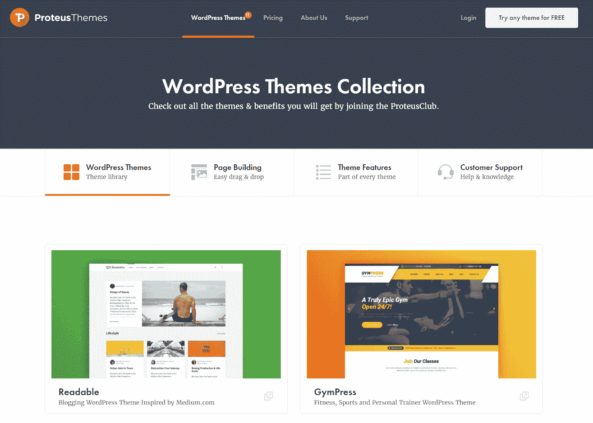

WordPress theme shop

以下是一些著名的主题热点:

*   [WordPress 主题目录](https://wordpress.org/themes/)
*   [小岛](https://themeisle.com/wordpress-themes/)
*   [千变万化主题](https://www.proteusthemes.com/)
*   [主题化](https://themify.me/themes)
*   [优雅的主题](https://www.elegantthemes.com/)
*   [特斯拉主题](https://teslathemes.com/)
*   [主题导火线](https://themefuse.com/)
*   [MH 主题](https://arrayinternet.com/wordpress/)
*   [子午线主题](https://meridianthemes.net/)
*   [温度](https://templatic.com/)
*   [神话之父](https://mythemeshop.com/themes/)
*   [工作室压力](https://www.studiopress.com/)

还有网上主题集市。然而，要小心这些，因为有时开发者会离开地球，给你留下一个不受支持的主题。但它们也有很大的种类，高质量的主题确实存在，你只需要稍微努力一点:

*   主题森林
*   [Mojo 市场](http://www.mojomarketplace.com/themes/wordpress)
*   [模板怪物](https://www.templatemonster.com/wordpress-themes.php)

插件和主题相似，你可以找到免费和高级版本。唯一不同的是，免费插件在实际商业网站中的使用要普遍得多。免费主题对个人和新手博客来说很好，但是专业人士通常会花 50-100 美元来获得一个更好的高级主题。阅读我们关于免费和付费主题的深度文章,深入了解哪一个更适合你。

然而插件并不总是这样，因为许多最好的插件总是免费的。你可以通过你的 WordPress 仪表盘搜索新的插件，或者去 [WordPress 插件库](https://wordpress.org/plugins/)。这个库有超过 50，000 个插件，其中大部分是免费的(或者以某种形式的免费增值商业模式)。从缓存到论坛插件，从垃圾邮件到社交媒体插件，这个库应有尽有。安装一个插件不超过几分钟，每个插件页面都包括截图、功能列表，甚至一些演示。

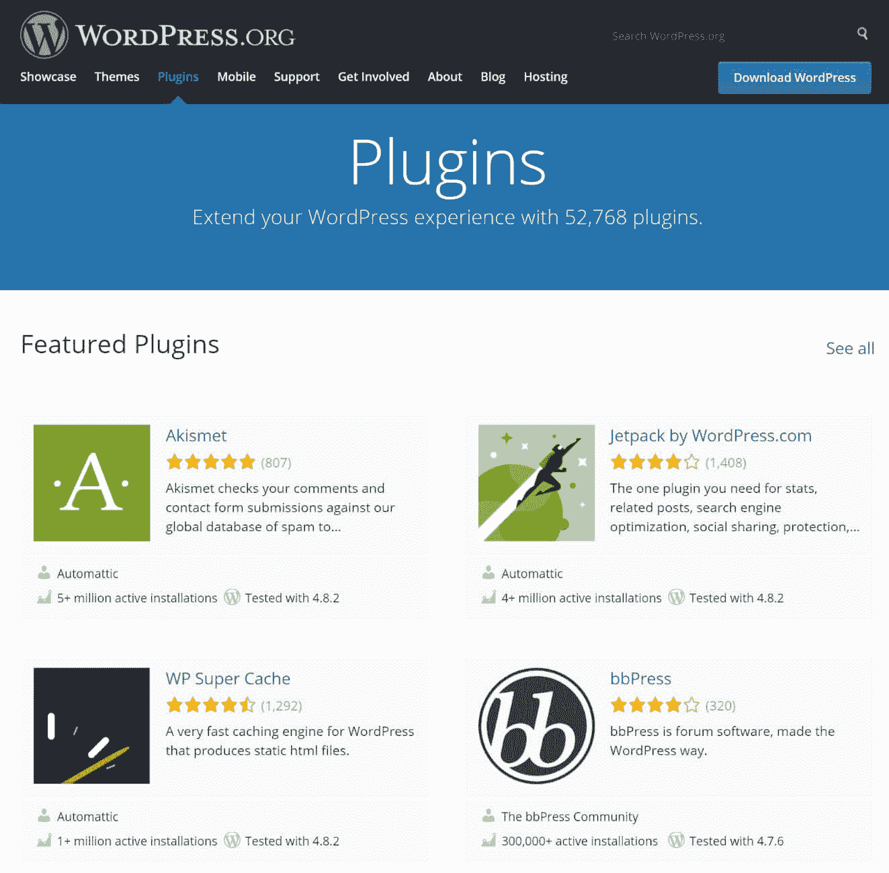

WordPress plugin repository

许多高级插件也在互联网上出售。免费插件和付费插件的主要区别在于，付费插件通常能让你获得更好的客户支持。这里有一些搜索高级插件的好地方:

*   [代码峡谷](https://codecanyon.net/category/wordpress)
*   [神话之父](https://mythemeshop.com/plugins/)
*   [优雅的主题](https://www.elegantthemes.com/plugins/)

### 6。这并不需要天才来管理

网站开发公司经常出售昂贵的软件包，要求预付定金和每月定期支付维护费用。唯一的问题是，如果你掌握了诀窍并经过适当的培训，WordPress 并不那么难管理。网站管理通常涉及几件事:

1.  确保服务器正常。
2.  保持安全检查。
3.  [运行备份](https://kinsta.com/blog/wordpress-backup-plugins/)。
4.  更新插件、主题和 WordPress 软件。
5.  [管理垃圾邮件](https://kinsta.com/blog/wordpress-spam-comments/)。
6.  测试功能和断开的链接。
7.  提高速度和搜索引擎优化。

你不亲自检查服务器，所以更多的是你得到一个好的主机，看看网站是否一直在运行。安全和 [WordPress 站点备份](https://kinsta.com/blog/backup-wordpress-site/)要么通过插件处理，要么通过一个托管的 WordPress 托管计划处理。清单上的其他事情只需要偶尔去做。例如，在 Kinsta，每天都会自动进行备份，存储 14 天，并且只需点击一个按钮就可以[恢复](https://kinsta.com/blog/restore-wordpress-from-backup/)。

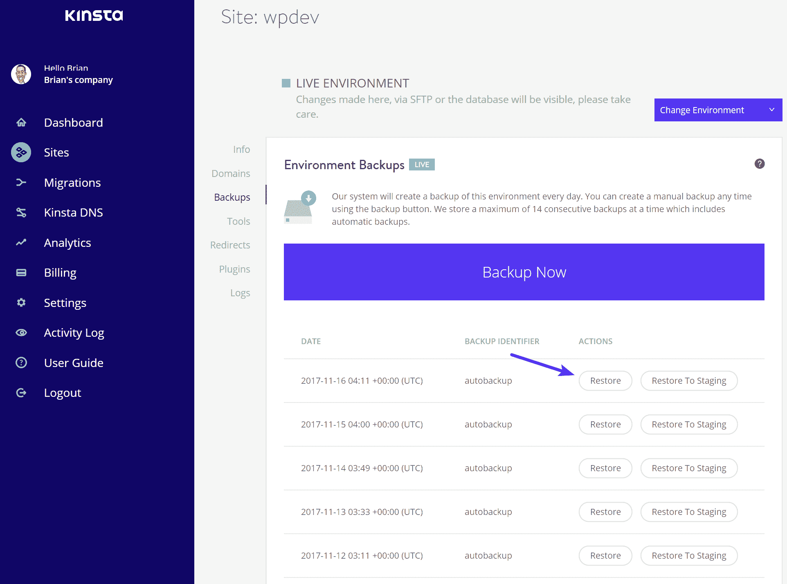

Restore WordPress backup

例如，你可能想安装一个[缓存插件](https://kinsta.com/blog/wordpress-caching-plugins/)来帮助提高网站速度。同样的道理也适用于 [SEO](https://kinsta.com/blog/what-does-seo-stand-for/) 。管理垃圾邮件是通过 Akismet 插件完成的，还有一些[插件可以处理断开的链接](https://kinsta.com/blog/broken-links/)。

#### 观看它的实际应用:

唯一的手工维护任务之一是更新插件、主题和 WordPress 本身。好消息是 WordPress 会在更新发布时通知你。因此，无论何时看到警告，您都要进行更新。更新通常不到一分钟，然后你就可以继续工作了。

## 注册订阅时事通讯

### 想知道我们是怎么让流量增长超过 1000%的吗？

加入 20，000 多名获得我们每周时事通讯和内部消息的人的行列吧！

[Subscribe Now](#newsletter)

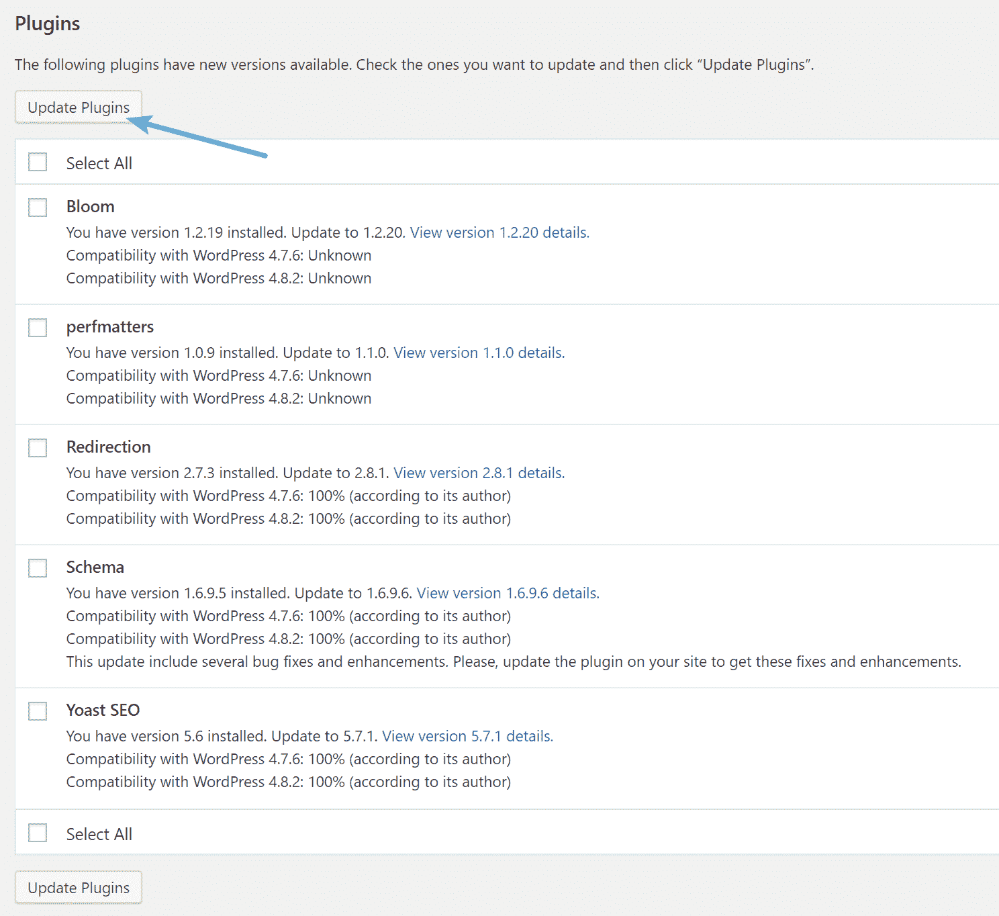

Update WordPress plugins

其他一切(如搜索引擎优化、备份、速度、安全、断开的链接和垃圾邮件)都可以使用插件来管理。例如， [WP Time Capsule 插件](https://wptimecapsule.com/index.php)是设置增量文件和数据库备份的绝佳工具。插件在后台运行。如果一个文件损坏了，或者你的站点崩溃了，恢复功能可以解决问题。

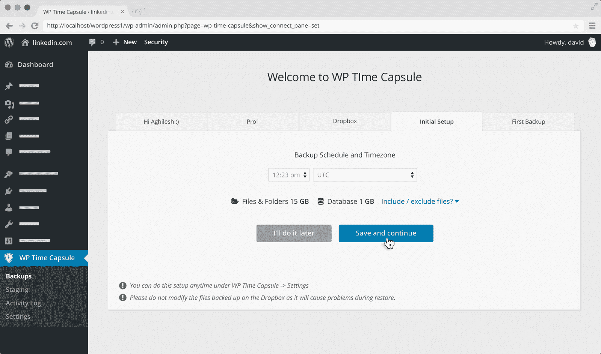

WordPress backups

另外，看看这三个给 WordPress 用户的[组织技巧](http://www.wpsuperstars.net/organize-wordpress/),它们可以帮助管理管理面板变得更简单。

### 7。SEO 第一

众所周知，WordPress 的平台内置了 SEO。事实上，WordPress 会自动为你所有的页面和文章生成标题标签和元描述。这让搜索引擎知道你的内容，它会让你的索引和潜在的排名上升。和 WordPress 中的所有东西一样，插件和在线工具也提供了更多的高级功能[。这里有一些搜索引擎优化的最爱可以考虑:](https://kinsta.com/blog/best-seo-plugins-for-wordpress/)

*   [模式](https://wordpress.org/plugins/schema/)
*   [断链检查器](https://wordpress.org/plugins/broken-link-checker/)
*   [Rel Nofollow 复选框](https://wordpress.org/plugins/rel-nofollow-checkbox/)

#### 观看它的实际应用:

Yoast SEO 插件也是任何 WordPress 网站的必备插件。WordPress 中的默认 SEO 工具很棒，但是 Yoast 将它提升到了一个新的水平。

下面是 Yoast 的一个部分，要求您输入一个焦点关键字。这可能是一个页面或博客帖子。在锁定焦点关键词后，Yoast 会分析当前的帖子或页面，并分享您在[锁定关键词](https://kinsta.com/blog/keyword-research/)时的效率。你会看到关键词密度，关于关键词位置的想法，SEO 标题提及，页面标题建议，等等。这基本上是一个巨大的清单，让你的搜索引擎优化在每一页上都能做到最好。

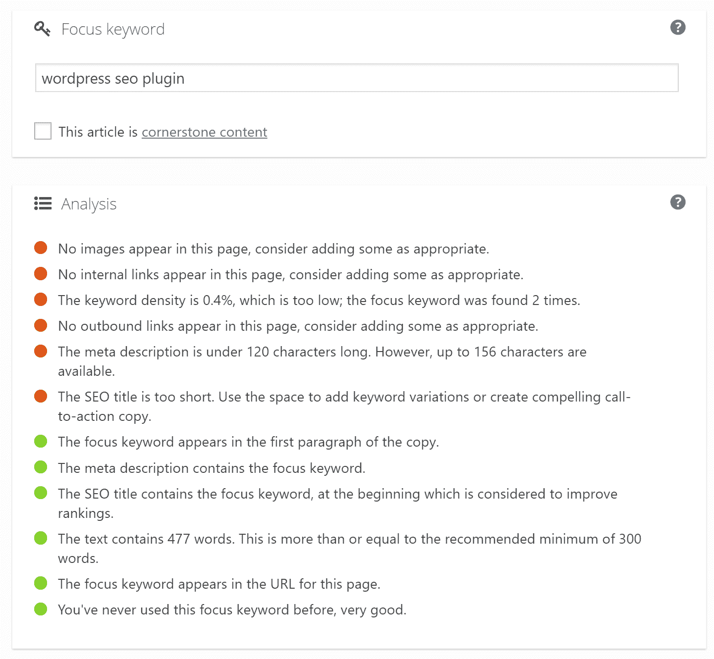

Yoast SEO focus keyword

看看这篇有 45 个以上 SEO 技巧的文章和这篇关于 T2 最好的 WordPress SEO 插件的文章，开始提升你的有机流量。

### 8。你可以完全控制你的网站

在谷歌上搜索“网站建设者”或“网站平台”，会发现各种各样的结果。WordPress 将很有可能出现在所有网站建设名单上，同时还有 WIX、Squarespace、Joomla、Magento、Shopify、Weebly 和 Jimdo T1 等竞争对手。所有这些都非常适合制作网站，但非开源网站，如 Squarespace、Shopify 和 WIX，会限制你对高级包中提供的任何功能的控制。

这给你留下了一些限制，如下所示:

1.  电子商务功能通常是内置的，所以你不能用插件来扩展。
2.  无论提供什么样的托管服务，你通常都会受到束缚。您没有测试主机并选择最佳价值或最高性能的自由。
3.  调整代码仅限于公司与您共享的内容。更糟糕的是，你会陷入一种完全独特的编码语言，比如 Shopify(它使用一种叫做 Liquid 的语言)。简而言之，它几乎保证了你必须雇佣一个专门的开发人员来处理你不能通过编辑器自己处理的变化。
4.  从技术上讲，你对你的网站和内容没有完全的所有权。你从这些公司租用网站。因此，当你停止付费时，所有这些文件和页面要么丢失，要么被公司持有。有了 WordPress，你就拥有了这些文件，没有人能阻止你把它们转移到其他主机上。

#### 观看它的实际应用:

外观标签是 WordPress 中所有定制的控制中心。在这里你可以自由控制主题、字体、颜色、[小部件](https://kinsta.com/blog/wordpress-widgets/)、菜单、徽标和代码。你能想到的任何东西都可以在这个区域进行调整。这对初学者、中级用户和高级用户来说都很好，因为它限制了您接触的代码量，同时也加快了开发过程。

此外，几个主题有自己的定制模块，或者您可以安装一个拖放编辑器，几乎消除编码的需要。

Customize WordPress appearance

至于高级编辑，所有的网站文件都可以通过 WordPress 仪表盘、你的托管账户或者本地环境访问。无论你是想为谷歌分析插入一小段代码，还是想彻底修改登陆页面的 CSS，WordPress 都能帮你搞定。

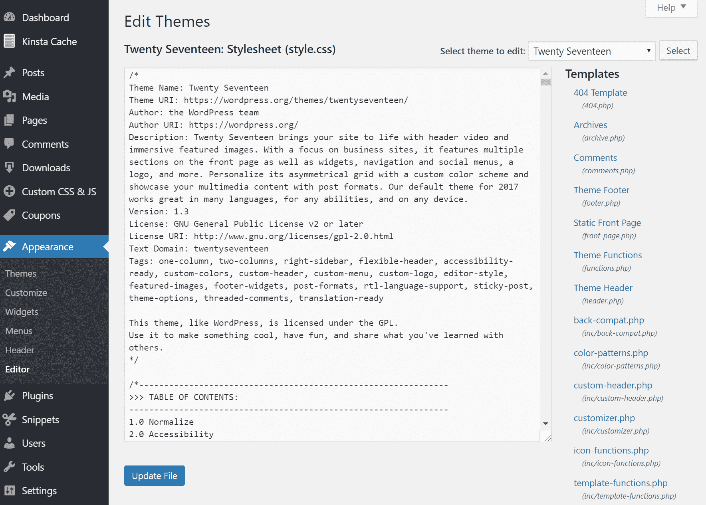

WordPress appearance editor

### 9。博客无疑是业内最好的

WordPress 是作为一个博客平台诞生的。它有自己的竞争对手，但目前没有什么能与你在 WordPress 博客引擎中找到的强大、优雅和先进的工具相提并论。Tumblr、Medium、Ghost 和 Blogger 等选项对业余爱好者来说都很好，但专业人士更喜欢 WordPress。WordPress 博客编辑器中有一套令人难以置信的工具。

利用格式化和媒体工具，你可以运行一个简单的单作者博客。还可以选择通过提前安排文章并为投稿人和编辑设置多种用户类型来建立一个完整的在线杂志。除了预览选项、编辑帖子中的所有内容以及将代码完全排除在外，你真的无法击败 WordPress。

#### 观看它的实际应用:

WordPress 博客平台的一个优势是权限或用户角色。假设你以管理员的身份管理网站。这意味着你可以访问文件，所有插件，搜索引擎优化和安全工具。你雇佣了一名编辑和三名作者来为博客创建内容。唯一的问题是，除了博客帖子之外，你不希望他们弄乱任何东西。

因此，您可以将一个人设置为编辑角色，将其他人设置为贡献者。编辑现在可以编辑和发布帖子，而投稿人可以创建帖子，但不能发布。

WordPress roles and permissions

我们也可以看看博客界面，看看它是多么强大和组织良好。只需点击一个按钮，您就可以添加媒体和更改格式。它让你改变标题和顶部的永久链接，还有类别、标签和可读性的选项。显示修订是为了返回和恢复过去的版本，预览和发布按钮会一直等着你，直到最后。

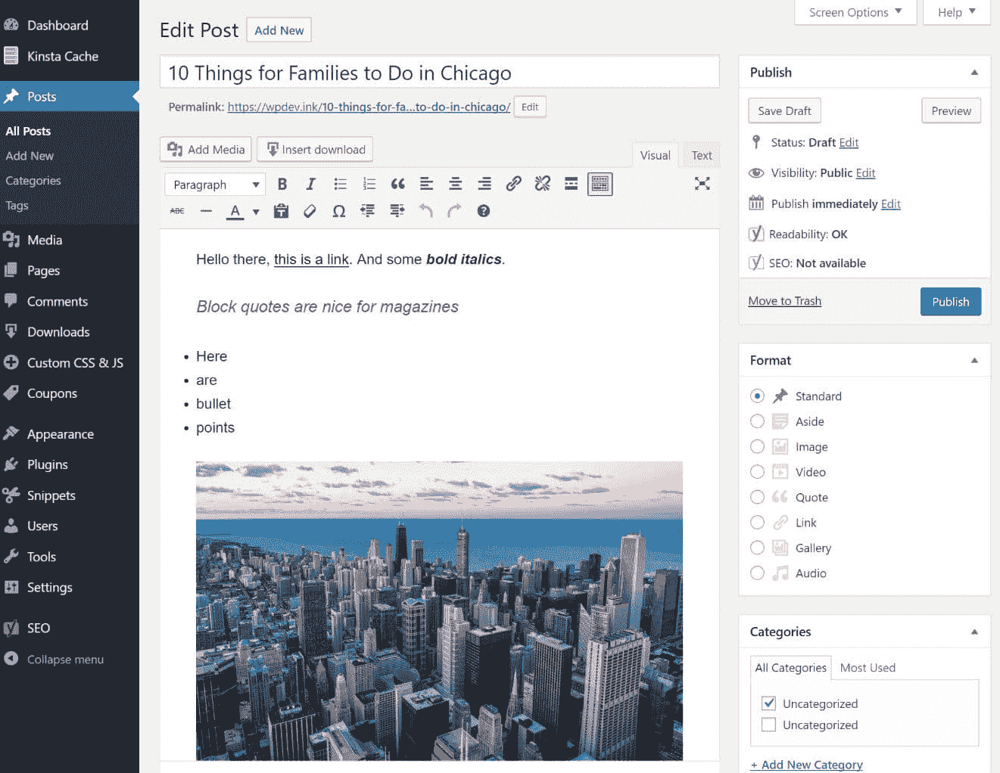

WordPress editor

可视化视图呈现 HTML，类似于最终用户将要看到的内容。您也可以切换到文本视图，它以 HTML 格式显示您的所有帖子内容。

Struggling with downtime and WordPress problems? Kinsta is the hosting solution designed to save you time! [Check out our features](https://kinsta.com/features/)

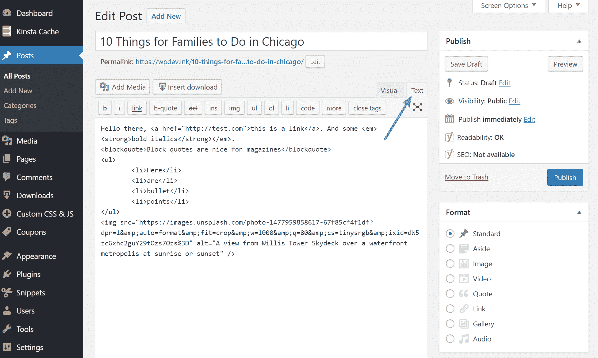

WordPress HTML text view

### 10。每个人都在做

所以和他们一起跳桥吧！好吧，仅仅因为其他人都在做某件事并不总是跟着做的最好理由。但是 WordPress 已经一次又一次地证明了自己，所以它的性能、可扩展性和易用性已经广为人知。互联网上超过 29.3%的网站使用 WordPress 是有原因的。

著名 SEO 帕特里克·库姆(Patrick Coombe)在 inbound.org 上向网站所有者和营销人员提出了一个问题:“如果你可以重新开始你的网站，你会改变什么？”以下是 WordStream 的创始人拉里·金(Larry Kim)所说的话:

WordPress vs Drupal

你可以在这里阅读更多关于这两个平台的信息:[WordPress vs Drupal](https://kinsta.com/blog/wordpress-vs-drupal/)——哪个更好？(赞成和反对)

显然，WordPress 正在做正确的事情。你也不需要牺牲太多来测试它。如前所述，WordPress 软件是免费的，大多数托管公司都有某种退款保证。

大多数有经验的 WordPress 用户都会称赞开发者的不断更新和改进。最酷的是，每当一个更新发布时，都会有一个信息页面概述这个更新将如何改善 WordPress 体验。

#### 观看它的实际应用:

> 美国增长最快的 100 家公司中有 62%使用 WordPress。–[内利奥软件](https://neliosoftware.com/blog/wordpress-use-of-best-companies-inc-5000-2016/)

WordPress 有一个使用 WordPress 的品牌的完整展示窗口，包括休斯顿动物园、奥巴马基金会，甚至丰田。其他一些知名网站包括论坛媒体集团、jQuery、Plesk、芝加哥太阳时报、Dyn、Nginx、TechCrunch 等等。使用 WordPress 查看这个[130+网站的列表。](https://kinsta.com/blog/wordpress-site-examples/)

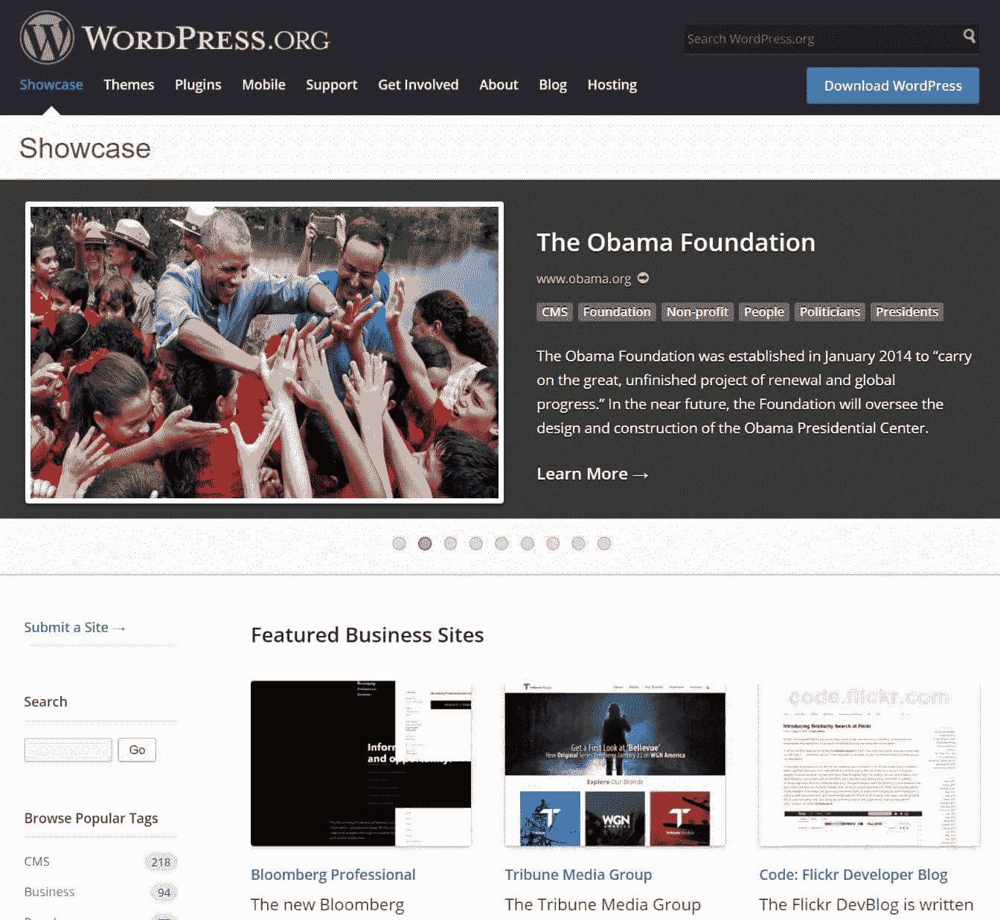

WordPress showcase

## 使用 WordPress 的另外 14 种方法

我们已经讨论了一些为什么以及如何使用 WordPress 的原因。但是，让我们来看看一些额外的，也许更不寻常的方法，你可以采取与您的网站。

### 1.新闻门户

仅仅提供新闻是不够的，你还需要提要。RSS 订阅源还没有消亡，许多人使用它来整合他们的读者，并获得不同订阅源的混搭。WordPress 默认提供你的文章的提要，但是你可能想显示来自不同来源的提要。这就是像 [WP RSS 聚合器](https://wordpress.org/plugins/wp-rss-aggregator/)这样的插件开始发挥作用的时候。这个插件可以让你选择各种各样的 RSS 源并显示在你的网站上。一个很好的例子是 [WP 新闻服务台](http://wpnewsdesk.com/)。

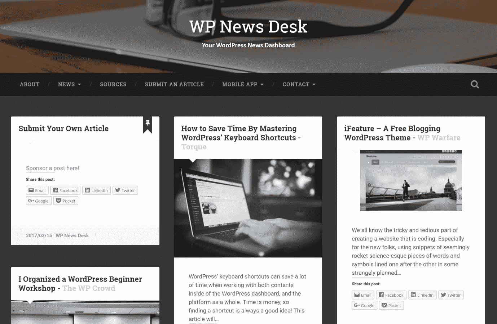

WP News Desk

### 2.用 WordPress 开发房地产管理系统

如果你是一家使用 WordPress 进行房地产交易的公司，你可能需要一个独立的插件来管理你的房地产列表。在一些插件的帮助下，你可以创建一个网站，将建筑商、经纪人和客户聚集在一起。您可以添加单独的搜索和过滤功能来帮助您的用户。添加一个支付网关(我们将在电子商务中讨论)，你就可以在你的网站中管理支付了！一些流行的插件可以帮你做到这一点，包括 [Estatik](https://wordpress.org/plugins/estatik/) 和[简易房产列表](https://wordpress.org/plugins/easy-property-listings/)。

Estatik WordPress real estate plugin

如果你正在寻找更多的选择，看看我们对 8 个不同的 WordPress 房地产插件的评论。

### 3.知识库/百科全书/维基

有了 WordPress，你可以创建一个强大的利基知识库，一个具有词汇表甚至字典功能的百科全书。除了创建标签和类别之外，您还可以将术语与术语表相关联。您可以创建用户定义的模板来显示您的内容，并确保读者可以找到他们需要的一切答案。事实上，许多企业和开发者利用知识库插件，如[heritary 插件](https://herothemes.com/plugins/heroic-wordpress-knowledge-base/)(如下所示)来创建文档，这反过来减少了支持和电子邮件所需的时间。

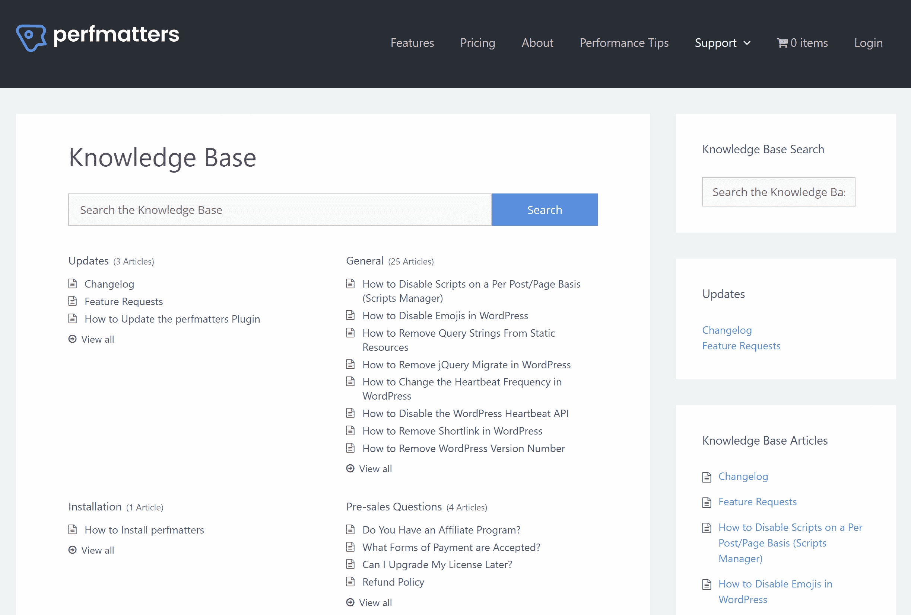

Heroic Knowledge Base WordPress plugin

### 4.电子学习门户和课程

想要[创造自己的 Coursera](https://kinsta.com/blog/wordpress-lms-plugins/) ？现在在 WordPress 中有很多简单的方法可以做到这一点，由[学习管理系统(LMS)托管](https://kinsta.com/wordpress-lms-hosting/)。最流行的方法之一可能是使用 [LifterLMS 插件](https://wordpress.org/plugins/lifterlms/)。它允许您创建、销售和保护引人入胜的在线课程。LifterLMS 的使命是在数字教室中实现教育民主化。创建课程，建设课程，包括多媒体课程，等等。事实上，我们上面提到的 WP101 利用 LifterLMS 来教育大众关于 WordPress 的知识。

Creating WordPress courses

### 5.用 WordPress 安排约会

无论是律师、音乐家、顾问还是医生；这些类型的行业都围绕预约调度和提前预约患者和/或客户。幸运的是，WordPress 有很多很好的解决方案来管理预订和在线预约。

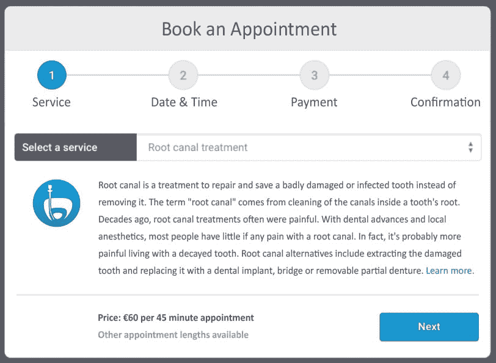

Book an appointment in WordPress (Img src: EDD bookings)

对于典型的 WordPress 安装，我们建议检查一下[简易约会](https://wordpress.org/plugins/easy-appointments/)和[预约日历](https://kinsta.com/blog/wordpress-calendar-plugin/#booking-calendar-plugin)插件。如果你正在运营一个电子商务网站，有 [WooCommerce 预订](https://woocommerce.com/products/woocommerce-bookings/)和 [EDD 预订](https://eddbookings.com/)插件。

### 6.发票系统

虽然像 Nutcache 和 Freshbooks 这样的网站给了你很多商业工具，比如时间和项目管理，但是如果你想在你的 WordPress 网站中做这件事， [WP-Invoice](https://wordpress.org/plugins/wp-invoice/) 是一个基本但有用的插件。

[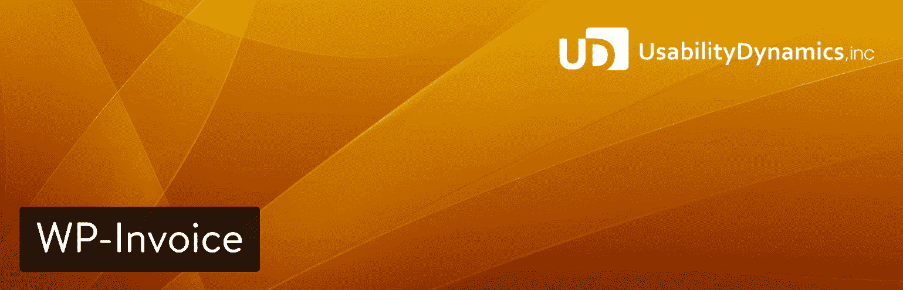](https://wordpress.org/plugins/wp-invoice/)

WP-Invoice plugin

为您的产品和服务创建发票，并将其发送给客户。您可以通过集成 PayPal、Stripe 或 Authorize.net 等支付网关，让他们直接通过您的网站向您付款。添加任何时间管理插件，你就可以创建一个服务于你所有业务需求的系统。

也有很多很棒的插件可以用你当前的电子商务 WordPress 网站创建发票，比如 [WooCommerce PDF 发票](https://wordpress.org/plugins/woocommerce-pdf-invoices/)和 [EDD PDF 发票](https://easydigitaldownloads.com/downloads/pdf-invoices/)。

### 7.使用 WordPress 创建工作门户

如果你想把你的 WordPress 站点转换成一个工作板，你所需要的只是一个插件。WP 工作管理器让你在你的网站上添加、管理和分类工作列表。它目前有令人印象深刻的 100，000 多个活跃安装，获得 4 个五星评级。注册用户(或访客)可以搜索、管理和申请工作。雇主也可以管理工作列表(填写、编辑和删除活动列表)。在这里你可以阅读我们的[完整的 WP 作业管理器教程](https://kinsta.com/blog/wordpress-job-board-plugin/)。

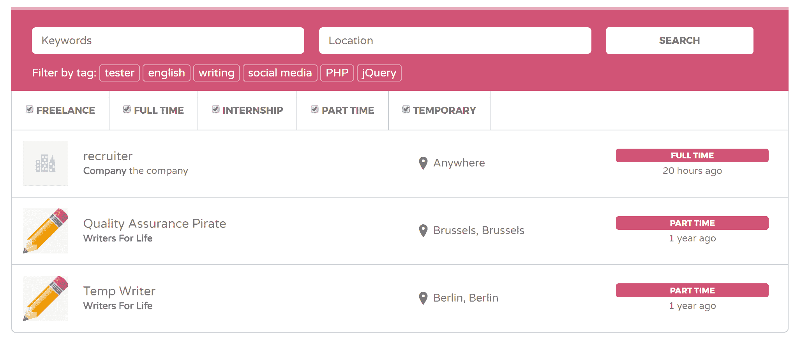

Job board in WordPress

### 8.客户关系管理系统

你可以将客户关系管理(CRM)模块集成到你的 WordPress 站点中。这可以节省您在其他第三方系统之间来回切换的时间和金钱。由于事实上有许多其他的 WordPress 集成，这实际上可能比一个更封闭或有限的解决方案更好。

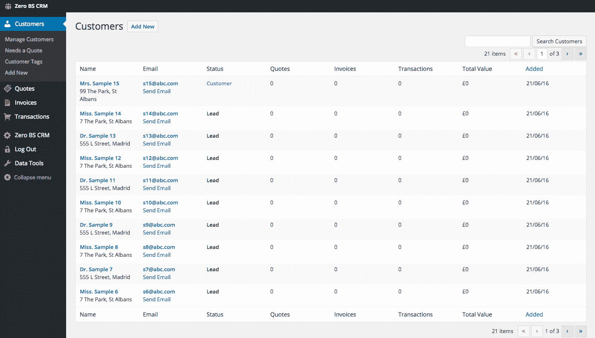

CRM customers

有很多不同的 WordPress CRM 插件可供选择，事实上，我们进入了前 12 名。但是如果你刚刚开始，我们推荐你去看看 [WP ERP](https://wordpress.org/plugins/erp/) 插件，它是由热心的开发者开发的，有很好的支持。

### 9.事件管理系统

经营一家全年策划多项活动的企业？没问题。如果你想在你的 WordPress 站点上创建事件，并把它们集成到一个日历中，就像 123 一样简单。在[这篇文章](https://kinsta.com/blog/wordpress-events-plugin/ "The Leading WordPress Event Management Plugins")中，我们介绍了最好的事件管理插件。他们中的许多人都与 iCal、谷歌日历等完全同步。

### 10.企业目录门户

如果你想[创建一个商业目录](https://kinsta.com/blog/directory-website-wordpress/)，我们建议检查一下[商业目录插件](https://wordpress.org/plugins/business-directory-plugin/)。它目前有超过 20，000 个活跃安装，五星评级为 4.5。你可以创建本地目录，列出业务提供商，并生成一个黄页一样的清单。你可以保持列表免费，也可以付费使用。至于高级模块，你可以添加一个模块来评价企业和谷歌地图模块来添加位置到您的清单。

WordPress business directory example

### 11.项目管理系统

为了管理一个项目及其子任务的进度，你需要一个项目管理系统。虽然像 [Trello、Asana](https://kinsta.com/blog/trello-vs-asana/) 甚至 [Github](https://kinsta.com/knowledgebase/what-is-github/) 项目这样的独立选项在开发者中很受欢迎(比如: [git vs Github](https://kinsta.com/knowledgebase/git-vs-github/) )，但是某些人可能希望在 WordPress 中为这样的系统提供选项。

对于那些人，我们会推荐类似 [WP 项目经理](https://wordpress.org/plugins/wedevs-project-manager/)或者[卡班](https://wordpress.org/plugins/kanban/)这样的插件。

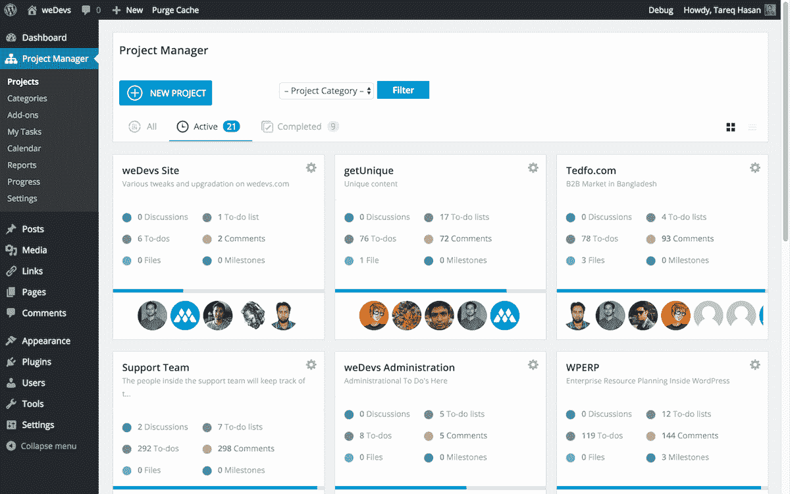

WordPress project management example

### 12.论坛

论坛可能不像以前那么受欢迎了，但对于许多寻找答案的用户来说，它们仍然是一个目的地。从你的 WordPress 站点创建一个论坛最简单的方法是 [bbPress](https://wordpress.org/plugins/bbpress/) 。这是 WordPress 的一个轻量级插件，由 WordPress.com 背后的 Automattic 公司开发。它目前有超过 300，000 个活跃安装，获得 4 个五星评级。bbPress 带有插件和主题的能力，可以定制核心插件的功能、外观和感觉。最棒的是，它是免费的！想了解更多选项，请看看我们关于这个主题的帖子:[9 大 WordPress 论坛插件](https://kinsta.com/blog/wordpress-forum-plugins/)。

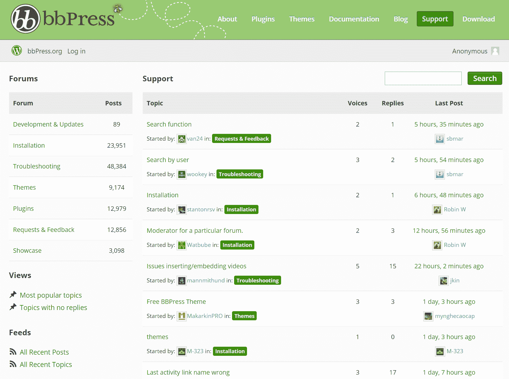

Example of bbPress WordPress forum

### 13.众包

有很多插件可以让你在 WordPress 中运行自己的众筹网站。你设立了一个原因，并集成了一个支付网关，如 [PayPal 或 Stripe，以接受支付](https://kinsta.com/blog/stripe-vs-paypal/)。事实上，您可以启用一个功能，只有当您达到目标时，人们才会付费！我们最近看了一下[WordPress](https://kinsta.com/blog/crowdfunding-options-wordpress/)的 6 大众筹插件。

WordPress crowdfunding example

如果你刚刚起步，我们建议你查看一下 [WP 众筹插件](https://wordpress.org/plugins/wp-crowdfunding/)，如果你正在处理捐赠事宜，那么 [Give 插件](https://wordpress.org/plugins/give/)也非常受欢迎。

### 14.社交网络

如果你想在你的网站上放一个迷你脸书，BuddyPress 是你应该寻找的。它允许你为你的公司或组织创建一个社交网络。它允许用户建立个人资料、发布消息、相互联系和创建社区。BuddyPress 有自己的插件集，可以提供更多的功能。总的来说，如果你想在你的网站中创建一个最小的社交网络，BuddyPress 提供了一个简单而良好的用户体验。

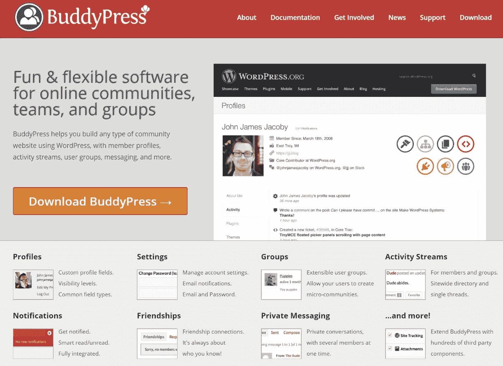

BuddyPress

## 那么，为什么要用 WordPress 呢？因为它很棒

WordPress 在全世界都有强大的追随者。一些开发人员宁愿使用其他平台，但这通常与学习某些编码语言和将自己投入不太友好的环境有关。对于博客作者、企业主、有客户的开发者和电子商务专业人士来说，WordPress 是正确的选择。你不仅保持对你的网站的完全控制，而且你还获得了很多优势，比如插件、主题、免费工具和全面的媒体支持。

希望我们已经回答了你的问题，“为什么使用 WordPress？”如果有人问你这个问题，就让他们过来。如果你还有一些想法或顾虑，请在下面的评论中告诉我们。

* * *

让你所有的[应用程序](https://kinsta.com/application-hosting/)、[数据库](https://kinsta.com/database-hosting/)和 [WordPress 网站](https://kinsta.com/wordpress-hosting/)在线并在一个屋檐下。我们功能丰富的高性能云平台包括:

*   在 MyKinsta 仪表盘中轻松设置和管理
*   24/7 专家支持
*   最好的谷歌云平台硬件和网络，由 Kubernetes 提供最大的可扩展性
*   面向速度和安全性的企业级 Cloudflare 集成
*   全球受众覆盖全球多达 35 个数据中心和 275 多个 pop

在第一个月使用托管的[应用程序或托管](https://kinsta.com/application-hosting/)的[数据库，您可以享受 20 美元的优惠，亲自测试一下。探索我们的](https://kinsta.com/database-hosting/)[计划](https://kinsta.com/plans/)或[与销售人员交谈](https://kinsta.com/contact-us/)以找到最适合您的方式。