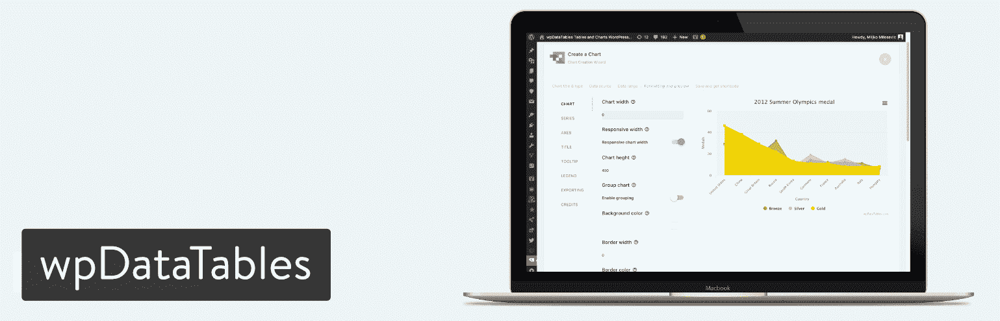
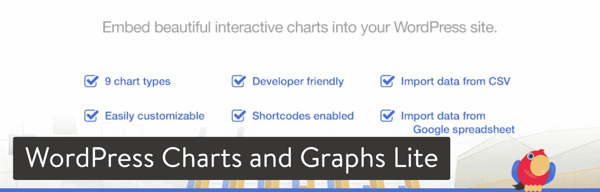
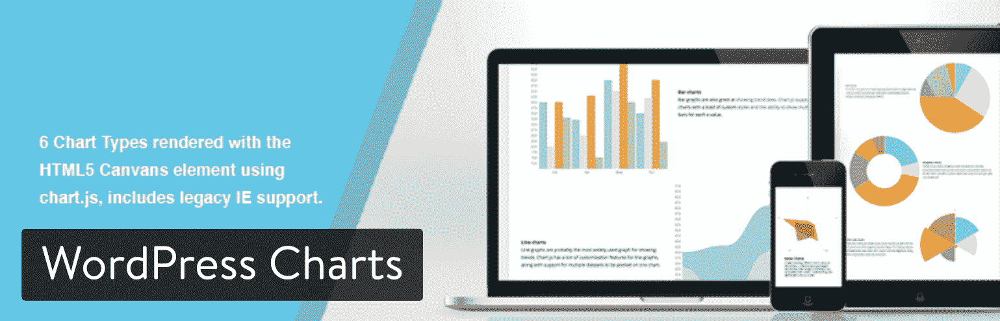
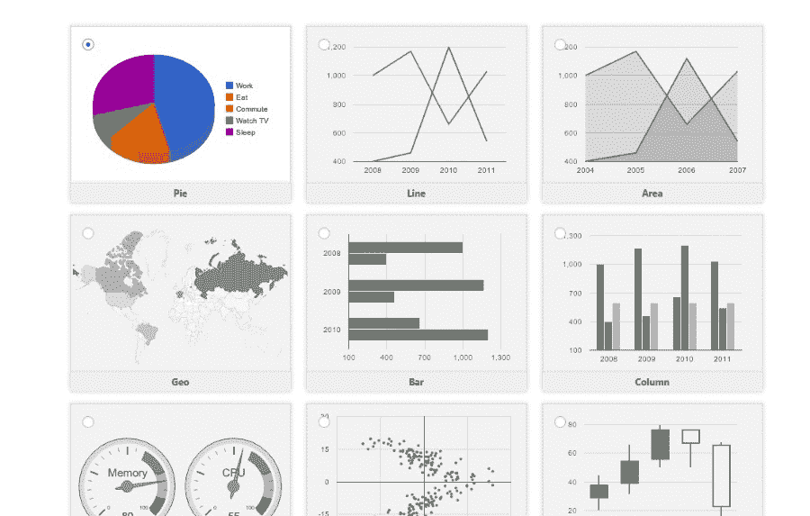
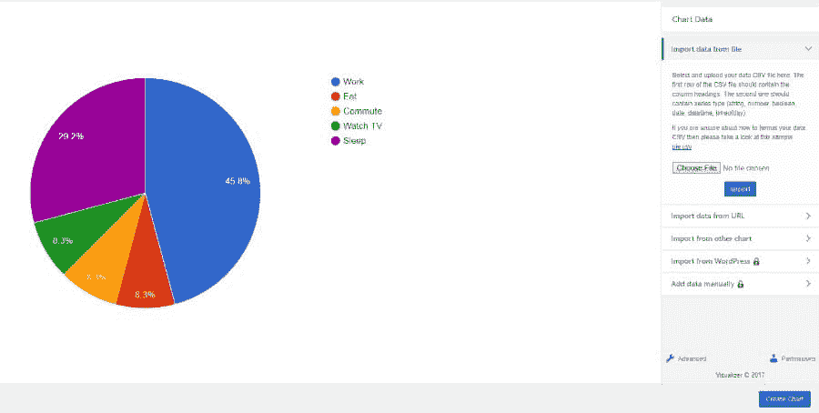
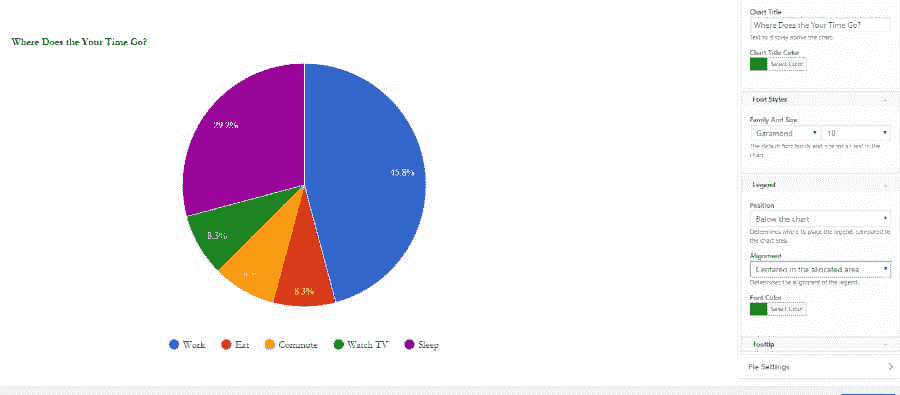
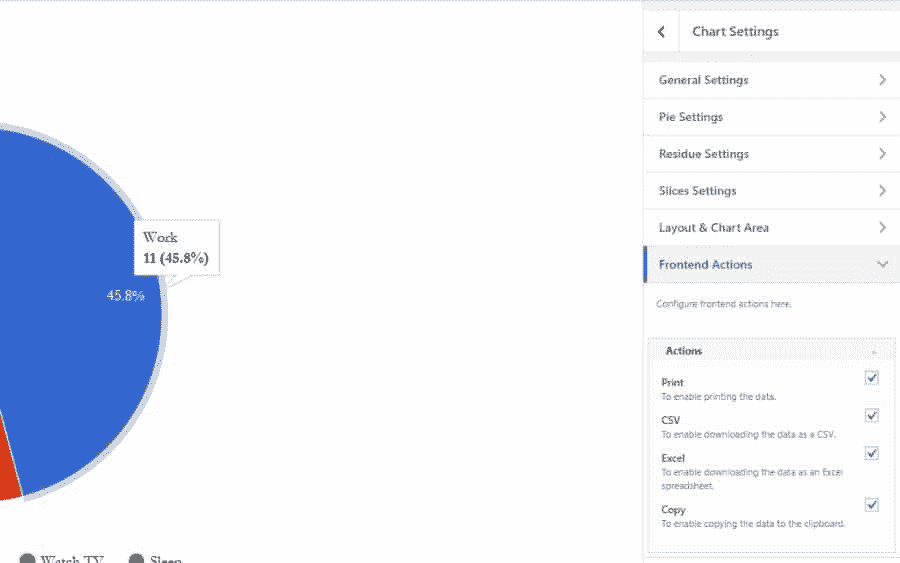
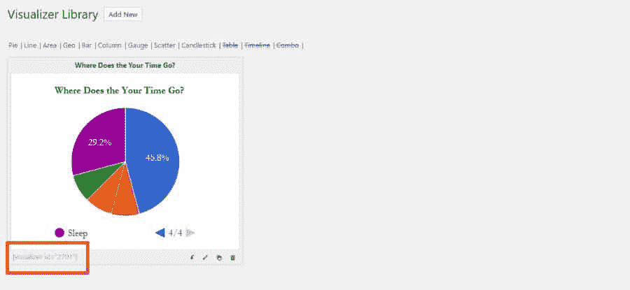
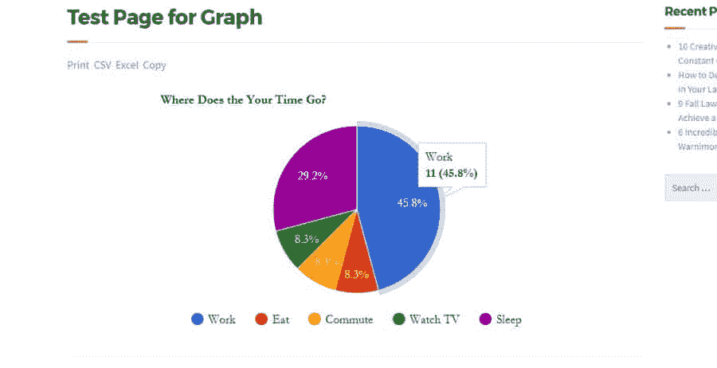

# 如何创建漂亮的 WordPress 图表和图形

> 原文：<https://kinsta.com/blog/wordpress-charts/>

无论你是一名收集当地选举数据的研究人员，还是一名与你的班级分享当地野生动物数量数据的教师，没有比图表更好的替代品了。这些可视化工具将枯燥、看似毫无价值的数据转化为易于消化的信息。

最棒的是，你不必担心处理复杂的图形构建软件，因为 WordPress 图形和图表可以用简单的插件制作。因此，我们在这里列出了哪些插件是最好的，我们也将探讨如何创建漂亮的 WordPress 图表和图形。

## 在 WordPress 中制作图表的优势

你可能想知道为什么你不能简单地用 Excel 制作一个图表，然后[截取一个截图](https://kinsta.com/blog/how-to-screenshot-on-mac/)放在你的博客文章中。有时这种方法很好，但有时这是一种巨大的浪费。你使用 Excel 或其他图表制作程序的主要原因是，当你需要一个高级功能，而 WordPress 插件无法提供该功能时。

否则，以下是用插件制作 WordPress 图表的好处:

1.  它将所有的图形构建整合到一个区域。如果你定期制作图表，这会节省你大量的时间。
2.  如果需要，它允许您返回并编辑图表。图片限制了快速修复，并要求您找到用于制作图表的旧文件。
3.  一些图表和图形具有交互功能，这是图片所不具备的。

总的来说，WordPress 图表插件简化了这个过程，但是它仍然给了你写博客文章所需要的大部分功能。

## 2019 年 5 个有效的 WordPress 图表和图形插件

在我们开始学习如何创建漂亮的 WordPress 图表之前，我们想浏览一下最好的插件来完成你所需要的。

> 需要在这里大声喊出来。Kinsta 太神奇了，我用它做我的个人网站。支持是迅速和杰出的，他们的服务器是 WordPress 最快的。
> 
> <footer class="wp-block-kinsta-client-quote__footer">
> 
> 
> 
> <cite class="wp-block-kinsta-client-quote__cite">Phillip Stemann</cite></footer>

[View plans](https://kinsta.com/plans/)

1.  [WP 数据表](#wpdatatables)
2.  [WordPress 图表和图形精简版](#wordpress-charts-and-graphs-lite)
3.  [WordPress 图表](#wordpress-charts)
4.  [交互式地图、图表、图形](#vc-add-on)
5.  [UberChart](#uberchart)

### 1。WP 数据表

wpDataTables 是一个非常健壮的 WordPress 插件！不要让名字欺骗了你。它能做的不仅仅是创建典型的表格。你也可以设计各种图表和图形。它是特别开发的，允许你输入大量的数据，并迅速转化成一个漂亮的图形显示给你的读者。

wpdatatables WordPress plugin

wpDataTables 是一个高级插件，一个许可证的起价为 44 美元。它目前在 CodeCanyon 上有超过 13，000 次销售，得分为 4.5 分，所以你可以放心，有很多人很高兴使用它。它的一些功能包括:

*   一切都是响应性的，这意味着它们可以针对每种设备完美扩展
*   wpDataTables 插件有三个不同的图表渲染引擎:Google Charts、Highcharts 和 Chart.js。这允许你渲染简单灵活的图表，有很多可定制的选项
*   表格和图表的实时自动刷新
*   在后台预览你的图表和表格

### 2。WordPress 图表和图形精简版

如果你想在你的 WordPress 博客上用漂亮的图表和图形显示数据和信息，看看这个优秀的插件就知道了。它在创建漂亮的交互式视觉效果方面做得很好，同时给你完全的自由来定制输出，使它符合你的确切要求:你可以改变颜色，[定制字体](https://kinsta.com/blog/how-to-change-font-in-wordpress/)，隐藏文本，添加文本——所有这些甚至在图表发布之后。在你的文章和页面中显示图表就像上传一个电子表格并添加插件自动生成的短代码到你的页面一样简单。

稍后，如果您决定要将图表类型从块图更改为饼图，只需点击编辑按钮并进行切换。是的，就这么简单。值得一提的是，它生成的图表和图形可以在各种尺寸的所有设备屏幕(台式机、平板电脑、手机)上工作，因为该插件是响应性的。

WordPress Charts and Graphs Lite

它包括九种图表类型、短代码支持和用 CSV 导入数据的选项。这个图表插件也被称为可视化插件，所以你可能会看到它被称为。有免费版和专业版。专业版的价格至少为 74 美元(一个站点许可)，它提供了从其他图表导入的工具。其他一些专业功能包括:

*   给予用户编辑能力的选项
*   私人图表创建
*   与您的在线文件自动同步
*   其他图表类型
*   您可以访问实时编辑器

Lite 插件仍然非常强大。以下是您可以制作的一些图表:

*   折线图
*   圆形分格统计图表
*   条形图
*   柱状图
*   对比图
*   地理图
*   表格图表
*   仪表图
*   蜡烛图
*   组合图
*   散点图
*   时间表图表

### 3。WordPress 图表

WordPress Charts 插件会是我的第三选择，许多用户喜欢它简洁的设计、动画和丰富多彩的选项。但是，也要注意，它已经很久没有更新了。

WordPress Charts plugin

WordPress 图表插件提供了六个独特的图表和图形模板，你可以调整和插入你自己的数据来显示在你的网站上。提供的图表包括:

*   线条
*   酒吧
*   馅饼
*   雷达
*   极区
*   甜甜圈类型

所有这些图表都是使用 HTML5 构建的。定制选项几乎是无穷无尽的，但是您必须了解一点编码、短代码，或者至少调整默认设置。我们如此喜欢这个 WordPress 图表插件的原因是它非常轻量级。你可以在你所有的博客文章中插入几十个图表，而不会有任何问题。这就是[使用 HTML5](https://kinsta.com/blog/html-vs-html5/) 的全部意义。您可以在不牺牲任何功能的情况下消除混乱。

### 4。交互式地图、图表、图形——用于 VC

如果您的网站上目前有 Visual Composer 插件，那么[交互式地图、图表、图形](https://codecanyon.net/item/interactive-maps-charts-graphs-vc-addons/10963830)插件可能适合您。它是 Visual Composer 的附加组件，所以没有理由以其他方式获得它。

Mega Main VC Add-on for charts

该插件售价 12 美元，然后提供交互式地图、图表和图形，所有这些都打包到 Visual Composer 界面中。该插件带有矢量图标、谷歌字体、无限的颜色和一系列用于构建和定制图表的其他功能。该附件有您的标准图表和图形，如饼图和折线图。还有一个独特的地图功能，用于突出显示特定区域，无论是本地地图还是世界地图。

### 5。Uber Chart-WordPress 图表插件

UberChart 是一个更加通用的高级图表插件，因为它不需要 Visual Composer 插件。该插件提供了 10 种内置图表类型，每个图表有大约 240 个可定制的选项。

## 注册订阅时事通讯

### 想知道我们是怎么让流量增长超过 1000%的吗？

加入 20，000 多名获得我们每周时事通讯和内部消息的人的行列吧！

[Subscribe Now](#newsletter)

UberChart WordPress plugin

只需点击一个按钮，您就可以导出和导入数据，响应式设计确保您的所有图表都显示在每台设备上。一些图表类型包括:

*   折线图
*   面积图
*   条形图
*   饼图
*   圆环图
*   气泡图

这个 WordPress 图表插件最令人印象深刻的部分是电子表格编辑器。它允许你从任何你想要的程序(比如 Excel)中复制数据，结合了 Excel 更高级的特性和图表插件的多功能性。

## 如何创建漂亮的 WordPress 图表和图形

我们最喜欢的图表插件之一是 WordPress Charts 和 Graphs Lite。因此，我们只打算用那个插件浏览这个教程。其他图表插件有类似的工具，但界面不同。因此，我建议对它们都进行测试，看看哪一个适合你，因为 wpDataTables 也非常健壮！

### 步骤 1:安装并激活 WordPress 图表插件

很简单。

### 步骤 2:转到可视化工具库并添加一个新图表

正如我们上面简要提到的，WordPress 图表和图形插件也被称为可视化工具。找到设置页面有点困难，但你所要做的就是转到媒体>可视化效果库。在开始使用你的 WordPress 图表之前，你不需要配置任何其他的设置。

Visualizer Library

登录 Visualizer 库后，您会看到一条消息，上面写着“未找到图表”这完全没问题，因为我们还没有制作任何图表。因此，您应该单击页面顶部的 Add New 按钮。

Add New Chart

这显示了你可以用插件制作的所有 WordPress 图表和图形。例如，它有饼图、折线图、面积图、地理图和条形图。免费版提供了九个 WordPress 图表。如果你付费购买专业版，你可以再得到三张图表。无论如何，我将为本教程选择一个饼图。

Struggling with downtime and WordPress problems? Kinsta is the hosting solution designed to save you time! [Check out our features](https://kinsta.com/features/)

图表和图形

### 步骤 3:将数据导入 WordPress 图表

该插件会自动插入数据，以便您的图表有所显示。但是，为了显示您自己的数据，您需要使用五种方法之一导入它。您可以:

*   从文件导入数据(可能是最常用的方法)
*   从 URL 导入数据
*   从另一个图表导入
*   从 WordPress 导入(仅在专业版中可用)
*   手动导入数据(仅在专业版中可用)

Import data for chart

对于这个例子，我从 CSV 文件导入数据。它起源于一个 Excel 文件，这是将数据放入 WordPress 图表的最常见的方法之一。当从一个文件导入数据时，点击选择文件按钮，在你的电脑上找到文件，然后点击 WordPress 仪表盘上的导入按钮。

这将在左侧向您展示数据的预览。好消息是，您可以随时返回并调整 CSV 格式，然后再试一次。下一步还有很多定制工具，让事情看起来更好一些。

### 步骤 4:定制你的 WordPress 图表

在所有的导入选项下面有一个写着“高级”的小链接。点击此处显示您的定制设置。有相当多的选项可供选择，所以我们不会在这里一一介绍。

但是我们可以从图表标题开始。我会输入类似“你的时间都去哪儿了？”因为我的图表概括了人们一天中花在特定任务上的时间百分比。我还可以改变标题的字体、字号、颜色和位置。

Customize WordPress chart

当您浏览设置时，您会注意到几个标签，如通用设置、切片设置、前端操作等。您很可能想要决定图例的位置，因为这是图表的重要部分。

除此之外，这完全取决于你要制作什么类型的图形，以及你需要显示什么元素。我将假设这是我的一群学生的 WordPress 图表。因此，我想让他们选择打印和下载数据和图表。

WordPress chart settings

为此，请转到前端操作选项卡。这将显示允许用户打印和复制数据的复选框。你也可以给他们下载 Excel 表格和 CSV 文件。一旦你完成自定义你的图表，确保你保存它。

### 第五步:将短代码复制到页面或帖子中

保存你的 WordPress 图表或图形后，导航回可视化库。您将看到您的图表列表，您可以根据图表类型进行过滤。因为我现在只有一张图表，我可以立刻把它看作是唯一的选择。为了在页面或文章上发布你的 WordPress 图表，你必须复制图表的简码并粘贴到你想要的页面或文章中。短代码位于图表预览下方(见下面的截图)。

WordPress chart shortcode

一旦你复制了简码，要么创建一个页面或帖子，要么转到一个已经发布的页面或帖子。找到您想要的图形位置，并粘贴短代码。

### 步骤 6:在前端查看 WordPress 图表

我建议在点击发布按钮之前预览你的图表。这样你就知道你的用户会得到什么，尤其是因为 WordPress 的图表和图形可能会相当挑剔。如果你看看下面的截图，你会看到一个网站前端我的测试图预览。打印和下载按钮是可见的，当你滚动时，WordPress 图表有一些漂亮的动画，颜色和标题元素看起来也不错。

View chart/graph

这些更改会在实时预览中立即发生，因此您可以看到它们如何影响图表，而不必保存并在新选项卡中查看页面。还有一个功能值得一提，相当牛逼。您不仅可以编辑图表的样式选项，还可以通过上传另一个文件、覆盖原始文件以及用新数据替换旧数据来编辑图表中的数据。

## 关于如何创建 WordPress 图表的问题？

所有的 WordPress 图表都有不同的功能。这些插件最酷的地方在于你拥有世界上所有的灵活性。因此，我鼓励你花时间测试你的图表，了解每个设置调整的作用。然后，你最终会成为图表大师，人们会问你如何做到这一点。如果你对如何创建 WordPress 图表有任何问题或想法，请在下面的评论中留言。

* * *

让你所有的[应用程序](https://kinsta.com/application-hosting/)、[数据库](https://kinsta.com/database-hosting/)和 [WordPress 网站](https://kinsta.com/wordpress-hosting/)在线并在一个屋檐下。我们功能丰富的高性能云平台包括:

*   在 MyKinsta 仪表盘中轻松设置和管理
*   24/7 专家支持
*   最好的谷歌云平台硬件和网络，由 Kubernetes 提供最大的可扩展性
*   面向速度和安全性的企业级 Cloudflare 集成
*   全球受众覆盖全球多达 35 个数据中心和 275 多个 pop

在第一个月使用托管的[应用程序或托管](https://kinsta.com/application-hosting/)的[数据库，您可以享受 20 美元的优惠，亲自测试一下。探索我们的](https://kinsta.com/database-hosting/)[计划](https://kinsta.com/plans/)或[与销售人员交谈](https://kinsta.com/contact-us/)以找到最适合您的方式。