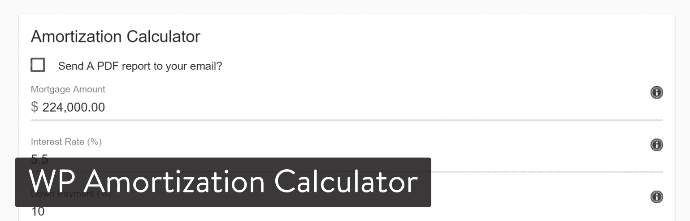
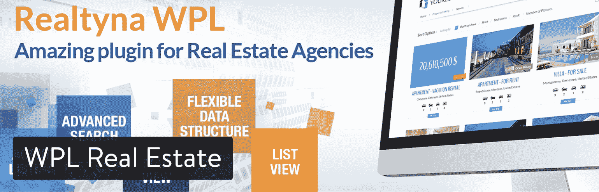
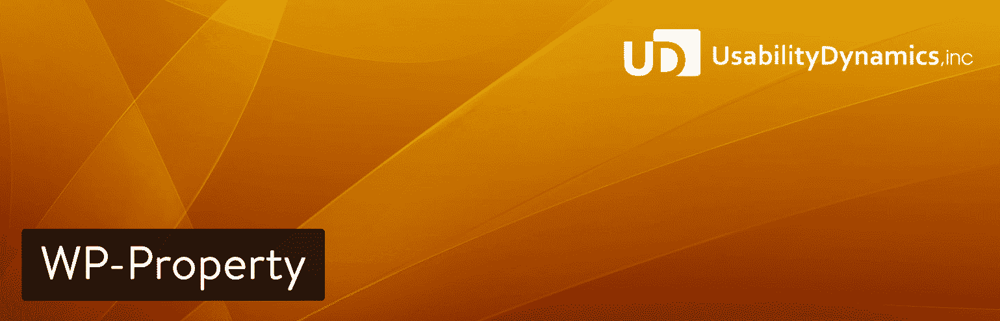
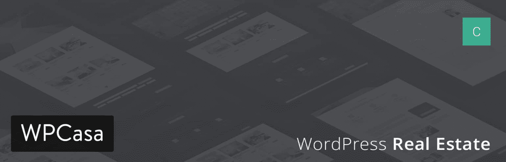
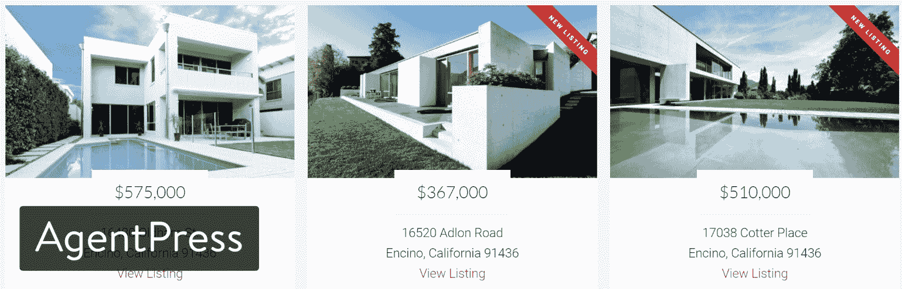

# 8 个最佳 WordPress 房地产插件——回顾和比较

> 原文：<https://kinsta.com/blog/wordpress-real-estate-plugins/>

有兴趣看到更多的“出售”迹象与您的房地产业务？看看你的网站。如果你没有，那是你的第一个问题。如果是的话，问问自己它是否干净、现代、易于导航。

房地产行业的一个大问题是，代理人在网站上被特许人或附属机构出售。这其中包括像 Remax，Baird 和 Warner 这样的特许经销商。许多代理商与这样的公司合作，他们获得了各种难以置信的好处。然而不幸的是，这些网站通常一点都不好。

但是，你仍然可以和你的房地产公司建立联系，制作你自己的 WordPress 网站。这样，你可以完全控制设计和功能，并且你可以通过使用最好的 WordPress 房地产插件来提高你的销售额。插件，或者你安装的用来添加功能的扩展，包括非常高级的房产列表插件，为你的网站添加抵押计算器的选项，以及与 Zillow 的集成。

如果你是从零开始，我建议你找一个房地产 WordPress 主题。但是旧的 WordPress 网站可以在一个可靠的 WordPress 房地产插件的帮助下得到改进。

## 在 WordPress 上建立一个有效的房地产网站所需的部分

由于许多阅读这篇文章的人都是 WordPress 的新手，它有助于解释创建理想的房地产网站所需要的元素。我们将在下面列出最好的 WordPress 房地产插件，但是你只能为你的网站选择一两个。

你决定的其他插件不会和房地产有直接关系。相反，他们会保护你的网站，让它更快，允许社交分享，并给你营销的选择。因为你不应该安装太多的插件，所以坚持使用有信誉的插件是很重要的。

> Kinsta 把我宠坏了，所以我现在要求每个供应商都提供这样的服务。我们还试图通过我们的 SaaS 工具支持达到这一水平。
> 
> <footer class="wp-block-kinsta-client-quote__footer">
> 
> 
> 
> <cite class="wp-block-kinsta-client-quote__cite">Suganthan Mohanadasan from @Suganthanmn</cite></footer>

[View plans](https://kinsta.com/plans/)

对于一个全新的房地产网站，以下是你如何拼凑它:

*   找到并安装一个 WordPress 房地产主题。
*   为营销和搜索引擎优化安装基本的 WordPress 插件。
*   安装一个 WordPress real estate 插件(如下所列)来改进主题或者添加一个缺失的功能。

一旦你找到了一个主题，是时候确保你的网站有基本的东西了。因此，每个房地产代理商、公司或开发商都应该推出一个带有以下插件的新网站:

*   Yoast SEO-一个 SEO 插件，用于提高你的谷歌排名，并根据特定的关键词优化每个页面和帖子。
*   [轻松的社交分享](https://codecanyon.net/item/easy-social-share-buttons-for-wordpress/6394476)–这是你的营销秘诀。它提供了电子邮件营销工具、列表生成器、社交媒体分享按钮等等。事实上，我们在我们的 Kinsta 网站上使用了这个。请务必查看我们的深度帖子，了解更多[社交媒体插件](https://kinsta.com/blog/wordpress-social-media-plugins/)。
*   akis met–这个重要的插件识别并归档垃圾评论和信息。因此，你的网站看起来很专业，你不必自己去筛选垃圾邮件。
*   [一体式 WP 安全和防火墙](https://wordpress.org/plugins/all-in-one-wp-security-and-firewall/)–阻止从暴力攻击到恶意文件入侵的一切行为。

对于上面的每一个建议，都有几十个备选方案供你使用。这里有一些列表可以给你一些提示和更好的插件选择:

*   [最佳营销插件](https://kinsta.com/learn/content-marketing/)
*   [最佳安全插件](https://kinsta.com/blog/wordpress-security-plugins/)
*   [WordPress SEO 提示](https://kinsta.com/blog/wordpress-seo/)

你还会很高兴地得知 [Kinsta 为你处理缓存](https://kinsta.com/blog/wordpress-cache/)，所以你不需要插件，但你仍然可以保持你的网站的性能。
T3】

## 2022 年最佳 WordPress 房地产插件

现在是时候转向房地产插件了。这些只是为了出售、购买和出租房屋和公寓。我们已经编辑了一个我们推荐的快速列表(排名不分先后)，但是如果你想要更完整、更深入的评论，请继续。

*   [Estatik](#estatik)
*   [房地产专业版——WordPress 插件](#real-estate-pro)
*   [打动列表](#impress-listings)
*   [WP 摊销计算器](#wp-amortization-calculator)
*   [WPL 房地产](#wpl-real-estate)
*   [简易房产列表](#easy-property-listings)
*   [基本房地产](#essential-real-estate)
*   [WP-属性](#wp-property)

### 1。Estatik

Estatik 绝对是所有房地产插件中的王者，因为它在一个插件中提供了广泛的功能。是的，您可以获得列表和多语言支持。是的，您会收到一个带有照片库的响应布局。是的，你可以创建一个幻灯片或与社交媒体整合。

Estatik WordPress plugin

Estatik PRo 版本售价 89 美元，它提供了一整套工具，如可定制的标签、前端订阅管理和高级搜索模块。

#### 为什么这个 WordPress 房地产插件很棒

*   即使是付费版也是值得的。你只需要支付一次性费用，然后你就可以把任何一个 WordPress 网站变成一个成熟的房地产中心。
*   它包括一个伟大的地图视图，消除了任何理由获得地图插件。
*   插件中还打包了一个抵押计算器。
*   该插件与 PayPal 集成，为想要持续添加列表的客户接受订阅。
*   它是多语言的，可以联系更多的客户。
*   有一个幻灯片小工具可以展示你所有的家。
*   支持真的很好。
*   高级版本集成了大联盟。

#### 这个 WordPress 房地产插件的缺点

*   Estatik 插件没有太多不好的地方，但是一些用户遇到了 404 错误和列表中的图片问题，但是支持团队似乎很快解决了这些问题。

### 2。房地产专业版 WordPress 插件

出于几个原因，强烈推荐使用[房地产专业版](https://codecanyon.net/item/real-estate-pro-wordpress-plugin/13245602)插件。首先，它是一个罕见的插件，设置、页面和模板都是在安装后配置的。你真的不需要碰任何东西就能让它看起来很漂亮。

Real Estate Pro WordPress plugin

其次，该插件允许一个漂亮的图库干净的列表模块。客户可以通过 PayPal 或 Stripe 在您的网站上购物。此外，它还能充分响应客户在手机和平板电脑上浏览房源的需求。

#### 为什么这个 WordPress 房地产插件很棒

*   Real Estate Pro 兼容并集成了 [MailChimp](https://kinsta.com/blog/how-to-use-mailchimp/) 。因此，所有新客户的电子邮件都存储在您的数据库中。
*   您可以将 [Visual Composer](https://kinsta.com/blog/wordpress-page-builders/) 与插件一起使用。
*   它允许您配置订阅。
*   收费的事情，如添加一个清单，声称一个清单，出售一个 VIP 徽章，甚至访问该网站。
*   该插件翻译成 13 种语言。
*   来到你网站的用户可以出价获得最高的搜索排名。本质上，你可以用这个插件运行一个列表网站，甚至不需要成为一个房地产经纪人。

#### 这个 WordPress 房地产插件的缺点

*   虽然它有翻译，但是如何翻译还不是很清楚。
*   缺少帮助文件。
*   它不能和大联盟整合。

### 3。打动列表

IMPress 列表是完全免费的，但是你可以选择购买一些列表模板。该插件的基础包括一个完整的列表管理系统，一个 MLS 集成和所有列表的状态标签。

IMPress Listings WordPress plugin

在制作清单时，IMPress 有相当多的字段供您填写。其中一些包括价格，地址，楼层，车库，游泳池，地图和虚拟旅游。

#### 为什么这个 WordPress 房地产插件很棒

*   它和美国大联盟有联系。
*   您可以将您的 AgentPress 列表迁移到 IMPress。
*   该插件带有一个[特色列表小部件](https://kinsta.com/blog/wordpress-widgets/)。
*   搜索列表模块有可定制的下拉列表，比如位置、房产类型、卧室和浴室。
*   地图会自动插入，因此您不必嵌入它们。

#### 这个 WordPress 房地产插件的缺点

*   默认的属性状态标签只能通过修改一些代码来改变。
*   创建单一列表模板要比想象中困难得多。
*   看起来支持可以更好。

### 4。WP 摊销计算器

如果你的主题中还没有这些计算器工具中的一个(或者像 Estatik 一样的另一个插件)，WP 分期偿还计算器插件有它的用处。现在，WP 摊销计算器插件售价 20 美元，所以你不会花很多钱给你的客户一个他们绝对需要的工具。

WP Amortization Calculator WordPress plugin

该插件具有高度可定制的品牌设置，适合您的网站。它反应灵敏，当人们使用它时，它有一个线索捕获模块。您还可以共享 PDF 报告，为您的客户提供额外的价值。

#### 为什么这个 WordPress 房地产插件很棒

*   它不仅仅是一个计算器，因为您可以访问一个简单的线索捕获模块。
*   您可以将 Visual Composer 集成到拖放界面中。
*   为您的客户创建 PDF，并在 PDF 中包含您的徽标和公司信息。
*   查看每个客户感兴趣的贷款类型。

#### 这个 WordPress 房地产插件的缺点

*   更高级的样式需要 CSS 知识。
*   你真的不能禁用任何已经编程的功能。
*   许多 WordPress 房地产插件和主题已经有计算器。所以，这是更多的人想要添加到他们目前的网站。

### 5。WPL 房地产

使用 WPL Real Estate 插件，你有机会列出代理，分享你的房源地图视图，并为你的客户提供高级搜索。我如此喜欢这一个的主要原因是因为它迎合有少数代理的代理。你可以发布代理信息和分享照片，让买家或卖家更多地了解他们将与谁合作。

## 注册订阅时事通讯

### 想知道我们是怎么让流量增长超过 1000%的吗？

加入 20，000 多名获得我们每周时事通讯和内部消息的人的行列吧！

[Subscribe Now](#newsletter)

WPL Real Estate WordPress plugin

WPL 插件有一些原生的和兼容的主题，但是它应该和任何 WordPress 主题都能很好的工作。有一个功能不错的免费插件，但真正的功能来自于 WPL Pro 版本的形式。不幸的是，你必须要求一个免费的报价，以了解它将花费你多少。

#### 为什么这个 WordPress 房地产插件很棒

*   该插件很容易与 MLS 连接。
*   客户支持坚如磐石。
*   不仅仅是房产列表。例如，你可以得到代理列表和一个很棒的搜索功能。

#### 这个 WordPress 房地产插件的缺点

*   免费版不包括多语言功能。
*   事实上，免费版中省略了相当多的定制选项。例如，如果你没有高级版本，你不能隐藏地址，接受多种货币或调整“更多细节”部分。

### 6。简易房产列表

简易房产列表(Easy Property Listings)更像是一种免费增值的商业模式，常规插件完全免费，但 T2(new York)有几个扩展(extensions)可供你购买。例如，你可以购买 Comparables 扩展，花费大约 47 美元。

Easy Property Listings WordPress plugin

统计数据非常有趣，因为你可以看到在某个时间段内有多少列表被发布。你也可以查看你已经卖出了多少。还提供了列表小部件。因此，您可以在博客提要旁边的边栏中显示一些房产列表。

#### 为什么这个 WordPress 房地产插件很棒

*   清单在定制方面不需要太多。这是一个更简单的插件来显示你的物品，并看到它们在你的网站上显示得很漂亮。
*   它集成了 WordPress 框架，如 Genesis、Headway 和 iThemes Builder。
*   插件附带了数百个主题模板。
*   客户支持很强。
*   该插件为最终的列表定制界面提供了超过 150 个定制字段。
*   API 文档可以给更有经验的开发人员更多的自由。

#### 这个 WordPress 房地产插件的缺点

*   以下付费扩展肯定应该是常规免费插件的一部分(但它们不是):[滑块](https://kinsta.com/blog/wordpress-slider/)，列表模板和高级映射。

### 7 .。基本房地产

[Essential Real Estate](https://wordpress.org/plugins/essential-real-estate/) 插件在其免费版本中为您提供了许多高级功能。您可以轻松定制和覆盖布局和功能。它支持全球支付、单一列表属性、单一代理等等。

Struggling with downtime and WordPress problems? Kinsta is the hosting solution designed to save you time! [Check out our features](https://kinsta.com/features/)

Essential Real Estate WordPress plugin

这个插件基本上拥有你启动一个房地产网站所需要的一切。它在存储库上也有令人印象深刻的 5 星评级！它有定制的文章类型、属性、代理、包、用户包、发票甚至事务日志的分类特性。你可以添加新的列表，编辑它们，等等。

#### 为什么这个 WordPress 房地产插件很棒

*   轻松添加/修改列表的所有属性(如城市、州、状态、邻居、价格等)。)
*   这个插件包含了大量的特性！
*   您可以通过前端和后端提交属性。
*   密切关注 SEO，允许你甚至为自定义文章类型设置 slugs。

#### 这个 WordPress 房地产插件的缺点

*   由于一切，插件包括它可以有点势不可挡。
*   较长的学习曲线。

### 8。WP-属性

WP-Property WordPress 插件已经存在很长时间了，是知识库中下载量最大的房地产插件之一。它允许您创建和管理高度可定制的房地产，物业管理，并完全自定义上市展示网站。

WP-Property WordPress plugin

这个插件是为房地产开发的，但是它也可以用于任何类型的实体。也许你在卖二手车？它可以很容易地展示这一点。

#### 为什么这个 WordPress 房地产插件很棒

*   可轻松过滤任何类型的自定义属性。
*   搜索引擎友好的网址。
*   [与谷歌地图的集成](https://kinsta.com/blog/wordpress-google-maps/) API 在幕后验证地址。
*   与内置媒体库集成，因此您不必使用第三方[图库插件](https://kinsta.com/blog/wordpress-photo-gallery-plugins/)
*   有超过 12 种语言版本

#### 这个 WordPress 房地产插件的缺点

*   较长的学习曲线。
*   在过去，这个插件有相当多的负面评论，但看起来开发者正在改善他们的支持。

## WordPress 房地产主题(奖金)

尽管这篇文章是关于插件的，但是我们不能遗漏一些你应该看看的高质量的房地产主题。

### 1.WPCasa

WPCasa 可能是最广为人知的 WordPress 主题框架，它是为了满足房地产中介的各种需求而构建的。它是一个灵活的、完全响应的框架，提供了无数的定制选项。

WPCasa WordPress theme

编辑屏幕和主题设置非常容易使用拖放工具来处理。有许多布局选项可用，背景和页眉的组件也是可定制的，但如果这还不够，你可以通过使用 WPCasa 专业设计的[子主题](https://kinsta.com/blog/wordpress-child-theme/)之一来创建你真正定制的网站，或者制作你自己的网站。

所有的 WPCasa 主题和子主题都有多种语言版本，可以很容易地在 WordPress 管理中添加和编辑。三种语言提供持续支持，帮助用户充分利用购买的主题。购买包括未来在无限制站点上的更新和安装。

锦上添花的是，购买主题前不能只看前端试玩，可以免费创建 7 天的个人测试站点，体验主题的所有优缺点。

### 2.AgentPress

AgentPress 也是一个功能齐全的 realty WordPress 主题，对于房地产专业人士来说，这确实是一笔大买卖。

AgentPress WordPress theme

购买包括使用 AgentPress Pro 和 Genesis 框架。响应式设计、无限支持和更新当然是提供的。同样，有几个布局选项、自定义背景、标题和菜单可用。AgentPress 的特别之处在于其基于 [dsIDXpress 插件](http://www.dsidxpress.com/)和[dssearchhagent](http://www.diversesolutions.com/product/ds-search-agent/tour/introduction)组合的智能列表系统。这种混合提供了可索引的 MLS 列表系统，这也有利于搜索引擎优化的目的。

## 你的网站有最好的 WordPress 房地产插件吗？

正如你可能已经注意到的，你并不真的需要所有这些 WordPress 房地产插件。当然，你可能会使用 Estatik 来列出你的财产，WP 摊销计算器来显示额外的融资信息，但没有必要使用两个房屋列表插件。因此，我们建议阅读这些评论，然后测试那些听起来有趣的评论。

然后你可以为安全、SEO、[社交媒体](https://kinsta.com/blog/wordpress-social-media-plugins/)等安装必要的 WordPress 插件(我们在本文开头提到的标准插件)。如果你对最好的 WordPress 房地产插件有任何问题，或者如果你想谈谈你使用任何插件的经验，请在下面的评论区告诉我们。

* * *

让你所有的[应用程序](https://kinsta.com/application-hosting/)、[数据库](https://kinsta.com/database-hosting/)和 [WordPress 网站](https://kinsta.com/wordpress-hosting/)在线并在一个屋檐下。我们功能丰富的高性能云平台包括:

*   在 MyKinsta 仪表盘中轻松设置和管理
*   24/7 专家支持
*   最好的谷歌云平台硬件和网络，由 Kubernetes 提供最大的可扩展性
*   面向速度和安全性的企业级 Cloudflare 集成
*   全球受众覆盖全球多达 35 个数据中心和 275 多个 pop

在第一个月使用托管的[应用程序或托管](https://kinsta.com/application-hosting/)的[数据库，您可以享受 20 美元的优惠，亲自测试一下。探索我们的](https://kinsta.com/database-hosting/)[计划](https://kinsta.com/plans/)或[与销售人员交谈](https://kinsta.com/contact-us/)以找到最适合您的方式。