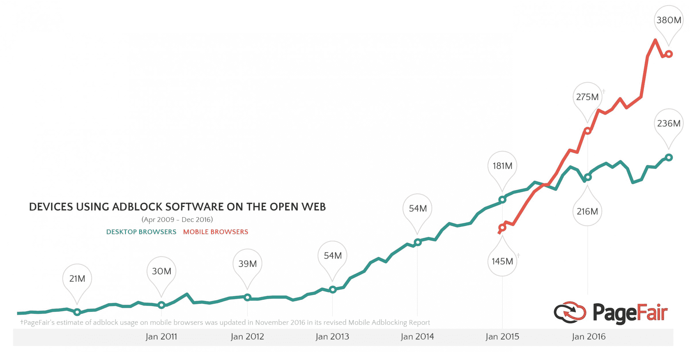
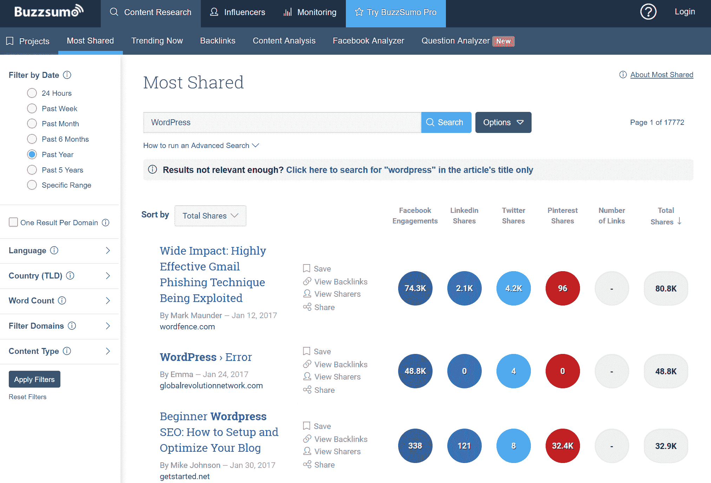
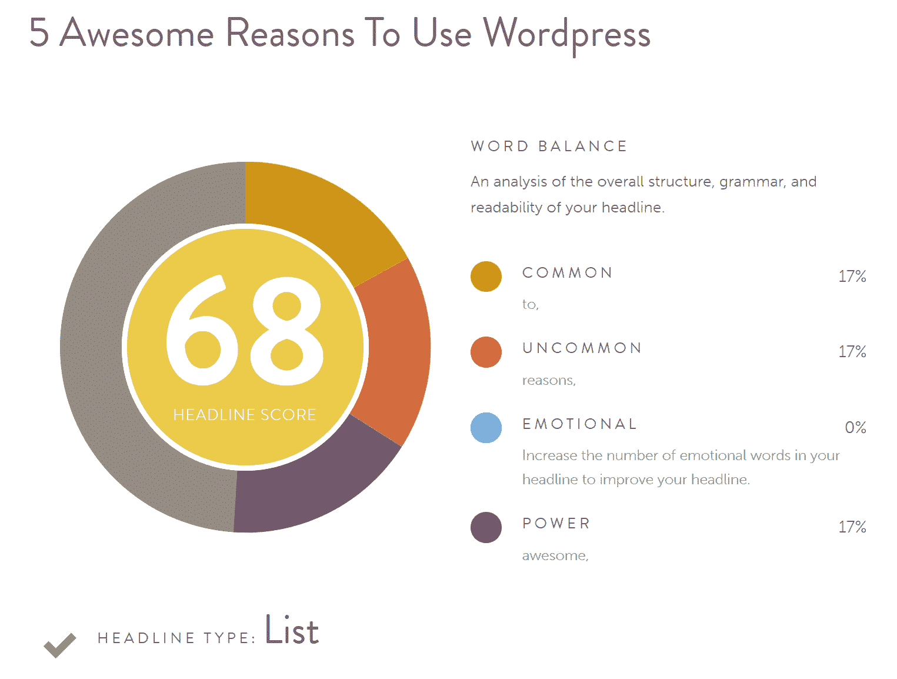
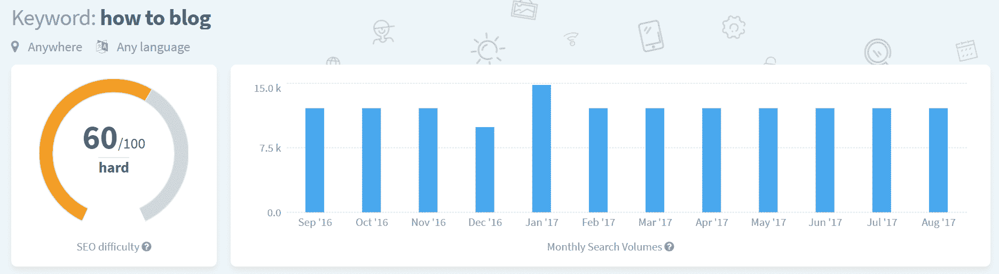
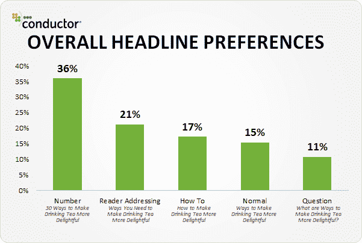

# 如何创建持久的常青内容(17 个技巧和诀窍)

> 原文：<https://kinsta.com/blog/evergreen-content/>

当你想营销一个企业、一个网站或一个网上商店时，内容营销是最有效的策略之一。然而，并不是所有类型的内容对你的读者都是有价值的，最重要的是，你的一些有价值的文章可能在某个时间点因过时和不相关而老死。

你的最佳解决方案是什么？嗯，**你需要常青内容**。你需要的文章将承载同样的价值久而久之，在十年内以同样的速度甚至比现在更高的速度吸引有机流量。在进入我们的主要话题之前，我们先来谈谈内容营销。

## 内容营销为什么有效？

即使在互联网出现之前，书面或视觉内容一直是进行营销的好方法。我们都记得这些年来在电视上看到的一些很棒的广告，我们保留了一些作为杂志免费插页的信息手册。互联网方便了我们获取信息，并使数百万用户可以获得这些信息，但总的来说，它并没有改变营销人员已经意识到的一些事实。

让我们来看看为什么[内容是一个强大的营销工具](https://kinsta.com/learn/content-marketing/)，当涉及到网络世界以及为什么它永远不会被其他策略所取代:

### 1.人们总是在寻找信息，而且会一直这样做

为了说明这一点，我将使用两个理论上的例子。停下来想一想。当你有一个问题而你不知道答案时，你做的第一件事是什么？好吧，你问。不会总是有专家和专业人士在附近得到快速的答案，但幸运的是，你可以使用你的电脑或移动设备来搜索你的答案。这就是内容出现的地方。

另一方面，想想你每天或每周阅读的所有网站和博客。你不知道它们的存在，但是一旦你在一个网页上读到了有价值的东西，你就会返回那里去寻找更多。也许，你甚至在网站上加了书签，或者订阅了他们的时事通讯。为什么？答案很简单:你不可能什么都知道。**好的信息总是有价值的**，无论是理论上的、实用的还是娱乐性的。

### 2.每天都有更多的人使用广告拦截器

截至 2016 年底，全球有超过[6 . 15 亿台装有广告拦截器的设备](http://www.businessinsider.com/pagefair-2017-ad-blocking-report-2017-1),而且这个数字还在不断增长。iOS 有一个内置的[广告拦截器](https://kinsta.com/blog/ad-blockers/)，但 Android 用户也可以使用第三方应用。它们是免费的，通过阅读恼人的广告，它们有助于更好地使用设备。谷歌甚至[正在测试 Chrome 的内置广告拦截器](https://www.theverge.com/2017/8/1/16074742/google-chrome-ad-blocker-canary-build-test)。

> 需要在这里大声喊出来。Kinsta 太神奇了，我用它做我的个人网站。支持是迅速和杰出的，他们的服务器是 WordPress 最快的。
> 
> <footer class="wp-block-kinsta-client-quote__footer">
> 
> 
> 
> <cite class="wp-block-kinsta-client-quote__cite">Phillip Stemann</cite></footer>

[View plans](https://kinsta.com/plans/)

Devices using ad blockers (Img src: Business Insider Inc)

另一方面，有价值的内容不能被屏蔽。让我们说，如果内容是有价值的和信息丰富的，用户甚至不会想到阻止它，而是与它互动，并返回网站获取更多信息。

### 3.它比其他营销策略成本更低，但投资回报率更高

与在其他网站、电视和广播上购买广告相比，雇佣内容作者的成本要低得多。由于前面两段已经说明的事实，投资的回报也更高。如果你在经营自己的网站，如果你学会了如何自己写文章，你的成本会降低更多。

此外，根据千年发展目标广告公司所做的一项研究，超过 70%的 T2 互联网用户希望通过内容而不是传统广告来了解产品。

### 谁能从内容营销中获益？

总之，各位。没有限制。不管你是一个有抱负的企业家、艺术家还是一个博客作者。你的小众、行业、职业取向都没关系。无论你是谁，无论你在哪里，你都需要有效的营销来发展你的品牌，继续发展你的业务或你的个人影响力。有价值的内容是你登顶的捷径。

### 你能把内容营销策略和其他类型的营销结合起来吗？

是的，你可以。事实上，除了内容发布之外，大多数营销人员还在他们的策略中加入了几种营销类型，包括付费广告、社交媒体营销、直接营销和电子邮件营销。

## 为你的网站或博客创建常青树内容的技巧

随着时间的推移，并非每种类型的内容都具有相同的价值。因此，你需要常青的内容，以确保你的营销策略明天会像今天一样有效。什么是常青内容？高质量的内容被开发和制作成对 SEO 友好的[，同时又非常相关和有质量的](https://kinsta.com/blog/content-length/)。这种内容鼓励更好的排名、快乐的引导和更多的社会参与。简而言之——**它是永恒的内容**。

[Evergreen content encourages better rankings and social engagement. In short – it's timeless content. 🌲Click to Tweet](https://twitter.com/intent/tweet?url=https%3A%2F%2Fkinsta.com%2Fblog%2Fevergreen-content%2F&via=kinsta&text=Evergreen+content+encourages+better+rankings+and+social+engagement.+In+short+%E2%80%93+it%27s+timeless+content.+%F0%9F%8C%B2&hashtags=contentmarketing%2Cblogging)

这里有一些提示可以帮助你创建你的内容。

### 1.选择你的主题，并确保它们符合绿色内容的标准

假设你有一个销售沙发的电子商务网站。这是一个利润丰厚的行业，但是你正在努力提高你的品牌知名度，因此，你决定在网站上附加一个博客。你可以写一些你正在销售的家具的具体设计和型号，写一些对你的产品的评论等等。这些帖子对你的客户来说是有价值的，但它们只在现在有价值，或者只要这些产品是你的产品的一部分。

一旦你卖掉它们，并通过购买新沙发来更新你的报价，那些博客帖子就过时了。

当然，你仍然可以对你的产品写评论，甚至鼓励你的客户也评论一下他们曾经买过的东西。但是，如果你需要常青的内容，你也应该**关注你的读者的需求**。例如，一篇基于你业务的常青树文章的标题应该是“如何去除天鹅绒沙发上的油渍”。

此外，如果你选择可引用的话题，也会有所帮助。这意味着无论你写的是什么，在你的文章中要包含原创的观点，甚至是原创的统计数据。以下是一些通过检查竞争对手的网站和/或博客来选择话题的额外技巧:

*   找出围绕问题主题的热门文章。
*   检查常见的亮点和标题。
*   检查网络上现有内容的形式(例如，长或短的形式)。
*   习惯于已经被充分谈论的东西。
*   找出热门话题中写得不好的内容。

一旦你完成了这一步，它会把你放在一个有利的位置，因为你现在拥有足够的信息来识别那些没有在网上讨论过或者可以改进的话题和主题。

### 2.进行研究

如果你的目标是写出常青的有价值的内容，那么你必须对你想写的每一个新主题进行研究。也许你是你的行业中最有声望的声音之一。你对自己的技能和能力有信心，你知道你的帖子写得很好，内容丰富。

然而，你不可能知道你所处领域的一切。此外，一篇经过充分研究、有大量引用和参考的文章会被认为比个人观点更值得信赖。如果你有资源和必要的时间，试着进行原创研究。这将有助于你的文章脱颖而出，同时，它将吸引引用，因此，反向链接到你的帖子。

请注意，这些研究中的一些将在几年后变得过时。例如，您可以对农村地区的 4G 连接普及率进行市场调查。然而，在五年内，也许每个人都将拥有 5G 连接，因此你的研究将不再有资格成为常年研究，即使其他一切都是如此。有一个简单的解决方案可以避免这些问题。事实上，你不能避免它们，但要及时纠正它们。你所要做的就是第二年回到你的文章，更新你的统计数据。

### 3.选择合适且有代表性的视觉效果

在文章中选择恰当且最具代表性的[视觉效果并不容易，但也不容忽视。**我们生活在一个视觉世界**，基于视觉的社交媒体已经盛行，Instagram、脸书、YouTube 和](https://robertkatai.com/visuals-in-a-blog-post/) [Pinterest](https://kinsta.com/blog/pinterest-marketing/) 是最受欢迎的平台。

它们都是视觉化的，证明了这种类型的内容对今天的互联网用户来说比文本更有价值。

如果你打算写教程，获得你的视觉效果会容易得多。你将不得不在整个过程中拍照，截图等等。然而，有些教程可能只是基于文本，而其他类型的文章则需要视觉表现。在这里，您有几个选择:

*   你可以订阅一个库存摄影服务，从那里购买你的图片。或者使用像[图标查找器](https://www.iconfinder.com/)这样的高级图标库。
*   您可以搜索[可用的开放图像库](https://kinsta.com/blog/free-images-for-wordpress/)，下载免费的图像，如果您选择的图像不符合您需要的质量要求，您可以对其进行调整。
*   如果你有技术或预算聘请平面设计师/艺术家，创建自己的设计、图形和表现。

一篇博文需要插入多少张图片？这个问题的答案取决于你想向你的听众传达什么。如果您正在编写教程，您可能需要为您描述的每个步骤提供单独的图像。另一方面，如果你写一篇简单的博文，你至少需要一个相关的专业形象。

## 注册订阅时事通讯

### 想知道我们是怎么让流量增长超过 1000%的吗？

加入 20，000 多名获得我们每周时事通讯和内部消息的人的行列吧！

[Subscribe Now](#newsletter)

### 4.创建与你的品牌相一致的内容

你的内容也要**符合你的品牌声音**。请注意这条建议，因为常青树内容，如果创作得当，也将有助于提高你的品牌知名度，让互联网用户更容易看到它。它可能会吸引更多的顾客、粉丝或读者，但同时，它也会帮助你的受众记住你的品牌，并将你的名字与你提供的优秀内容联系起来。

因此，如果你是卖船的，比如说，如果你写的是如何修理机械玩具的绿色内容，那就没什么好处了。然而，你可能会受益于与航海、钓鱼、海上旅行、海上生活等相关的文章。写下你的定位，专注于发展你的品牌，而不仅仅是你的观众。最后，这是你的主要目标。

### 5.如果有必要，偶尔更新你的内容

我已经在上面提到了这样一个事实，你的一些常青文章可能会包含一些统计数据或研究，这些数据或研究在将来可能会变得过时或不相关。偶尔检查一下你的文章，看看它们是否需要更新。尽快运行这些更新，以保持它们的实用性和长期价值。

## 生成和分析 Evergreen 内容的工具

网上有很多工具可以为你提供不同的方法来分析、研究和改进你的 evergreen 内容。

### 内容和社交媒体表现

以下这些工具可以帮助您分析内容表现，并识别可能受社会欢迎并鼓励参与的文章。

*   [冰帽](http://buzzsumo.com/)
*   [AHRS](https://ahrefs.com)
*   [忍者外联](https://ninjaoutreach.com/)
*   癫痫发作

Finding popular content

### 生成和分析标题

在这篇文章中，我们把[最好的标题分析工具](https://kinsta.com/blog/headline-analyzer/)放在一起。这些可以帮助你将文章创意发展成朗朗上口的常青树标题。

CoSchedule Headline Analyzer

### 谷歌趋势和搜索量

如果某个东西的搜索量很大，或者它多年来一直呈上升趋势，那么它很有可能成为你下一篇常青树文章的好主题。诀窍是不要选择一个主题，也许可能太竞争 SEO 明智的。但这就是为什么像下面这样的工具存在，以帮助您做出更数据驱动的决策。

Struggling with downtime and WordPress problems? Kinsta is the hosting solution designed to save you time! [Check out our features](https://kinsta.com/features/)

*   [AHRS](https://ahrefs.com)
*   kwfinder
*   塞姆拉什
*   [谷歌趋势](https://trends.google.com/trends/)

Keyword volume history in KWFinder

## 常青树内容的类型

有什么可以作为常青内容发布的？什么样的帖子和视觉资料属于这一类？在本文的最后部分，我将尝试列出一些最重要的常青内容类别。

### 1.教程和“如何做”指南

它们是常年内容的主要类型。然而，与技术相关的教程文章可能需要不时更新。

示例:您正在编写一个教程，介绍如何在 Photoshop 中从一个人的肖像图像中剪切出背景。你的文章对你的读者来说会有几个月甚至几年的价值。但是，软件的重大更新，包括布局、工具或菜单的重大变化，会使你的教程不准确。它将需要更新。

### 2.解决问题

作为一家网上企业，你销售的产品或服务能带来好处和/或解决问题。也就是说，如果你能发现人们正在经历的问题，并利用这些问题来精心制作出优秀的、新鲜的、常青的解决问题的内容，你就能把这些读者变成潜在客户。访问以下网站并[搜索特定关键词或问题](https://kinsta.com/blog/keyword-research/):

*   [Quora](https://www.quora.com/)
*   [堆栈溢出](https://stackoverflow.com/)
*   [Answers.com](http://www.answers.com/)
*   [Ask.com](http://www.ask.com/)
*   [雅虎回答](https://answers.yahoo.com/)

一旦你发现了需要正确回答的问题——围绕这些问题写出精彩的内容，并在答案中提供你的文章的链接。你解决了一个问题，同时建立了一个反向链接。毫无疑问，通过问答网站寻找可行的内容创意绝对是一种有效的方式。看看这个[Q&A 网站](http://en.wikipedia.org/wiki/List_of_question-and-answer_websites)的大名单。

### 3.列出帖子

不管你喜不喜欢列表帖子，都有大量数据证明它们只是表现更好而已。已经有各种各样的关于 CTR、SERPs 中的表现、社交分享参与度等的研究。几年前，Conductor 进行了一项标题偏好调查，不出所料，编号标题名列榜首——遥遥领先，以 71%的涨幅击败了第二名。

Headline preferences

所以列表帖子总是能成为伟大的常青树内容。请记住，根据主题的不同，您可能需要更新它们以保持最新。

### 4.证明书

如果你能说服你的粉丝和客户写推荐并发布在你的网站上，这将是一个伟大的常青内容来源。此外，推荐会让你的品牌更值得信赖，并吸引更多的客户或扩大你的受众。

### 5.品牌书籍

有几种类型的品牌书籍，从为员工和同事制作的简单的教育手册，到为所有对你的品牌、你的行业、你的公司感兴趣的人制作的更复杂的手册。然而，你的[品牌识别书](https://www.flipsnack.com/blog/how-to-create-a-brand-book-guide-and-examples/)是常青内容的一个很好的例子，如果你有办法创造它，不要错过这个机会。

### 6.史料

如果你活跃在某个特定的领域，你可以写一些你所在行业的历史，你所在公司的历史以及其他与这个领域相关的信息。有许多人对历史事实感兴趣。这些事实不会随着时间的推移而改变，因此，它们构成了另一种伟大的常青内容。

### 7.精彩的视频内容和播客

视频博客和播客可能会为你提供你需要的内容，以提高你的品牌和声誉。你可以[制作播客](https://kinsta.com/blog/wordpress-podcast/)和视频，它们可能属于常青树类别。虽然它们可能需要更多的时间来制作，当然不仅仅是写一篇文章，但随着时间的推移，它们越来越受欢迎。如今，很大一部分观众更看重视频和音频内容，而不是书面内容。

### 8.视觉意象

图像和图形可以成为专业摄影师网站、视觉艺术家和图形设计师的独立帖子。此外，你可以在社交媒体活动中使用图片和文字，作为一种很好的常青内容。例如，如果你是一名具有艺术技能的平面设计师，你可以创建自己的迷因和漫画来营销你的个人品牌或你工作的公司。

### 9.术语或短语词汇表

开始写自己的字典很难。然而，总会有一些特定于你的行业的术语和短语，你可以将它们归类到一个 wiki 类型的网站或一个博客类别中。它们也是常青的内容，可能会被证明对与你从事相同行业的所有人或在购买前试图了解更多特定产品的人有很大的价值。术语和短语的词汇表也可能对翻译人员、学生和教师有用。

一些其他类型的常青内容也可以包括议论文类型的文章，最佳文章，和每月综述。

## 结论

内容营销是最有效和最广泛的营销策略之一。这比任何其他类型的营销都要便宜，但它可以帮助你有机地建立你的受众，并通过与你的客户和粉丝的直接互动来提高你的品牌知名度。另一方面，常青内容是最有价值的内容形式，因为它可以为你提供一种营销策略，只要你保持网站开放，这种策略就会持续下去。我说的是永远不会“过时”或过时或不相关的内容。

在整篇文章中，我试图找出创建永久内容的一些最佳策略，以及可供选择的一些最重要的内容类型。作为一个作家，你怎么看待常青内容？你尝试写常年文章吗？你有多成功？这对你有用吗？作为受众的一部分，当你发现一个推广此类内容的网站时，你会回来购买更多内容吗？

* * *

让你所有的[应用程序](https://kinsta.com/application-hosting/)、[数据库](https://kinsta.com/database-hosting/)和 [WordPress 网站](https://kinsta.com/wordpress-hosting/)在线并在一个屋檐下。我们功能丰富的高性能云平台包括:

*   在 MyKinsta 仪表盘中轻松设置和管理
*   24/7 专家支持
*   最好的谷歌云平台硬件和网络，由 Kubernetes 提供最大的可扩展性
*   面向速度和安全性的企业级 Cloudflare 集成
*   全球受众覆盖全球多达 35 个数据中心和 275 多个 pop

在第一个月使用托管的[应用程序或托管](https://kinsta.com/application-hosting/)的[数据库，您可以享受 20 美元的优惠，亲自测试一下。探索我们的](https://kinsta.com/database-hosting/)[计划](https://kinsta.com/plans/)或[与销售人员交谈](https://kinsta.com/contact-us/)以找到最适合您的方式。