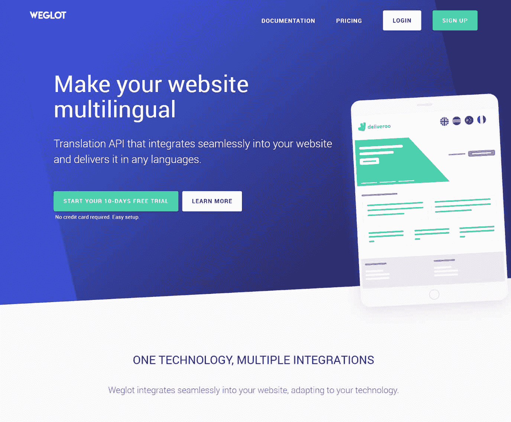
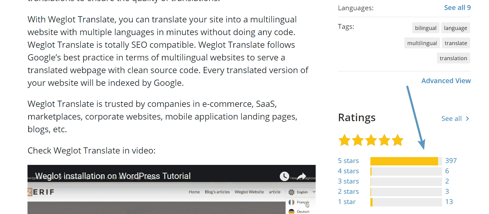

# 金斯塔·金并:奥古斯汀·普罗特访谈

> 原文:# t0]https://kinta . com/blog/interview-Augustin-prot/

你可以在 LinkedIn 或 T2 的 Twitter 上找到奥古斯丁。这是我们最近对他的采访，作为我们金斯塔·金并系列的一部分。

### Q1:你的背景是什么，你是如何开始使用 WordPress 的？

我和[人头马](https://twitter.com/RemyBerda)(we glot 联合创始人兼 CTO)的背景非常互补。他是一名工程师，毕业于 Supéléc(法国)和 Columbia(美国),拥有软件(金融和在线广告)背景，并作为联合创始人和首席技术官首次创业。我毕业于多芬大学经济学专业，在金融服务业(并购咨询)工作了 3 年。

我们第一次涉足 WordPress 是在 2015 年底/2016 年初，当时我们正试图寻找用户来测试 Weglot。我们接触的一些人问我们是否有 WordPress 插件。当时我们还不知道 WordPress。但是当我们几次听到这些问题时，我们认为我们应该尝试做一个插件。然后，一个月后，我们在 2016 年巴黎世界语言营上正式发布了 Weglot，并与社区见面，这是一段美好的时光，也是一群了不起的人！

我们就是这样进入 WordPress 世界的。

### Q2:读者应该知道你最近在 WordPress 做了些什么？

Weglot 诞生于其第一次创业旅程中经历的一次商业挫折。他负责技术方面(联合创始人兼首席技术官)，当涉及到使他们的网站多语言时，他没有找到任何解决方案。对于支付，他使用[条纹](https://kinsta.com/blog/stripe-for-wordpress/)，对于搜索有 Algolia，[对于邮件发送网格](https://kinsta.com/knowledgebase/sendgrid-wordpress/)，但对于翻译，他们没有可用的解决方案。这就是 Weglot 想法的由来。

Weglot

有了 Weglot，我们可以让网站所有者和开发者轻松高效地制作多语言网站。我们相信翻译一个网站并以多种语言显示你的内容应该是容易的。你不应该花费数小时或数天的时间在编码或设置上。但是它不应该以牺牲性能为代价(速度，兼容你的解决方案和搜索引擎友好)。

这就是我们 1000%专注于开发和改进 Weglot 的原因。经过一年的增长，我们已经有超过 10，000 个网站使用 Weglot，我们正在迅速挑战 WPML 或 Polylang 等传统解决方案。我们从社区和用户那里收到了非常好的反馈(我们是在 [WordPress 插件目录](https://wordpress.org/plugins/weglot/)上评价最好的多语言插件)，所以我们确信我们的创新方法、我们的模型(SaaS)和我们提供的支持水平很重要。

Weglot ratings on WordPress repository

我们的目标是提供最全包和最强大的解决方案，使网站可以用多种语言。

### Q3:在职业生涯中，你遇到了哪些挑战？

从每月有固定收入的舒适生活转变为企业家的生活并不容易，但却如此令人满意。每天你都面临新的挑战。

对我来说，最大的挑战可能是能够快速学习足够的技术技能来处理 Weglot 的支持。在一年多的时间里，我和雷米负责支持工作。让用户开心对我们来说是如此重要，以至于我们把所有的汗水都投入到支持中。在某些时候，我们几乎找不到时间做其他事情。因此，能够为用户提供几乎所有与 Weglot 相关的问题的答案是至关重要的。

顺便说一下，支持可能是对我们改进 Weglot 和提高我们的品牌知名度帮助最大的一件事。

## 注册订阅时事通讯

### 想知道我们是怎么让流量增长超过 1000%的吗？

加入 20，000 多名获得我们每周时事通讯和内部消息的人的行列吧！

[Subscribe Now](#newsletter)[Good support probably helped us the most to increase brand awareness. 🙌Click to Tweet](https://twitter.com/intent/tweet?url=https%3A%2F%2Fbit.ly%2F2ZA7O05&via=kinsta&text=Good+support+probably+helped+us+the+most+to+increase+brand+awareness.+%F0%9F%99%8C&hashtags=customerservice%2CWordPress)

### 在 WordPress 的世界里，有没有什么让你感到惊讶的事情？

在 WordPress 的世界里，有几件事让我们感到惊讶。

*   社区及其关爱文化的重要性:当我们在 2016 年巴黎世界语言营(WordCamp Paris 2016)期间会见主要法语社区成员时，我们真正理解了这一点(特别是包括 Jenny Beaumont、Jonathan Buttigieg (WP Rocket)、Kim Gjerstad (Mailpoet)、Fabrice Ducarme 和所有其他人)。它由从一开始就支持和帮助我们的伟大的人们组成。
*   SaaS 模式在 WordPress 经济体中是绝对不存在的(不像在 WordPress 之外那么多)。当你注意到 WordPress 用户是第一批通过组装不同的部件来建立网站的时候，这就更令人惊讶了。).所以，一开始，我们不得不面对第一批潜在客户的强烈反对。
*   WordPress 的使用规模和正在进行的专业化:我们使用 WordPress 才一年半，我们感觉 WordPress 的服务水平和客户规模正在上升。

### Q5:你认为 WordPress 世界的未来会是怎样的？

我相信 WordPress 目前在市场上的客户数量正在上升。WordPress 服务和播放器将需要调整和提供一个增强的解决方案来满足新的需求。所以我的愿景是更多的 SaaS 解决方案将出现在 WordPress 环境中。WooCommerce 最近转向自动续费就是这一趋势的有力证明。

Struggling with downtime and WordPress problems? Kinsta is the hosting solution designed to save you time! [Check out our features](https://kinsta.com/features/)

### 你在 WordPress 主机中寻找什么？

作为 SaaS 高科技产品的消费者，我认为 3 个最重要的标准是:

*   **灵活性:**不要每 6 个月更换一次，这一点至关重要，因为您的提供商无法扩展。
*   **可靠性:**托管必须即插即用。你不应该问自己，我的主机服务提供商会倒闭吗？它必须始终可靠，这太关键了。
*   价格:我准备为优质服务付费，所以价格需要反映我购买的质量水平。

### Q7:你是如何在 WordPress 生态系统中获得资金的？

我们得到了 WordPress 生态系统之外的资助。我们从由法国成功的商业天使组成的种子风险投资基金(SIDE capital)筹集资金。我认为他们已经被创始团队、我们在不到一年的时间里生成的可靠指标以及我们的方法所说服。我们相信您需要深入了解技术和社区，以便能够提供最佳服务。

### 问题 8:关于 Weglot 产品，您的资金计划是什么？

我们的资金在两个方面帮助了我们:

*   建立 Weglot 的核心团队:自从我们同意筹集资金的那天起，这就是我们的主要关注点。我们成功招募了两名优秀的团队成员，Floran 是首席开发人员，Maximilien 是客户支持主管。此外，我们还招聘了阿德里安做营销。下一步是加强技术团队，构建和改进我们产品路线图中的所有优秀产品。
*   在线收购:测试新渠道，改善我们已经在做的事情。

### 问题 9:当你离开笔记本电脑时，你喜欢做什么？

与家人和朋友共度时光。我也喜欢烹饪、风筝冲浪和滑雪。

### 问题 10:接下来我们应该采访谁&为什么？

WP Rocket 的 Jonathan Buttigieg 因为他以真正的企业家精神在做伟大的产品。还因为他证明了你可以成功挑战缓存等市场。也因为他是法国人；)

* * *

让你所有的[应用程序](https://kinsta.com/application-hosting/)、[数据库](https://kinsta.com/database-hosting/)和 [WordPress 网站](https://kinsta.com/wordpress-hosting/)在线并在一个屋檐下。我们功能丰富的高性能云平台包括:

*   在 MyKinsta 仪表盘中轻松设置和管理
*   24/7 专家支持
*   最好的谷歌云平台硬件和网络，由 Kubernetes 提供最大的可扩展性
*   面向速度和安全性的企业级 Cloudflare 集成
*   全球受众覆盖全球多达 35 个数据中心和 275 多个 pop

在第一个月使用托管的[应用程序或托管](https://kinsta.com/application-hosting/)的[数据库，您可以享受 20 美元的优惠，亲自测试一下。探索我们的](https://kinsta.com/database-hosting/)[计划](https://kinsta.com/plans/)或[与销售人员交谈](https://kinsta.com/contact-us/)以找到最适合您的方式。