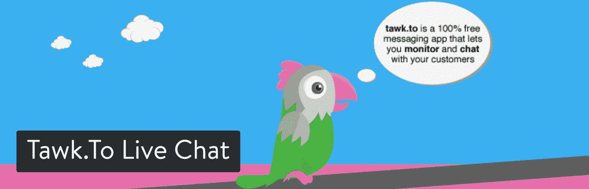
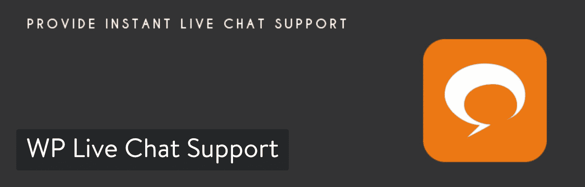
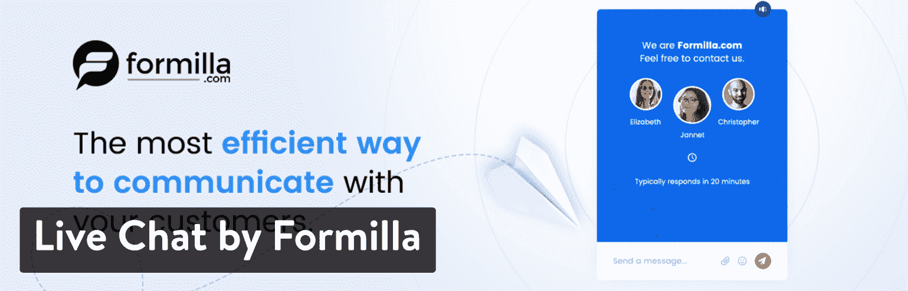
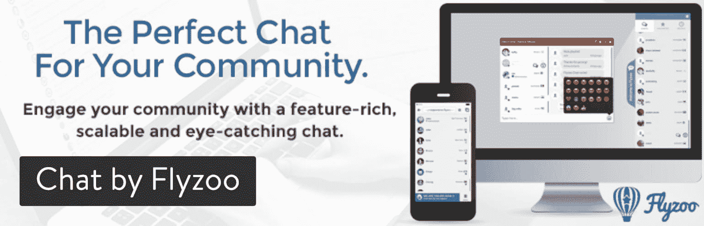
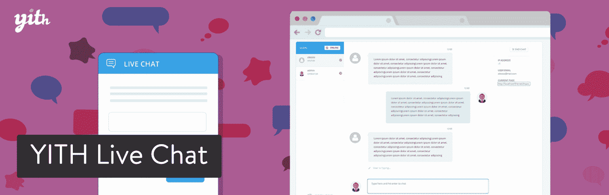
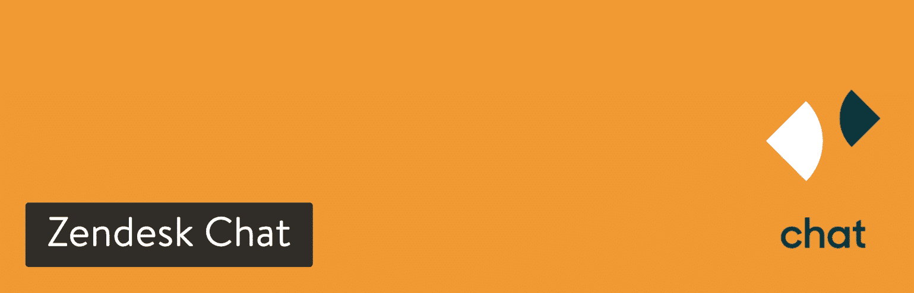
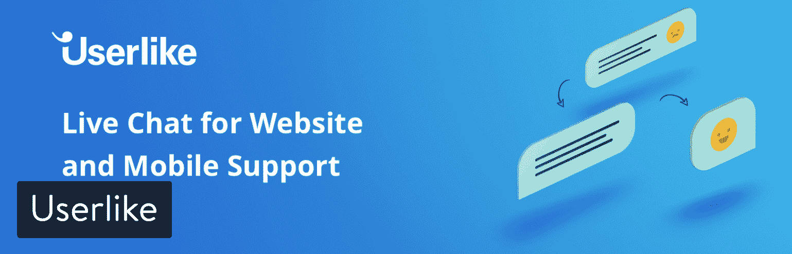
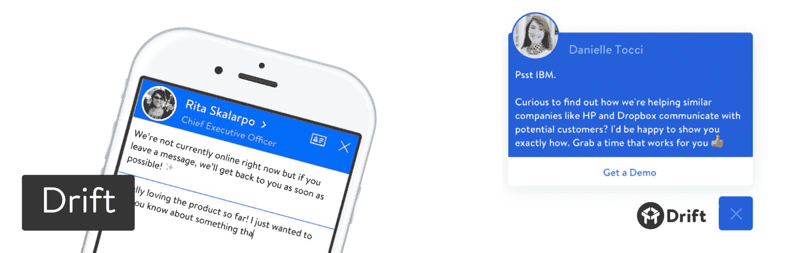
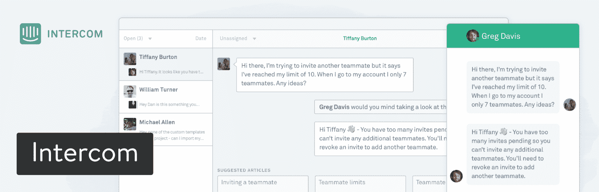
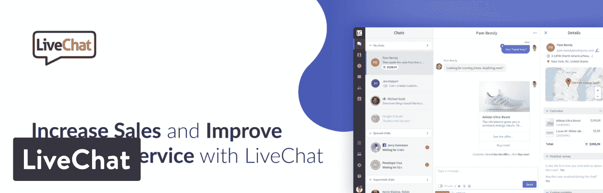

# 找到你梦想中的 WordPress 实时聊天插件(14 个解决方案)

> 原文：<https://kinsta.com/blog/wordpress-live-chat-plugin/>

回想一下您最后一次拨打客户支持热线的情况。让我猜猜，发生了以下情况之一:

*   你被搁置了一段时间。
*   这个人听起来像是在读剧本。
*   由于背景噪音、连接不良或语言障碍，这个问题很难理解。
*   你打了很长时间的电话。

电话支持个性化了客户协助体验，但实施起来很困难，而且要让优秀的人员加入支持团队也很昂贵。大公司只是简单地外包，给所有客户带来了糟糕的体验。小企业通常更擅长电话支持，但公司很难保持如此高的成功率。

满足你的大部分客户，同时减少电话数量的一个方法是找到一个 WordPress 实时聊天插件。然后，将其安装在您的网站上，为您的客户提供快速的在线聊天。 [Drift](https://blog.drift.com/get-more-inbound-leads-with-live-chat/) 只需在网站上进行实时聊天，就能让**的潜在客户增加 200%** 。

## 拥有 WordPress 实时聊天插件的好处

除了大部分 WordPress live chat 插件是免费的这一事实之外，你还有其他几个理由去安装一个:

*   **选项**–客户需要选项。如果他们为某项产品或服务付费，人们会认为那部分费用会付给你的客户服务部。如果你只有一个论坛或电子邮件支持模块，那就没有给你的用户很多选择。一些人喜欢在电话上交谈，而另一些人更喜欢使用实时聊天模块。也有人喜欢电子邮件支持或通过论坛和博客帖子进行研究。给你的顾客各种各样的偏好，这样你会让每个人都开心。
*   即时服务(Instant service)在线商务的一个大问题是，消费者不可能走五步路去拍售货员的肩膀。你的网站用户通常只能靠自己或者在互联网上寻找问题的答案。实时聊天框是您与客户交流的即时形式。这是在销售前用来回答那些快速问题的。这是为了在销售后立即跟进客户。如果你希望人们等待电子邮件或通过电话排队，你将很难转化和留住客户。
*   质量品牌——下次有人考虑购买一件衣服时，他们会想知道从哪里购买最好。他们心中可能有几家公司，但您的公司最受关注，因为客户与实时聊天代表有过很好的体验。
*   **记录反馈和客户互动**–一些 WordPress 实时聊天插件允许你记录客户在你的网站上做了什么以及对客户代表说了什么。这有助于未来的目标营销。此外，客户互动通常可以记录在客户关系管理工具中，如 Salesforce 和 ZenDesk。
*   **专业性**——在你的网站上有一个实时聊天模块，让它看起来像是你们在一起表演。你已经清楚地研究了客户想要什么，并意识到你的行业充满了对实时聊天感兴趣的人。世界上一些最具前瞻性的公司有实时聊天，而忘记它的往往是更新、无组织的公司。

## 2022 年最好的 WordPress 实时聊天插件

在这篇 WordPress 实时聊天插件综述中，我们将揭示每个解决方案的优缺点。然后，我们将探讨定价、特性集以及哪类公司应该考虑每个插件。

如果你想快速参考我们的建议，这里有一个列表供你参考:

1.  [陶。进行实时聊天](#tawkto-live-chat)
2.  [WP 实时聊天支持](#wp-live-chat-support)
3.  [福米拉的实时聊天](#formilla-live-chat)
4.  [HubSpot 一体机营销](#hubspot-all-in-one-marketing)
5.  [Facebook Messenger 实时聊天](#fb-messenger-live-chat)
6.  [Tidio 实时聊天](#tidio-live-chat)
7.  [fly zoo 聊天](#flyzoo)
8.  [聊天–实时聊天、支持、销售](#chats)
9.  [第一次实时聊天](#yith-live-chat)
10.  [Zendesk 聊天](#zendesk-live-chat)
11.  [Userlike](#userlike)
12.  [漂移](#drift)
13.  [对讲机实时聊天](#intercom)
14.  [现场直播](#livechat)

### 1.陶。进行实时聊天

[陶。To Live Chat](https://wordpress.org/plugins/tawkto-live-chat/) 不仅是一个评价很高的聊天插件，而且一旦你把它安装在你的网站上，它看起来非常时髦。你会注意到的第一个好处是这个插件是完全免费的。没有任何广告或垃圾信息会让实时聊天框变得不那么令人愉快。实时监控可用于检查您的客户，实际的实时聊天模块是完全可定制的。

Tawk.To Live Chat WordPress plugin

客户支持团队也随时待命，让您与他们互动。这种支持只是通过实时聊天和电子邮件，但他们反应很快。

#### 使用这个 WordPress 实时聊天插件，如果你…

*   就像一个高度可定制的聊天模块，带有调整颜色、大小、字体、语言和位置的工具。
*   需要支持无限数量的代理。
*   想要一个小部件调度器来设置实时聊天小部件出现的确切时间。
*   需要一个 WordPress 实时聊天插件，不会，也永远不会，花费一毛钱。
*   想要一个内置票务聊天插件。
*   对固定的快捷信息感兴趣。

#### 跳过这个 WordPress 实时聊天插件，如果你…

*   对注册 Tawk 账户不感兴趣。虽然它看起来像一个伟大的开发团队，但你几乎是在用你的信息换取免费插件。
*   想要更多高级支持选项。
*   需要额外的定制工具。Tawk 有几个，但一些竞争对手提供先进的品牌工具。

### 2.WP 实时聊天支持

WP 实时聊天支持插件提供了一个出色的功能组合，支持几十种语言，一个漂亮的聊天框，可以免费与你的客户聊天。该插件有一个独特的功能，让你知道你错过了聊天。这是一种质量控制，也是一种潜在的跟踪客户的方式。还有一个默认值，如果用户点击“X”按钮，它会使用 cookies 来阻止聊天在 24 小时内出现。

WP Live Chat Support WordPress plugin

该插件现在是 100%免费的。它包括多种功能，如无限制的同步实时聊天和代理、多个聊天框主题、与在线访问者发起聊天的能力、ROI 跟踪、离线消息等。

#### 使用这个 WordPress 实时聊天插件，如果你…

*   想要一个有很多高级功能的免费聊天插件，包括无限代理。
*   有兴趣在您的聊天框中添加效果和动画。
*   喜欢将您的实时聊天与翻译和分析工具相结合。
*   需要一种方法在您的实时聊天之前或之后添加调查、测验或投票。
*   想要一个没有来自[开发者](https://kinsta.com/blog/hire-wordpress-developer/)的任何品牌的 live WordPress 实时聊天插件。

#### 跳过这个 WordPress 实时聊天插件，如果你…

*   依靠即时响应来支持票证。许多用户抱怨支持麻烦。

### 3.Formilla 的实时聊天——实时聊天插件

Formilla 的 Live Chat 拥有专业外观的聊天框，非常适合法律或工程公司等严肃的公司。如果你正在寻找强大的支持，这是最好的聊天插件之一。它更多的是一个高级插件，但它确实为一个客户支持代理提供了一个免费的计划。这也只包括一个并发聊天，使得免费计划对一般企业来说有些无用。

Live Chat by Formilla WordPress plugin

保费计划是按循环收费的，所以你必须从每月至少支付 11.99 美元开始，而且这只是针对一家代理。之后每个代理商都有折扣。虽然价格并不理想，但 Formilla 支持实时访客监控、让你在旅途中与客户聊天的移动应用、自定义语言、自定义外观、对 [WordPress multisite](https://kinsta.com/wordpress-multisite-hosting/) 的支持等等。

#### 使用这个 WordPress 实时聊天插件，如果你…

*   愿意每月为大量的功能付费。
*   有手机 app 支持的需求。
*   寻找实时访客监控。
*   想要与 MailChimp 、Pipedrive 或 Zendesk 等[工具集成。](https://kinsta.com/blog/how-to-use-mailchimp/)
*   需要录音信息来加速沟通过程。
*   [您的实时聊天模块需要 SSL](https://kinsta.com/knowledgebase/how-ssl-works/) 。这是[获得网上商店](https://kinsta.com/blog/wordpress-security-plugins/)的理想选择。

#### 跳过这个 WordPress 实时聊天插件，如果你…

*   想要一个免费的实时聊天插件。免费版不值得你花时间，所以几乎是要付费的。
*   想要更有创意的设计。这有点无聊，但这可能对更传统的业务有用。

### 4.HubSpot 一体化营销

HubSpot 的一体化营销插件为您的网站提供了许多营销工具，包括实时聊天。

HubSpot Live Chat 允许您为不同的页面或受众群体设置有针对性的消息。如果没有人可以立即回复，您可以启用电子邮件捕获表单，这样您的访问者仍然可以保持联系。你也可以设置一个聊天机器人来个性化你的谈话。

HubSpot All-In-One Marketing WordPress plugin

因为它是建立在免费的 HubSpot CRM 的基础上的，你将确切地知道你在和谁聊天，他们在你的网站上浏览了什么页面，无论是潜在客户、长期客户还是新联系人。这带来了出色的客户体验。您可以在一个地方记笔记、发送电子邮件、打电话、安排跟进任务和创建支持票证，让您的团队轻松跟进

免费的 HubSpot CRM 包含实时聊天功能。但是，您可以[将](http://hubspot.com/pricing)升级到付费帐户，以获得更多高级功能，如 if/then 工作流和将聊天转移到不同的团队成员。

#### 使用这个 WordPress 实时聊天插件，如果你…

*   想要一个免费的实时聊天插件。
*   希望在 CRM 中同步和整合您的所有对话。
*   正在寻找整合营销解决方案。
*   需要使用聊天机器人。

#### 跳过这个 WordPress 实时聊天插件，如果你…

*   不想注册 HubSpot 账户。
*   想直接从你的 WordPress 仪表盘管理你的聊天吗？

### 5.Facebook Messenger 实时聊天

如果你想找一种社交方式来替代常规的实时聊天，Facebook Messenger 实时聊天插件应该会很适合你。脸书正通过为公司提供一种在社交环境中与客户联系的方式，打入客户服务领域。由于消费者花在社交媒体上的时间比花在购物网站上的时间多，所以通过脸书与他们联系是有意义的。

Facebook Messenger Live Chat WordPress plugin

任何拥有脸书页面或个人账户的人都可以使用 Facebook Messenger。然而，这个插件将它集成到你的 WordPress 站点中，所以你可以从一个仪表板上管理一切。这个插件是免费的，但是你只能使用脸书提供的功能。也就是说，Facebook Messenger 实时聊天有社交按钮、推广栏、社交移动工具、通知框等等。

如果你想升级，有一个[高级版本](https://zotabox.com/membership/pricing)。每月 9.99 美元起。请记住，免费版本不提供电子邮件捕获弹出窗口，多站点支持，横幅或贴纸。很多这些特性在大多数情况下并不需要，但是免费版本中的 Zotabox 商标可能会惹恼一些人。

#### 使用这个 WordPress 实时聊天插件，如果你…

*   需要一个免费的高级实时聊天插件。
*   愿意多付一点钱去掉品牌，得到更好的定制工具。
*   想要一个面向社会的聊天框，有社会按钮，社会移动工具，并通过脸书通信。

#### 跳过这个 WordPress 实时聊天插件，如果你…

*   你不想仅仅为了移除品牌而付费。
*   你宁愿在你的聊天框上有更多的自由。脸书聊天功能强大，但仅限于脸书开发的内容。

### 6.Tidio 实时聊天

Tidio 实时聊天是另一个流行的 WordPress 实时聊天插件，它为 iOS、Android、Windows、OS X 和 Chrome 提供专用的应用程序。Tidio 有几个免费的功能是你在其他实时聊天工具中找不到的。例如，Tidio 允许你先联系你的客户，而其他插件经常让你为此付费。因此，有了 Tidio，你就不用再等待顾客给你发信息了。

Tidio Live Chat WordPress plugin

也就是说，Tidio 还有一个[高级版本，从](http://www.tidiochat.com/en/pricing)开始，每月 15 美元。免费插件版本终身免费，它最多支持三个用户进行实时聊天，电子邮件集成，Messenger 集成，应用程序，无限跟踪等。这是一笔不错的交易，尤其是对小企业而言。

#### 使用这个 WordPress 实时聊天插件，如果你…

*   经营一家拥有三名或更少客户支持代表的小型企业。
*   不反对为额外的销售代表支付月费。
*   想要独特的功能，如营业时间显示或实时打字。
*   经营一家需要回收废弃购物车或忠诚度计划的电子商务商店，这两者都集成到 Tidio 中。

#### 跳过这个 WordPress 实时聊天插件，如果你…

*   无法想象每月花 15 美元购买高级功能。
*   您有三个以上的客户支持代理，但不想支付任何费用。

### 7.Flyzoo 聊天

Flyzoo 的 Chat 采用了一种不同的在线聊天方式。它不适合试图与客户沟通的公司。相反，这个插件更像是访问者的聊天室。

## 注册订阅时事通讯

### 想知道我们是怎么让流量增长超过 1000%的吗？

加入 20，000 多名获得我们每周时事通讯和内部消息的人的行列吧！

[Subscribe Now](#newsletter)

Chat by Flyzoo WordPress plugin

发起论坛上的群聊，连接私人(一对一)聊天和适度聊天，以确保一切都是亲切的。显然，并不是所有的公司都想要这样的聊天插件，但它对于论坛或社区来说是理想的，在那里人们希望有一个与其他用户讨论话题的渠道。会员网站也会从 Flyzoo 中获益。

请记住，Flyzoo 的任何计划都不是免费的。你需要注册一个[高级套餐](https://www.flyzoo.co/pricing)，起价每月 9.90 美元。

#### 使用这个 WordPress 实时聊天插件，如果你…

*   需要一种用户与其他用户聊天的方式。
*   需要私人和团体聊天选项。
*   想要一个带有文件共享工具的 WordPress 实时聊天插件。
*   想要一种控制角色访问的方法。
*   想要访问 API。

#### 跳过这个 WordPress 实时聊天插件，如果你…

*   不想付任何钱。
*   对一对一客户支持实时聊天模块更感兴趣。这个插件对于群聊更有用。

### 8.聊天–实时聊天、支持、销售

聊天-实时聊天，支持，销售插件有一个平淡无奇的名字，但它对无限的网站，聊天和运营商的支持足以让它看一看。该插件还附带了一个移动应用程序，用于在不在办公室时与客户聊天。

Chat WordPress plugin

获得所有功能都是免费的，而且插件与 Woocommerce 兼容。因此，如果你正在经营一家网上商店，这是一个不错的选择。地理定位工具在地图上向您显示客户，而离线聊天消息会发送到您的电子邮件中，以便稍后回复。

#### 使用这个 WordPress 实时聊天插件，如果你…

*   比如一个完全免费的 WordPress 实时聊天插件。
*   希望能够为您的客户支持代表显示头像。
*   愿意称呼顾客的名字。
*   想要无限的一切，从聊天到代理。
*   用 WooCommerce 经营网店。

#### 跳过这个 WordPress 实时聊天插件，如果你…

*   我对杂乱的管理区没有耐心。
*   宁愿寻找一种更有保障的保费支持形式。开发人员会帮忙，但这和你用高级插件得到的东西完全不同。

### 9.第一次实时聊天

YITH Live Chat 插件不如其他一些 WordPress live chat 插件出名，但它肯定在市场上占有一席之地。我这么喜欢它的主要原因是它超级基础。

YITH Live Chat WordPress plugin

插件文档是相当广泛的，但是大多数人能够自己解决它。YITH Live Chat 是一个免费的开源选项，但也出售[高级版本](https://yithemes.com/themes/plugins/yith-live-chat/)。

#### 使用这个 WordPress 实时聊天插件，如果你…

*   需要一个干净、简单、直观的界面。对初学者来说很棒。
*   需要保存对话中的消息。
*   希望从一个代理仪表板管理多个对话。
*   想要提供移动聊天服务。

#### 跳过这个 WordPress 实时聊天插件，如果你…

*   想要一个更先进的实时聊天模块。
*   需要强大的定制工具来定制你的聊天框。
*   想要更多的语言支持而不仅仅是英语。

### 10.Zendesk 聊天

通常情况下，您会希望与您的客户关系管理( [CRM](https://kinsta.com/blog/wordpress-crm/) )软件集成。通过这种方式，您可以跟踪与客户的对话，并尝试在未来进行一些转换。这就是为什么 [Zendesk Chat](https://wordpress.org/plugins/zopim-live-chat/) 是如此吸引人的实时聊天选项。

Struggling with downtime and WordPress problems? Kinsta is the hosting solution designed to save you time! [Check out our features](https://kinsta.com/features/)

Zendesk Chat WordPress plugin

它与流行的 CRM Zendesk 相结合。因此，你可以与客户开始对话，获取他们的信息，尝试销售，然后在 CRM 中记录整个互动。这个插件为 WordPress 用户提供了一个免费计划。该计划允许一个并发聊天，聊天评级，和 14 天的聊天记录。所以，它真的只适合非常小的公司。

除此之外，保费计划从每个代理每月 14 美元开始。

#### 使用这个 WordPress 实时聊天插件，如果你…

*   希望在您的支持团队中只有一名代理人的情况下保持自由。
*   需要一种方法将客户发送到不同的部门。
*   已经与 Zendesk 合作，并希望整合。
*   想要转换跟踪。

#### 跳过这个 WordPress 实时聊天插件，如果你…

*   讨厌看到插件公司的品牌。唯一取消 Zendesk 聊天品牌的计划是每个代理每月 59 美元的企业选项。
*   想要一个免费插件，但有一个以上的代理。
*   需要一个更人性化的插件。不是很烂的界面，但我见过更好的。

### 11.用户喜欢的

Userlike 可能是这个街区的新成员之一，但当涉及到你的网站的实时聊天时，他们正在做一些非常棒的事情。有了这个，你可以通过你的网站、Facebook Messenger 或 Telegram 实时向你的客户发送信息。

Userlike WordPress chat plugin

免费版的 Userlike 非常适合那些只想尝试一下的人。这包括 1 个操作员、1 个聊天工具和无限聊天。如果你需要额外的集成和/或用户，保费计划每月 35 美元起。

#### 使用这个 WordPress 实时聊天插件，如果你…

*   希望在您的支持团队中只有一名代理人的情况下保持自由。
*   想要定制的设计来匹配您的网站。
*   可以选择购买额外的高级附加组件和集成，如 [Slack](https://kinsta.com/blog/how-to-use-slack/) 、Dropbox、脸书、Hubspot、 [Trello](https://kinsta.com/blog/trello-vs-asana/) 等等。
*   需要智能聊天行为规则。
*   想要应用内消息和机器人。

#### 跳过这个 WordPress 实时聊天插件，如果你…

*   想要一个免费插件，但有一个以上的代理。
*   想要一些长期支持 WordPress 的东西。这仍然是一个新的解决方案。

### 12.漂流

漂移插件具有营销和销售功能，最强大的工具之一是实时聊天。Drift 有一个免费版本，但它是为那些想和网站访问者聊天的人保留的。

Drift

因此，免费版本对博客作者、小商店和拥有[作品集](https://kinsta.com/blog/wordpress-portfolio-plugins/)的艺术家来说看起来不错。至于高级套餐，价格昂贵，每月 50 美元起。也就是说，您会收到一些奇特的选项，如图片和姓名，以了解哪些客户在与您交谈。您还可以将聊天传递给队友，通过消息状态保持有序，并完全自定义聊天模块。你可以在这里阅读更多关于[所有实时聊天功能的信息](https://www.drift.com/product/live-chat/)。

#### 使用这个 WordPress 实时聊天插件，如果你…

*   希望在您的支持团队中只有一名代理人的情况下保持自由。
*   需要通知和松弛集成。
*   想要应用内消息和机器人。
*   优雅、现代、快速的解决方案

#### 跳过这个 WordPress 实时聊天插件，如果你…

*   不喜欢看品牌。虽然它可以在高级包中删除。
*   想要一个免费插件，但有一个以上的代理。

### 13.内部实时聊天

[Intercom 实时聊天](https://wordpress.org/plugins/intercom/)通过允许您创建和发布可在实时聊天中共享的帮助文章，将实时聊天向前推进了一步。有针对性的消息也是该计划的一部分，还有实时聊天框中的标准线索生成工具。

Intercom

至于价格，每月 56 美元左右你就可以获得实时聊天。所有的内部通信产品都打包成一个更昂贵的交易，所以只有当你喜欢客户参与、客户支持和更多的东西时才这样做。从金斯塔的第一天起，我们就开始使用对讲机，效果非常好。

#### 使用这个 WordPress 实时聊天插件，如果你…

*   需要非常坚固的东西。
*   拥有一个更大的团队，有不止一个代理，或者需要一个企业解决方案。
*   想要额外的集成，如 CRM，教育门户和运营商机器人。

#### 跳过这个 WordPress 实时聊天插件，如果你…

*   想要一个免费插件，但有一个以上的代理。
*   只是想要一些快速简单的东西。

### 14.实时通讯

[LiveChat](https://wordpress.org/plugins/wp-live-chat-software-for-wordpress/) 是一家成熟的聊天软件提供商，在市场上拥有超过 15 年的专业经验。他们提供了一个高级聊天解决方案，可以完全定制，以适应您的网站在最小的细节。它还可以轻松地与 100 多种不同的产品集成，这使得它更加灵活。

LiveChat WordPress plugin

LiveChat 应用程序为聊天代理提供了一套内部工具，包括 iOS 和 Android 的移动应用程序，使他们的工作更加轻松。如果你没有专门的支持团队，这是非常重要的。此外，如果您正在为您的支持部门寻找高级分析，您肯定会喜欢 LiveChat 中提供的报告功能。

#### 使用这个 WordPress 实时聊天插件，如果你…

*   在你的网站上使用多种不同的产品。您将获得 100 多个现成的集成。
*   重视客户服务的分析方法。
*   希望同时运行在线和离线支持。票务系统允许你提供一个直接的联系方式，即使你的团队离线。
*   想要使用支持多种渠道的平台，包括聊天、FB Messenger 和电子邮件。

#### 跳过这个 WordPress 实时聊天插件，如果你…

*   正在寻找免费的解决方案。LiveChat 没有试用期过后的免费版本。需要一个简单的工具来和你的网站访问者聊天。

## 其他实时聊天解决方案

显然，我们不可能检查或审查市场上的每一个实时聊天插件或解决方案。这里还有一些你可能也想看看的:

*   [新鲜 hchat](https://www.freshworks.com/live-chat-software/)
*   [Zendesk 聊天](https://www.zendesk.com/chat/)

## 选择你的 WordPress 实时聊天插件

哇，WordPress 实时聊天插件上的信息真多！你如何着手筛选这些解决方案以做出正确的决定？好吧，这里有一些最终的想法来帮助你:

*   **为了获得最佳价值**–选择 Tawk。实时聊天或 WP 实时聊天支持。
*   **适合初学者**–使用 YITH Live Chat。
*   **对于更专业的业务**–使用 Formilla 的实时聊天、Live Chat 或更高级的解决方案，如 Intercom 或 Drift。
*   对于 CRM 用户来说，如果你已经在使用 HubSpot，那么 Hubspot 的一体化营销插件会非常有用。
*   **进行群聊**–使用 Flyzoo 聊天。
*   **社交聊天解决方案**–使用 Facebook Messenger 实时聊天。
*   **最佳定制**–使用 Drift 或 Facebook Messenger 实时聊天。

你有它！如果你想到任何关于选择 WordPress 实时聊天插件的问题，请在下面的评论中告诉我们。

* * *

让你所有的[应用程序](https://kinsta.com/application-hosting/)、[数据库](https://kinsta.com/database-hosting/)和 [WordPress 网站](https://kinsta.com/wordpress-hosting/)在线并在一个屋檐下。我们功能丰富的高性能云平台包括:

*   在 MyKinsta 仪表盘中轻松设置和管理
*   24/7 专家支持
*   最好的谷歌云平台硬件和网络，由 Kubernetes 提供最大的可扩展性
*   面向速度和安全性的企业级 Cloudflare 集成
*   全球受众覆盖全球多达 35 个数据中心和 275 多个 pop

在第一个月使用托管的[应用程序或托管](https://kinsta.com/application-hosting/)的[数据库，您可以享受 20 美元的优惠，亲自测试一下。探索我们的](https://kinsta.com/database-hosting/)[计划](https://kinsta.com/plans/)或[与销售人员交谈](https://kinsta.com/contact-us/)以找到最适合您的方式。