# 如何修复 502 坏网关错误

> 原文：<https://kinsta.com/blog/502-bad-gateway/>

当涉及到网站时，有很多不同的错误，可以彻底令人沮丧和困惑。我想到的几个例子是死亡的白屏或令人恐惧的建立数据库连接的 T2 错误。

但是一个更流行的错误是 502 坏网关错误。为什么？因为这在整个网络中经常发生，不仅是 WordPress 网站，甚至是 Gmail、Twitter 和 Cloudflare 等流行服务。

请阅读下面的更多信息，了解导致此错误的原因以及如何快速解决此问题的一些解决方案。

*   [什么是 502 坏网关错误？](#what-is-502-bad-gateway-error)
*   [如何修复 502 坏网关错误](#fix-502-bad-gateway-error)

## 什么是 502 坏网关错误？

502 坏网关错误特别意味着服务器**从入站服务器接收到无效响应**。

互联网工程任务组(IETF)将 [502 坏网关错误](https://tools.ietf.org/html/rfc7231#section-6.6.3)定义为:

> *502(错误网关)状态代码表示服务器在充当网关或代理时，收到了来自它在尝试完成请求时访问的入站服务器的无效响应。*

每次你访问一个网站，你的浏览器都会向网络服务器发送一个请求。web 服务器接收并处理请求，然后将请求的资源连同 HTTP 头和 [HTTP 状态码](https://kinsta.com/blog/http-status-codes/)一起发回。通常，除非出现问题，否则不会看到 HTTP 状态代码。这基本上是服务器通知您出现问题的方式，以及如何诊断的代码。

500 状态错误代码有很多不同的类型( [500](https://kinsta.com/blog/500-internal-server-error/) 、 [501](https://kinsta.com/knowledgebase/501-not-implemented-error/) 、 [502](https://kinsta.com/blog/502-bad-gateway/) 、 [503](https://kinsta.com/blog/http-error-503/) 、 [504](https://kinsta.com/blog/504-gateway-timeout/) 、 [508](https://kinsta.com/blog/resource-limit-is-reached/) 、 [520](https://kinsta.com/knowledgebase/error-520/) 等。)都有稍微不同的意思。这表明请求已被接受，但服务器阻止了请求的实现。


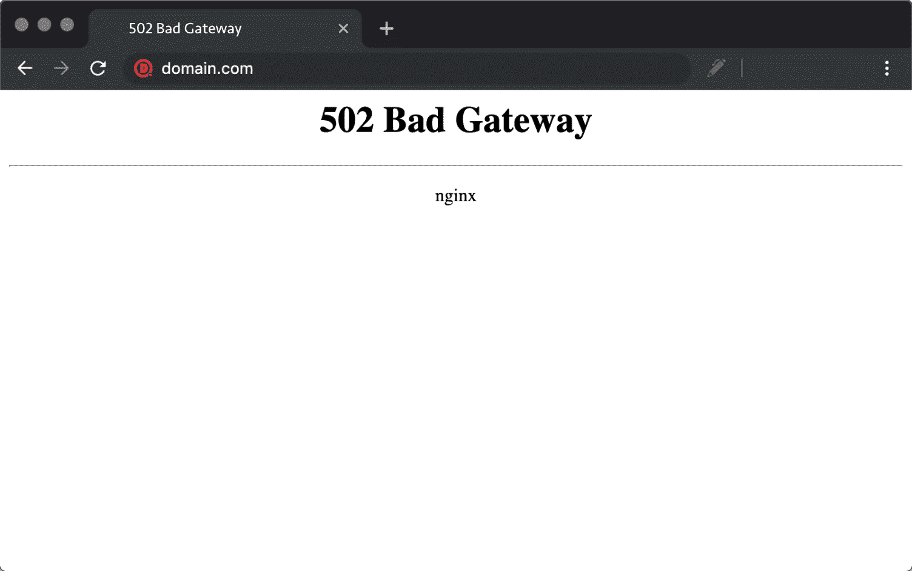

502 bad gateway error in Chrome


### 查看我们的[视频指南](https://www.youtube.com/watch?v=O89MS6j0gJE&t=153s)到 502 错误


### 502 坏网关错误变化

由于浏览器、web 服务器和操作系统的不同，502 坏网关错误可能会以多种不同的方式出现。但是它们都有相同的含义。以下是你可能在网上看到的许多不同的变体中的几个:

*   " 502 错误网关"
*   "错误 502 "
*   “HTTP 错误 502-错误网关”
*   " 502 服务暂时超载"
*   " 502 代理错误"
*   空白的白色屏幕
*   " 502 服务器错误:服务器遇到一个临时错误，无法完成您的请求"
*   " HTTP 502 "
*   暂时错误(502)
*   502.那是一个错误
*   502 坏网关 Cloudflare
*   错误的网关:代理服务器收到来自上游服务器的无效响应

您可能会看到的另一种变化是“502 服务器错误”

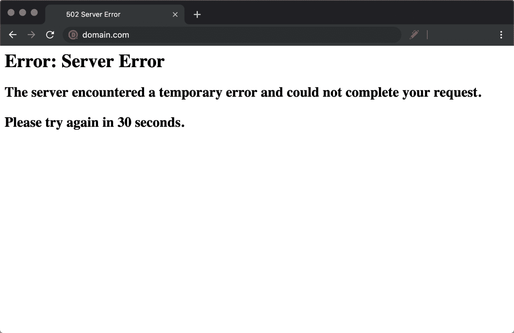

502 server error in Chrome


这是另一种变化。“502–Web 服务器在充当网关或代理服务器时收到无效响应。您正在查找的页面有问题，无法显示。当 Web 服务器(作为网关或代理)联系上游内容服务器时，它收到来自内容服务器的无效响应。

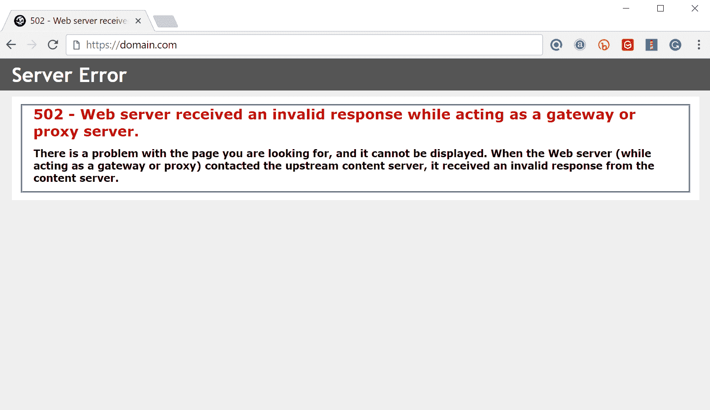

502- web server received an invalid response


对于 502 错误网关错误，Twitter 等其他服务甚至可能会显示完全不同的消息，如“Twitter 已超负荷”这看起来确实更加用户友好。

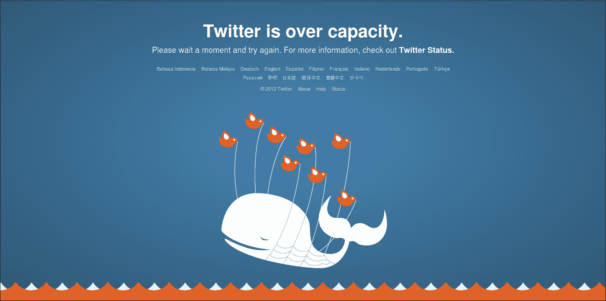

Twitter is over capacity (Img src: [Softpedia](http://webscripts.softpedia.com/blog/quot-Twitter-Is-Over-Capacity-quot-but-Its-Engineers-Are-on-It-325691.shtml))


这是谷歌展示它的快照。"502.这是一个错误。服务器遇到临时错误，无法完成您的请求。请在 30 秒后重试。我们就知道这么多。”

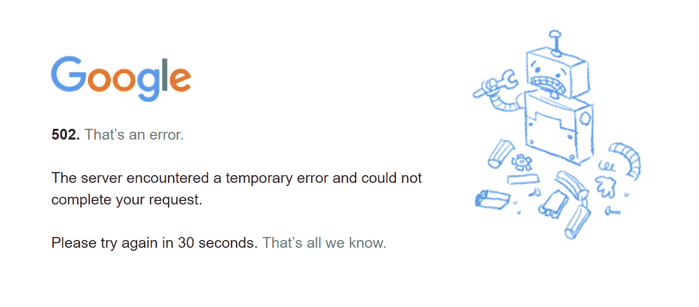

Google 502 error


### 502 错误对 SEO 的影响

与用于 [WordPress 维护](https://kinsta.com/blog/wordpress-maintenance/%E2%80%8E)模式的 [503 错误](https://kinsta.com/blog/http-error-503/)不同，502 错误如果不立即修复，会对 SEO 产生负面影响。如果你的网站只关闭了 10 分钟，并且被持续抓取了很多次，爬虫就会从缓存中获取页面。或者，谷歌可能甚至没有机会在它恢复之前重新抓取它。在这种情况下，你完全没问题。

然而，如果网站关闭了一段时间，比如说 6 个多小时，那么谷歌可能会将 502 错误视为需要解决的网站级别的问题。这**可能会影响你的排名**。如果你担心重复 502 错误，你应该首先弄清楚为什么会发生这些错误。下面的一些解决方案会有所帮助。
T3】

## 如何修复 502 坏网关错误

502 坏网关错误通常是网络/服务器的问题，但也可能是客户端的问题。因此，我们将深入了解这两者。查看这些常见原因以及修复 502 坏网关错误并恢复运行的方法。

不要只是管理你的网站错误——降低它们发生的风险。[免费试用 kin sta](https://hubs.ly/H0pklC_0)。

### 1.尝试重新加载页面

当遇到 502 坏网关错误时，你应该尝试的最简单和最先的事情之一是简单地等待一分钟左右，然后**重新加载页面** (F5 或 Ctrl + F5)。可能是主机或服务器超载，网站会马上恢复。在您等待的时候，您也可以快速尝试不同的浏览器来排除这个问题。

你可以做的另一件事是将网站粘贴到[downforeveryoneorjustme.com](http://downforeveryoneorjustme.com/)中。这个网站会告诉你网站是否关闭，或者是你这边的问题。

## 注册订阅时事通讯


### 想知道我们是怎么让流量增长超过 1000%的吗？

加入 20，000 多名获得我们每周时事通讯和内部消息的人的行列吧！

[Subscribe Now](#newsletter)


downforeveryoneorjustme


### 2.清除您的浏览器缓存

每当你遇到这样的问题时，最好清理一下你的浏览器缓存。以下是在不同浏览器中如何操作的说明:

*   [如何为所有浏览器强制刷新单个页面](https://kinsta.com/knowledgebase/how-to-clear-browser-cache/#single)
*   [如何为谷歌 Chrome 清除浏览器缓存](https://kinsta.com/knowledgebase/how-to-clear-browser-cache/#chrome)
*   [如何清除 Mozilla Firefox 的浏览器缓存](https://kinsta.com/knowledgebase/how-to-clear-browser-cache/#firefox)
*   [如何清除 Safari 浏览器缓存](https://kinsta.com/knowledgebase/how-to-clear-browser-cache/#safari)
*   [如何清除 Internet Explorer 的浏览器缓存](https://kinsta.com/knowledgebase/how-to-clear-browser-cache/#ie)
*   [如何为 Microsoft Edge 清除浏览器缓存](https://kinsta.com/knowledgebase/how-to-clear-browser-cache/#edge)
*   [如何为 Opera 清除浏览器缓存](https://kinsta.com/knowledgebase/how-to-clear-browser-cache/#opera)

### 3.DNS 问题

502 网关错误也可能是因为 DNS 问题，例如域没有解析到正确的 IP，或者 [DNS 服务器没有响应](https://kinsta.com/knowledgebase/dns-server-not-responding/)。如果您刚刚将站点迁移到新的主机上，等待事情完全传播是否重要，在某些情况下，这可能需要 24 小时。这取决于你的 DNS 记录的 [TTL](https://kinsta.com/knowledgebase/what-is-ttl/) 值。

你也可以尝试[刷新你的本地 DNS 缓存](https://kinsta.com/knowledgebase/flush-dns/)。这类似于清除浏览器缓存。

在 Windows 中，只需打开命令提示符并输入以下内容:

```
ipconfig /flushdns
```

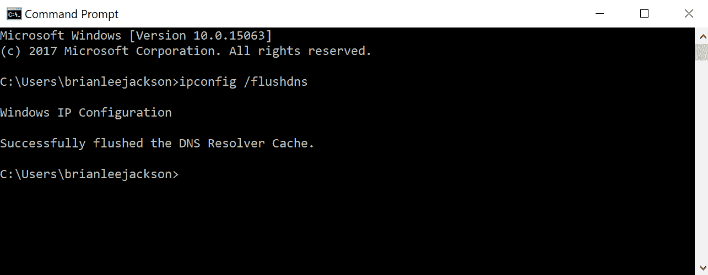

Command prompt – flush DNS


如果成功，您应该会看到“成功刷新 DNS 解析器缓存”。

对于 macOS 用户，您可以在终端中输入以下内容:

```
dscacheutil -flushcache
```

注意:MAC 上没有成功消息。

最后，你可以临时改变你的 DNS 服务器。默认情况下，DNS 服务器由您的 ISP 自动分配。但是你可以试着暂时把它们换成一个公共 DNS 服务器，比如谷歌。事实上，有些人更愿意长期使用谷歌的公共 DNS。如果你有一个[高级域名系统](https://kinsta.com/blog/premium-dns/)，传播通常会快很多。

### 4.和你的主人确认一下

我们通常看到 502 坏网关错误的主要原因是由于 web 主机的问题。有时一个**查询、脚本或请求会花费太长的时间**，所以它会被服务器取消或终止。许多主机，尤其是共享主机实现了他们所谓的“杀死脚本”基本上，它的作用是在一段时间后终止一个请求，这样它就不会关闭一个网站或者影响其他用户。如果你在 Twitter 上搜索“[坏网关](https://twitter.com/search?q=bad%20gateway&src=typd)”，你可以看到每天都有数千条推文提醒他们的托管公司这个问题。

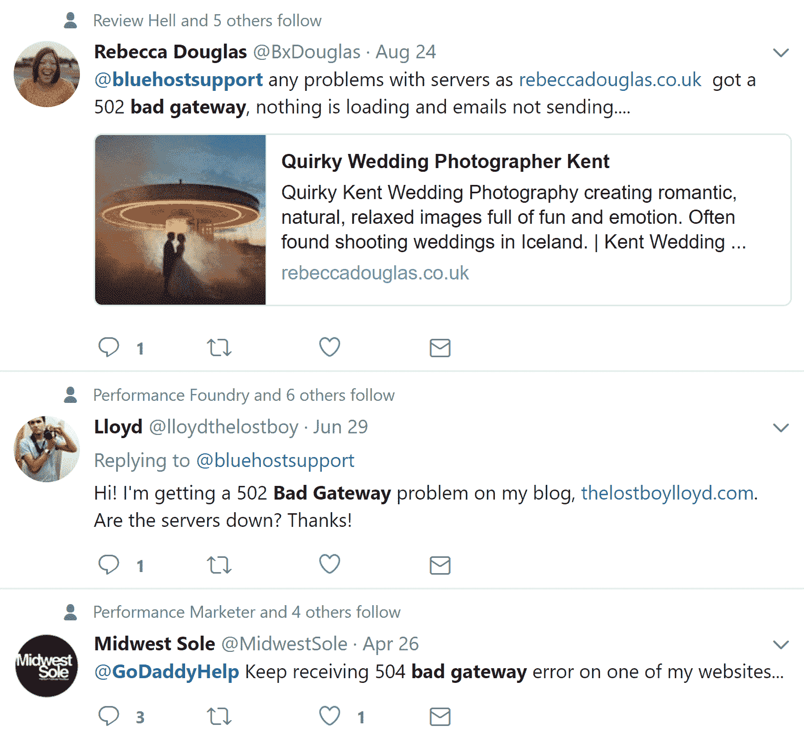

502 bad gateway tweets


你可能想考虑迁移到像 Kinsta 这样的主机的一个原因是，我们的平台运行在一个**隔离的软件容器**中，它包含了运行网站所需的所有软件资源(Linux、 [NGINX](https://kinsta.com/knowledgebase/what-is-nginx/) 、PHP、MySQL)。这意味着运行**每个站点的软件是 100%私有的，不会被共享**，即使是在你自己的站点之间。这大大降低了看到 502 坏网关错误的机会。我们不像某些共享主机那样运行激进的 kill 脚本。即使你的一个网站发生故障，也不会影响到你的其他网站。

您的主机出现 502 网关错误的另一个原因也是由于服务器无法访问，要么是因为它关闭了，要么是因为没有连接。在这种情况下，建议检查您主机的[状态页面](https://status.kinsta.com/)或开一张支持票。
T3】

### 5.暂时禁用 CDN 或防火墙

也可能是你的[内容交付网络](https://kinsta.com/blog/wordpress-cdn/) (CDN)或[防火墙](https://kinsta.com/blog/what-is-a-firewall/)的问题。如果您使用的是第三方 CDN 提供商，一个简单的故障排除方法就是暂时禁用您的 CDN。例如，我们是免费的 [CDN 使能插件](https://wordpress.org/plugins/cdn-enabler/)的忠实粉丝。如果你正在使用它，你可以简单的关闭插件，然后测试你的站点。 [Wp-admin 不工作](https://kinsta.com/blog/locked-out-of-wordpress-admin/)？只需通过 SFTP 登录您的网站，并将插件的文件夹重命名为 cdn-enabler_old。这将暂时禁用 CDN 连接。这同样适用于 WP Rocket 或任何其他你可能已经连接到你的 CDN 上的插件。

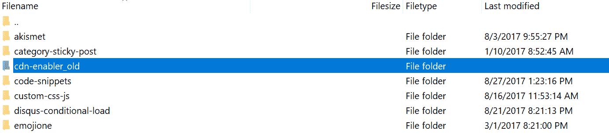

Rename plugin folder temporarily


这种情况有时也会发生在提供 [DDoS 保护](https://kinsta.com/blog/what-is-a-ddos-attack/)和缓解或[完全代理服务(如 Cloudflare](https://kinsta.com/cloudflare-integration/) )的提供商身上，因为他们之间有额外的防火墙。我们已经注意到，在 Cloudflare 免费计划中，这种情况偶尔会发生。不幸的是，由于 Cloudflare 是一个完全代理服务，没有简单禁用它的快速方法。

但是，在您指责 Cloudflare 之前，有必要了解 Cloudflare 有两种不同类型的 502 坏网关错误，如下所示:

#### 502 cloud flare 的不良网关(变体 1)

如果您看到以下屏幕，这实际上是 Cloudflare 方面的问题，在这种情况下，您应该向他们寻求支持。您还可以查看 [Cloudflare 的状态页面](https://www.cloudflarestatus.com/)以了解他们当前是否正在经历宕机。

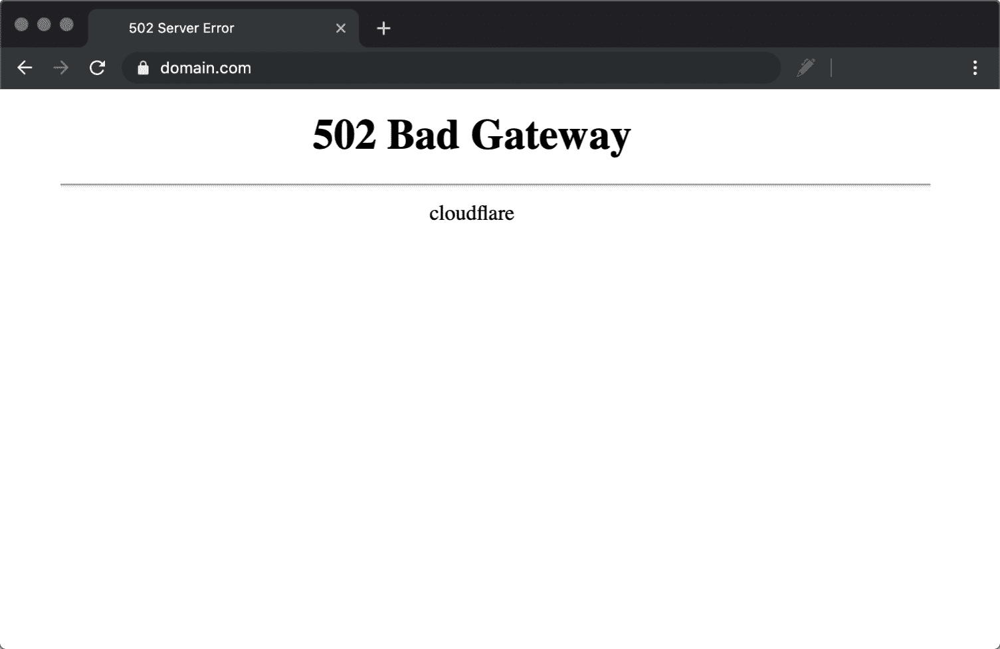

502 bad gateway error


#### 502 cloud flare 的不良网关(变体 2)

如果您看到以下屏幕，这是您的主机有问题。


Cloudflare 502 bad gateway at host


#### GoDaddy 防火墙

这是另一个 HTTP 502 错误和 GoDaddy 的防火墙的例子。由于超时，问题实际上是与原始服务器(主机提供商)有关，而不是防火墙本身。


HTTP 502 – GoDaddy Firewall


### 6.检查你的插件和主题

很多时候，服务器取消脚本和查询的原因是由于你的 WordPress 站点上的**坏代码**，可能来自第三方插件或主题。我们也看到很多错误配置的缓存插件产生 502 错误。解决这个问题的几种方法是停用所有插件。请记住，如果你只是简单地停用一个插件，你不会丢失任何数据。

不要只是管理你的网站错误——降低它们发生的风险。[免费试用 kin sta](https://hubs.ly/H0pklC_0)。

如果您仍然可以[访问您的管理员](https://kinsta.com/knowledgebase/wordpress-admin/)，一个快速的方法是浏览到“插件”并从批量操作菜单中选择“停用”。这将[禁用你所有的插件](https://kinsta.com/knowledgebase/disable-wordpress-plugins/)。如果这解决了问题，你需要找到罪魁祸首。开始一个接一个地激活它们，每次激活后重新加载站点。当您看到 502 网关错误返回时，您已经找到了行为不端的插件。然后你可以向插件开发者寻求帮助，或者在 WordPress 知识库中发布一张支持票。

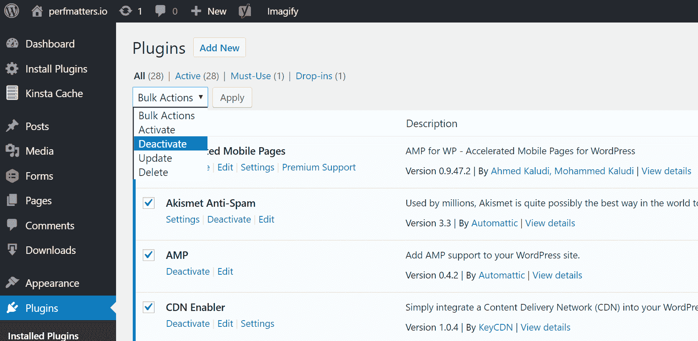

Deactivate all plugins


如果你不能访问你的管理员，你可以通过 FTP 进入你的服务器，将你的插件文件夹重命名为 plugins_old。然后再次检查您的网站。如果成功了，那么你需要一个接一个的测试每个插件。将你的插件文件夹重新命名为“插件”,然后一个接一个地在 if 里面重新命名每个插件文件夹，直到你找到它。


Rename plugin folder


总是确保你的插件、主题和 WordPress 核心是最新的。并检查以确保您运行的是受支持的 PHP 版本。你可以随时向你的主人寻求帮助。我们在 Kinsta [使用](https://kinsta.com/blog/debugging-wordpress-performance/) [Kinsta APM](https://kinsta.com/apm-tool/) 和其他故障排除方法来帮助客户缩小可能导致错误的插件、查询或脚本。如果你有自己的许可证，你也可以使用自己定制的新遗物钥匙。


Time-consuming queries to the database


如果结果是一个有效的查询或者插件中的坏代码，你可能需要引入一个 [WordPress 开发者](https://kinsta.com/blog/hire-wordpress-developer/)来解决这个问题。

### 7.检查日志

您还应该利用您的[错误日志](https://kinsta.com/knowledgebase/wordpress-error-log/)。如果您是一个 Kinsta 客户端，您可以很容易地在 MyKinsta 仪表板的日志查看器中看到错误。这可以帮助你快速缩小问题范围，尤其是如果问题是由你网站上的插件引起的。

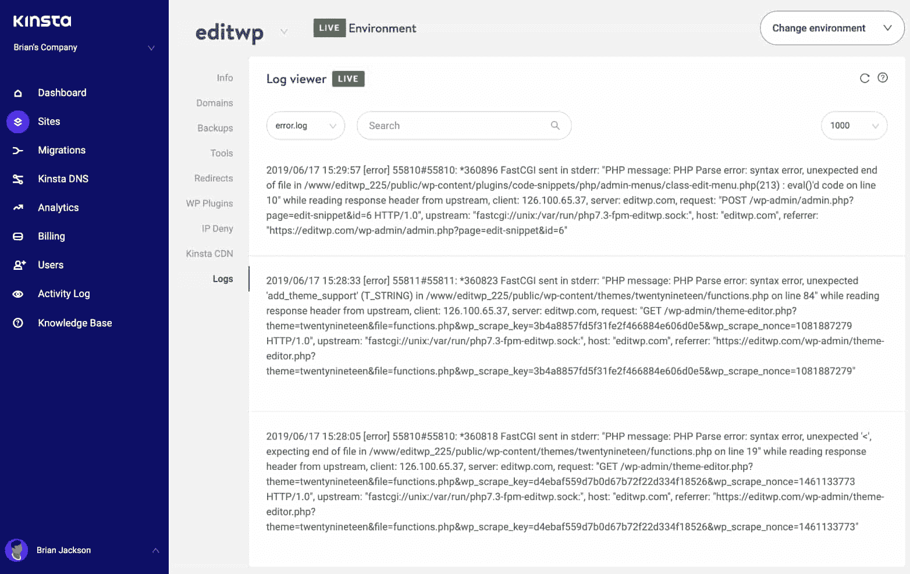

Check error logs for 502 bad gateway errors


如果您的主机没有日志记录工具，您也可以将以下代码添加到您的[wp-config.php 文件](https://kinsta.com/blog/wp-config-php/)中以启用日志记录:

```
define( 'WP_DEBUG', true );
define( 'WP_DEBUG_LOG', true );
define( 'WP_DEBUG_DISPLAY', false );
```

如果你需要更多关于如何启用 WordPress 调试模式的帮助，这里有一个完整的[逐步指南](https://kinsta.com/blog/wordpress-debug/)。

日志通常位于/wp-content 目录中。其他人，比如金斯塔，可能有一个专门的文件夹叫做“日志”。

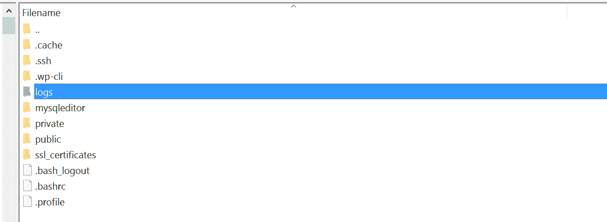

您还可以检查 Apache 和 NGINX 中的日志文件，它们通常位于以下位置:

*   **Apache:**/var/log/Apache 2/error . log
*   **nginux:**/var/log/nginnx/error . log

如果你是 Kinsta 的客户，你还可以利用我们的[分析工具](https://kinsta.com/help/mykinsta-analytics/)获得 502 个错误的总数，并查看它们发生的频率和时间。如果这是一个持续存在的问题，或者某个问题已经自行解决，这可以帮助您进行故障诊断。

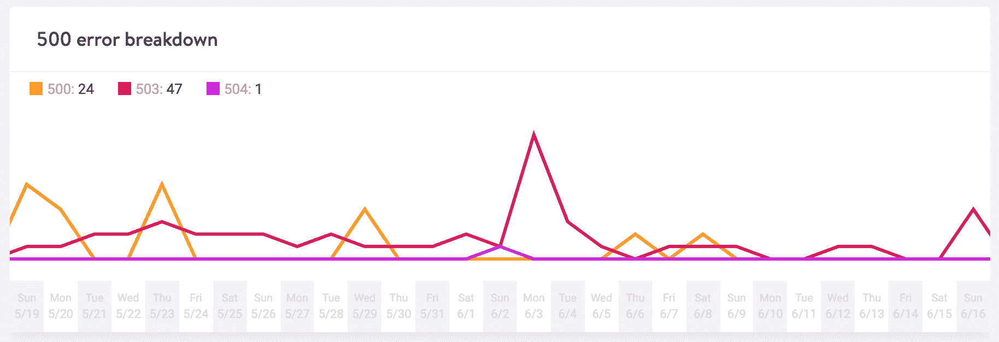

Response analysis 500 error breakdown


### 8.重启 PHP

最后，你也可以尝试重启 PHP。如果你是一个 Kinsta 客户端，你可以很容易地从 MyKinsta 仪表板中的 tools 菜单[重启 PHP](https://kinsta.com/help/restart-php/) 。如果你的主机不提供这个，你可以打开一个支持票，让他们重启 PHP。

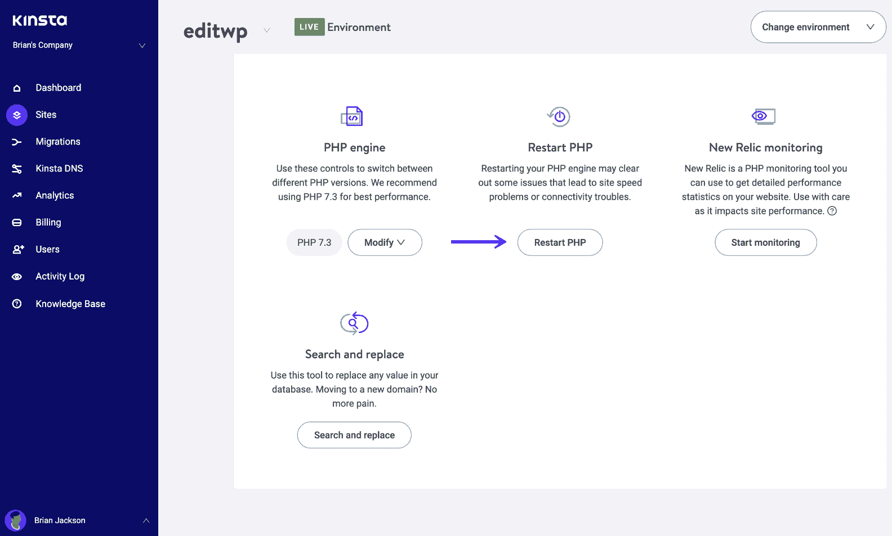

Restart PHP


### 9.PHP 超时问题

如果单个 PHP 进程运行的时间超过了服务器上 PHP 配置中设置的`max_execution_time`或`max_input_time`，就会发生 PHP 超时。如果你在做大 [WordPress imports](https://kinsta.com/knowledgebase/wordpress-import-issues/) ，这是经常发生的事情。发生这种情况时，通常会显示 502 服务器错误。如果遇到 PHP 超时，这些值可能需要提升。

您可以与您当前的主机一起检查您的服务器上设置了什么值，以及它们是否可以增加。在 Kinsta 平台上，这些值默认设置为 300 秒(5 分钟)。我们平台上可用的最大 PHP 超时值基于您当前的托管计划。

## 摘要

正如你所看到的，你可以做很多事情来排除和修复你站点上的 502 网关错误。通常这不是客户端的问题，而是主机的问题。带有坏代码或未优化查询的第三方插件和主题也是需要注意的。我们错过了什么吗？也许你有另一个解决 502 网关错误的技巧。如果是这样，请在下面的评论中告诉我们。

* * *

## 常见问题解答

### 什么是 502 坏网关错误？

502 坏网关错误表示服务器从入站服务器接收到无效响应  。

### 502 错误是什么原因造成的？

502 坏网关错误通常是由网络/服务器相关问题引起的，但也可能是由客户端问题引起的。 

### 如何修复 502 坏网关错误？

尝试修复 502 坏网关错误时，您可以尝试多种方法:

[1。尝试重新加载页面](https://kinsta.com/blog/502-bad-gateway/#1-try-reloading-the-page)
[2。清除你的浏览器缓存](https://kinsta.com/blog/502-bad-gateway/#2-clear-your-browser-cache)
[3。刷新您的本地 DNS 缓存](https://kinsta.com/knowledgebase/flush-dns/)
[4。检查你的主机](https://kinsta.com/blog/502-bad-gateway/#4-check-with-your-host)
[5。暂时禁用 CDN 或防火墙](https://kinsta.com/blog/502-bad-gateway/#5-temporarily-disable-cdn-or-firewall)
[6。检查你的插件和主题。检查你的日志](https://kinsta.com/blog/502-bad-gateway/#6-check-your-plugins-and-themes)
[8。重启 PHP](https://kinsta.com/blog/502-bad-gateway/#8-restart-php)
[9。PHP 超时问题](https://kinsta.com/blog/502-bad-gateway/#9-php-timeout-issue)

* * *

让你所有的[应用程序](https://kinsta.com/application-hosting/)、[数据库](https://kinsta.com/database-hosting/)和 [WordPress 网站](https://kinsta.com/wordpress-hosting/)在线并在一个屋檐下。我们功能丰富的高性能云平台包括:

*   在 MyKinsta 仪表盘中轻松设置和管理
*   24/7 专家支持
*   最好的谷歌云平台硬件和网络，由 Kubernetes 提供最大的可扩展性
*   面向速度和安全性的企业级 Cloudflare 集成
*   全球受众覆盖全球多达 35 个数据中心和 275 多个 pop

在第一个月使用托管的[应用程序或托管](https://kinsta.com/application-hosting/)的[数据库，您可以享受 20 美元的优惠，亲自测试一下。探索我们的](https://kinsta.com/database-hosting/)[计划](https://kinsta.com/plans/)或[与销售人员交谈](https://kinsta.com/contact-us/)以找到最适合您的方式。