# 如何保护网站上的图像(失窃后怎么办)

> 原文：<https://kinsta.com/blog/protect-images/>

不幸的是，随着互联网的发展，图像盗窃变得越来越普遍。作为一名内容创作者，我们不得不在 Kinsta 处理这个反复出现的问题。最糟糕的事情莫过于看到你所有的努力成果被简单地复制到另一个网站，不管是有意还是无意。这对创作者来说一点也不公平，但我们也看到过它在谷歌图片搜索中引起问题的例子(这甚至是一个更大的问题)。这对某些行业尤其不利，比如摄影师，因为有时图像是他们的主要收入来源。今天，我们将深入探讨一些保护图片的方法，如何找到被盗的图片，以及在未经许可的情况下如何处理。

*   [为什么图像盗窃不好？](#image-theft)
*   [如何找到被盗图像](#find-stolen-images)
*   [如何保护图像](#protect-images)
*   [如何处理被盗图像](#dmca-stolen-images)

## 为什么图像盗窃不好？

首先，让我们来看看为什么图像盗窃是不好的。除了事实上你在抢劫创造者，在很多情况下，这也是违法的。就拿金斯塔来说吧。我们实际上为我们在博客上的很多特色图片中使用的图标付费。我们是 Iconfinder 的忠实粉丝，它帮助我们加快了图形的创作速度。如果有人复制并使用我们的特色图片，他们实际上违反了 Iconfinder 许可协议，该协议规定:

> 标准许可**授予您，购买者**使用许可材料的非排他性、不可转让的权利……([来源](http://support.iconfinder.com/ownership-and-licenses/licenses/license-basic)

既然我们付了图标的钱，只有我们有权使用它。许多图片网站也是如此。它们都采用相同的许可模式。这就是为什么**你永远不应该从谷歌图片搜索**得到你的图片。许多付费购买的图片在谷歌图片搜索中被编入索引。如果你复制一个并使用它，你就违反了法律。这会给你带来很大的麻烦。Getty Images 是一个股票图片网站，众所周知,[会威胁用户，如果他们发现你未经许可使用照片，就起诉他们。](http://www.onehourprofessor.com/getty-images-demand-letter-getty-images-lawsuit/)

在网上有很多地方，你可以[找到用于你的网站和项目的免版税图片](https://kinsta.com/blog/free-images-for-wordpress/)。所以，用正确的方式去做，避免让自己陷入困境的所有压力。
T3】

## 如何找到被盗图像

在我们进入如何保护图像之前，让我们讨论几种不同的方法，你可以找到被盗的图像。重要的是要记住**不是所有的盗窃都是故意的**。尽管对某些人来说这似乎是常识，但我们已经看到了很多博主或内容创作者可能不知道他们做错了什么的例子。此外，大多数网站雇佣第三方作者，并在他们准备好的时候简单地批准/发布帖子。很多时候，出版商并不检查图片，而是依靠作者来获取。

### 1.偶然发现的

找到被盗图像的第一个方法就是**偶然发现它**。这听起来可能很奇怪，但实际上，这种事在我们金斯塔经常发生。有时是在谷歌图片搜索、时事通讯、推特上，或者我们只是在做研究时偶然发现一篇文章。你发布的内容和图片越多，这种情况发生的几率就越大。我们不会指名道姓，但我们已经在网上许多高权威网站上看到了我们的特色图片和截图。我们将在下面与您分享我们对此所做的更多工作。


> 需要在这里大声喊出来。Kinsta 太神奇了，我用它做我的个人网站。支持是迅速和杰出的，他们的服务器是 WordPress 最快的。
> 
> <footer class="wp-block-kinsta-client-quote__footer">
> 
> 
> 
> <cite class="wp-block-kinsta-client-quote__cite">Phillip Stemann</cite></footer>

[View plans](https://kinsta.com/plans/)

### 2.反向图像搜索

找到抄袭你的图片的人的一个简单方法是利用一个工具进行 [**反向图片搜索**](https://kinsta.com/blog/image-search-engine/#what-is-a-reverse-image-search-engine) 。 [TinEye](https://tineye.com/) 有一个很棒的工具，可以让你通过图片进行搜索，并找到该图片出现在网上的位置。

[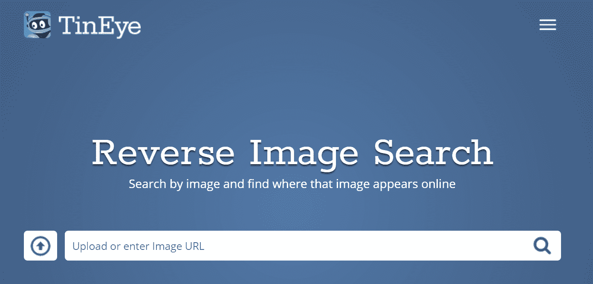](https://tineye.com/)

Reverse image search


我们通过输入一张来自我们更受欢迎的博客帖子的图片，对他们的工具进行了快速测试。在我们的第一次搜索中，我们发现一个第三方网站(将保持匿名)一直在复制我们所有的文章，包括我们所有的图片！很快也很容易。当然，它不会总是找到所有的东西，但它可以是一个很好的起点。注意:TinEye 只打算免费供个人使用，而非商业用途。

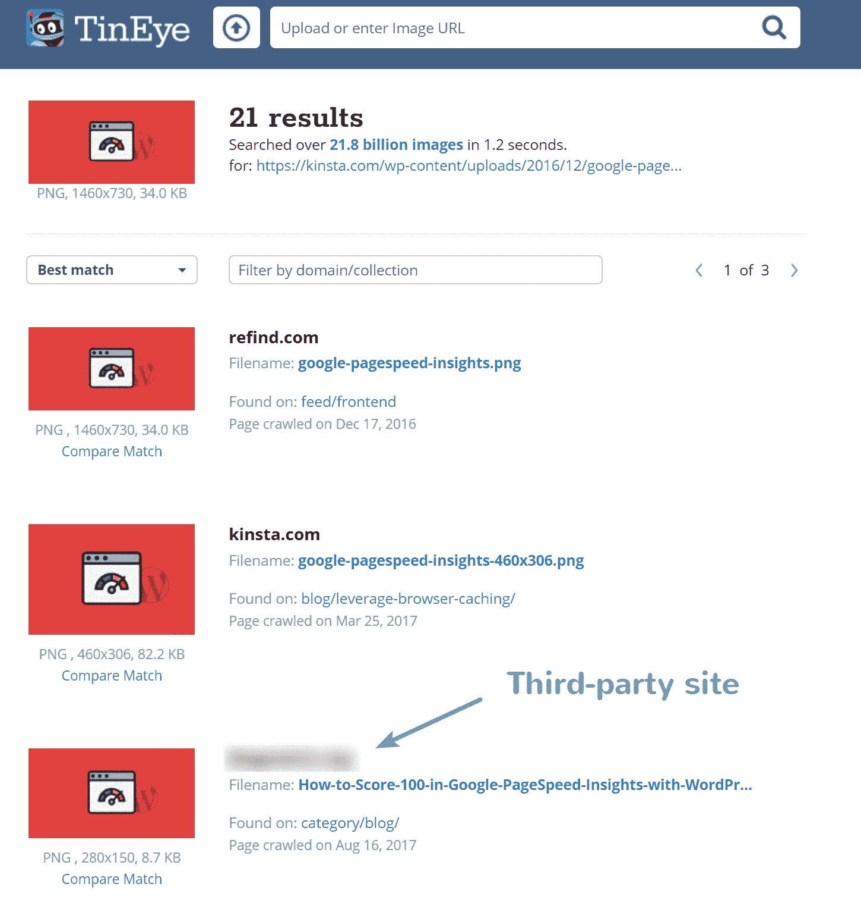

Finding copied image


你也可以做一个[谷歌图片搜索](https://images.google.com/)并输入文件名。有时，如果网站复制了图片，他们不会费心去重命名它，这样你就可以很容易地找到它。正如你在下面的例子中看到的，它使用我们的 [SEO 清单](https://kinsta.com/blog/wordpress-seo/)特色图片返回了一个第三方网站。然而，在这种情况下，它是可以的，因为它是一个链接到我们文章的社交分享网站。

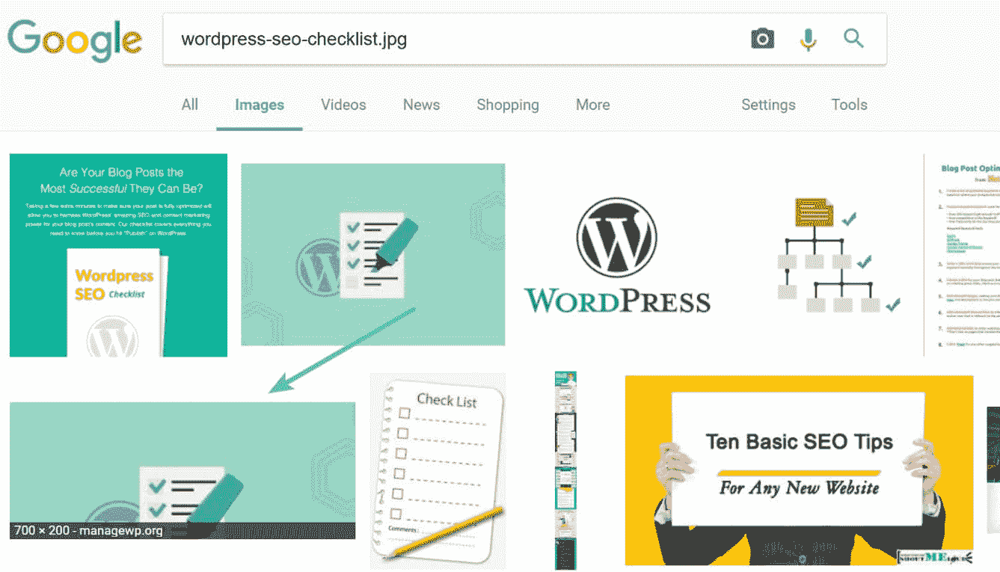

Google image search by filename


您也可以通过点击小相机图标上传图像。然后，它会进行搜索，试图找到类似的图像。

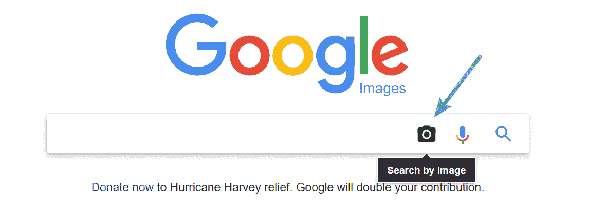

按图像搜索


### 3.利用反向链接监控工具

我们发现复制或窃取图像的第一个方法是**利用反向链接监控工具**。我们喜欢 Kinsta 的 [Ahrefs](https://ahrefs.com/) ，这是一个 SEO 工具(点击这里查看更多:【WordPress 的最佳 SEO 插件和必备 SEO 工具)，你可以用它来做[关键词研究](https://kinsta.com/blog/keyword-research/)，进行竞争对手分析，监控反向链接等等。它拥有网络上最大的数据库之一，我们在很多事情上都依赖于它的数据。

网站通常会在图片上留下链接或者直接链接到图片。这就是所谓的热链接，我们将在下面详细讨论。但是正如你在下面的例子中看到的，我们发现了一个垃圾邮件域，它正在编译各种 PDF 文件，然后将我们的图像复制到其中。这很可能是由刮擦工具完成的。

[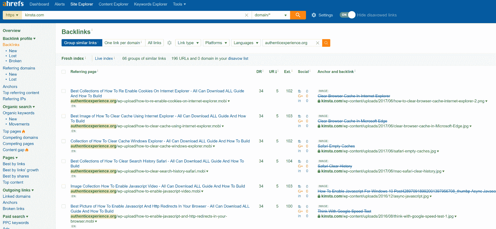](https://kinsta.com/wp-content/uploads/2017/08/ahrefs-backlinks-to-copied-images.png)

Ahrefs backlinks to copied images


这有时会对你的搜索引擎优化造成负面影响。阅读更多关于负面搜索引擎优化以及如何拒绝这些类型的链接。这就是我们在上面的案例中所做的。

## 如何保护图像

现在是时候探索如何保护你的 WordPress 网站上的图片了。实施这些建议中的部分或全部有助于防止盗窃和复制。

### 启用热链接保护

我们建议的第一件事是启用热链接保护。热链接的概念非常简单。你在网上某处找到一张图片，然后直接在你的网站上使用该图片的 URL。此图像将显示在您的网站上，但将从原始位置提供。这对于热链接者来说非常方便，但这实际上是盗窃，因为它使用了热链接网站的资源。这就像如果我们开着自己的车，带着从邻居车里偷出来的汽油离开。

[Hotlinking is like driving away with gas you siphoned off from your neighbor's car. 🚗Click to Tweet](https://twitter.com/intent/tweet?url=https%3A%2F%2Fbit.ly%2F2ApxofO&via=kinsta&text=Hotlinking+is+like+driving+away+with+gas+you+siphoned+off+from+your+neighbor%27s+car.+%F0%9F%9A%97)

热链接是不好的，原因如下:

*   热链接花费了原网站所有者的钱
*   在大多数情况下，热链接是非法的
*   热链接会耗尽原网站所有者的服务器资源
*   热链接只是简单的懒惰

查看我们关于[如何启用热链接保护](https://kinsta.com/blog/hotlinking/)的深度帖子。

### 禁用右键单击图像

你可以使用的另一个策略是禁止右击你的图片。很多用户只需右击他们喜欢的图片，保存到桌面，然后上传到他们的 WordPress 网站。有一个很棒的免费小插件叫做[防止内容盗窃](https://wordpress.org/plugins/disable-right-click/)将有助于阻止这种情况。它目前有 4，000 多个活跃安装，五星评级为 4.5 分。你可以从 WordPress 知识库下载它，或者在你的 WordPress 仪表盘的“添加新插件”下搜索它。没有设置，只需安装，你就可以走了。

[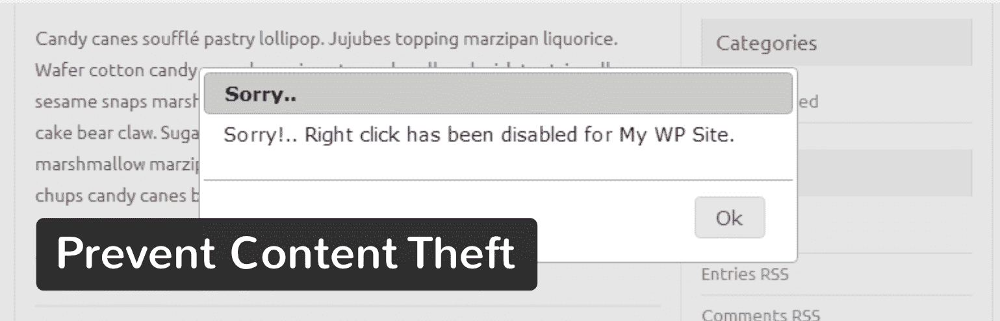](https://wordpress.org/plugins/disable-right-click/)

Prevent Content Theft WordPress plugin


这个插件不仅禁止右击你的图片，也禁止点击整个页面，因此也保护了你的内容。这决不会停止一切，尤其是对那些稍微懂点技术的人来说。但是我们发现大多数复制图片的用户是那些不知道更多的人。我们在我们的开发网站上安装并测试了这个，你可以在下面看到一个例子，当用户试图右键点击一个图像时会发生什么。他们会看到一个通知框，让他们知道这个功能被禁用了。

## 注册订阅时事通讯


### 想知道我们是怎么让流量增长超过 1000%的吗？

加入 20，000 多名获得我们每周时事通讯和内部消息的人的行列吧！

[Subscribe Now](#newsletter)

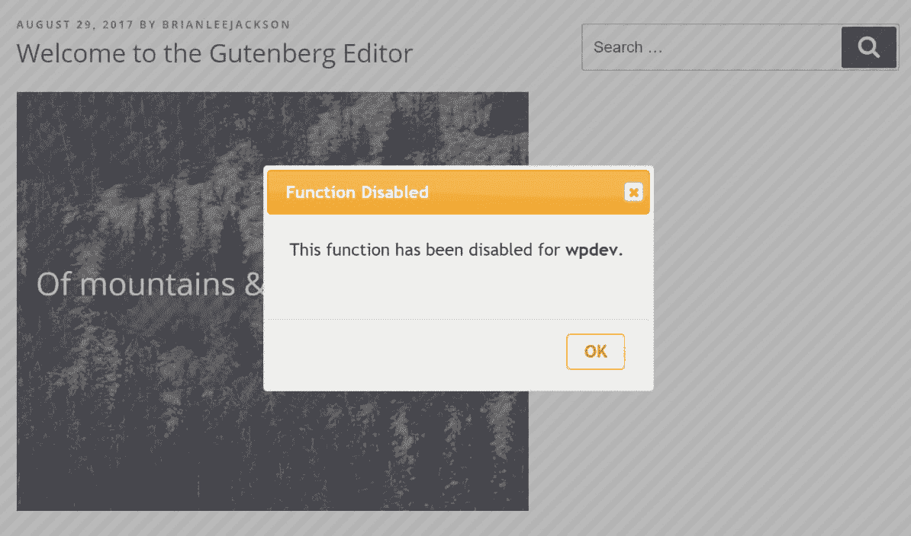

Disable right-click in WordPress


或者你也可以在新的免费[包膜图像](https://wordpress.org/plugins/shrinkwrap-images/)插件中使用这种方法。它没有对提示做任何事情，只是在你的网站上的所有图片上添加了一个微小的、不可见的图片。如果访问者右击你的一张图片，他们会下载清晰的小图片，而不是你的原始图片。

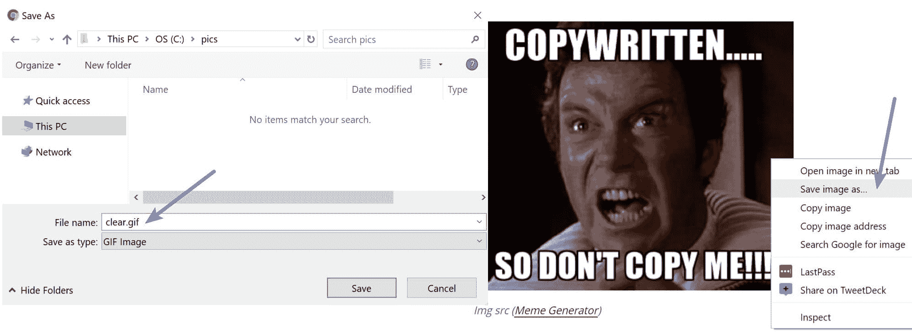

包膜图片示例(Img 来源:[模因生成器](https://memegenerator.net/instance/64833667/khan-copywritten-so-dont-copy-me) )


### 水印图像

你可以采取的另一种方法是给你的图片加水印。这对摄影师来说尤其重要。通过在你的图片上添加你的标志或标记，这可以阻止人们想要复制它们。如果他们这样做了，对你来说就是免费的宣传！当人们在社交媒体上分享你的图片时，水印技术也很有用。

免费的[图像水印](https://wordpress.org/plugins/image-watermark/)插件允许你自动给上传到 WordPress 媒体库的图像加水印，也可以批量给之前上传的图像加水印。它目前有 30，000 多个活跃安装，获得了 4 个五星评级。你可以从 WordPress 知识库下载它，或者在你的 WordPress 仪表盘的“添加新插件”下搜索它。

[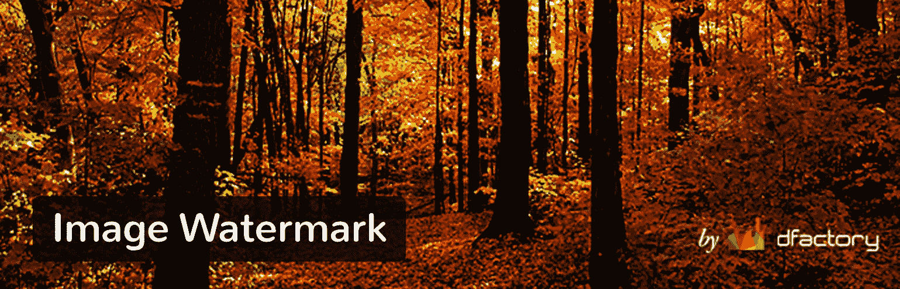](https://wordpress.org/plugins/image-watermark/)

Image Watermark WordPress plugin


安装后，你可以在插件的设置中启用水印(见下面的设置示例)。您可以选择您希望水印出现的位置，上传您的水印图像，设置比例，设置透明度，甚至备份原始图像。这个插件也有基本的图像保护来禁止右键点击。如果你既想禁用右击又想实现水印，这个插件会是一个很好的组合。

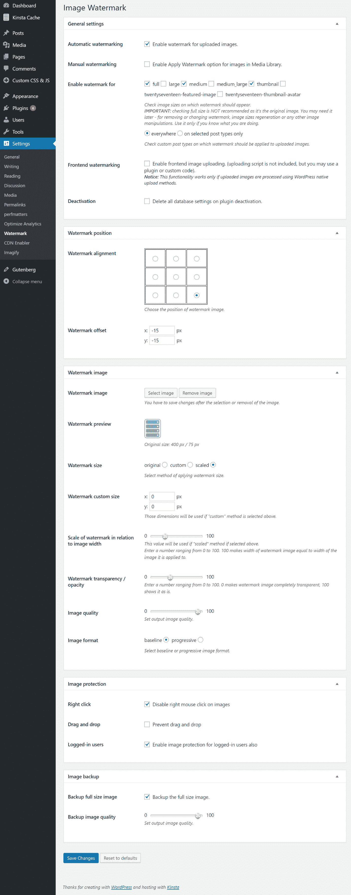

Watermark settings


下面是一个例子，在我们的开发网站上，有一个图像和我们的 Kinsta 徽标作为水印。当我们将图像上传到[媒体库](https://kinsta.com/blog/wordpress-media-library/)时，这被自动应用到图像上。多酷啊。

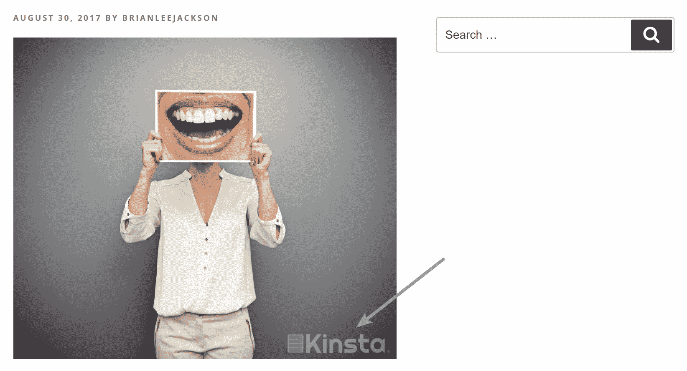

Kinsta watermark


### 添加 DMCA 徽章

DMCA(Digital Millennium Copyright Act)是一部美国版权法，主要针对数字媒体，帮助内容所有者快速有效地删除被盗内容(包括图像)。这延伸到诸如互联网服务提供商(ISP)、网络托管提供商和搜索引擎等地方。一个 [DMCA 撤下通知](https://kinsta.com/blog/dmca-takedown-notice/)适用于内容物理托管的地方。因此，美国以外的人仍然可以向 DMCA 投诉。

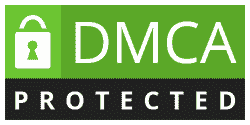

DMCA protected


你可以在你的 WordPress 网站上免费添加一个 [DMCA 徽章](http://www.dmca.com/Badges.aspx?r=m)，尽管他们也提供优质服务。想象一下，就像在你的房子周围安装没有启用的安全摄像头。人们在试图复制你的内容和图片之前可能会三思。还有一个 [DMCA WordPress 插件](https://wordpress.org/plugins/dmca-badge/)。

Struggling with downtime and WordPress problems? Kinsta is the hosting solution designed to save you time! [Check out our features](https://kinsta.com/features/)

### 添加版权声明

最后，在你的 WordPress 网站上有一个版权声明总是好的。从技术上来说，这并不是必需的，因为你发布的所有东西都自动拥有版权，归你所有，但是，建议你这样做。通常版权声明放在网站的页脚。你可以在下面看到我们的一个例子。

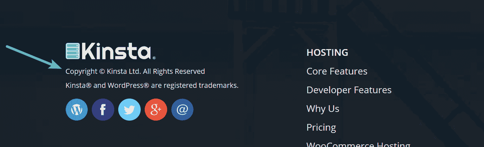

Copyright notice


为了给你的网站添加版权声明，我们建议你首先检查你的 WordPress 主题的文档。他们中的大多数应该有一个简单的方法来改变版权信息。如果没有，您可以将以下内容放入页脚小部件中。

```
<p>Copyright © 2017 Site Title</p>
```

你也可以添加一个动态版权声明到你的 WordPress 站点的页脚，通过添加下面的代码到你的主题的 footer.php 文件中。

```
Copyright ©
<?php $the_year = date("Y"); echo $the_year; ?>
<?php bloginfo('name'); ?>
All Rights Reserved.
```

## 如何处理被盗图像

现在你知道了更多关于如何保护你的网站上的图片，让我们来探讨一下你在事后该做什么。相信我们，这总有一天会发生在你身上。下面是我们在金斯塔使用的方法，效果很好。

### 1.首先分析复制的图像

当你发现有人窃取或复制你的图片时，我们建议你做的第一件事是首先检查确保他们在他们的服务器上托管它。这可以确保它们不会热链接和耗尽服务器的带宽。在 Chrome 中，你可以右击一张图片，点击“Inspect”，它会高亮显示该图片所在的 URL。

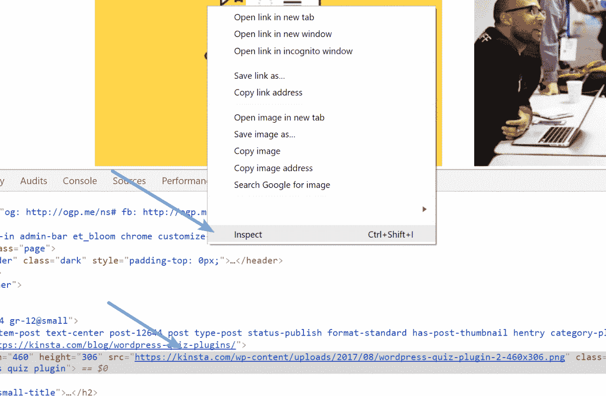

Inspect image


如果它是从他们的服务器加载的，那么看看他们是否给了你一个反向链接(引用你作为一个来源)。如果是的话，那么你可能真的想离开它。如果他们没有推荐你，给他们发一封电子邮件，让他们推荐你，因为这是一个获得免费反向链接的好方法，这对 SEO 来说非常有用。下面是一个模板示例:

```
Hello,

I work for _____ and we noticed you used one of our images in your article here: [link to their post]
You can see that we are the owner of the image here: [link to your original post]

We are OK with you using our image as long as you reference us. Please add a link to [term/phrase] in your article to [link on your site].

If you don't want to add a link we totally understand, but we'll need to ask that you remove the image as this is something created by us.
Thank you, if you have any questions please feel free to ask.

Name
[link to your site]
```

请记住，这仅适用于您创建的图像，而不是您许可的图像。许可证图片仍然需要被删除，因为他们没有使用它的许可。

### 2.发送礼貌的删除电子邮件

如果图片是许可的，或者你不想要反向链接，只是想让他们删除它，我们建议你先发一封礼貌的删除邮件。创建一个任务，然后过几天或几周再来检查。注意:根据我们的经验，这封礼貌的邮件通常可以解决 90%的问题。

```
Hello,

I work for _____ and we noticed you used one of our images in your article here: [link to their post]
You can see that we are the owner of the image here: [link to your original post]

We would kindly ask that you remove and or replace this image.
Thank you, if you have any questions please feel free to ask.

Name
[link to your site]
```

### 3.发送更具攻击性的攻击电子邮件

如果你在第一次尝试后没有收到网站所有者的回复，那么你可以发送一封稍微更具攻击性的删除邮件。根据我们的经验，这通常可以解决剩下的 10%你没有联系的问题。

```
Hello,

I work for _____ and haven't heard back from you regarding my first email.

We noticed you used one of our images in your article here: [link to their post]
You can see that we are the owner of the image here: [link to your original post]

We would kindly ask that you remove and or replace this image. If we don't hear back from you within the next two weeks we will have to file a DMCA complaint.

Name
[link to your site]
```

### 4.提交一份 DMCA 查封通知

最后，如果有必要，你可以申请 [DMCA 下架通知](https://kinsta.com/blog/dmca-takedown-notice/)。这可能是确保它被取下的快速方法。还有，我们有一篇关于这个话题的相关文章: [WordPress 内容抓取](https://kinsta.com/blog/content-scraping/)(反击还是无视？)(对比实例)

## 摘要

作为内容创建者，保护网站上的图像非常重要。如果你付出了辛勤的劳动来创造它，或者支付了费用，第三方没有理由使用它。事实上，在大多数情况下这是非法的。希望现在您已经了解了一些防止这种情况发生的方法，以及当这种情况发生时应该怎么做。

您在图像盗窃方面有什么经历？你一定要发出那些要求搬走的邮件吗？请在评论中告诉我们。

* * *

让你所有的[应用程序](https://kinsta.com/application-hosting/)、[数据库](https://kinsta.com/database-hosting/)和 [WordPress 网站](https://kinsta.com/wordpress-hosting/)在线并在一个屋檐下。我们功能丰富的高性能云平台包括:

*   在 MyKinsta 仪表盘中轻松设置和管理
*   24/7 专家支持
*   最好的谷歌云平台硬件和网络，由 Kubernetes 提供最大的可扩展性
*   面向速度和安全性的企业级 Cloudflare 集成
*   全球受众覆盖全球多达 35 个数据中心和 275 多个 pop

在第一个月使用托管的[应用程序或托管](https://kinsta.com/application-hosting/)的[数据库，您可以享受 20 美元的优惠，亲自测试一下。探索我们的](https://kinsta.com/database-hosting/)[计划](https://kinsta.com/plans/)或[与销售人员交谈](https://kinsta.com/contact-us/)以找到最适合您的方式。