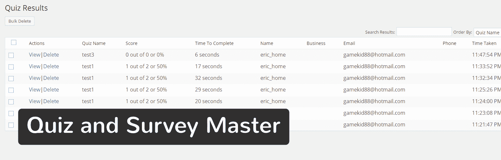
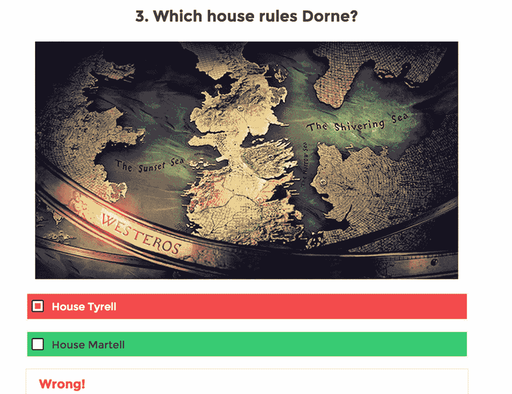
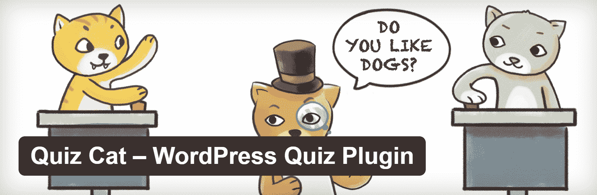
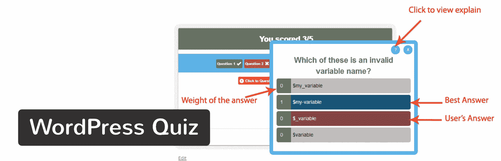
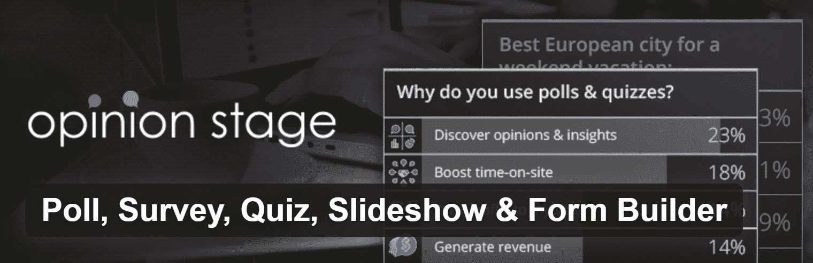
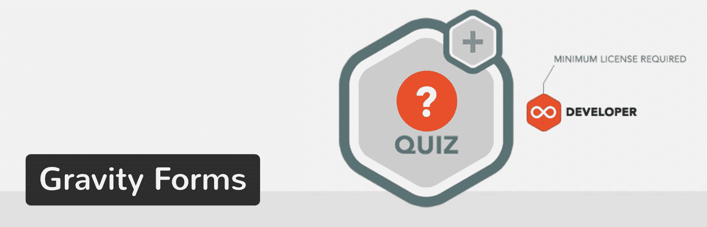
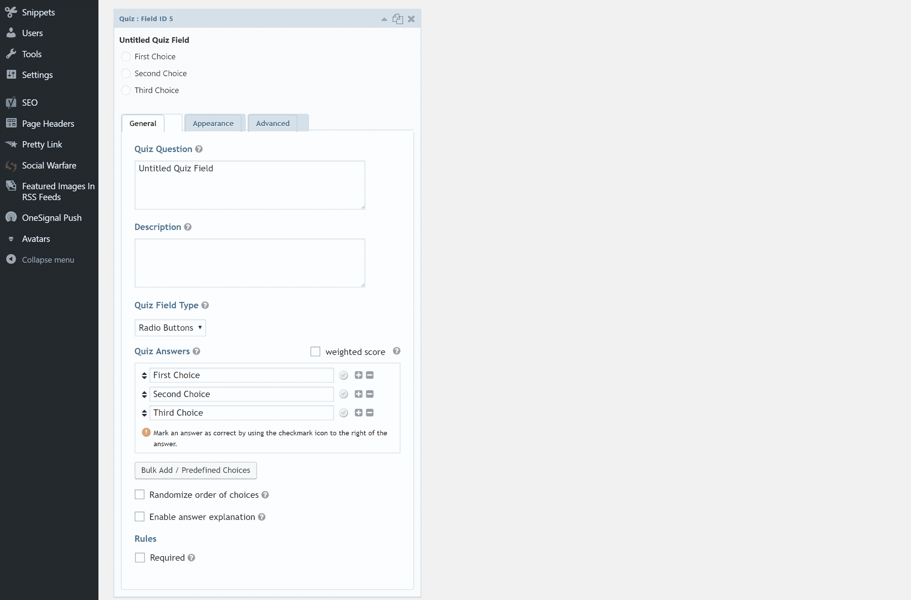

# 增加参与度的 10 大 WordPress 测验插件

> 原文：<https://kinsta.com/blog/wordpress-quiz-plugins/>

有没有想过 BuzzFeed 是如何让访问者停留这么长时间的？这一切都始于以有趣的图像和可浏览的文本为特色的列表条。然后他们扩展到广泛的其他内容，如测验。但 BuzzFeed 也重新设计了这个测试，让它在本质上更直观，更关注用户。例如，你可能会遇到一个类似“你是哈利波特中的哪个角色？”它会根据你的回答给出一个结果。

据 [NewsWhip](https://www.newswhip.com/) 报道，在 BuzzFeed 2017 年 3 月的热门内容中，参与次数最多的前四个故事都是问答游戏！

Quizzes stats

其他网站使用测验已经有一段时间了，看看**测验如何吸引读者并让他们在网站上停留更长时间**。它们可以极大地提高参与度。以 ESPN 为例。体育巨头有持续的测验和调查，关于小熊队或红雀队是否会赢，或者某个足球巨星是否值得名人堂。

好消息是，在你自己的网站上制作和实施一个测验并不需要开发学位。你所需要的是一个可靠的 WordPress 测验插件，用于生成问题、添加答案、插入图片和统计回答。

一些 WordPress 问答插件提供了额外的功能，比如投票和调查，而其他的看起来更像是带有电子邮件捕获、表单构建和幻灯片工具的完整套件。从基本的测验生成器到现代 BuzzFeed 风格的测验，您有大量选项可供选择。

所以，继续阅读，了解最好的 WordPress 测试插件。

## 利用 WordPress 测验插件的理由

对于许多网站管理员来说，在博客或商业网站上进行测验或调查是一种事后想法。他们更专注于完成订单、创建博客文章和开发网站。

Reasons to Take Advantage of a WordPress Quiz Plugin

然而，一个 WordPress 测验插件使得安装和实现过程变得容易，在这个过程中打开了更多的内容创作的可能性。想出与你的读者互动的新方法是很难的，但是小测验不仅对用户来说很有趣，而且还能吸引人们，让他们停留更久。

> Kinsta 把我宠坏了，所以我现在要求每个供应商都提供这样的服务。我们还试图通过我们的 SaaS 工具支持达到这一水平。
> 
> <footer class="wp-block-kinsta-client-quote__footer">
> 
> 
> 
> <cite class="wp-block-kinsta-client-quote__cite">Suganthan Mohanadasan from @Suganthanmn</cite></footer>

[View plans](https://kinsta.com/plans/)

让我们来看看你的公司应该使用 WordPress 测试插件的主要原因:

*   你可以通过让用户在你的网站上停留更长的时间来降低跳出率。跳出率是考虑到你的搜索引擎优化，所以这可以帮助提高你的排名。
*   它给你的访问者一些有趣、有教育意义或相关的事情做。
*   测验提高你的转化率因为客户通过测验了解你的公司。此外，他们存在的时间更长，所以他们最终可能会购买产品，点击广告或注册你的电子邮件列表。
*   **测验一定会获得大量的[社交媒体分享](https://kinsta.com/blog/wordpress-social-media-plugins/)** ，这会让你的博客和整个网站出名。
*   当你有一个小测验时，你更有可能在评论区得到参与的机会。
*   有些测验是用来测试用户知识的，比如你在经营一所学校或一门课程，需要知道是否接受一名学生。
*   测验可以捕捉线索。根据 LeadQuizzes 的调查，一般的测验有一个 [33.6%的线索捕获率](https://blog.leadquizzes.com/leadquizzes-2016-year-in-review)。

正如你所看到的，一个简单的 WordPress 测试插件为你的在线商店、博客或小企业打开了各种各样的机会。最酷的是，它们中的大多数都是免费的，或者至少很便宜。

也就是说，继续阅读，找到最好的 WordPress 测试插件。

## 2022 年最好的 WordPress 问答插件

下面列出了主要的细节，但是如果你赶时间，这里有一个最好的 WordPress 问答插件的快速列表(排名不分先后)。

*   [测验和调查大师](#quiz-survey-master)
*   [WordPress 病毒性问答——BuzzFeed 问答生成器](#wordpress-viral-quiz)
*   [智力竞赛猫](#quiz-cat)
*   [WP 小测验](#wp-quiz)
*   [Ari 流测验](#ari-stream-quiz)
*   [通过谜语捕获电子邮件的无限测验生成器](#unlimited-quiz-builder)
*   [WordPress 测验](#wordpress-quiz)
*   [投票、调查、测验、幻灯片放映和表单生成器](#poll-survey-quiz-builder)
*   [Gravity Forms 测验插件](#gravity-forms-quiz-add-on)

### 1。测验和调查大师

[测验和调查主插件](https://wordpress.org/plugins/quiz-master-next/)有评级和评论，让大多数人扣动扳机。在设计测验和调查时，你也会得到一些令人印象深刻的功能。WordPress 测验插件有一个简单的生成器，可以选择单选按钮、评论和复选框。

Quiz And Survey Master WordPress plugin

如果你不想让用户花费一整天的时间，你可以添加一个计时器，插件允许在测验中插入媒体。还有一个高级计划，或者您可以单独下载高级附加组件。

#### 这个 WordPress 测验插件的好处

*   您并不局限于不能添加媒体的模块。例如，你可能想让考生在提问前先看一段视频，但是一些测验插件限制了这种功能。测验和调查大师的工作方式类似于普通的博客文章。
*   如果计时器被激活，用户会在浏览器选项卡中看到它，以防他们离开测验。
*   电子邮件在测验或调查完成后发出。
*   通过选择你想要的特性，你可以选择不为整个高级插件付费。
*   一些高级功能包括登录页面、导出结果、报告和 MailChimp 集成。
*   它有一些有趣的特性，比如对用户和登录要求的提示。

#### 这个 WordPress 测验插件的缺点

*   对于一个插件来说，高级计划是相当昂贵的。
*   插件有时可能会与你的主题冲突，导致它的显示方式出现问题。

### 2。WordPress 病毒测验 BuzzFeed 测验生成器

在这个列表中，我们有一些 BuzzFeed 风格的测验构建者，但是 [WordPress 病毒式测验解决方案](https://codecanyon.net/item/wordpress-viral-quiz-buzzfeed-quiz-builder/11178623)击败了其他人。CodeCanyon 上有卖，你只要一次性付款就行了。这些小测验看起来和你在 BuzzFeed 上找到的几乎一模一样，有大的缩略图，最后有多个结果机会。

WordPress Viral Quiz plugin

至于定制工具，不需要花太多时间就能弄清楚插件是如何工作的。更不用说，这种病毒式的能力足以让大多数网站管理员加入 WordPress 病毒式问答游戏。

#### 这个 WordPress 测验插件的好处

*   它有一个内置的电子邮件捕获模块，让更多的人注册你的通讯。
*   您可以创建个性和琐事测验。性格测试题往往会在脸书上疯传，而琐事测试题则在推特上很受欢迎。
*   该插件提供了一个工具，要求用户在社交媒体上分享他们想要看到的测验结果。
*   您可以检查分析，以了解测验的准确表现。
*   在测验周围插入广告，并启用刷新浏览器功能，以随着时间的推移带来更多的钱。

WordPress Viral Quiz

#### 这个 WordPress 测验插件的缺点

*   你只限于 BuzzFeed 风格的测验，所以如果你不想要个性或琐事测验，你应该去别处看看。
*   开发者对这些功能进行了大量宣传，但许多访问者会发现强制的社交分享和浏览器刷新令人讨厌。
*   营销工具仅限于测验后的情况。所以，你不能在用户开始测验前要求发邮件。
*   一些著名的电子邮件营销平台不受支持。

### 3。智力竞赛猫

测验猫有和 BuzzFeed 相似的测验，但是有一点灵活性。您可以将图像添加到测验中，同时还可以利用无限的问题、自定义完成消息和随机洗牌的测验答案。

Quiz Cat

基本的功能是免费的，但是你可以选择[来升级](https://fatcatapps.com/quizcat/pricing/),只需支付一定的一次性费用。例如，一个网站的计划售价为 49 美元，但你只能获得两个额外的功能:个性问答和社交分享。

#### 这个 WordPress 测验插件的好处

*   界面在前端和后端都是干净的。它融合了所有 WordPress 主题，在移动设备上看起来非常棒。
*   它有独特的工具，如洗牌的答案，并在最后提供信息。
*   你可以将测验翻译成任何语言。
*   他们有一些很酷的高级功能，如电子表格导出、脸书像素集成和电子邮件营销。

#### 这个 WordPress 测验插件的缺点

*   虽然测验可以被翻译，但实际的插件只有英语版本(截至目前)。
*   调整测验语言需要使用过滤器。简而言之，不适合初学者。
*   测验在各自独立的模块中运行，因此您会受到媒体和其他格式的限制。

### 4。WP 测验

[WP 竞猜](https://mythemeshop.com/plugins/wp-quiz/)有免费版和 [Pro 版](https://mythemeshop.com/plugins/wp-quiz-pro/)。它让你能够开发琐事和个性测验，所有这些都是为了传播。这是一个完全响应的插件，你可以把它放在无限多的网站上。

WP Quiz

专业版标价 87 美元，它还包括一些附加功能，如导出测验的能力。

## 注册订阅时事通讯

### 想知道我们是怎么让流量增长超过 1000%的吗？

加入 20，000 多名获得我们每周时事通讯和内部消息的人的行列吧！

[Subscribe Now](#newsletter)

#### 这个 WordPress 测验插件的好处

*   免费版有很多令人难以置信的功能，并支持增加无限的测验。
*   您可以添加翻转测验效果，以便用户每当完成一个问题时都能看到动画(类似于翻转闪存卡)。
*   有一个领域包括一个形象信用，保持你的操作在任何时候都合法。
*   该插件有定制工具，用于改变进度条颜色，动画效果，字体颜色和背景颜色。

#### 这个 WordPress 测验插件的缺点

*   你只限于个性和琐事测验。
*   一些网站管理员可能会发现定价有点高。

### 5 。Ari 流测验

考虑到 Ari Stream 测验是免费的，并且您可以通过测验生成器接收一些电子邮件捕获设置，因此它很有冲击力。电子邮件引导表集成了最流行的电子邮件营销工具([如 MailChimp](https://kinsta.com/blog/how-to-use-mailchimp/) 和 AWeber，)，你可以建立个性和琐事测验。

Ari Stream Quiz WordPress plugin

提供一些高级套餐，起价 17 美元。这为多个页面提供了功能，显示结果页面等等。

#### 这个 WordPress 测验插件的好处

*   你可以鼓励人们在社交媒体上分享测验。
*   电子邮件营销工具一定会增加你名单上的人数。
*   他们实际上通过一个免费插件提供高级支持。
*   高级计划具有“强制分享”功能和更好的社交分享工具。

Ari Stream Quiz

#### 这个 WordPress 测验插件的缺点

*   你只限于个性和琐事测验。
*   虽然测验支持媒体，但为了做到这一点，需要使用 HTML 代码。

### 6 。无限问答生成器，通过谜语捕获电子邮件

如果除了流行的个性和琐事测验，你还想要一些灵活性，[无限测验生成器](https://wordpress.org/plugins/riddle-playful-content-on-the-go/)有额外的选项，如列表、定期测验和投票。该计划起价为每月 7 美元，因此它最终成为最昂贵的 WordPress 问答插件之一。

Unlimited Quiz Builder with Email Capture by Riddle

然而，功能是有的，有电子邮件捕捉、快速图像裁剪、社交分享和 gif 搜索工具。

Struggling with downtime and WordPress problems? Kinsta is the hosting solution designed to save you time! [Check out our features](https://kinsta.com/features/)

#### 这个 WordPress 测验插件的好处

*   他们有一个很好的搜索栏来查找图片、[gif](https://kinsta.com/blog/wordpress-gifs/)和迷因，这些肯定会被分享很多。
*   该插件集成了 MailChimp、AWeber、Zapier 和大多数 CRMs 等服务。
*   你可以建立[李克特量表](https://en.wikipedia.org/wiki/Likert_scale)测验。
*   你不必在上传之前考虑编辑照片，因为插件内置了一个可靠的编辑工具。

#### 这个 WordPress 测验插件的缺点

*   尽管这个插件更加专业，但它仍然有 BuzzFeed 的风格，这可能不是一些用户想要的。
*   在这个插件市场中，每月的重复支付违背了一次性支付的趋势。

### 7 。WordPress 测验

如果你正在寻找一个干净、现代的测验，而不是疯狂的病毒式分享和个性测验，那么 WordPress 测验是你最好的选择之一。对于想要为客户甚至是需要进行入学考试的学校制作小测验的普通企业来说，这是一个可行的选择。

WordPress Quiz plugin

#### 这个 WordPress 测验插件的好处

*   它摆脱了时髦的 BuzzFeed 问答游戏风格。
*   可以随机排序问题和答案。
*   它允许你在同一页上放置多个测验。这是一个罕见的特征。
*   统计数据显示在后端，使用图表和细分数据进行未来分析。
*   定价仅为 19 美元。
*   用户可以在接受测验后向所有者提交他们的分数。

#### 这个 WordPress 测验插件的缺点

*   如果你正在寻找一个病毒式的，有趣的个性测验生成器，这不是你想要的插件。
*   该插件缺少积分系统。所以，如果你想让一些问题有更高的分值，你必须去别处看看。

### 8 。投票、调查、测验、幻灯片放映和表单生成器

顾名思义，[这个 WordPress 测验插件](https://wordpress.org/plugins/social-polls-by-opinionstage/)支持投票、调查、测验、幻灯片和表格。此外，对于生动的博客测验来说，这是一个很好的选择，但是你也可以做一些更专业的东西。

Poll, Survey, Quiz, Slideshow and Form Builder

#### 这个 WordPress 测验插件的好处

*   在所有的测验中添加引人入胜的按钮和有趣的媒体。
*   用调查、幻灯片和表格来补充你的测验。
*   将广告整合到你的测验中，通过这个过程赚钱。
*   自定义字体、颜色和测验尺寸。
*   你不需要为这个 WordPress 问答插件支付任何费用。
*   开发人员收集了一些顶级测验，供您寻找灵感。

#### 这个 WordPress 测验插件的缺点

*   你只限于琐事和结果测验。
*   你必须通过远程站点注册，这使得设置过程有点困难。

### 9 。重力表格测验附加组件

如果你有流行的 Gravity Forms contact form 插件的开发者许可，你也可以使用他们的官方[测验插件](http://www.gravityforms.com/add-ons/quiz/)。

Gravity Forms Quiz add-on

测验功能可在“高级字段”部分找到。

Gravity Forms Quiz options

#### 这个 WordPress 测验插件的好处

*   因为这是一个高级插件，所以你可以从 Gravity Forms 团队获得很大的支持和更新。
*   轻松地将测验整合到您已经习惯使用的现有表单中。
*   选择正确和错误的答案，加权分数，随机选择顺序，并提供答案解释。

#### 这个 WordPress 测验插件的缺点

*   需要开发者许可，起价 199 美元。
*   没有其他插件那么多的可视选项，但是如果你是一个开发者，你可以让它做任何事情。

## 有没有最适合你的 WordPress 问答插件？

WordPress 测试插件有点像选择主题。您希望它看起来适合您的品牌，并具有您每天都会使用的内置功能。例如，BuzzFeed 风格的测验插件不适合教育机构和更严肃的企业。这些 WordPress 问答插件在有趣的博客上看起来更好。

### 以下是一些关于搭配哪个测验插件的想法:

*   我们喜欢测验和调查大师和 WordPress 测验的基础和专业测验。
*   这些是我们最喜欢的病毒式(BuzzFeed 风格)问答游戏:WordPress 病毒式问答游戏、问答游戏猫和 WP 问答游戏。
*   预算有限的人应该选择 WP 测验、Ari 流或测验和调查大师。
*   那些不在乎经常性付款的人绝对应该考虑通过谜语捕获电子邮件的无限测验生成器。
*   如果你是一个有客户的开发者，你可能想看看 Gravity Forms 测验插件。

你有它！如果你在完成你的 WordPress 测试插件搜索时想到任何问题，请在下面的评论中告诉我们。

* * *

让你所有的[应用程序](https://kinsta.com/application-hosting/)、[数据库](https://kinsta.com/database-hosting/)和 [WordPress 网站](https://kinsta.com/wordpress-hosting/)在线并在一个屋檐下。我们功能丰富的高性能云平台包括:

*   在 MyKinsta 仪表盘中轻松设置和管理
*   24/7 专家支持
*   最好的谷歌云平台硬件和网络，由 Kubernetes 提供最大的可扩展性
*   面向速度和安全性的企业级 Cloudflare 集成
*   全球受众覆盖全球多达 35 个数据中心和 275 多个 pop

在第一个月使用托管的[应用程序或托管](https://kinsta.com/application-hosting/)的[数据库，您可以享受 20 美元的优惠，亲自测试一下。探索我们的](https://kinsta.com/database-hosting/)[计划](https://kinsta.com/plans/)或[与销售人员交谈](https://kinsta.com/contact-us/)以找到最适合您的方式。