# 12 个最佳 WordPress PDF 浏览器插件

> 原文：<https://kinsta.com/blog/wordpress-pdf-viewer-plugins/>

假设你是一名教师，有一个简单的 WordPress 网站。你对新学年感到兴奋，但你想给你的学生一些数字友好的文档，让他们准备上课和理解材料。你的第一项任务是与整个学期的所有作业和测验分享课程的主题。你有 PDF 文件，但是你不能把它打印成一篇博客文章或页面。

为什么 WordPress 没有一个 PDF 浏览器，访问者可以查看完整的 PDF 文件，如果他们想的话还可以下载？WordPress 有很多功能，但是 PDF 浏览器不在其中。幸运的是，WordPress PDF viewer 插件的精彩世界来拯救我们了。

## 什么是 WordPress PDF Viewer 插件，你什么时候会使用它？

以我们上面的老师和标题为例。在这种情况下，在班级网站上没有什么可以替代一个可查看和可打印的 PDF。有可能，一半的学生会扔掉打印的讲义，将 PDF 内容复制并粘贴到博客帖子中的想法是一个格式化和打印的噩梦。

PDF 在很多情况下都很棒，一个 PDF 插件允许你在 WordPress 页面中嵌入一个完整的 WordPress PDF 查看器。

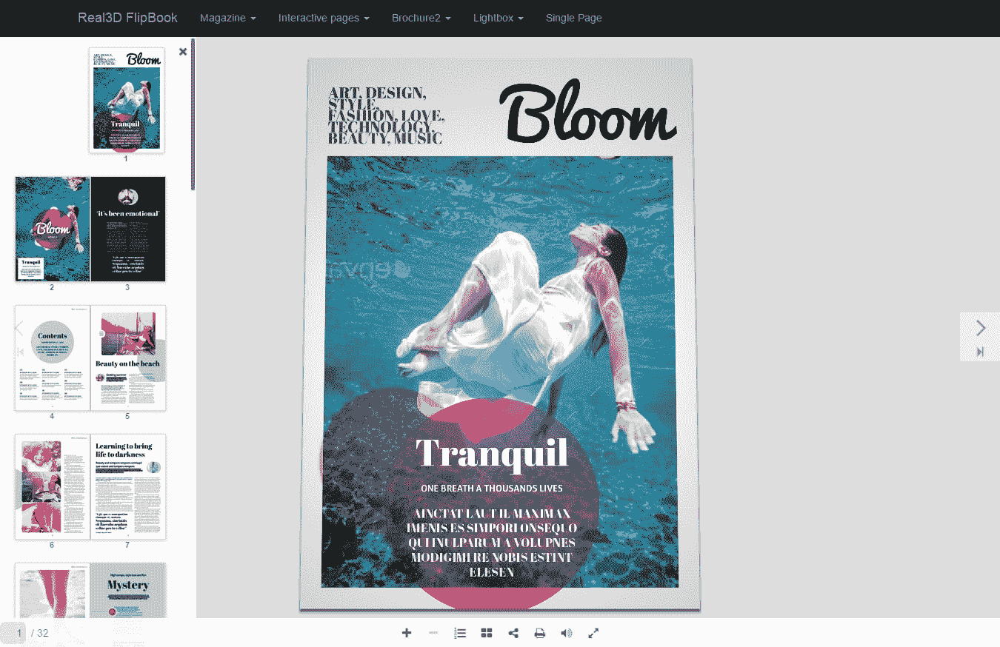

WordPress PDF viewer

这样，你的访问者可以像真正的文档一样翻阅页面，同时还可以放大、做笔记，并在需要时打印出文档。一些 PDF 插件提供了其他有用的工具，用于将博客文章转换成 PDF 或者为你上传到 WordPress 博客的 PDF 生成封面图片。

简而言之，标准的 PDF 查看器使用户能够查看 PDF，就像文件保存在他们自己的计算机上一样。他们获得了 PDF 应有的功能，以及 WordPress 插件开发者提供的其他一些方便的特性。

### 您何时会使用 PDF 查看器插件？

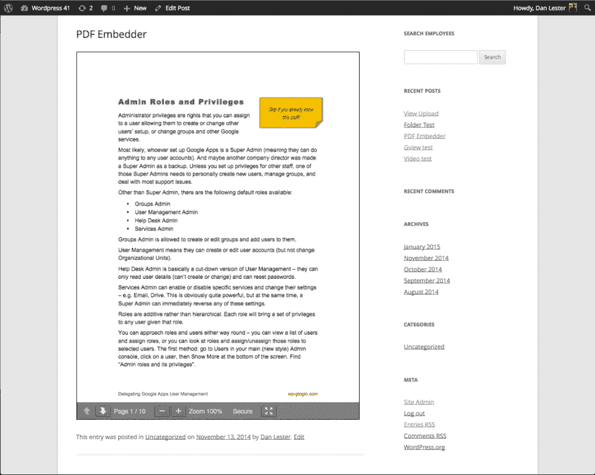

When to use a WordPress PDF viewer

*   当您已经将一个大文档格式化并制作成 PDF 时。重写或重整将是一种浪费。
*   用于显示看起来像博客帖子或页面的大型文档。
*   如果您需要共享不应被下载者修改的文档链接。从技术上来说，你可以将 PDF 转换成可编辑的文档，但是有办法保护 PDF 或者至少使它们更难修改。
*   当您共享需要许多人签名和注明日期的文档时。例如，一个房地产经纪人可以将同一份合同发送给数百名客户，或者让他们从网站上下载。
*   如果你想在网上分享一些东西，但不想被搜索引擎发现。一个例子可能是一本电子书，你宁愿保护内容，而不是让搜索引擎抓取它。
*   当你需要根据你当前的网站内容生成一个 PDF 文件时，比如你想把一系列的博客文章变成电子书。

## 2019 年最佳 WordPress PDF 查看器

为了帮助你筛选所有可用的选项，这里有 12 个最好的 WordPress PDF Viewer 插件值得一看(排名不分先后)。

> 需要在这里大声喊出来。Kinsta 太神奇了，我用它做我的个人网站。支持是迅速和杰出的，他们的服务器是 WordPress 最快的。
> 
> <footer class="wp-block-kinsta-client-quote__footer">
> 
> 
> 
> <cite class="wp-block-kinsta-client-quote__cite">Phillip Stemann</cite></footer>

[View plans](https://kinsta.com/plans/)

*   [PDF 嵌入器](#pdf-embedder)
*   [谷歌文档嵌入器](#google-doc-embedder)
*   【WordPress 的 PDF 浏览器
*   [PDF.js 浏览器简码](#pdf-js-viewer-shortcode)
*   [WP 小册子](#wp-booklet)
*   [流纸](#flowpaper)
*   [普通 PDF 嵌入](#vanilla-pdf-embed)
*   [PDF 浏览器](#pdf-viewer)
*   [PDF 并由 BestWebSoft 打印](#pdf-print-bestwebsoft)
*   【WooCommerce 的 PDF 标签
*   [Real3D 动画书 WordPress 插件](#real3d-flipbook)
*   [嵌入 PDF 浏览器](#embed-pdf-viewer)

### 1。PDF 嵌入程序

PDF 嵌入器插件已经存在一段时间了，这是在网站上展示 PDF 的最干净的方式之一。PDF Embedder 的免费版本包括您需要的大多数功能，包括快速上传按钮、PDF 嵌入功能和常规导航按钮。

[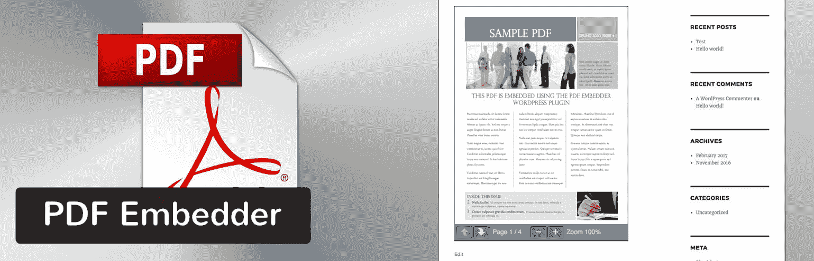](https://wordpress.org/plugins/pdf-embedder/)

PDF Embedder plugin

如果您需要高级功能，如移动友好、全屏按钮和页面跳转技术，[PDF Embedder](https://wp-pdf.com/premium/)的高级版本正适合您。

#### 为什么这个 PDF 查看器很棒

*   PDF 上传只需简单点击一下。
*   您的 PDF 会根据屏幕的大小吸附到位。您也可以手动调整尺寸。
*   该插件仅使用 JavaScript 进行显示，因此观看体验比使用 [iframes](https://kinsta.com/blog/wordpress-iframe/) 要流畅得多。
*   您可以获得全屏模式、PDF [安全](https://kinsta.com/blog/wordpress-security/)和连续滚动页面等高级功能。
*   该插件的高级版本只有少量的一次性付款。

#### 不利之处

*   免费版本不保护你的任何内容，所以如果有人想的话，可以从技术上来获取你的 PDF 文件。当然，你可以升级到高级版来解决这个问题。
*   翻页按钮很小，位于屏幕左下角的一个奇怪位置。

### 2。谷歌文档嵌入器

使用 [Google Doc 嵌入器](https://wordpress.org/plugins/google-document-embedder/)的主要好处是它支持广泛的文件类型。你不需要把你的文件转换成 Google Docs，但是我假设这个插件创建的时候就是这样的。你不会得到一个谷歌文档嵌入器的高级版本，所以所有的功能都是免费的。

[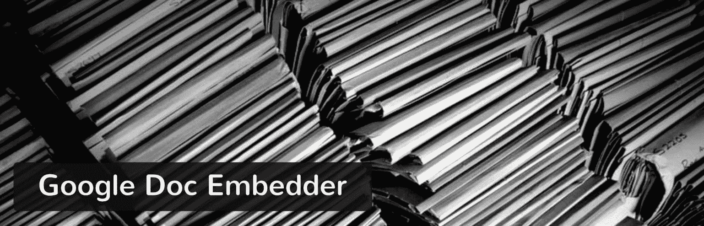](https://wordpress.org/plugins/google-document-embedder/)

Google Doc Embedder Plugin

至于最酷的功能，请查看以下内容:

#### 为什么这个 PDF 查看器很棒

*   一个快速嵌入按钮出现在你的 WordPress 文章编辑器中。因此，您可以在撰写帖子时添加 pdf 和其他文件。
*   该插件支持从 pdf 到 Word 文档，从 PSD 到 OTF 的所有内容。文件支持很可能是你选择 Google Doc embedded er 的原因。
*   这个插件目前被翻译成十种不同的语言，允许更多的人在他们的网站上访问和使用这个插件。
*   如果这更符合您的风格，您也可以选择使用短代码。

#### 不利之处

*   这个插件的大部分功能依赖于 Google 托管你的文档。通常，你对此没有问题，但是从技术上来说，你不能完全控制你的内容。简而言之，pdf 文件不是托管在你自己的服务器上，所以它们从来都不是完全安全的。
*   它没有上传本地文档的功能，所以你需要上传你的文档，然后复制并粘贴一个 URL。这是一种有点过时的做事方式。

我们在这里收集了如何将谷歌文档导入 WordPress 的六种方法，如果你感兴趣的话，一定要看看。

你不必在 PDF 插件和更快的页面加载时间之间做出选择。[免费试用 kin sta](https://hubs.ly/H0pklC_0)。

### 3。WordPress 的 PDF 查看器

只需支付 17 美元，你就可以获得你和你的访问者需要的大部分 WordPress PDF viewer 功能。事实上， [PDF Viewer for WordPress](https://codecanyon.net/item/pdf-viewer-for-wordpress/8182815) 是市场上最强大、功能最丰富的浏览器插件之一。

PDF Viewer for WordPress plugin

它完全响应，所以你所有的 PDF 文件都可以很好地显示在每台设备上。初学者使用该插件不会有任何问题，因为它有一个快速嵌入功能，支持无限的 PDF 文件和大小。

#### 为什么这个 PDF 查看器很棒

*   它可以被翻译成 100 多种语言。
*   该插件连接到谷歌分析来跟踪有多少人阅读和下载你的 pdf 文件。
*   文档中支持书签和链接。
*   如果您想以这种方式插入 pdf，可以使用短代码。
*   开发者在这个领域提供了一些最好的支持和文档。

#### 不利之处

*   WordPress 插件的 PDF 查看器没有任何保护 PDF 的工具。

### 4。PDF.js 查看器短代码

虽然名字最差， [PDF.js Viewer Shortcode](https://wordpress.org/plugins/pdfjs-viewer-shortcode/) 在以漂亮的方式显示您的 PDF 时仍然毫不逊色。事实上，这个查看器的用户端肯定是争夺头把交椅的。它有一个优雅的灰色主题框架和一个文档大纲，供人们从一页跳到另一页。

## 注册订阅时事通讯

### 想知道我们是怎么让流量增长超过 1000%的吗？

加入 20，000 多名获得我们每周时事通讯和内部消息的人的行列吧！

[Subscribe Now](#newsletter)

[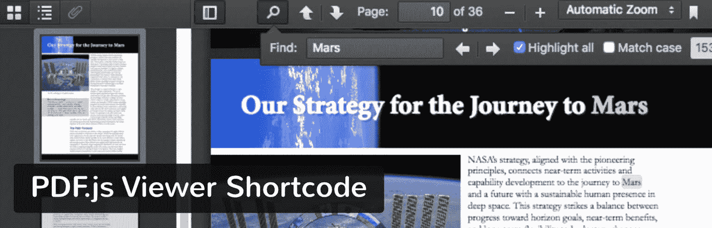](https://wordpress.org/plugins/pdfjs-viewer-shortcode/)

PDF.js Viewer Shortcode plugin

更不用说，它是完全免费的，一路上没有任何追加销售。

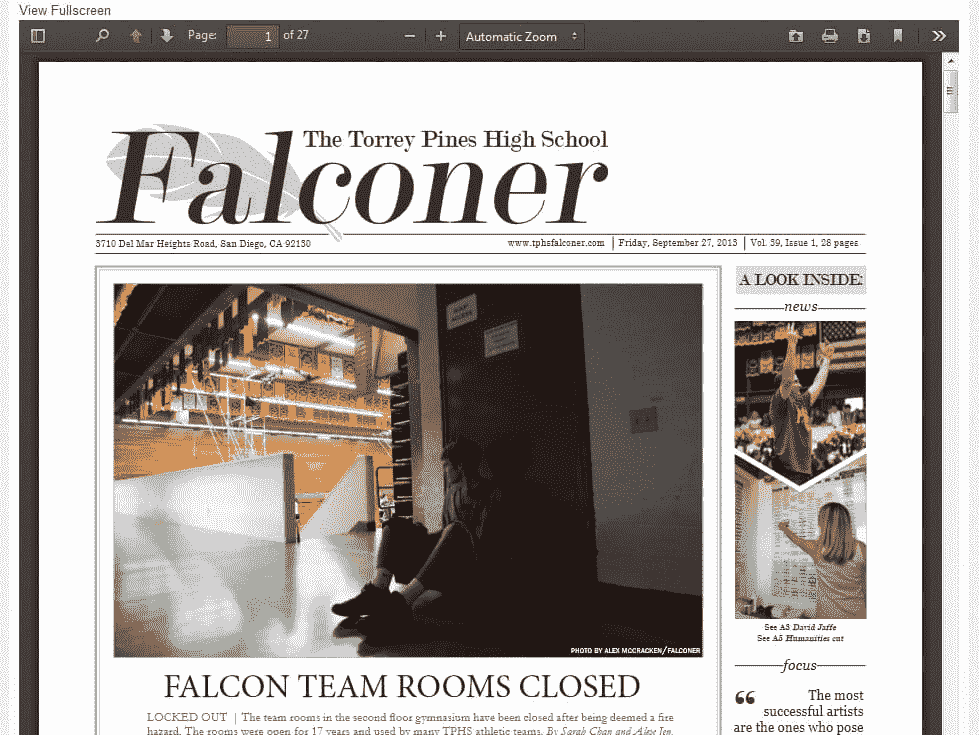

PDF.js Viewer Shortcode plugin

#### 为什么这个 PDF 查看器很棒

*   文档大纲显示每页的内容，允许用户快速浏览。
*   这是为数不多的具有可定制按钮的 PDF 阅读器之一。
*   您可以使用密码保护您的 pdf。
*   这个插件有一个类似于图片延迟加载的特性，一个大的文档直到导航到特定的页面才会完全显示出来。这个[保持你的网站速度快](https://kinsta.com/blog/gtmetrix-speed-test/)。

#### 不利之处

*   一些用户报告了[安全和缓存插件](https://kinsta.com/blog/uninstall-wordpress-plugin/)冲突的问题。
*   一些 Internet Explorer 用户在浏览器中查看 pdf 时遇到问题。

### 5。WP 小册子

WP Booklet 专注于精致的杂志风格显示，使用翻转动画和页面弹出来模仿现实生活中阅读小册子或杂志。这绝对是 Real3D 动画书的一个淡化版本(见下文)，但它不用你付钱就能完成工作。

WP Booklet plugin

该插件支持 pdf 和图像，因此照片动画书也是完全可能的。他们甚至提供了一些模板来帮助你开始。

WP Booklet plugin

#### 为什么这个 PDF 查看器很棒

*   对于不想弄乱任何设置或设计的初学者来说，这些模板很方便。
*   可以批量上传 pdf 和[图片](https://kinsta.com/blog/optimize-images-for-web/)。
*   页面缩略图帮助用户浏览文档。

#### 不利之处

*   更改“动画书”的样式需要访问站点文件，这是一件非常麻烦的事情。
*   显然，上传 PDF 按钮对某些用户来说是不显示的。
*   与列表中其他 WordPress PDF 阅读器的显示相比，它不是最漂亮的。

### 6。流动纸

Flowpaper 有一个高级外观的 WordPress PDF 浏览器，没有任何价格标签。它看起来不错，但后端控制远非用户友好。如果你是一个更高级的开发者，想要一个漂亮的、免费的 PDF 浏览器，这可能是适合你的。如果您是初学者，您可能会被代码定制和存储限制绊倒。

[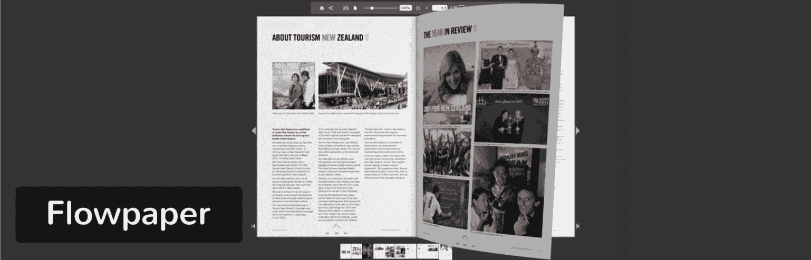](https://wordpress.org/plugins/flowpaper-lite-pdf-flipbook/)

Flowpaper WordPress plugin

#### 为什么这个 PDF 查看器很棒

*   用户有三个在线获取 pdf 的选项。其中一个包括在其他地方托管 PDF 并粘贴链接。另一个可以让你上传到 WordPress。第三个选项是将 PDF 上传到 Flowpaper 云。

#### 不利之处

*   如果你不把你的 pdf 文件放在 Flowpaper cloud [上，那么你的每份出版物的容量将被限制在 15MB】。](https://kinsta.com/blog/increase-max-upload-size-wordpress/)
*   众所周知，Flowpaper 并不支持所有开箱即用的浏览器和设备。不过，有一些方法可以解决这个问题。
*   PDF 嵌入流程要求您使用短代码。有些人可能宁愿有一个快速上传按钮，将 PDF 文件放入帖子中，而不需要代码。
*   所有自定义都必须通过编辑代码来完成。

### 7。普通 PDF 嵌入

这个 PDF 浏览器被称为香草是有原因的。基本的、极简的用户界面在你的帖子里放了一个 PDF，没有任何花哨的东西。没有高级版本，所以你不用花一毛钱就能得到诸如页面跳转、搜索、缩放和打印等功能。检查一下[普通 PDF 嵌入](https://wordpress.org/plugins/vanilla-pdf-embed/)插件。

[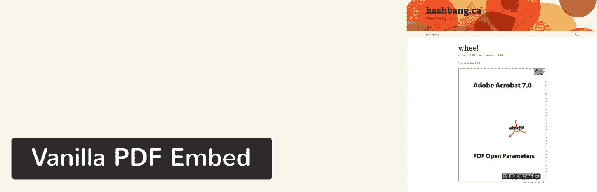](https://wordpress.org/plugins/vanilla-pdf-embed/)

Vanilla PDF Embed plugin

#### 为什么这个 PDF 查看器很棒

*   它没有太多不必要的特性，短代码也很容易使用。
*   这个插件为你的用户提供了清晰的阅读体验。

#### 不利之处

*   众所周知，许多移动浏览器会显示一个灰框，而不是 PDF。
*   没有快速上传按钮，所以你需要在另一个资源上托管或者上传 PDF 到 WordPress，然后使用短代码。
*   您需要在 shortcode 中放置一些代码来定制查看器。

### 8。PDF 查看器

几年前， [PDF Viewer](https://wordpress.org/plugins/pdf-viewer/) 插件可能是这个列表中最受关注的插件之一。但是开发人员已经停止管理它，所以很难推荐它，除非你愿意冒这个风险。

[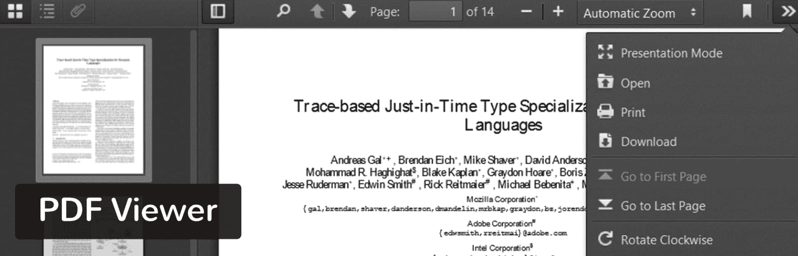](https://wordpress.org/plugins/pdf-viewer/)

PDF Viewer plugin

无论如何，这个插件只使用了 JavaScript，使得前端体验更加流畅。这也意味着您的用户不必安装任何额外的浏览器软件来查看 pdf。除此之外，浏览器还有几个工具，包括页面跳转、缩放和书签。

#### 为什么这个 PDF 查看器很棒

*   WordPress multisite 支持浏览器插件[。](https://kinsta.com/blog/wordpress-multisite/)
*   搜索关键字以查找文档中的特定点。
*   设置页面简单明了，提供了所需的短代码，以及一些用于调整浏览器高度和宽度的设置。

#### 不利之处

*   这个插件已经两年多没有更新了。这可能会在将来引起问题，但目前看来，它工作得相当好。
*   该插件在使用 Internet Explorer 时遇到了小故障。然而，他们可以选择向 IE 用户显示警告。

你不必在 PDF 插件和更快的页面加载时间之间做出选择。[免费试用 kin sta](https://hubs.ly/H0pklC_0)。

### 9。PDF 并由 BestWebSoft 打印

并非所有的 WordPress PDF 插件都可以作为 WordPress PDF 查看器。当你想把一篇博客文章转换成 PDF 格式时，它们中的一些可以充当转换器。这正是 [PDF 和 Print](https://wordpress.org/plugins/pdf-print/) 插件所做的，允许你或你的用户直接从你的网站完成转换。

[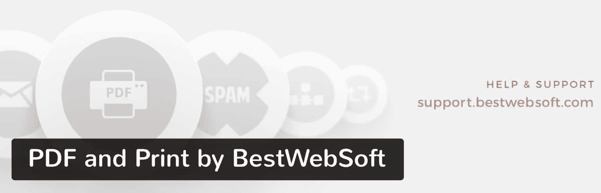](https://wordpress.org/plugins/pdf-print/)

PDF and Print by BestWebSoft plugin

大多数必需的功能都被打包到了免费版本中，但它们确实有一个[高级计划](https://bestwebsoft.com/products/wordpress/plugins/pdf-print/?k=6a544b359e625de8281a635315d84a70)，用于添加水印、创建自定义文档标题、[与 WooCommerce 的集成](https://kinsta.com/learn/woocommerce-guide/)以及其他利基功能。

PDF and Print viewer

#### 为什么这个 PDF 查看器很棒

*   它允许你的用户从你的文章中下载 pdf 文件。
*   该插件还支持页面、搜索结果、存档和自定义文章类型。
*   您可以使用小部件或短代码通过[添加转换按钮。](https://kinsta.com/blog/wordpress-widgets/)
*   插件为你的打印按钮提供了不同的图标。

#### 不利之处

*   高级版本需要每年付款。它只有大约 30 美元，但是你被这样一个基本的插件拉进一个经常性的支付，这有点糟糕。
*   页面生成器兼容性完全不存在。

### 10。WooCommerce 的 PDF 标签

WooCommerce 的 PDF Tab 是另一个可选的 WordPress PDF 插件，在你的电子商务产品页面上提供一个 PDF 下载按钮。有些产品信息对于产品页面来说太长，或者可能需要以某种方式保护。另一方面，您的公司可能已经有了这个文档，没有必要复制它。

[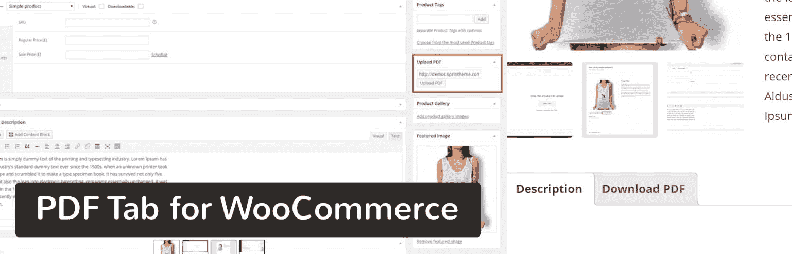](https://codecanyon.net/item/pdf-tab-for-woocommerce/9498780)

PDF Tab for WooCommerce plugin

例如，一些在线商店包括服装的尺码表。我甚至见过有尺子打印出来的合身的帽子公司，你可以绕在头上找到合适的。

#### 为什么这个 PDF 查看器很棒

*   PDF 上传都是通过 WordPress 处理的，所以你不需要乱用短代码。
*   下载 PDF 按钮会显示在您选择的产品页面上。
*   它提供了几个向买家介绍你的产品的机会。
*   用户可以下载 PDF 或在浏览器中查看。

#### 不利之处

*   虽然这并不重要，但是这个插件似乎没有任何保护你的 pdf 文件的功能。
*   每个产品页面只能上传一个 PDF。
*   没有简单的方法来改变下载 PDF 按钮上的文本。

### 11。Real3D 动画书 WordPress 插件

我们把最漂亮的留到了最后，因为 Real3D 的设计非常令人震惊，但对大多数人来说也是大材小用。我们喜欢 Real3D，如果你正在制作一个在线杂志或与客户和顾客分享图像丰富的小册子。

[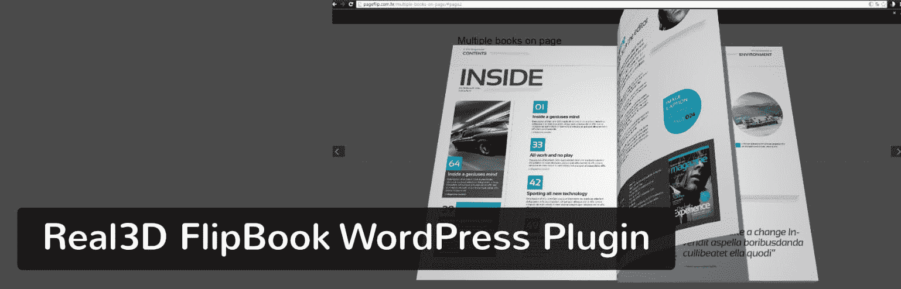](https://codecanyon.net/item/real3d-flipbook-wordpress-plugin/6942587)

Real3D FlipBook WordPress Plugin

翻页技术是你能获得的最接近阅读一本真正杂志的技术，灯箱效应为读者扫清了所有干扰。

#### 为什么这个 PDF 查看器很棒

*   它无疑是设计最好的 WordPress PDF 浏览器。
*   它有一个完全可定制的用户界面，可以改变颜色、按钮、边框、翻页声音和页面亮度等项目。
*   您可以上传 pdf 和图像。
*   逼真的观看体验非常适合移动设备。

#### 不利之处

*   基本的 pdf 不需要这种级别的样式。
*   它比市场上的其他选择稍贵一些。
*   用户似乎经常报告导致整个插件崩溃的错误。

### 12。嵌入 PDF 查看器

如果你想要一个超级简单和轻量级的 WordPress PDF 查看器，那么你可能想看看 [Embed PDF Viewer](https://wordpress.org/plugins/embed-pdf-viewer/) 。

[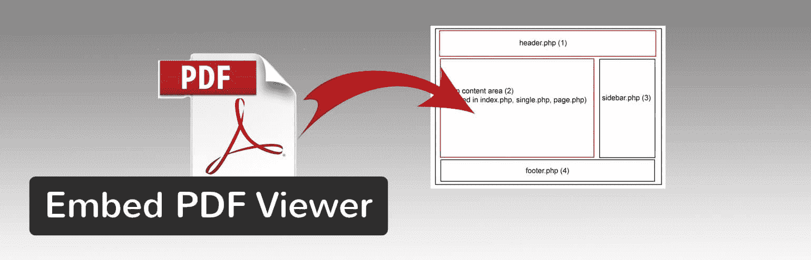](https://wordpress.org/plugins/embed-pdf-viewer/)

Embed PDF Viewer plugin

您可以通过 oEmbed 将来自[媒体库](https://kinsta.com/blog/wordpress-media-library/)或其他地方的 PDF 嵌入到对象标签或 Google Doc Viewer 中，作为备用。唯一的要求是 URL 必须是一个可到达的链接。

#### 为什么这个 PDF 查看器很棒

*   超级轻便，没有噱头或多余的不必要的装饰
*   做它被创造出来要做的事
*   受两个不再维护的流行的旧 PDF 插件的启发(很好的替代品)
*   开发者是开放的拉请求，以帮助调试任何问题
*   在移动设备上使用[多站点](https://kinsta.com/blog/wordpress-multisite/)

#### 不利之处

*   缺少文件
*   可能没有您需要的所有功能

## 哪个 WordPress PDF 查看器适合你？

有这么多知名的 WordPress PDF 阅读器，选择哪一个似乎很难。

**我们是这样想的:**

*   如果您不想为您的 PDF 查看器支付任何费用，请使用 PDF.js 查看器 Shortcode 或 Flowpaper。
*   如果您对丰富的功能和最优雅的显示感兴趣，请考虑 PDF Embedder or 或 Real3d 动画书。
*   如果你经常使用谷歌的产品，并且不介意它们托管你的 pdf，那就用谷歌文档嵌入器吧。
*   如果需要和 WooCommerce 整合，可以考虑 WooCommerce 的 PDF Tab 或者 BestWebSoft 的 PDF 并打印。
*   如果你想把博客文章或页面转换成 PDF，BestWebSoft 的 PDF 和 Print 是你的插件。

总的来说，你的 WordPress PDF 阅读器决定完全取决于你的情况。幸运的是，他们中的大多数都有免费版本或便宜的高级包。所以，给他们一个尝试，看看哪个最适合你。如果你对选择 WordPress PDF 查看器有任何疑问，请在下面的评论中告诉我们。

* * *

让你所有的[应用程序](https://kinsta.com/application-hosting/)、[数据库](https://kinsta.com/database-hosting/)和 [WordPress 网站](https://kinsta.com/wordpress-hosting/)在线并在一个屋檐下。我们功能丰富的高性能云平台包括:

*   在 MyKinsta 仪表盘中轻松设置和管理
*   24/7 专家支持
*   最好的谷歌云平台硬件和网络，由 Kubernetes 提供最大的可扩展性
*   面向速度和安全性的企业级 Cloudflare 集成
*   全球受众覆盖全球多达 35 个数据中心和 275 多个 pop

在第一个月使用托管的[应用程序或托管](https://kinsta.com/application-hosting/)的[数据库，您可以享受 20 美元的优惠，亲自测试一下。探索我们的](https://kinsta.com/database-hosting/)[计划](https://kinsta.com/plans/)或[与销售人员交谈](https://kinsta.com/contact-us/)以找到最适合您的方式。