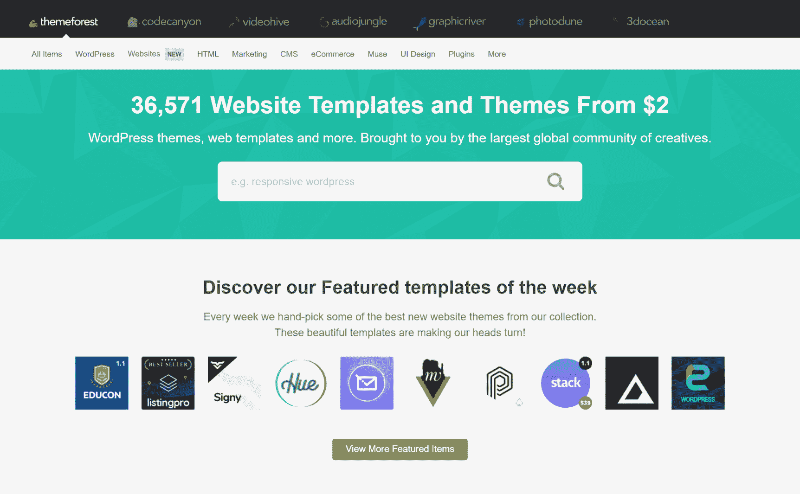
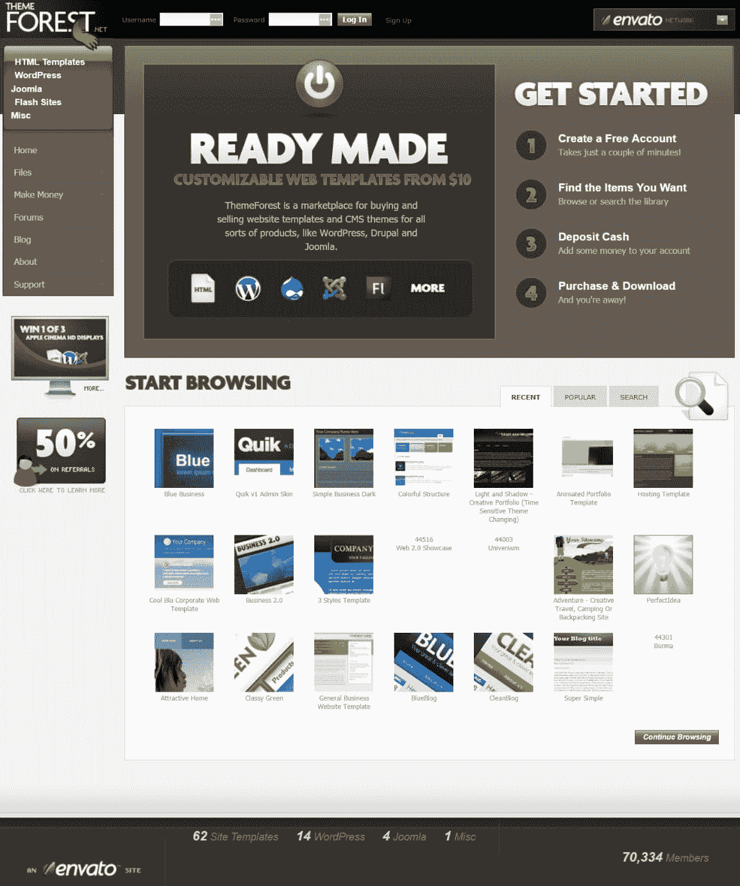
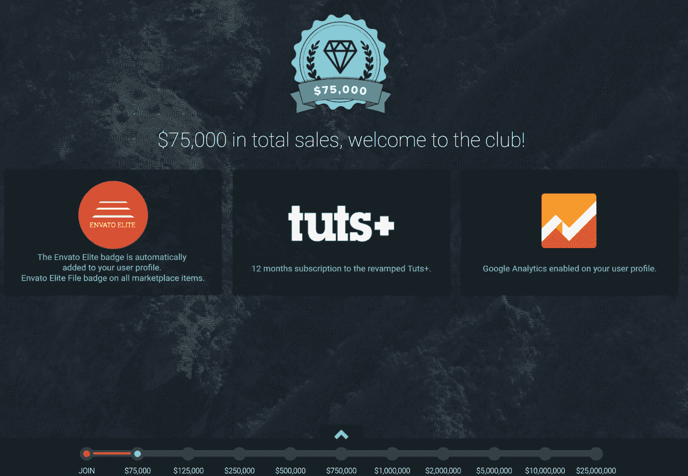
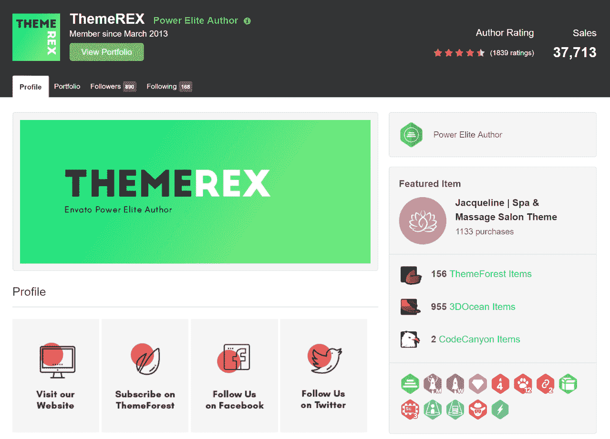
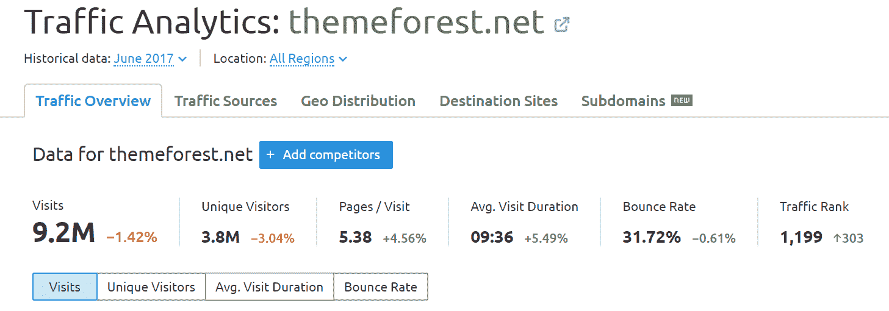
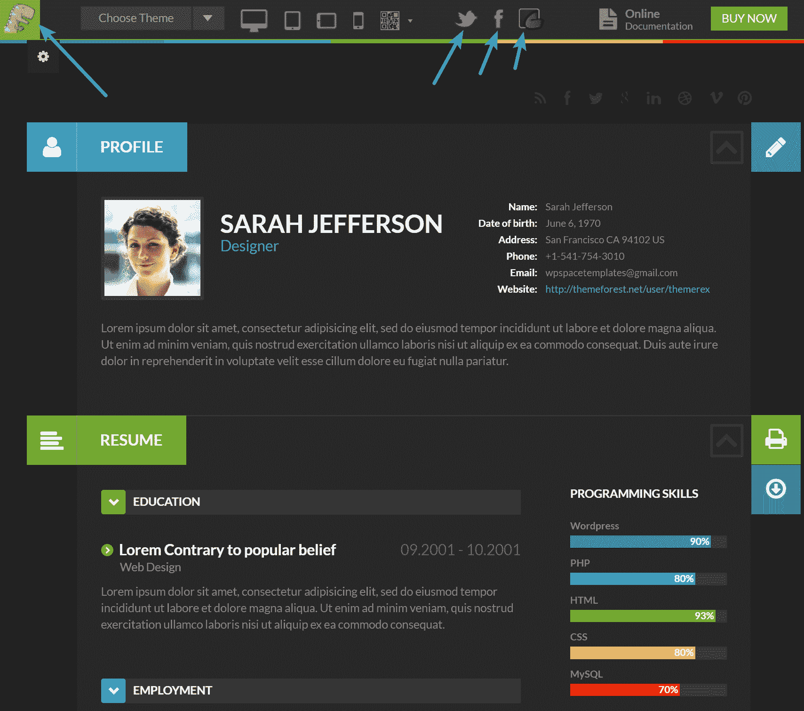
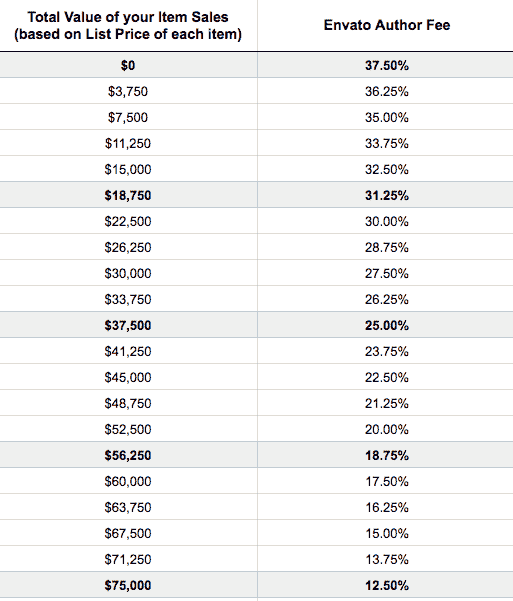
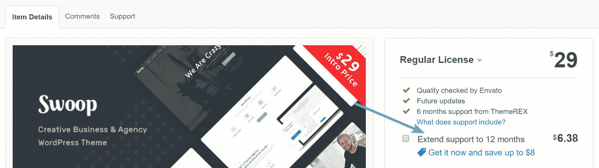
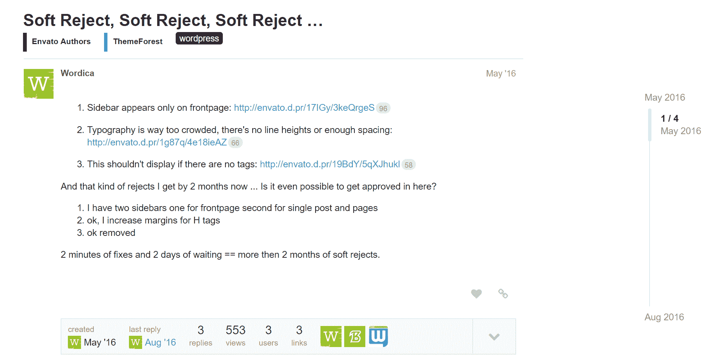
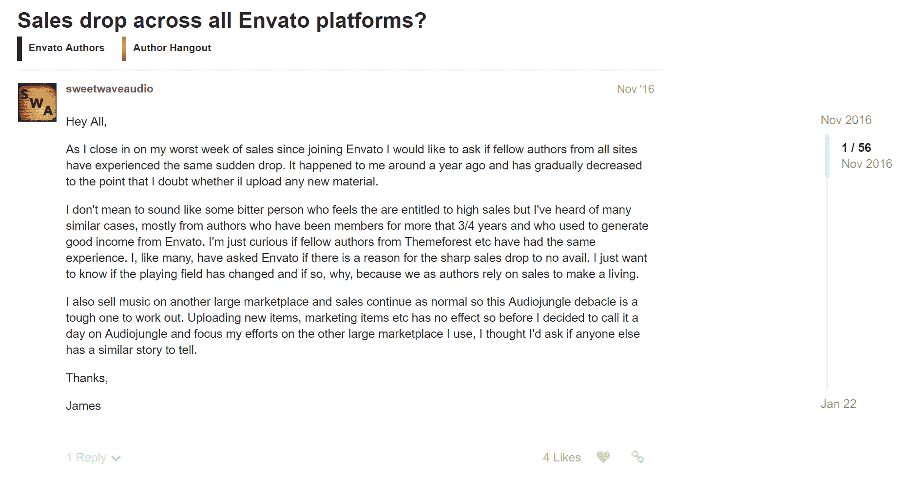

# 在 ThemeForest 上销售 5 年——利弊

> 原文：<https://kinsta.com/blog/themeforest-pros-cons/>

随着超过 43.3%的网站使用 WordPress，这个领域的竞争会非常激烈！对于许多新的 [WordPress 主题](https://kinsta.com/best-wordpress-themes/)开发者来说，一个很大的难题是他们是否应该独立出去或者在一个已经建立的市场上发布他们的作品。今天，我们很荣幸地采访了亨利·罗斯，他是《T4》ThemeREX 的首席执行官，也是 ThemeForest 上的一位权力精英作家。他将与我们分享他五年来在 ThemeForest 上销售主题的第一手经验，以及该平台的一些利弊。如果你还在考虑走哪条路，希望这能帮助你做出更明智的决定。

## 主题森林+ WordPress

对于那些可能不知道的人来说， [ThemeForest](https://themeforest.net/) 由 Envato 所有，是一个在线市场，在这里你可以买卖流行的 CMS ( [内容管理系统](https://kinsta.com/knowledgebase/content-management-system/))产品的 HTML 模板和主题，如 WordPress、 [Joomla](https://kinsta.com/blog/joomla-vs-wordpress/) 和 [Drupal](https://kinsta.com/blog/wordpress-vs-drupal/) 。根据 Alexa 的数据，他们被列在世界前 1000 家网站中，每月接待数百万的访问者。他们绝对是同类市场中最大的市场之一。

ThemeForest WordPress

写这篇文章时，ThemeForest 上有超过 10，000 个 WordPress 主题。他们有一种你可能称之为“需要彼此才能生存”的关系。根据来自 Freemius 的[研究，虽然 ThemeForest 上只有 28%的主题是 WordPress 主题，但是 **WordPress 主题带来了 80.5%的总收入**。你可以购买任何东西的主题，从企业电子商务主题到婚礼主题。为了好玩，我们拉了一张 2008 年 ThemeForest 的截图，当时他们只有 14 个 WordPress 主题。](https://freemius.com/blog/themeforest-wordpress-themes-analyisis/)

ThemeForest 2008

为什么会大幅增长？这很自然，因为 WordPress 主题很容易开发。此外，企业家和小企业倾向于使用 WordPress 而不是其他内容管理系统，因为它很容易使用。根据 W3Techs 的调查， [65.1%的 CMS](https://w3techs.com/technologies/overview/content_management/all) 用户正在使用 WordPress。你也可以查看我们的深入了解更多关于 WordPress 的[历史。](https://kinsta.com/learn/wordpress-history/)

然而，由于 ThemeForest 上有如此多的 WordPress 主题，这使得竞争更加激烈。你不能只列出你的主题，然后看着销售开始滚滚而来。为了成功，森林的作者和开发者必须在他们的策略上做一些改变。如果你想登上销售榜的顶端，不建议你把整个生意都放在森林上，因为这可能有风险。它还建议你为你的品牌进行额外的营销活动，即使你是一个权力精英作家。

### 什么是权力精英作者？

Envato 有他们所谓的精英项目 T1。这是为了奖励总销量超过一定门槛的卖家。第一个级别是，一旦你的总销售额超过 75，000 美元，你将获得一枚精英徽章、12 个月 tuts+订阅以及你的卖家资料中的 Google Analytics。这将允许您添加 UTM 参数到营销活动中，并查看实际转换的内容。关卡最高可达 2500 万美元，你可以选择自己的冒险经历，然后由 Envato 买单。

> Kinsta 把我宠坏了，所以我现在要求每个供应商都提供这样的服务。我们还试图通过我们的 SaaS 工具支持达到这一水平。
> 
> <footer class="wp-block-kinsta-client-quote__footer">
> 
> 
> 
> <cite class="wp-block-kinsta-client-quote__cite">Suganthan Mohanadasan from @Suganthanmn</cite></footer>

[View plans](https://kinsta.com/plans/)

Envato elite program

虽然这些价格听起来有些离谱，但是在 WordPress 主题市场上还是有很多钱的。市场上销量第一的主题 Avada 已经卖出了 300，000 本！如果你计算一下 60 美元一个许可证，仅仅一个多功能主题的销售额就超过了 2000 万美元。然而，他们也有时间优势，因为他们有一个非常好的品牌和主题。现在所有的竞争会变得更加困难。

## 在主题森林上销售的好处

今天我们采访的是销量超过 37，000 的权力精英作家 ThemeREX T1。他们在 ThemeForest 上有超过 156 个 WordPress 主题，评分为 4.5 分。如果你想在[主题森林](https://themeforest.net/)上出售你的设计，在采取任何行动之前，你应该了解所有的利弊。有谁比一个已经很有名气的卖家更适合接受建议呢？

ThemeRex power elite author

以下是他们的首席执行官亨利与我们分享的在 ThemeForest 上销售主题的一些优点:

### 1.稳定性

如果你正在建立一个网页设计业务(我们指的是严肃的业务，而不是在你心情好的时候时不时地创建模板)，Envato 会给你带来稳定性和对光明未来的信心。

### 2.交通拥挤

Envato 有着疯狂的流量。根据 SEMRush 的说法，他们每月有超过 900 万的有机访问者，这还只是估计桌面流量。所以你可以放心地认为这是很多！

Traffic analytics for ThemeForest.net

这对你来说意味着什么？你的主题会被目标观众看到，很多相关的人。这种流量不是随机的。浏览你的主题的用户对主题有广泛的了解。有时候他们似乎比你知道的更多。那么，你应该怎么做呢？试着让他们相信你的产品是好的。

我们以 [ThemeREX](https://themeforest.net/user/themerex/portfolio?utm_source=workup&utm_medium=trex-interview&utm_campaign=interview-kinsta) 为例。我们从零开始，我们的流量很快增长到每月 20 万次访问。请记住，大部分流量来自演示。陷阱是大多数客户永远不会看到你的主页。如何避免？在演示中向他们展示更多的模板，或者使用横幅等。确保你的手指在交通馅饼。

Theme demo

### 3.选择您的价格

Envato 给你选择。你可以自由选择物品的价格。例如，你可以选择最低价格，以一毛钱的价格出售你的宏伟、耗时的作品。这将是你为命名建筑和攀登顶峰所做的牺牲。或者，你可以反其道而行之。你可以像图表高端的一些供应商一样，把你的价格定在每个主题几百元。

### 4.更高的独家收入

你必须做出另一个重大选择与恩瓦托合作。你想在任何地方销售你的主题还是只在 Envato 上销售？区别在于收益。如果你到处提供你的产品，你会得到 50%的收入。也许你会对此感到满意。但大多数 Envato 合作伙伴选择独家经营，只在那里销售他们的主题。然后**费用可以降低到 12.5%** ，但这也取决于总销售额。所以，你最好三思，什么对你更有利。了解更多关于 [Envato 作者费](https://help.market.envato.com/hc/en-us/articles/214154443?_ga=2.14342199.1613138070.1501656885-1186218333.1500876244)。

## 注册订阅时事通讯

### 想知道我们是怎么让流量增长超过 1000%的吗？

加入 20，000 多名获得我们每周时事通讯和内部消息的人的行列吧！

[Subscribe Now](#newsletter)

Envato author fees

### 5.恩瓦托希望你成功

Envato 关心它的供应商。团队希望你被认可为精英/权力精英作者。当然，你创造的销售额越多，他们的收入就越多。你会得到很多额外津贴，徽章，他们会把你列入他们的名人墙上，在他们的博客上发布你的采访，以及做许多其他事情。例如，当你的新主题发布时，Envato 会在主页上展示它。通过这种方式，你的新主题在最初的几天里会有很高的曝光率。

### 6.通过支持赚取额外收入

你可以在支持上**筹到好多钱，只要你超有效率。客户现在为森林上的额外支持付费，因此可以说支持部门支付他们的工资。这真的很好。阅读更多关于[主题森林支持政策](https://themeforest.net/page/item_support_policy)的信息。**

ThemeForest pay for support

### 7.伟大的社区

最后一个专业是 Envato 周围的社区。你成为它的一部分。你有机会与有相似兴趣的开发人员交谈，向他们学习，分享想法，“窃取”创造性的想法，等等。

## 在森林上销售的缺点

虽然对于作者来说，森林有很多好处，但也有一些坏处:

Struggling with downtime and WordPress problems? Kinsta is the hosting solution designed to save you time! [Check out our features](https://kinsta.com/features/)

### 1.主题拒绝

你可能会收到 Envato 的多次拒绝，因为他们的标准非常高，有时变化太突然。拒绝让你感到沮丧，有时你开始认为事情对你来说太复杂了。这只是论坛上的一个例子。

Rejected on ThemeForest

但是你应该明白，Envato 有一个很好的理由来满足他们的要求。他们必须保持一定的质量水平。把这当成对你职业精神的挑战，你的工作会变得更好，你的专业水平也会变得更高。采纳，变得更强，你将赢得客户的心，这是 Envato 的目标。

### 2.无品牌

很多人(如果不是所有的供应商)讨厌匿名因素。我们每个人都有自己的抱负。但我们必须自愿报名参加。事实上，顾客从 Envato 购买而不是从你的品牌购买可能会令人恼火。你应该准备好收到一大堆支持票，上面写着你是 Envato 支持团队成员。这无助于你建立自己的品牌。任何东西都有它的价格，这是你应该为 Envato 给你的无数机会付出的代价。如果你想建立自己的品牌——自己做营销。

### 3.只是机器的一部分

你还记得蝎子乐队歌曲中的歌词吗“你是雨中的一滴，只是一个数字而不是一个名字……”这种感觉并不令人愉快，但事实是，即使他们希望你成功，你仍然是 Envato 机器中的一个齿轮。如果你进入社区论坛，你会看到供应商的帖子，他们讲述了他们的痛苦，如销售额下降(如下例)和其他对他们来说至关重要的话题。

Drop in sales

但是他们没有得到恩瓦托的回应。版主也不管。森林应该关心他们的作者，因为他们是 Envato 的引擎。这很可悲，但生意不是为牢骚满腹的人准备的。

### 4.扰乱定价

价格是另一个严重的问题。根据 Envato [terms](https://help.market.envato.com/hc/en-us/articles/214154443?_ga=2.14342199.1613138070.1501656885-1186218333.1500876244) 的规定，每个人都可以对自己的产品制定自己的价格，这就足够公平了。但是一些作者把他们的产品作为最贵的商品出售，而另一些作者为了达到他们的营销目的，以几乎 0%的收入出售他们的主题。多皮肤模板也是很好的竞争者，因为它们可以用来以一个的价格建立很多网站。由于这种混乱的价格，许多人离开时感到受骗和失望。我们明白，我们不能因为别人的成功和我们的失败而责怪他们，但这种理解并不会让事情变得更容易。推荐阅读:[如何为 WordPress 的产品或服务定价的 5 个技巧](https://kinsta.com/blog/how-to-price-a-product-wordpress/)

### 5.很难成功

如果你只是打算开始与 Envato 的合作，那就做好准备迎接困难时期吧。我们不想吓跑你，但是今天进入森林非常困难。即使是最大的玩家也开始感觉到竞争对手的气息。用降价策略和高质量产品的泛滥市场来增加额外的价值可能会花费你一大笔钱。也不要寄希望于恩瓦托的任何回答。即使是权力精英作者也必须耐心等待，排队等待他们的问题得到回答。有时候，一封简单的是或否的邮件需要两三天才能得到回复。

### 6.需要额外的营销

如果你想在 Envato 上生存，你必须付出额外的营销努力来让你的主题曝光。一点数学:ThemeForest 需要至少 200 万额外的人来购买他们的 WordPress 产品才能维持运营。200 万人是一个巨大的数字，这只是为了在没有任何增长的情况下保持业务不变。你可能会说 WordPress 的需求在增长，人们变得更加依赖网站和互联网，但是谁知道需求会增长到什么程度。

## 摘要

任何生意都有利有弊，尤其是涉及这么多人的大生意。除了上面提到的缺点之外，大多数 Envato 供应商都很乐意成为其社区的一部分，并围绕它开展业务。如果你正在犹豫是否要和 Envato 碰碰运气，我们只能说一件事。采取行动并失败总比无所事事要好。也许你是森林中未来的新星。我们祝你好运！有自己在主题森林上销售的故事或经历吗？我们很想听听下面的故事。

* * *

让你所有的[应用程序](https://kinsta.com/application-hosting/)、[数据库](https://kinsta.com/database-hosting/)和 [WordPress 网站](https://kinsta.com/wordpress-hosting/)在线并在一个屋檐下。我们功能丰富的高性能云平台包括:

*   在 MyKinsta 仪表盘中轻松设置和管理
*   24/7 专家支持
*   最好的谷歌云平台硬件和网络，由 Kubernetes 提供最大的可扩展性
*   面向速度和安全性的企业级 Cloudflare 集成
*   全球受众覆盖全球多达 35 个数据中心和 275 多个 pop

在第一个月使用托管的[应用程序或托管](https://kinsta.com/application-hosting/)的[数据库，您可以享受 20 美元的优惠，亲自测试一下。探索我们的](https://kinsta.com/database-hosting/)[计划](https://kinsta.com/plans/)或[与销售人员交谈](https://kinsta.com/contact-us/)以找到最适合您的方式。