# 如何卸载 WordPress 插件(正确的方法)

> 原文：<https://kinsta.com/blog/uninstall-wordpress-plugin/>

仅在知识库上就有超过 50，000 个 WordPress 插件，你很可能会测试和比较一些不同的插件来完成任务或解决你网站上的问题。当你使用完一个程序后，你可以简单地通过停用和删除来卸载它，对吗？错了，这样做的问题是，它会在你的 [WordPress 数据库](https://kinsta.com/knowledgebase/wordpress-database/)中留下表格和行，随着时间的推移，这可能会很快增加，这反过来会影响你的[网站的性能](https://kinsta.com/learn/speed-up-wordpress/)，甚至会耗费你的磁盘空间。今天我们将向你展示一些关于如何卸载 WordPress 插件的技巧，正确的方法是**确保你的数据库保持小而快**。

*   [如何卸载仪表盘中的 WordPress 插件](#uninstall-wordpress-plugin-dashboard)
*   [如何通过 FTP 卸载 WordPress 插件](#uninstall-wordpress-plugin-ftp)
*   [卸载 WordPress 插件的大问题](#big-issue-uninstalling-plugins)
*   [如何卸载 WordPress 插件(正确方法)](#properly-uninstall-wordpress-plugin)
*   [如何手动清理插件遗留的表格](#cleanup-tables-left-behind)

## 如何在仪表板中卸载 WordPress 插件

在我们深入探讨如何正确卸载一个 [WordPress 插件](https://kinsta.com/knowledgebase/wordpress-plugin/)之前，让我们先讨论一下用户在 WordPress 中删除插件的典型方式。第一个是简单地从仪表板。按照下面的步骤卸载 WordPress 的正常方式(不删除数据)。

### 第一步

在您的控制面板中导航到“已安装的插件”,然后单击插件旁边的“停用”。在这个例子中，我们正在卸载 Wordfence 安全插件。

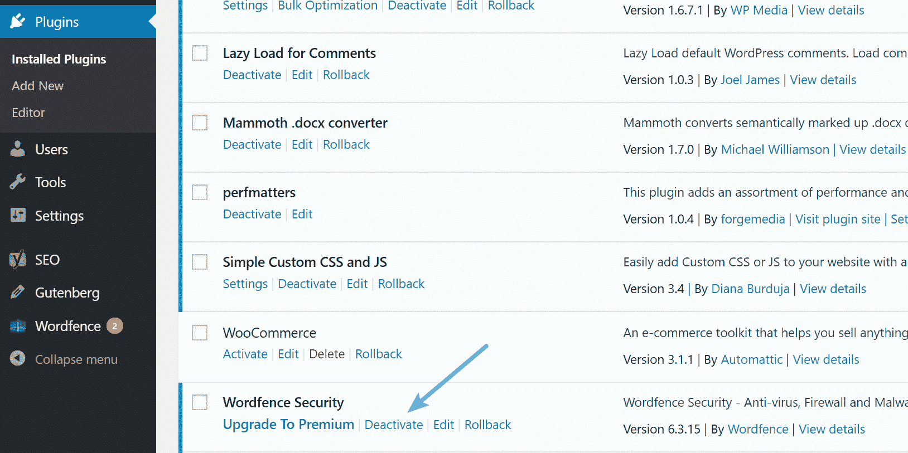

Deactivate WordPress plugin


### 第二步

最后一步是简单地点击“删除”

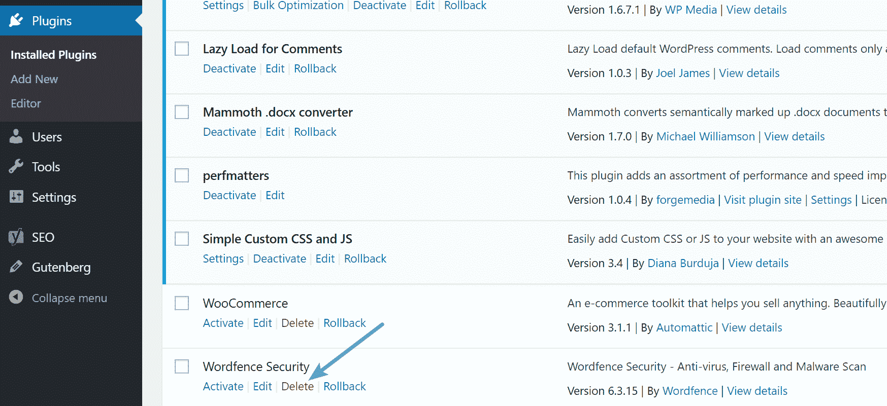

删除 WordPress 插件


T5


> 需要在这里大声喊出来。Kinsta 太神奇了，我用它做我的个人网站。支持是迅速和杰出的，他们的服务器是 WordPress 最快的。
> 
> <footer class="wp-block-kinsta-client-quote__footer">
> 
> 
> 
> <cite class="wp-block-kinsta-client-quote__cite">Phillip Stemann</cite></footer>

[View plans](https://kinsta.com/plans/)

## 如何通过 FTP 卸载 WordPress 插件

用户使用的第二种常见方法是通过 FTP 卸载插件(不删除数据)。请遵循以下步骤。

### 第一步

通过 [SFTP](https://kinsta.com/knowledgebase/how-to-use-sftp/) 连接到你的 WordPress 网站。

### 第二步

浏览到您的/wp-content/plugins/文件夹。然后从你的服务器上删除插件文件夹。

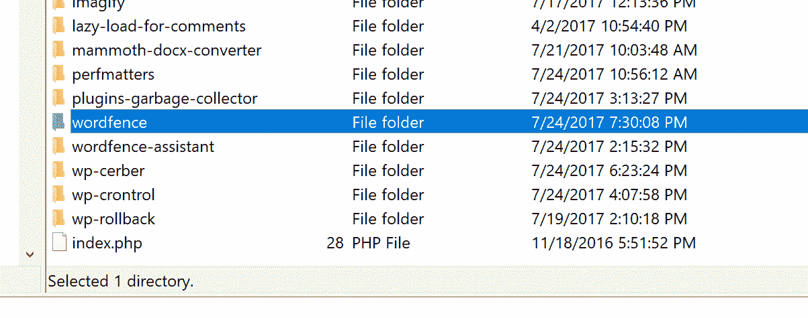

Delete WordPress plugin via FTP


很简单，对吧？嗯，在大多数情况下，上面的**方法是卸载插件的错误方式**，尤其是如果你再也不想使用这个插件的话。

## 卸载 WordPress 插件的最大问题是

每当你安装一个 WordPress 插件或主题时，它会将数据存储在数据库中。问题是当你用上面显示的简单方法删除一个插件时，它通常会在你的数据库中留下表格和行。随着时间的推移，这可能会积累大量的数据，甚至会降低网站的运行速度。在我们的例子中，我们卸载了 Wordfence 安全插件，它**在我们的数据库**中留下了 24 个表(如下所示)！

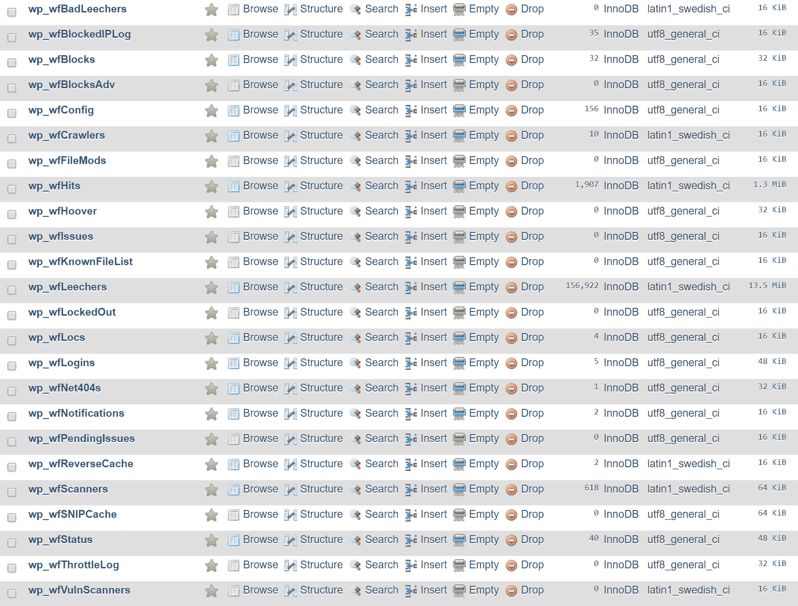

Wordfence tables left behind after deleting the plugin


除了数据库，很多插件还会留下额外的文件夹和文件。根据我们的经验，这在创建额外的日志目录的安全和缓存插件中很常见。例如，在 Wordfence 插件被删除后，我们的 wp-content 目录中只剩下一个“wflogs”文件夹。我们并不是要挑 Wordfence 的毛病，市场上的大多数插件和主题都是这样工作的。

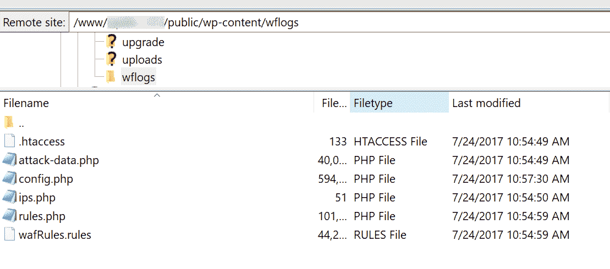

Wordfence logs


不幸的是，如果你一直在用上面的简单方法卸载插件，你的 WordPress 站点可能需要做大量的清理工作。记住**停用一个插件只会使它不活动**。你的网站上目前有多少不活跃的插件？如果它比活跃的数量多，那可能不是一件好事。你应该考虑完全删除不活跃的插件，因为它们仍然会带来安全风险，即使没有运行，也只会让你的数据库膨胀。


非活动 WordPress 插件


## 开发商为什么要这么做？

所以你可能想知道，为什么当你卸载和删除一个插件时，开发者没有自清理选项？事实上，他们有。但是，这里有几个原因可以解释为什么它们可能不会马上显现出来。

### 他们希望为用户保留设置

第一个原因是很多 WordPress 用户经常在插件之间切换，通过将表格和行留在数据库中，这保留了你的设置。这意味着你可以在以后重新安装插件，你所有的数据仍然会在那里。或者如果由于某种原因插件被意外删除，你不必惊慌。对于不太懂技术的用户来说，这无疑是一种优势，然而，**这并不是最有效的方式**。

但是，如果出于某种原因，你认为你以后可能会返回到一个插件，那么是的，简单地删除插件使用上述方法之一是最好的途径。

### 他们不关心性能

不幸的是，我们看到的另一个原因是，一些开发人员可能会认为留下表不会影响站点的性能。但是想象一下，一个网站在 10 年的时间里，使用了数百个插件，可能生成了数千行或数千个表格。**数据库查询对你的 WordPress 网站的性能有很大的影响**，如果开发者不小心的话[插件会发出很多这样的请求](https://kinsta.com/blog/wordpress-performance-new-relic/)。一般来说，一个编写良好的插件应该只查询它所绑定的表或行，然而，情况并非总是如此。

我们已经在 Kinsta 上看到过这种第一手资料，由于 wp_options 表中不必要的[自动加载的数据被留下，长时间的数据库查询使一个网站被抓取。](https://kinsta.com/knowledgebase/wp-options-autoloaded-data/)

然后就是磁盘空间的**问题。大多数 web 主机按您使用的磁盘空间量收费或有限制，这包括您的数据库。**

### 他们犯了个错误

WordPress 插件手册是为开发者准备的，里面有关于如何停用插件和卸载插件(删除数据)的最佳实践。甚至它说:

> 缺乏经验的开发人员有时会犯错误，为此使用停用挂钩。

如果这个错误是由开发人员造成的，这意味着当卸载应该删除所有的数据时，它只是运行了停用过程，留下了所有的数据。

### 大多数都有清理方法

然而，有一个好消息，因为**他们中的许多人实际上有办法做适当的清理**，你可能只是没有使用他们。然而，尽管如此，他们中的许多人仍然没有让用户足够清楚如何正确地卸载他们的插件。凯文·马尔登，一个网络营销者和博客，最近在他关于为什么 WordPress.org 需要强制卸载选项的文章中提到了这个话题。在理想情况下，当你卸载一个 WordPress 插件时，它会提示你三个不同的选项。

*   删除插件
*   删除插件和数据
*   删除插件、数据和设置(完全删除)

但是事情还不是这样运作的。如果最终能在存储库中看到这样的东西就好了。

[When it comes to #WordPress performance, database bloat plays a huge part. 🐌Click to Tweet](https://twitter.com/intent/tweet?url=https%3A%2F%2Fkinsta.com%2Fblog%2Funinstall-wordpress-plugin%2F&via=kinsta&text=When+it+comes+to+%23WordPress+performance%2C+database+bloat+plays+a+huge+part.+%F0%9F%90%8C)

## 如何卸载 WordPress 插件(正确的方法)

今天我们将向你展示一些关于如何正确卸载 WordPress 主题和/或插件的建议和技巧。这可能包括使用开发人员可选的完全删除过程或必须在数据库中进行自我清理。

## 注册订阅时事通讯


### 想知道我们是怎么让流量增长超过 1000%的吗？

加入 20，000 多名获得我们每周时事通讯和内部消息的人的行列吧！

[Subscribe Now](#newsletter)

### 第一步

在这个例子中，我们将继续使用 Wordfence 插件。以正确的方式卸载 WordPress 插件的一个问题是，每个开发者对待这个问题的方式都有所不同。这意味着，很有可能你需要做一个快速的谷歌搜索，**检查开发者网站上的文档**，或者给他们发一封快速的电子邮件。正如你在下面看到的，我们谷歌了“如何卸载 wordfence”，返回的第一件事就是，他们的官方文件关于如何[完全移除 word fence](https://www.wordfence.com/help/advanced/remove-or-reset/)。

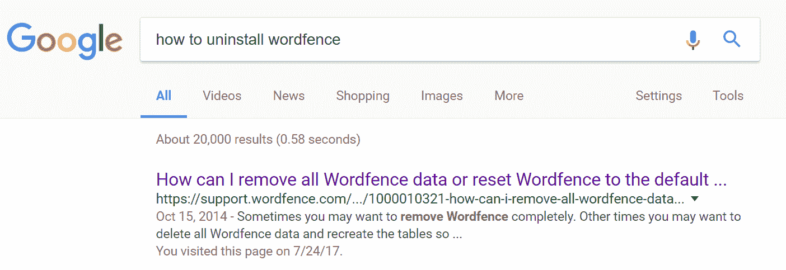

How to uninstall Wordfence


### 第二步

一个开发良好的插件应该在插件的设置中包含一个**选项来完成完全卸载。你可以在下面流行的 Gravity Forms 插件中看到一个例子。快速点击“卸载重力表格”按钮，所有的表格和数据都不见了。**

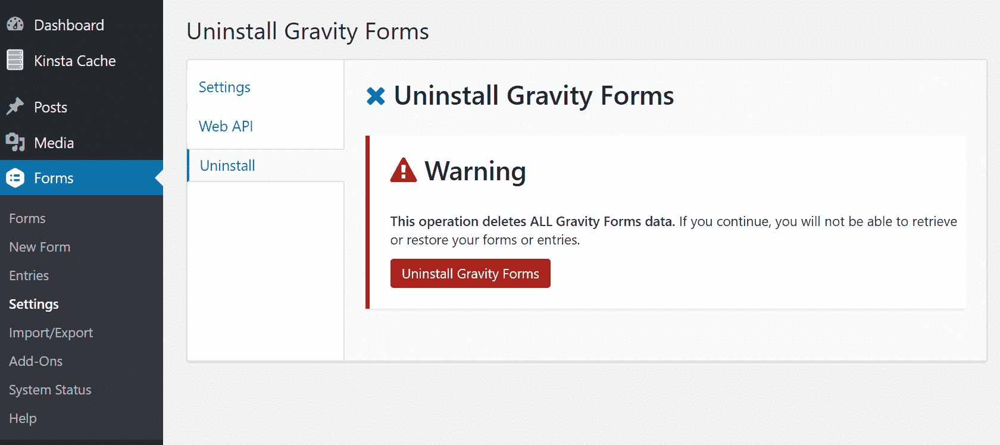

Uninstall Gravity Forms


这是 Polylang 多语言插件的另一个例子。你可以看到，在他们的工具部分有一个选项，当使用“删除”链接删除所有数据。必须首先启用它。

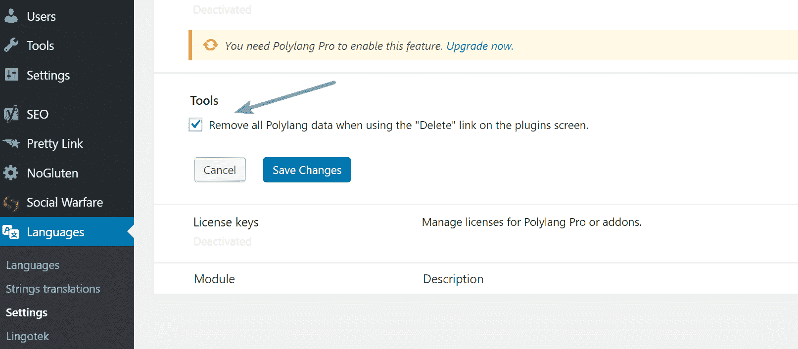

Polylang remove plugin data


如果你没有以正确的方式卸载多语言插件，他们将继续不必要地更新其他第三方插件的翻译数据，即使在它们被删除后。

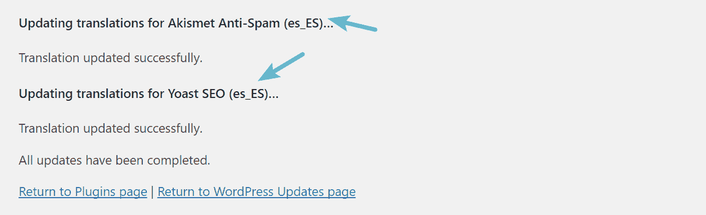

Old translation data in database


奇怪的是，Wordfence 建议你安装另一个插件，即 [Wordfence Assistant](https://wordpress.org/plugins/wordfence-assistant/) ，它将帮助你完全删除插件、数据和设置。正如你在下面看到的，一旦插件安装完毕，就可以选择删除 Wordfence 数据和表格，清除所有锁定的 IP，以及实时流量数据。

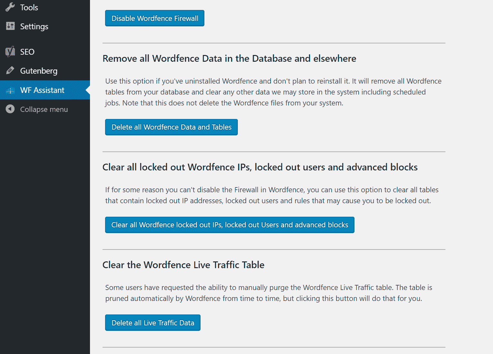

Remove WordFence completely


其他 WordPress 插件可能需要更复杂的卸载过程，例如 [WooCommerce](https://docs.woocommerce.com/document/installing-uninstalling-woocommerce/) ，在删除 wp-config.php 文件之前，你必须将下面的代码放入其中，以完全删除所有数据。

```
define( 'WC_REMOVE_ALL_DATA', true);
```

但是这就是为什么在你简单地停用和删除一个插件之前，你要确保你是在以最有效的方式做这件事。以下是一些流行的 WordPress 插件的卸载指南的快捷方式，有些人有时会有问题:

*   [卸载 WP 火箭](http://docs.wp-rocket.me/article/694-uninstalling-wp-rocket)
*   [卸载 WP 超级缓存](https://wordpress.org/plugins/wp-super-cache/)
*   [卸载 UpdraftPlus](http://updraftplus.com/faqs/does-updraftplus-delete-all-its-settings-when-it-is-de-installed/)
*   [卸载 W3 总缓存](https://kinsta.com/blog/w3-total-cache/)
*   [卸载彗星缓存](https://cometcache.com/kb-article/how-do-i-uninstall-comet-cache/)

### 移除未使用的短代码

如果你正在使用一个利用短代码的插件，然后你删除了这个插件，你的网站看起来会很奇怪，直到你替换掉它们。如果你想暂时禁用旧插件的短代码，只需在你的 functions.php 文件中使用以下代码；用插件的实际短代码标签更新“pluginshortcode”。

Struggling with downtime and WordPress problems? Kinsta is the hosting solution designed to save you time! [Check out our features](https://kinsta.com/features/)

```
add_shortcode( 'pluginshortcode', '__return_false' );
```

这将使它们完全不能显示。但是请记住，如果你想在原来的插件中再次使用它们，你需要删除代码。然而，当你用一个更新的插件的短代码格式替换短代码时，这可能是一个快速清理你的站点的方法。


## 如何手动清理插件留下的表格

可能会有这样的时候，你已经卸载了一个插件，你只是需要做一个清理。或者，开发人员的完全删除方法实际上是指手动删除数据库表。有两种方法可以解决这个问题，一种是使用表格清理插件，另一种是直接在 phpMyAdmin 中删除表格。

在这两种方法中，我们强烈建议你事先做一个 [WordPress 站点备份](https://kinsta.com/blog/backup-wordpress-site/)。如果你是 Kinsta 的用户，你可以在 MyKinsta 的仪表盘上点击一下[创建一个备份](https://kinsta.com/help/wordpress-backups/)。

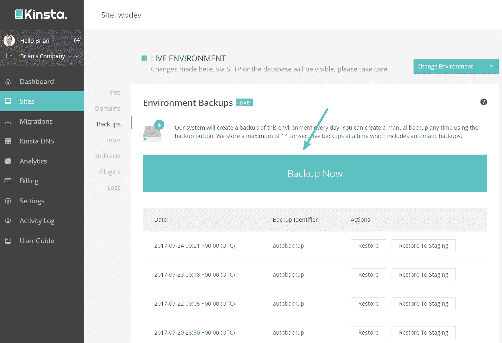

Create WordPress backup


或者利用众多流行的 [WordPress 备份插件](https://wpbuffs.com/the-5-best-backup-and-restore-plugins-to-keep-your-site-safe/)中的一个。

### 用插件清理表格

你最好的插件选择可能是[高级数据库清理器](https://wordpress.org/plugins/advanced-database-cleaner/)。这是一个高级插件，但是它可以扫描你的 WordPress 安装并允许你删除孤立的表格。正如你在下面看到的，它从不再安装的插件中获得了 EDD (wp_edd*)、重力表格(wp_gf*)和布鲁姆(et_bloom*，et_social*)表格。

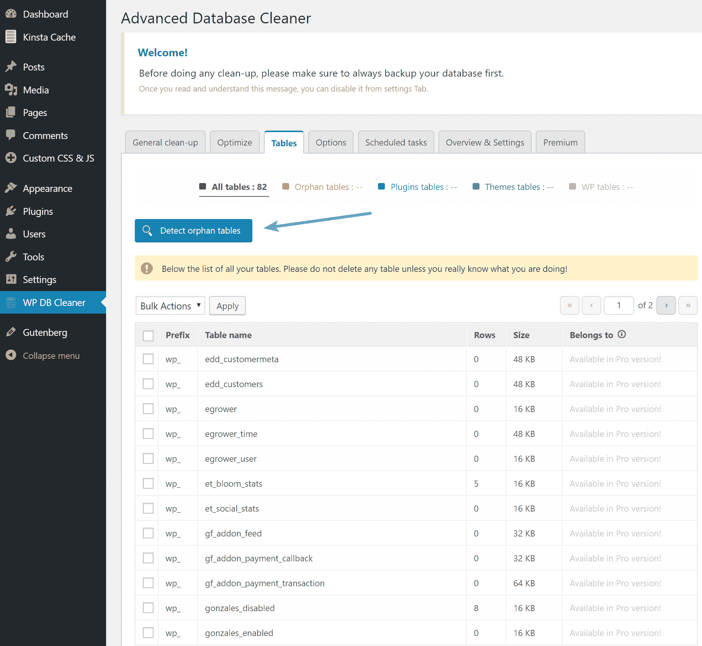

Detect orphaned tables


### 清理 phpMyAdmin 中的表

您也可以在 phpMyAdmin 中手动清理这些表。比起使用插件，我们更喜欢这种方法。很多插件会给它们的表格起一个类似于插件名字的名字。在这个例子中，根据他们的文档，我们将[完全删除 Yoast SEO](https://kb.yoast.com/kb/how-can-i-uninstall-my-plugin/#database) 。事实上，Yoast SEO 的插件中没有这个选项，如果你想完全卸载它并删除数据，你唯一的选择就是在 phpMyAdmin 中完成。在他们的文件中，他们声明:

> 如果您想删除我们插件的所有痕迹，请在数据库中搜索包含 wpseo 的条目，并手动删除数据。

要做到这一点，只需[登录 phpMyAdmin](https://kinsta.com/help/wordpress-phpmyadmin/) 。在“搜索”标签下输入“wpseo”，选择所有的表，然后点击“Go”

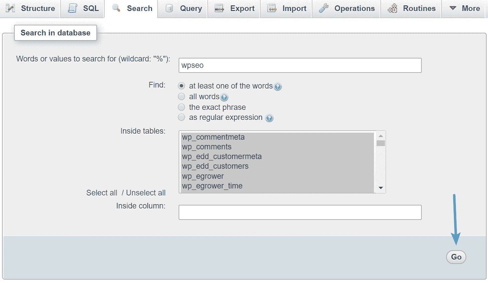

Search wpseo in database


在我们的站点上，在 wp_options 表、wp_postmeta 表和 wp_usermeta 表中找到了匹配项。您可以在每个表上单击 then 并删除包含“wpseo”的行。

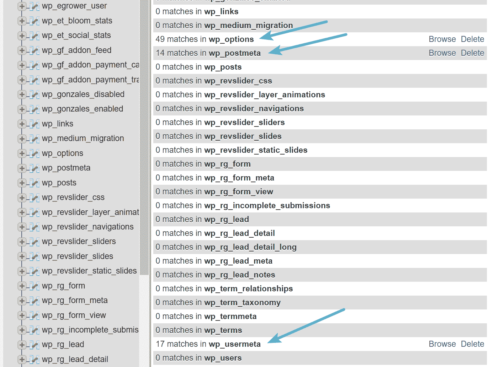

Yoast tables


下面是 wp_options 表。确保**首先通过“wpseo”过滤行**,因为有其他特定的行可能在 option_value 中包含“wpseo ”,比如 WordPress cron job 行。这一点非常重要，不容忽视。过滤后，您可以选择并删除它们。

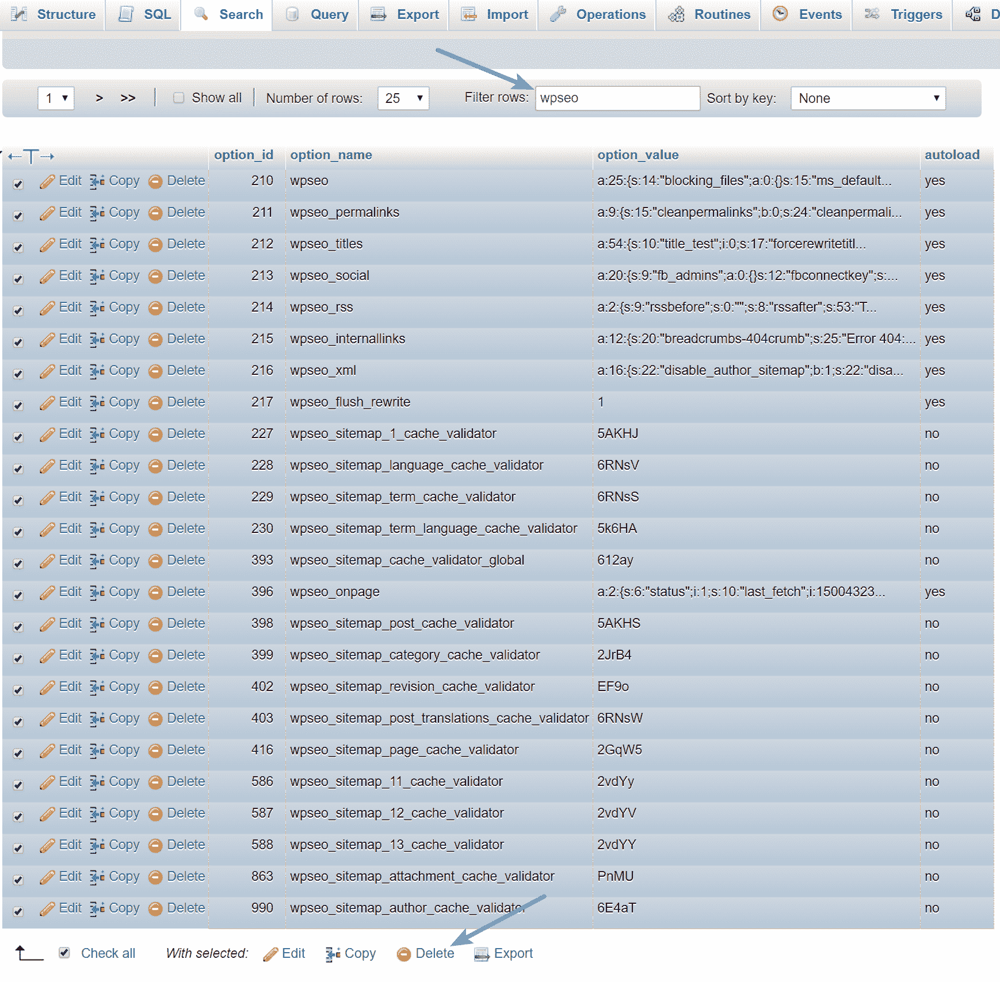

wp_options table Yoast SEO


下面是 wp_postmeta 表。删除包含“wpseo”的行

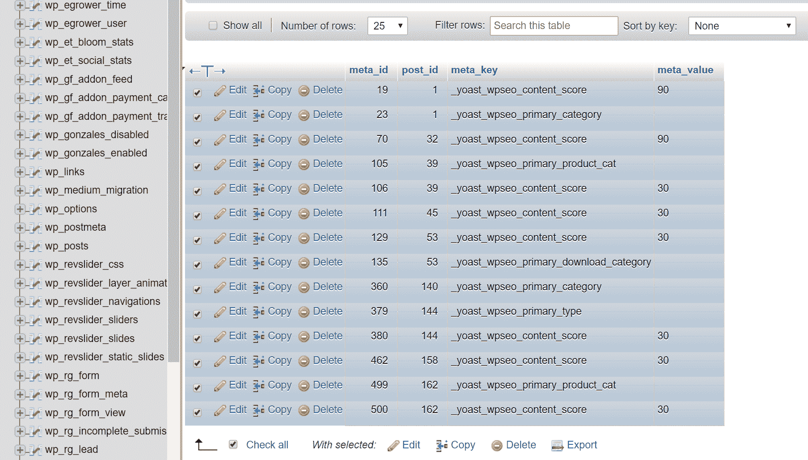

wp_postmeta table Yoast SEO


这里是 wp_usermeta 表。同样，首先通过“wpseo”过滤行是非常重要的然后选择剩余的并删除它们。


wp_usermeta table Yoast SEO


如果你正在使用新的文本链接计数器特性，你还必须删除两个额外的 Yoast SEO 表；wp_yoast_seo_links 和 wp_yoast_seo_meta。

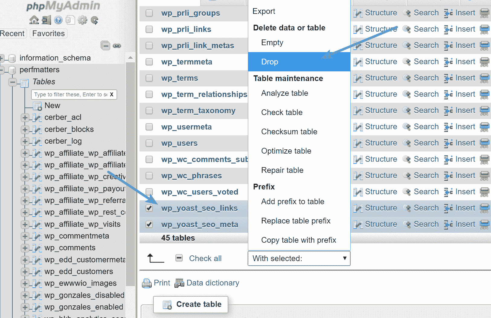

Drop Yoast SEO tables


最后一件事是清理 [CRON 作业](https://kinsta.com/knowledgebase/wordpress-cron-job/),如果有一个与插件一起运行的话。当然，您可以编辑 wp_options 表中的 cron 作业行，但是确保您不修改错误行的更简单的方法是用免费的 [WP Crontrol](https://wordpress.org/plugins/wp-crontrol/) 插件删除 CRON 作业。在 Yoast SEO 插件的例子中，它使用了一个名为“wpseo_onpage_fetch”的 Cron 作业，这个作业很容易被删除。

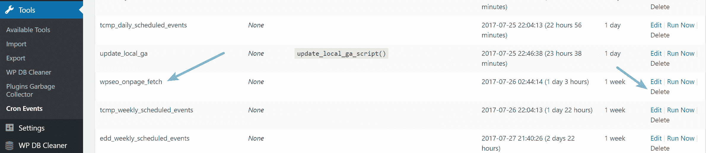

Delete wpseo_onpage_fetch cron job


## 摘要

如果你以前不知道，希望你现在知道更多关于如何正确卸载 WordPress 插件的知识。大多数插件都有很好的文档来说明如何完全删除它们，甚至在它们的设置中有一个选项。如果所有这些都失败了，试着谷歌一下如何去除它们。

推荐教程:[如何禁用 WordPress 插件](https://kinsta.com/knowledgebase/disable-wordpress-plugins/)(无 WP-Admin 权限)

所以下次你去删除一个插件的时候，决定你是否需要这些数据。如果你不知道，那就花一点时间来查找完全卸载插件的正确方法。这将确保您的数据库保持较小，并将磁盘大小降至最低。不要忘记通过删除和限制修订来优化你的数据库。

* * *

让你所有的[应用程序](https://kinsta.com/application-hosting/)、[数据库](https://kinsta.com/database-hosting/)和 [WordPress 网站](https://kinsta.com/wordpress-hosting/)在线并在一个屋檐下。我们功能丰富的高性能云平台包括:

*   在 MyKinsta 仪表盘中轻松设置和管理
*   24/7 专家支持
*   最好的谷歌云平台硬件和网络，由 Kubernetes 提供最大的可扩展性
*   面向速度和安全性的企业级 Cloudflare 集成
*   全球受众覆盖全球多达 35 个数据中心和 275 多个 pop

在第一个月使用托管的[应用程序或托管](https://kinsta.com/application-hosting/)的[数据库，您可以享受 20 美元的优惠，亲自测试一下。探索我们的](https://kinsta.com/database-hosting/)[计划](https://kinsta.com/plans/)或[与销售人员交谈](https://kinsta.com/contact-us/)以找到最适合您的方式。