# 负面 SEO(案例研究)-用 Ahrefs 清除攻击

> 原文：<https://kinsta.com/blog/negative-seo/>

负面搜索引擎优化是任何企业都不想处理的事情。这一点都不好玩，它会破坏你在搜索引擎中的网站，而且清理起来很费时间。然而，随着网络的持续增长，负面搜索引擎优化变得越来越常见。许多没有做错任何事情的网站现在受到了冲击。这甚至包括金斯塔！今天，我们将向您介绍我们如何清除对我们网站的攻击，以及如何提交否认文件。

定期检查和监控你的反向链接资料总是好的，否则，你可能会以谷歌对你的网站的手动操作而告终。然后你真的会陷入恐慌状态！当谈到负面 SEO 时，你不能总是阻止它，所以建议利用现有的伟大工具来知道何时应该采取行动。

[The best way to prevent negative #SEO disasters is to always be proactive. 💪Click to Tweet](https://twitter.com/intent/tweet?url=https%3A%2F%2Fkinsta.com%2Fblog%2Fnegative-seo%2F&via=kinsta&text=The+best+way+to+prevent+negative+%23SEO+disasters+is+to+always+be+proactive.+%F0%9F%92%AA)

## 什么是负 SEO？

Kissmetrics [将负面 SEO](https://blog.kissmetrics.com/spammers-and-negative-seo/) 定义为使用黑帽和不道德的技术来破坏竞争对手在搜索引擎中的排名。然而，重要的是要理解负面的 SEO 并不总是有意的。现在有链接农场，私人博客网络，[成千上万的机器人抓取网站](https://kinsta.com/blog/google-analytics-spam/)，以及各种各样产生链接的东西。有时，不幸的是，你的网站可能会简单地和其他人混在一起。

如果我们看看过去 24 个月的谷歌趋势，我们可以看到“负面搜索引擎优化”似乎在增长。这不会很快发生，所以理解为什么会发生以及如何保护你的网站是很重要的。

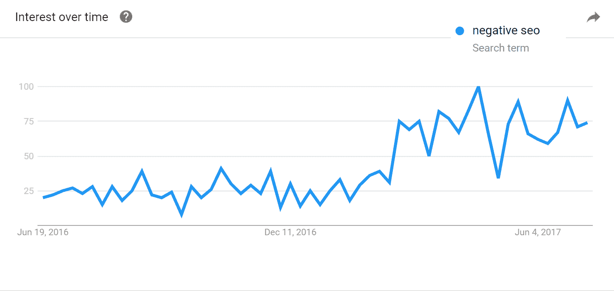

Negative SEO trends

有各种不同形式的负面搜索引擎优化。这里有几个例子:

*   针对您的域名建立垃圾链接
*   生成负面评论以影响 SERPs 中的评级
*   创建虚假的社交信号或个人资料
*   链接农场和私人博客网络(PBNs)
*   [抓取](https://kinsta.com/knowledgebase/what-is-web-scraping/)并重新分发您的内容
*   让你的网站去索引化(例如，入侵你的 robots.txt 文件)

最糟糕的一种可能是有人[侵入你的网站](https://woorkup.com/cleaning-negative-seo-attack-web-ceo/)并向其中注入成千上万的伟哥和药物术语。以下是一位营销人员某天早上醒来时的情景。这也被称为站内负面 SEO。重要的是要认识到，消极的搜索引擎优化不只是站外。如果谷歌发现一个链接农场来自你的 IP 地址或网站，你也会受到惩罚。

> Kinsta 把我宠坏了，所以我现在要求每个供应商都提供这样的服务。我们还试图通过我们的 SaaS 工具支持达到这一水平。
> 
> <footer class="wp-block-kinsta-client-quote__footer">
> 
> 
> 
> <cite class="wp-block-kinsta-client-quote__cite">Suganthan Mohanadasan from @Suganthanmn</cite></footer>

[View plans](https://kinsta.com/plans/)

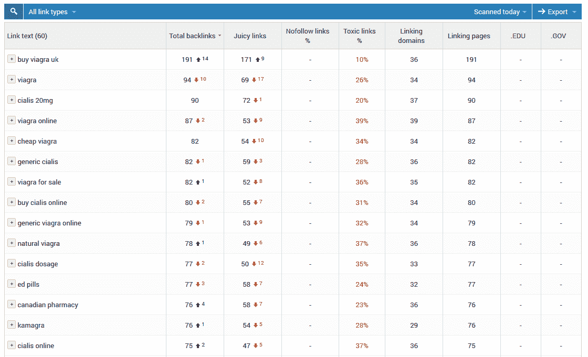

Spammy Viagra links

负面搜索引擎优化也比以前公开了很多。不久前，这只是互联网营销人员之间相互谈论的事情。但是现在你甚至可以在 Fiverr 这样的热门网站上搜索“负面搜索引擎优化”，一堆对你的竞争对手进行负面搜索引擎优化的广告(如下所示)就会出现。或者你可以很容易地浏览黑帽论坛，雇人开始建立针对你选择的任何人的坏链接。

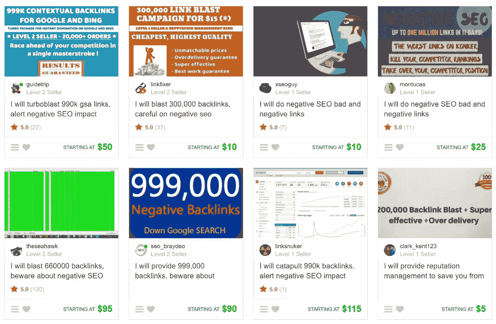

Negative SEO gigs

不幸的是，像上面这些服务现在让你的网站很容易成为竞争对手的目标。这就是为什么你总是需要保持警惕！

## 如何检查反向链接

所以你可能想知道，你如何检查你的反向链接？这就是反向链接工具的用武之地。有数百种不同的工具提供不同形式的数据，但我们将分享一些我们推荐和使用的工具，包括免费和高级工具。

### 免费反向链接工具

老实说，没有多少好的免费反向链接工具。原因是获取、过滤和传递数据需要大量的处理能力。一些网站有数百万的反向链接。这就是为什么你可能不会对许多免费工具感到满意。然而，有一对夫妇值得一提。

#### 1.谷歌搜索控制台

很多人并没有意识到这一点，但是谷歌实际上在[谷歌搜索控制台](https://kinsta.com/blog/google-search-console/)中免费提供了反向链接数据。如果你点击“链接到你的网站”下的搜索流量，你可以访问你的链接。使用 GSC 的一个缺点是，它没有关于链接的任何附加属性，比如它是 dofollow 还是 nofollow，锚文本等等。数据不是那么容易过滤的。在大多数情况下，您必须将其导出到 Excel，这可能会变得非常耗时。但你不能和免费争论，谷歌的抓取数据相当准确。

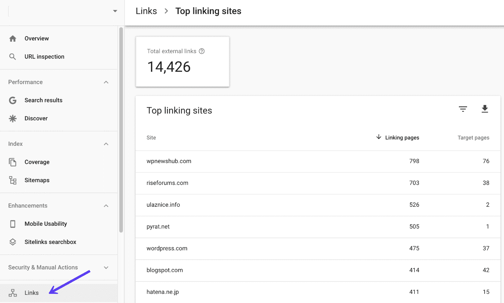

谷歌搜索控制台中的反向链接

#### 2.打开链接分析器

我们推荐的另一个免费反向链接工具是 SEOprofiler 团队的 [Open Link Profiler](http://www.openlinkprofiler.org) 。这允许你查看多达 200，000 个活跃的反向链接，这对很多人来说已经足够了。在网上免费的反向链接工具中，这可能给了你最多的数据。然而，这里的一个限制是，免费帐户一次只能导出 1000 个链接。

[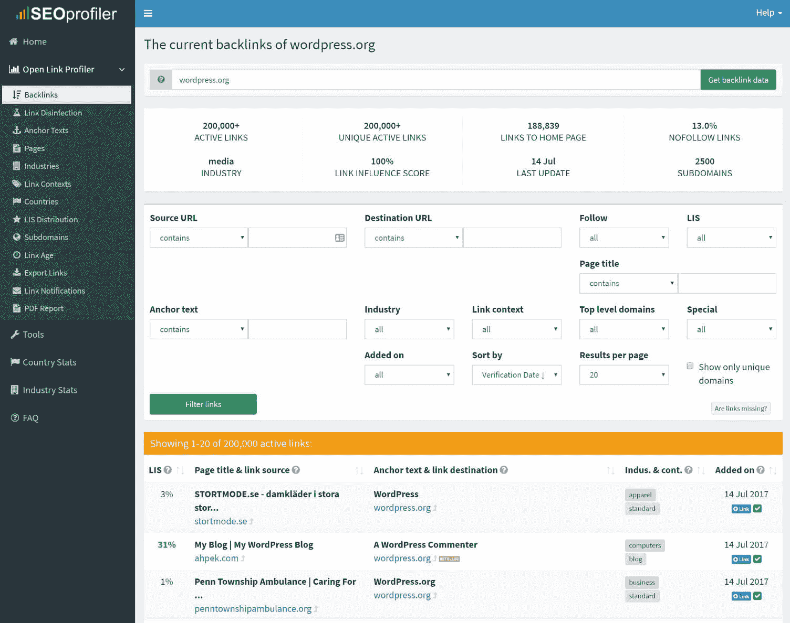](http://www.openlinkprofiler.org/)

Open Link Profiler

### 高级反向链接工具

如果你需要更深入地挖掘你的数据，过滤它，并导出它，你最好的选择是购买一个高级反向链接工具。我们建议至少每 3 到 6 个月进行一次反向链接审计。或者如果你像我们一样痴迷于数据，每周。网站越大，你可能需要更频繁地检查它，因为会有更多的链接不断出现。有时在这种情况下，你等待的时间越长，你就需要留出更多的时间进行审计。下面是我们推荐的几个高级反向链接工具。

#### 1.Ahrefs

我们在 Kinsta 利用了 Ahrefs，这是一个搜索引擎优化工具，你可以用它来做[关键词研究](https://kinsta.com/blog/keyword-research/)，进行竞争对手分析，监控反向链接等等。它拥有网络上最大的数据库之一，我们在很多事情上都依赖于它的数据。如果你对市场营销和 [SEO](https://kinsta.com/blog/what-does-seo-stand-for/) 相关话题感兴趣，他们还有一个非常棒的博客。

[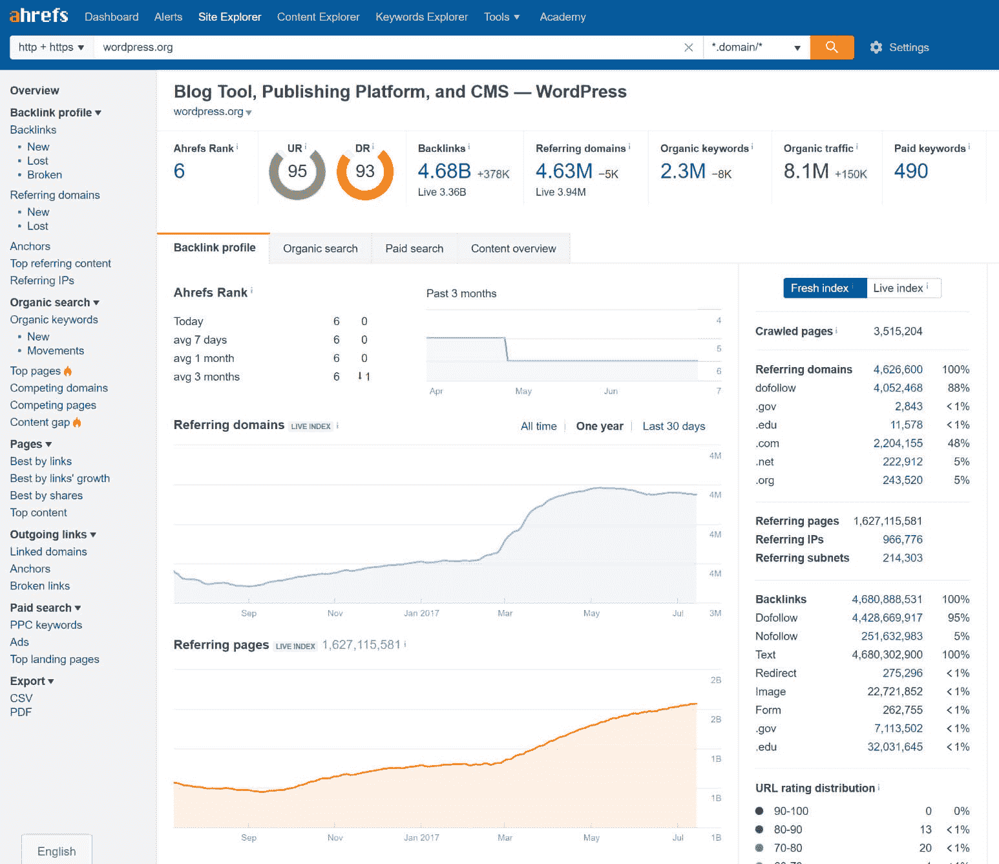](https://ahrefs.com/)

Ahrefs

#### 2.宏伟的

就像 Ahrefs 一样， [Majestic](https://majestic.com/) 也有一个非常大的反向链接数据库。事实上，这两种工具已经争斗多年，看谁能提供更多的数据。这两种工具都不会错。

[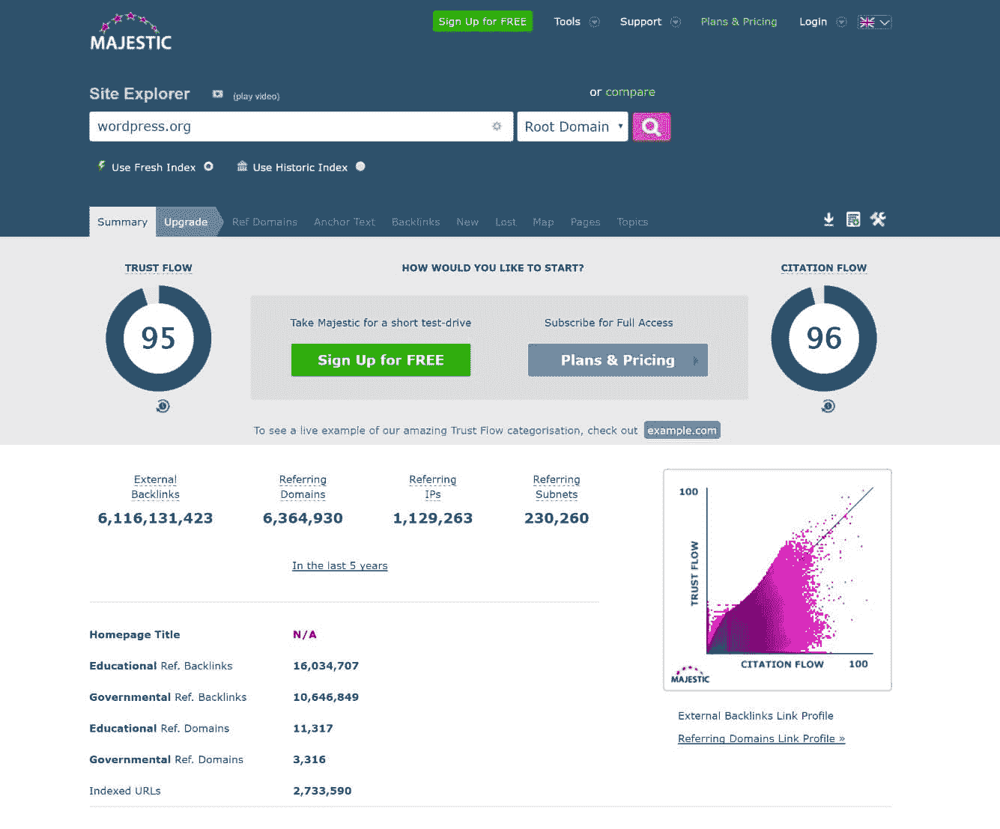](https://majestic.com/)

Majestic backlink tool

#### 3.开放站点浏览器

Moz 是一款面向数字营销人员和机构的一体化搜索引擎优化工具。他们有一个叫做 [Open Site Explorer](https://moz.com/researchtools/ose/) 的工具，可以让你访问大量的反向链接数据，类似于上面的工具。对于初学者来说，Moz 工具可能是更好的选择，因为它们以一种非常容易理解的格式呈现数据。他们还因为创造了许多营销人员所称的“领域权威”而广受欢迎谷歌仍然在幕后使用 PageRank，但不再发布或更新。因此，很多营销人员都在 Moz 上寻找域名授权来比较网站。

[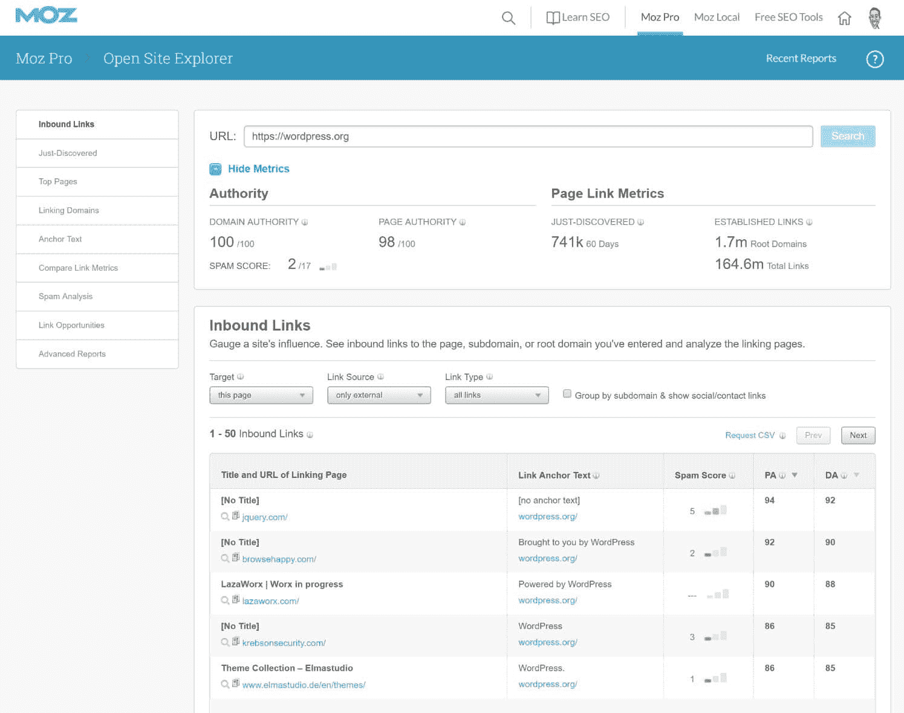](https://moz.com/researchtools/ose/) 

墨子打开站点浏览器

#### 4.塞姆拉什

最后， [SEMrush](https://www.semrush.com/analytics/backlinks/) 是面向数字营销专业人士的一体化竞争数据和分析工具。它没有上述工具所拥有的强大的反向链接数据库，但他们在不断改进它。肯定是要去检查的。

[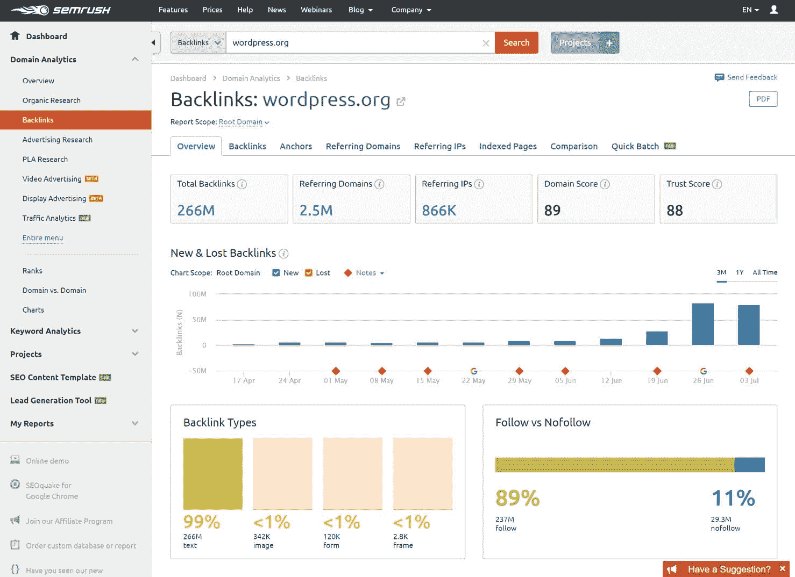](https://www.semrush.com/analytics/backlinks/)

SEMrush

我们还在 Kinsta 使用 SEMrush 来研究新的博客帖子想法，并战略性地为我们的集客营销做出数据驱动的决策[。这个工具让我们可以很容易地看到诸如关键词或主题的搜索量以及该关键词的竞争力。正如你们中的一些人可能知道的，谷歌不久前改变了他们的关键词规划工具，现在](https://kinsta.com/blog/inbound-marketing/)[相近的变体关键词](https://woorkup.com/close-variant-keywords/)显示出相同的搜索量。SEMrush 从许多不同的来源收集他们的搜索量，以及他们自己的数据库，所以这允许他们仍然为你提供准确的搜索量。

买不起包月？你可以做的一个选择是注册 30 天，导出数据，然后取消它。然后，你可以在 Excel 中自己挖掘，并根据自己的意愿处理数据。然后只需定期再次订阅以导出数据。在本帖中，我们回顾了更多的 [SEO 工具和插件。](https://kinsta.com/blog/best-seo-plugins-for-wordpress/)

## 负面搜索引擎优化攻击 Kinsta.com

大多数负面的搜索引擎优化攻击通常很容易被发现。它们通常都有某种类型的模式。几周前，我们开始看到数百个垃圾链接进来。他们都在不同的。传统知识领域(如下所示)，是 dofollow 链接，都指向我们博客上的同一篇文章。

Spammy links in Ahrefs

调查一个链接的简单方法是简单地点击它。然而，只是一个公平的警告，有时你可能会遇到恶意软件这样做。然而，经过进一步调查，似乎所有这些网站都是自动 RSS 帖子，这些帖子从他们链接到我们的 WordPress.org 帖子中抓取内容(见帖子:[WordPress 中的月份:2017 年 6 月](https://wordpress.org/news/2017/07/the-month-in-wordpress-june-2017/))。

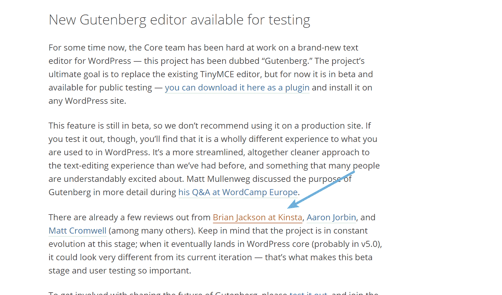

Backlink to Kinsta on WordPress.org

所以基本上发生的事情是，因为 WordPress.org 是如此受欢迎，有数百个网站抓取它并重新分发内容。对于大型网站来说，这并不罕见。然而，问题是所有这些垃圾网站现在都有指向 Kinsta 的 dofollow 链接。因此，尽管看起来这可能不是故意的，但我们陷入了一场大规模的抓取战，这仍然是一种消极的 SEO 形式。《WordPress.org 邮报》官方网站上的其他人也会有同样的问题，比如马特·克伦威尔和亚伦·乔宾。

## 注册订阅时事通讯

### 想知道我们是怎么让流量增长超过 1000%的吗？

加入 20，000 多名获得我们每周时事通讯和内部消息的人的行列吧！

[Subscribe Now](#newsletter)

有些时候，像这样的内容会消失，在这种情况下，你不需要担心。谷歌的算法通常可以确定垃圾链接农场的抓取网站。但这不是我们愿意赌的风险。这也是谷歌创造否认工具的原因之一。否认工具本质上允许你向谷歌提交一个链接列表，告诉他们应该忽略这些链接。这是谷歌在 2012 年创建的，目的就是为了对抗负面 SEO，防止人们伤害他人。

## 用 Ahrefs 清除负面 SEO 攻击

按照下面的步骤，如何使用 Ahrefs 来清除攻击，并向 Google 提交否认文件。注意:在这个例子中，我们使用了来自对 kinsta.com 的攻击的实际数据。当然，根据你自己链接的性质，这些步骤可能会稍有不同，但是策略是一样的。

### 第一步

假设你已经知道了这个模式，你要做的第一件事就是过滤你的链接。所以点击反向链接下的“新建”。然后点击“实时索引”这允许您只看到活动的链接。然后过滤垃圾链接。当然，这将根据您的 SEO 攻击的性质而有所不同。在我们的例子中，我们放入。tk，因为所有的垃圾域名都包含这个。并从下拉列表中选择“60”天。

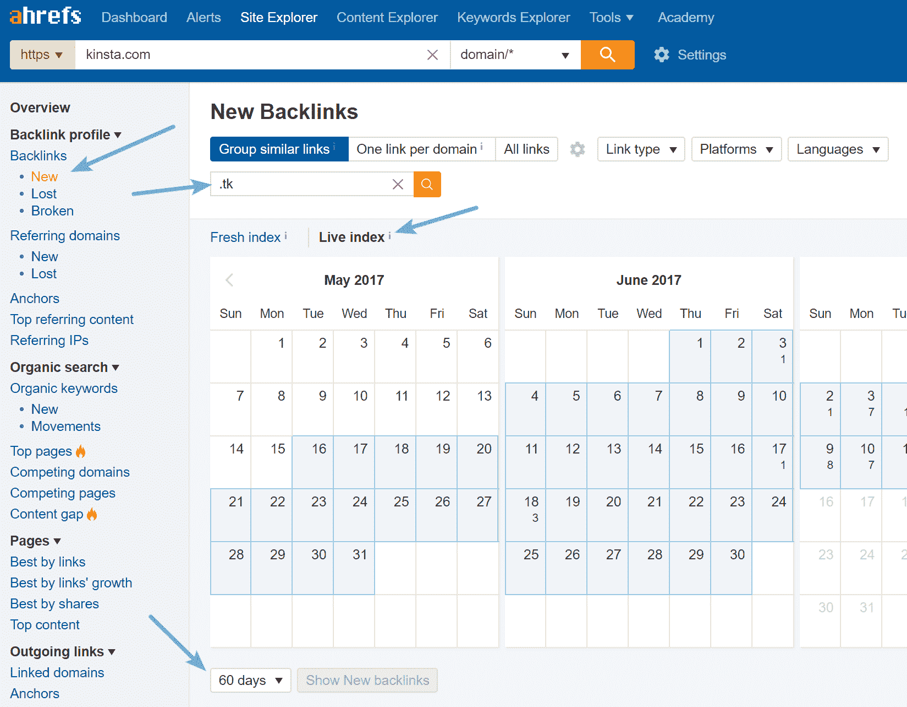

Filter backlinks in Ahrefs

### 第二步

根据有多少链接，你可能想展开它，以显示更多的每一页。在我们的例子中，有超过 100 个，所以我们必须这样做几次。然后选中左上角的框，选择页面上的所有链接，并点击“拒绝 URL”如果您愿意，也可以拒绝整个域，但是我们只建议在最后的情况下这样做。这样做的目的是在您的 Ahrefs 帐户中创建一个否认列表，以便您轻松访问。

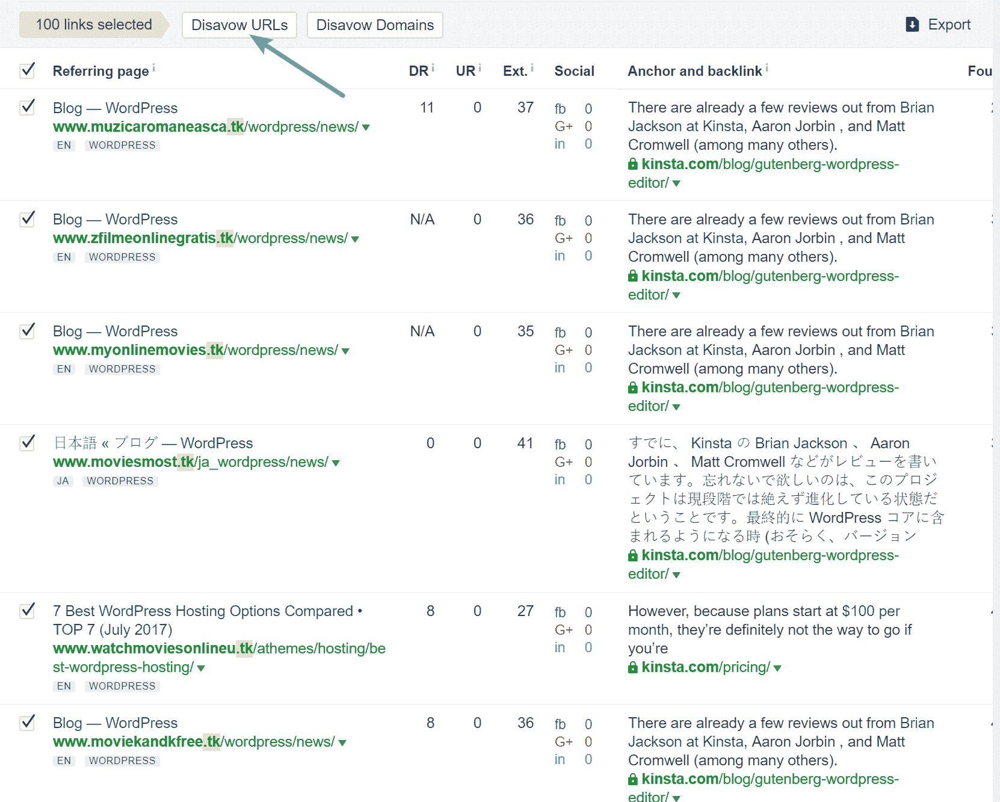

Ahrefs disavow URLs

### 第三步

然后，您将希望启用顶部的“隐藏否认的链接”。我们还没有提交否认文件，但我们会在下面。Ahrefs 不会为你向 Google 提交否认链接，他们只是创建一个列表。然而，这是一个付费使用高级反向链接工具的领域。通过隐藏它们，我们可以再次分析我们的反向链接档案，而不必再看到这些，因为我们知道它们被谷歌安全地忽略了。如果你正在使用一个免费的工具，你将不得不自己跟踪它，这可能是一个烂摊子。

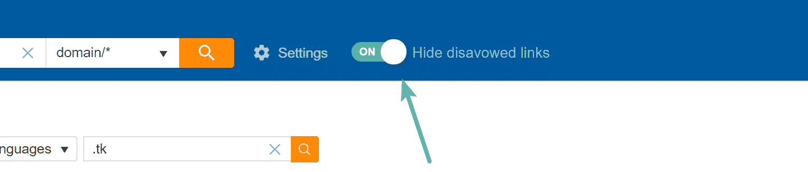

Hide disavowed links in Ahrefs

### 第四步

然后，您需要导出您的否认文件链接，以提交给谷歌。它位于项目旁边的主仪表板下。只需点击“否认链接。”

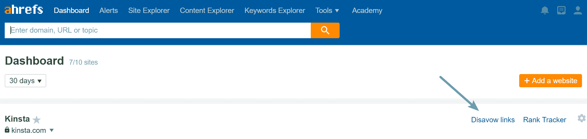

Disavow links list in Ahrefs

### 第五步

点击“导出”

Struggling with downtime and WordPress problems? Kinsta is the hosting solution designed to save you time! [Check out our features](https://kinsta.com/features/)

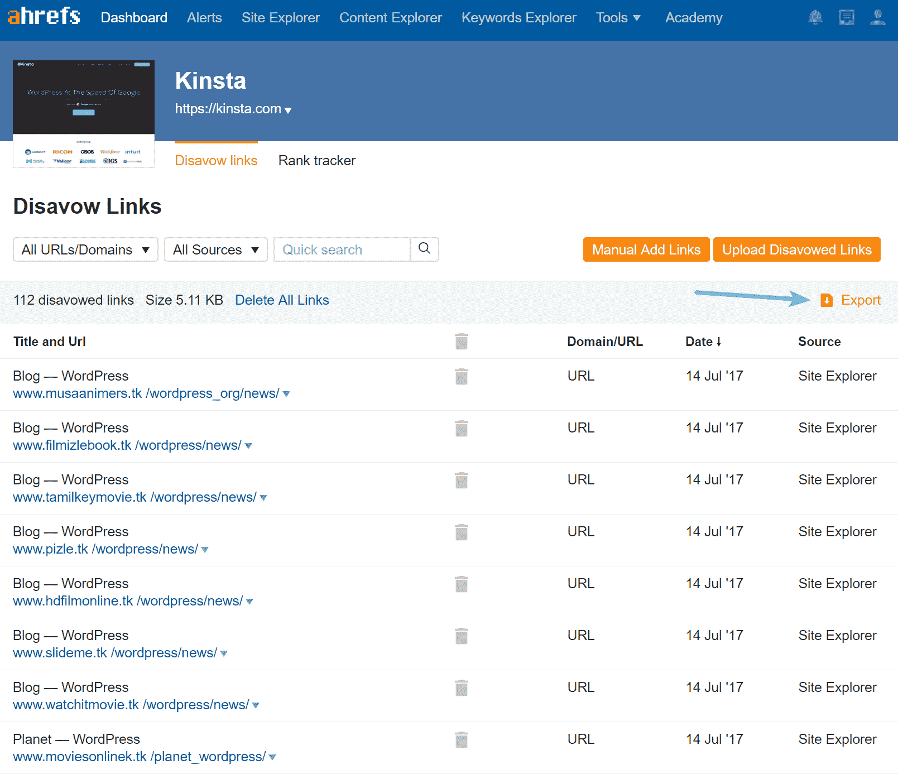

Export disavow links

### 第六步

选中“另存为 TXT”选项，然后单击确定。否认文件要求格式为。如果您正在编辑一个已经存在的否认文件，如果您需要先在 Excel 中合并一些数据，您可能希望不选中此选项。

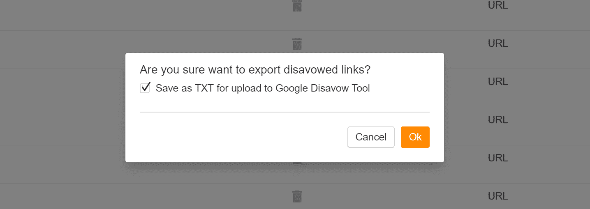

Save TXT disavow

我们现在有一个 disavow_links.txt 文件，其中包含所有垃圾链接。

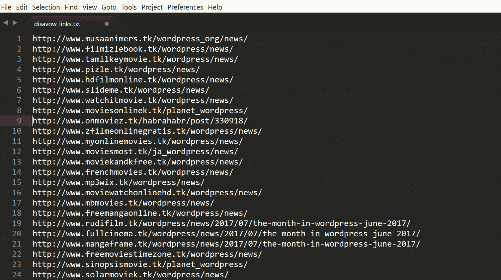

Spammy links

### 第七步

下一步是使用他们的[否认工具](https://www.google.com/webmasters/tools/disavow-links-main)提交给谷歌。只需在谷歌搜索控制台中选择你的网站，然后点击“否认链接”

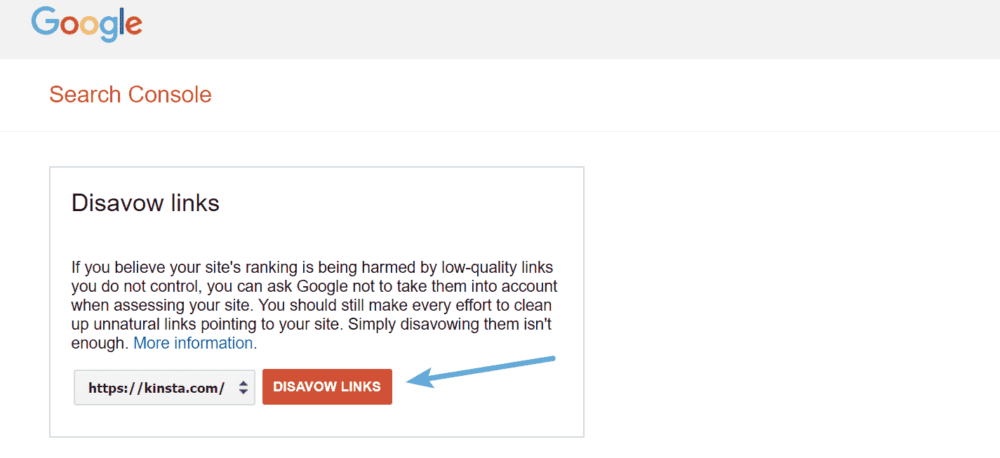

Disavow links

如果你的网站只在[新的谷歌搜索控制台](https://kinsta.com/blog/google-search-console/)中，你可以很容易地使用“URL 前缀”方法再次添加它，然后你可以用旧的否认工具访问它。他们很有可能最终将这个工具转移到新 GSC。

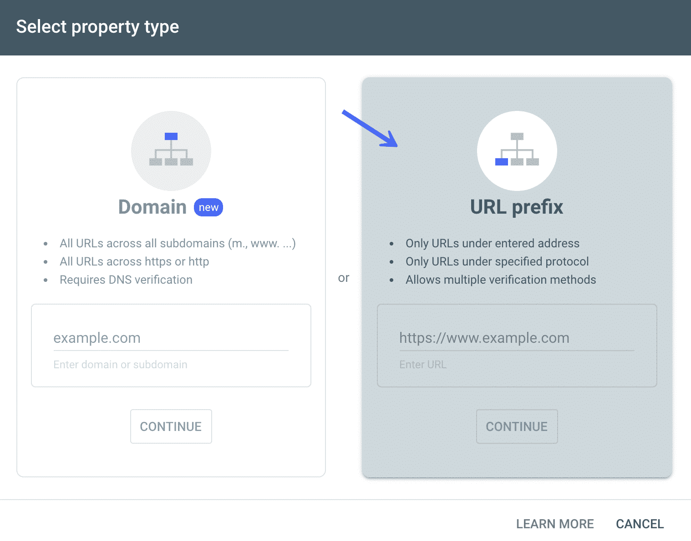

Google Search Console URL prefix

### 第八步

选择你的否认 TXT 文件，上传它，然后点击“提交”

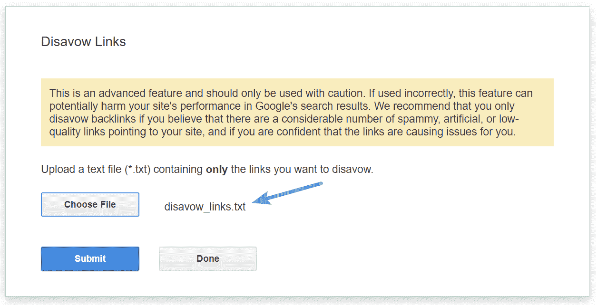

Submit disavow file

它保留了您最近提交的否认文件的副本。这样，万一你需要更新它，你可以再次下载，然后结合新的数据上传。

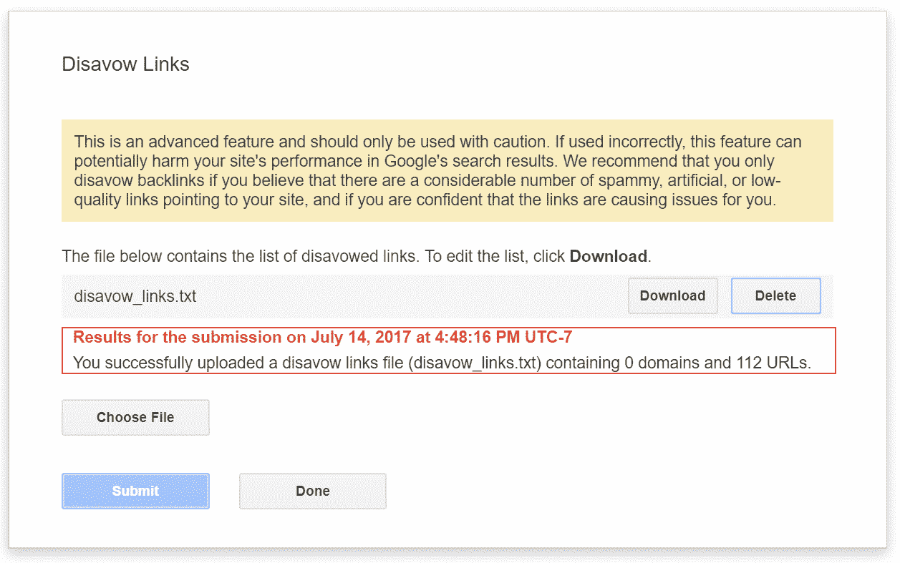

Download old disavow file

就是这样！你现在已经提交了一个否认文件，我们可以放心了，谷歌会忽略这些链接。然而，谷歌也建议你仍然应该尽一切努力清理指向你网站的不自然链接。为此，我们建议检查一下 [rmoov 工具](https://www.rmoov.com/index.php)。它基本上有助于自动化向网站所有者发送电子邮件要求他们删除链接的过程。这里有一个很好的教程[如何使用 rmoov 清理反向链接](https://woorkup.com/easily-cleanup-negative-seo-web-ceo-rmoov/)。

上面只是一个例子，而且是一个相当简单的例子。然而，负面搜索引擎优化攻击可以变得非常复杂。我们已经看到网站同时受到超过 20，000 个坏链接的攻击。在这种情况下，你肯定需要一些好的工具，甚至可能需要一个 SEO 专家来清理一切。但是同样的策略仍然适用，并且希望您现在知道一些自己做这件事的工具、技巧和步骤。

### 技巧 1——发现负面 SEO 的另一种方法

另一个发现负面 SEO 的简单方法是快速查看你的锚文本比例。在 Ahrefs 中，您可以通过点击“锚点”来快速完成此操作锚文本就是超链接中使用的文本。一个健康的锚文本比例很可能包含你的品牌术语的大部分，然后是你写的内容或登陆页面的其他各种关键字。如果你注意到一堆不寻常的锚文本术语，这可能是一些指向你的垃圾链接的迹象。在 Ahrefs 中，您可以点击“详细信息”来查看锚文本附带的域名和/或 URL。

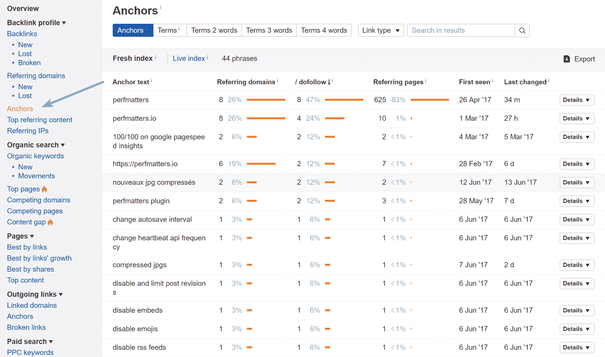

Anchor text ratio

### 提示 2–启用谷歌搜索控制台通知

我们强烈建议您[将您的网站连接到谷歌搜索控制台](https://woorkup.com/submit-website-to-google/)，然后在“搜索控制台首选项”下启用电子邮件通知。这将确保你从谷歌那里得到任何关于你网站上垃圾链接、[、断链](https://kinsta.com/blog/broken-links/)、404 错误增加等的通知。

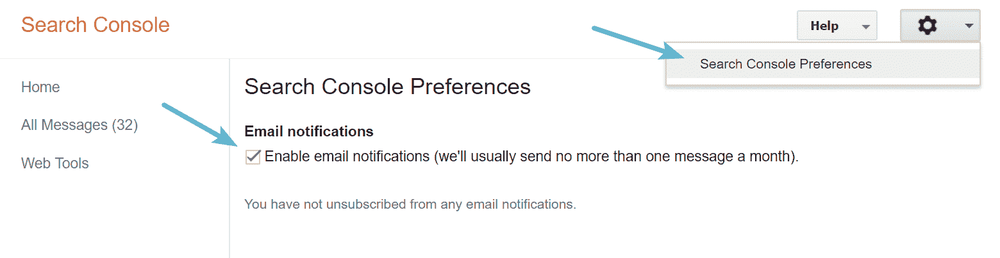

Google Search Console notifications

### 提示 3-复议请求

如果你的网站已经被谷歌采取了[手动操作](https://support.google.com/webmasters/answer/2604824?hl=en)，你应该会看到它出现在谷歌搜索控制台上。然后，您可以填写复议申请表。然而，在你这样做之前，清理你的站点是很重要的。很多时候，手动操作信息不会给你一个完整的错误信息，但它通常会给你指出正确的方向。使用我们上面提到的工具之一检查你的反向链接档案是一个好的开始。

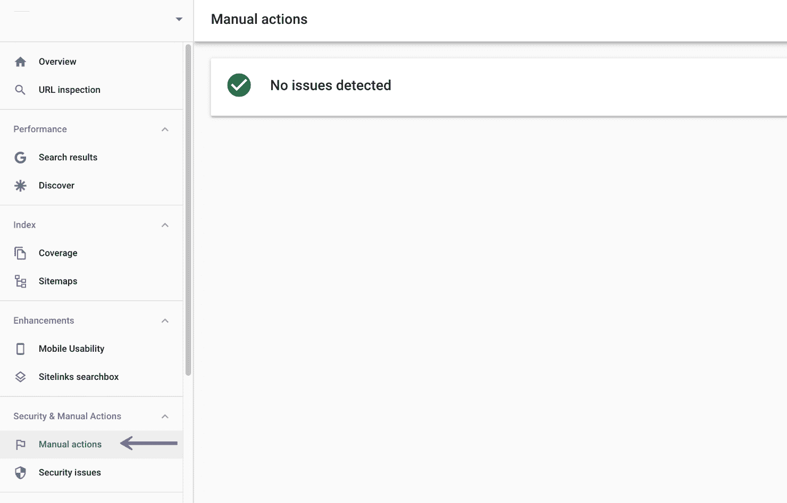

Google Search Console manual actions

## 摘要

负面 SEO 是没有人想处理的事情，但在 2018 年，这是你最有可能在某一点上遇到的真实问题。你真的想相信谷歌会整理出所有的垃圾链接吗？安全总比后悔好。有一个好的反向链接检查工具，如 Ahrefs，可以帮助您监控您的网站，并确保只有高质量的链接进来。它还可以使取消链接的过程更快。

你遇到过负面 SEO 攻击吗？如果有，你的经历是什么？请在评论中告诉我们。

* * *

让你所有的[应用程序](https://kinsta.com/application-hosting/)、[数据库](https://kinsta.com/database-hosting/)和 [WordPress 网站](https://kinsta.com/wordpress-hosting/)在线并在一个屋檐下。我们功能丰富的高性能云平台包括:

*   在 MyKinsta 仪表盘中轻松设置和管理
*   24/7 专家支持
*   最好的谷歌云平台硬件和网络，由 Kubernetes 提供最大的可扩展性
*   面向速度和安全性的企业级 Cloudflare 集成
*   全球受众覆盖全球多达 35 个数据中心和 275 多个 pop

在第一个月使用托管的[应用程序或托管](https://kinsta.com/application-hosting/)的[数据库，您可以享受 20 美元的优惠，亲自测试一下。探索我们的](https://kinsta.com/database-hosting/)[计划](https://kinsta.com/plans/)或[与销售人员交谈](https://kinsta.com/contact-us/)以找到最适合您的方式。