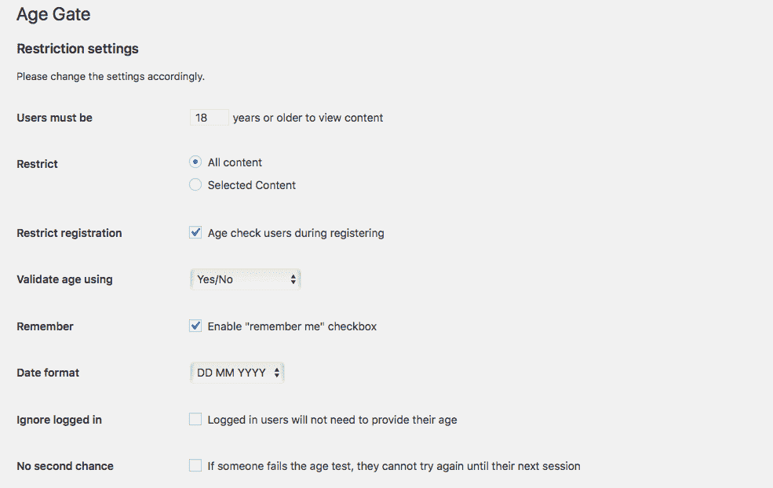
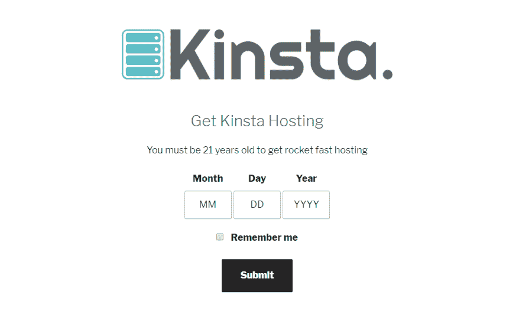
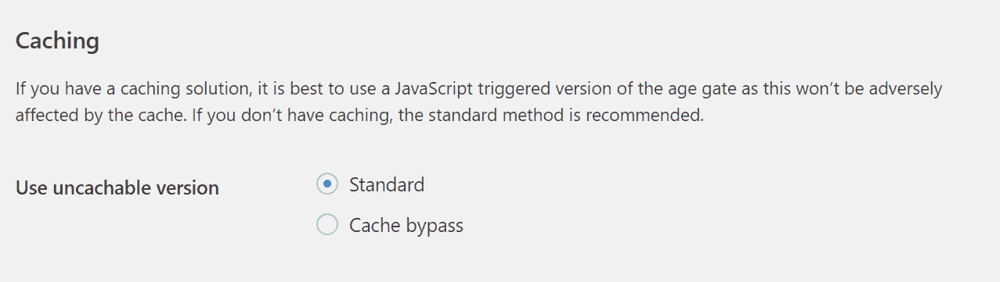
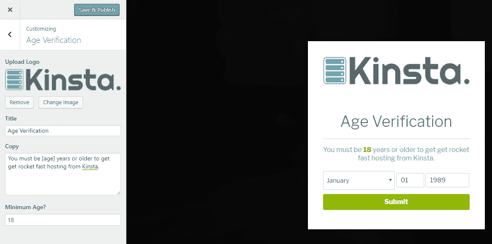
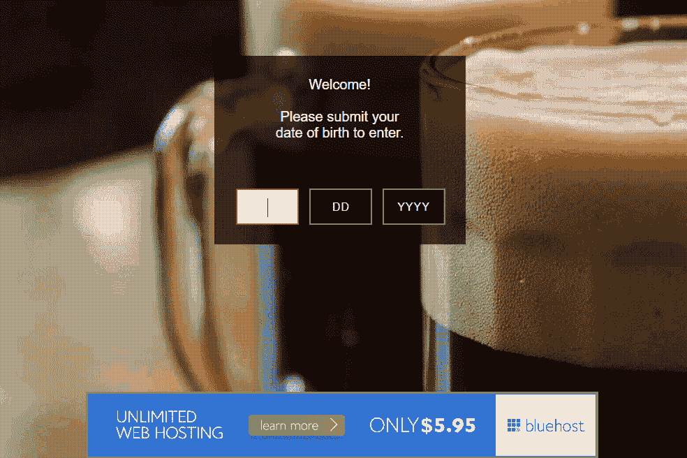
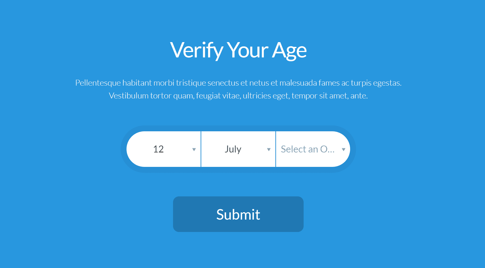
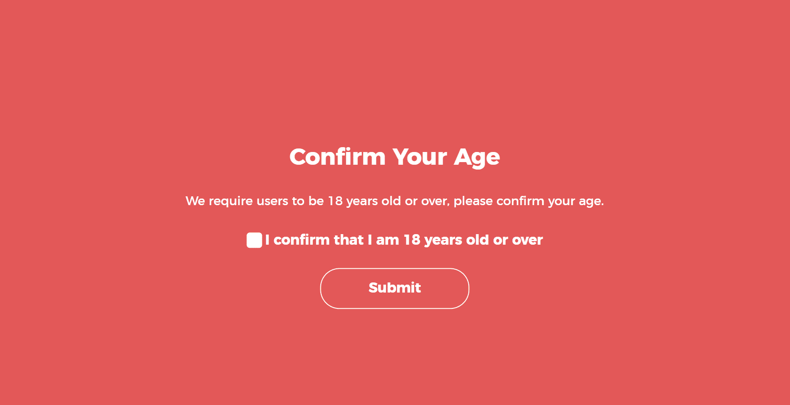

# 5 个 WordPress 年龄验证插件帮助你添加一个年龄门

> 原文：<https://kinsta.com/blog/wordpress-age-verification/>

需要给你的 WordPress 站点添加一个年龄检查门吗？使用一个预建的 WordPress 年龄验证插件将是一个比尝试定制你自己的解决方案更简单的选择。虽然大多数主要司法管辖区的法律在技术上不要求设置年龄门，但很多从事年龄敏感行业的企业选择使用年龄门来至少部分控制访客的年龄。常见的行业包括酒精、烟草、赌博等等。

此外，尽管年龄门在大多数国家都不是必需的，但美国人可能有兴趣知道联邦贸易委员会(FTC)仍然(T2)建议(T4)使用年龄验证技术。不管你的理由是什么，使用以下任何一个 WordPress 年龄验证插件，给 WordPress 添加一个年龄门都很容易。

## 2022 年最佳 WordPress 年龄验证插件

在接下来的章节中，我们将会看到六个不同的 WordPress 年龄验证插件。前两个是 100%免费的，第三个是免费增值模式，第四个和第五个是收费的。如果你想跳转到一个特定的插件，你可以使用下面的链接。否则，我们将按顺序逐一查看:

*   [年龄门](#age-gate)
*   [药房年龄验证](#dispensary)
*   [存储验证](#ageverify)
*   WordPress 的年龄验证器
*   [年龄检查器](#age-checker)

### 1 。年龄门

Age Gate 是一个相当新的版本——写这篇文章的时候才发布了一个月左右。尽管它还很年轻，但它有一个吸引人的功能列表，良好的(尽管有限的)评论，以及一个正在推出大量新版本的响应迅速的开发者。

Age Gate WordPress plugin

让我们从最有帮助的特性开始。该插件排除了搜索引擎爬虫和机器人，这样它们就不会在抓取你的网站时遇到任何问题。除此之外，它还通过让您:

*   选择限制整个网站还是只限制特定内容
*   在你的注册表格中特别添加一个年龄门
*   允许用户通过三种不同的方法输入他们的年龄(有简单的是/否选项)
*   添加一个*可选的*“记住我”框，用户可以检查以避免未来的年龄检查
*   从年龄检查中排除登录用户
*   SEO 友好-年龄检查中省略了常见的机器人和爬虫

Age Gate settings panel

除了这些功能，您还可以将自己的徽标添加到年龄检查表单中，并自定义出现的所有文本。默认风格也比我们之前看到的年龄验证插件更现代一些:

> 需要在这里大声喊出来。Kinsta 太神奇了，我用它做我的个人网站。支持是迅速和杰出的，他们的服务器是 WordPress 最快的。
> 
> <footer class="wp-block-kinsta-client-quote__footer">
> 
> 
> 
> <cite class="wp-block-kinsta-client-quote__cite">Phillip Stemann</cite></footer>

[View plans](https://kinsta.com/plans/)

Age gate created by the plugin

最后，刚刚添加的一个特性是切换到 JavaScript 触发版本的能力。这将确保你可以绕过你的主机或插件的缓存。

Not caching on age gate

老实说，这款手机的功能非常棒。它唯一缺少的是年龄和知名度。

### 2 。药房年龄验证

虽然[药房年龄验证](https://wordpress.org/plugins/dispensary-age-verification/)在技术上是 WP 药房插件的一个附加组件，但你不需要使用核心插件来使用这个附加组件，药房年龄验证也不限于它所处理的主题。

Dispensary Age Verification WordPress plugin

它实际上是一个轻量级的，但仍然相当灵活的解决方案，为您的整个网站添加一个简单的年龄门。整个网站部分是最重要的——无论访问者第一次访问哪个页面，插件都会显示年龄门。但是如果你同意的话，你可以通过 WordPress 定制器完全控制你的年龄门的设计。

激活药房年龄验证后，您可以进入**外观→定制→年龄验证**来设置您的:

*   标志；徽标
*   标题
*   消息
*   最低年龄

Using the WordPress Customizer to make changes

因为设置使用本地 WordPress 定制器，你可以实时预览你所有的修改。除了定制你的年龄限制，你不需要做其他任何事情。也就是说，只要你激活了插件，年龄门就开启了。要关闭它，你需要停用插件。

## 注册订阅时事通讯

### 想知道我们是怎么让流量增长超过 1000%的吗？

加入 20，000 多名获得我们每周时事通讯和内部消息的人的行列吧！

[Subscribe Now](#newsletter)

### 3。AgeVerify

[AgeVerify](https://wordpress.org/plugins/ageverify/) 在 WordPress 年龄验证的方法上更加严格。它给你大量不同的模板来匹配各种用途。

AgeVerify WordPress plugin

但是……这个插件有一个很大的缺点。免费版支持广告。这意味着如果你想从你的年龄验证门中删除广告，你需要花 59 美元购买专业版。它确实为您提供了相当大的灵活性，允许您设置:

*   自定义 cookie 过期时间
*   自定义重定向 URL

它使用的背景图片是一个很好的接触。但简单的事实是，除非你为专业版付费，否则你的年龄门槛将会是这样的:

Using an included background

这看起来不太专业，不是吗？总而言之，如果你愿意付费，AgeVerify 很灵活，看起来也很棒，但免费版本不是最好的选择。

Struggling with downtime and WordPress problems? Kinsta is the hosting solution designed to save you time! [Check out our features](https://kinsta.com/features/)

### 4 。WordPress 的年龄验证器

WordPress 的年龄验证器是这个列表中第一个不提供任何免费版本的插件。虽然它的价格仍然在 17 美元，但你在做决定时应该考虑到这一点。

Age Verifier WordPress plugin

只需 17 美元，你就可以得到一些华丽的设计，以及一个有用的视觉生成器来定制你的年龄门的外观。您还可以选择不同的验证方法，以及 cookie 在过期前应该持续的时间。

A more modern-looking age gate

另一件好事是，你可以添加动画效果时，你的年龄门出现。老实说，核心功能和免费插件提供的功能没有太大区别。

**你购买这个插件的决定基本上可以归结为:**我愿意花 17 美元让我的年龄门看起来更好吗？如果有，就抓这个。如果没有，你可以使用免费的 WordPress 年龄验证插件。

### 5.年龄检查器

WordPress 的 Age Checker 是另一个你可以选择的高级插件。它只有 14 美元，并提供了一些上面其他插件没有的独特功能。

Age Checker for WordPress plugin

年龄检查插件提供 3 种背景模式，纯色，图像或视频。虽然上面的许多解决方案都有生日选项，但这个插件的一个独特之处是能够有一个简单的复选框或输入验证方法。也许你需要一些简单的东西，比如让访问者再次确认他们已经结束了，但是你不想走得太远，以至于要求一个 DOB。这是一个伟大的工程！

Confirm age in WordPress

您还可以重定向用户、更改表单验证文本和 cookie 生命周期。爬虫可以从年龄验证中省略，以确保这不会损害你的 SEO。

## 你应该选择哪个 WordPress 年龄验证插件？

最终，Age Gate 实现了功能和风格的最佳融合，只是缺少像 WordPress 的 Age Verifier 这样广受好评的选项。药房年龄验证也提供了一个很好的轻量级解决方案，尽管它不像其他插件那样提供同样深度的功能。

我们错过了一个伟大的 WordPress 年龄验证插件吗？如果你知道一个好的选择，值得在这个列表中，请在下面的评论中告诉我们。

* * *

让你所有的[应用程序](https://kinsta.com/application-hosting/)、[数据库](https://kinsta.com/database-hosting/)和 [WordPress 网站](https://kinsta.com/wordpress-hosting/)在线并在一个屋檐下。我们功能丰富的高性能云平台包括:

*   在 MyKinsta 仪表盘中轻松设置和管理
*   24/7 专家支持
*   最好的谷歌云平台硬件和网络，由 Kubernetes 提供最大的可扩展性
*   面向速度和安全性的企业级 Cloudflare 集成
*   全球受众覆盖全球多达 35 个数据中心和 275 多个 pop

在第一个月使用托管的[应用程序或托管](https://kinsta.com/application-hosting/)的[数据库，您可以享受 20 美元的优惠，亲自测试一下。探索我们的](https://kinsta.com/database-hosting/)[计划](https://kinsta.com/plans/)或[与销售人员交谈](https://kinsta.com/contact-us/)以找到最适合您的方式。