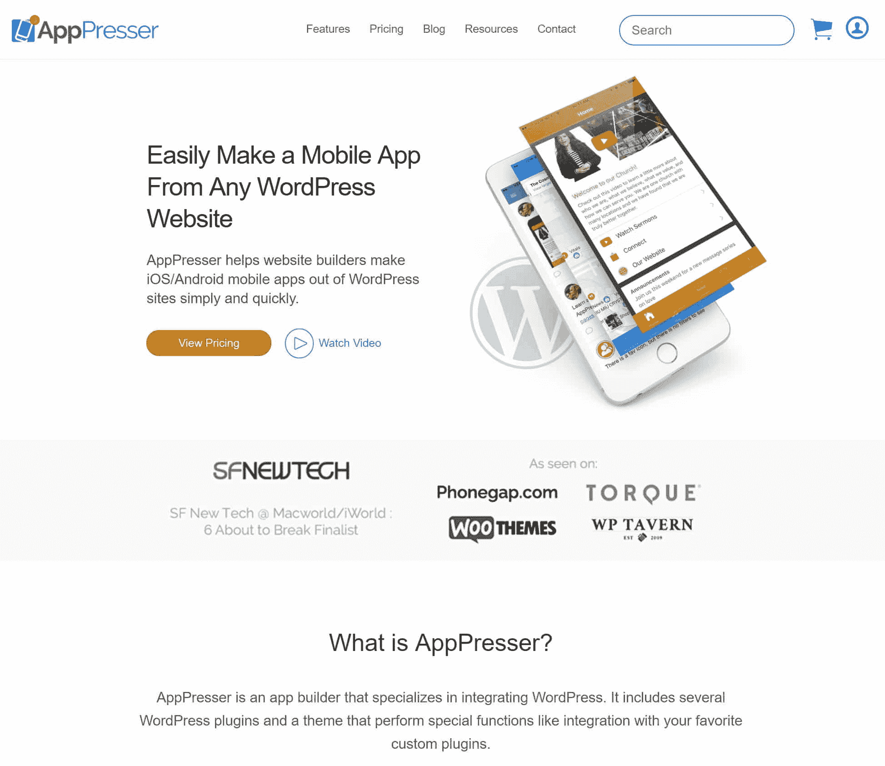

# 金斯塔·金并:斯科特·博林格访谈

> 原文：<https://kinsta.com/blog/interview-scott-bolinger/>

你可以在 LinkedIn 或 T2 的 Twitter 上找到斯科特。这是我们最近对他的采访，作为我们[金斯塔·金并](https://kinsta.com/?post_type=post&s=kingpin)系列的一部分。

### Q1:你的背景是什么，你是如何开始使用 WordPress 的？

我没有像很多人一样在编码中长大，我很晚才开始玩这个游戏。我实际上在大学获得了音乐(爵士吉他)学位，之后继续卖船。大约在 2005 年，我开始为我工作的船只经销店制作网站，并对网页和平面设计产生了兴趣。我找到了一份平面设计师的工作，很快就变成了网页设计，然后我开始自己创业，开始做客户工作。我进入 WordPress 是为了给我的客户提供一种简单的网站整合方式，从那以后我一直在深入研究。2010 年左右，我创办了一家高级主题公司，还为健身专业人士创建了一个 SaaS 网站。

### Q2:读者应该知道你最近在 WordPress 做了些什么？

我在 2013 年末开始使用 AppPresser，我们在 2014 年 1 月发布了我们产品的第一个版本。从那以后我就一直在做这件事。

AppPresser

### Q3:在职业生涯中，你遇到了哪些挑战？

当我们开始使用 AppPresser 时，我们并不知道它是否会成功。我只知道我想在 WordPress 的基础上开发移动应用程序，但对应用程序了解不多。我们一路走来，想出了每一件事，然后祈祷苹果不会拒绝我们创建应用程序的独特方式。很明显，最后一切都解决了，我们已经走了很长一段路。我们现在是我们平台的第三个主要版本，比我们开始的地方大了好几光年。

### 在 WordPress 的世界里，有没有什么让你感到惊讶的事情？

我对 AppPresser 的成功感到惊讶，我们在头 3 周就卖出了 5 位数的销量。这真是一段有趣的旅程，有很多起伏。我真的很期待在未来几年变得更大。

### Q5:你认为 WordPress 世界的未来会是怎样的？

今年，我认为很多插件开发者将开始转移到 SaaS。一些早期的插件商店现在是数百万美元的公司，他们正在努力扩大规模，想得更大。一些 WordPress 公司以 7 到 8 位数的价格被收购，这无疑改变了我对我的生意的看法。过去很少有 7 位数的 WordPress 产品业务，但这种情况正在迅速改变。

### 你在 WordPress 主机中寻找什么？

我需要一个可靠的 WordPress 主机，有很大的技术支持。我不浪费便宜的主机服务，我需要我的网站，我愿意为此付费。

['I don’t mess around with cheap hosting, I need my site up and I’m willing to pay for it.' ?Click to Tweet](https://twitter.com/intent/tweet?url=https%3A%2F%2Fkinsta.com%2Fblog%2Finterview-scott-bolinger%2F&via=kinsta&text=%27I+don%E2%80%99t+mess+around+with+cheap+hosting%2C+I+need+my+site+up+and+I%E2%80%99m+willing+to+pay+for+it.%27+%3F)

### 问题 7:当你离开笔记本电脑时，你喜欢做什么？

我经常骑山地车，在拉古纳海滩和阿里索别霍附近有一些很棒的小路。我也经常和家人在一起，主要是追着我的孩子跑！

### 问题 8:接下来我们应该采访谁&为什么？

来自 GiveWP 的 [Devin](https://twitter.com/innerwebs) 。

* * *

让你所有的[应用程序](https://kinsta.com/application-hosting/)、[数据库](https://kinsta.com/database-hosting/)和 [WordPress 网站](https://kinsta.com/wordpress-hosting/)在线并在一个屋檐下。我们功能丰富的高性能云平台包括:

*   在 MyKinsta 仪表盘中轻松设置和管理
*   24/7 专家支持
*   最好的谷歌云平台硬件和网络，由 Kubernetes 提供最大的可扩展性
*   面向速度和安全性的企业级 Cloudflare 集成
*   全球受众覆盖全球多达 35 个数据中心和 275 多个 pop

在第一个月使用托管的[应用程序或托管](https://kinsta.com/application-hosting/)的[数据库，您可以享受 20 美元的优惠，亲自测试一下。探索我们的](https://kinsta.com/database-hosting/)[计划](https://kinsta.com/plans/)或[与销售人员交谈](https://kinsta.com/contact-us/)以找到最适合您的方式。