# 如何用 TablePress 在 WordPress 中轻松创建表格

> 原文：<https://kinsta.com/blog/tables-in-wordpress-tablepress/>

在你的 WordPress 站点上组织大量数据的最好方法之一是使用一个简单的表格。不幸的是，WordPress 并没有提供表格支持作为一个原生功能。今天我们想深入一个非常流行的 WordPress 插件，名为 [TablePress](http://tablepress.com/) ，并向你展示它如何帮助你在没有任何编码知识的情况下轻松地在 WordPress 中创建表格。它目前拥有超过 700，000 个活跃安装和令人惊讶的 WordPress.org 5 星评级，即使在 2，900+评论之后！

显然，这是一个优秀的、编码良好的插件，在 WordPress 社区引起了很好的共鸣，是在 WordPress 中创建表格的理想解决方案。

## TablePress WordPress 插件

在我们深入这篇文章的本质并学习如何在你的 WordPress 文章和页面中添加表格之前，让我们快速看一下 TablePress 提供的一些关键特性，这些特性使它在竞争中脱颖而出。

TablePress WordPress plugin

*   **多种导入格式:**使用 TablePress，您不仅可以通过在 WordPress 表格编辑器中输入数据来从头开始创建表格，还可以从 Excel、CSV、HTML 和 JSON 文件等多种格式导入数据。这个领域的几个竞争对手插件只提供一种输入格式，在你的指尖有各种各样的输入格式是非常方便的。
*   **导出您的表格:**如果您已经在 TablePress 界面中创建了一个表格，您可以轻松地将您的表格导出为 CSV、HTML 或 JSON 文件。如果你迁移到一个新的 WordPress 安装或者甚至一个新的 CMS，这是一个非常方便的保存数据的方法。
*   **扩展您的能力:**TablePress 的开发者 Tobias BTH ge 为 TablePress 开发了几个[附加功能](https://tablepress.org/extensions/)，大大扩展了它的能力。这些扩展内置了对诸如制作响应表、列过滤器、前端用户的保存到 PDF 按钮等的支持..所有的扩展都可以免费下载，但是有几个非常耗时的(标有“premium”)建议你在下载它们的时候用[的小额捐赠](https://tablepress.org/donate/)来支持开发者。

## 如何用 TablePress 在 WordPress 中创建表格

现在我们已经介绍了这个插件的特性，让我们深入了解如何使用 TablePress 在 WordPress 中插入表格。

*   [从头开始创建表格](#create-table)
*   [导入表格](#import-table)
*   [导出表格](#export-table)
*   [插件选项](#plugin-options)

### 从头开始创建表格

让我们从了解如何使用 TablePress 非常简单直观的界面从头开始创建表格开始我们的教程。

> Kinsta 把我宠坏了，所以我现在要求每个供应商都提供这样的服务。我们还试图通过我们的 SaaS 工具支持达到这一水平。
> 
> <footer class="wp-block-kinsta-client-quote__footer">
> 
> 
> 
> <cite class="wp-block-kinsta-client-quote__cite">Suganthan Mohanadasan from @Suganthanmn</cite></footer>

[View plans](https://kinsta.com/plans/)

#### 第一步

在你的仪表板中安装并激活插件后，前往 *WP 管理>表按*。这个页面是插件的控制中心。创建、编辑和定制表格的过程都将从这里开始。第一次访问该页面时，您会发现一条欢迎消息，其中包含 [FAQ](https://kinsta.com/blog/wordpress-faq-plugins/) 、文档、支持链接以及您的表格列表(将为空)。首先，单击页面导航上的“添加新项”按钮。

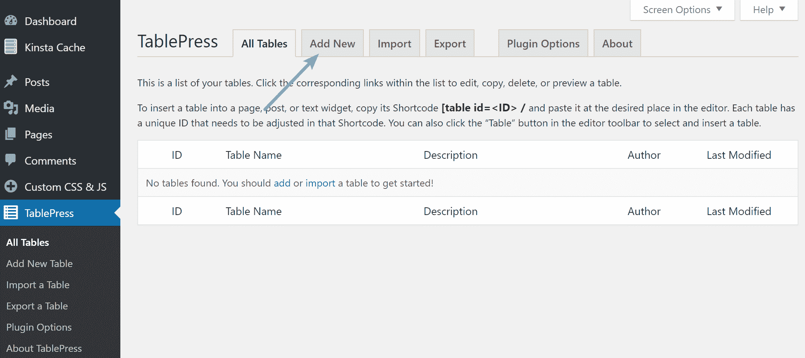

TablePress options

#### 第二步

在 Add New 页面上，将提示您键入表的名称，输入描述(可选)，并指定表的维度(行数和列数)。完成后，点击“添加表格”按钮。作为一个例子，我们将做一个虚构的蛋糕面包店表。

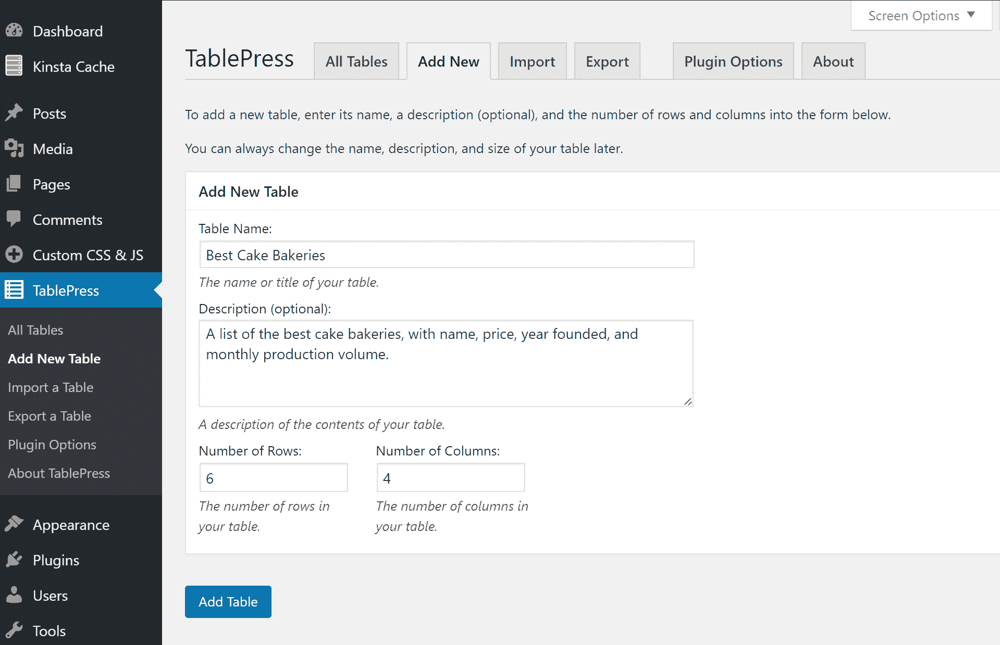

Add new table in TablePress

#### 第三步

在下一页，您的表格将被分配一个 ID 和一个短代码，您将使用该短代码将表格添加到您的帖子和页面中。您还将开始填写新表格的各个单元格。用于填写表格的界面简单明了，有点类似于普通的 Excel 电子表格。这是当你的表格都填好之后的样子。

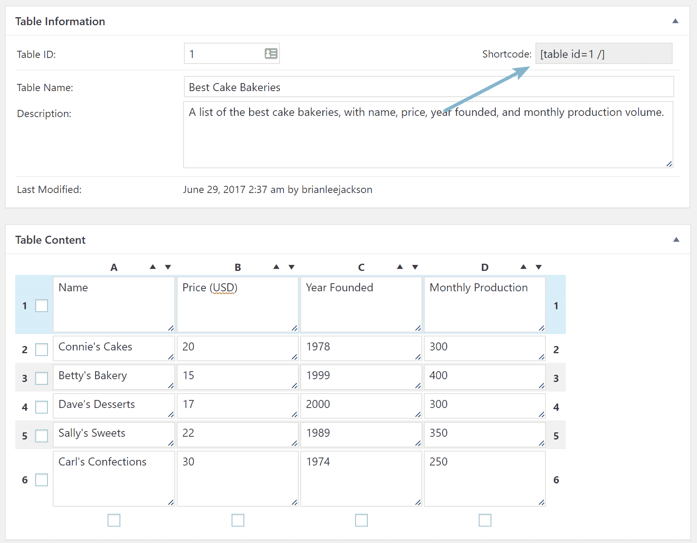

TablePress shortcode

#### 第四步

在同一页面的更下方，您可以尝试一些基本选项。您可以在单元格中插入链接/图像，复制/删除选定的行和列，添加 CSS 类以进行样式设置，合并单元格，逐行替换颜色，启用排序/分页，等等。

该插件会自动假设你的第一行是表格的标题行，但是你可以选择不这样做，甚至可以将最后一行改为表尾。

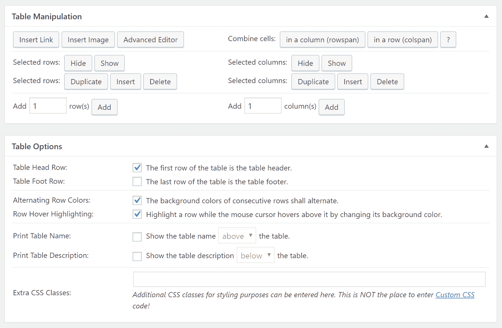

TablePress manipulation

还有一个“高级编辑器”按钮，为您提供了一个功能更强大的界面，您可以在其中输入表格数据。

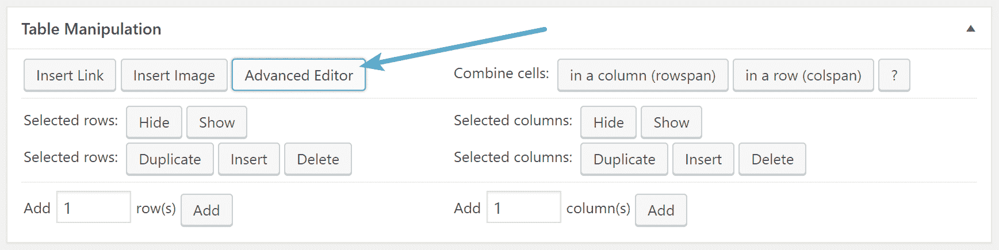

TablePress advanced editor

不过，使用起来相当耗时，因为您必须单击该按钮，然后单击您想要编辑的单元格，才能访问高级编辑器，并且您必须对每个单元格重复这一操作。在我们看来，真的不值得这么麻烦。但是根据你输入的数据量，它可能是有用的。

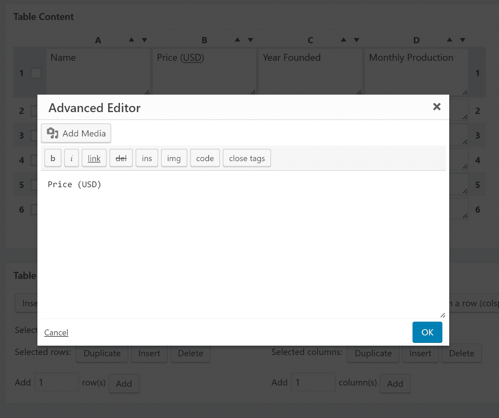

TablePress advanced editor-box

#### 第五步

一旦你完成了表格的编辑并定制了选项，点击“保存修改”按钮，然后点击页面底部的“预览”按钮，就可以对你的表格插入文章或页面后的样子有一个基本的了解。

我们发现这个预览与你的成品在风格上的实际外观相差甚远。由于如此多的造型取决于你的主题，预览并没有真正做到最终的外观(这真的比你在下面的截图中看到的笨重的表好得多)。

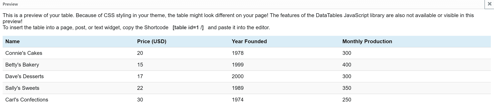

TablePress preview

#### 第六步

现在，在文章或页面中，您可以通过两种不同的方式插入表格。第一种方法是复制并粘贴前面的短代码。对于我们的示例表，因为它是我们创建的第一个表，所以简码是[table id=1 /]。短码格式非常容易记忆。

## 注册订阅时事通讯

### 想知道我们是怎么让流量增长超过 1000%的吗？

加入 20，000 多名获得我们每周时事通讯和内部消息的人的行列吧！

[Subscribe Now](#newsletter)

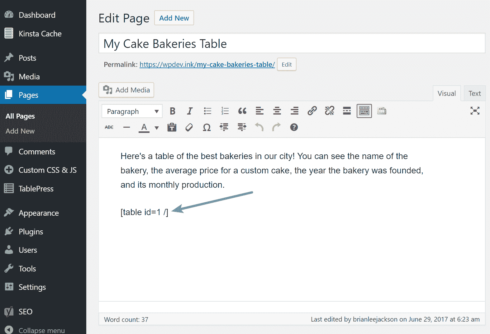

TablePress shortcode in post

第二种方法是使用可视化编辑器工具栏中的“从 TablePress 插入表格”按钮。

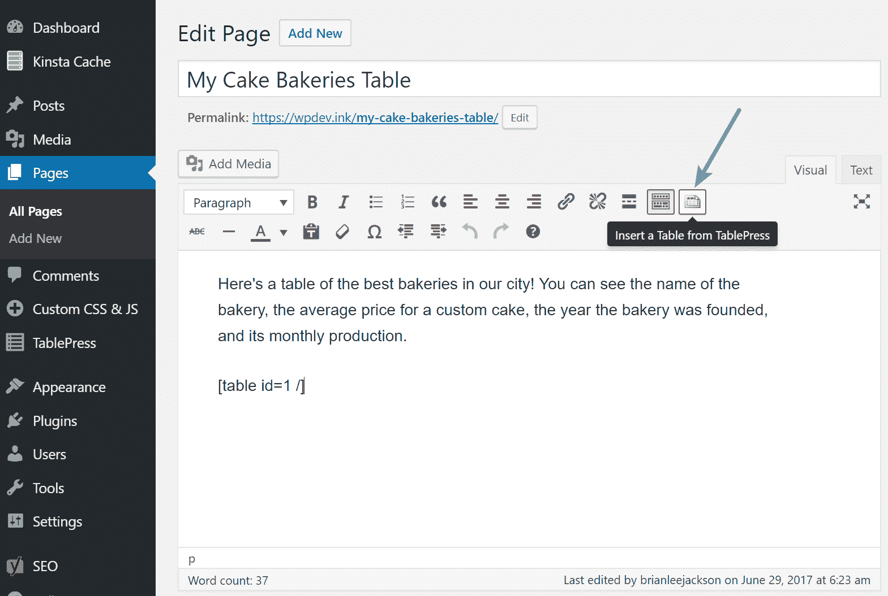

Insert a table from TablePress

这是一个运行默认[Twenty thinge 主题](https://kinsta.com/blog/twenty-seventeen-theme/)的网站的最终输出的例子。无论如何造型都不差。请注意网站访问者的分页和搜索选项。

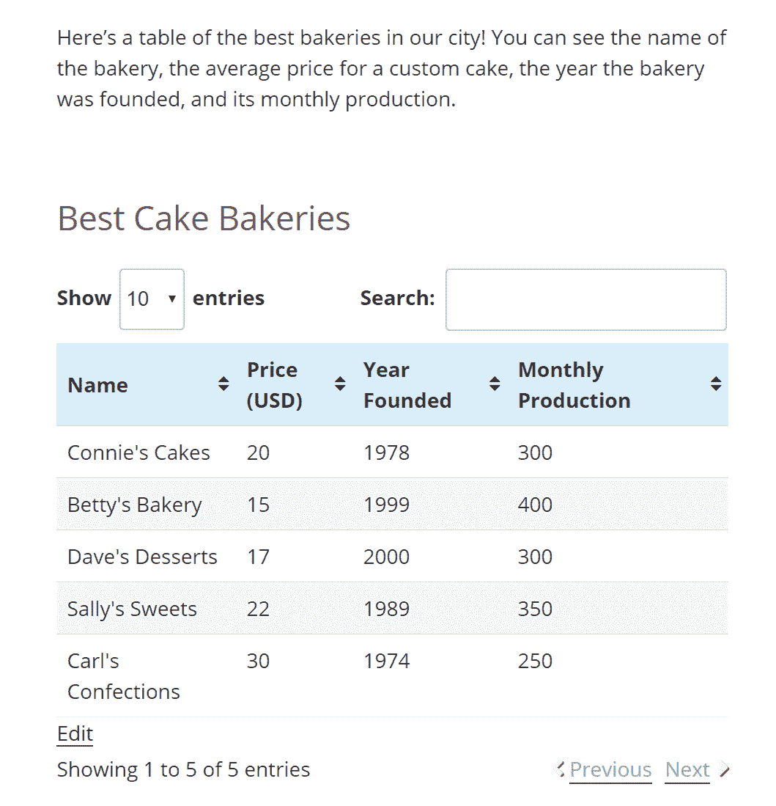

TablePress example on page

### 导入表格

如果你已经准备好了数据(比如一个 Excel 表格或者 Google Sheets 文档),并且正在等待外部格式，你可以直接把它导入到 TablePress 插件中。

#### 第一步

要导入表格，导航到 *WP 管理>表格按>导入表格*。在此页面上，您将选择导入源(直接上传、URL、服务器上的文件或手动输入空白文本区域)。我的示例数据来自我们下载为 CSV 格式的 Google Sheets 文档。

不过，这一部分真正酷的是，您可以选择将导入的数据用于一个全新的表，或者作为已经创建的现有表的替换/附加数据。在本例中，我们将添加一个新表。

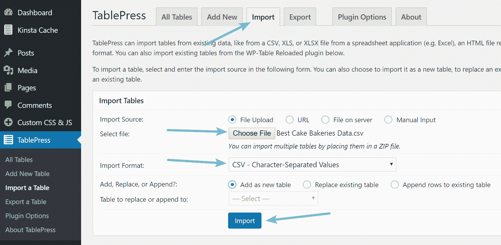

Import table in TablePress

#### 第二步

单击“导入表格”按钮后，您将被重定向到与从头开始创建表格时完全相同的编辑页面。除了这一次，表名、描述和内容都已经填写好了。剩下要做的就是定制底部的选项。

Struggling with downtime and WordPress problems? Kinsta is the hosting solution designed to save you time! [Check out our features](https://kinsta.com/features/)

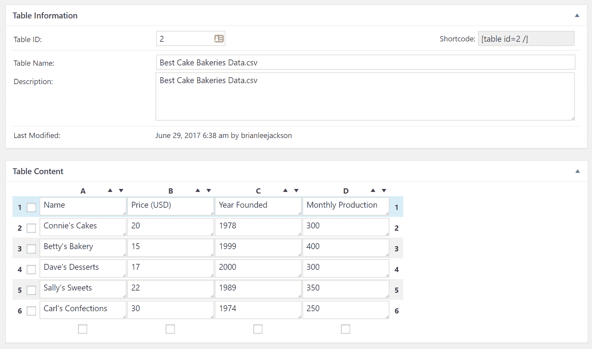

Imported table options

#### 第三步

再一次，在 post/page 中使用分配的表短代码(这次第二个表是[table id=2 /])并享受结果。请注意，由于所有数据都与我们从头开始创建表时相同，因此输出也完全相同。

TablePress example on page

### 导出表格

就像我们在本文开始时讨论的那样，该插件还带有一个内置选项来导出您的表格。这是一个非常简单的一步到位的过程。

#### 第一步

导航到 *WP 管理>表格按>导出表格*。在这里，您可以选择要导出的表格，以及导出的格式(CSV、HTML 或 JSON)。如果您使用下面的 CSV 选项，您还可以将 CSV 分隔符设置为逗号(，)、分号(；)，或者制表键(\t)。如果一次导出多个表，zip 存档是必需的。

Export table in TablePress

一旦你选择了正确的表格和导出格式，只需点击“下载导出文件”按钮，并获得您的数据。

### 插件选项

TablePress 的插件选项页面很少。尽管它提供了一个易于使用的界面和许多导入/导出选项，但内置的可定制性非常有限，正如您在下面看到的(尽管它可以通过[插件](https://tablepress.org/extensions/)进行一些扩展)。

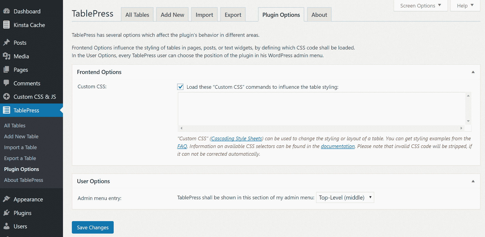

TablePress plugin options

要进行真正的样式定制，您必须在上面的文本区域中编写定制的 CSS 命令。如果你不精通代码，不要担心——插件开发者已经在[中包含了一些关于如何编写基本 CSS 命令的文档](https://tablepress.org/faq/),比如改变特定行的背景颜色、突出显示某些单元格、将表格置于页面中央等。你也可以改变一些用户选项，比如显示 TablePress 的管理菜单部分，以及插件语言(目前支持 20 多种)。

## 关于 TablePress 的最终想法

毫无疑问，TablePress 绝对是市场上功能最强大、最直观的表格插件之一。它有许多功能，但也有一些不足之处。根据我对这个插件的体验，这里有一些优点和缺点。

### 赞成的意见

*   开箱即用的出色造型。
*   非常直白的界面；新手友好。
*   多种导入格式:CSV、HTML、JSON 和 Excel。
*   多种导出格式:CSV，HTML，JSON。
*   用户可以在表中搜索特定的数据字符串。
*   表格可以按特定的行数进行分页。
*   大量免费的插件扩展可用(这确实表明开发者投入了大量的思想和努力来使插件成为 WordPress 社区的一个伟大资源)。

### 骗局

*   高级编辑器使用起来很耗时(需要大量点击)。
*   有限的造型定制内置。
*   开箱即用时没有响应，但您可以利用扩展来完成这项工作。
*   你必须手动输入数据或从电子表格中导入数据。如果你想创建已经存储在你的网站上的数据表(例如博客文章、电子商务产品或自定义文章类型)，那么你可能会受益于一个动态的 WordPress 表格插件，例如 [Posts Table Pro](https://barn2.co.uk/wordpress-plugins/posts-table-pro/) 。

希望这篇教程能帮助你深入了解如何使用 TablePress 提供的所有功能，以及如何在 WordPress 中轻松创建表格。如果你有任何问题或者想澄清一些事情，请在下面评论。此外，如果你有任何使用 TablePress(或任何其他在 WordPress 中内置表格支持的插件)的个人经验，欢迎在下面的评论中分享。

* * *

让你所有的[应用程序](https://kinsta.com/application-hosting/)、[数据库](https://kinsta.com/database-hosting/)和 [WordPress 网站](https://kinsta.com/wordpress-hosting/)在线并在一个屋檐下。我们功能丰富的高性能云平台包括:

*   在 MyKinsta 仪表盘中轻松设置和管理
*   24/7 专家支持
*   最好的谷歌云平台硬件和网络，由 Kubernetes 提供最大的可扩展性
*   面向速度和安全性的企业级 Cloudflare 集成
*   全球受众覆盖全球多达 35 个数据中心和 275 多个 pop

在第一个月使用托管的[应用程序或托管](https://kinsta.com/application-hosting/)的[数据库，您可以享受 20 美元的优惠，亲自测试一下。探索我们的](https://kinsta.com/database-hosting/)[计划](https://kinsta.com/plans/)或[与销售人员交谈](https://kinsta.com/contact-us/)以找到最适合您的方式。