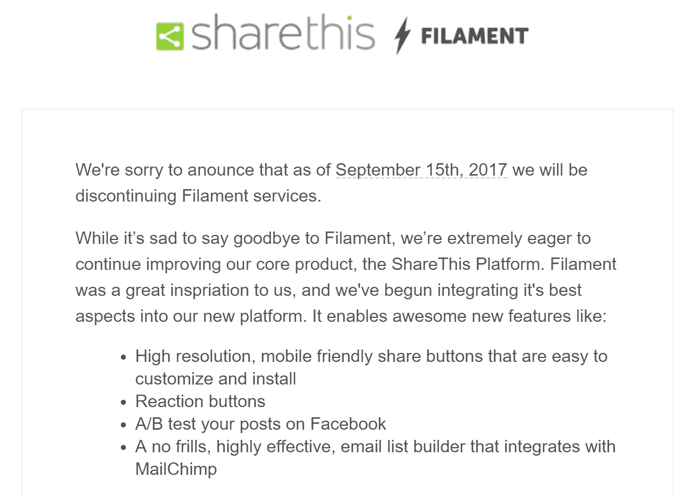

# 不走风投路线的 8 大好处

> 原文:# t0]https://kinta . com/blog/VC-route/

你们中的许多人可能不知道这一点，但金斯塔自豪地称自己为一个自举公司。这意味着我们从未从风险资本家或外部投资者那里获得外部资金，不像我们的一些竞争对手。我们欣赏风投所能提供的东西，毫无疑问，没有他们的帮助，今天许多世界级的解决方案和初创公司就不会存在。但是走这条路也有利弊。因此，今天我们想深入探讨不做风险投资公司的八个好处，以及你如何仍然可以创建一个成功和盈利的企业。怎么会？通过专注于**为你的客户提供真正的价值**和建立一个精益创业团队。

1.  [自举没有那么高的风险](#bootstrapping-less-risky)
2.  你可以更轻松地说不
3.  [顾客的忠诚度和优先权](#priority-to-customers)
4.  [自举迫使快速非传统思维](#forces-unconventional-thinking)
5.  [单专注于赚钱](#focus-on-making-money)
6.  [保留更多控制权](#retain-control)
7.  [新员工得到适当的评估](#hires-evaluated)
8.  [活下来就变强](#stronger)

## 1.自举没有那么高的风险

**自举风险不大**。当然，这可以从两个方面来论证。但是我们都同意，创业和风险投资的世界是无情的，残酷的，竞争激烈的。成功的企业并不多，所以选择是否接受风险投资是每个老板都应该仔细考虑的事情。你们中的一些人可能熟悉 HBO 的《硅谷》，虽然这是一部喜剧，但尼尔·帕特尔整理了一篇关于[数字营销人员可以从中学习的 10 课](https://www.quicksprout.com/2017/05/24/10-lessons-digital-marketers-can-learn-from-hbos-silicon-valley/)的精彩文章。他们触及的很多东西都有些夸张，但还是可以从这个节目中汲取一些智慧。

Silicon Valley (Img src: [Nerd Reactor](http://nerdreactor.com/2015/04/06/cast-of-silicon-valley-read-fan-mail/))

简而言之，如果你选择让投资者参与进来，这可能会放大风险，因为他们期望在某个时间表内看到高回报。无论是退出、首次公开募股还是收购。您**需要能够快速扩展，并在需要时进行调整**。我们并不是说风险资本家的所有投资都是不好的，但是接受外部资金会带来很多压力和问题。风投给你钱是为了让你看到他们的投资有更好的回报，这通常是推动他们的首要因素。他们可能关心你的产品，也可能不关心。他们需要的是产品成功。这里有一些你应该知道的数据:

*   有人估计，几乎 [90%的创业公司都会失败](https://www.forbes.com/sites/neilpatel/2015/01/16/90-of-startups-will-fail-heres-what-you-need-to-know-about-the-10/#379e319f6679)。没错，只有 1/10 的公司能做到。
*   Ghosh 估计，70%到 75%的风险投资支持的初创公司不会返还投资者投入的资金，其中超过一半的公司不会返还任何资金。
*   根据 CB Insights 的一项研究[，只有 22%的公司实现了出售或首次公开募股，1%的公司价值达到 10 亿美元。](https://www.cbinsights.com/blog/venture-capital-funnel-2/)

许多你可能从未听说过的公司，如 [Sprig](http://www.pymnts.com/whats-hot-2/2017/sprig-couldnt-cut-it-in-food-delivery-space/) ，成功地筹集了资金，但无法恰当地扩展他们的商业模式，最终倒闭。或者像 Jawbone 这样受欢迎的公司，Jawbone 是可穿戴设备的先驱，但在[获得 10 亿美元风险投资基金](http://www.businessinsider.com/startups-that-raised-148-billion-have-shut-down-or-may-soon-2017-7/#jawbone1997-july-2017-7)后，现在无力支付供应商。具有讽刺意味的是，就在我写这篇博文的时候，我们收到了一封关于 ShareThis 的 Filament 产品停产的邮件(如下所示)。你们中的许多人可能都收到过类似的电子邮件，内容是关于某一天还好好的公司和产品，而第二天它们就消失了。请记住，仅仅因为一家公司获得了资金，并不总是意味着他们会成功或生存下去。

Filament discontinued

另一方面，自举可能是风险更大的举措，因为你把整个公司都押在能够自我融资的同时扩大规模上。在大多数情况下，接受风险投资意味着你将风险分散到多个风险投资公司，如果企业失败，你没有责任。2016 年将 WP Curve 出售给 [GoDaddy](https://kinsta.com/godaddy-alternative/) 的成功企业家丹·诺里斯(Dan Norris)也提出了一个很棒的[反驳](https://medium.com/@thedannorris/investors-are-not-evil-2b91f1533bf9)，他在其中表示:

> 对于一些业务和一些情况，你需要外部资金。事实上，有人想把钱投入你的企业，并拥有一部分，这是一个好迹象。这意味着你正在创造有价值的东西。也许你有一个超过 5 分钟的未来愿景，并且你已经能够把这个愿景卖给其他人。这不是一件坏事。

但是请记住，不管你怎么看，当你拿钱的时候，在另一端总会有一个立即的期望，时钟开始滴答作响。你必须快速扩展，否则就会失败。在自举的时候，按照你自己的步调进行扩展是有道理的，因为风险是由你一个人承担的。

[Wondering if you should go the VC route? Read this... 👀Click to Tweet](https://twitter.com/intent/tweet?url=https%3A%2F%2Fkinsta.com%2Fblog%2Fvc-route%2F&via=kinsta&text=Wondering+if+you+should+go+the+VC+route%3F+Read+this...+%F0%9F%91%80)

## 2.你可以更容易地说不

我们都知道，任何业务都有好客户和坏客户。你们可能都曾被来自地狱网站的客户开怀大笑过。虽然这是一个拙劣的模仿，但它比许多人认为的更接近现实。总有那么一个客户会占用你 90%的时间，而你却永远听不到其他人的消息。在这些情况下，对你的企业来说，简单地说“不”是明智的。在某些情况下，说“不”是明智的。当你启动时，你可以更容易地选择你的客户，**只要有意义就说不**来帮助你的团队和任务前进。

> 说不并不总是糟糕的客户服务。—彼得·豪斯(src: [说不的艺术](https://fstoppers.com/business/art-saying-no-and-keeping-client-happy-38987)

Bootstrapping companies can say no

当然，当你在引导时，时间管理和授权更重要。你必须确保你的支持团队不会把所有的时间都花在一两个客户身上，而是提供全面的高质量支持。如果你得到了风险投资的资助，很多时候你不会简单地放弃潜在客户或对他们说不，因为他们可能会对公司产生影响，这一切都是为了增加用户群。

这里有一些很好的建议，教你如何在不激怒客户的情况下拒绝他们。

## 3.忠诚和优先考虑的是顾客

创办一家公司时，你所有的收入都来自你的客户，因此他们立即成为你的第一要务，而不是投资者。这是客户和公司的双赢。在 Kinsta，我们总是努力为客户多做一点，虽然有些事情我们不支持，例如开发工作，但我们总是会尽力提供帮助。这些年来，我们的增长很大一部分来自口碑和客户推荐。我们热爱我们的客户，与他们建立了良好的关系，没有他们我们就不会在这里！

2018 年，Kinsta 的三个主要竞争对手大幅提高了价格，而我们的价格保持不变。由于我们没有风投告诉我们在后台做什么，我们可以**花时间并适当地扩展**，保持质量和支持完好无损。

## 4.自举迫使快速的非传统思维

没有资金来解决问题迫使你想出有成本效益的、创造性的方法来解决问题。你必须跳出框框思考。创业公司并不总是每个月有 15000 美元的预算用于[在 Google AdWords](https://kinsta.com/blog/how-to-use-google-adwords/) 上的花费。这迫使你为常见问题寻找不那么传统的答案。随着时间的推移，这将使你成为一个更好的问题解决者，并始终关注你的每次收购成本(CPA)和客户的平均终身价值。

Think outside the box or fail

PPC 如果做得不好会榨干你的钱，与其这样，也许你可以花时间在内容营销或社交媒体上来推广你的产品或服务。或者使用更便宜的点击付费形式，如脸书和 Quora 广告。启动[加盟计划](https://kinsta.com/affiliates/)是利用你现有客户群的另一个好方法，从本质上帮助你推销你的公司。这里有一篇关于 21 种营销理念的好文章，适合预算不多的人。2017 年，营销人员使用了无数种方法来宣传他们的品牌。

## 注册订阅时事通讯

### 想知道我们是怎么让流量增长超过 1000%的吗？

加入 20，000 多名获得我们每周时事通讯和内部消息的人的行列吧！

[Subscribe Now](#newsletter)

自举需要你有创新精神。大多数发明来自需求，特别是个人的需求。这就是事情变得有趣的地方。当你所有的积蓄和抵押贷款都岌岌可危时，这种动力和压力会迫使你要么创新，要么失败。没有其他选择。

本质上，你必须很快。产品开发、营销、实现客户的功能要求等。必须迅速变得高效。在我们看来，这是一个好处，因为你的团队必须站稳脚跟，并不断找出新的方法来接触客户。最终，**你的团队会因此变得更加强大和聪明**。

你更愿意拥有一个向 AdWords 投入 1.5 万英镑的团队，还是一个可以通过使用更具成本效益和更广泛的收购渠道带来相同数量客户的团队？

## 5.单一专注于赚钱

创办公司时，首要且唯一的关注点是赚钱，而不是花钱。许多风投资助的公司都是围绕尽可能快地扩大用户群或安装数量而建立或构建的。即使他们不是付费客户，因为他们只是想被收购或快速退出。用户肯定是有价值的，但是如果你的计划失败了，这些用户可能一夜之间变得一文不值。

Number of installs (Img src: [Cyfe](http://www.cyfe.com/blog/hbo-silicon-valley-dashboard/))

拥有成千上万用户的热门 Reddit 替代品 Imzy 最近宣布，他们正在关闭。该公司的联合创始人丹·麦科马斯说:

> 你们中的一些人自从我们进入测试版以来就一直在这里，一些人是全新的。我们很高兴认识你们所有人，看到你们建立社区，结交新朋友。不幸的是，我们没能在市场上找到自己的位置。我们仍然认为互联网值得更好的发展，并希望我们在未来看到更多的团队接受这一挑战。

如果你从一开始就以赚钱为重点来构建你的公司，这可能是一条更安全的路线。专注于简单地扩大用户群有时会让你忽略真正重要的问题，比如你的业务需要赚钱。随之而来的是对资金管理、会计以及你的开销的更好理解。自举的时候，**一分钱一分货**就像他们说的。这是**不总是一件坏事**。

[When starting your business, every penny counts. 💰 And this isn't always a bad thing.Click to Tweet](https://twitter.com/intent/tweet?url=https%3A%2F%2Fkinsta.com%2Fblog%2Fvc-route%2F&via=kinsta&text=When+starting+your+business%2C+every+penny+counts.+%F0%9F%92%B0+And+this+isn%27t+always+a+bad+thing.)

## 6.保留更多控制权

不做风险投资公司的一个最明显的好处当然是你**保留更多的控制权**。有可能你开始创业的原因之一就是拥有一些自主权。如果你有一个很棒的想法，并且能够执行，为什么要放弃一部分给那些可能没有你那么热爱你的产品/服务的外部投资者呢？你越早出售股权，你付出的代价就越大，因为你会突然失去**未来**的杠杆，以及稀释。

Struggling with downtime and WordPress problems? Kinsta is the hosting solution designed to save you time! [Check out our features](https://kinsta.com/features/)

可悲的是，一个很好的例子是莱恩贝克尔，得到满足的共同创始人。他们最终被贱卖了，5000 万美元的估价让他一分钱也没拿到。他指出，造成这种情况的主要原因是他们失去了对风险资本家的业务控制，以及过早地筹集资金。

> 我很欣赏你的观点，但不要祝贺我收购了 GS。创始人被排除在交易之外。我们一无所获。
> 
> —莱恩·贝克尔(@ monstro)[2015 年 4 月 8 日](https://twitter.com/monstro/status/585797211679657984?ref_src=twsrc%5Etfw)