# WordPress 4.8 的新功能

> 原文：<https://kinsta.com/blog/wordpress-4-8/>

又到时间了！WordPress 的下一个版本现在可以下载了。“埃文斯”于上周 6 月 8 日发布。它包括大量新的小部件和改进，以及对可视化编辑器中链接工作方式的方便改进。让我们潜进去仔细看看吧！

**更新**:[WordPress 5.3 的新功能](https://kinsta.com/blog/wordpress-5-3/)

*   [令人兴奋的小工具变化](#widget-changes)
*   [可视化编辑器中的链接边界](#link-boundaries)
*   [开发者的改变](#developer-changes)
*   [如何更新到 WordPress 4.8](#update-wordpress-4-8)

## 令人兴奋的部件变化

WordPress 4.8 的主要焦点是围绕着**的变化，改进现有的小工具**和**引入一些新的**作为一种更容易展示你的内容、图像和品牌的方式。老实说， [widgets](https://kinsta.com/blog/wordpress-widgets/) 已经多年没有太多更新或变化了，所以终于看到一些扩展功能真是太好了。对于开发人员来说，这个版本没有太多的变化，但是这些更新应该有助于使 CMS 更容易为那些刚刚起步的人所使用。

### 可视编辑器现在在文本部件上可用

第一个变化是现在可以在文本小部件上使用简化版本的[可视化编辑器](https://kinsta.com/blog/wordpress-text-editor/)。以前你只能输入文本或 HTML。对于那些不知道如何编码的人来说，这有点限制了事情的发展。反过来，许多人可能会去下载第三方插件，让他们可以做他们需要的事情。但是现在您可以使用 WYSIWYG 编辑器轻松设置文本格式，使用粗体、斜体、项目符号列表等样式，并能够添加和编辑超链接。

正如你在右下方看到的，你现在有了可视化编辑器和标准的“文本”视图。

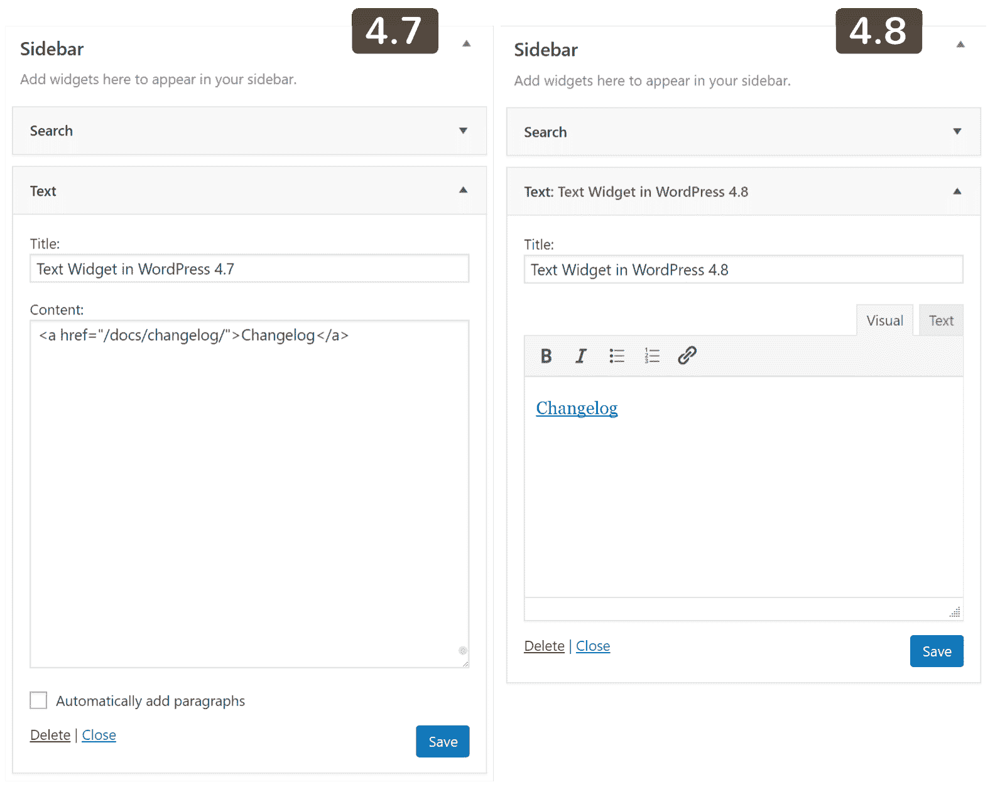

Visual editor on widgets in WordPress 4.8

### 新图像小部件

他们在 WordPress 4.8 中引入了一个全新的**图片小工具**。这对于那些想要快速添加图像的人来说是完美的，例如头像、广告、徽标或附属横幅。您可以点击“编辑图像”来添加图像链接。

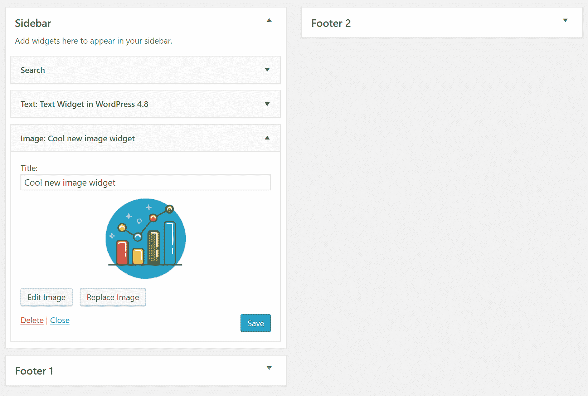

New image widget in WordPress 4.8

下面你可以在我们新更新的 WordPress 4.8 站点的侧边栏上看到新的图片小工具。

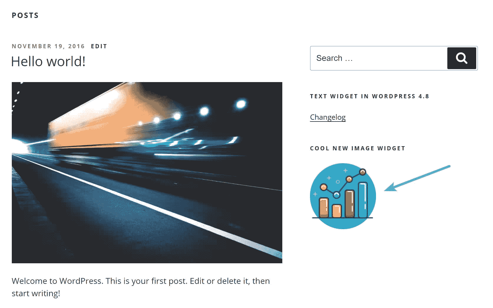

New image widget on sidebar

### 新视频小工具

与图像小部件非常相似，他们也在 WordPress 4.8 中添加了一个**视频小部件**。这可以是展示你的品牌，快速介绍你的公司，或者只是增加一些幽默的好方法。当前支持的格式包括. mp4、. m4v、.webm，。如果你点击“编辑视频”,还有一个循环播放视频的选项。

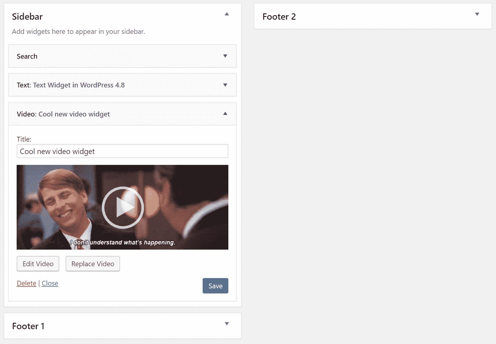

New video widget in WordPress 4.8

下面你可以在我们新更新的 WordPress 4.8 站点的侧边栏上看到新的视频小工具。

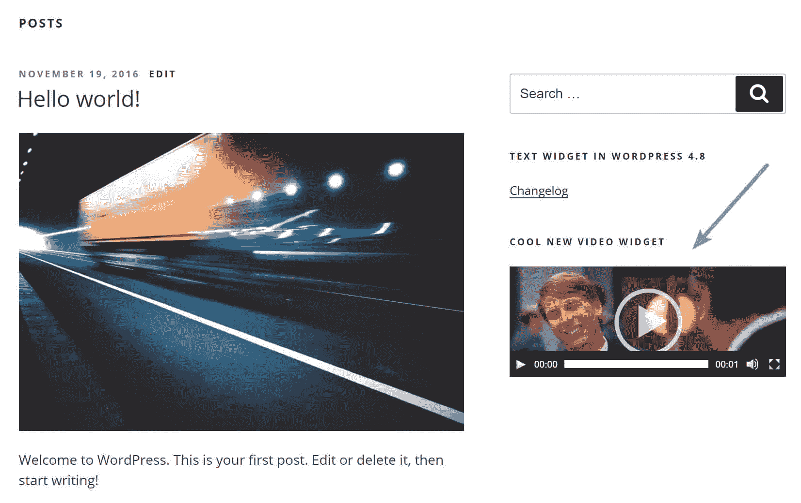

New video widget on sidebar

您还可以使用插入 URL 功能来插入第三方托管的视频，如 YouTube 或 Vimeo。确保您已经启用了[嵌入](https://kinsta.com/knowledgebase/disable-embeds-wordpress/)以使其工作。

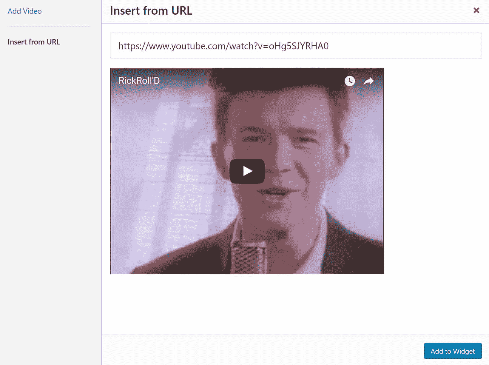

Add video from URL

### 新音频部件

最后但同样重要的是，他们还添加了一个**音频小部件**。同样，这与其他两个非常相似。可能是添加介绍或问候，或者播客片段的好方法。如果你点击“编辑音频”,还有一个循环播放音频的选项。

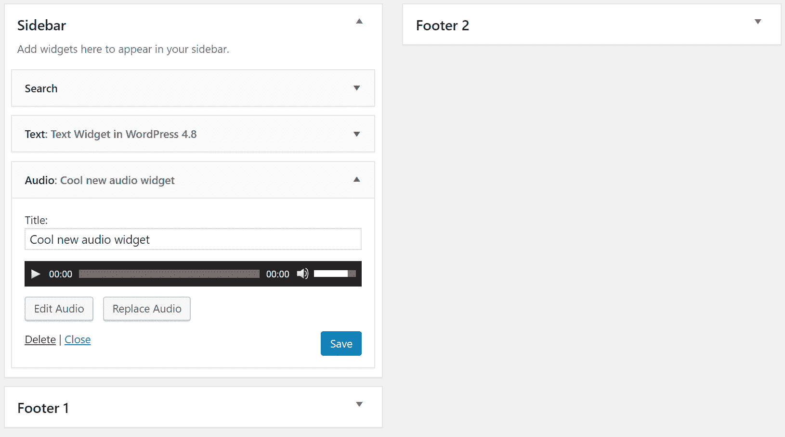

New audio widget in WordPress 4.8

下面你可以在我们新更新的 WordPress 4.8 站点的侧边栏上看到新的音频部件。

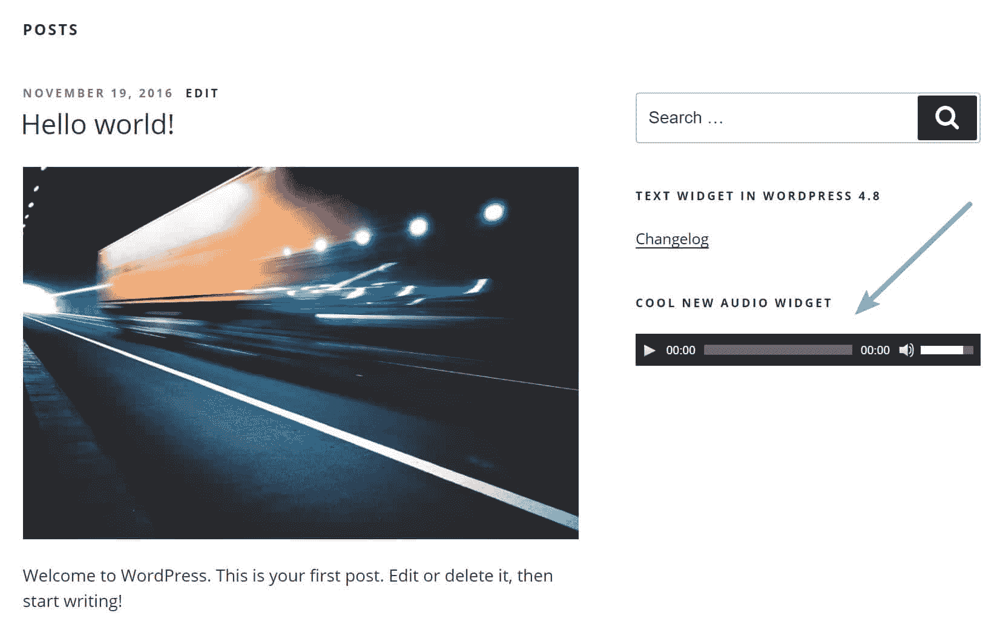

New audio widget on sidebar

### 更新了 WordPress 新闻和事件仪表板小部件

他们更新了“WordPress 新闻”[仪表盘小工具](https://kinsta.com/knowledgebase/wordpress-admin/)，现在不仅包括[新闻](https://wordpress.org/news/)，还包括当地[聚会](https://www.meetup.com/pro/wordpress/)和[文字营](https://central.wordcamp.org/schedule/)。我们中的许多人不喜欢我们的仪表板上有更多的杂物，但对于那些活跃在社区中的人来说，这实际上非常酷！因此，我们可以看到很多人可能会在屏幕选项下重新打开这个小工具。默认情况下，它会尝试自动获取您的位置，但您也可以手动输入。

## 注册订阅时事通讯

### 想知道我们是怎么让流量增长超过 1000%的吗？

加入 20，000 多名获得我们每周时事通讯和内部消息的人的行列吧！

[Subscribe Now](#newsletter)

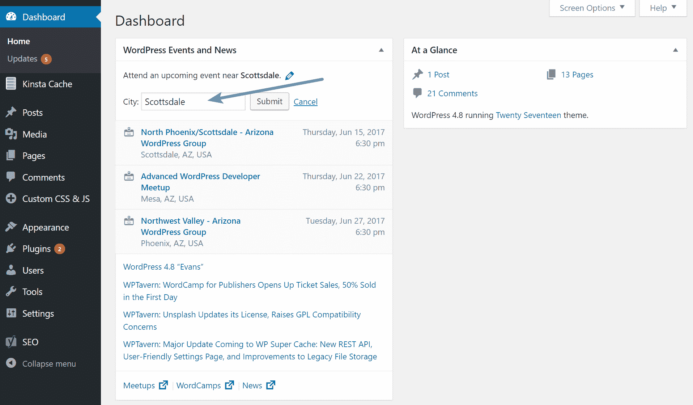

WordPress 4.8 events and news dashboard widget

## 可视化编辑器中的链接边界

他们对可视化编辑器及其处理链接的方式做了一点小小的改动。我们在 Kinsta 写了很多东西，所以这实际上是我们在 WordPress 4.8 中最喜欢的新功能。以前，当您选择一个链接并编辑它时，有时您会链接到它旁边的单词，或者无法将光标移出链接元素。任何在 WordPress 写了很多的人都会知道我们在说什么。这不是一个 bug，而是一个每个出版商都必须处理的小麻烦。

为了帮助更好地解决这个问题，他们增加了他们所谓的**链接边界**。WordPress 4.8 中的链接现在被选中时会有一个蓝色的边框。我们仍然认为链接选择不是 100%完美的，但这绝对是朝着正确方向迈出的一步！

Link boundaries

## 开发人员的变化

WordPress 4.8 更新肯定是更多的面向非开发者的，但是，有一些你应该知道的变化。

### 更清晰的标题

如果你是一个插件或主题作者，他们已经对仪表板中的标题区域做了一些[可访问性改进。这可能需要您更新您的 CSS 来适应这一点。](https://make.wordpress.org/core/2017/05/17/cleaner-headings-in-the-admin-screens/)

### 移除 WMV 和 WMA 的嵌入支持

他们现在已经移除了 WMV 和 WMA 文件的自动嵌入功能。这些文件格式要求安装 Silverlight，而 Silverlight 在浏览器中已经不太流行了。

Struggling with downtime and WordPress problems? Kinsta is the hosting solution designed to save you time! [Check out our features](https://kinsta.com/features/)

### 小部件的新 API

随着向文本小部件和其他视频/音频小部件添加可视化编辑器，开发人员现在可以更容易地使用 API 来挂钩这些区域。阅读关于 [TinyMCE 文本部件](https://make.wordpress.org/core/2017/05/23/addition-of-tinymce-to-the-text-widget/)和[图像和音频部件](https://make.wordpress.org/core/2017/05/26/media-widgets-for-images-video-and-audio/)的开发者文档。

### 定制侧边栏宽度现在是可变的

以前，外观定制器侧边栏被限制为 300 像素的固定宽度。在大屏幕上，这可能会有点令人沮丧。这已经被改变，现在它将在更大的屏幕上按比例调整大小。

### 新的多站点变更和功能

为[多站点](https://kinsta.com/blog/wordpress-multisite/)添加了新的[元功能](https://make.wordpress.org/core/2017/05/22/multisite-focused-changes-in-4-8/)，允许对特定区域的访问进行更细粒度的控制。还增加了一个新功能， [get_term_parents_list()](https://core.trac.wordpress.org/ticket/17069) 。

如果你对 WordPress 的开发感兴趣，想要尝试最新的夜生活，或者只是想在其他人之前了解最新的变化，我们建议前往 make.wordpress.org。[核心](https://make.wordpress.org/core/)部分将包含最具影响力的变化，但其他部分也同样有趣。

## 如何更新到 WordPress 4.8

由于每个客户的站点都不同，我们总是建议利用[暂存环境](https://kinsta.com/help/staging-environment/)。你可以在几秒钟内克隆你的网站，然后用你现有的主题和插件测试 WordPress 4.8 来检查兼容性。您还可以选择使用我们的[高级暂存环境](https://kinsta.com/help/premium-staging-environments/)。当然，为了安全起见，你也可以在更新你的直播网站之前做一个[手动备份](https://kinsta.com/help/wordpress-backups/)。

要将 WordPress 升级到 4.8，只需点击 WordPress 管理面板上的更新图标。然后点击“立即更新”按钮。当你的网站被更新时，它将处于[维护模式](https://kinsta.com/blog/wordpress-maintenance-mode/)。一旦您的更新完成，您的网站将恢复正常。

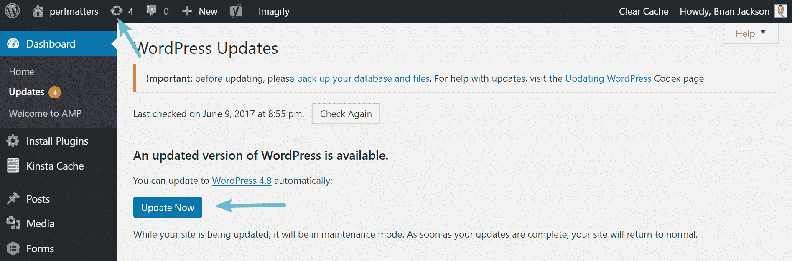

Update WordPress version

只要更新一切顺利，您应该会看到“最新动态”屏幕。就是这样！又快又简单。

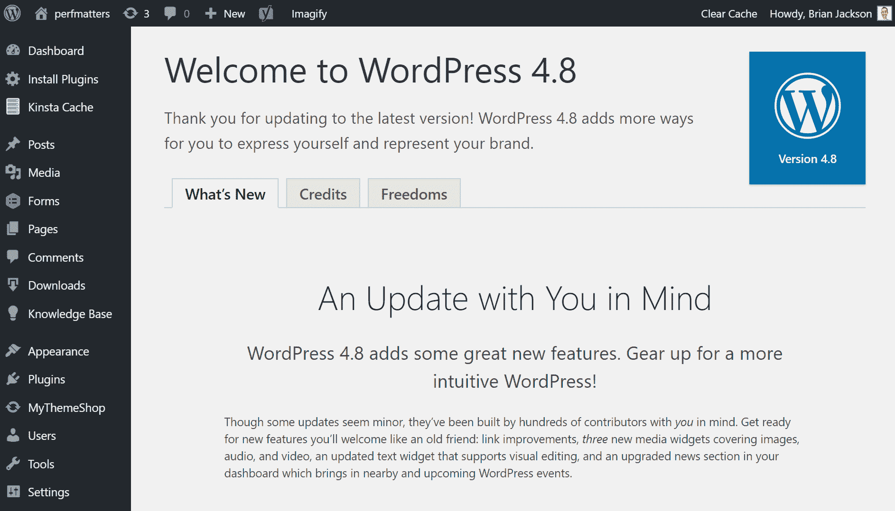

WordPress 4.8

### WordPress 更新问题疑难解答

每当人们更新 WordPress 的主要版本时，总有一些会遇到问题，这是由于目前市场上同时存在数以千计的不同插件和主题。以下是解决常见问题的几种方法。

*   得到死亡的[白屏？这通常可以通过简单的](https://kinsta.com/blog/wordpress-white-screen-of-death/)[重启 PHP/HHVM](https://kinsta.com/help/restart-php/) 和[删除你的 WordPress 站点上的整个页面缓存](https://kinsta.com/blog/wordpress-clear-cache/)来解决。
*   试着停用你所有的插件，看看是否能解决你的问题。然后一个一个地重新激活它们，直到你发现哪个插件可能需要开发者的更新。
*   尝试切换到默认的 WordPress 主题，比如 [Twenty Twenty](https://kinsta.com/blog/twenty-twenty-theme/) 。如果这解决了你的问题，你可能需要联系你的主题开发者。
*   排除和[诊断浏览器中的 JavaScript 问题](https://codex.wordpress.org/Using_Your_Browser_to_Diagnose_JavaScript_Errors)。如果像可视化编辑器(TinyMCE)这样的关键组件损坏了，这将非常有帮助。

注意:看起来有些人已经开始遇到可视化编辑器和文本小部件的问题，见: [#40960](https://core.trac.wordpress.org/ticket/40960) 和 [#40951](https://core.trac.wordpress.org/ticket/40951) 。MaAnna 对她所称的[文本小工具崩溃](https://www.blogaid.net/wordpress-4-8-text-widget-meltdown/)有一个很好的总结。

## 摘要

虽然在 WordPress 4.8 中没有任何我们称之为里程碑式的变化，但对于非开发者和刚刚开始使用 CMS 的人来说，新的可用部件将使使用它变得更加容易。我们个人很高兴在编辑器中看到更多的链接变化，因为这是出版商和内容作者非常讨厌的事情。

你怎么想呢?在 WordPress 4.8 中有什么让你兴奋的事情吗？如果有，请在下面告诉我们。

* * *

让你所有的[应用程序](https://kinsta.com/application-hosting/)、[数据库](https://kinsta.com/database-hosting/)和 [WordPress 网站](https://kinsta.com/wordpress-hosting/)在线并在一个屋檐下。我们功能丰富的高性能云平台包括:

*   在 MyKinsta 仪表盘中轻松设置和管理
*   24/7 专家支持
*   最好的谷歌云平台硬件和网络，由 Kubernetes 提供最大的可扩展性
*   面向速度和安全性的企业级 Cloudflare 集成
*   全球受众覆盖全球多达 35 个数据中心和 275 多个 pop

在第一个月使用托管的[应用程序或托管](https://kinsta.com/application-hosting/)的[数据库，您可以享受 20 美元的优惠，亲自测试一下。探索我们的](https://kinsta.com/database-hosting/)[计划](https://kinsta.com/plans/)或[与销售人员交谈](https://kinsta.com/contact-us/)以找到最适合您的方式。