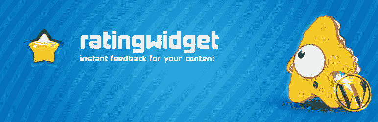
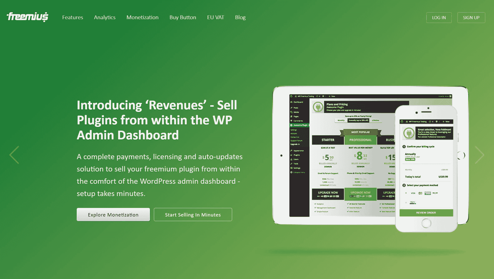
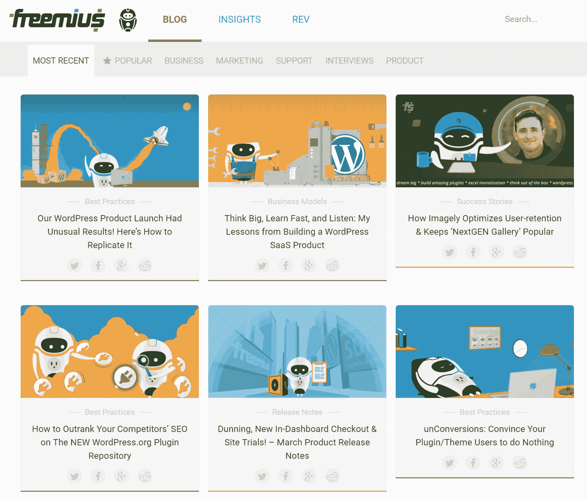

# 金斯塔·金并:采访沃瓦·费尔德曼

> 原文：<https://kinsta.com/blog/interview-with-vova-feldman/>

你可以在 LinkedIn 或者 T2 的 Twitter 上找到 Vova。这是我们最近对他的采访，作为我们[金斯塔·金并](https://kinsta.com/?post_type=post&s=kingpin)系列的一部分。

### Q1:你的背景是什么，你是如何开始使用 WordPress 的？

我很早就发现了发展。我 12 岁的时候，父亲的朋友给了他一本关于 C-development 的编程书，父亲把它传给了我。一个周末，我觉得很无聊，决定通过一些教程来尝试一下——这就是一见钟情。事实上，我可以输入一些字符和创造智能，使我神魂颠倒！这个神奇的“啊哈”时刻改变了我的生活，我知道我的未来将涉及软件开发。编码的“能力”、我对数学的热爱以及我早期对用工程和技术解决问题的热情，这三者的结合引导我自然而然地成为了一名科技企业家。

高中期间，我有机会在一家初创公司工作，同时学习计算机工程和物理。我从以色列顶尖的工程大学 Technion 毕业，获得了计算机科学和数学双学位。

在以色列情报部门的一个精英单位服完兵役后，我与人合伙创办了几家公司，并担任它们的首席技术官。值得注意的是 2014 年年中被 Gartner 收购的 Senexx。

我第一次了解 WordPress 是在 2011 年。2010 年 10 月，我开发了[评级小工具](https://rating-widget.com/)，这是我正在开发的一个博客的小网络小工具。几个月后，我开始收到用户的电子邮件，要求将这个小部件集成到 WordPress 中。在收到一堆这样的请求后，我决定谷歌一下这个叫做“WordPress”的东西。一旦我看到了这个生态系统的规模和 WordPress 社区的力量，我就为这个小部件开发了一个小的包装器插件，让不熟悉技术的用户更容易把它包含进来。

Rating-Widget plugin

2013 年 11 月，我和 Stanley Macha 联手，我们一起花了一年的时间全职工作，将这个项目变成了一个完全商业化的免费增值产品。除了 WordPress 之外，我们还有很多平台的扩展，比如 Shopify、Tumblr、WiX、Squarespace。但是一旦我们开始赚钱，我们发现 60%的用户和收入都来自 WordPress。那是我变得更加投入的时候。
T3】

### Q2:读者应该知道你最近在 WordPress 做了些什么？

在将评级工具商业化一年后，我们立即开始创造稳定的收入，并以此为生。当我们回顾那一年时，我们意识到该产品仍然是我在 2010 年在不到两周的时间里构建的那个小部件，并且那一年中所有的重担都与商业化、用户管理的实施、许可、支付、营销、软件更新等有关。这种时间投入的不均衡让我大吃一惊，这时候我明白了在 WordPress 插件和主题空间里有一个巨大的缺口和机会。这就是我们如何开始使用免费增值服务(Freemius)的——一个完整的货币化解决方案，帮助 WordPress 插件和主题开发者在几分钟内创建繁荣的基于订阅的业务。虽然其他解决方案如 Easy Digital Downloads、 [WooCommerce 和 Shopify](https://kinsta.com/blog/woocommerce-vs-shopify/) 都有一些数字商品组件，但我们唯一的重点是插件和主题。此外，我们从我们在软件即服务和[转换优化](https://kinsta.com/blog/conversion-rate-optimization-tips/)领域的丰富经验中带来了全新的实践和视角。

Freemius

我们正在利用 4 个主要的世界趋势:

*   **更多网站:**自然，越来越多的企业希望拥有在线业务，因此每天都有更多的网站被部署。
*   更多产品:插件和主题等开源扩展的库存正在增长。其中一个原因是全球化。如果一个印度的软件开发人员可以为一家西方公司工作 2 美元/小时，那么现在，这个开发人员可以开发一个插件，并以 100 美元的价格每周出售一个，这与他的工资相当，同时还可以开发自己的产品和灵活性。
*   更多货币化产品:WordPress 产品生态系统在商业上日趋成熟。如果说 2011 年发布的新插件中只有不到 1%提供了高级服务，那么 2016 年这个数字超过了 10%。
*   订阅经济:人们购买和消费的方式已经发生了永久性的改变。2015 年，美国的订阅费用达到 4200 亿美元，高于 2000 年的 2150 亿美元(瑞士瑞信银行)。

综合这些趋势，在线市场份额每天都在增长，越来越多的开发者开始盈利，很明显订阅是未来的商业模式。WordPress 企业是时候调整了，免费增值服务是首选的解决方案。

我在创业公司身兼多职，尽管我所有的努力都集中在领导团队实现这一愿景上。这些天我花 40%在市场营销和业务开发上，30%在产品上，30%在软件开发上。我也试着每月在免费博客上写至少一篇有价值的内容。

### Q3:在职业生涯中，你遇到了哪些挑战？

作为一名企业家，你每天都面临挑战。我认为如果事情很简单，那就没有意思了。这其实是乐趣的一部分:)

在我所有的公司里，包括[免费增值服务](https://freemius.com/)、**，早期阶段的挑战之一是获得第一批客户**。你可以做市场调查，在你有产品之前询问人们是否愿意购买你的产品，建立一个邮件列表，等等……但是当“刷”信用卡的时候，情况就不一样了。我们花了大约 3 个月的时间获得了我们的第一个测试客户。

## 注册订阅时事通讯

### 想知道我们是怎么让流量增长超过 1000%的吗？

加入 20，000 多名获得我们每周时事通讯和内部消息的人的行列吧！

[Subscribe Now](#newsletter)

另一个大问题是品牌认知度。尽管我们在两年多前成立了公司，但与像 [Easy Digital Downloads](https://kinsta.com/blog/easy-digital-downloads/) 或 [WooCommerce](https://kinsta.com/blog/woocommerce-tutorial/) 这样的解决方案相比，我们仍然是市场上的“新玩家”。在 WordCamps 中炫耀，参与社区的社交渠道，以及专注于强大的内容营销策略是帮助我们克服这一挑战的一些事情。但是我们仍然需要做大量的工作。

“创业是一场马拉松，而不是短跑”——我不确定这句话是谁想出来的，但我无法形容得更好了。把一个想法变成一个愿景，然后执行它需要时间，大量的艰苦工作，你会在前进的道路上遇到无尽的挑战。

[‘创业是马拉松，不是短跑’。🏃- @vovafeldman 点击推文](https://twitter.com/intent/tweet?url=https%3A%2F%2Fkinsta.com%2Fblog%2Finterview-with-vova-feldman%2F&via=kinsta&text=%27A+startup+is+a+marathon%2C+not+a+sprint%27.+%F0%9F%8F%83--+%40vovafeldman&hashtags=startups%2Centrepreneur)

### 在 WordPress 的世界里，有没有什么让你感到惊讶的事情？

当我更多地参与到 WordPress 的世界中时，这个社区让我大吃一惊。我从未见过像 WordPress 这样参与度如此之高、如此强大的开源社区。我真的相信这是 WordPress 与竞争对手相比的主要优势。

另一个让我惊讶的是业务和产品的不成熟。你可以想象，拥有 43.3%市场份额的最受欢迎的网络平台会在产品领域产生一些独角兽。但事实远非如此。开发者盲目地构建插件和主题，没有任何使用追踪机制，最大的企业([不包括托管公司](https://kinsta.com/blog/bootstrapping-startup/))总收入不到 1000 万美元。这听起来可能是一个很大的数字，但是在 WP 世界之外，这些被认为是小企业。

我们实际上在我们的博客上利用了商业知识的缺乏，它仅仅关注 WordPress 插件和主题的商业方面。成为这方面的权威成为了 Freemius 的主要营销策略，这就是我们如何成功传播这个平台的。

Freemius blog

### 问题 WordPress 世界的未来是什么样的？

由于我们在 WordPress 市场和社区上投入了大量资金，我希望这个平台能够继续发展并获得更大的市场份额。话虽如此，在我们解决一些问题之前，我看不到它会发生。

Struggling with downtime and WordPress problems? Kinsta is the hosting solution designed to save you time! [Check out our features](https://kinsta.com/features/)

我的直觉是，WordPress 已经是大多数网络机构和自由职业者——精通技术的用户——的首选解决方案。事实是，大多数用户都不是 web 开发人员，也不是“超级用户”。WordPress 界面的易用性远远落后于 WiX、Squarespace 和其他十几个所见即所得的网站构建者。你不需要成为 UX 专家也能看出 WordPress admin dashboard 势不可挡。这就是为什么我认为我们看到了页面建设者的淘金热。如果 WordPress 的领导层想要追求“夫妻店”，那么入职体验和界面必须变得更加友好。

我们应该“解决”的第二件事是缺乏数据。开源项目的开发基于猜测。没有用具体数字来支持决策的使用追踪，这意味着作为产品开发基础的“反馈循环”被打破了。如果我们没有任何数据，如何对特征进行迭代？今天，关于“WordPress 产品”的决策过程是基于有偏见的观点和有发言权的影响者，他们中的许多人是生活和呼吸 WordPress 的开发者——他们不能把自己放在标准用户的位置上。

作为一个深入参与插件/主题生态系统的人，我很清楚这个市场正在成熟。我对 [ThemeForest 和 CodeCanyon](https://freemius.com/blog/themeforest-or-codecanyon-sell-plugins-or-themes/) 做了深入的研究，它们是那个市场的一个很好的代表，似乎优质插件和主题的库存每个月都在以数百个项目的速度增长。此外，如果五年前为优质开源 WordPress 产品付费的概念是一个疯狂的想法，那么今天的用户明白了[优质插件/主题更加可靠和受支持](https://freemius.com/blog/freemium-wordpress-plugins-outlive-free-ones/)，这对生态系统来说是一件健康的事情。

WordPress 商业世界的另一个增长趋势是可持续性。我们看到了从一次性支付到类似定期订阅业务的转变。高级插件和主题生态系统始于终身许可。用户可以支付 50 美元，获得终身更新和支持。3-5 年后，这些企业意识到他们淹没在支持中。这种自然演变推动商店要么重新思考他们的商业模式，要么死亡。我们见证了向年度许可证的转变。我们现在正在见证的下一步发展是自动更新，我认为通过在我们的博客上教育 WordPress 业务，我们应该为这一趋势得到一些信任。插件和主题所有者不再“追逐”客户，乞求他们用激励性折扣来更新许可证，从而降低产品的价值，而是采取相反的方法，自动更新，同时给用户一个取消订阅的选项。这是建立一个可持续和可预测的在线业务的唯一方法，这种趋势正在各地发生，而不仅仅是在 WordPress。

展望未来，不适应这种模式的企业将无法成长。随着每天都在增长的新的竞争和 WordPress 市场份额增长的放缓，这些企业可能会死亡。您可以向客户销售一次性许可证的数量是有上限的。

### 你在 WordPress 主机中寻找什么？

尽管我们参与了 WordPress 世界，但我们的大部分代码都是专有的，我们在内部进行系统管理。因此，我们在搜索托管时关注的关键因素是价格和[基础设施可靠性](https://kinsta.com/blog/google-cloud-hosting/)以及小停机时间。我在 [Rackspace cloud](https://kinsta.com/rackspace-alternative/) 上托管服务器已经很多年了，我们面临的主要困难之一(除了价格)是出于维护原因，服务器每年被迫重启 3-4 次。当您运行 SaaS(软件即服务)或电子商务时，这些短暂的重启停机时间变得至关重要，并增加了您的业务开销。

### 问题 7:当你离开笔记本电脑时，你喜欢做什么？

当我离开笔记本电脑的时候，我会带上我的智能手机；)做企业家很神奇，但也是一种瘾。我非常喜欢它，以至于我睡觉、喝水、吃免费赠送的东西。幸运的是，我的妻子在那里帮我平衡我的瘾。如果她不在那里，我可能会全天候工作。我知道这并不健康，但我也知道每一个小时都很重要，所以我特意做出了决定，在不久的将来将我所有的努力都集中在免费增值上。

### 问题 8:接下来我们应该采访谁&为什么？

WordPress 社区里有这么多优秀有趣的人。如果我必须选择一个，我会推荐采访下一代画廊背后的公司 Imagely 的首席执行官 Erick Danzer。Erick 是我所知道的 WordPress 生态系统中最聪明的商业人士之一，他对 WordPress 摄影领域的看法非常有趣。

* * *

让你所有的[应用程序](https://kinsta.com/application-hosting/)、[数据库](https://kinsta.com/database-hosting/)和 [WordPress 网站](https://kinsta.com/wordpress-hosting/)在线并在一个屋檐下。我们功能丰富的高性能云平台包括:

*   在 MyKinsta 仪表盘中轻松设置和管理
*   24/7 专家支持
*   最好的谷歌云平台硬件和网络，由 Kubernetes 提供最大的可扩展性
*   面向速度和安全性的企业级 Cloudflare 集成
*   全球受众覆盖全球多达 35 个数据中心和 275 多个 pop

在第一个月使用托管的[应用程序或托管](https://kinsta.com/application-hosting/)的[数据库，您可以享受 20 美元的优惠，亲自测试一下。探索我们的](https://kinsta.com/database-hosting/)[计划](https://kinsta.com/plans/)或[与销售人员交谈](https://kinsta.com/contact-us/)以找到最适合您的方式。