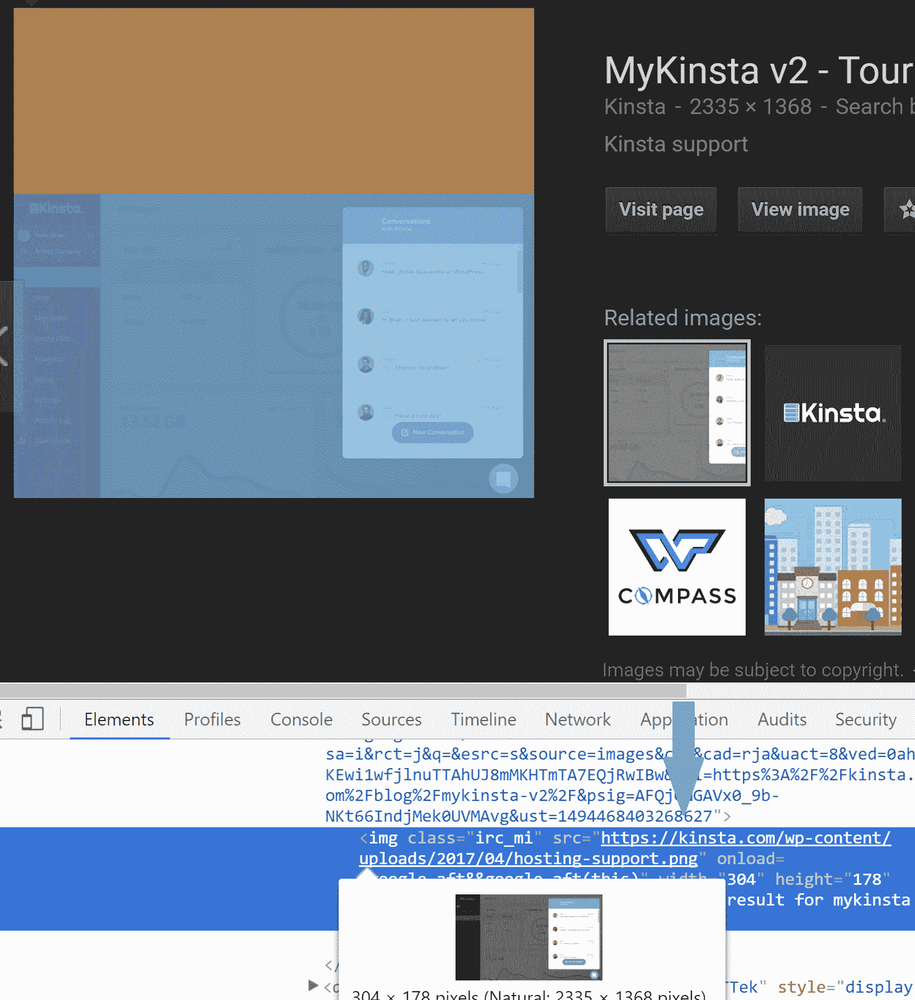
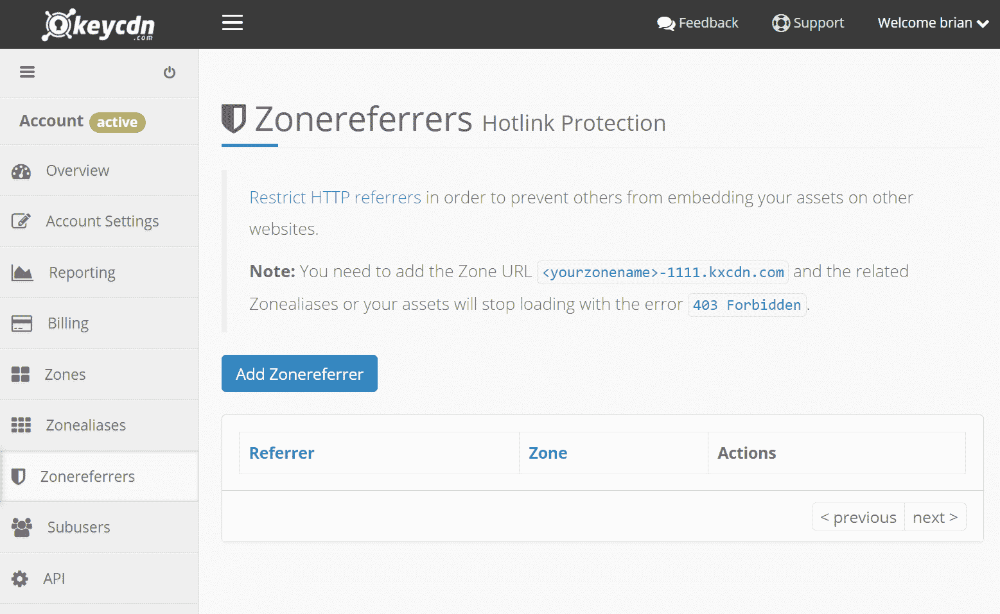
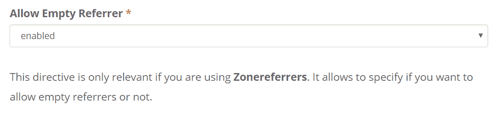
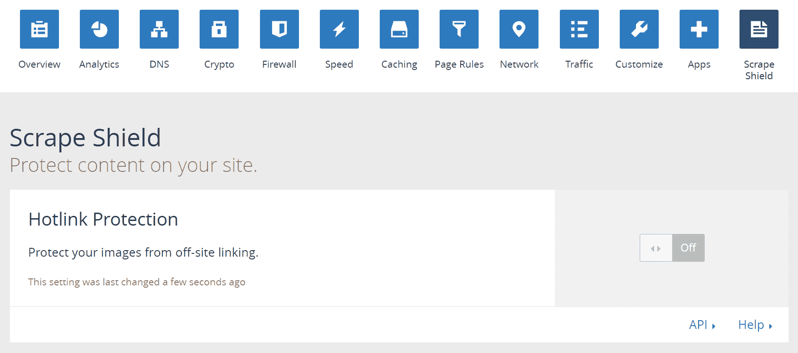
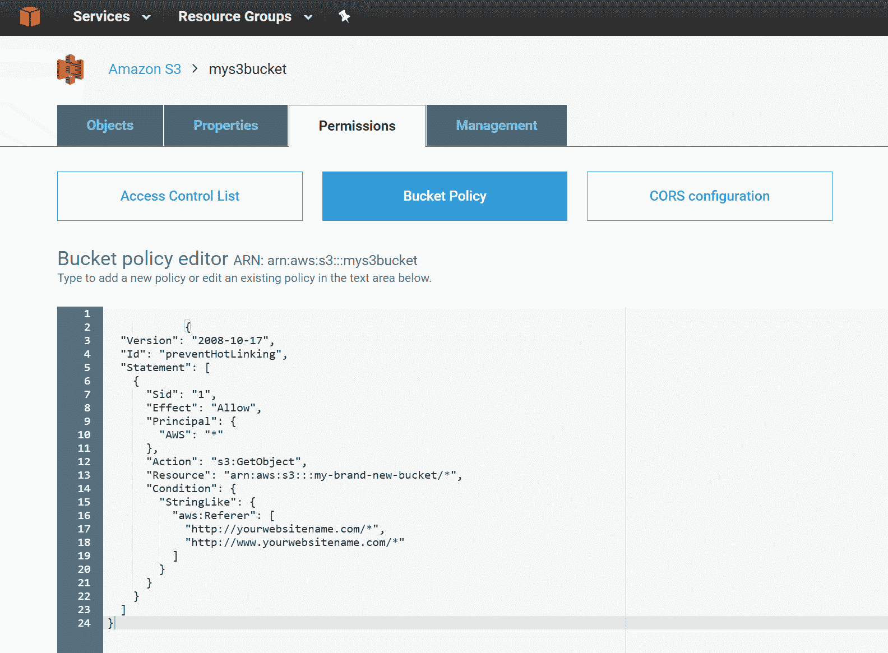
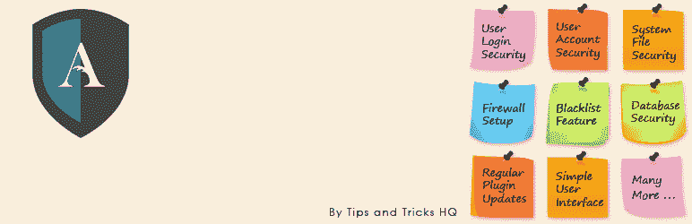

# 如何防止 WordPress 中的热链接(7 个简单的方法)

> 原文：<https://kinsta.com/blog/hotlinking/>

没有什么比有人窃取你的图像或带宽更糟糕的了，但这种情况经常发生，因为一切都在互联网上公开，人们可以很容易地链接到。这**会让你付出金钱**甚至**非法**如果这个人链接到你必须获得使用许可的库存照片。今天我们将解释什么是热链接，为什么它不好，以及如何在你的 WordPress 网站上防止热链接。

*   什么是热链接？
*   [为什么热链接不好](#hotlinking-bad)
*   [屏蔽热链接对你的 SEO 有伤害吗？](#blocking-hotlinking-seo)
*   [如何防止热链接](#prevent-hotlinking)
*   [如何提交 DMCA 下架通知](#dmca-takedown-notice)

## 什么是热链接？

热链接的概念非常简单。你在网上某处找到一张图片，然后直接在你的网站上使用该图片的 URL。此图像将显示在您的网站上，但将从原始位置提供。这对于热链接者来说非常方便，但这实际上是盗窃，因为它使用了热链接网站的资源。这就像如果我们开着自己的车，带着从邻居车里偷出来的汽油离开。

## 为什么热链接不好

谈到热链接，下面是一些需要注意的事情:

### 1.热链接花费了原网站所有者的钱

有人从他们的网站上链接到你的图片可能看起来没什么大不了的，但这可能会给你带来很多额外的费用。燕麦片就是一个很好的例子。《赫芬顿邮报》热链接了他的一幅由多幅图像组成的漫画。因为我们谈论的是一个流量很大的主要出版物，这导致了燕麦片的大量额外成本，因为成千上万的人都收到了图像。燕麦片的创造者马修·因曼将所有热链接文件替换为以下内容，这是一个经典的燕麦片迁移:


hotlinking example


他还小心翼翼地用一张屁股和尿尿的图画替换了最后一张图片。厉害！但是正如你所看到的，成本会迅速增加，特别是如果一个高流量的网站是你的内容的链接。你想相信所有的作家和博客都知道如何正确使用图片吗？大概不会。这就是热链接保护存在的原因。


相关文章:[内容抓取——反击还是无视？](https://kinsta.com/blog/content-scraping/)

### 2.在大多数情况下，热链接是非法的

在很多情况下，热链接实际上是非法的。为什么？因为你在网上看到的许多照片都附有许可限制。以下是一些常见的图片限制，禁止从流行的图片网站获取许可:

*   "**在任何情况下都不允许商业使用**"
*   "在您拥有的网站或博客上发表文章**(文章或新闻，仅供参考)。"**

 **如果有人链接到你的图片并在他们的网站上使用，上述两个限制很容易被打破。他们很可能没有这样做的许可，因为他们没有支付许可证。这也伴随着在他们的网站上没有正确地链接到它，但也正确地归因于最初的创作者。


### 3.服务器资源的流失

对于目标服务器来说，热链接可能是**巨大的资源消耗。想象一下，如果你在一个共享的 WordPress 主机上，赫芬顿邮报突然链接到你的图片。你可以在你的网站上从每小时几百次查询增加到几十万次。这甚至会导致你的托管账户被暂停。这绝对是一个原因，不仅要使用[高性能主机](https://kinsta.com/blog/managed-wordpress-hosting/)(它可以处理这样的打嗝)，而且要启用热链接保护，这样就不会发生这种情况。**

### 4.热链接只是简单的懒惰

人们热链接仅仅是因为他们懒吗？好吧，很多时候，人们不是故意热链接到你的图片，甚至没有意识到这是一个问题。他们通常只是忙于写作，只是简单地复制粘贴网址和文件。他们甚至可能不知道如何正确地链接到图像。然而，这仍然不是一个好的借口。如果你在网上写内容，了解链接到其他人的图片的最佳实践以及正确的归属是很重要的。

## 屏蔽热链接对你的 SEO 有伤害吗？

阻止人们热链接不会伤害你的搜索引擎优化，但需要正确设置。有来自谷歌、必应、雅虎等的爬虫。需要访问您的图像才能索引和正确显示它们。例如，当你在谷歌图片搜索上看到一张图片时，缩略图是从谷歌的图片缓存中提供的。但是原始版本(如果你点击它)实际上是从你的服务器上提供的。



Hotlinking in Google image search


你想在谷歌图片搜索中搜索你的图片。正如 WordStream 所言，[谷歌图片搜索流量](http://www.wordstream.com/blog/ws/2013/01/23/google-image-search-traffic)是一个“轻而易举的胜利”,事实上可以为你的企业带来你可能无法获得的转化和商机。

## 如何防止热链接

有一些简单的方法来保护你的图片不被热链接，让我们看看我们有哪些选择。

*   [CDN](#cdn)
*   [阿帕奇](#apache)
*   [NGINX](#nginx)
*   [WordPress 插件](#plugin)
*   [在 WordPress 中禁用右键](#disable-right-click-in-WordPress)
*   [重命名文件](#rename-files)
*   [cPanel](#cpanel)

### 利用具有热链接保护的 CDN

你们中的大多数人通过自己的网站在全球范围内提供内容，反过来使用 [CDN 提供商](https://kinsta.com/blog/wordpress-cdn/)来加速你的资产交付。CDN 提供商如 KeyCDN 和 [Cloudflare](https://kinsta.com/knowledgebase/install-cloudflare/) 已经免费内置了强大的热链接保护，您可以启用。这是推荐的方法，因为他们对实际上不应该被阻止的僵尸程序和其他推荐者有非常精细的规则。在你的 CDN 上这样做的另一个好处是，你不需要对你的 WordPress 安装做任何改变。

如果您使用的是 KeyCDN，只需点击进入[zonereferers](https://www.keycdn.com/support/create-a-zonereferrer/)并添加规则。爬网程序仍然可以访问和索引您的图像。



KeyCDN hotlink protection


他们甚至有一个点击选项，允许每个区域的空推荐人。



KeyCDN allow empty referrer


这将为您的 CDN 上的资产启用热链接保护，但不是您的原始服务器。因此，如果你非常担心有人直接在你的服务器上热链接到你的图像，你也可以在你的原始服务器上启用热链接保护(参见下面的 [Apache](https://kinsta.com/knowledgebase/what-is-apache/) 和 NGINX 规则)。这是非常不可能的，虽然有人将不得不手动删除 CDN 的网址。但这是有可能发生的。

[如果你使用的是 Cloudflare](https://kinsta.com/blog/cloudflare-settings-wordpress/) ，你可以很容易的[在你的账号里启用刮刮盾下的热链接保护](https://support.cloudflare.com/hc/en-us/articles/200170026-What-does-enabling-Cloudflare-Hotlink-Protection-do-)。热链接保护对抓取没有影响，但会阻止图片在 Google images、Pinterest 等网站上显示。由于 Cloudflare 是一个完全代理服务，因此您无需担心在原始服务器上启用热链接保护。

## 注册订阅时事通讯


### 想知道我们是怎么让流量增长超过 1000%的吗？

加入 20，000 多名获得我们每周时事通讯和内部消息的人的行列吧！

[Subscribe Now](#newsletter)



Cloudflare hotlink protection


如果您使用的是亚马逊 S3，您可以使用[桶策略](https://console.aws.amazon.com/s3/buckets/)启用热链接保护，该策略位于您的桶的“权限”下。



Amazon S3 hotlink protection


只需在下面添加以下代码:

```
{
  "Version": "2008-10-17",
  "Id": "preventHotLinking",
  "Statement": [
    {
      "Sid": "1",
      "Effect": "Allow",
      "Principal": {
        "AWS": "*"
      },
      "Action": "s3:GetObject",
      "Resource": "arn:aws:s3:::my-brand-new-bucket/*",
      "Condition": {
        "StringLike": {
          "aws:Referer": [
            "http://yourwebsitename.com/*",
            "http://www.yourwebsitename.com/*"
            "https://google.com/*"
            "https://bing.com/*"
            "https://yahoo.com/*"
          ]
        }
      }
    }
  ]
}
```

### 在 Apache 上启用热链接保护

如果你的 WordPress 站点运行在 Apache 上，你需要做的就是[打开。htaccess 文件](https://kinsta.com/knowledgebase/wordpress-htaccess-file/)放在您站点的根目录中(或者创建它),并添加以下内容:

```
RewriteEngine on
RewriteCond %{HTTP_REFERER} !^$
RewriteCond %{HTTP_REFERER} !^http(s)?://(www\.)?yourdomain.com [NC]
RewriteCond %{HTTP_REFERER} !^http(s)?://(www\.)?google.com [NC]
RewriteCond %{HTTP_REFERER} !^http(s)?://(www\.)?bing.com [NC]
RewriteCond %{HTTP_REFERER} !^http(s)?://(www\.)?yahoo.com [NC]
RewriteRule \.(jpg|jpeg|png|gif|svg)$ http://dropbox.com/hotlink-placeholder.jpg [NC,R,L]
```

第二行允许空白推荐人。您很可能希望启用此功能，因为有些访问者使用个人防火墙或防病毒程序来删除 web 浏览器发送的页面参考信息。如果您不允许空白推荐人，您可能会无意中禁用这些用户的所有图像。

第三行定义了允许的推荐人，允许直接链接到图片的网站，这应该是你的网站(用你的域名更新上面的 yourdomain.com)。第四、第五和第六行将搜索引擎添加到允许列表中，因为您不想阻止诸如 Google bot 或 Bing bot 之类的爬虫。这可能会阻止您的图像在谷歌图像搜索中显示和索引。

第七行定义了你想让访问者看到的图片，来代替受热链接保护的图片。这不是必须的，但是你可以给他们一个友好的警告。如果您希望允许多个网站，您可以复制此行并替换推荐人。如果你想生成一些更复杂的规则，看看这个 [htaccess 热链接保护生成器](http://www.htaccesstools.com/hotlink-protection/)。

如果您将上述规则与 CDN 一起使用，您可能还需要将您的 CDN 子域列入白名单。

Struggling with downtime and WordPress problems? Kinsta is the hosting solution designed to save you time! [Check out our features](https://kinsta.com/features/)

### 在 NGINX 上启用热链接保护

如果您正在 NGINX 上运行[，您需要做的就是打开您的配置文件并添加以下内容:](https://kinsta.com/knowledgebase/what-is-nginx/)

```
location ~ .(gif|png|jpeg|jpg|svg)$ {
     valid_referers none blocked ~.google. ~.bing. ~.yahoo. yourdomain.com *.yourdomain.com;
     if ($invalid_referer) {
        return   403;
    }
}
```

如果您是 Kinsta 用户，并且没有使用 CDN，我们可以为您添加此功能。只需从 [MyKinsta](https://my.kinsta.com/) 仪表盘上与我们的支持团队一起打开一张快速入场券。如果您将上述规则与 CDN 一起使用，您可能还需要将您的 CDN 子域列入白名单。

### WordPress 插件

有几个 WordPress 插件[与热链接](https://wordpress.org/plugins/search.php?q=hotlink)相关，但是许多单机版插件维护得不是很好，或者评价很差。我们不建议使用它们。我们建议看一下[WP 安全和防火墙一体](https://wordpress.org/plugins/all-in-one-wp-security-and-firewall/)插件，这是一个优秀的全方位[安全插件](https://kinsta.com/blog/wordpress-security-plugins/)，内置防止热链接的能力。但是，通常最好在服务器或 CDN 级别启用热链接保护。



All In One WP Security & Firewall


一体式 WP 安全和防火墙目前有超过 500，000 个活跃安装，获得了令人印象深刻的 5 星评级。你可以从 [WordPress 知识库](https://wordpress.org/plugins/all-in-one-wp-security-and-firewall/)下载它，或者在你的 WordPress 仪表盘的“添加新插件”下搜索它。

注意:如果你是一个 Kinsta 用户，这个插件是不允许的，因为我们在服务器级应用了许多相同的安全预防措施。这有助于确保它不会影响你的 WordPress 站点的性能，并且它们是为我们的环境而优化的。如果您需要启用热链接保护，只需联系我们的支持团队。

### 在 WordPress 中禁用右键

在 WordPress 中防止热链接的另一个选择是[禁用右击功能](https://kinsta.com/knowledgebase/disable-right-click-wordpress/)。这绝不是一个防弹的方法，但可以是一个很好的方法，以确保典型的用户不会窃取您的图像或复制到其他应用程序和它链接到您的源域。

有一个很棒的免费小插件叫做[防止内容盗窃](https://wordpress.org/plugins/disable-right-click/)将有助于阻止这种情况。你可以从 WordPress 知识库下载它，或者在你的 WordPress 仪表盘的“添加新插件”下搜索它。没有设置，只需安装，你就可以走了。

[](https://wordpress.org/plugins/disable-right-click/)

Prevent Content Theft WordPress plugin


这个插件不仅禁止右击你的图片，也禁止点击整个页面，因此也保护了你的内容。我们在我们的开发网站上安装并测试了这个，你可以在下面看到一个例子，当用户试图右键点击一个图像时会发生什么。他们会看到一个通知框，让他们知道这个功能被禁用了。


Disable right-click in WordPress


### 重命名文件

如果你突然发现一个高流量的网站或多个来源链接到一张图片，一个简单的方法就是简单地重命名文件。改变你自己网站上的链接，让热链接者在他们的图片变成 404 错误时愤怒地等待。虽然方便，但这种方法更多的是一种快速修复，对于大规模的热链接来说有点笨拙。

### cPanel 设置

如果你已经为你的域名安装了 [cPanel](https://kinsta.com/knowledgebase/what-is-cpanel/) 或 WHM，你可以使用内置的热链接保护工具。查看 [cPanel 文档](https://documentation.cpanel.net/display/ALD/Hotlink+Protection)了解更多信息，就像启用设置一样简单。

## 如何提交 DMCA 下架通知

另一个解决方案是，既然他们不拥有图片，并且未经你的许可就使用它，你可以随时申请 [DMCA 撤下通知](https://kinsta.com/blog/dmca-takedown-notice/)。这可能是确保它被取下的快速方法。你会惊讶于一封简短的“辱骂”信会有什么效果。许多网站所有者会马上处理这个问题，因为他们害怕法律诉讼。

## 结论

如果你是一个内容聚合者和狂热的分享者，确保友好地播放和链接到网站，不要直接显示图像。如果你真的喜欢你展示的东西，你会更加支持原作者！如果你是一个内容创建者，确保保护自己不被窃取，热链接是一个不难防止的领域。上面提到的任何一种方法都会确保你节省金钱、时间和带宽。

你曾经和链接到你的图片的人打过交道吗？如果是这样，我们很乐意在下面听到它。

* * *

让你所有的[应用程序](https://kinsta.com/application-hosting/)、[数据库](https://kinsta.com/database-hosting/)和 [WordPress 网站](https://kinsta.com/wordpress-hosting/)在线并在一个屋檐下。我们功能丰富的高性能云平台包括:

*   在 MyKinsta 仪表盘中轻松设置和管理
*   24/7 专家支持
*   最好的谷歌云平台硬件和网络，由 Kubernetes 提供最大的可扩展性
*   面向速度和安全性的企业级 Cloudflare 集成
*   全球受众覆盖全球多达 35 个数据中心和 275 多个 pop

在第一个月使用托管的[应用程序或托管](https://kinsta.com/application-hosting/)的[数据库，您可以享受 20 美元的优惠，亲自测试一下。探索我们的](https://kinsta.com/database-hosting/)[计划](https://kinsta.com/plans/)或[与销售人员交谈](https://kinsta.com/contact-us/)以找到最适合您的方式。**