# 为什么应该使用受支持的 PHP 版本

> 原文:# t0]https://kinta . com/blog/PHP-versions/

PHP 是当今网络上最流行的脚本语言之一。根据 [W3Techs](https://w3techs.com/technologies/details/pl-php/all/all) , **超过 78%使用服务器端编程语言的网站**使用 PHP。这意味着几乎每 10 个你访问的网站中就有 8 个，它们很可能以某种形式利用 PHP，这也意味着 [PHP 并没有死亡](https://kinsta.com/blog/is-php-dead/)。当然，它在 WordPress 生态系统中扮演着非常重要的角色，因为整个 CMS 都是建立在 PHP 之上的。

需要快速检查你的 PHP 版本？[创建一个 *phpinfo* 页面](https://kinsta.com/knowledgebase/phpinfo/)。

我们今天面临的一个困境是，当涉及到支持最新的 PHP 版本时，许多企业、开发者和主机已经落后了。下面的一些统计数据可能会让你震惊。今天我们想讨论为什么每个人都使用最新的 PHP 版本如此重要的一些原因，不仅仅是出于安全原因，也是为了更好的性能和支持。

*   [为什么会有旧的 PHP 版本？](#old-php-versions)
*   [你应该更新 PHP 版本的原因](#why-you-should-update-php-versions)
*   [确保你的主机支持最新的 PHP 版本](#host-latest-php-version)
*   检查你当前的 PHP 版本
*   不太懂技术或没有预算的用户应该做什么？
*   [如何更新 PHP](#how-to-update-php)

## 旧的 PHP 版本

和任何软件一样，PHP 有一个发布生命周期，在这个生命周期中，为了不断推动事情向前发展和做出改进，必须坚持下去。PHP 的每个主要版本通常在发布后的两年内得到全面支持。在此期间，漏洞和安全问题会定期得到修复和修补。

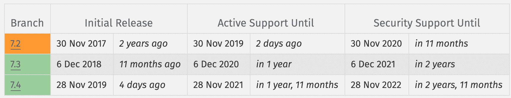

Supported PHP Versions for WordPress


### PHP 5.6、7.0、7.1 和 7.2 生命周期结束

生命周期结束意味着这些版本将不再有安全支持，并可能暴露于未打补丁的安全漏洞。

*   截至 2020 年 11 月 30 日，PHP 7.2 走到了生命的尽头。
*   截至 2019 年 12 月 1 日，PHP 7.1 走到了生命的尽头。
*   截至 2018 年 12 月 3 日，PHP 7.0 走到了生命的尽头。
*   截至 2018 年 12 月 31 日，PHP 5.6 也走到了生命的尽头。这正式标志着 PHP 5 一个时代的结束，作为第一个版本，5.0 于 14 年前推出。

根据官方的 [WordPress Stats](https://wordpress.org/about/stats/) 页面，截至本文撰写时，超过 **35%** **的 WordPress 用户仍在使用 PHP 5.6 或更低版本**。如果将这一点与 PHP 7.0 和 7.1 结合起来，目前有高达 64%的用户正在使用截至 2019 年 12 月不再受支持的 PHP 版本。


> Kinsta 把我宠坏了，所以我现在要求每个供应商都提供这样的服务。我们还试图通过我们的 SaaS 工具支持达到这一水平。
> 
> <footer class="wp-block-kinsta-client-quote__footer">
> 
> 
> 
> <cite class="wp-block-kinsta-client-quote__cite">Suganthan Mohanadasan from @Suganthanmn</cite></footer>

[View plans](https://kinsta.com/plans/)

如果你看看 WordPress 社区之外的统计数据，那就更可怕了。据 [W3Techs](https://w3techs.com/technologies/details/pl-php/all/all) 统计，目前在所有使用 PHP 的网站中，有 55.8%的网站使用 PHP 5。

[64% of WordPress users are currently using PHP versions that are no longer supported! 😮Click to Tweet](https://twitter.com/intent/tweet?url=https%3A%2F%2Fkinsta.com%2Fblog%2Fphp-versions%2F&via=kinsta&text=64%25+of+WordPress+users+are+currently+using+PHP+versions+that+are+no+longer+supported%21+%F0%9F%98%AE&hashtags=PHP%2CWordPress)

这不仅从安全角度来看是不好的，而且因为仍然有很大一部分 WordPress 站点没有利用 PHP 7 的额外性能增强。

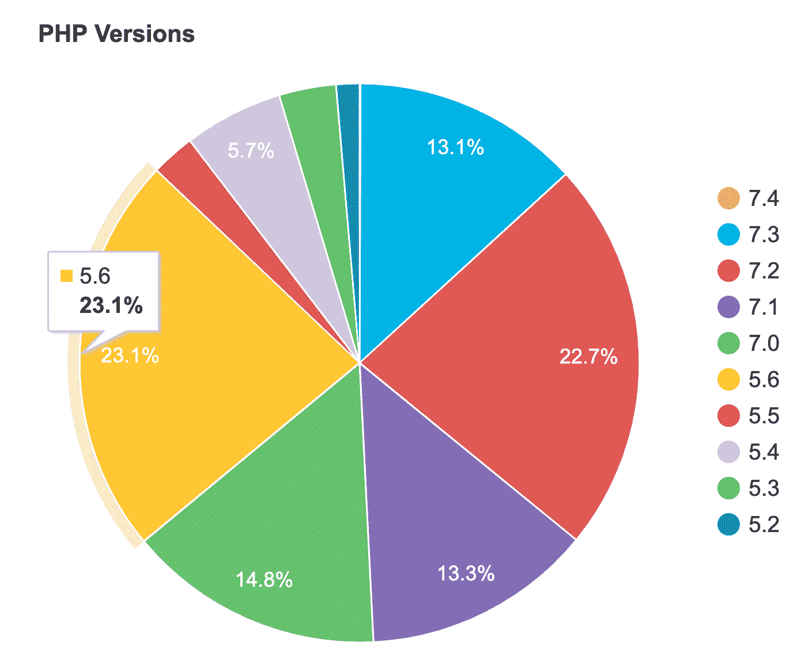

WordPress PHP version Stats


### 为什么较新版本的采用缓慢？

新版本没有被更快采用的主要原因很可能归结于几个不同的因素:

*   我们从迁移到 Kinsta 的新客户那里看到的首要原因是企业主**不知道或不关心**他们的 PHP 版本。当然，这在某些情况下是可以理解的，因为我们不期望每个人都知道这一点。很多时候，这个责任落在开发商、代理商或东道主身上。
*   开发人员需要时间来更新他们的代码以支持新版本的 PHP。这包括那些开发网站，主题，插件等。
*   更新代码不仅需要花费精力和时间，还需要大量的测试来确保兼容性。仅 WordPress 库就有超过 49，000 个插件！
*   许多 WordPress **主机不愿意**推出更新的 PHP 版本，因为这可能导致额外的支持票，如果它破坏了一个网站。作为一个[应用](https://kinsta.com/application-hosting/)、[数据库](https://kinsta.com/database-hosting/)和[管理的 WordPress 主机](https://kinsta.com/wordpress-hosting/)，我们肯定理解这一点，但是根据我们的经验，这通常是反过来的。我们看到的许多支持问题都是由旧的 PHP 版本引起的。
*   开发商或代理商在处理客户和其他第三方应用程序时可能会进退两难，他们不愿意花费资源进行更新。

然而，尽管如此，这仍然不能成为在过时的、不受支持的、实际上会降低你的 WordPress 站点速度的 PHP 版本上运行的借口。好消息是取得了一些进展。Private Packagist 的联合创始人 Jordi Boggiano 每年都会整理一份关于 PHP 使用统计数据的报告。正如你在下面看到的，有一些进展。这当然只是 Composer 安装的一个样本子集，但是看到这些变化还是很有趣的。

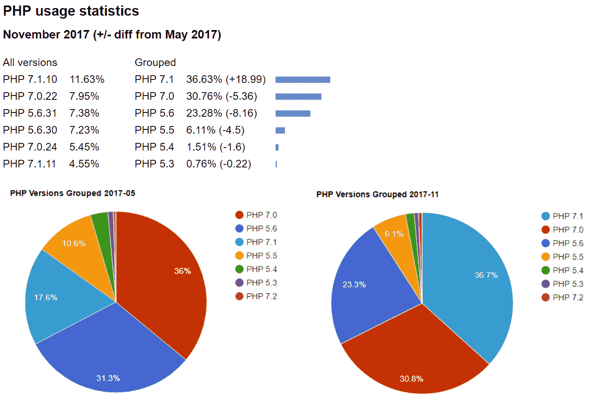

PHP usage statistics – compiled by Jordi Boggiano


## 你应该更新 PHP 版本的原因

如果你还没有考虑更新，看看下面的一些原因。

### 1.安全性

更新 PHP 的一个最重要的原因是确保你运行的版本是完全受支持的，并且针对**安全漏洞**定期打补丁。PHP 5.4 从 2015 年开始[就没有打](http://php.net/supported-versions.php)补丁了。而且 PHP 5.5 从 2016 年开始就没有打补丁了。值得注意的是，一些操作系统供应商仍然会更新旧版本的 PHP，如果他们包含它的话。

据 [CVE 细节](http://www.cvedetails.com/product/128/PHP-PHP.html?vendor_id=74)报道，2016 年是 PHP 安全漏洞最严重的一年，报告了超过 100 个问题。其中包括 DoS、代码执行、溢出、内存损坏、XSS、目录遍历、绕过和获取信息类型。2017 年是自 2000 年以来第三糟糕的一年，有超过 40 个漏洞。

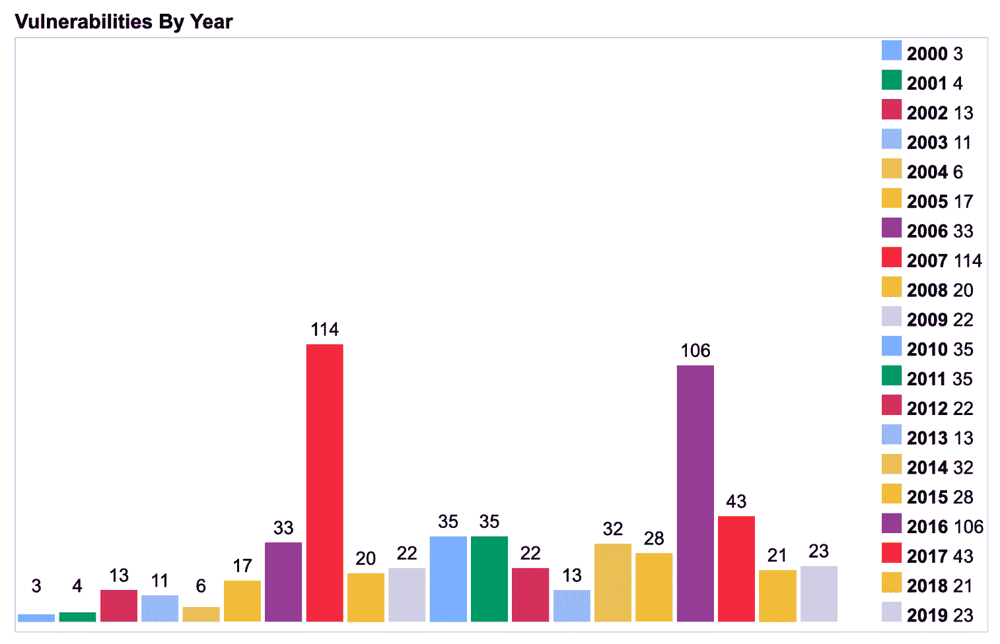

PHP security vulnerabilities by year


甚至 PHP 自己也给出了一些关于保持最新反馈:

> PHP 像任何其他大型系统一样，处于不断的审查和改进之中。每个新版本通常都包括主要和次要的变化，以增强安全性并修复任何缺陷、配置错误和其他影响系统整体安全性和稳定性的问题。像其他系统级脚本语言和程序一样，最好的方法是经常更新，并保持对最新版本及其变化的了解。PHP，[保持最新](http://php.net/manual/en/security.current.php)

建议阅读:[如何在 WordPress](https://kinsta.com/knowledgebase/php-memory-limit/) 中提高 PHP 内存限制。

### 2.表演

随着 [PHP 7.2](https://kinsta.com/blog/php-7-2/) 、 [7.3](https://kinsta.com/blog/php-7-3/) 、 [7.4](https://kinsta.com/blog/php-7-4/) 和 [8.0](https://kinsta.com/blog/php-8/) 的发布，带来了巨大的性能提升！事实上，它太大了，应该优先于你可能在 WordPress 网站上玩的许多小优化。下面的[基准](http://talks.php.net/fluent15#/wpbench)展示了 PHP 7 相对于之前版本的显著性能提升。与 PHP 5.6 相比，PHP 7 允许系统每秒执行两倍的请求，而延迟几乎是 PHP 5.6 的一半。

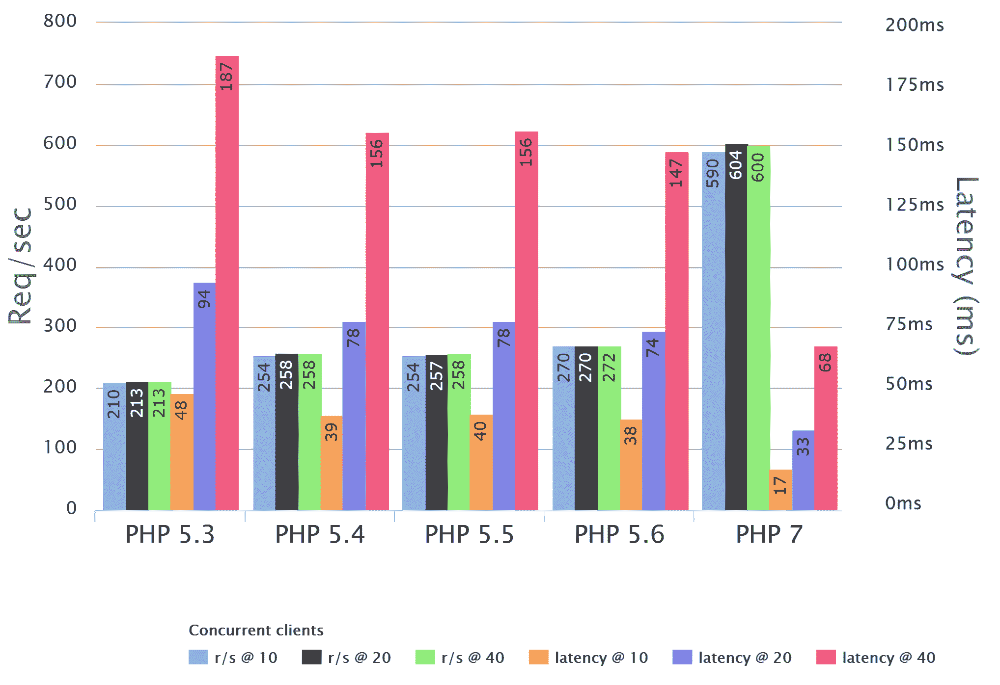

PHP benchmarks by Rasmus Lerdorf, PHP Fluent Talk


我们也运行了我们自己的 PHP 基准测试。与上面的基准类似，我们看到 PHP 7.3 每秒执行的事务(请求)几乎是 PHP 5.6 的三倍。PHP 7.3 也比 PHP 7.2 平均快 9%。


WordPress 5.0 PHP benchmarks


*   WordPress 5.0 PHP 5.6 基准测试:91.64 请求/秒
*   WordPress 5.0 PHP 7.0 基准测试结果:206.71 请求/秒
*   WordPress 5.0 PHP 7.1 基准测试结果:210.98 请求/秒
*   WordPress 5.0 PHP 7.2 基准测试结果:229.18 req/sec
*   WordPress 5.0 **PHP 7.3 基准测试结果:253.20 req/sec** **🏆**

Christian Vigh 也发表了一篇 [PHP 性能对比](https://www.phpclasses.org/blog/post/493-php-performance-evolution.html)文章，他发现 PHP 5.2 比 PHP 7 慢 400%。

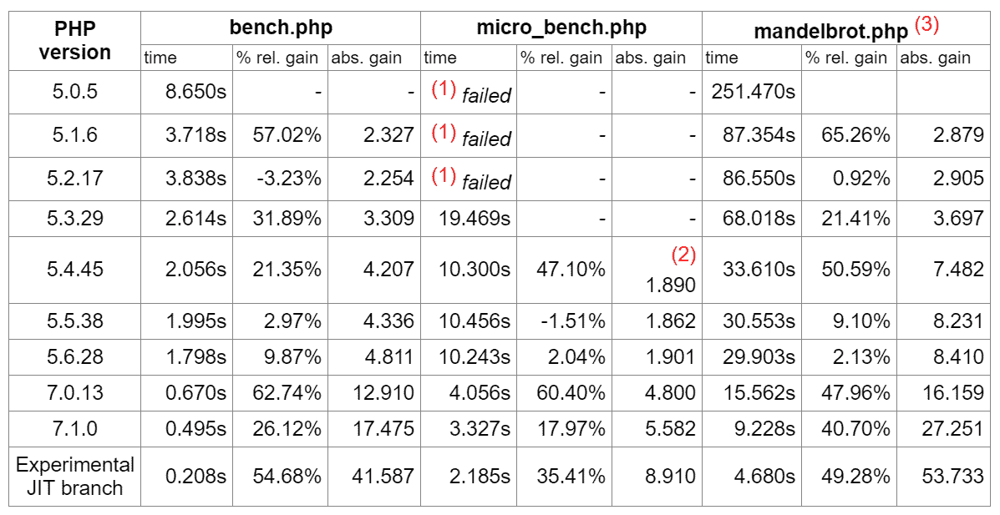

Comparison of pure CPU benchmark results


### 3.支持

支持是您希望使用最新和受支持的 PHP 版本的另一个原因。很多时候，插件和主题的开发者到目前为止只能扩展对旧版本的支持。这是由于时间限制，没有时间测试兼容性。当你在旧版本上运行时，事情最终会崩溃，你可以在 WordPress 论坛上直接看到这种情况发生。下面是一个常见错误，通常是由旧版本的 PHP 及其处理特定函数的方式引起的:

```
Parse error: syntax error, unexpected ‘’ (T_VARIABLE), expecting function (T_FUNCTION) in /pub/file.php on line xxx
```

你可以在 WordPress 论坛中搜索“ [unexpected T_Function](https://wordpress.org/search/unexpected+T_Function/?forums=1) ”，它会返回超过 2000 个帖子，其中许多是最近几天的结果。这里只是最近的几个，都是由于运行旧版本的 PHP:

*   [Hustle Plugin](https://wordpress.org/support/topic/broke-site-after-most-recent-update/)
*   [内容锁插件](https://wordpress.org/support/topic/not-good-82/)
*   [插入页眉和页脚插件](https://wordpress.org/support/topic/1-4-throws-error-disables-site-error-at-ihaf-php-on-line-102/)

由于这些线程运行在 PHP 的过时版本上，它们中的许多线程都被打开了。然而，同样的情况也可以说是由于 PHP 7 兼容性问题而开放的线程。这表明 WordPress 开发社区仍在努力赶上 PHP 的新版本。

### 4.面向开发人员的新功能

如果可以的话，大多数 WordPress 开发者更愿意只开发新版本的 PHP，原因很简单，在 PHP 5.2 和 PHP 7.4 之间增加了很多新特性。PHP 7 和 7.3 的一些变化包括:

*   组合比较运算符
*   零合并运算符
*   新型暗示
*   匿名类
*   可空类型
*   Iterable 和 void 返回
*   多重捕获异常处理
*   列表中可用的键
*   更多的负字符串偏移量
*   数字运算符和格式错误的数字
*   [HTTP/2 服务器推送](https://kinsta.com/learn/what-is-http2/)
*   预加载
*   数组表达式中的扩展运算符
*   箭头功能 2.0(短闭包)
*   零合并赋值运算符
*   类型化属性 2.0
*   弱引用
*   协变收益和逆变参数
*   新的自定义对象序列化机制

支持任何东西的旧版本都没什么意思。不幸的是，许多开发人员不得不支持广泛的版本。

## 确保你的主机支持最新的 PHP 版本

花了一段时间，但官方[WordPress.org 要求](https://wordpress.org/about/requirements/)现在**推荐一个运行 PHP 7.4 或更高版本的主机**。

## 注册订阅时事通讯


### 想知道我们是怎么让流量增长超过 1000%的吗？

加入 20，000 多名获得我们每周时事通讯和内部消息的人的行列吧！

[Subscribe Now](#newsletter)

Yoast 最近发表了一篇很棒的文章，名为“[把你的主机塑造成](https://yoast.com/whipping-your-hosting-into-shape/)”在这篇文章中，Joost de Valk 详细讲述了真正的问题是主机提供商没有更快地采用这一技术，即使他们采用了，他们也不鼓励用户升级。尤斯特会为此做些什么。从 Yoast SEO 4.5 开始，他们将开始在 WordPress 仪表盘上为运行 PHP 5.2 的网站显示一个通知。这个通知将是巨大的，丑陋的，不可忽视的。

[PHP 7 is the future (and boy is it nice and fast). 🚀 -- Joost de Valk via @yoast @kinstaClick to Tweet](https://twitter.com/intent/tweet?url=https%3A%2F%2Fkinsta.com%2Fblog%2Fphp-versions%2F&via=kinsta&text=PHP+7+is+the+future+%28and+boy+is+it+nice+and+fast%29.+%F0%9F%9A%80+--+Joost+de+Valk+via+%40yoast+%40kinsta&hashtags=php%2Cwebhosting)

如果我们能和你击掌，我们会的！自从 PHP 7.2、7.3、7.4 和 8.0 的稳定版本发布以来，Kinsta 一直支持它们。

事实上，Kinsta 的每个新 WordPress 安装都默认为 PHP 7.4。

我们致力于运行市场上最快、最安全的环境，这意味着我们需要确保所有站点都使用主动接收安全更新的技术。

查看我们关于如何在你的 WordPress 网站上安全更新 PHP 的指南。

## 检查你当前的 PHP 版本

也许你不知道你的 WordPress 站点目前是什么版本的 PHP。看看下面这些不同的方法就知道了。

### 1.用 Pingdom 检查 PHP 版本

查看您运行的 PHP 版本的最简单方法之一是使用类似 Pingdom 或 Google Chrome Devtools 的工具。第一个 HTTP 请求头通常会显示版本。

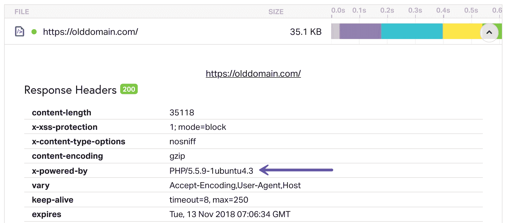

Check PHP version in Pingdom


这依赖于主机不修改`X-Powered-By`头值。出于安全考虑，有些人可能会删除它。如果是这样，您可能看不到您的 PHP 版本，在这种情况下，您需要使用下面的其他选项之一。或者你也可以主动去问主人。

### 2.在 WordPress 中检查 PHP 版本

如果你运行的是 WordPress 5.0 或以上版本，你可以在“站点健康”工具下看到 PHP 版本。

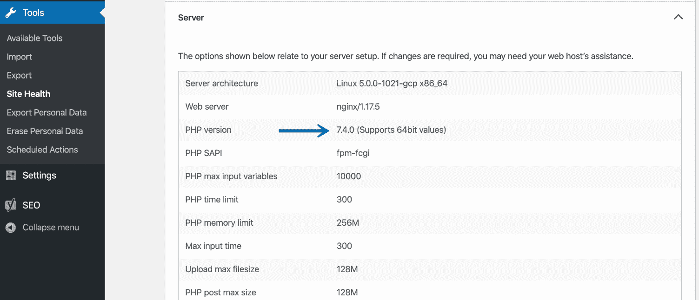

WordPress site health tool PHP version


### 3.用文件检查 PHP 版本

你也可以通过 FTP 上传一个文件[到你的服务器来检查你的 PHP 版本。](https://kinsta.com/knowledgebase/how-to-use-sftp/)

Struggling with downtime and WordPress problems? Kinsta is the hosting solution designed to save you time! [Check out our features](https://kinsta.com/features/)

#### 第一步

创建一个名为 phpinfo.php 的空白文件。在文件中，粘贴以下内容:

```
<?php
echo 'Current PHP version: ' . phpversion();
?>
```

#### 第二步

将文件上传到你的 WordPress 站点的根目录。

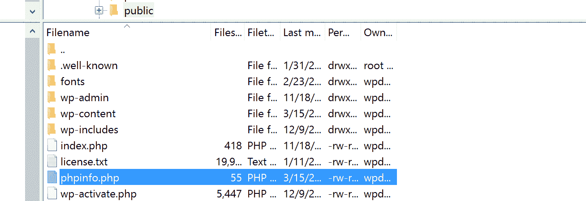

Upload phpinfo.php file


#### 第三步

然后浏览到你的文件的位置，domain.com/phpinfo.php.，你应该会看到你当前的 PHP 版本。

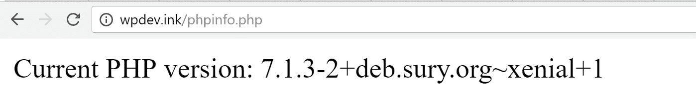

在浏览器中查看 PHP 版本


## 不太懂技术的用户或没有预算的用户应该做什么？

我们意识到仍然有成千上万的 WordPress 网站与新的 PHP 版本不兼容，不管是由于旧的插件还是主题。对于不太懂技术的用户或没有预算的用户来说，挑战在于最佳行动方案是什么？我们在迁移到 Kinsta 的客户中经常遇到这种情况，因为 PHP 版本已经停产。

以下是一些建议:

1.  这应该是给定的，但是如果你还没有更新你的插件和主题到最新的版本。
2.  联系插件或主题的开发者，要求他们添加/修复对 PHP 7.2、7.3、7.4 或 8.0(或你试图更新的当前版本)的支持。在逐步淘汰 PHP 版本之前，我们会给客户一些提示，这样如果需要的话，他们可以有时间这样做。这对于那些没有预算只是雇佣一个开发者的人来说尤其重要。
3.  找到一个能够提供相同功能并且与 PHP 版本兼容的替代插件。多亏了大量的 WordPress 知识库和数以千计的优质插件和主题，你几乎可以保证每样东西都有一个替代品。
4.  对于那些有预算的人，[雇佣一个 WordPress 开发者](https://kinsta.com/blog/hire-wordpress-developer/)来解决这个问题。

## 如何更新 PHP

准备更新了吗？很好，但是你应该做的第一件事就是测试你的网站以确保兼容性。你可以[在本地](https://kinsta.com/blog/install-wordpress-locally/)测试你的 WordPress 站点，或者更好的是，利用一个临时环境，因为这将更像一个真实的生产站点。安全总比后悔好！

如果您是 Kinsta 的客户，只需点击一下，您就可以轻松创建一个[暂存环境](https://kinsta.com/help/staging-environment/)。从仪表板上更改 PHP 版本并开始测试。

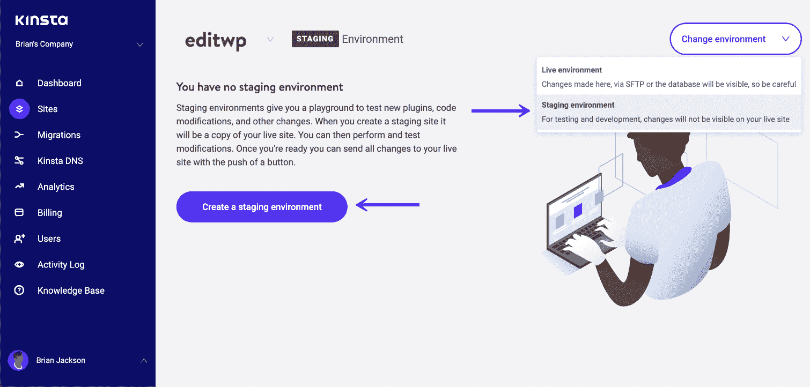

Create a WordPress staging site


记住，如果你从一个旧版本的 PHP 升级，确保你也升级了你的 WordPress 安装。一个新版本的 PHP 和一个 2 年前的 WordPress 版本可能不会有好结果。一旦你测试了你的站点并准备好更新 PHP，这里有一些资源可以让你快速上手。

查看我们关于如何在你的 WordPress 网站上安全更新 PHP 的指南。

### 用 Kinsta 更新 PHP

如果你是 Kinsta 的客户，你可以很容易地[改变 PHP](https://kinsta.com/knowledgebase/how-to-update-php-in-wordpress/) 的版本，只需点击你的网站，进入“工具”，选择一个不同的 PHP 引擎。我们目前有 PHP 7.2、7.3 和 7.4 可用。注意:我们在上面公布了 PHP 5.6 到 7.1 的淘汰日期。

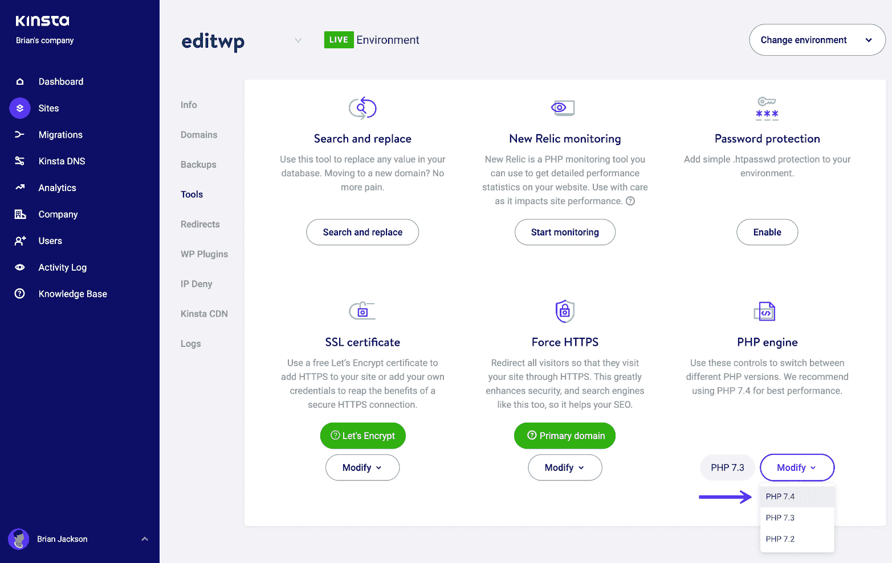

Change to PHP 7.4


在 Kinsta，我们的 PHP 配置包括一个定制的[自我修复特性](https://kinsta.com/feature-updates/auto-db-optimize/#selfhealing-php)。这意味着你的网站的 PHP 引擎会自动重启。如果 PHP 自动重启不成功，我们的监控系统会提醒我们的[系统管理团队](https://kinsta.com/blog/sysadmin/)调查这个问题。

### 从 cPanel 更新 PHP

如果您的主机使用 cPanel，他们很可能已经为您提供了一个选项来更改您的 PHP 版本。只需登录 cPanel，在“软件”类别下点击“选择 PHP 版本”

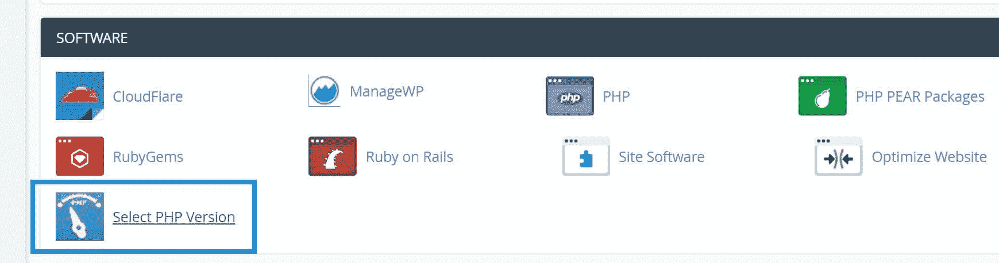

Select PHP version in cPanel


然后，您可以选择您的主机支持的可用 PHP 版本。


PHP 7 in cPanel


### 在服务器上手动更新 PHP

如果您管理自己的服务器，我们建议查看官方的 PHP 安装文档，因为说明会因操作系统而异。您会希望看到函数、类、包装器、扩展、模块等的变化。以下是一些迁移指南的链接:

*   [从 PHP 5.0.x 迁移到 PHP 5.1.x](http://php.net/manual/en/migration51.php)
*   [从 PHP 5.1.x 迁移到 PHP 5.2.x](http://php.net/manual/en/migration52.php)
*   [从 PHP 5.2.x 迁移到 PHP 5.3.x](http://php.net/manual/en/migration53.php)
*   [从 PHP 5.3.x 迁移到 PHP 5.4.x](http://php.net/manual/en/migration54.php)
*   [从 PHP 5.4.x 迁移到 PHP 5.5.x](http://php.net/manual/en/migration55.php)
*   [从 PHP 5.5.x 迁移到 PHP 5.6.x](http://php.net/manual/en/migration56.php)
*   [从 PHP 5.6.x 迁移到 PHP 7.0.x](http://php.net/manual/en/migration70.php)
*   [从 PHP 7.0.x 迁移到 PHP 7.1.x](http://php.net/manual/en/migration71.php)
*   [从 PHP 7.1.x 迁移到 PHP 7.2.x](http://php.net/manual/en/migration72.php)
*   [从 PHP 7.2.x 迁移到 PHP 7.3.x](http://php.net/manual/en/migration73.php)
*   [从 PHP 7.3.x 迁移到 PHP 7.4.x](https://www.php.net/manual/en/migration74.php)

## 摘要

如果你还没有升级到 PHP 8.0，现在是时候考虑一下了。不仅仅是因为您希望运行在受支持的软件上，还因为您保证了性能优势！如果你当前的主机还不支持 PHP 8.0，我们强烈建议你寻找新的主机。主题和插件也是如此。如果开发者还没有发布一个补丁，可能是时候找到一个替代品了。

你最近迁移到 PHP 8 了吗？我们很想听听你的想法。这是一个容易的转变吗？或者你还在等待第三方。

* * *

让你所有的[应用程序](https://kinsta.com/application-hosting/)、[数据库](https://kinsta.com/database-hosting/)和 [WordPress 网站](https://kinsta.com/wordpress-hosting/)在线并在一个屋檐下。我们功能丰富的高性能云平台包括:

*   在 MyKinsta 仪表盘中轻松设置和管理
*   24/7 专家支持
*   最好的谷歌云平台硬件和网络，由 Kubernetes 提供最大的可扩展性
*   面向速度和安全性的企业级 Cloudflare 集成
*   全球受众覆盖全球多达 35 个数据中心和 275 多个 pop

在第一个月使用托管的[应用程序或托管](https://kinsta.com/application-hosting/)的[数据库，您可以享受 20 美元的优惠，亲自测试一下。探索我们的](https://kinsta.com/database-hosting/)[计划](https://kinsta.com/plans/)或[与销售人员交谈](https://kinsta.com/contact-us/)以找到最适合您的方式。