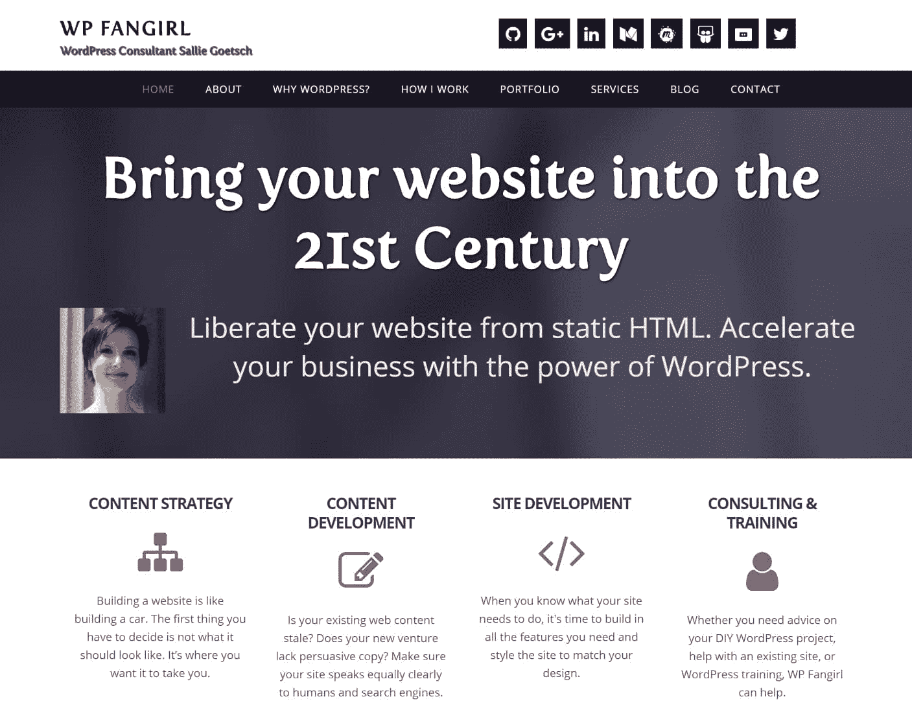

# 金斯塔·金并:莎莉·戈特施访谈

> 原文：<https://kinsta.com/blog/interview-with-sallie-goetsch/>

你可以在 LinkedIn 或 T2 的 Twitter 上找到莎莉。这是我们最近对她的采访，是我们[金斯塔·金并](https://kinsta.com/?post_type=post&s=kingpin)系列的一部分。

Q1:你的背景是什么，&你最初是如何加入 WordPress 的？

我实际上是一个古典主义者:我花了 5 年时间没有获得希腊和拉丁语言文学的博士学位。我也是这样建立了我的第一个网站。我的专业是现代表演中的古代戏剧。这是一个小领域；实际上每个做这件事的人都认识其他人。1993 年，在几个同事的帮助下，我创办了一个关于这个主题的在线杂志(评论、列表、文章)，由 FTP 和 Gopher 出版。1994 年，有人给我看了万维网。我找到了一本自学 HTML 的书，并开始学习。那份出版物对 WordPress 来说是完美的，但是这是网络发展的“赤脚在雪地里艰难前行”的日子。没有所谓的内容管理系统。(迪达斯卡利亚([www.didaskalia.net](http://www.didaskalia.net/))仍然存在，但是唉，它仍然不在 WordPress 上。)

在英国呆了四年后，1998 年底我回到美国，并从教学岗位上退休。我花了大约 18 个月的时间才恢复健康，又花了几年的时间想清楚我要靠什么谋生。从 21 世纪初开始，网站建设就开始考虑这个问题。

2005 年，在我参加了一个关于博客的远程推介会后，我发现了 WordPress。我的托管公司当时提供 b2。这让我很困惑，但几个月后他们有了 WordPress，我听到人们谈论用它来做播客，所以我去查了一下。最终，WordPress 吃掉了我的生活和生意，当我成为东湾 WordPress Meetup 的组织者时，这个过程无疑加速了。

Q2:读者应该知道你最近在 WordPress 做了些什么？

我不是一个超狭隘的专家。我所做的大部分工作是在 Genesis 框架( [WP Fangirl](https://www.wpfangirl.com/) )上定制主题开发，但我也使用不同种类的定制功能。

[T2】](https://www.wpfangirl.com/)

有很多人比我更擅长开发，但是我的学术背景给了我两样东西:解释事物的技能和做研究的能力。我已经为 Events Calendar/Events Calendar Pro 写了一系列教程，希望能写得更多。我也做相当多的公开演讲和培训。因为我曾经以在人前演讲为生，所以这并没有吓倒我。

如果你在湾区的任何地方，我邀请你加入东湾 WordPress Meetup([https://www.meetup.com/Eastbay-WordPress-Meetup/](https://www.meetup.com/Eastbay-WordPress-Meetup/))。我也是 WP-Tonic Live(【https://www.wp-tonic.com/blab/】)的常客。

[T2】](https://www.meetup.com/Eastbay-WordPress-Meetup/)

在职业生涯中，你遇到过哪些挑战？

## 注册订阅时事通讯

### 想知道我们是怎么让流量增长超过 1000%的吗？

加入 20，000 多名获得我们每周时事通讯和内部消息的人的行列吧！

[Subscribe Now](#newsletter)

在职业生涯中，我最大的挑战是我的健康。1992 年，当我还在读研究生时，我患上了一种使人虚弱的慢性病，几年后又患上了严重的偏头痛。我现在有相当多的症状帮助我的病情，更好的偏头痛药物，但我仍然可以一次离开地球多达 6 周。不是不可逾越，但绝对是挑战。

要达到我想要的职业目标，我面临的最大挑战是很难抽出时间来学习。我每周花几个小时来跟踪正在发生的事情，但很难找到不受干扰的时间坐下来真正学习 JavaScript 或 WP-API，或者尝试一些实际上不是为客户项目做的事情。

在 WordPress 的世界里，有什么让你感到惊讶的事情吗？

令我惊讶的一件事是，作为一名女性，我在科技领域受到的抵制或骚扰是如此之少。作为一名年轻的古典主义者，在会议上演讲时，我会被误认为是秘书，否则，人们会认为我的工作是去拿咖啡。作为一名中年的 WordPress 顾问，我不需要处理太多这样的事情。我偶尔会遇到男同性恋者，但我从未在文字夏令营中被搭讪过，潜在客户不会仅仅因为我有两条 X 染色体和一头亮红色的头发，就质疑我做出承诺的能力。我知道，在 WordPress 社区中，并不是每个女性都像我一样幸运，这让事情变得更不寻常。

你认为 WordPress 世界的未来会是怎样的？

光明，基于过去的一年，有更多的工作，我跟不上。但是我从不试图预测科技将会发生什么。

你在 WordPress 主机中寻找什么？

这取决于客户的需求和他们的预算，但是我不认为任何有 WordPress 网站的人应该使用普通的廉价共享主机 。有一些性能优化只能在服务器上完成，你需要真正了解 WordPress 一端和另一端的[支持人员。幸运的是，现在有很多好的托管 WordPress 的选择。](https://kinsta.com/kinsta-support/)

当你离开笔记本电脑时，你喜欢做什么？

远离我的笔记本电脑？异端！说真的，大部分时间我不在笔记本电脑旁，要么做家务，要么开车送我丈夫去机场。我确实在去年春天开始走路来对抗 12 小时在电脑前的肌肉松弛。

问题 8:接下来我们应该采访谁&为什么？

[安德里亚·伦尼克](https://twitter.com/andrea_r)、[米卡·爱泼斯坦](https://twitter.com/ipstenu)、[娜奥米·c·布什](https://twitter.com/NaomiCBush)、[莫滕·兰德-亨德里克森](https://twitter.com/mor10)，当然还有我们其他 WP-Tonic 成员。；-)

* * *

让你所有的[应用程序](https://kinsta.com/application-hosting/)、[数据库](https://kinsta.com/database-hosting/)和 [WordPress 网站](https://kinsta.com/wordpress-hosting/)在线并在一个屋檐下。我们功能丰富的高性能云平台包括:

*   在 MyKinsta 仪表盘中轻松设置和管理
*   24/7 专家支持
*   最好的谷歌云平台硬件和网络，由 Kubernetes 提供最大的可扩展性
*   面向速度和安全性的企业级 Cloudflare 集成
*   全球受众覆盖全球多达 35 个数据中心和 275 多个 pop

在第一个月使用托管的[应用程序或托管](https://kinsta.com/application-hosting/)的[数据库，您可以享受 20 美元的优惠，亲自测试一下。探索我们的](https://kinsta.com/database-hosting/)[计划](https://kinsta.com/plans/)或[与销售人员交谈](https://kinsta.com/contact-us/)以找到最适合您的方式。