# 如何在不离开 WordPress 的情况下找到并添加库存照片

> 原文：<https://kinsta.com/blog/wordpress-stock-photos/>

我们意识到，你们中的许多人身兼数职，每个月都要处理几乎前所未有的大量任务。前一分钟你可能正在写博客，下一分钟你就在打电话试图达成交易。找到一种方法来加快某些任务的速度或使它们自动化，有时会有很大的不同。正如他们所说，时间就是金钱，你应该专注于影响你底线的任务。今天我们将深入一些服务和插件，让你不用离开 WordPress 仪表盘就能找到并添加漂亮的照片到你的网站上。

## 为 WordPress 寻找库存照片

老实说，没有人真的喜欢库存照片，但对于大多数企业、博客和内容创作者来说，库存照片是唯一的解决方案。许多人没有资金、时间或专业知识来创作或拍摄自己的照片。令人欣慰的是，与 5 年前相比，现在有更多的地方可以找到优质的股票照片，以及为你的 WordPress 网站提供的免费股票照片。他们中的许多都有巨大的高分辨率图像数据库。以下是我想到的一些流行的方法:

*   [Shutterstock](https://www.shutterstock.com) (高级)
*   [iStock](http://www.istockphoto.com) (溢价)
*   [Adobe 股票](https://stock.adobe.com)(溢价)
*   [股票照片秘笈](https://shop.stockphotosecrets.com)(溢价)
*   [存款照片](http://depositphotos.com/)(溢价)
*   [StockSnap.io](https://stocksnap.io/) (免费)
*   [Pixabay](https://pixabay.com/) (免费)
*   [Unsplash](https://unsplash.com/) (免费)
*   [Stockvault.net](http://www.stockvault.net/)(免费)
*   [维基媒体公社](https://commons.wikimedia.org/wiki/Main_Page)(免费)
*   [PikWizard](https://pikwizard.com/) (免费)

虽然上面提到的很多图片网站都很棒，但问题是你要不停地在 WordPress、图片网站、下载 jpg、[调整大小和优化它们](https://kinsta.com/blog/optimize-images-for-web/)等等之间切换。所有这些加起来就是你百忙之中的时间。许多企业主和作家需要加快内容创作和发布的方法，而不是处理更多的任务。值得庆幸的是，现在有一些很棒的解决方案，可以让你在写作的时候，呆在你的 WordPress 网站上，查找/添加图片。看看这两个很棒的服务/插件，它们允许你直接上传到你的 WordPress 媒体库。
T3】

## 1.即时图像(免费)

第一个解决方案叫做[即时图像](https://wordpress.org/plugins/instant-images/)，由网站设计和开发工作室 Connekt 的团队创建。他们所做的实际上相当聪明，因为他们创建了一个插件，从 Unsplash 上传高质量的库存照片，直接到你的 WordPress 媒体库。对于那些不熟悉 Unsplash 的人来说，这是一个提供无限制免费高分辨率照片的网站。一切都是根据[知识共享零](http://creativecommons.org/publicdomain/zero/1.0/)许可的，这意味着你可以免费复制、修改、分发和使用照片，包括商业目的，无需征得摄影师或 Unsplash 的许可或提供其归属。

Instant Image WordPress plugin

免费的即时图像插件有超过 1000 个活跃安装，评分为 5 分。它允许你在你的 WordPress admin 中搜索整个 Unsplash 库，并且只需点击一下就可以上传图片。你可以从 WordPress 知识库下载它，或者在你的 WordPress 仪表盘的“添加新插件”下搜索它。按照下面的步骤激活后做什么。

### 第一步

安装并激活插件后，你需要[注册一个 Unsplash 账户](https://unsplash.com/join)，因为你需要获得一个 API 密钥。默认情况下，Instant Images 为您提供了入门密钥，如果您愿意，可以立即进行测试。但是您应该长期拥有自己的 API 密匙，因为这可以释放额外的请求/查找。这是完全免费的加入，你不必订阅他们的通讯，如果你不想。

### 第二步

加入后，你需要[注册成为开发者](https://unsplash.com/developers/register)。你可以简单地输入“即时图片插件”作为原因。

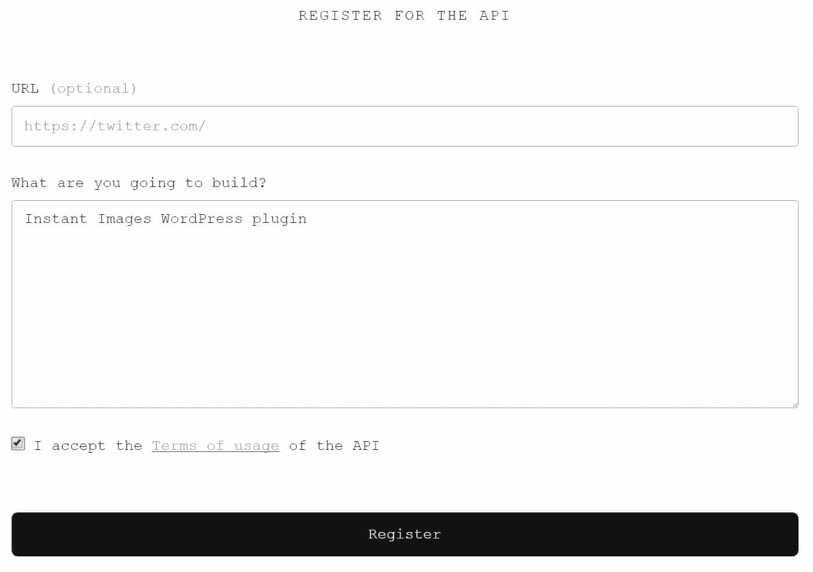

Unsplash developer account

### 第三步

然后你必须填写一份申请表。默认情况下，对于自动批准的应用程序，限制为每小时 50 次请求/搜索。这对 99%使用 WordPress 的人来说已经足够了。您可以稍后在应用程序中向他们提供更多详细信息，以获得更高的限制。但这更适用于那些在应用程序中使用它的人，我们只是想查找照片。

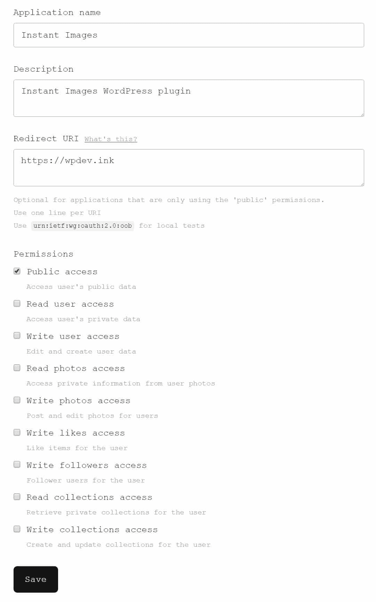

Unsplash developer application

### 第四步

然后，您可以在“媒体”下的“即时图像”插件设置中输入应用 ID (API 密钥)。您也可以从这里搜索 Unsplash 库，并指定您的最大图像上传宽度和高度。

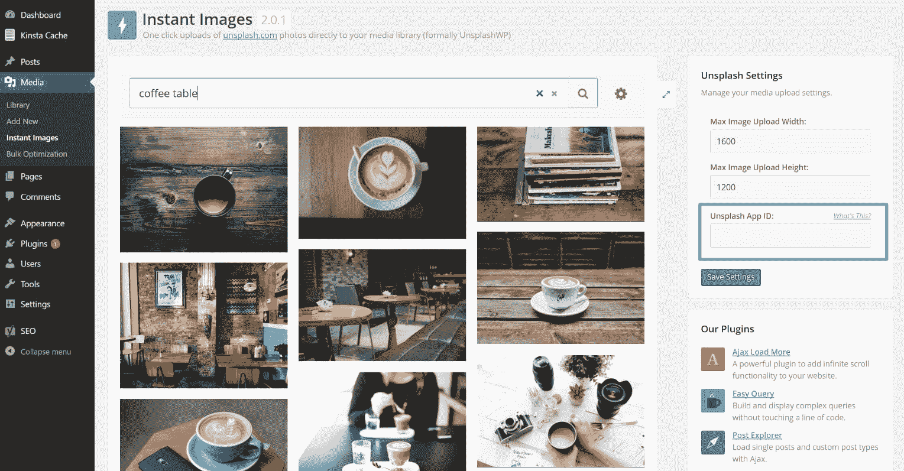

Instant Images media library

### 第五步

然后在你写文章的时候，你可以点击“即时图片”按钮，这个按钮现在在可视化编辑器中。这将启动搜索。

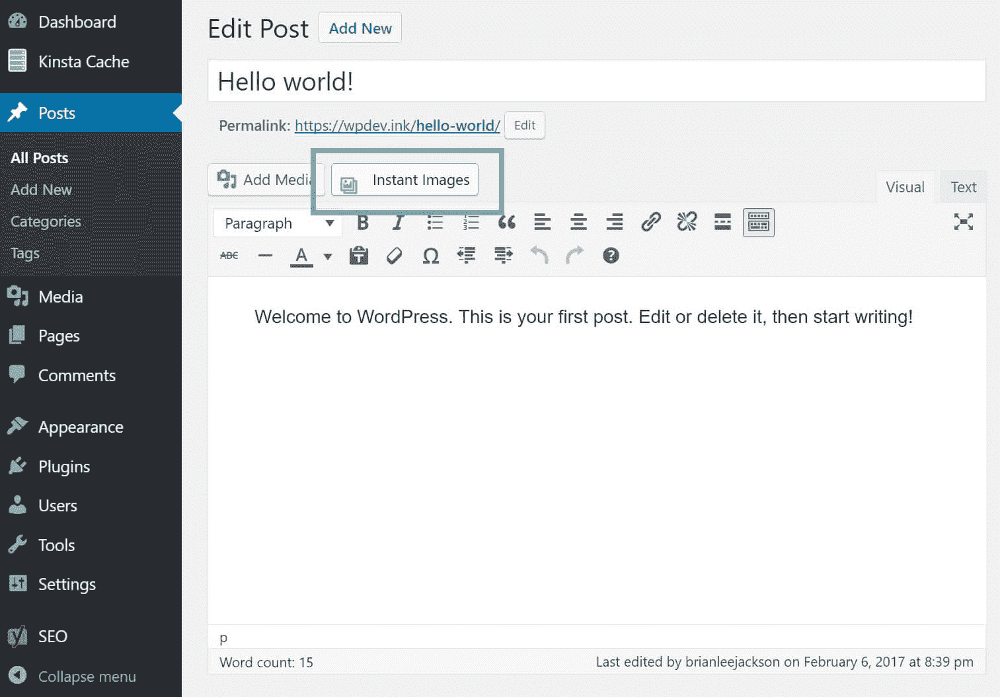

Add Instant Images into post

### 第六步

然后你可以输入一个关键字，点击一张图片，将它上传到你的媒体库。他们应该改进的一点是，它不会立即进入你的帖子，它只是进入 WordPress 媒体库。然后你必须点击“添加媒体”,然后从那里插入它。没什么大不了的，但是一个额外的点击，他们可能最终会去掉。另一个需要改进的地方是让你在点击后给文件命名，因为这对于 SEO 来说会稍微好一点。

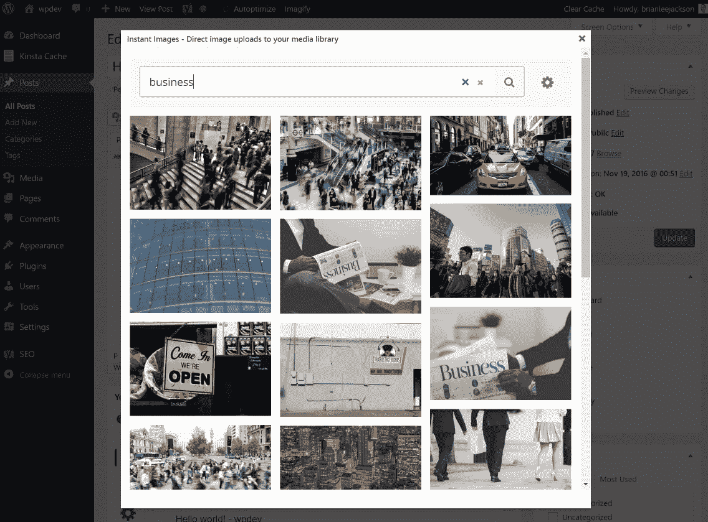

Search stock photos in WordPress

就是这样！只需几秒钟，你的帖子中就有了一幅完整的高分辨率图像！相当棒。

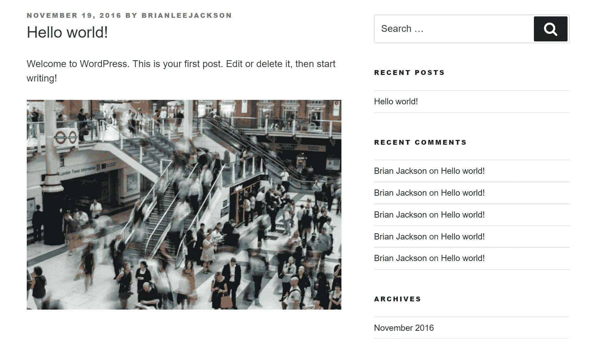

Insert stock photo

如果你使用的是图像优化插件，比如 Imagify，它们仍然可以工作，因为它们可以在图像上传到媒体库时对图像进行优化。

## 注册订阅时事通讯

### 想知道我们是怎么让流量增长超过 1000%的吗？

加入 20，000 多名获得我们每周时事通讯和内部消息的人的行列吧！

[Subscribe Now](#newsletter)

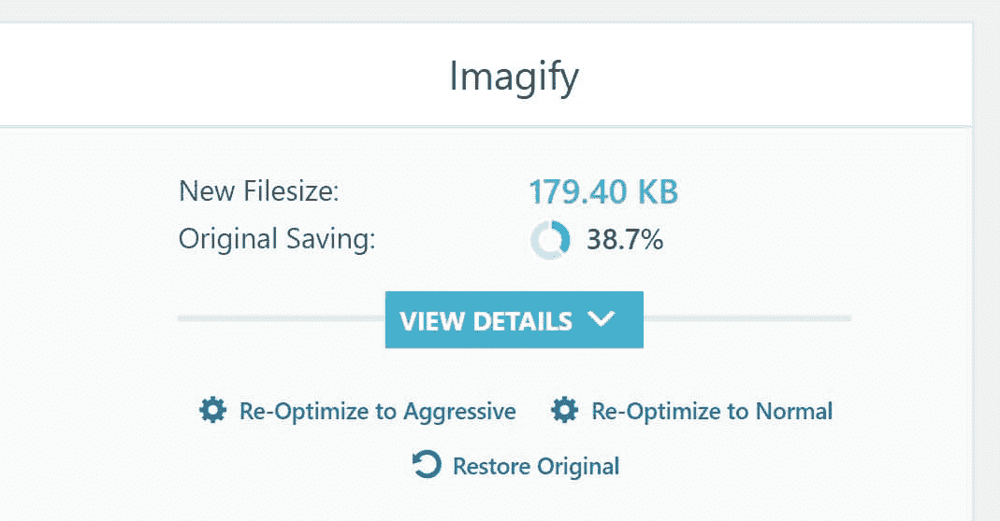

Optimized Unsplash image

对于一个完全免费的 WordPress 库存照片解决方案，我们对即时图片插件印象深刻，并强烈推荐给任何预算有限、需要用高分辨率照片快速美化博客文章的人。

## 2.PixelRockstar(价格昂贵，但价格实惠)

第二个解决方案是一个更新的服务和插件，名为 [PixelRockstar](https://www.pixelrockstar.com) ，位于德国。这不是免费的，但非常实惠。你可以在你的 WordPress dashboard 中访问超过 400 万张高质量库存照片的图库[。如果你买他们最大的一包照片，你可以把它降到每张照片 0.57 美元！那是便宜的。](https://kinsta.com/knowledgebase/wordpress-admin/)

[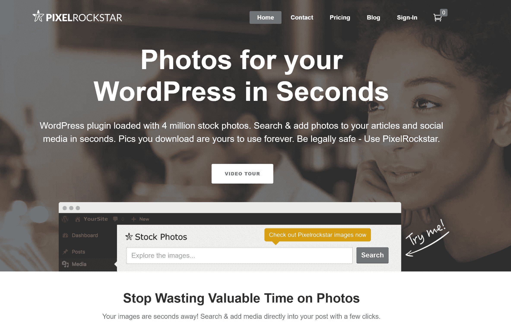](https://www.pixelrockstar.com/)

PixelRockStar WordPress stock photos

他们在自己的简单安全许可证下许可所有图像，所以你不必担心版权问题。你可以在你的 WordPress 网站甚至社交媒体账户上使用这些图片。你甚至可以合法地获得每张照片高达 10，000 美元的保险。一些附加功能包括:

*   下载一次图像，你就可以永远使用它，它们永远不会过期。
*   可以下载分辨率高达 2000 像素的库存照片。

按照下面的步骤开始。

### 第一步

第一步是去 PixelRockstar 购买一份计划/一包库存照片。

Struggling with downtime and WordPress problems? Kinsta is the hosting solution designed to save you time! [Check out our features](https://kinsta.com/features/)

### 第二步

然后你可以按照说明[安装 WordPress 插件](https://www.pixelrockstar.com/installation)。我们与 PixelRockstar 没有关系，但请注意，我们在示例中使用的是测试版。他们也让我们知道他们即将在 WordPress 知识库上发布这个新版本的插件。安装插件后，您需要输入从电子邮件中收到的 API 密钥(也可以在您的帐户面板中访问)。然后，您可以选择您喜欢的图像大小和默认对齐方式。

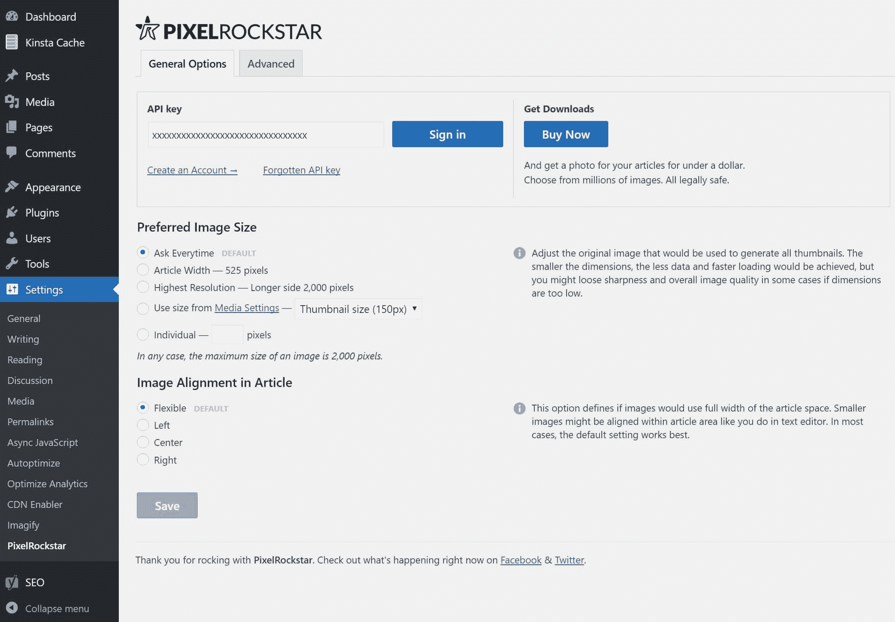

PixelRockStar settings

您还可以使用“高级”选项卡，在其中您可以更改搜索中显示的项目数量、默认标题文本和默认替代文本。

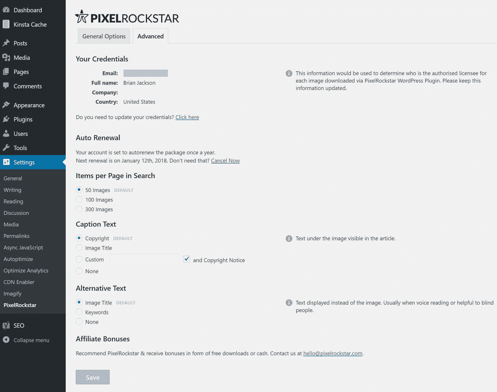

PixelRockStar advanced settings

### 第三步

就像我们上面提到的即时图片插件一样，当你在可视化编辑器中时，你可以简单地点击“添加图片”来插入图片。

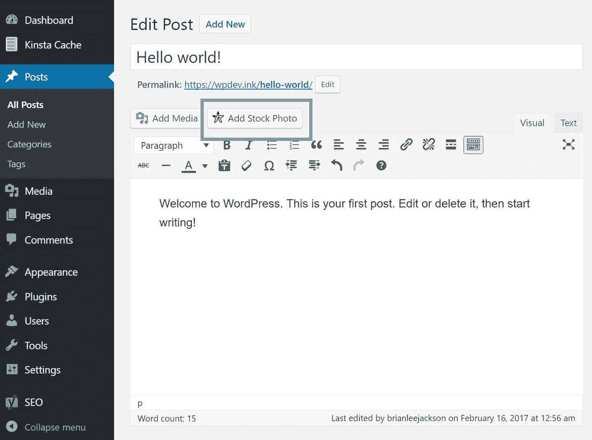

Add stock photo

### 第四步

然后，您可以搜索您想要的照片。选择大小(默认基于您在“设置”中选择的大小)，选择当前大小，并选择“添加为特色图像”选项。然后点击“下载”

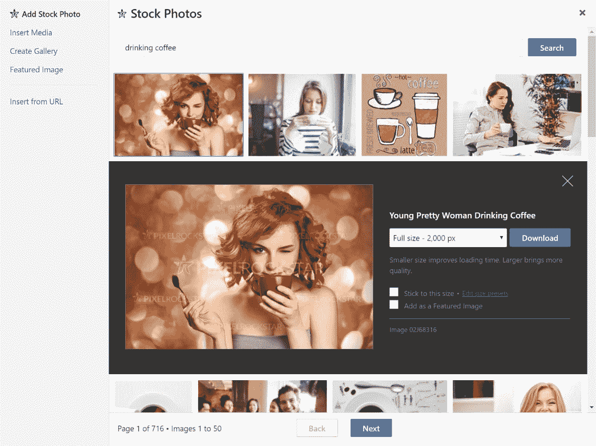

插入 WordPress 股票照片

### 第五步

这个插件相对于即时图片插件的一个优势是，点击下载后，它会带你到图片细节，你可以立即将它插入到文章中。这是一个更简单的过程，允许您轻松地定制 ALT、title 等。我们注意到带有 PixelRockstar 的文件名也用开箱即用的关键字命名，这对 SEO 来说更好。

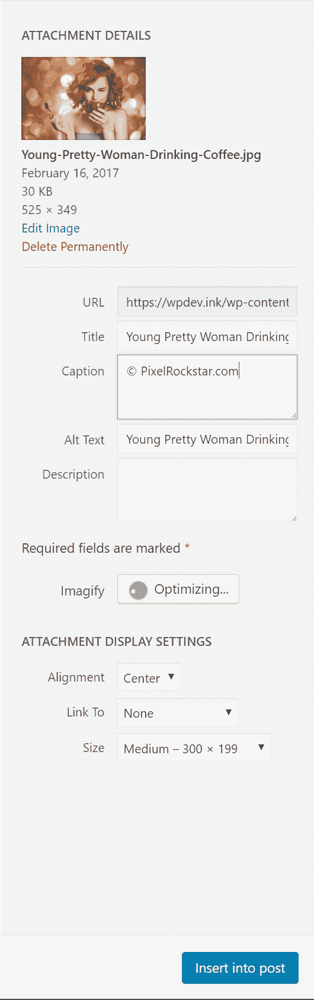

Default stock photo settings

就是这样！只需几秒钟，你的帖子中就有了一幅完整的高分辨率图像！

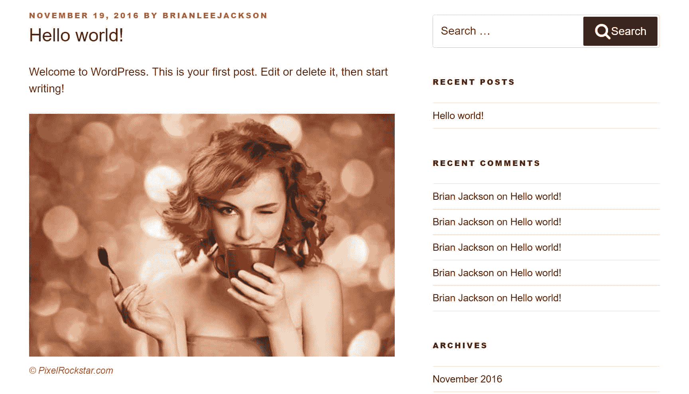

WordPress stock photo example

就像另一个插件一样，如果你正在使用一个图像优化插件，它仍然会工作，因为它们会在图像上传到媒体库时对图像进行优化。作为 WordPress 库存照片的一个高性价比的解决方案，PixelRockstar 相当棒！我们强烈建议去看看。

## 摘要

正如你所看到的，上面的解决方案绝对可以加速你的内容创建和写作，让你永远不用离开你的 WordPress 仪表盘。在书写模式下，查找美丽的图像并立即插入。另一个好处是，你永远不用担心版权或法律问题，因为它们都是完全受保护的。我们很想听听你对当前在你的 WordPress 网站上添加库存照片的工作流程的想法。

* * *

让你所有的[应用程序](https://kinsta.com/application-hosting/)、[数据库](https://kinsta.com/database-hosting/)和 [WordPress 网站](https://kinsta.com/wordpress-hosting/)在线并在一个屋檐下。我们功能丰富的高性能云平台包括:

*   在 MyKinsta 仪表盘中轻松设置和管理
*   24/7 专家支持
*   最好的谷歌云平台硬件和网络，由 Kubernetes 提供最大的可扩展性
*   面向速度和安全性的企业级 Cloudflare 集成
*   全球受众覆盖全球多达 35 个数据中心和 275 多个 pop

在第一个月使用托管的[应用程序或托管](https://kinsta.com/application-hosting/)的[数据库，您可以享受 20 美元的优惠，亲自测试一下。探索我们的](https://kinsta.com/database-hosting/)[计划](https://kinsta.com/plans/)或[与销售人员交谈](https://kinsta.com/contact-us/)以找到最适合您的方式。