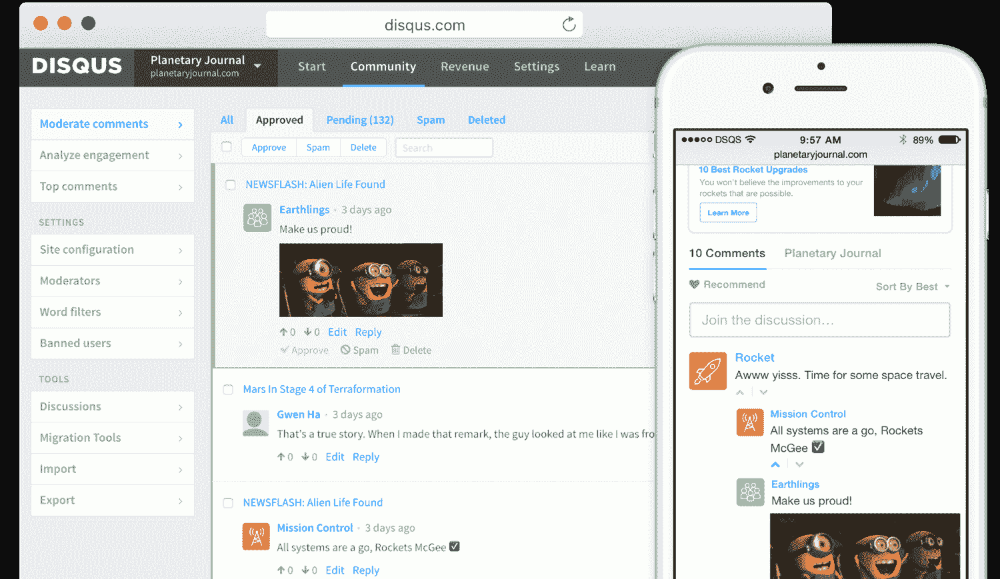
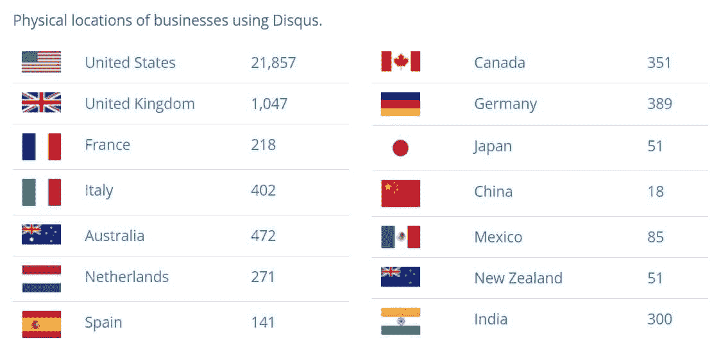
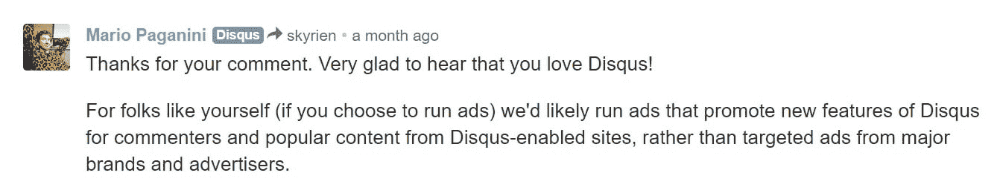
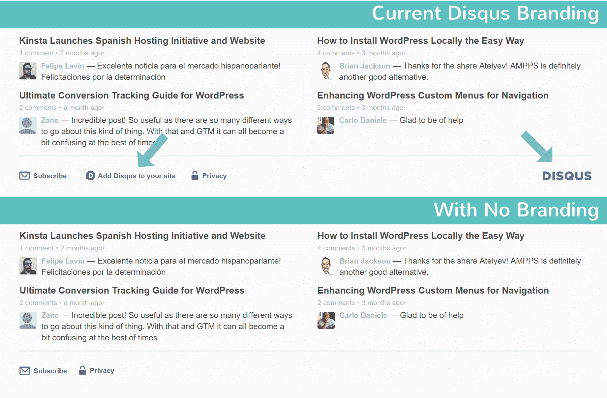

# 重要变化——Disqus 广告不再可以随意禁用

> 原文:# t0]https://kinta . com/blog/discos-ads/

截至 2017 年 3 月， [Disqus](https://disqus.com/) 现在向**收取月费，从你的 WordPress 评论中删除广告**。这是过去一直可以免费禁用的东西，这是一个相当大的变化，将影响成千上万依靠 Disqus 发表评论的企业和博客。今天，我们将深入探讨这一切需要什么，一些利弊，以及一些建议，如果你选择寻找一个替代的评论系统。值得注意的是，Disqus 广告也会影响你的 WordPress 网站上评论的表现(速度)。

[Removing ads in Disqus now costs more than your monthly subscription to Netflix. 😨Click to Tweet](https://twitter.com/intent/tweet?url=https%3A%2F%2Fkinsta.com%2Fblog%2Fdisqus-ads%2F&via=kinsta&text=Removing+ads+in+Disqus+now+costs+more+than+your+monthly+subscription+to+Netflix.+%F0%9F%98%A8&hashtags=WordPress%2Cblogging)

*   [什么是 Disqus？](#what-is-disqus)
*   [Disqus 广告十字路口](#disqus-ads)
*   [质疑理由](#disqus-pros)
*   [Disqus Cons](#disqus-cons)
*   [质疑备选方案](#disqus-alternatives)

## 什么是 Disqus？

对于那些可能不熟悉 Disqus 的人来说，这是一项旨在改善网络评论和讨论的服务。它最初由丹尼尔·哈和严雨松开发，于 2007 年推出。它实际上已经存在了十多年了。因此，当谈到与 [WordPress 评论生态系统](https://kinsta.com/blog/wordpress-disable-comments/)合作时，他们并不陌生。

许多 WordPress 企业和博客使用 Disqus WordPress 插件，因为它**扩展了 WordPress 本地评论**的功能集。强大的审核和管理工具、垃圾邮件过滤、黑名单、电子邮件通知和精心设计的主题评论等功能只是它多年来受欢迎的几个原因。

Img src: [Disqus](https://disqus.com/features/)

根据 WordPress 知识库，它目前活跃在超过 200，000 个网站上。插件本身被非常积极地维护着，尽管它在 5 颗星中只有 3 颗星。以下是一些目前正在使用 Disqus 的大公司和高流量网站:

*   [有线](https://www.wired.com/)
*   [PBS](http://www.pbs.org/)
*   [Tuts+](https://code.tutsplus.com)
*   [搜索引擎圆桌会议](https://www.seroundtable.com/)
*   [大西洋](https://www.theatlantic.com)
*   [滚石](http://www.rollingstone.com)
*   [机器人生命](http://www.droid-life.com)
*   [SlashGear](https://www.slashgear.com)
*   [9 到 5 谷歌](https://9to5google.com/)
*   [Scotch.io](http://scotch.io)
*   拉腊卡斯特

根据他们的公司页面，他们目前每月处理 5000 万条评论，每月 170 亿次页面浏览，并在 191 个不同国家的网站上。 [BuiltWith](https://trends.builtwith.com/widgets/Disqus) 还显示，这些网站中的大部分位于美国。

T2】

## Disqus Ads 十字路口——支付还是不支付

今年 1 月，Disqus 在他们的博客上正式宣布，如果你想删除广告，他们将开始收费，同时他们还计划在 2017 年进行一些其他改变，以及他们评论系统的未来。

> 是啊！Disqus 的全功能基本服务将永远免费使用。出版商可以使用插件或通用代码在他们的网站上免费安装 Disqus。Disqus 的基础版是靠广告支撑的。广告由 Disqus 的 Reveal 系统提供支持，该系统高度可配置，允许出版商从多个不同的广告位置中进行选择。
> 
> 我们知道广告可能不适合所有的出版商和网站。对于这些出版商，我们将提供一个简单的选项来删除广告。只要支付低廉的月费，出版商就可以完全移除广告，并利用 Disqus 的所有基本特性和功能。我们将很快发布该产品的最终定价。— Disqus

根据最近的一些更新和交流，看起来移除 Disqus 广告每月要花费你 **$10。这些变革预计将于 2017 年 3 月全面铺开。对于较大的网站和公司来说，这可能不是什么大事。但是对于中小型网站来说，这可能会让你怀疑你是否真的想保留 Disqus。起初，在一个过去十年免费的系统上付费移除广告似乎有点愚蠢。
T3】**

Disqus 允许出版商在一个组织下管理多个网站。因此，对于考虑按月订阅的出版商来说，订阅将在组织级别进行，而不是在网站级别。这意味着你不必为每个网站每月支付 10 美元。值得注意的是，Disqus 员工也提到广告很可能是为了推广新的 Disqus 功能。这实际上和突然看到垃圾点击诱饵文章出现在你的评论中有很大的不同。所以不要把这个和他们现在的[展示系统](https://help.disqus.com/customer/portal/articles/2069645-reveal-f-a-q-)混淆了。

**更新:**我们已经与 Disqus 的产品营销经理 Mario 进行了直接沟通。自从写了这篇文章，他们已经发布了一个更新，对于大多数用户来说，[广告仍然是可选的。](https://blog.disqus.com/advertising-will-remain-optional-for-over-95-of-sites-on-disqus)

> 规模较小的非商业网站呢？
> 对于小型非商业网站，广告将是可选的。这些网站将可以免费使用 Disqus 的 ads-可选订阅。
> 
> 谁有资格成为小型/非商业网站？
> 出版者能够自我识别。对于个人博客、教育网站、非盈利网站和没有其他广告的小网站，Disqus 广告将是可选的。目前，我们网络上超过 95%的站点都属于这一类。

Disqus 似乎已经在 WordPress 社区中有了一些不好的名声。许多人之前已经接触过这个话题，比如克里斯·马乐在他的博客上关于[他为什么杀死迪斯克斯的帖子，或者加里关于他为什么最终](http://chrislema.com/killed-disqus-commenting/)[拔掉插头](http://rebootauthentic.com/disqus-comments-pull-plug/)的帖子。这一收费移除广告的新变化可能会让那些目前持观望态度的人忍无可忍。

但是在你向 Disqus 发出愤怒的推文之前，有几件事要记住。Disqus 有 30 多名员工，由于他们必须处理大量的流量和带宽，很可能有非常大的基础设施账单。虽然他们的 Reveal 免费增值模式似乎失败了(这很不幸)，但这对大公司来说可能是一件好事，因为 Disqus 已经承诺推出新的优质功能，例如:

*   增强型单点登录
*   强大的调节工具(阴影禁止看起来很有趣)
*   更深入的受众分析
*   面向顶级出版商的内容推广
*   捐款

最后但同样重要的是，能够删除 Disqus 品牌和徽标，同时允许进一步定制外观。

只有时间能告诉我们这些新的变化，看看 WordPress 社区的反应。尽管许多人已经对这些变化感到沮丧。

> 就这么多了:曾经致力于为所有人提供免费评论的@disqus :现在在所有网站上发布广告，然后提供选择退出[#评论](https://twitter.com/hashtag/comments?src=hash&ref_src=twsrc%5Etfw)抄送[@ coral project](https://twitter.com/coralproject?ref_src=twsrc%5Etfw)[pic.twitter.com/jhWKzo4KU0](https://t.co/jhWKzo4KU0)
> 
> —菲尔·史密斯(@ Phillip adsmith)[2017 年 2 月 2 日](https://twitter.com/phillipadsmith/status/827147826895400961?ref_src=twsrc%5Etfw)