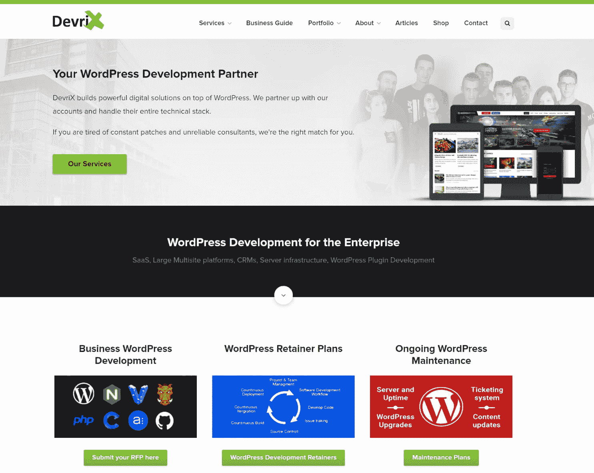

# 金斯塔·金并:马里奥·佩舍夫访谈

> 原文：<https://kinsta.com/blog/interview-with-mario-peshev/>

你可以在 LinkedIn 或者 T2 的 Twitter 上找到马里奥。这是我们最近对他的采访，作为我们[金斯塔·金并](https://kinsta.com/?post_type=post&s=kingpin)系列的一部分。

## Q1:你的背景是什么，你是如何开始使用 WordPress 的？

早在 1996 年，当我父母给我买了第一台个人电脑(100MHz CPU，16MB 内存，421MB 硬盘)时，我就迷上了电脑。美好时光！

后来，我在 1999 年建立了我的第一个静态网站，并在接下来的几年里继续修补技术，编写了很多代码，阅读了更多内容(尽管当时网上的信息量有限)。

2005 年，与我合作的媒体机构决定建立一个新的博客平台，我们必须相应地做一些研发工作(T2)。我以前用过 LiveJournal 和 Blogger，但是 WordPress 看起来很酷，我玩了一会儿。在接下来的几年里，我们有依赖 WordPress 的开发项目，在 2011 年左右，我们已经过渡到专门构建 WP gigs。

## Q2:读者应该知道你最近在 WordPress 做了些什么？

在过去的 6 年里，我一直积极参与各种 WordPress 社区活动——从共同组织本地 meetup 和几个 WordPress(包括 2014 年和 2015 年的 WordPress 欧洲 WordPress ),到构建一些免费主题和插件，在几十个 WordPress 和会议上发言，以及为几个开源项目做贡献。

如今，我经营着一家分布式 WordPress 开发公司，专门为我们的老客户提供增长驱动的合作关系。我们与数量有限的客户密切合作，因为我们希望关注和了解他们的业务需求，从而为他们的目标受众提供最佳结果。

[T2】](http://devrix.com/)

DevriX 现在是一个 25 人的团队，雇佣了 5 名 WordPress 核心贡献者(包括我)，我们一直在 WordPress 领域进行创新，这要归功于我们在 WordPress 基础上构建软件即服务应用程序的深厚专业知识，以及为每月产生超过 1000 万个会话的许多数字平台持续开发功能。

我们一直让自己忙碌，所以我们有一个内部项目的集合，我们在上面成长和试验:)

## Q3:在职业生涯中，你遇到了哪些挑战？

经验当然是你永远不会满足的东西。不管你在数字世界里花了多少个小时，总有那么多东西要学。每年我都会回顾我们所建立的一切，但我仍然看到很多我从未有机会实践的东西。

与成功的中小企业和快节奏的创业公司合作极大地帮助了解决古怪的问题，这些问题需要大量的[代码审查](https://kinsta.com/blog/code-review-tools/)和调试，而小企业不会面对或关心这些问题。

除此之外，WordPress 生态系统中的营销对我来说就像火箭科学。有成千上万的服务提供商以每小时 10-15 美元的价格出售“专业开发”,还有无数的客户认为一切都应该是免费的。在开始开发 DevriX 之前，我的工作是在 Java 生态系统中，通常情况下，相当标准的 20 页网站的价格在 80，000 美元到 120，000 美元之间，有许多数百万美元的 web 项目报价。

你可以想象我对 200-500 美元的 WordPress 网站报价的最初反应！

多年来，远程工作(海外)也导致了某些限制，但我很高兴远程工作最近越来越受欢迎，而且“外包”的概念不再仅仅带来负面含义。过渡到完全全球化的经济还有很长的路要走，但是事情正在朝着正确的方向发展。

## 在 WordPress 的世界里，有没有什么让你感到惊讶的事情？

除了在定价方面的“竞相压价”，我还惊讶地发现，WordPress 领域的绝大多数服务提供商都不是专业的软件工程师(或者拥有计算机科学学士学位的人)。在企业领域工作有一套更保守的要求——工程文凭、证书和全职编程的可靠记录，然后你才能抛开“初级”头衔。

所谓的“乐高解决方案”对我来说是无法解释的。在浏览论坛时，很明显，问题主要是由不应该建立网站的企业主或服务提供商提出的，他们只能通过管理选项或安装插件来定制主题。

几年后，我很高兴我遇到了数百名从事大规模项目的专业开发人员和代理人(并与之共事)。我意识到这个世界不是“非黑即白”的。然而，我以前的同事在 WordPress(以及 WordPress 在 Java 中的表现方式)中看到的都是业余爱好者创建博客和 5 页商业网站的想法。我参加过的 NET、Python 甚至 Drupal 会议)。

## Q5:你认为 WordPress 世界的未来会是怎样的？

我对 [WordPress REST API](https://kinsta.com/blog/wordpress-rest-api/) 寄予厚望，希望它能让非 WordPress 项目更接近我们的生态系统。我们合作的一些企业部署了数百种数字解决方案和内部平台，这些平台是用多种编程语言和技术堆栈构建的。

## 注册订阅时事通讯

### 想知道我们是怎么让流量增长超过 1000%的吗？

加入 20，000 多名获得我们每周时事通讯和内部消息的人的行列吧！

[Subscribe Now](#newsletter)

WordPress 有时是“前台”或营销平台，必须与第三方 eRP 或 CRM 连接，并与另一套解决方案同步数据。

我们还一直致力于 SaaS 解决方案，整合可能是区分成功企业和潜力有限企业的最重要因素。所以 Core 中的 REST API 是接受 WordPress 成为应用和移动开发世界中真正的现代玩家而不是三等公民的良好开端。

除此之外，我认为 WordPress 现在处于一个有趣的位置——与托管网站构建者相比，它太复杂、太沉重或太笨重，但又不像现有的企业框架那样去耦。我很想知道该平台在 2017 年及以后的发展方向。

## 你在 WordPress 主机中寻找什么？

事情挺多的！

事实上，我们可能管理超过 200 个网站，这就是为什么我们与十几家主机公司合作。我们已经与其中一些合作，虽然我对其中一些有偏好，但我充分意识到不同的业务案例需要不同的解决方案并且没有适合每项工作的单一完美工具。

例如，我是兰博基尼的粉丝，但那不是去珠峰越野旅行的理想选择…

Struggling with downtime and WordPress problems? Kinsta is the hosting solution designed to save you time! [Check out our features](https://kinsta.com/features/)

通常，[正常运行时间](https://kinsta.com/blog/website-downtime/)是我们和许多主机供应商一直关心的一个主要问题。缺乏开发特性是我们大型项目的障碍，这些项目包括通过版本控制系统的自动化部署、内部可用的监控工具，以及允许我们在试运行和生产站点之间交换 API 密钥的特定配置。

在最新最好的技术栈上运行通常是一个好处——尽管我们偶尔需要移植第三方解决方案，这些解决方案只需要旧版本的 PHP 或 [Nginx](https://kinsta.com/knowledgebase/what-is-nginx/) 。

将托管服务仅限于 WordPress 在性能方面也很好(没有不适用于 WordPress 的 mods 的开销，或者黑客的额外媒介)，但是如果我们需要建立一个论坛，或者实例中的广告服务器呢？

缓存层可能在单个站点或非 SSL 层上运行得非常快，但是多站点呢？

我们刚刚经历了从受欢迎的托管提供商到我们的合作伙伴的转变，因为:

*   原始主机的分段安装不适用于子域多站点安装
*   缓存层仅适用于主网站
*   由于一个月(或更长时间)的文件大小限制，出现了备份问题
*   ssh 通过 VPN(由于 IP 白名单策略)
*   “vim”已经无法使用，因为定制的外壳会在每 5 次按键或退格时添加奇怪的特殊符号
*   支持系统不允许在回复票证时在 Cc 中添加任何用户，这使得跟踪票证完全不可能

虽然我们以前与同一家托管公司成功合作过，但在那种情况下，局限性肯定是不可接受的，会拖累业务。

简而言之，我们非常感谢所有致力于为开发者准备的现代技术栈的托管公司，这是快速的，至少在 99.99%的时间里，以及训练有素的 WordPress 技术团队提供支持和持续更新。对于给定的实例，无论是激活 mod 还是 nginx 中的自定义规则，都需要灵活性。

## 问题 7:当你离开笔记本电脑时，你喜欢做什么？

我很少离开笔记本电脑，但我相当沉迷于水烟，偶尔在当地的水烟酒吧工作。我们家里和办公室也有这些:)

晚上，我会和我的女朋友以及我们的拉布拉多猎犬(它碰巧对突袭和地下城有着奇怪的兴趣)一起玩 WoW 或者看一些连续剧！

## 问题 8:接下来我们应该采访谁&为什么？

到目前为止，你已经覆盖了一个很好的 WordPress 影响者列表，并且排除了我的一些推荐！

我会邀请兰斯·克里夫兰、T2、维沙尔·科塔里和 T4 的奈杰尔·巴哈杜尔上台。正如我上面提到的，作为一个编程极客，我一直很钦佩那些在 WordPress 行业的营销挑战中取得突破的“老派”工程师。此外，DevriX 从来没有特别积极地开发我们自己的产品，我非常尊重那些成功的产品业务所有者，他们在幕后管理团队，构建出色的 WordPress 插件，每月产生稳定的销售额。

虽然他们在幕后悄悄地进行创新，但我相信他们在企业领域的专业知识加上成功的 WordPress 产品开发经验会对其他 WordPress 同行有所帮助。

* * *

让你所有的[应用程序](https://kinsta.com/application-hosting/)、[数据库](https://kinsta.com/database-hosting/)和 [WordPress 网站](https://kinsta.com/wordpress-hosting/)在线并在一个屋檐下。我们功能丰富的高性能云平台包括:

*   在 MyKinsta 仪表盘中轻松设置和管理
*   24/7 专家支持
*   最好的谷歌云平台硬件和网络，由 Kubernetes 提供最大的可扩展性
*   面向速度和安全性的企业级 Cloudflare 集成
*   全球受众覆盖全球多达 35 个数据中心和 275 多个 pop

在第一个月使用托管的[应用程序或托管](https://kinsta.com/application-hosting/)的[数据库，您可以享受 20 美元的优惠，亲自测试一下。探索我们的](https://kinsta.com/database-hosting/)[计划](https://kinsta.com/plans/)或[与销售人员交谈](https://kinsta.com/contact-us/)以找到最适合您的方式。