# 7 个鲜为人知(但很有用)的 WordPress 性能插件

> 原文：<https://kinsta.com/blog/wordpress-performance-plugins/>

你的 WordPress 主机可以快如闪电，但它并不总是可怕的编码或未优化的插件和主题的魔杖。我们在金斯塔经常看到这种情况。有时，即使只是一个糟糕的插件或代码片段也可能是你网站最大的敌人，让一切都变得缓慢。这就是为什么我们用 [Kinsta APM 工具](https://kinsta.com/apm-tool/)监控我们客户的网站，甚至有一个[禁止插件列表](https://kinsta.com/knowledgebase/banned-plugins/)。今天，我们将与你分享一些方便的、鲜为人知的 WordPress 性能插件，它们可以帮助你排除故障，提高网站速度。

## 2022 年的 7 个 WordPress 性能插件

用另一个插件来修复一个插件或脚本听起来可能有点讽刺。这可能不是解决问题的最佳方式。但是对于那些不是 WordPress 开发者的人来说，在很多情况下，这可能是你不得不求助的。没有十全十美的插件或开发者，所以有时候想出一些办法让它们运行得更好更快会非常有用。下面列出的很多插件并不流行，有些只安装了几千个，但它们绝对值得一些额外的认可，包括它们的开发者。

[Sometimes the best plugins are those by individual developers just solving a problem.Click to Tweet](https://twitter.com/intent/tweet?url=https%3A%2F%2Fbit.ly%2F2sYUlRR&via=kinsta&text=Sometimes+the+best+plugins+are+those+by+individual+developers+just+solving+a+problem.&hashtags=webdev%2CWordPress)

*   [查询监视器](#query-monitor)
*   [完整的分析优化套件](#caos)
*   [Disqus 条件加载](#disqus-conditional-load)
*   [懒加载评论](#lazy-load-comments)
*   [禁用表情符号](#disable-emojis)
*   [禁用嵌入](#disable-embeds)
*   [性能](#perfmatters)

记住，添加更多的插件并不一定是坏事，只要它们是轻量级的并且开发正确。我们已经看到许多有 60 多个插件的网站在不到 1 秒的时间内轻松加载。归结起来就是选择正确的，然后优化它们。


### 1。查询监视器

我们推荐的第一个 WordPress 性能插件是[查询监视器](https://wordpress.org/plugins/query-monitor/)，一个免费的 [WordPress 调试和开发插件](https://kinsta.com/blog/wordpress-debug/)。您可以使用它来识别和调试缓慢的数据库查询、 [AJAX 调用](https://kinsta.com/blog/admin-ajax-php/)、REST API 请求等等。此外，该插件报告网站的详细信息，如脚本依赖和依赖，页面生成期间触发的 WordPress 挂钩，托管环境的详细信息，当前页面满足的条件查询标签，等等。

[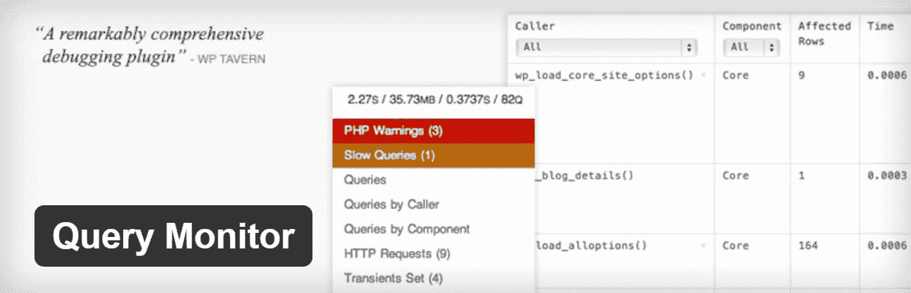](https://wordpress.org/plugins/query-monitor/)

Query monitor plugin


这个插件是由约翰·布莱克伯恩开发的，他是 WordPress 的核心成员，目前是 Human Made 的开发者，之前曾受雇于 T2 的 WordPress VIP。在撰写本文时，它目前有超过 20，000 个活跃安装，获得了 5 颗星的评级。你可以从 [WordPress 知识库](https://wordpress.org/plugins/query-monitor/)下载，或者在你的 WordPress 仪表盘的“添加新插件”下搜索。


你可以用这个做各种事情。开发者会喜欢这个插件，因为你可以缩小页面上发生的每个查询。如果你是一个开发者，你甚至可以看到这个插件是否能提供最有效的查询。它不仅用于前端，你也可以用它来解决你的 WordPress 仪表盘的性能问题。

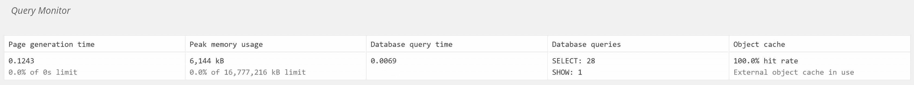

Querys


这是一个更大网站的 WordPress 仪表盘的例子。我们可以立即看到，漂亮的链接插件是最大的打击者。

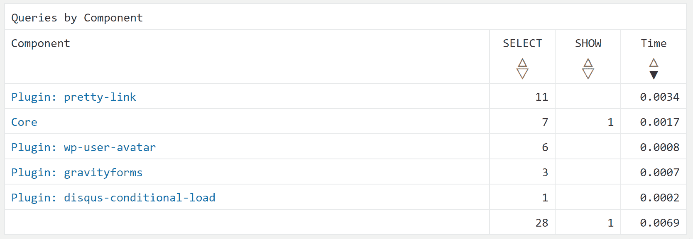

Queries by component


您可以查看我们关于[如何使用查询监视器](https://kinsta.com/blog/query-monitor/)的完整深入教程，以及更多用例场景。
T3】

### 2。完整的分析优化套件(CAOS)

我们推荐的第二个插件是免费的[完整分析优化套件](https://wordpress.org/plugins/host-analyticsjs-local/)，由金奎大·范·登·伯格创建和开发。这个插件允许你在 WordPress 网站上本地托管 Google Analytics。

[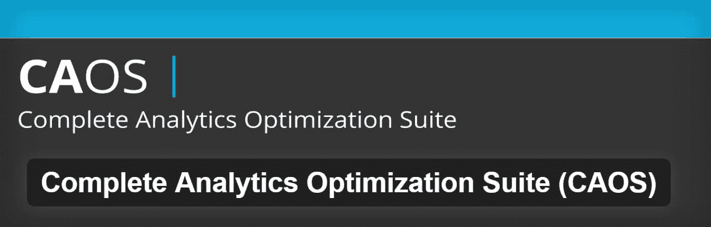](https://wordpress.org/plugins/host-analyticsjs-local/)

Complete analytics optimization suite plugin


它目前有超过 10，000 个活跃安装，获得 5 颗星的评级。你可以从 WordPress 知识库下载[完整的分析优化套件](https://wordpress.org/plugins/host-analyticsjs-local/)，或者在你的 WordPress 仪表盘的“添加新插件[下搜索它。该插件允许您在本地托管 Google Analytics JavaScript 文件(analytics.js ),并使用 wp_cron()保持其更新。其他功能包括能够很容易地匿名化你的访问者的 IP 地址，设置一个调整后的跳出率，以及脚本的位置(页眉或页脚)。](https://kinsta.com/knowledgebase/wordpress-admin/)

在本地托管你的分析脚本的一些好处是你[减少了你对谷歌的外部 HTTP 请求](https://kinsta.com/blog/make-fewer-http-requests/)从 2 个减少到 1 个，并且你现在**完全控制文件**的缓存。你也可以摆脱恼人的[利用浏览器缓存](https://kinsta.com/blog/leverage-browser-caching/)警告，讽刺的是，这是由谷歌自己的脚本引起的。

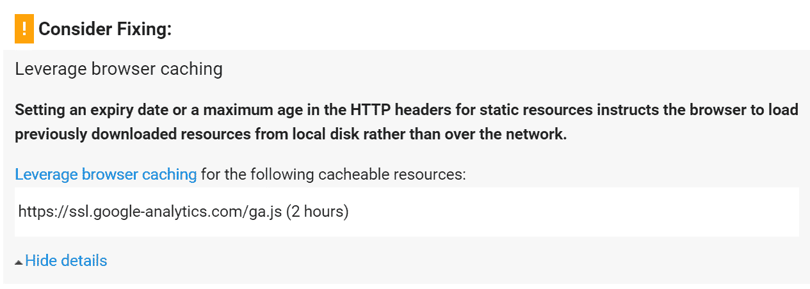

Leverage browser caching warning


只需安装该插件，输入您的 Google Analytics 跟踪 ID，该插件将为 Google Analytics 添加必要的跟踪代码到您的 WordPress 网站，下载并保存 analytics.js 文件到您的服务器，并使用 wp_cron()中的预定脚本保持更新。我们还建议将其设置为在页脚加载。注意:这个插件不能与其他 Google Analytics WordPress 插件一起使用，并且不支持 Google 推荐的方法。

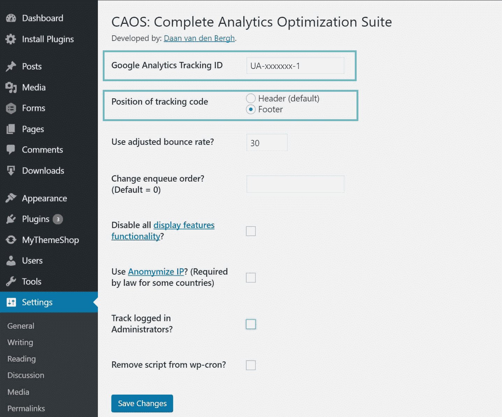

Local analytics settings


### 3。Disqus 条件负载

如果你真的使用 Disqus，那么延迟加载 Disqus 注释是非常关键的。如果你不这样做，Disqus 可能会成为你的网站加载速度的真正障碍。为什么？因为默认情况下，它必须加载每一个虚拟形象，以及由于 Disqus 广告的[变化而包含的所有附加脚本。所以我们强烈推荐查看乔尔·詹姆斯的免费](https://kinsta.com/blog/disqus-ads/) [Disqus 条件加载](https://wordpress.org/plugins/disqus-conditional-load/)插件。

[](https://wordpress.org/plugins/disqus-conditional-load/)

Disqus conditional load plugin


该插件目前有超过 10，000 个活跃安装，星级为 4.8。你可以从 WordPress 知识库下载 [Disqus Conditional Load](https://wordpress.org/plugins/disqus-conditional-load/) ,或者在你的 WordPress 仪表盘的“添加新插件”下搜索。在启用这个插件之前，你需要禁用官方的 Disqus 插件。除了延迟加载所有的图像(头像)，它还可以让你禁用计数脚本，如果你不使用它。所以你的 WordPress 站点上少了一个 JavaScript 调用。

我们做了一些快速测试，所以你可以看到不同之处。在我们的例子中，我们有一篇博文，上面有 35 条评论。我们首先用官方的 Disqus 插件测试了它，然后用 Disqus 条件加载插件运行了测试。

**官方 Disqus 插件**

我们首先在 [Pingdom](https://tools.pingdom.com/#!/dgqxMD/https://woorkup.com/niche-site/) 中运行 5 次测试，然后取平均值。如您所见，113 个请求的总加载时间为 917 ms。

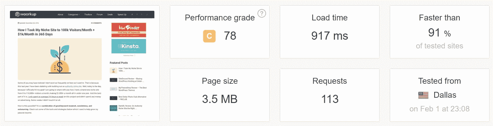

Speed test with official Disqus plugin


**Disqus 条件加载插件**

然后我们切换到 Disqus 条件加载插件，在 [Pingdom](https://tools.pingdom.com/#!/gxAoj/https://woorkup.com/niche-site/) 中再次运行 5 次测试。如您所见，我们的加载时间下降到 685 毫秒，现在只有 88 个请求！谈谈一个小小的免费插件交换的主要区别。对于使用 Disqus 的大型新闻网站来说，这可能会创造奇迹。

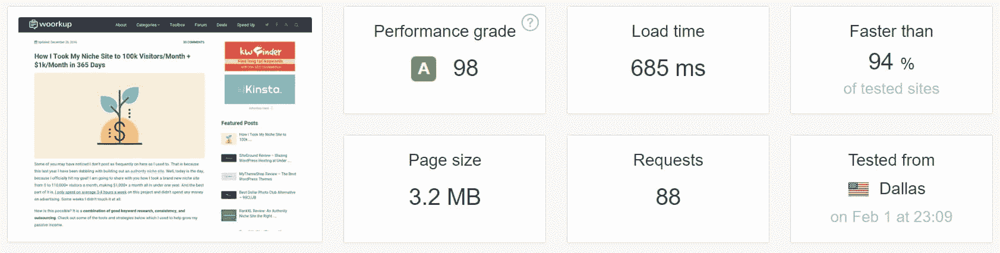

Speed test with Disqus conditional load plugin


### 4。评论的延迟加载

也许你根本不喜欢 Disqus。它肯定有它的优点和缺点。如果你更喜欢使用原生的 WordPress 评论，这也有类似的问题。默认情况下，它在每次页面加载时加载所有 gravatars。WordPress 核心没有内置延迟加载评论的功能。然而，我们推荐的一个很棒的轻量级免费解决方案是[评论插件](https://wordpress.org/plugins/lazy-load-for-comments/)。这也是詹姆斯·乔尔开发的。


Lazy load comments plugin


这是一个较新的插件，目前只有 100 个活跃安装，评级为 5 星。你可以从 WordPress 知识库下载 [Lazy Load for Comments](https://wordpress.org/plugins/lazy-load-for-comments/) ，或者在你的 WordPress 仪表盘的“添加新插件”下搜索。

配置起来非常简单。只需安装并在讨论设置下，有两个选项。默认情况下，它被设置为“在滚动中”，这可能是大多数人更喜欢的。你也可以将其设置为“点击”,这将在评论加载之前为访问者创建一个点击按钮。

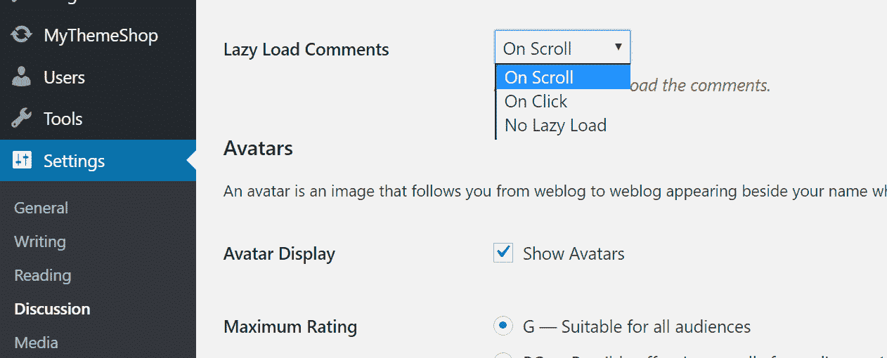

Lazy load comments options


我们做了一些快速测试，所以你可以看到不同之处。在我们的例子中，我们再次使用了同一篇有 35 条评论的博客文章。我们首先用原生注释进行了测试，然后用惰性注释加载插件进行了测试。

**原生评论**

我们首先在 [Pingdom](https://tools.pingdom.com/#!/zeZ29/https://woorkup.com/niche-site/) 中运行 5 次测试，然后取平均值。如您所见，106 个请求的总加载时间为 827 ms。

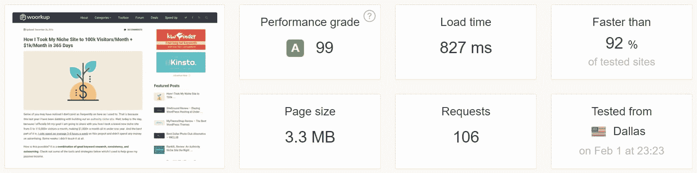

Speed test with native WordPress comments


**惰性加载评论插件**

## 注册订阅时事通讯


### 想知道我们是怎么让流量增长超过 1000%的吗？

加入 20，000 多名获得我们每周时事通讯和内部消息的人的行列吧！

[Subscribe Now](#newsletter)

然后我们切换到评论的惰性加载插件，并在 [Pingdom](https://tools.pingdom.com/#!/dv3ego/https://woorkup.com/niche-site/) 中再次运行 5 次测试。正如你所看到的，我们的加载时间下降到 685 毫秒，我们现在只有 87 个请求！这太棒了。对原生注释如此小的调整，立刻就快了很多。

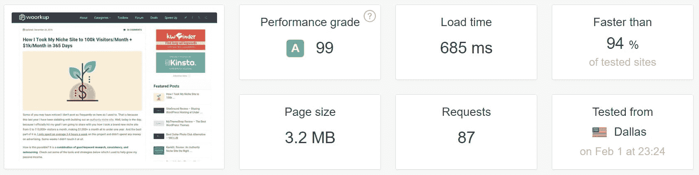

Speed test with lazy loaded comments


一定要看看我们关于其他方法的帖子[来加速 WordPress 评论](https://kinsta.com/blog/wordpress-comments/)。

### 5 。禁用表情符号

当他们发布 WordPress 4.2 时，他们在旧浏览器的核心中增加了对表情符号的支持。最大的问题是，它会在你的 WordPress 站点上生成一个额外的 HTTP 请求来加载 wp-emoji-release.min.js 文件。这在每一页上都有体现。虽然这个文件只有 10.5 KB，但随着时间的推移，这样的东西会越来越多。对于大多数企业来说，他们永远不会使用表情符号。好消息是有一个名为[禁用表情符号](https://wordpress.org/plugins/disable-emojis/)的免费插件，由[瑞安·海勒尔](https://twitter.com/ryanhellyer/)开发。

[](https://wordpress.org/plugins/disable-emojis/)

Disable emojis plugin


这个插件是超级轻量级的，准确的说只有 9 KB。在撰写本文时，它目前有超过 40，000 个活跃安装，获得了 5 颗星的评级。你可以从 [WordPress 知识库](https://wordpress.org/plugins/disable-emojis/)下载它，或者在你的 WordPress 仪表盘的“添加新插件”下搜索它。表情符号和表情符号仍然可以在内置支持它们的浏览器中使用。这个插件只是删除了额外的 JavaScript 文件，该文件用于在旧浏览器中添加对表情符号的支持。不需要配置什么，只需要安装，激活，额外的 JavaScript 文件就没了。

下面是一个脚本的例子，它将在你的 WordPress 站点上禁用。

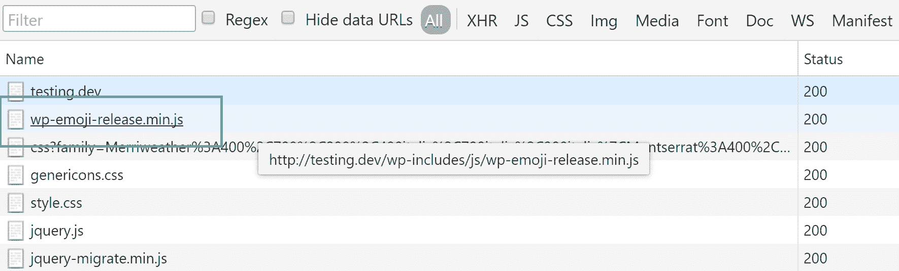

wp-emoji-release.min.js


你也可以看看我们关于如何在不使用插件的情况下禁用表情符号的教程。

### 6 。禁用嵌入

然后我们有嵌入。当他们发布 [WordPress 4.4](https://codex.wordpress.org/Version_4.4) 时，他们将 oEmbed 功能合并到了 core 中。你可能以前见过或用过这个。这使得用户只需粘贴一个 URL 就可以在他们的网站上嵌入 YouTube 视频、推文和许多其他资源，WordPress 会自动将其转换为嵌入内容，并在可视化编辑器中提供实时预览。如果你的网站中嵌入了脸书，看看脸书的新更新会如何影响它，以及[如何修复它](https://kinsta.com/blog/facebook-oembed/)。

WordPress 长期以来一直是 oEmbed 消费者，但随着更新，WordPress 本身[成为了 oEmbed 提供商](https://make.wordpress.org/core/2015/10/28/new-embeds-feature-in-wordpress-4-4/)。这个特性对很多人来说都很有用，你可以让它保持启用状态。然而，这意味着它还会在你的 WordPress 站点上生成一个额外的 HTTP 请求来加载 wp-embed.min.js 文件。这在每一页上都有体现。虽然这个文件只有 1.7 KB，但是随着时间的推移，这样的东西会越来越多。请求本身有时比内容下载量更大。

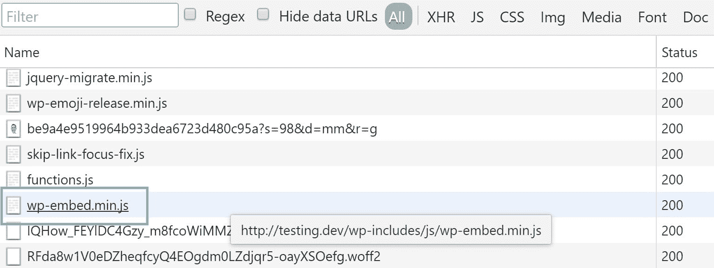

wp-embed.min.js


谢天谢地，有一个免费插件叫做 [Disable Embeds](https://wordpress.org/plugins/disable-embeds/) ，由 [Pascal Birchler](https://twitter.com/swissspidy) 开发，他实际上是 WordPress 的核心贡献者之一。

[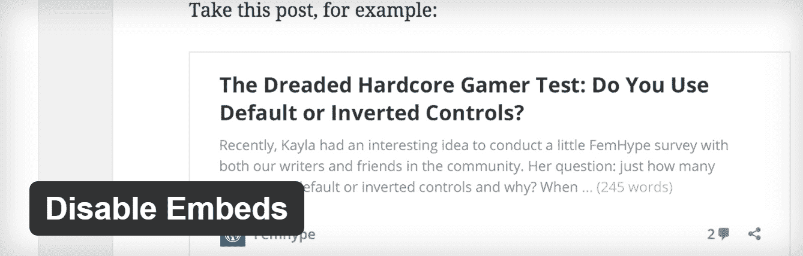](https://wordpress.org/plugins/disable-embeds/)

Disable embeds plugin


这个插件是超级轻量级的，准确地说只有 3 KB。在撰写本文时，它目前有超过 10，000 个活跃安装，评分为 4.8(满分为 5 星)。你可以从 [WordPress 知识库](https://wordpress.org/plugins/disable-embeds/)下载它，或者在你的 WordPress 仪表盘的“添加新插件”下搜索它。不需要配置什么，只需要安装，激活，额外的 JavaScript 文件就没了。具有以下特点:

Struggling with downtime and WordPress problems? Kinsta is the hosting solution designed to save you time! [Check out our features](https://kinsta.com/features/)

*   防止其他人嵌入您的网站。
*   防止您嵌入其他非白名单网站。
*   禁止 JavaScript 文件加载到你的 WordPress 站点上。

你仍然可以使用 YouTube 和 Twitter 的 [embed iframe](https://kinsta.com/blog/wordpress-iframe/) 脚本来嵌入它们的内容。你也可以看看我们关于[如何在不使用插件的情况下禁用嵌入的](https://kinsta.com/knowledgebase/disable-embeds-wordpress/)的教程。

### 7 .。完美事物

这个模块上还有一个新插件叫做[perfmates](https://perfmatters.io/)，它允许你实际上组合上面提到的三个插件。这使得管理和更新变得更加容易。perfmatters 插件实际上是由 Kinsta 团队成员之一开发的！

[](https://perfmatters.io/)

perfmatters WordPress plugin


这是一个高级插件，让你只需点击一下就可以轻松实现众多的网络性能优化。以下是您可以进行的许多优化中的几个:

*   禁用 Emojis
*   禁用嵌入
*   移除查询字符串
*   移除 jQuery 迁移
*   禁用和/或限制帖子修订
*   更改自动保存间隔
*   禁用 pingbacks 和 trackbacks
*   禁用 XML-RPC
*   <label for="remove_wordpress_generator_tag">移除 WordPress 生成器标签</label>
*   移除 [RSS 源](https://kinsta.com/blog/wordpress-rss-feed/)链接
*   禁用 WordPress 心跳 API
*   dns 预定义
*   禁用 WooCommerce 脚本和样式
*   禁用 WooCommerce 购物车片段(AJAX)

这些优化有助于减少网站上的 HTTP 请求，减少数据库膨胀。重要的是要注意，它不会从你的网站上删除任何文件，它只是用 WordPress 钩子禁用它们。这是完全安全的。

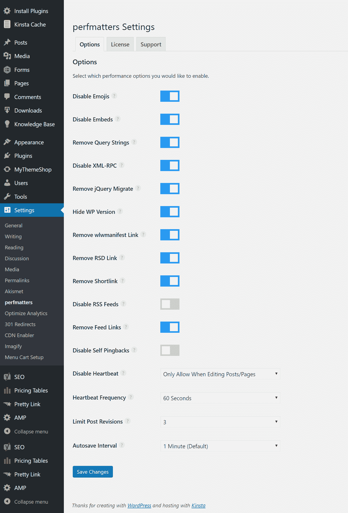

perfmatters settings


其中最强大的功能之一是脚本管理器。这允许你根据你访问的页面有条件地加载 CSS 和 JS。这是一个简单而轻量级的插件，可以清除主题和插件注册的无用 CSS 和 JS 文件。即使你运行在 [HTTP/2](https://kinsta.com/learn/what-is-http2/) 之上，你仍然可以节省一些页面加载的时间。

作为脚本管理器功能的一个快速示例，我们启动了我们的开发站点并安装了以下插件，这些插件是您可能在客户的站点或博客上找到的典型插件:

*   [联系方式 7](https://kinsta.com/blog/contact-form-7/)
*   [问题评论系统](https://kinsta.com/blog/wordpress-comments/)
*   Q2W3 固定部件
*   社会战争
*   目录加
*   [TablePress](https://kinsta.com/blog/tables-in-wordpress-tablepress/)

**之前性能插件**

然后我们在 [Pingdom](https://tools.pingdom.com/#!/cmNWxK/https://wpdev.ink) 中运行了 5 次测试，取平均值。如您所见，我们的总页面大小为 264.4 kB，加载时间为 469 ms，总共有 24 个请求。

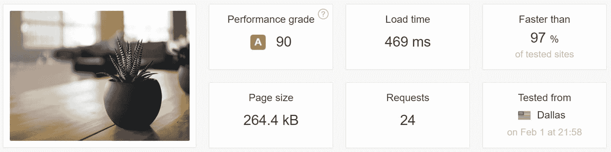

Speed test before perfmatters plugin


**配置性能插件**

然后我们配置了 perfmatters 插件。要做到这一点，只需浏览到你的网站上的一个页面，在这里是主页，然后点击你的 WordPress 管理栏中的“脚本管理器”。

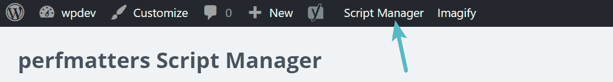

perfmatters in admin bar


许多 WordPress 插件的最大问题之一是它们在你的整个网站上加载它们的脚本。甚至连 Contact Form 7 等热门插件都是这样做的。对于大多数人来说，他们真的只需要在他们的联系人页面上加载 Contact Form 7 的脚本。类似于 Social war 和 Disqus 这样的插件也是如此。《社交战争》提供了社交媒体按钮，你真的只想把它放在你的博客帖子上。对于 Disqus，也是一样。有了 perfmatters，你可以配置它们加载到某些页面，某些文章，完全禁用它们，等等。几乎任何配置。

在本例中，我们禁止在主页上加载以下 12 个脚本，因为不需要它们。毕竟，你的主页是网站中最重要的页面之一，也是访问者最先看到的页面。perfmatters 允许您通过单击一个按钮来禁用脚本。

```
/wp-content/themes/twentyseventeen/assets/js/html5.js
/wp-content/plugins/contact-form-7/includes/css/styles.css
/wp-content/plugins/table-of-contents-plus/screen.min.css
/wp-content/plugins/social-warfare/css/style.min.css
/wp-content/plugins/tablepress/css/default.min.css
/wp-content/plugins/contact-form-7/includes/js/jquery.form.min.js
/wp-content/plugins/contact-form-7/includes/js/scripts.js
/wp-content/plugins/table-of-contents-plus/front.min.js
/wp-content/plugins/social-warfare/js/script.min.js
/wp-content/plugins/q2w3-fixed-widget/js/q2w3-fixed-widget.min.js
/wp-content/plugins/disqus-comment-system/media/js/count.js
/wp-includes/js/wp-embed.min.js
```

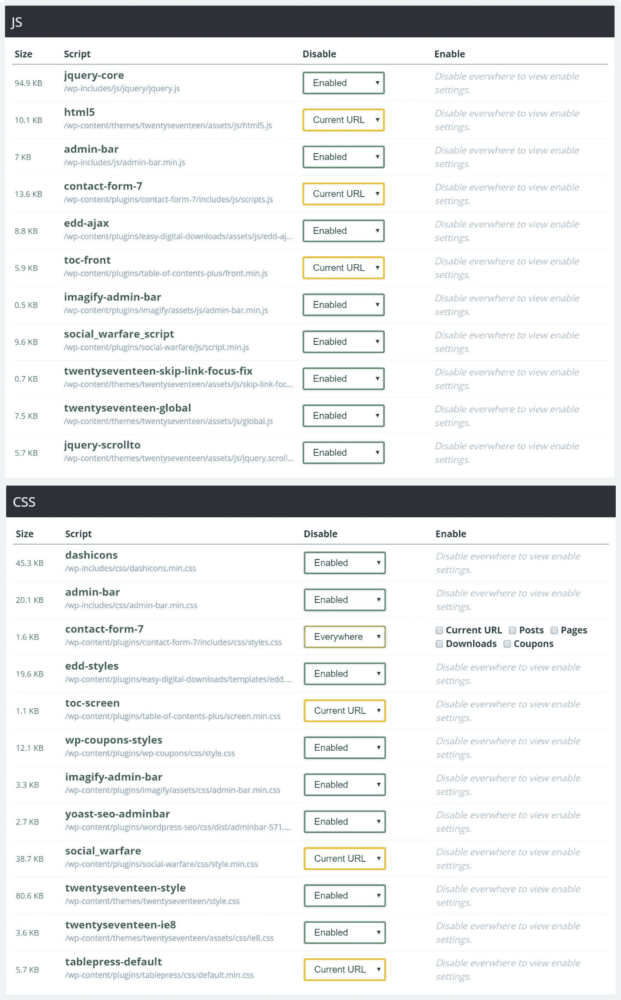

Disable scripts with perfmatters plugin


**后性能插件**

然后，我们在 [Pingdom](https://tools.pingdom.com/#!/gpbVG/https://wpdev.ink) 中再次运行了 5 次测试，并取平均值。如您所见，我们现在的总页面大小为 231.7 kB，加载时间为 424 ms，总共有 12 个请求。**使用这个插件，我们的请求总数减少了一半！**没有进行连接，这意味着这完全符合获得更好 HTTP/2 性能的最佳实践。它利用了原生的 WordPress 钩子，这是它应该做的。

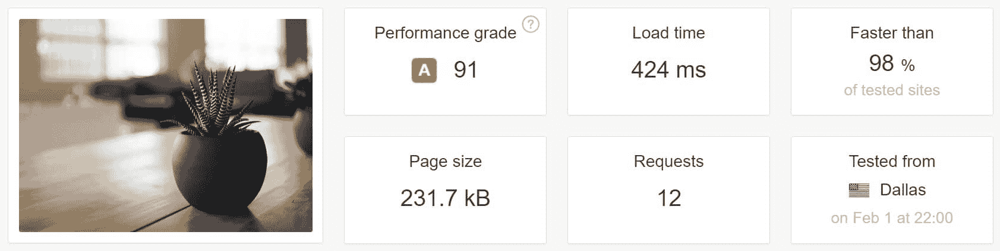

Speed test after perfmatters plugin


当然，这只是一个小网站上的例子。在更大的网站上，你可以禁用某些不需要的 WooCommerce 脚本，EDD 脚本等等。你可能已经知道这有多强大了。通常，如果没有使用或需要某个东西，最好不要为用户加载它。这确保了可能的最佳加载时间。对于那些还没有在 HTTP/2 支持的服务器上运行的人来说，你会看到这个插件带来了更大的速度提升。另一个你可以尝试的免费选择，非常相似，是[插件组织者插件](https://wordpress.org/plugins/plugin-organizer/)。

### 加速 WordPress 的附加资源

除了上面提到的所有高性能插件，这里还有一些额外的资源可以帮助你进一步提高网站的速度。

*   加速 WordPress 的 19 个以上提示
*   [网站速度优化初学者指南](https://kinsta.com/learn/page-speed/)

## 摘要

正如你所看到的，上面的许多 WordPress 性能插件只是小小的调整。但是，如果你开始实现所有这些，他们肯定可以增加一个更快的网站。

完全不需要评论？然后你可以简单地[禁用 WordPress](https://kinsta.com/blog/wordpress-disable-comments/) 中的评论。

我们是否错过了其他性能良好的插件？如果有，请在下面告诉我们。(我们在这篇文章中没有包括 P3 探查器，因为它已经显示出性能问题)

* * *

让你所有的[应用程序](https://kinsta.com/application-hosting/)、[数据库](https://kinsta.com/database-hosting/)和 [WordPress 网站](https://kinsta.com/wordpress-hosting/)在线并在一个屋檐下。我们功能丰富的高性能云平台包括:

*   在 MyKinsta 仪表盘中轻松设置和管理
*   24/7 专家支持
*   最好的谷歌云平台硬件和网络，由 Kubernetes 提供最大的可扩展性
*   面向速度和安全性的企业级 Cloudflare 集成
*   全球受众覆盖全球多达 35 个数据中心和 275 多个 pop

在第一个月使用托管的[应用程序或托管](https://kinsta.com/application-hosting/)的[数据库，您可以享受 20 美元的优惠，亲自测试一下。探索我们的](https://kinsta.com/database-hosting/)[计划](https://kinsta.com/plans/)或[与销售人员交谈](https://kinsta.com/contact-us/)以找到最适合您的方式。