# 为 WordPress 设置 Stripe 的 4 种简单方法

> 原文：<https://kinsta.com/blog/stripe-for-wordpress/>

当谈到选择在你的 WordPress 网站上使用的支付网关时，通常会想到两个流行的网关，PayPal 和 Stripe。几年前，PayPal 曾是电子商务网站唯一简单的解决方案之一，但现在情况不同了。Stripe 提供了较低的交易费用，并因其灵活的 API 而在开发人员社区中非常受欢迎。今天我们将深入探讨 4 种简单的方法来为 WordPress 设置 Stripe，不需要编码。对于初创公司、企业以及运营 WooCommerce 和 EDD 商店的人来说，Stripe 是一个非常实惠的解决方案。

用方形代替？查看我们的深度对比博文:[条纹 vs 方形](https://kinsta.com/blog/stripe-vs-square/)。

## 什么是条纹？

Stripe 是一个快速发展的支付网关，能够处理经常性支付，并能自动处理退款。它受到世界各地大牌品牌的信任和使用，其中包括百思买、塔吉特、Lyft、Docker、HubSpot、脸书、 [Shopify](https://kinsta.com/blog/shopify-alternatives/) 和 IndieGoGo。实际上，我们在 Kinsta 使用它们来接受所有虚拟主机客户的付款。


Stripe 由约翰和帕特里克·科利森两兄弟于 2010 年创立。它于 2011 年公开推出，并获得了多轮融资。它甚至在 2016 年福布斯云 100 强榜单上排名第四。有很多支付网关可供选择，但 Stripe 对简单性的关注以及他们受欢迎的 Stripe API 使他们从竞争对手中脱颖而出，这帮助 [Stripe 收入](https://kinsta.com/stripe-revenue/)获得巨大增长，在市场份额方面排名第二，仅次于 Paypal。他们的收费结构更容易理解，因为对于那些年收入低于 100 万美元的人来说，这是一个 2.9% + 30 的统一费率。他们还允许你从自己的网站上免费向信用卡收费，而贝宝每月收取 30 美元，外加交易费。Stripe 也不收取任何退款或授权卡的费用。然而，随着交易量的增加，贝宝的确会变得更便宜。

Stripe 还有一款名为 Radar 的机器学习产品，可以减少欺诈交易的数量。如需了解更多详情，请查看我们的详细指南:[如何使用条纹雷达防止信用卡欺诈并将其减少 98%](https://kinsta.com/blog/credit-card-fraud-stripe/)

## 为 WordPress 设置条纹

Stripe 在技术上没有官方的 WordPress 插件或集成，但是感谢那些使用他们的 API 的令人敬畏的 WordPress 社区，现在有很多很好的选择来轻松地在你的站点上获得 Stripe。下面我们将介绍 WordPress 在一个基本网站上的设置，包括一个表单插件和自定义字段，以及像 WooCommerce 和 Easy Digital Downloads 这样的电子商务平台。需要注意的是 **SSL 需要在您的 Stripe checkout 页面**上安全地传输支付数据。许多主机，甚至是 Kinsta，现在都提供[免费 SSL 证书](https://kinsta.com/blog/free-ssl-certificate/)和“让我们加密”。不过要小心，如果你没有正确迁移，你可能会损害你的网站，所以一定要查看我们深入的 [HTTP 到 HTTPS 迁移指南](https://kinsta.com/blog/http-to-https/)。

*   [在基本 WordPress 网站上设置条纹](#stripe-wordpress)
*   [用重力形式设置条纹](#stripe-contact-form)
*   [在 WooCommerce 中设置条纹](#stripe-woocommerce)
*   [在简易数字下载中设置条纹](#stripe-easy-digital-downloads)

所有这些教程都假设您有一个 Stripe 帐户。如果没有，你可以[注册一个免费的 Stripe 账户](http://stripe.com)。


## 如何在基本的 WordPress 站点上设置 Stripe

为 WordPress 设置 Stripe 的第一种方法是在一个基础站点上。也许你没有任何电子商务解决方案设置，只是有一个你想在一个页面上销售的产品。这可能是一个很好的方式来接受电子书或数字下载的付款([甚至捐款](https://kinsta.com/blog/stripe-donate-button/))，而不会给你的网站带来任何额外的开销。为此，我们推荐免费的 [WP 简单付费 Lite for Stripe](https://wordpress.org/plugins/stripe/) 插件，你只需简单的 4 个步骤就能上手。他们也有一个专业版的插件，可以实现定期支付和许多其他功能，但如果你需要简单快捷的东西，你可以用免费版。它目前有超过 10，000 个活跃安装，五星评级为 4.6。

[](https://wordpress.org/plugins/stripe/)

WP Simple Pay Lite for Stripe WordPress plugin


### 第一步

从 WordPress 知识库下载并安装 [WP Simple Pay Lite for Stripe](https://wordpress.org/plugins/stripe/) 插件，或者在你的 WordPress 仪表盘[的“添加新插件](https://kinsta.com/knowledgebase/how-to-install-wordpress-plugins/)下搜索。

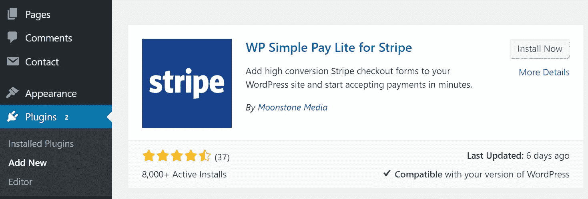

Install WP Simple Pay Lite plugin


### 第二步

你需要做的第一件事是点击进入插件的设置，并输入你的 [Stripe API 密钥](https://dashboard.stripe.com/account/apikeys)，你可以从你的 Stripe 帐户仪表板中获取。然后点击“保存更改”你会注意到有一个开关。在完成所有配置之前，您可以保持关闭状态。

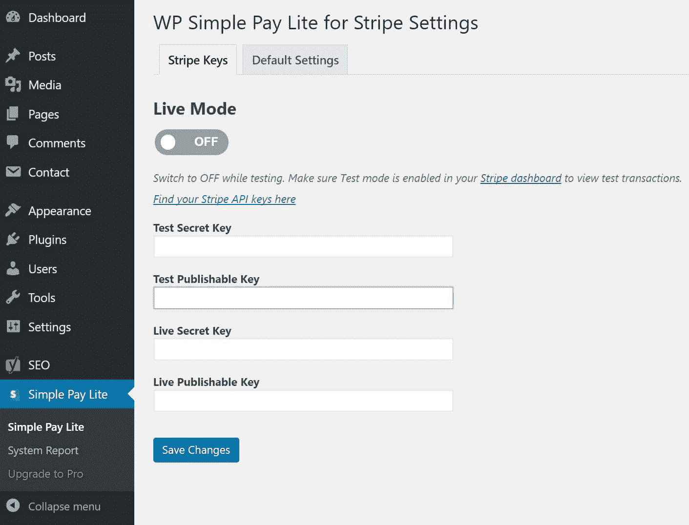

WP Simple Pay Lite API keys


### 第三步

点击进入“默认”设置选项卡。在那里你可以给你的网站命名，设置货币，提供图片等等。一个重要的设置是成功重定向 URL。如果你正在跟踪一个感谢页面的转换，那么你需要启用它。参见我们深入的[转换跟踪指南](https://kinsta.com/blog/conversion-tracking/)。然后向下滚动并点击“保存更改”

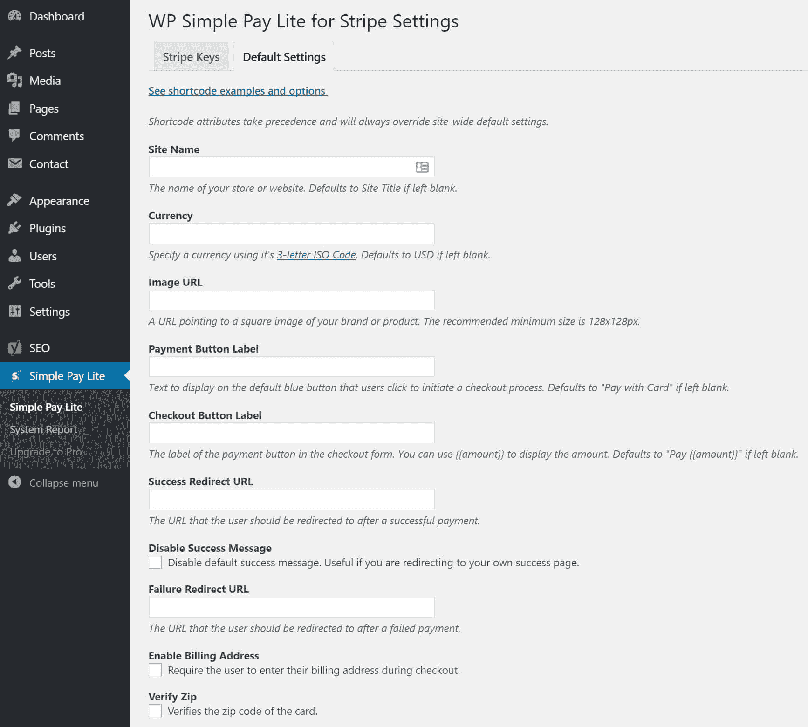

WP Simple Play Stripe settings


### 第四步

然后你可以用一个简单的短代码在你的 WordPress 站点的任何页面或帖子上插入一个支付按钮。请记住，您可以在插件设置中更改支付按钮的措辞。下面是一个可以粘贴到页面或帖子中的短代码示例:

```
[stripe name="My Store" description="My Product" amount="1999"]
```

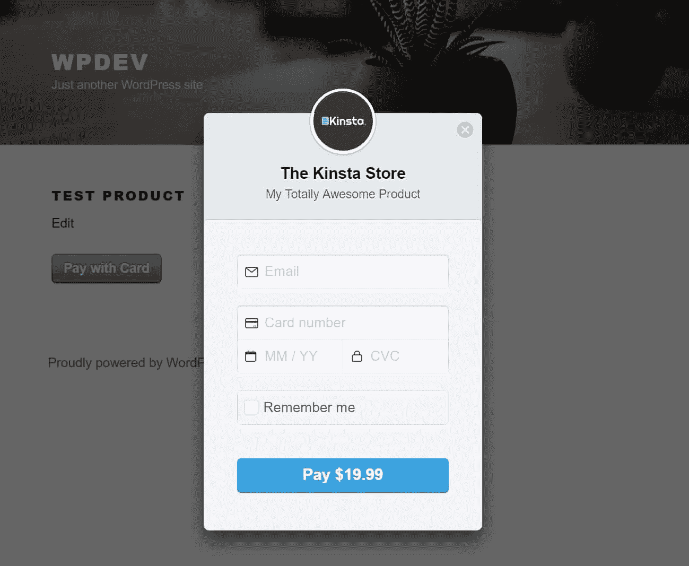

WP Simple Pay checkout


查看所有 WP 简单支付短码。就是这样！向你的 WordPress 站点添加 Stripe 再简单不过了。如果您还没有设置，请确保将实时模式切换到“开”。你也可以利用他们免费的[配套插件](https://wordpress.org/plugins/stripe-checkouts/)在你的 WordPress edito r 中增加一个按钮[来更容易地添加支付按钮。不需要抓取任何短码。](https://kinsta.com/blog/wordpress-text-editor/)

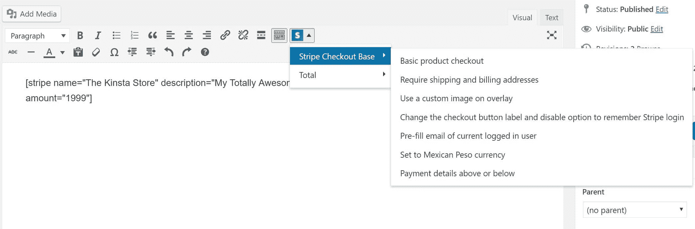

Stripe shortcode button


## 如何用重力形式设置条纹

使用 Stripe for WordPress 的第二个常见配置是将它与表单插件一起使用。你可能想这样做的原因是，它给你更多的灵活性，能够在结帐过程中**添加你自己的定制字段**。许多[流行的形态插件](https://kinsta.com/blog/wordpress-contact-form-plugins/)有简单的条纹集成和扩展，比如重力形态、忍者形态和 WP 形态。条带集成通常是一种额外的附加功能。在我们的例子中，我们将使用[重力形式插件](http://www.gravityforms.com/)。

### 步骤 1

下载并安装 [Gravity Forms 插件](http://www.gravityforms.com/)及其 Stripe 扩展插件。这确实需要开发者许可。

### 第二步

你需要做的第一件事是点击进入插件的设置，并输入你的 [Stripe API 密钥](https://dashboard.stripe.com/account/apikeys)，你可以从你的 Stripe 帐户仪表板中获取。然后点击“保存更改”你会注意到有一个现场和测试模式。您可以将它保持在测试模式，直到您正确地配置了所有的东西。

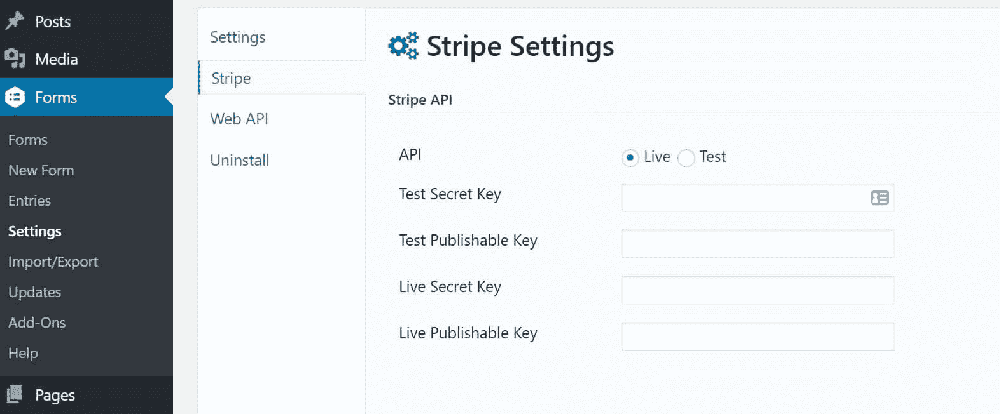

Gravity Forms Stripe settings


### 第三步

向下滚动，您将需要配置 Webhooks。Gravity Forms 要求将一个 URL 添加到您的 Stripe 帐户的 webhooks 列表中，以便一切正常运行。

*   点击以下链接并登录进入您的 Stripe Webhooks 管理页面:
    [https://dashboard.stripe.com/account/webhooks](https://dashboard.stripe.com/account/webhooks)
*   单击 Webhook URLs 列表上方的“添加端点”按钮。
*   在“URL”字段中输入以下 URL:`https://yourdomain.com/?callback=gravityformsstripe`
*   从“模式”下拉菜单中选择“实时”。
*   单击“创建端点”按钮。

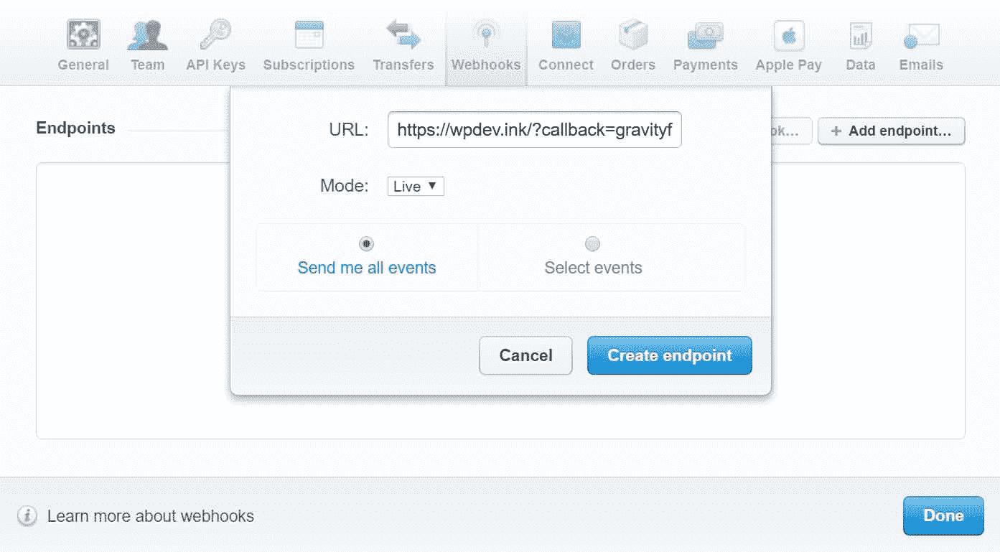

Stripe webhook for Gravity Forms


然后选中表示您已启用 webhook URL 的复选框，并单击“更新设置”

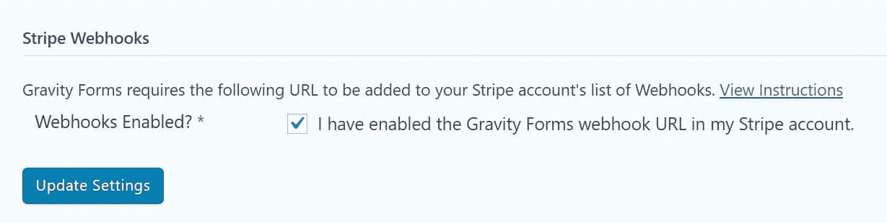

Update Stripe webhooks


### 第四步

现在是时候设置您的表单了。如果您还没有表单，您需要创建一个新的表单。

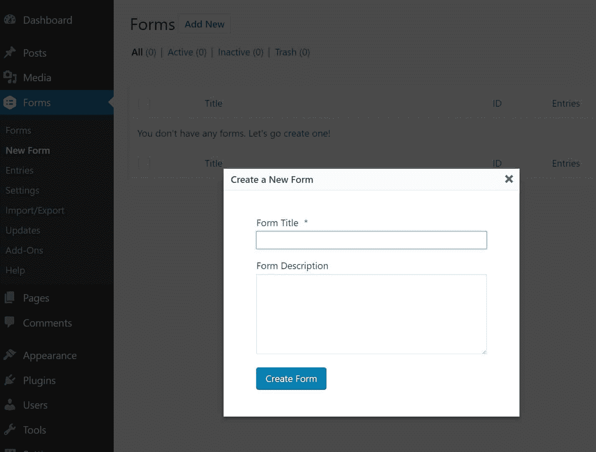

Create a new form in Gravity Forms


### 第五步

在表单中，您可以对其进行配置，以接受您想要的任何数据。您甚至可以为消息设置一个必填字段。正如你所看到的，这比我们上面介绍的简单付费插件提供了更多的定制。只要确保你有信用卡字段和价格。一切都是重力形式的拖放，所以创建它是快速和容易的。

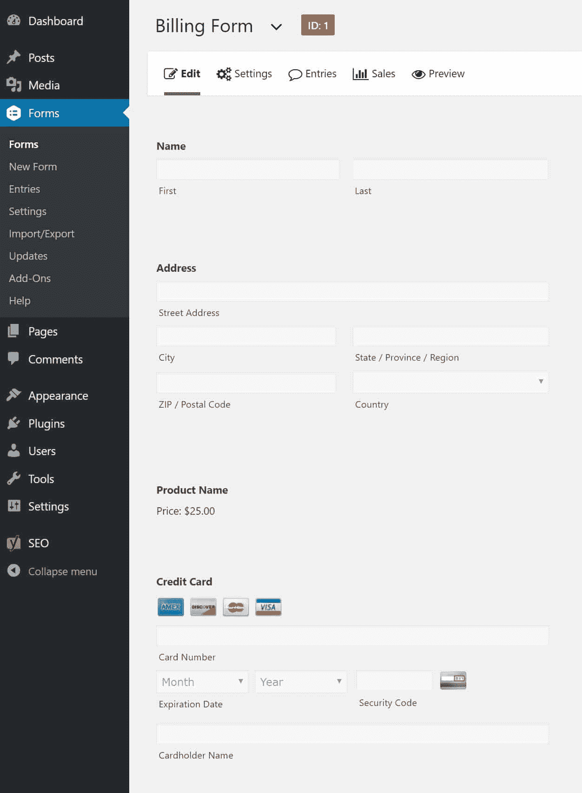

Billing Form


### 第六步

在你创建你的表单后，你需要用一个 feed 把它连接到 Stripe。点击表格本身的设置，进入“条纹”您可以设置交易类型和支付金额。然后点按“更新设置”

## 注册订阅时事通讯


### 想知道我们是怎么让流量增长超过 1000%的吗？

加入 20，000 多名获得我们每周时事通讯和内部消息的人的行列吧！

[Subscribe Now](#newsletter)

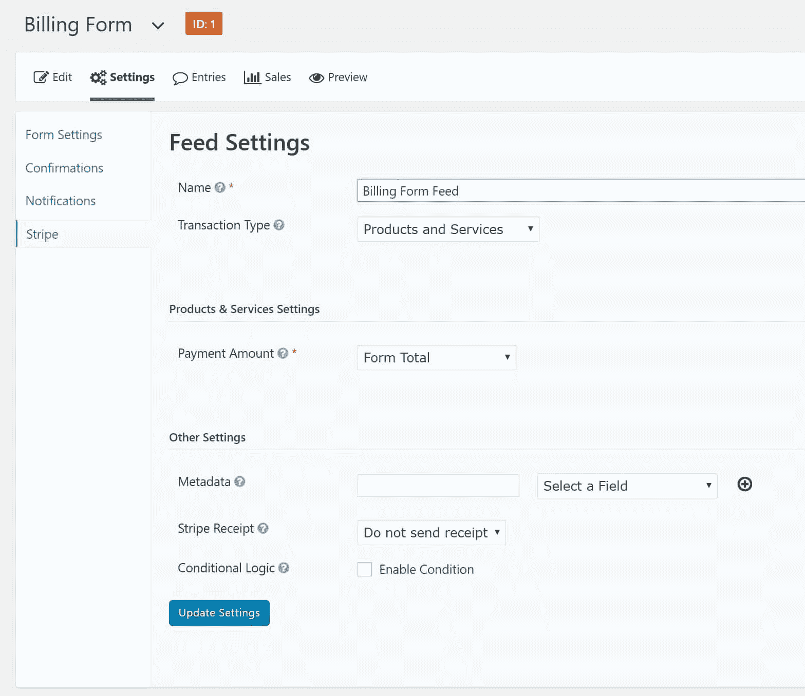

Billing form feed


### 第七步

然后，您可以将表单插入到页面或帖子中。在 WordPress 编辑器 Gravity Forms 中有一个叫做“添加表单”的按钮选择您创建的表单，然后单击“插入表单”

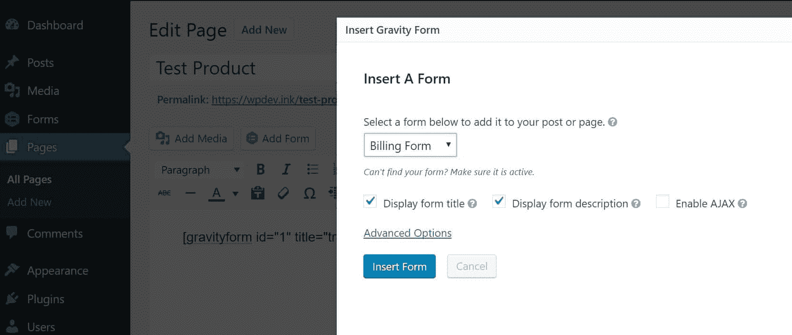

Insert form


仅此而已。您的表单现在是一个功能齐全的表单，与 Stripe 集成，能够捕获付款。

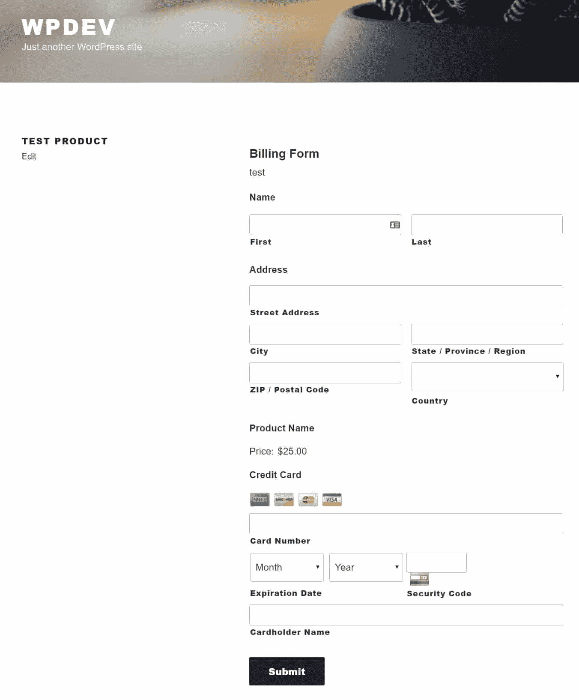

Credit Cards in Gravity Forms


## 如何在 WooCommerce 中设置条纹

使用 Stripe for WordPress 的第三种常见配置是与 WooCommerce 一起使用。WooCommerce 是 WordPress 最受欢迎的免费电子商务解决方案之一，拥有超过 300 万的活跃安装量，在 WordPress.org 获得 4.6 的用户评分。截至 2019 年 12 月， [WooCommerce 为超过 7%的在线商店提供服务](https://kinsta.com/wordpress-market-share/#woocommerce)。


好消息是，自 2016 年 2 月起， [Stripe 可免费与 WooCommerce 一起使用](https://wptavern.com/stripe-payment-gateway-for-woocommerce-is-now-available-for-free)！以前，你必须直接从 WooCommerce 购买 Stripe 支付网关，单个网站许可证的起价为 79 美元。这大大降低了任何想开网上商店并接受 Stripe 信用卡的人的门槛。下面的教程假设你已经安装并运行了 WooCommerce。如果你不知道，可以看看我们的[深度 WooCommerce 教程](https://kinsta.com/blog/woocommerce-tutorial/)。

### 第一步

你需要做的第一件事是安装免费的 [WooCommerce Stripe 支付网关](https://wordpress.org/plugins/woocommerce-gateway-stripe/)插件。它目前有超过 300，000 个活跃安装，五星评级为 4.7。

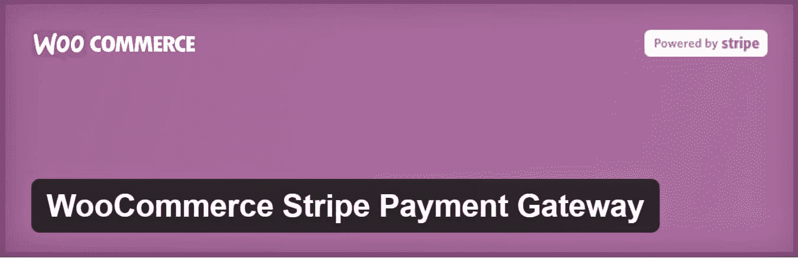

WooCommerce Stripe Payment Gateway plugin


你可以从 WordPress 知识库下载插件，或者在你的 WordPress 仪表盘的“添加新插件”下搜索插件。

### 第二步

然后点击仪表盘中的 WooCommerce 设置，点击“结帐”标签。您需要启用 Stripe 并输入您的 [Stripe API 密钥](https://dashboard.stripe.com/account/apikeys)，您可以从您的 Stripe 帐户控制面板中获取这些密钥。您还可以选择是否启用“条带检出”Stripe checkout 在结帐时显示支付按钮和模态信用卡表单，而不是传统的信用卡字段。然后向下滚动并点击“保存更改”

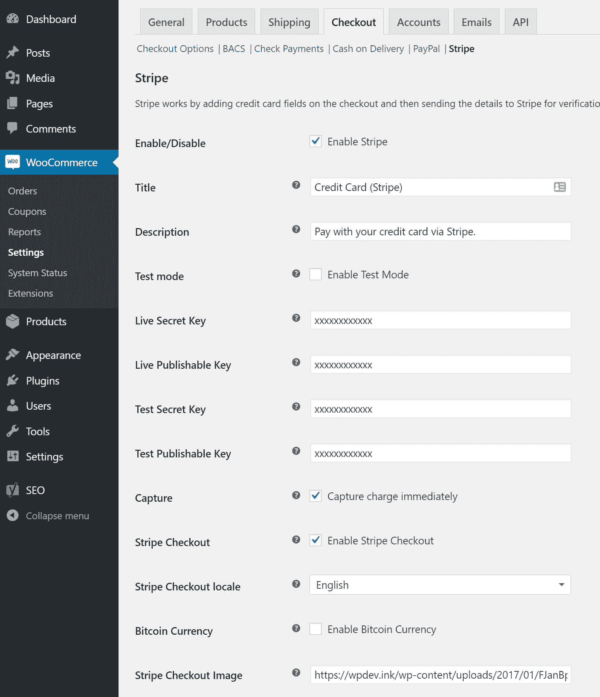

WooCommerce Stripe settings


### 第三步

然后在“结帐”标签下点击进入“结帐选项”您需要启用“强制安全结帐”记住 Stripe 要求 SSL 在你的 WordPress 站点上安全地接受信用卡。然后向下滚动并点击“保存更改”

Struggling with downtime and WordPress problems? Kinsta is the hosting solution designed to save you time! [Check out our features](https://kinsta.com/features/)

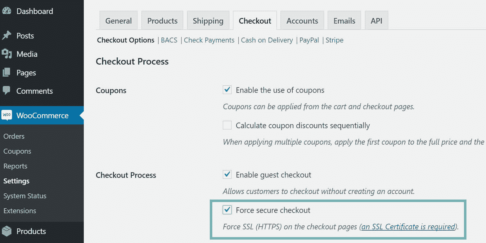

WooCommerce force secure checkout


仅此而已。您的结账页面现在应该可以接受带条纹的信用卡了。这里有几个例子。

**默认 WooCommerce 条纹结账**

这是一个 [WooCommerce checkout](https://kinsta.com/blog/woocommerce-checkout/) 页面上的默认条纹外观，页面上有内嵌的信用卡字段。

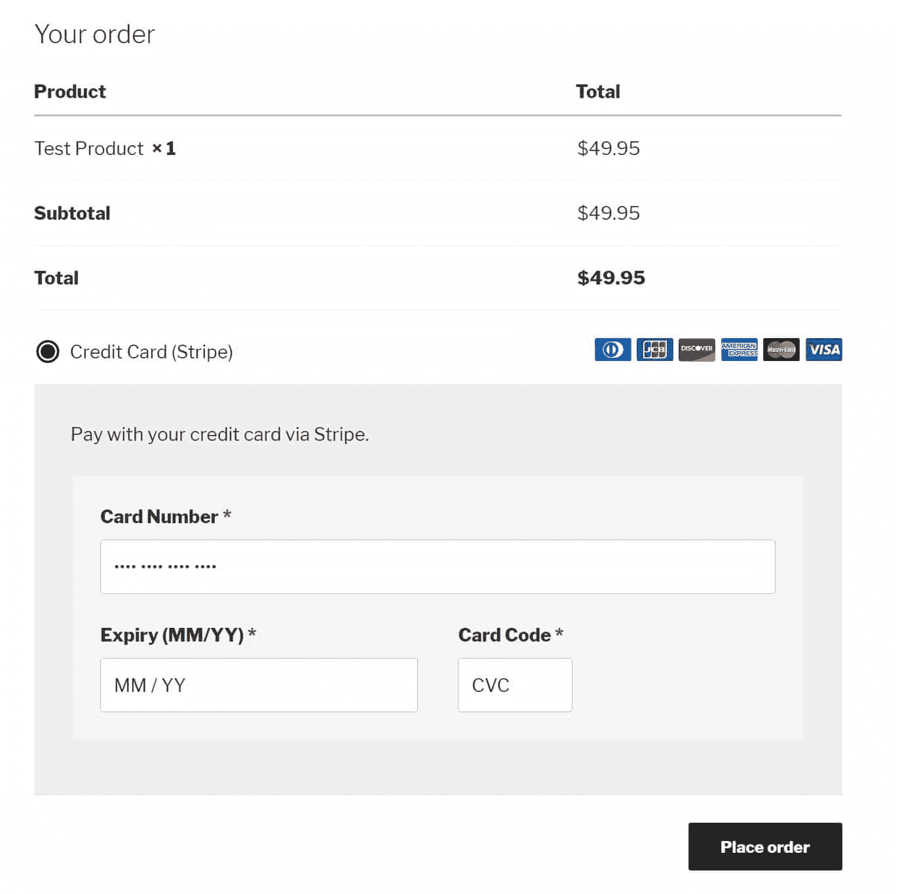

Credit Card checkout in WooCommerce


**启用条纹结账选项的 WooCommerce】**

如果您在设置中启用了“条纹检出”选项，这就是外观。顾客点击“继续付款”,他们会得到条纹模型。

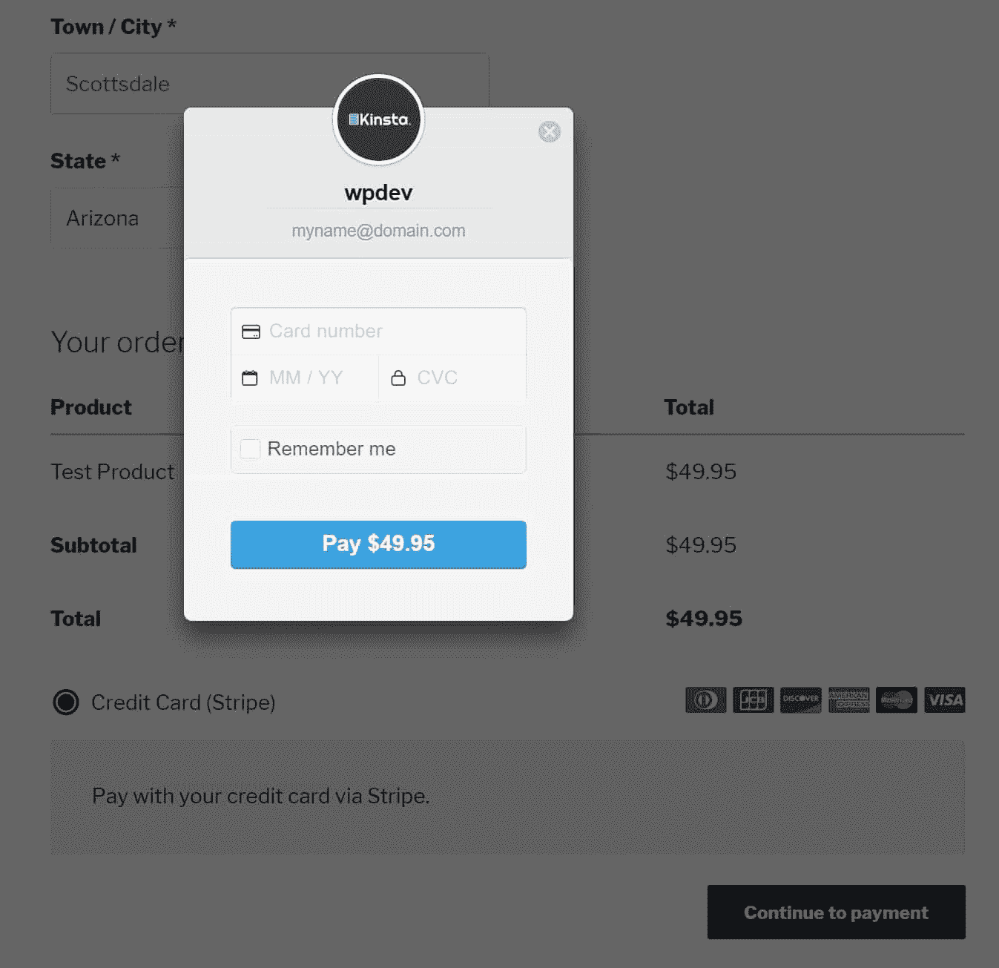

Stripe checkout in WooCommerce


## 如何在简易数字下载中设置条纹

使用 Stripe for WordPress 的第四个常见配置是与 [Easy Digital Downloads](https://easydigitaldownloads.com/) 一起使用。就像 WooCommerce 一样， [Easy Digital Downloads](https://kinsta.com/blog/easy-digital-downloads/) 是 WordPress 的一个流行的免费电子商务解决方案。它主要用于销售数字产品，但是也有一个扩展来适应实体产品。现在它真的变成了 WooCommerce 的替代品。它目前有超过 50，000 个活跃安装，五星评级中有 4.8 个。下面的教程假设你已经安装并运行了 EDD。如果你不知道，请查看[简易数字下载文档](http://docs.easydigitaldownloads.com/article/192-how-do-i-install-an-extension)。


容易数字下载条纹集成的一个缺点是，它确实需要高级扩展，单个站点许可证的起价为 89 美元。然而，如果你喜欢 EDD，想用条纹，这可能是值得的。

### 第一步

下载、安装并激活[条形支付网关扩展](https://easydigitaldownloads.com/downloads/stripe-gateway/)。

### 第二步

在下载(这是 EDD)，点击进入设置，然后进入支付网关 gab。在网关设置中，您需要选中条带以启用它。然后将默认网关更改为 Stripe。然后，您还可以选择在结账时显示信用卡图标。然后点击“保存更改”

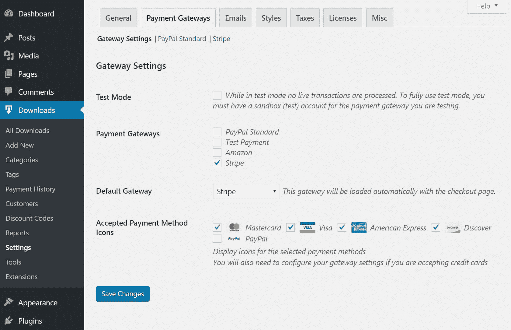

EDD Stripe payment gateway settings


### 第三步

在支付网关选项卡下，单击“Stripe”您将需要输入您的 [Stripe API 密钥](https://dashboard.stripe.com/account/apikeys)，您可以从您的 Stripe 帐户仪表板中获取这些密钥。您还需要配置 Webhooks。

*   点击以下链接并登录进入您的 Stripe Webhooks 管理页面:
    [https://dashboard.stripe.com/account/webhooks](https://dashboard.stripe.com/account/webhooks)
*   单击 Webhook URLs 列表上方的“添加端点”按钮。
*   在“URL”字段中输入以下 URL:https://yourdomain.com/index.php?edd-listener=stripe
*   从“模式”下拉菜单中选择“实时”。
*   单击“创建端点”按钮。

您可以设置一些附加选项。您可以选择是否启用“条带检出”Stripe checkout 在结帐时显示支付按钮和模态信用卡表单，而不是传统的信用卡字段。然后向下滚动并点击“保存更改”

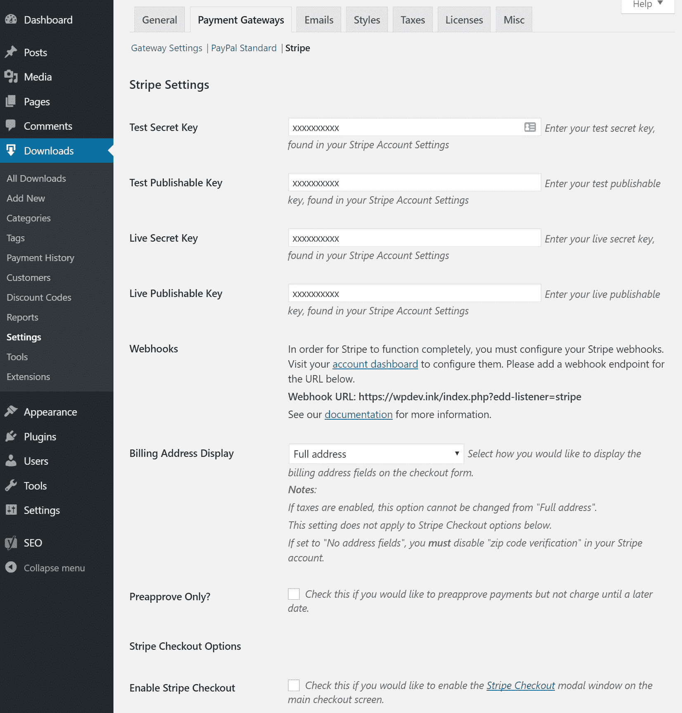

Stripe settings in EDD


仅此而已。您的结账页面现在应该可以接受带条纹的信用卡了。这里有几个例子。

**默认 EDD 条纹结账**

这是 EDD 结帐页面上条纹的默认外观，信用卡字段内嵌在页面上。

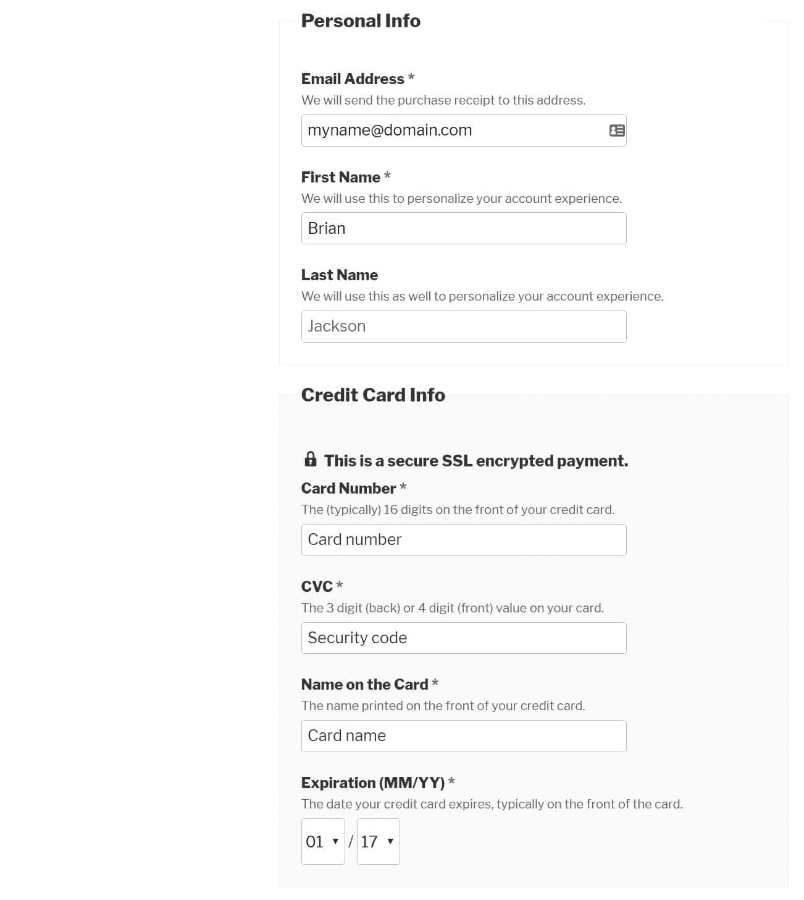

Stripe credit card checkout in EDD


**启用条带检验选项，轻松下载数字内容**

如果您在设置中启用了“条纹检出”选项，这就是外观。顾客点击“继续付款”,他们会得到条纹模型。


Stripe checkout in EDD


## 摘要

正如你所看到的，为 WordPress 设置并运行 Stripe 是相当简单的。事实上，以上所有四个集成只需要几分钟。这比几年前容易多了。它也变得越来越便宜，因为许多解决方案现在是免费的。别忘了，你还可以使用 Stripe 接受捐赠。

你的经历是什么？你在你的 WordPress 网站上使用 Stripe 吗？

* * *

让你所有的[应用程序](https://kinsta.com/application-hosting/)、[数据库](https://kinsta.com/database-hosting/)和 [WordPress 网站](https://kinsta.com/wordpress-hosting/)在线并在一个屋檐下。我们功能丰富的高性能云平台包括:

*   在 MyKinsta 仪表盘中轻松设置和管理
*   24/7 专家支持
*   最好的谷歌云平台硬件和网络，由 Kubernetes 提供最大的可扩展性
*   面向速度和安全性的企业级 Cloudflare 集成
*   全球受众覆盖全球多达 35 个数据中心和 275 多个 pop

在第一个月使用托管的[应用程序或托管](https://kinsta.com/application-hosting/)的[数据库，您可以享受 20 美元的优惠，亲自测试一下。探索我们的](https://kinsta.com/database-hosting/)[计划](https://kinsta.com/plans/)或[与销售人员交谈](https://kinsta.com/contact-us/)以找到最适合您的方式。