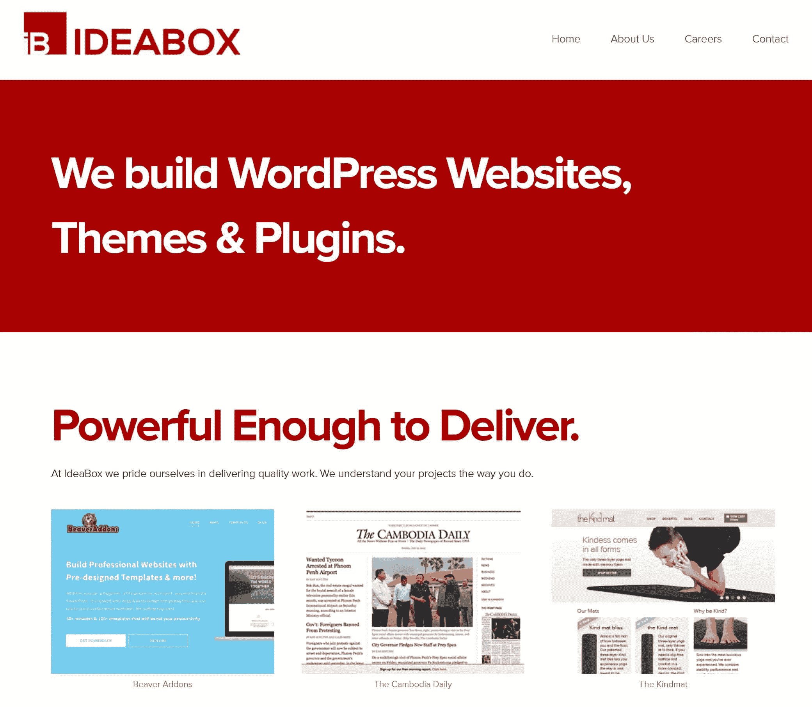
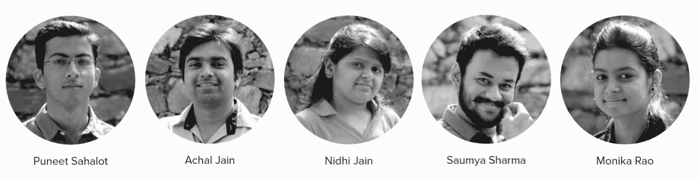
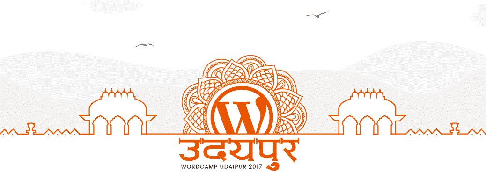

# 金斯塔·金并:普内特·萨哈洛特访谈

> 原文：<https://kinsta.com/blog/interview-with-puneet-sahalot/>

你可以在 LinkedIn 或者 T2 的 Twitter 上找到 Puneet。这是我们最近对他的采访，作为我们[金斯塔·金并](https://kinsta.com/search/kingpin/)系列的一部分。

Q1:你的背景是什么，&你最初是如何加入 WordPress 的？

我五年级的时候(2000 年)就开始和网络项目争论，当时互联网在印度还是一件大事。我在八年级开始写 C/C++程序，从那以后，我对编程的热爱不断增长。毕业后，我完成了电子与通信工程的毕业。

在大学期间，我遇到了一位来自我所在城市的专业博主，并开始为他的博客投稿。那是我第一次接触 WordPress。看到我的经验和对编程的兴趣，我的博客伙伴要求我为博客定制他的 WP 主题，这就是一切的开始。

Q2:读者应该了解你的公司 IdeaBox 的哪些方面，&什么样的客户是合适的？

IdeaBox 始于 2012 年的独角戏，现在我们是一个 7 人团队，包括开发人员、设计师、内容作者和质量分析师。我们喜欢在各种中小型 WordPress 网站、自定义插件和主题上工作。

我们已经为领先的机构和设计师做了很多白标工作，我们喜欢这样做！最近，我们推出了我们的第一个高级 WordPress 插件——power pack Beaver Builder 插件([https://wpbeaveraddons.com/](https://wpbeaveraddons.com/))，现在正在探索产品开发的更多机会。

进入产品开发是我们的目标，因为我们总是忙于客户项目，所以很难探索其他的可能性。让这两者同时进行是一项具有挑战性的任务。但是，我们决定在接下来的几个月里继续着手新项目，开发我们的产品并发布。在 6 个月的时间里，我们的 PowerPack 插件已经拥有了超过 2000 名用户。

这是一个很棒的体验，可以建立一个在数千个网站上运行的产品，它改变了人们建立网站的方式，以及我们最终接收新想法和建议的方式。与客户的项目合作是一种完全不同的体验，这是一次性的展示，它已经完成并交付。一个产品就像一个婴儿。我们总是高兴地看到它在成长。

除此之外，我们相信以各种方式回馈 WordPress 社区，包括主题回顾、核心贡献和翻译。

**Q3:在建立 it 的过程中，你遇到了哪些挑战？**

我们位于印度一个美丽的二线小城市(乌代布尔)，所以我们最大的挑战是为我们的团队找到合适的人。我们花了一些时间来整合，现在我可以说我们状态很好。我们是一个小的，有技术的，快乐的团队。

印度是最大的外包市场之一，我们不想被认为只是另一个外包机构，以低廉的价格工作，提供不合标准的工作。这是我在自由职业生涯中关注的事情，在 IdeaBox 中也是如此。

## 注册订阅时事通讯

### 想知道我们是怎么让流量增长超过 1000%的吗？

加入 20，000 多名获得我们每周时事通讯和内部消息的人的行列吧！

[Subscribe Now](#newsletter)

从第一天起，我们就把质量放在首位。除非他们的编码标准达标，否则我们的团队成员不会开始为客户的项目工作。这一开始会让事情慢下来，但是从长远来看是有好处的。

**Q4:在成长的过程中有没有什么让你惊喜的事情？**

在创办 IdeaBox 之前，我是一名自由职业者，没有团队合作的经验。这一切都是在没有任何合伙关系和自我投资 1000 美元的情况下开始的。我不知道几年内我们的收入会突破 10 万美元大关。我们仍然是一个只有七个人的团队。

找到我的第一个团队成员让我松了一口气，因为要找到想在一家刚刚起步的公司工作的人并不容易。随着我们团队的成长，我惊讶于我们解决问题是如此容易，团队合作是如何提高我们的生产力和收入的。适应管理一个团队需要一段时间，但这是一次美妙的经历。

最棒的经历之一是与柬埔寨领先的、历史最悠久的全国性日报([cambodiadaily.com](http://cambodiadaily.com/))一起工作。我们用新的会员功能重建了他们的网站，以增加他们的收入。

问题 IdeaBox 的未来是什么样的？

我们期待在 2017 年涉足产品开发，并扩大我们的服务业务。我们还计划今年引进更多的团队成员。

问 6:你在托管的 WordPress 主机中寻找什么？

更新、安全、速度、备份、暂存环境和专家支持是我在一个受管理的 WordPress 主机提供商中最起码的要求。我喜欢 Kinsta 的一点是，它总是运行在[最新的基础设施和技术](https://kinsta.com/features/)上。

你所在地区的 WordPress 社区&市场怎么样？

我们有几家网络公司在网站上使用 WordPress，这个社区正在成长。我们将于 2017 年 1 月 28 日组织我们的第一次世界语言营([https://2017.udaipur.wordcamp.org](https://2017.udaipur.wordcamp.org))。

[T2】](https://2017.udaipur.wordcamp.org/)

问题 8:当你离开笔记本电脑时，你喜欢做什么？

我喜欢和家人朋友在一起。我有一个妹妹、一个侄子和一个侄女，让我在网络世界之外忙个不停。假期和一群朋友在湖边闲逛和旅行是我非科技生活的一部分。:)

* * *

让你所有的[应用程序](https://kinsta.com/application-hosting/)、[数据库](https://kinsta.com/database-hosting/)和 [WordPress 网站](https://kinsta.com/wordpress-hosting/)在线并在一个屋檐下。我们功能丰富的高性能云平台包括:

*   在 MyKinsta 仪表盘中轻松设置和管理
*   24/7 专家支持
*   最好的谷歌云平台硬件和网络，由 Kubernetes 提供最大的可扩展性
*   面向速度和安全性的企业级 Cloudflare 集成
*   全球受众覆盖全球多达 35 个数据中心和 275 多个 pop

在第一个月使用托管的[应用程序或托管](https://kinsta.com/application-hosting/)的[数据库，您可以享受 20 美元的优惠，亲自测试一下。探索我们的](https://kinsta.com/database-hosting/)[计划](https://kinsta.com/plans/)或[与销售人员交谈](https://kinsta.com/contact-us/)以找到最适合您的方式。