# WordPress 终极转换跟踪指南

> 原文：<https://kinsta.com/blog/conversion-tracking/>

我们总是被问到这个问题，那就是“我如何为我的 WordPress 站点设置转换跟踪？”当谈到运行一个成功的 WordPress 站点时，你需要确保的第一件事就是你的**站点加载得很快**。第二，你应该**跟踪每一个发生的行为的转化**。从时事通讯注册，到联系表单提交，当然还有产品和/或服务的销售。毕竟，如果你不追踪转化率，你怎么知道什么是有效的，什么是无效的？你可能会把精力集中在完全错误的营销渠道上。

今天我们将与你分享如何在你的 WordPress 网站上设置转换跟踪，以及 WooCommerce 和 Easy Digital Downloads 电子商务解决方案。

[Without conversion tracking there is no way to make data-driven decisions. 💰Click to Tweet](https://twitter.com/intent/tweet?url=https%3A%2F%2Fkinsta.com%2Fblog%2Fconversion-tracking%2F&via=kinsta&text=Without+conversion+tracking+there+is+no+way+to+make+data-driven+decisions.+%F0%9F%92%B0&hashtags=CRO%2Cmarketing)

## 为什么转换跟踪很重要？

转换跟踪，或者说媒体表现的测量，对于任何类型的网站都是至关重要的，从电子商务网站到联盟营销博客。没有转化跟踪，就无法做出数据驱动的决策。下面是一些额外的原因和例子，说明为什么转换跟踪很重要:


*   **立即知道什么有用，什么没用:**无论是登录页面还是脸书上的广告，通过跟踪转化率，你可以看到什么在转化，什么没有，并做出相应的改变。
*   **提高投资回报率:**也许一个广告有超高的点击率，但却没有产生任何转化。通过根据转化数据优化或暂停广告，您可以在提高投资回报率的同时降低成本。
*   **A/B 测试:**转换跟踪允许你为你的企业设置实验和尝试不同类型的广告活动，例如那些专注于点击、转换、品牌知名度和销售线索的广告活动。A/B 测试即使是登陆页面和你的网站上最小的东西，比如绿色按钮和红色按钮，也会影响你的[转化率](https://kinsta.com/blog/conversion-rate-optimization-tips/)。

> **不跟踪转化率就像驾驶一辆不知道目的地的汽车**。你只是白白地用汽油。如果我们希望我们的投资有价值，跟踪应该是我们策略的一部分。只有当我们知道什么适合我们的客户时，我们才知道如何更有意义地接触他们。——Divine Riza RDO， [WordStream 博客](http://www.wordstream.com/blog/ws/2014/02/13/tracking-conversions-in-adwords)的评论者

## 转换跟踪指南

大多数第三方网络的转换跟踪涉及到实现您可能听说过的所谓的**跟踪像素**。这通常需要使用 1×1 像素的透明 GIF。这只是第三方提供的一段代码，你必须把它放到你的 WordPress 站点上。这反过来允许您跟踪访问、网页上的事件、广告展示和您配置的特定转换操作。


> 需要在这里大声喊出来。Kinsta 太神奇了，我用它做我的个人网站。支持是迅速和杰出的，他们的服务器是 WordPress 最快的。
> 
> <footer class="wp-block-kinsta-client-quote__footer">
> 
> 
> 
> <cite class="wp-block-kinsta-client-quote__cite">Phillip Stemann</cite></footer>

[View plans](https://kinsta.com/plans/)


在本指南中，我们将介绍谷歌分析目标、脸书转化跟踪像素、Twitter 转化跟踪像素和谷歌广告词。跟踪代码可以使用类似于 [Google Tag Manager](https://marketingplatform.google.com/about/tag-manager/) 的工具添加到您的网站，或者手动添加。[谷歌分析](https://kinsta.com/blog/how-to-use-google-analytics/)也可以使用[谷歌分析 WordPress](https://kinsta.com/blog/google-analytics-wordpress/) 插件来设置。不可能涵盖所有的场景，但是读完这个指南后，你应该对如何在你的 WordPress 站点上实现转换跟踪有了更好的理解。单击下面的链接，向下跳转到该部分。

*   **谷歌分析目标** ( [跳转到章节](#google-analytics-goals) )
    *   [创建转换页面](#create-conversion-page)
    *   [创建一个谷歌分析目标](#create-google-analytics-goals)
*   **脸书在 WordPress** 中的转换跟踪([跳转到](#fb-conversion-tracking)章节)
    *   [创建一个脸书像素](#fb-conversion-tracking-pixel)
    *   [在 WordPress 中设置脸书像素](#fb-conversion-tracking-wordpress)
    *   [在 WooCommerce 中设置脸书像素](#fb-conversion-tracking-woocommerce)
    *   [在简易数码下载中设置脸书像素](#fb-conversion-tracking-edd)
*   **WordPress**中的 Twitter 转换跟踪([跳转到](#twitter-conversion-tracking)部分)
    *   [创建一个 Twitter 像素](#twitter-conversion-tracking-pixel)
    *   [在 WordPress 中设置 Twitter Pixel](#twitter-conversion-tracking-wordpress)
    *   [在 WooCommerce 中设置 Twitter Pixel](#twitter-conversion-tracking-woocommerce)
    *   [在简易数字下载中设置 Twitter Pixel](#twitter-conversion-tracking-edd)
*   **Google AdWords 在 WordPress** 中的转换跟踪([跳转到](#adwords-conversion-tracking)章节)
    *   [如何在 WordPress 中设置 Google AdWords 转换跟踪](#adwords-analytics-goal)
    *   [如何在 WooCommerce 中设置 Google AdWords 转换跟踪](#adwords-conversion-code-woocommerce)
    *   [如何在轻松数字下载中设置 Google AdWords 转换跟踪](#adwords-conversion-code-edd)
*   **跟踪同一活动中的不同广告** ( [跳转到](#track-different-ads) )
    *   [选项 1–链接 AdWords 和 Google Analytics](#link-adwords-analytics)
    *   [使用 UTM 参数](#utm-parameters)

## 谷歌分析的目标

当谈到转换跟踪时，最好从基础开始，这就是如何在 Google Analytics 中创建[目标，并将它们绑定到你的 WordPress 网站上的行动中。稍后，您将需要了解目标如何适用于一些额外的转换跟踪设置。](https://support.google.com/analytics/answer/1012040?hl=en)

> 目标衡量你的网站或应用程序实现你的目标的程度。一个目标代表一个完成的活动，称为转化，有助于你的业务成功。目标的示例包括购买(对于电子商务网站)、完成游戏关卡(对于移动游戏应用程序)或提交联系信息表单(对于营销或销售线索生成网站)。

### 创建转换页面

有很多不同的方法来跟踪转换，但最常见的一种是跟踪联系表单提交。这可以让你知道每周有多少线索，以及哪些广告正在产生这些线索。最简单的方法是使用“感谢”页面。您可以为此页面创建目标，稍后，我们甚至会针对此页面为脸书广告创建自定义活动。

**第一步**

你需要做的第一件事是在 WordPress 中创建一个“感谢”页面。在你的 WordPress 仪表盘的页面下点击“添加新的”并创建一个“感谢”页面。你想怎么命名都行。但请记住，这是人们在填写联系表格后看到的内容。确保永久链接(URL)是**domain.com/thank-you/**，因为我们稍后会用到它。

然后在页面描述中填写你想让他们看到的内容。在我们的示例中，您可以看到我们只是让他们知道我们将很快保持联系。然后在准备好之后发布页面。

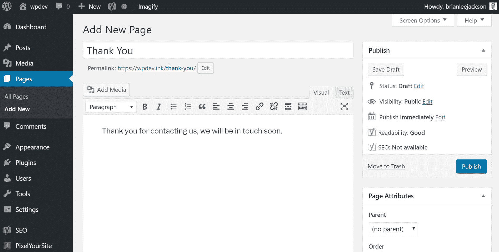

Create thank you conversion page


**第二步**

接下来，我们需要在有人填写后，将您的联系表重定向到您的感谢页面。您可以在流行的联系人表单插件的设置中实现这一点。我们在下面列出了几个配置示例。您也可以使用 JavaScript action hooks 而不使用重定向来实现这一点，但是对于那些刚刚开始使用转换跟踪的人来说，重定向工作得很好，并且设置起来很简单。

**联系方式 7**

在之前的[联系表 7](https://kinsta.com/blog/contact-form-7/) 中，`on_sent_ok`指令用于将用户重定向到不同的页面。但是，现在不赞成这样做。但是不要担心，您仍然可以在您的站点中添加一点 JavaScript 来实现这一点。我们建议安装免费的[代码片段插件](https://wordpress.org/plugins/code-snippets/)。然后简单地使用下面的代码，用你自己的页面替换 https://wpdev.ink/thank-you/。

```
 add_action( 'wp_footer', function () { ?>
<script>
document.addEventListener('wpcf7mailsent', function( event ) {
    location = 'https://wpdev.ink/thank-you/';
}, false );
</script>  
<?php } ); 
```

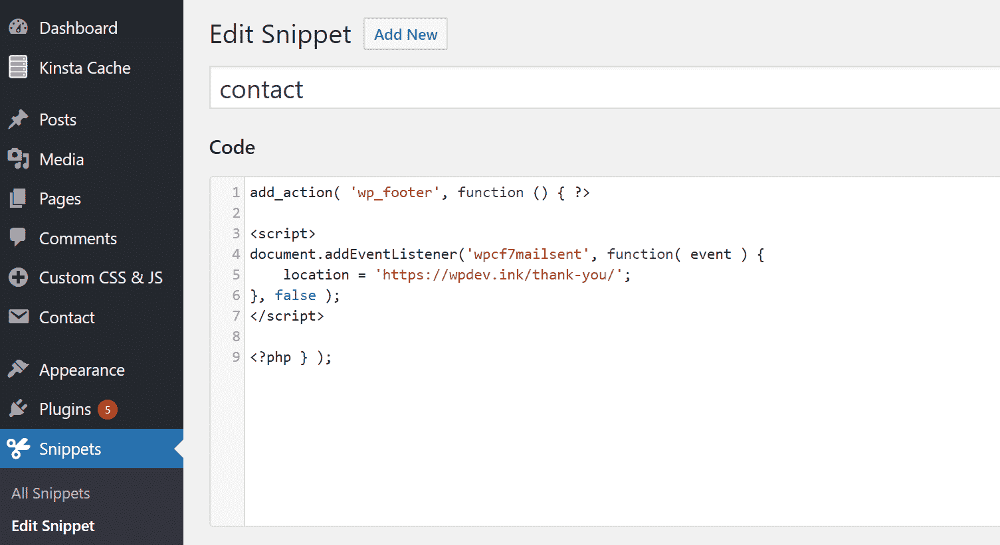

Contact Form 7 redirect function


**重力形式**

要在 Gravity Forms 插件中添加一个重定向，点击你的表单上的“编辑”,然后点击“确认”标签。然后，您可以选择“重定向”作为一个选项，并输入您的网址。

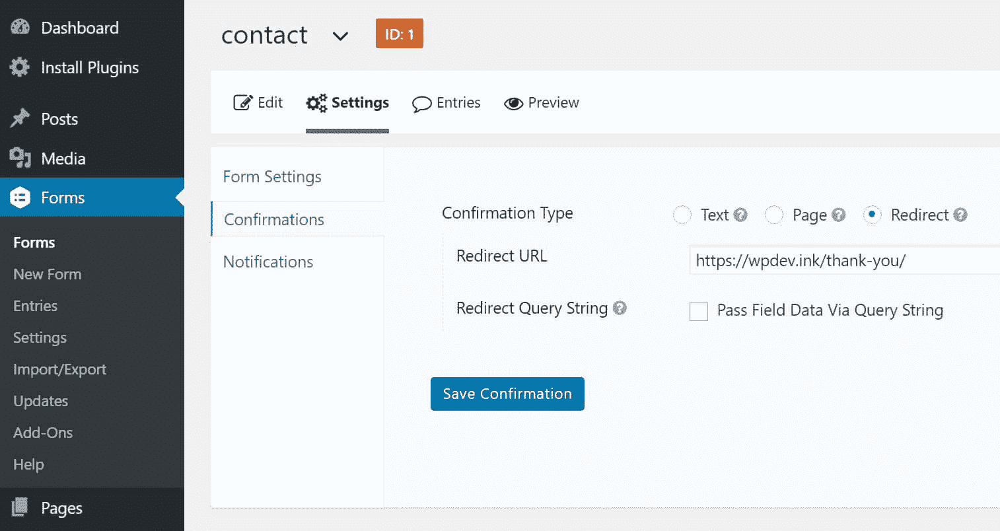

Gravity Forms redirect


现在你应该有一个感谢页面和一个重定向到它的联系表单。您可以继续创建目标和自定义转换事件。

### 创建一个谷歌分析目标

接下来，我们将创建一个基本目标，在我们上面创建的感谢页面上跟踪转化。我们将假设你已经安装了谷歌分析，并在你的网站上运行。如果没有，你可以看看这个简单的指南[如何实现谷歌分析](https://kinsta.com/blog/google-analytics-wordpress/)，然后继续下面的步骤。

**第一步**

在谷歌分析中，点击“管理”进入你的视图。点击“目标”并点击“新目标”

You will need “Edit” access at the “Account” level in Google Analytics in order to set up new goals, or you won’t have the ability to follow through on these next steps.

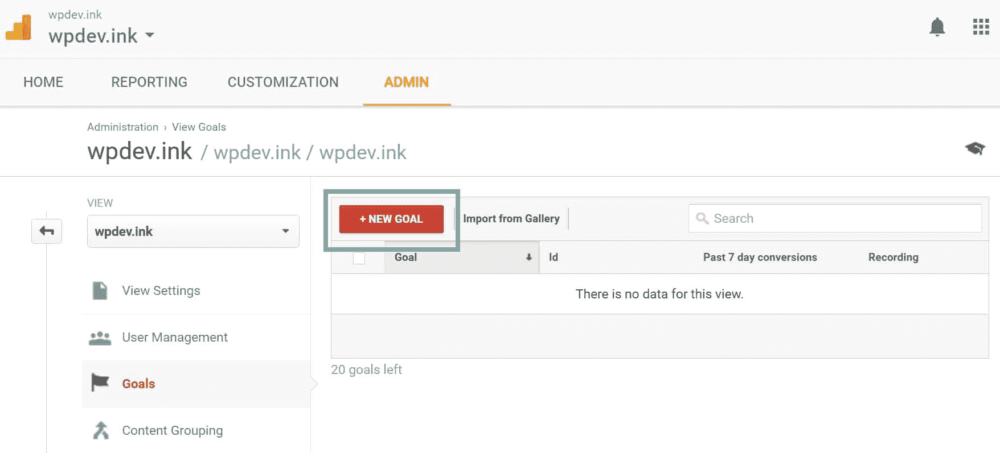

New Goal in Google Analytics


**第二步**

在本例中，我们只需选择“联系我们”，因为我们希望跟踪联系表单的提交，然后点击 continue。这些参数都可以在以后更改。

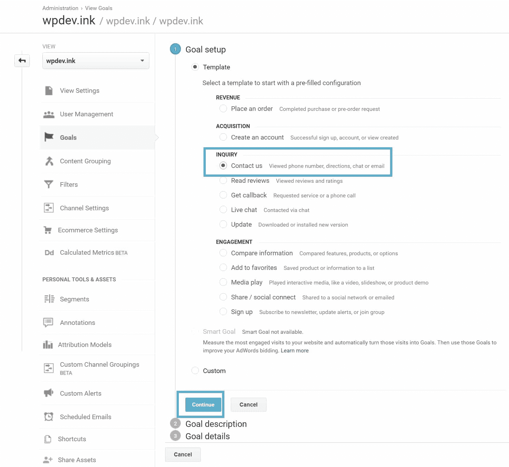

Create contact us goal


**第三步**

你可以给你的目标一个名字。这就是将在目标页面上显示的内容，所以要给它起一个容易识别的名字，尤其是当你在处理多个目标的时候。选择“目的地”并点按“继续”。

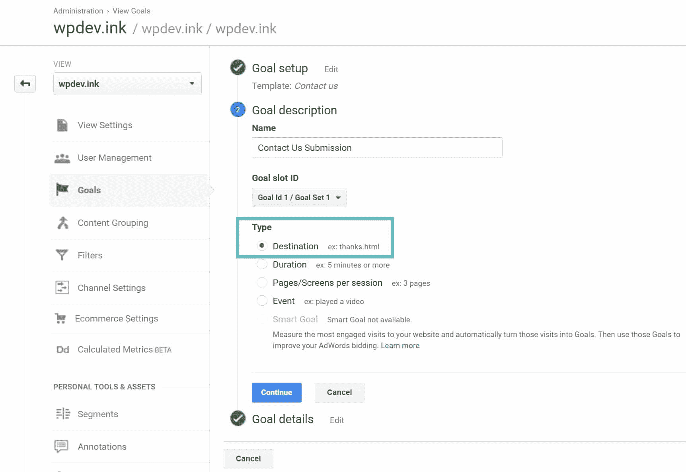

Google Analytics goal destination


**第四步**

在我们的例子中，我们使用了之前创建的感谢页面/thank-you/并在联系人表单插件中使用了重定向。这样，任何点击此页面的人都将在谷歌分析中注册为转换(线索)。您也可以选择为您的转换指定一个货币值。也许每条线索对你来说值 15 美元。然后单击保存。

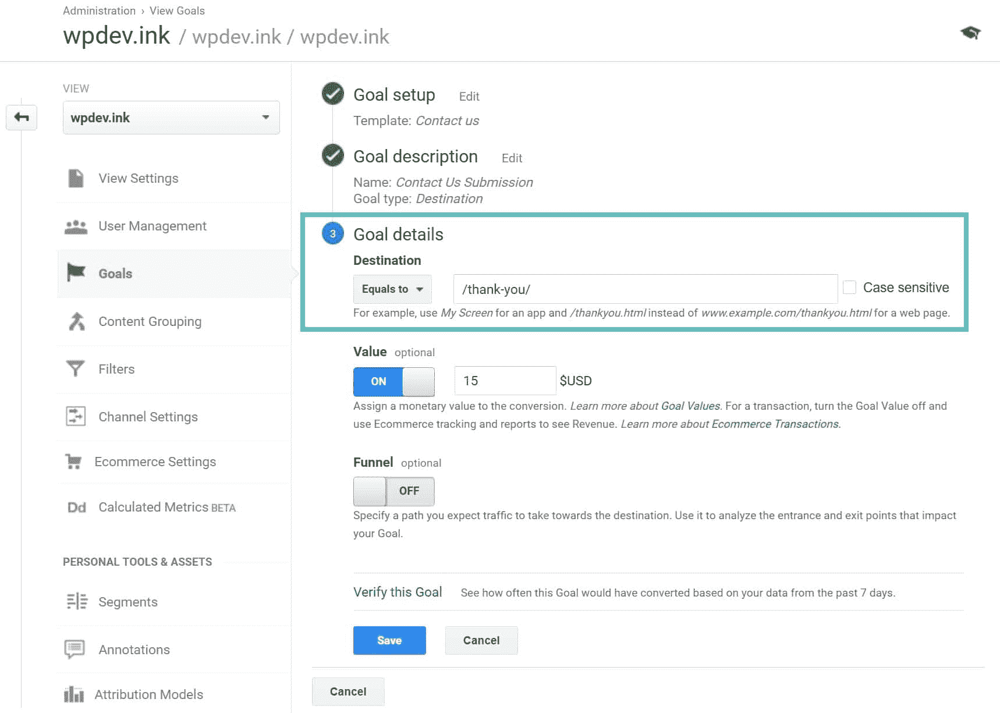

Goal details


提示:在 WordPress 中使用感谢页面时，确保它被你的 SEO 插件标记为 [no-index](https://kb.yoast.com/kb/how-do-i-noindex-urls/) ，这样谷歌就看不到它了。你不希望任何人点击那个页面，除非他们填写了一张表格。你可以进入“转换>目标>概述”在谷歌分析中查看目标您的目标名称以及完成的次数将会显示出来(如果您设置了目标转换值，还会显示目标转换值)。

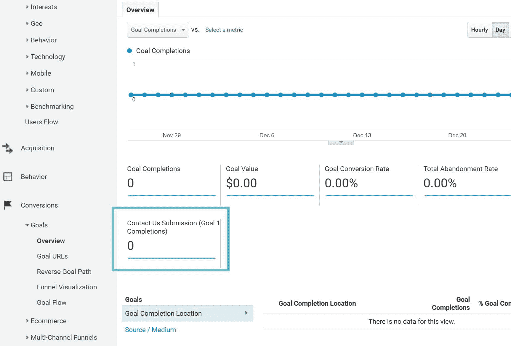

Completed Google Analytics goals


这可能是在 WordPress 网站上追踪线索最常见的方式之一。然而，这只能让你看到总的转换数量和他们来自哪个交通媒体。我们可以看到脸书付费流量正在转换，但不是具体的广告(除非你在每个广告上使用自定义 UTM 参数)。接下来，我们将深入探讨与第三方广告商打交道的跟踪和转换像素。这使您可以准确地看到哪些广告正在转化，因此您可以在营销活动中做出更好的数据驱动型决策。

## WordPress 中的脸书转换跟踪

许多企业和营销人员在脸书上做广告，因为它有大量的观众。据 [Statista](https://www.statista.com/statistics/264810/number-of-monthly-active-facebook-users-worldwide/) 统计，截至 2018 年第三季度，脸书拥有 22.7 亿月活跃用户。

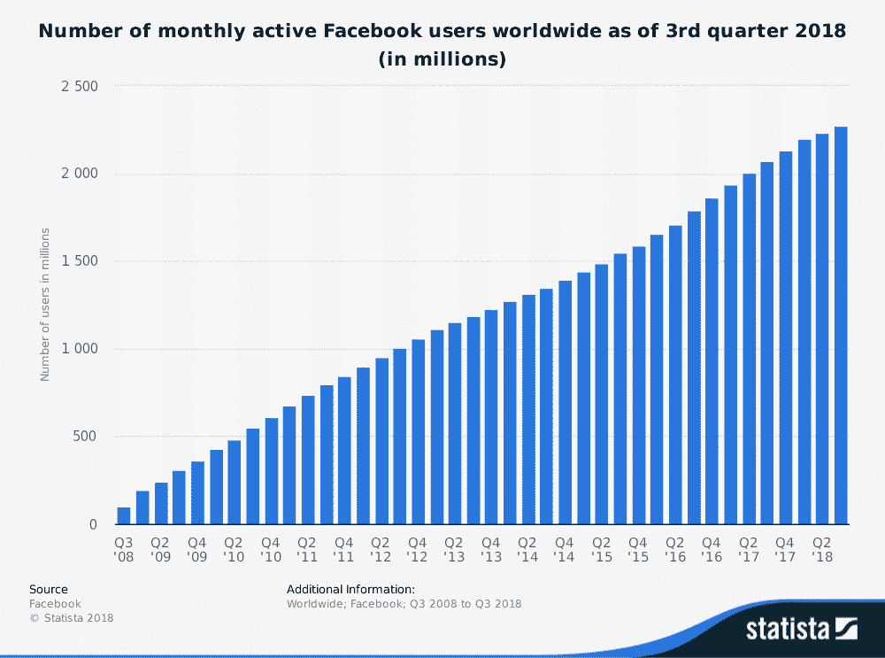

Facebook monthly active users


WordPress 中的脸书转换跟踪基本上是一个四步的过程:

*   创建脸书像素
*   将像素添加到你的 WordPress 站点
*   将像素贴在你在脸书制作的广告上
*   在脸书广告管理器中衡量转化率

下面我们将探讨如何创建脸书像素，如何将它安装在你的 WordPress 网站上，并将其应用到电子商务解决方案中，如 WooCommerce 和 Easy Digital Downloads。

推荐阅读:[如何提高你的 WooCommerce 产品页面的转化率](https://kinsta.com/blog/conversions-woocommerce-product-pages/)

### 创建脸书像素

脸书曾经有一个转换跟踪像素和一个单独的自定义观众像素。这让营销人员非常困惑，增加了网站不必要的加载时间。好消息是，截至 2016 年 10 月，它们不再支持这些像素，并且已经[过渡到通用脸书像素](https://www.facebook.com/business/help/1686199411616919)。如果您仍在使用旧的转换跟踪像素，请务必了解它将于 2017 年 2 月 15 日禁用。这种新的通用像素允许转换跟踪，自定义观众，[重定目标](https://kinsta.com/blog/ad-retargeting/)等。都使用一个脚本。

请记住，默认的属性窗口(或它将注册转换的时间)是查看您的广告后 1 天，点击它后 28 天。按照下面的步骤创建一个。

**第一步**

转到[脸书像素管理器](https://www.facebook.com/ads/manager/pixel/facebook_pixel)。如果您没有帐户，可以免费创建一个。这是脸书广告管理器后端的一部分。

**第二步**

点击“创建一个像素”，然后输入你的像素名称。每个广告帐户只能有一个像素，因此请选择一个代表您企业的名称。注意:您可以稍后从脸书像素标签中更改像素的名称。

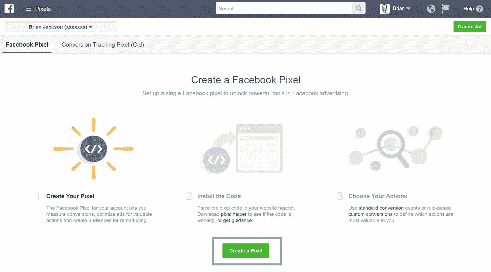

Create Facebook pixel


**第三步**

选中接受条款的复选框，然后单击“创建像素”现在你已经创建了一个像素，是时候把它添加到你的 WordPress 站点了。

### 在 WordPress 中设置脸书像素

为了跟踪脸书的转化率，你需要两种代码:一种是放置在你的 WordPress 网站的每一页上的**像素基本代码**，另一种是放置在特定网页上的事件代码(这两种代码都是通用像素的一部分)。事件是发生在你网站上的行为，可能是脸书广告(付费)的结果，也可能不是(有机的)。事件代码让你跟踪这些行为，并在广告中加以利用。您必须在网站上将要发生操作的特定页面上安装事件代码。阅读更多[脸书活动代码](https://www.facebook.com/business/help/952192354843755?helpref=faq_content#createpixel)。

有许多不同的方法可以将你的脸书像素代码添加到你的 WordPress 站点。第一个当然是简单地在标签上方手动添加代码。你可以在你的 [WordPress 仪表盘](https://kinsta.com/knowledgebase/wordpress-admin/)的外观>编辑器中编辑你的 header.php 文件。然而，您仍然有脸书事件代码，它只需要放在您的转换页面上。在我们的示例中，我们希望在感谢页面上跟踪一次转换，表单会重定向到该页面。这样做的问题是，没有一种简单的方法可以在没有代码的情况下开箱即用。此外，事件代码的位置取决于动作在网站上的发生方式:页面加载或当某人采取动作时的内嵌。

除非你手头有一个 WordPress 开发者，否则这就是你真正需要插件的地方。注意:截至 2017 年 4 月 20 日，[脸书像素已经得到增强](https://www.facebook.com/business/help/1292598407460746)，现在可以发送额外的信息，如您页面上的操作，如“添加到购物车”或“购买”点击。这使得实现自定义事件更加容易。

为了充分利用你的脸书像素，我们强烈推荐使用 PixelYourSite 的插件[脸书像素。这就是我们将在本教程中使用的。该插件目前有超过 70，000 个活跃安装，评分为 4.9 分。在我们测试的不同插件中，这是目前为止处理脸书像素最好的插件之一。这是非常容易使用，但它也有所有的高级功能，为那些想添加额外的行动和事件。](https://wordpress.org/plugins/pixelyoursite/)

[](https://wordpress.org/plugins/pixelyoursite/)

Facebook pixel plugin


该插件有免费版和高级版。实际上，我们将在本教程的不同部分使用这两个版本。如果你只是简单地跟踪基本的转换，比如从脸书的广告到联系表单的提交，那么免费版就可以了。如果你需要追踪 WooCommerce 产品的转换值，那么你应该投资购买高级版本。另一个你可能想看看的插件是[像素咖啡因](https://wordpress.org/plugins/pixel-caffeine/)。

按照下面的步骤在你的 WordPress 站点上设置一个脸书像素。在本例中，我们将为联系人表单提交中的销售线索设置转换跟踪。

**第一步**

首先，安装免费的[脸书像素插件。你可以从 WordPress 知识库下载它，或者在你的 WordPress 仪表盘的“添加新插件”下搜索它。](https://wordpress.org/plugins/pixelyoursite/)

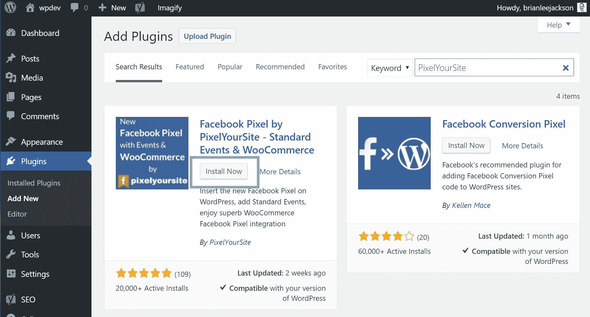

Install Facebook pixel plugin


**第二步**

接下来，重新登录[脸书像素管理器](https://www.facebook.com/ads/manager/pixel/facebook_pixel)，复制你的像素 ID。

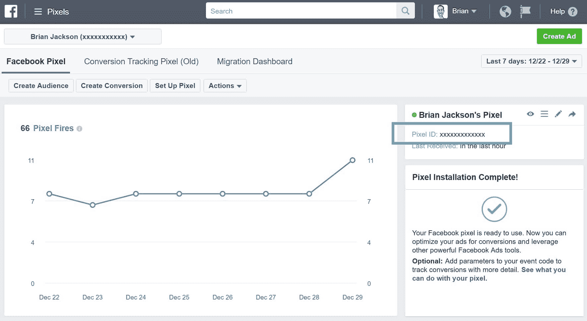

Facebook pixel ID


**第三步**

在 PixelYourSite 插件的设置中，将你的脸书像素 ID 粘贴到像素 ID 字段中。

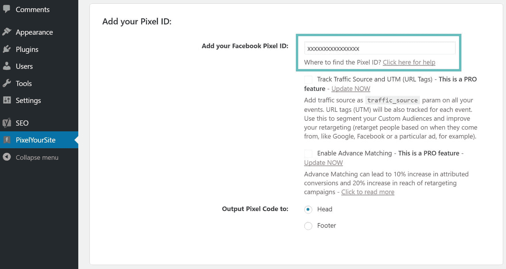

Add Facebook pixel ID in WordPress


**第四步**

向下滚动并检查“激活插件常规设置”设置。然后点击“保存设置”

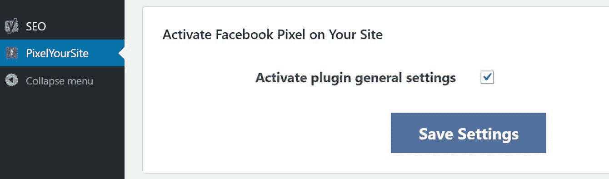

Pixel ID activate settings


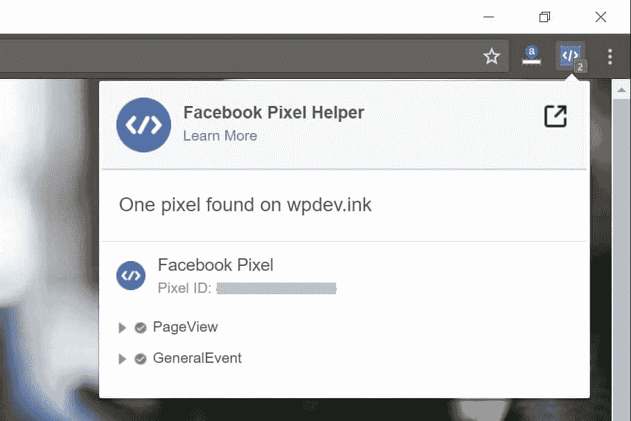

Verify Facebook pixel


你的脸书像素现在运行在你的 WordPress 网站的每一页。你可以很容易地用免费的[脸书像素助手](https://developers.facebook.com/docs/facebook-pixel/pixel-helper) Chrome 扩展验证这一点。简单地启动你的 WordPress 站点，确保一切都检查完毕。

**第五步**

现在是时候添加事件了。点击“事件”选项卡，然后点击“添加新事件”

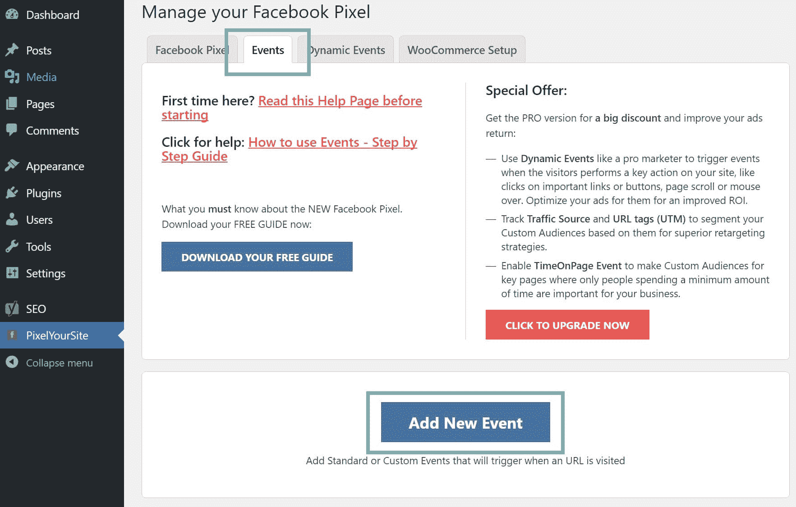

Add new event


**第六步**

对于 URL，我们将使用我们之前创建的感谢页面。然后选择“领导”作为事件类型。如果您愿意，也可以指定一个货币值，但是这是可选的。然后点击“添加”

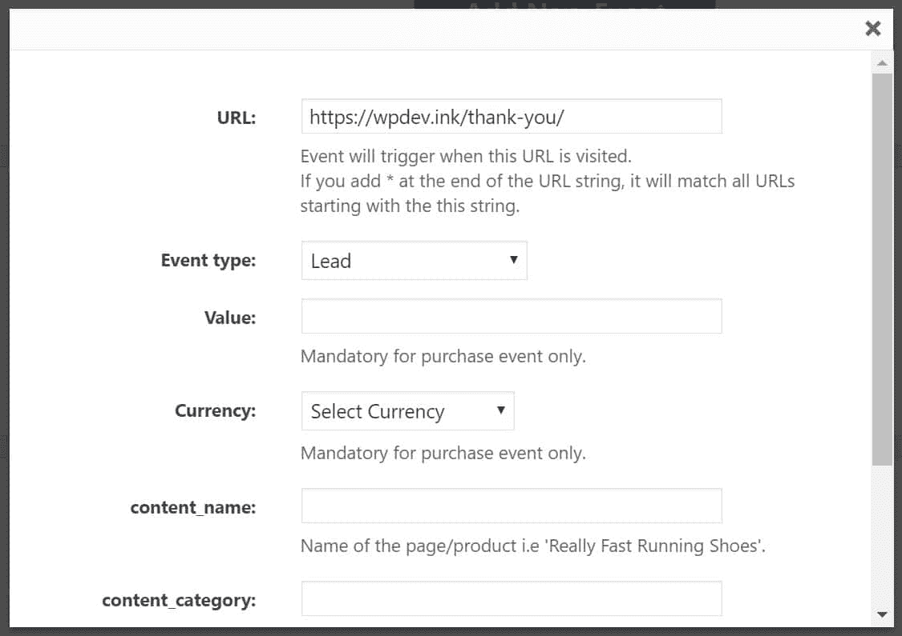

Add custom FB event


**第七步**

然后选择“激活事件”并点击“保存设置”

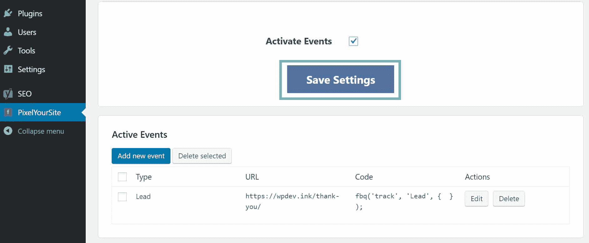

Save Facebook event


然后，您也可以用脸书像素助手扩展来验证这一点。浏览到您的感谢页面，您应该会看到一个仅在该页面上触发的附加事件。

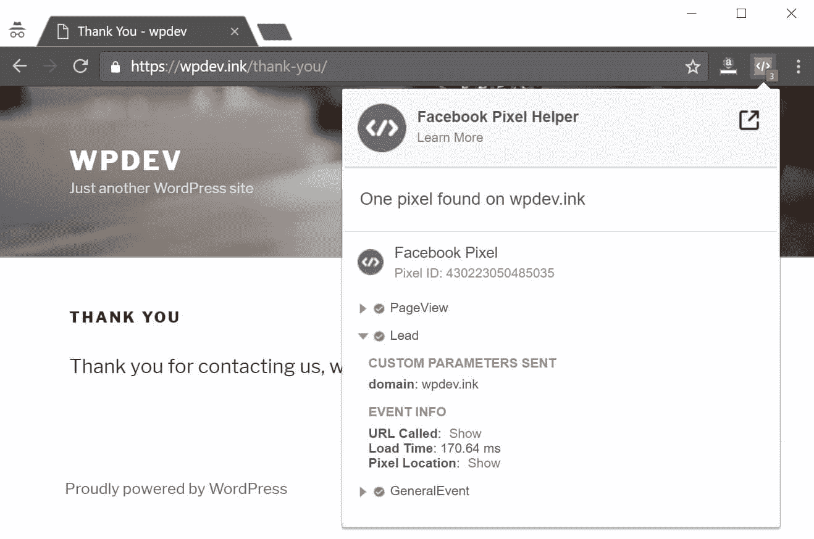

Verify Facebook lead event


这样你就可以跟踪脸书那边负责转化的广告(联系表单提交)。当你在[脸书广告管理器](https://www.facebook.com/ads/manager/)中创建广告或发布帖子时，只需确保你选择了新的“脸书像素”像素必须附在你运行的每一个广告上，这样数据才能从你的 WordPress 网站流回脸书广告管理器。

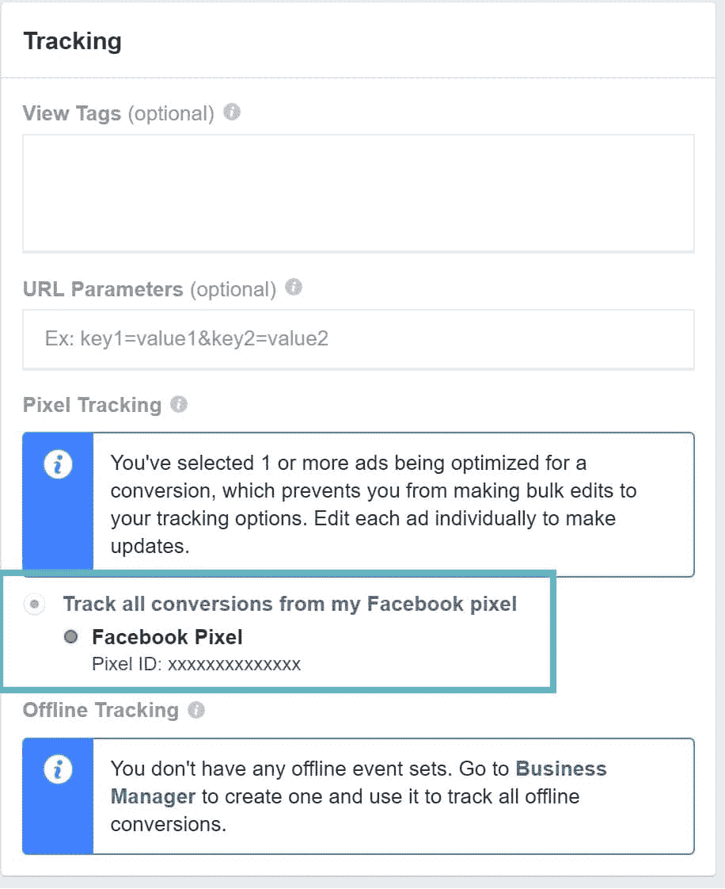

Facebook ads pixel


成功的转换和/或销售线索将显示在脸书广告管理器的“销售线索”栏中。

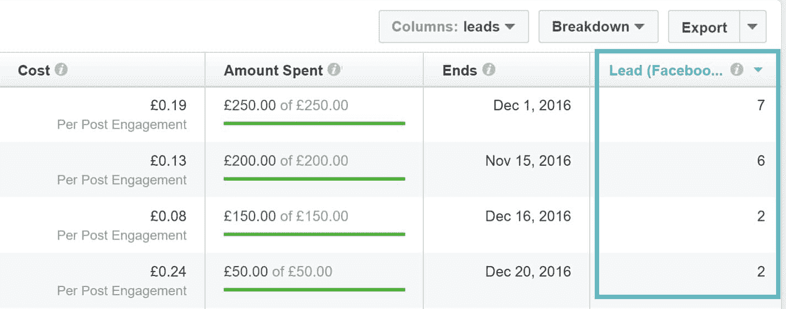

Facebook leads


就是这样！现在你知道了如何从你的 WordPress 网站上的联系表单提交中追踪转换，并追踪到你的脸书广告。这让你可以看到哪些广告和增加的帖子正在转化为实际收入，这样你就可以微调你的广告策略和支出。

### 在 WooCommerce 中设置脸书像素

现在是时候在 WooCommerce 中设置你的脸书像素了。我们将使用相同的脸书像素插件。但是，您可能需要高级版本，这取决于您想要跟踪的内容。如果你只是想跟踪个别产品上的广告转换，那么免费版本将会很好。如果你想传递“价值和货币”以及转换数据，那么你需要高级版本。你可能也想看看[像素咖啡因](https://wordpress.org/plugins/pixel-caffeine/)插件。

当使用 WooCommerce 等电子商务解决方案来跟踪转化率时，另一个建议是在您自己的网站上进行支付，而不是在购买后依赖第三方重定向。PayPal 和 Stripe 等许多[支付网关](https://kinsta.com/blog/woocommerce-payment-gateways/)都有办法让你在 WooCommerce 的结账过程中接受信用卡。这确实需要你的 WordPress 站点上的 SSL 证书，但是现在许多 WordPress 主机免费提供 [SSL 证书。通过取消第三方重定向，这有助于确保更好的数据跟踪，并降低额外的复杂性。](https://kinsta.com/blog/free-ssl-certificate/)

使用方形？来看看我们的深度对比:[条纹 vs 方形](https://kinsta.com/blog/stripe-vs-square/)。

**第一步**

在 PixelYourSite 插件设置中，点击进入“WooCommerce 设置”标签。然后选择“启用脸书动态产品广告”选项

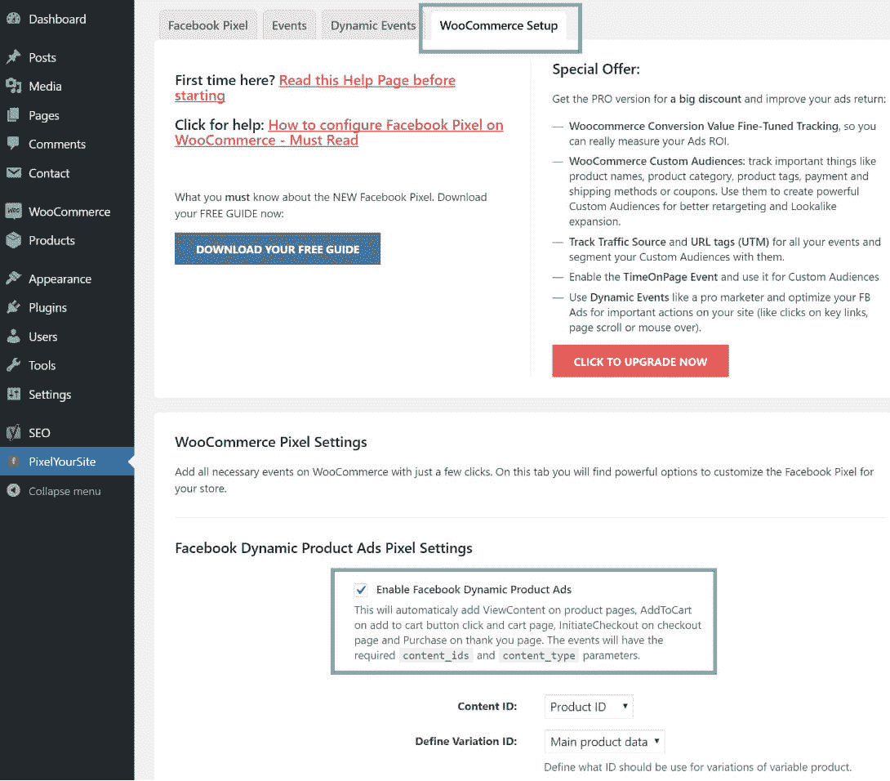

Facebook pixel WooCommerce setup


这将激活所有默认事件并提取 content_ids 和 content_type，这是 FB 动态广告运行的必要参数。在我们的例子中，我们真的只关心它激活下面的特性，这是感谢页面上的购买事件。WooCommerce 有一个动态的[结帐页面](https://kinsta.com/blog/woocommerce-one-page-checkout/),这意味着一个事件必须以某种方式来注册转换。

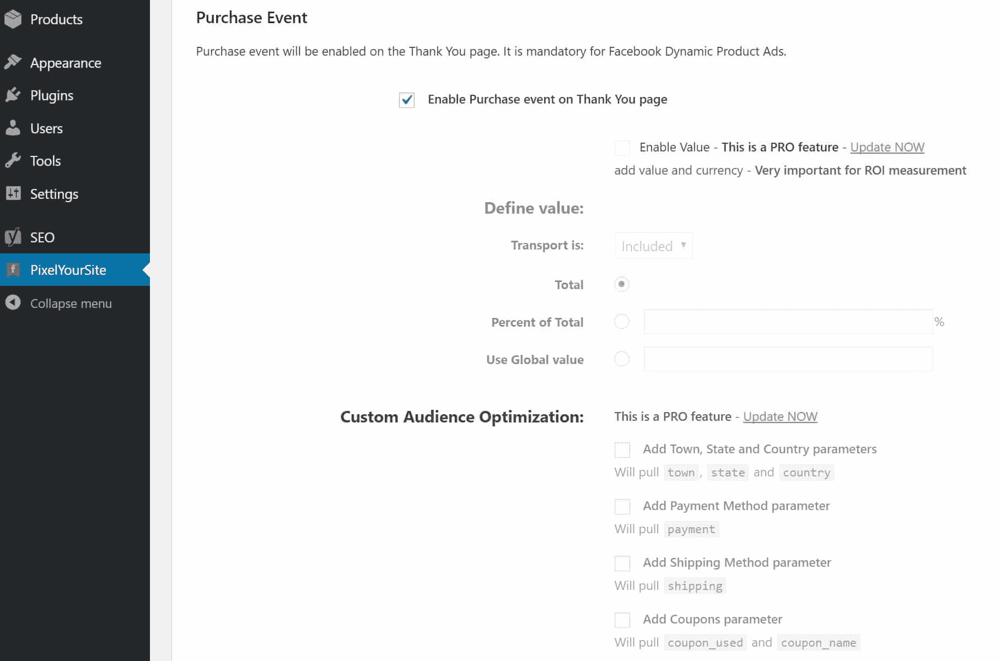

WooCommerce purchase event on thank you page


**第二步**

然后向下滚动，选择“激活 WooCommerce 像素设置”，点击“保存设置”

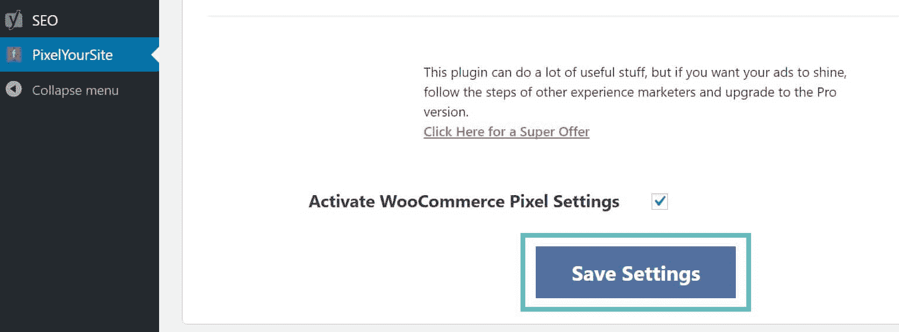

Activate WooCommerce pixel


这样你就可以跟踪脸书那边负责转化(在你的 WooCommerce 网站上成功购买)的广告。当你在[脸书广告管理器](https://www.facebook.com/ads/manager/)中创建广告或发布帖子时，只需确保你选择了新的“脸书像素”同样，像素必须附加到你运行的每一个广告上，这样数据才能从 WooCommerce 返回到脸书广告管理器。


Facebook ads pixel


成功的转换和/或销售线索会出现在脸书广告经理的“购买”栏中。您可以自定义脸书广告管理器中的栏目，以显示您想要的转换类型。在前面的例子中，我们使用了“leads”事件类型。在本例中，您可能希望选择“购买”事件类型。

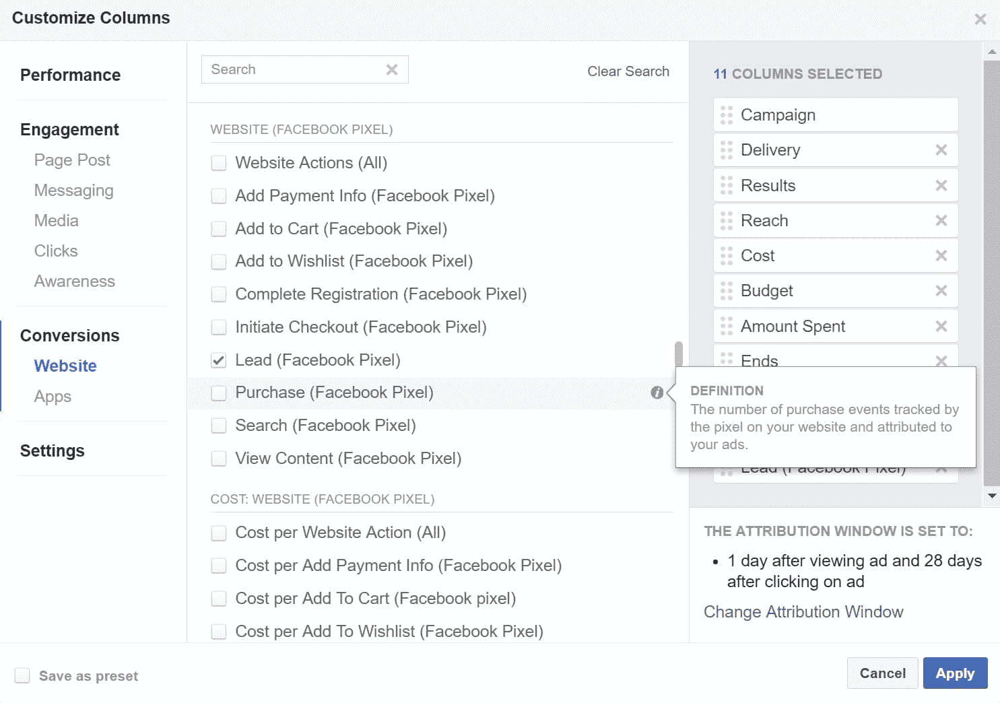

Facebook ads manager purchase column


**第三步(可选)**

如果你有插件的高级版本，我们建议选择“启用值”这将把购买产品的价值传递给脸书。

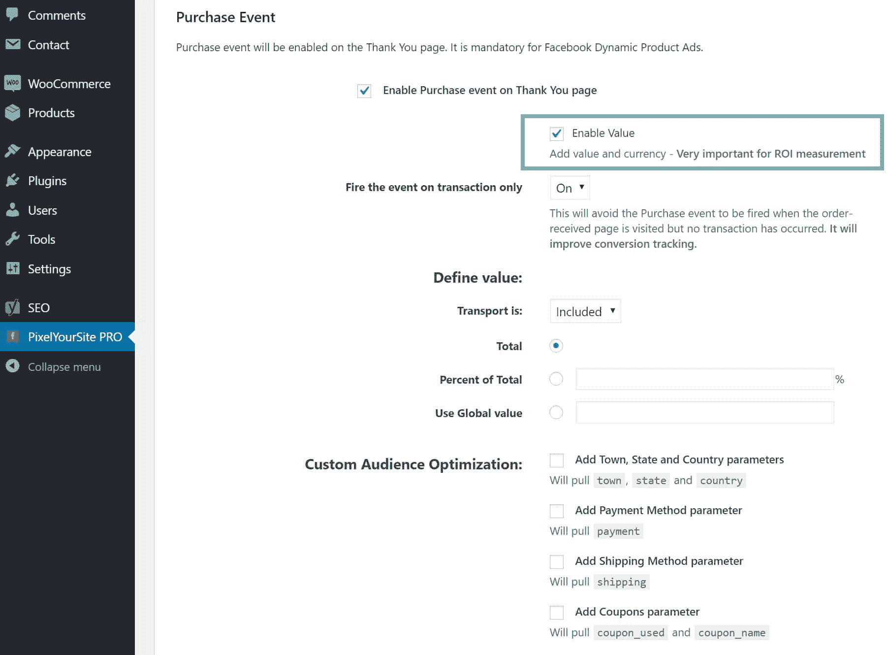

WooCommerce value conversion pixel


然后，您可以添加额外的列，如“购买转换值(脸书像素)”来查看脸书广告管理器中的数据。

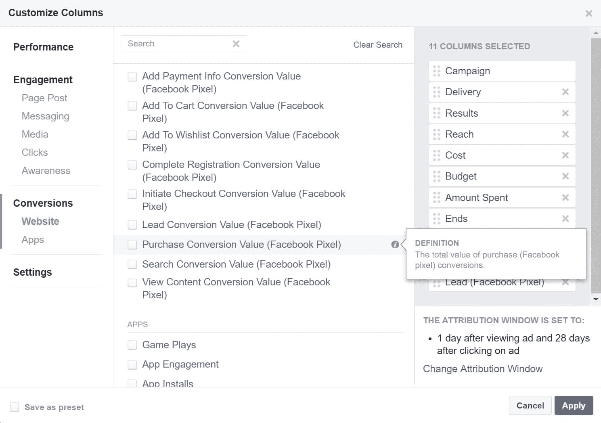

Purchase conversion value


就是这样！你现在可以追踪你所有的 WooCommerce 销售，一直追溯到你的脸书广告，精确到一分钱！

## 注册订阅时事通讯


### 想知道我们是怎么让流量增长超过 1000%的吗？

加入 20，000 多名获得我们每周时事通讯和内部消息的人的行列吧！

[Subscribe Now](#newsletter)

### 在简易数码下载中设置脸书像素

我们没有忘记你们中那些运行简易数字下载的人。事实上，我们是 EDD 的超级粉丝！好消息是，同一个[脸书 Pixel by PixelYourSite](https://wordpress.org/plugins/pixelyoursite/) 插件确实支持 EDD。但是它要求你购买高级版本。另一个你可能想试试的插件是[像素咖啡因](https://wordpress.org/plugins/pixel-caffeine/)。

**第一步**

在 PixelYourSite 插件设置中，点击进入“轻松数字下载”标签。然后选择“启用脸书动态产品广告”选项

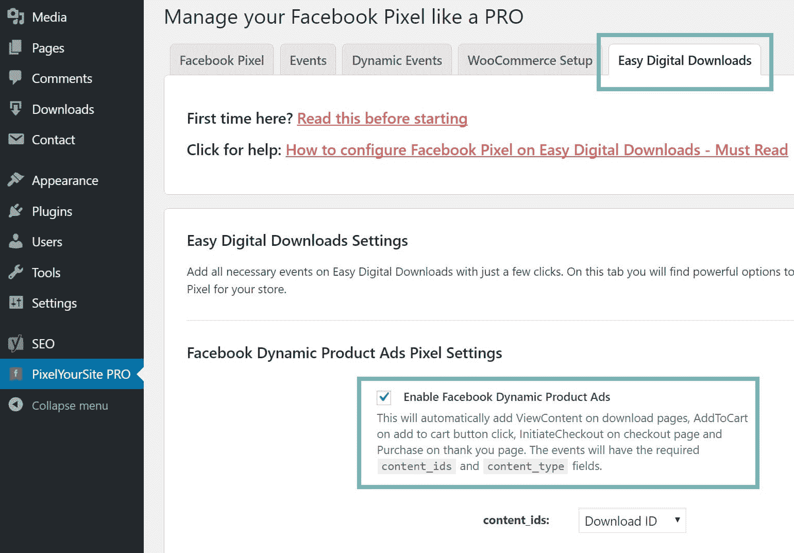

Easy Digital Downloads conversion pixel


这将激活所有默认事件并提取 content_ids 和 content_type，这是 FB 动态广告运行的必要参数。在我们的例子中，我们真的只关心它激活下面的特性，这是默认的 EDD 成功页面上的购买事件。EDD 有一个成功页面，这意味着一个事件必须以某种方式注册转换。因为你有高级版本，你也可以选择“启用值”选项来传递转换值到脸书。

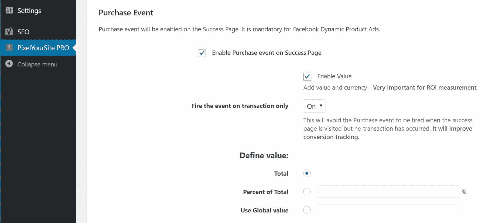

Easy Digital Downloads purchase event


**第二步**

然后向下滚动并选择“激活轻松数字下载像素设置”，然后单击“保存设置”


Activate Easy Digital Downloads pixel


就是这样！你现在可以追踪你在 EDD 的所有销售，一直追溯到你在脸书的广告，精确到一分钱！

## WordPress 中的 Twitter 转换跟踪

许多企业和营销人员在 Twitter 上做广告，因为它拥有庞大的受众。它可能没有脸书大，但根据 Statista 的数据，截至 2018 年第三季度，Twitter 平均每月活跃用户数为 3.26 亿。正如大多数人所知，Twitter 的年增长率略有下降，但月用户数量相对保持不变。在金斯塔，我们是推特的忠实粉丝！

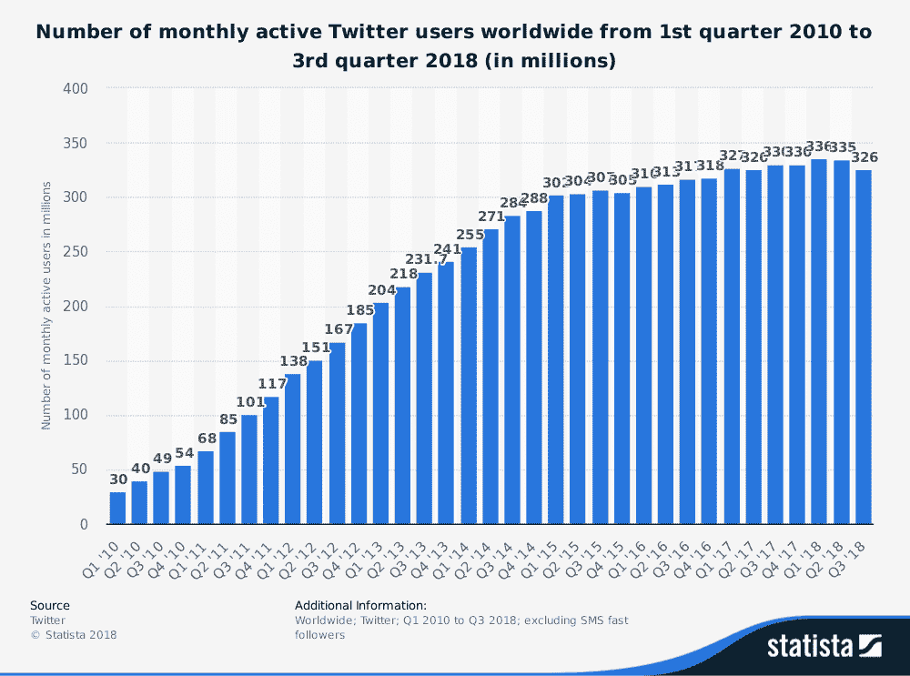

Twitter monthly active users


下面我们将探讨如何创建 Twitter pixel，如何将它安装在你的 WordPress 站点上，以及如何将其应用到电子商务解决方案中，如 WooCommerce 和 Easy Digital Downloads。

### 创建 Twitter 跟踪像素

Twitter 比脸书更容易使用，它只使用一个像素，或者他们称之为网站标签 T1。按照以下步骤创建 Twitter 跟踪像素。

**第一步**

登录您的 [Twitter 广告](https://ads.twitter.com/)账户。如果你没有，你可以免费注册。在“工具”下，点击“转换跟踪”

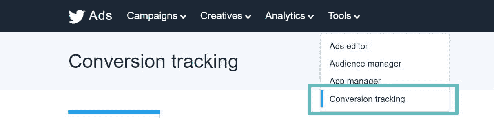

Twitter ads conversion tracking


**第二步**

接受条款并点击“生成用于转换跟踪的网站标签”

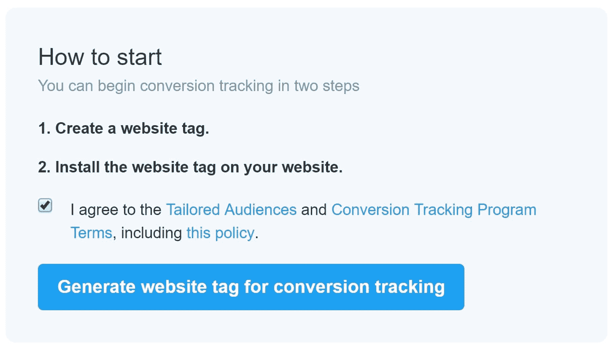

Create Twitter website tag


仅此而已。你现在有了一个网站标签(Twitter Pixel ),可以在你的 WordPress 站点上使用。遵循下一节关于如何实现代码的内容。

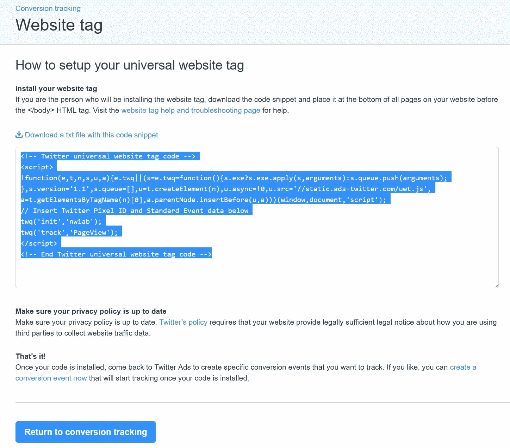

Twitter pixel tag


### 在 WordPress 中设置 Twitter Pixel

现在是时候在 WordPress 中设置你的 Twitter Pixel 了。不幸的是，PixelYourSite 的开发者还没有添加 Twitter 支持，尽管[他正计划](https://wordpress.org/support/topic/twitter-pixel-support/)。所以这就是我们将使用免费的[跟踪代码管理器](https://wordpress.org/plugins/tracking-code-manager/)插件的地方。该插件目前有超过 80，000 个活跃安装，评分为 4.2 分(满分为 5 星)。在免费版本中，您可以添加多达 6 个脚本。

[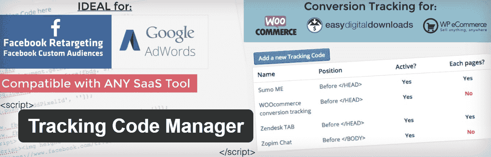](https://wordpress.org/plugins/tracking-code-manager/)

Tracking Code Manager plugin


按照下面的步骤在你的 WordPress 站点上设置一个 Twitter pixel。在本例中，我们将再次为联系人表单提交中的销售线索设置转换跟踪。

**第一步**

首先安装免费的跟踪代码管理器插件。你可以从 WordPress 知识库下载它，或者在你的 WordPress 仪表盘的“添加新插件”下搜索它。

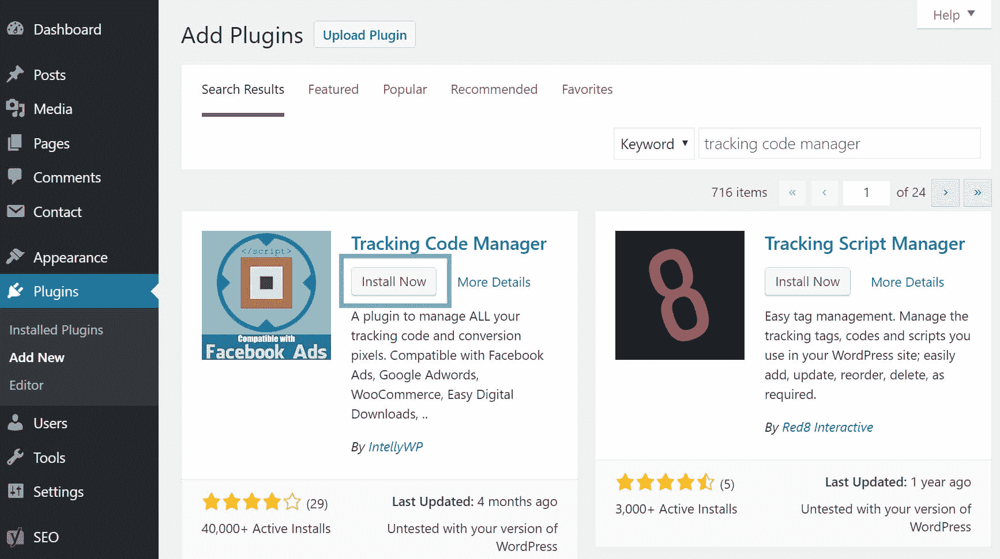

Install Tracking Code Manager WordPress plugin


**第二步**

在跟踪代码管理器插件的设置中，单击“添加新脚本”标签。你可以给它一个名字，然后粘贴你的 Twitter 像素代码。对于我们在

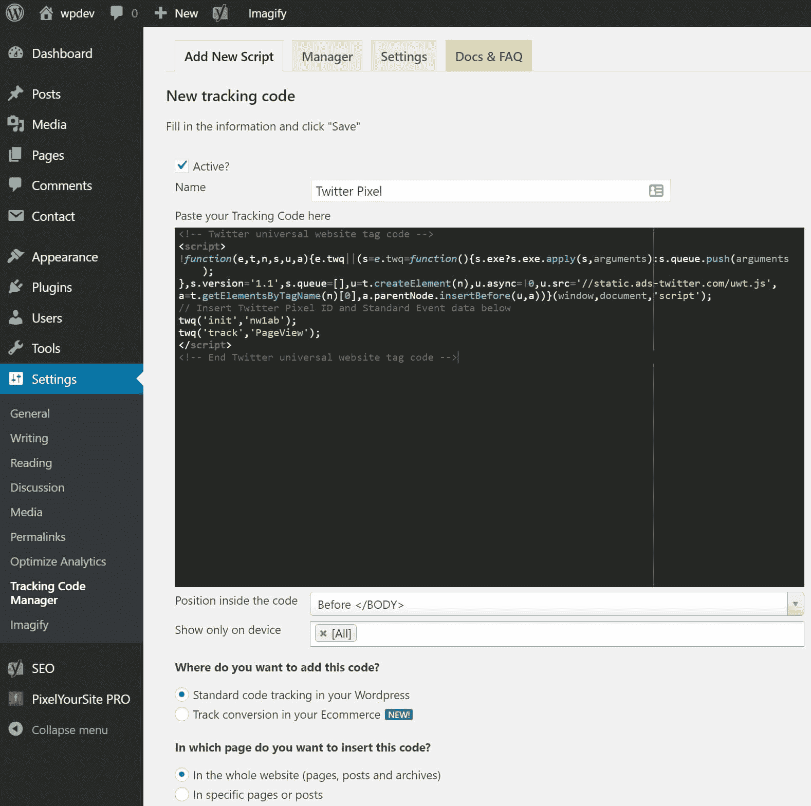

Twitter pixel settings


就像脸书一样，也有一个 [Twitter 像素助手](https://business.twitter.com/en/help/campaign-measurement-and-analytics/pixel-helper.html) Chrome 扩展。你可以浏览你的 WordPress 站点，确认它正在拾取你的像素。

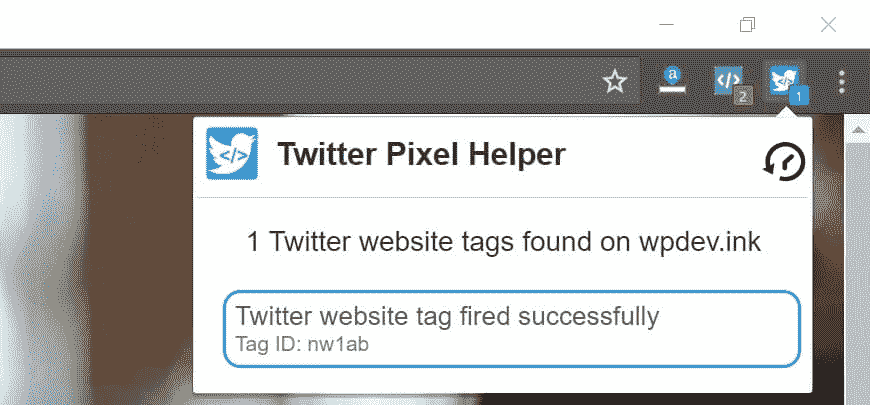

Twitter pixel helper


**第三步**

然后，我们不在 WordPress 插件中创建转换，而是从 [Twitter 广告管理器](https://ads.twitter.com/)中创建。在“工具”下，点击“转换跟踪”，然后点击“创建新的转换事件。”

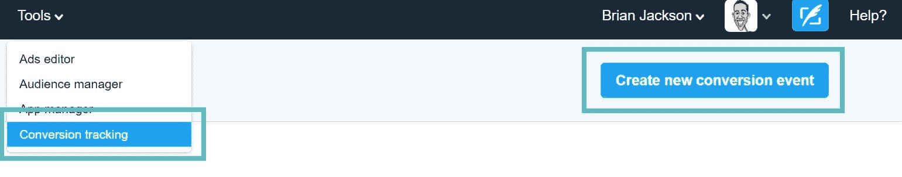

**第四步**

为您的活动命名。我们将把我们的命名为“领导”自定义似乎最适合这种情况，因为铅不是转换类型的选项。选择通用标签并输入您的转换 URL。在我们的例子中，这是我们之前创建的“感谢”页面。然后点按“存储转换事件”

Struggling with downtime and WordPress problems? Kinsta is the hosting solution designed to save you time! [Check out our features](https://kinsta.com/features/)

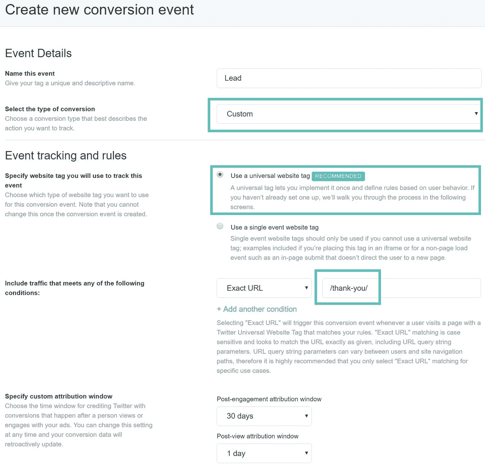

Twitter custom URL conversion


注意:请记住，默认的属性窗口(或它将注册转换的时间)是查看您的广告后 1 天，点击它后 30 天。雇佣后归因窗口可以设置为 1 天到最多 90 天。然后，您可以在 Twitter 广告管理器中查看转化率。

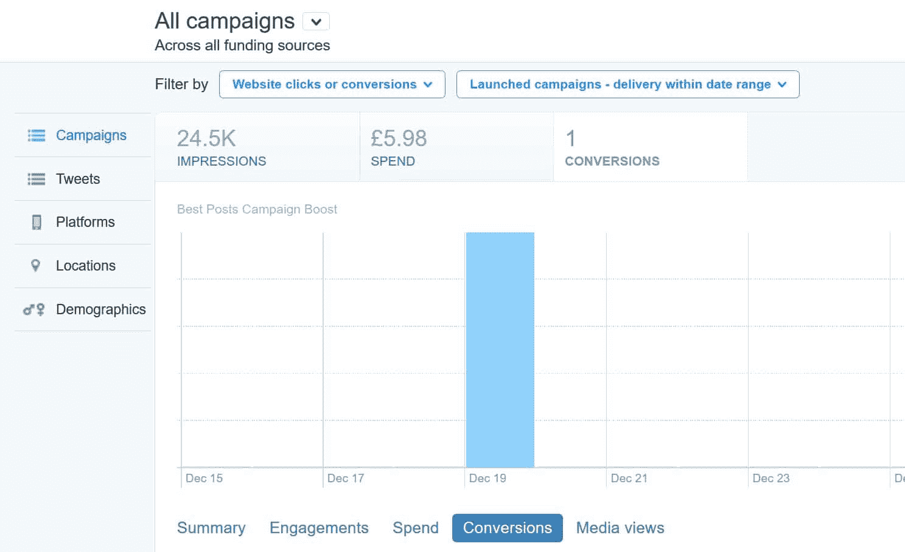

See Twitter conversions


### 在 WooCommerce 中设置 Twitter Pixel

现在是时候在 WooCommerce 中设置你的 Twitter Pixel 了。我们将使用相同的免费[跟踪代码管理器](https://wordpress.org/plugins/tracking-code-manager/)插件。

**第一步**

如果你既想跟踪网站上的联系表单提交(就像我们上面展示的)，也想跟踪 WooCommerce 订单，那么必须用 Twitter 创建一个单独的事件像素。所以登录到 [Twitter 广告管理器](https://ads.twitter.com/)。在“工具”下，点击“转换跟踪”，然后点击“创建新的转换事件。”


Create Twitter conversion event


**第二步**

为您的活动命名。我们将把我们的命名为“WooCommerce 购买”这肯定和你的通用像素不一样。选择“使用单个事件网站标签”。然后点按“存储转换事件”

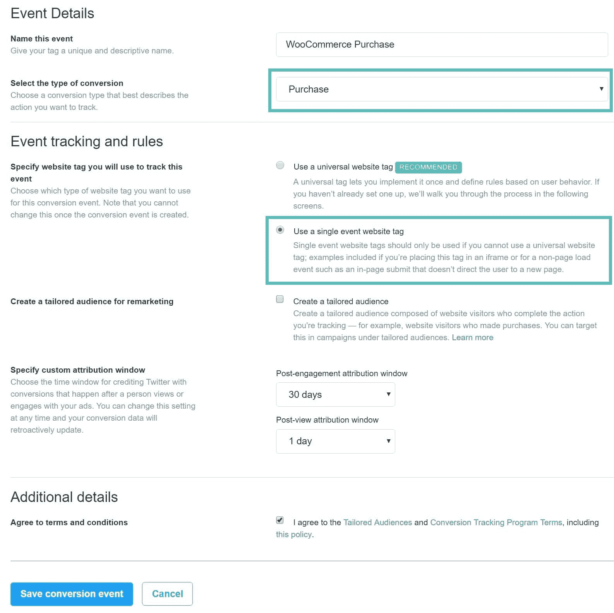

Twitter single event pixel


**第三步**

在跟踪代码管理器插件的设置中，单击“添加新脚本”选项卡。你可以给它一个名字，然后粘贴你的单事件 Twitter 像素。选择“在 WooCommerce 中跟踪转换”然后点击“保存”

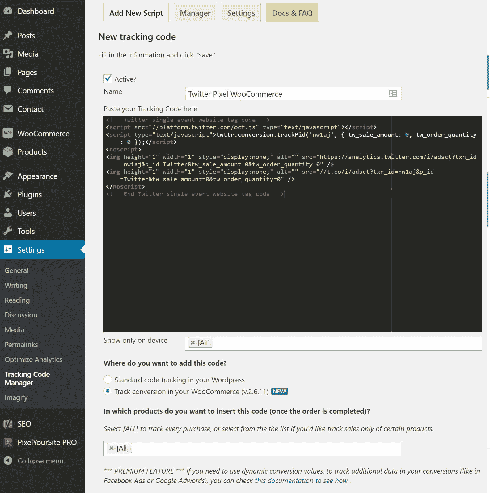

Add Twitter pixel in WooCommerce


单个事件像素现在只会在 WooCommerce 动态结账页面上触发。这使得 Twitter 知道在 WooCommerce 购买后何时发生了转换。

### 在简易数字下载中设置 Twitter Pixel

现在是时候在轻松数字下载中设置您的 Twitter Pixel 了。我们将使用相同的免费[跟踪代码管理器](https://wordpress.org/plugins/tracking-code-manager/)插件。

**第一步**

如果你既想跟踪网站上的联系表单提交(就像我们上面展示的那样)，又想跟踪简单的数字下载订单，那么必须用 Twitter 创建一个单独的事件像素。所以登录到 [Twitter 广告管理器](https://ads.twitter.com/)。在“工具”下，点击“转换跟踪”，然后点击“创建新的转换事件。”


Create Twitter conversion event


**第二步**

为您的活动命名。我们将把我们的命名为“EDD 购买”这肯定和你的通用像素不一样。选择“使用单个事件网站标签”。然后点按“存储转换事件”

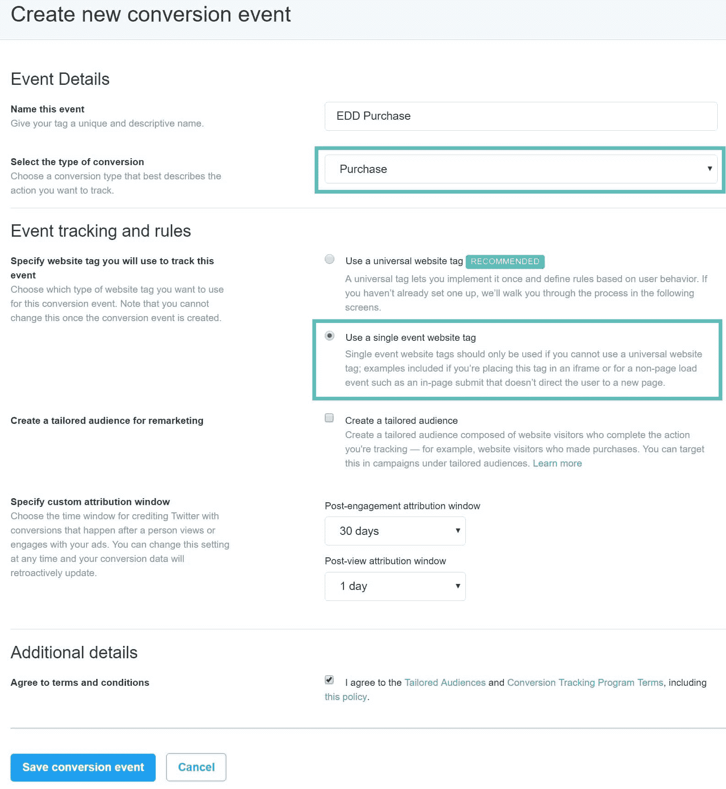

Twitter single event pixel in EDD


**第三步**

在跟踪代码管理器插件的设置中，单击“添加新脚本”选项卡。你可以给它一个名字，然后粘贴你的单事件 Twitter 像素。选择“轻松数码下载中的音轨转换”然后点击“保存”

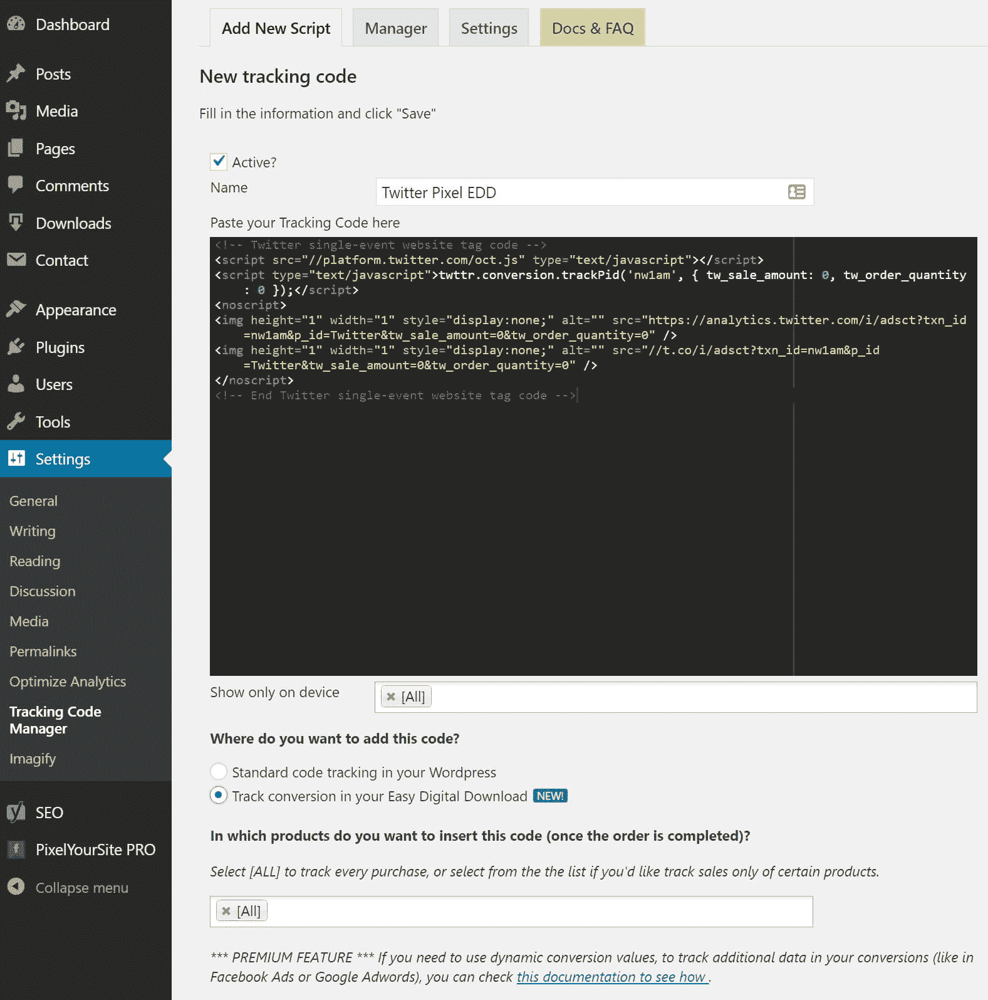

Add Twitter pixel in Easy Digital Downloads


单个事件像素现在将在简易数字下载动态成功页面上触发。这使得 Twitter 知道在一次简单的数字下载购买后何时发生了转换。

## WordPress 中的 Google AdWords 转换跟踪

谷歌广告词可能是最受欢迎的广告形式，因为你可以马上出现在谷歌的顶部。这可能不是最便宜的方法，但如果你想被人看到，并立即产生线索，AdWords 可以是一个快速的胜利。看看这些[使用 AdWords](http://www.digitalmarketer.com/why-adwords/) 的 10 个理由。在我们看来，它也可能比脸书更容易获得转换跟踪和运行，因为你没有一堆自定义事件，你必须担心。按照下面的步骤，在你的 WordPress 网站上用 Google Adwords 设置转换跟踪。

### 如何为 WordPress 网站设置 Google AdWords 转换跟踪

在一个基本的 WordPress 网站上跟踪 AdWords 转换的最简单的方法是使用 Google Analytics goals。首先，你需要确保你有谷歌分析和谷歌广告词链接。

**第一步**

在继续之前，请确保您首先在 Google Analytics 中设置了一个目标。可以关注我们上面的[教程。要将它们链接在一起，请在谷歌分析中点击“管理>广告词链接”。选择你的 AdWords 账户，打开你的 WordPress 站点默认视图的链接。然后单击保存。](#create-google-analytics-goals)

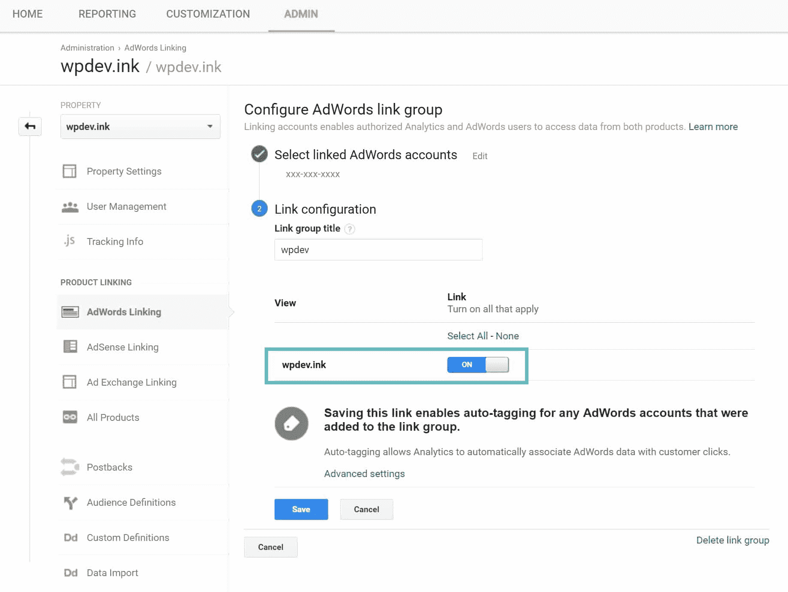

**第二步**

然后在谷歌 AdWords 中，点击进入“工具”和“谷歌分析”。您应该会看到要导入的目标列表。正如您在下面看到的，我们有我们之前创建的“联系我们提交”目标。选择它并点击“导入”

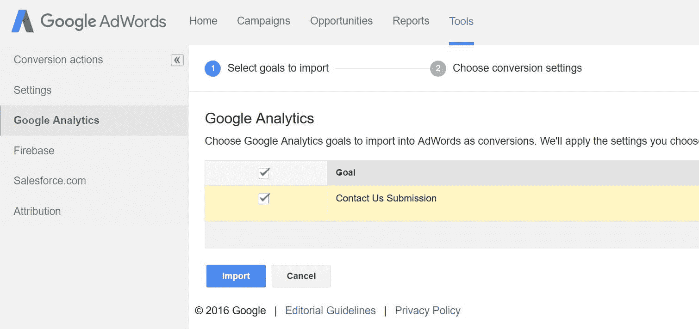

**第三步**

然后，您可以为您的联系人表单提交和/或销售线索分配一个货币值，并单击“导入目标”

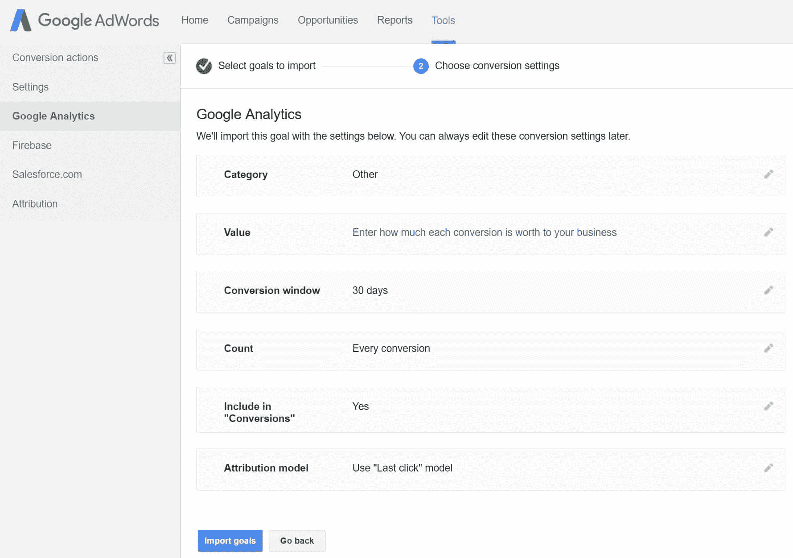

AdWords conversion settings


转换现在将显示在广告词的活动，产生一个联系形式提交。相当简单！

### 如何在 WooCommerce 中设置 Google AdWords 转换跟踪

对于 WooCommerce，我们将在 Google AdWords 中手动创建一个单独的转换跟踪代码。有一些插件可以在 Google Analytics 中为购买创建目标，但是，我们尝试的很多插件都有这个问题。即使是官方的 WooCommerce Google Analytics 插件也只有 [2.9 的 5 星评级](https://wordpress.org/support/plugin/woocommerce-google-analytics-integration/reviews/?filter=1)，许多报告数据报告不准确的问题。你也可以利用谷歌分析[的电子商务功能](https://support.google.com/analytics/answer/1009612?hl=en)，但那要更高级一点。最简单的方法之一是简单地使用手动转换代码。

**第一步**

在 Google AdWords 中，点击进入工具，然后点击“+转换”

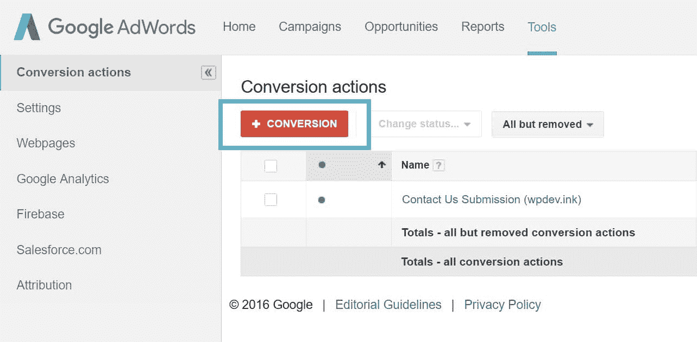

Create AdWords conversion


**第二步**

选择“网站”

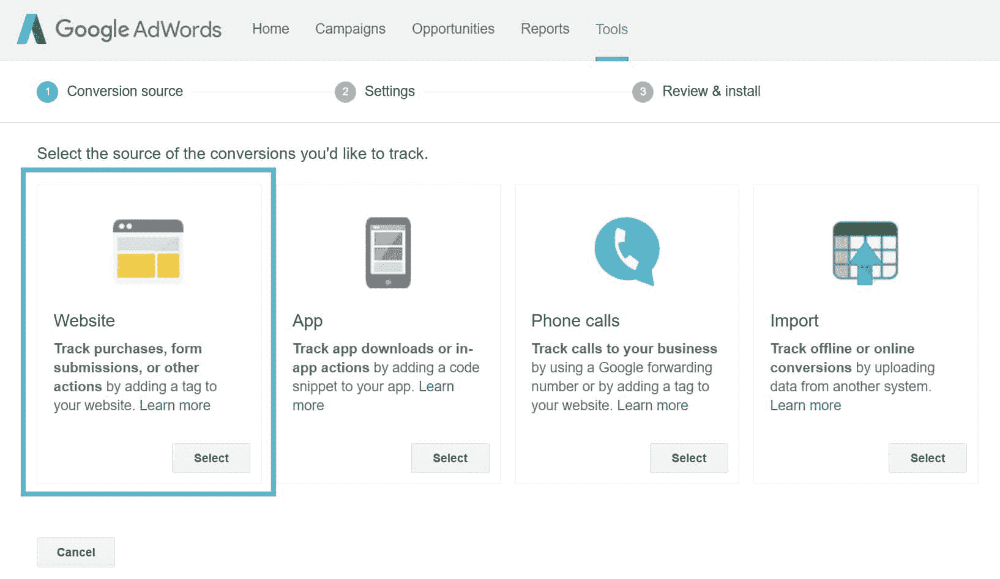

AdWords website conversion


**第三步**

我们将为我们的转换命名为 WooCommerce Conversion。对于这个值，你有两个选择。您可以不导入该值，或者使用动态值来获取 WooCommerce 值。我们建议这样做。但是请注意，它需要高级版本的[跟踪代码管理器](https://wordpress.org/plugins/tracking-code-manager/)插件来跟踪动态值。如果你只是想跟踪广告的转化，你可以选择不赋值，使用插件的免费版本。对于这第一步，选择“不赋值”对于类别，选择“购买”，然后单击“保存并继续”

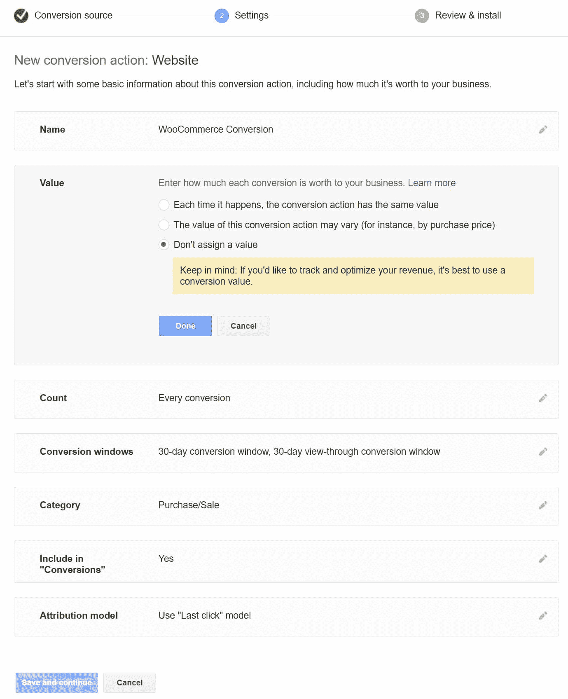

Custom conversion code in AdWords


**第四步**

在跟踪代码管理器插件的设置中，单击“添加新脚本”标签。你可以给它一个名字，然后粘贴你的 AdWords 自定义转换代码。选择“在 WooCommerce 中跟踪转换”然后点击“保存”

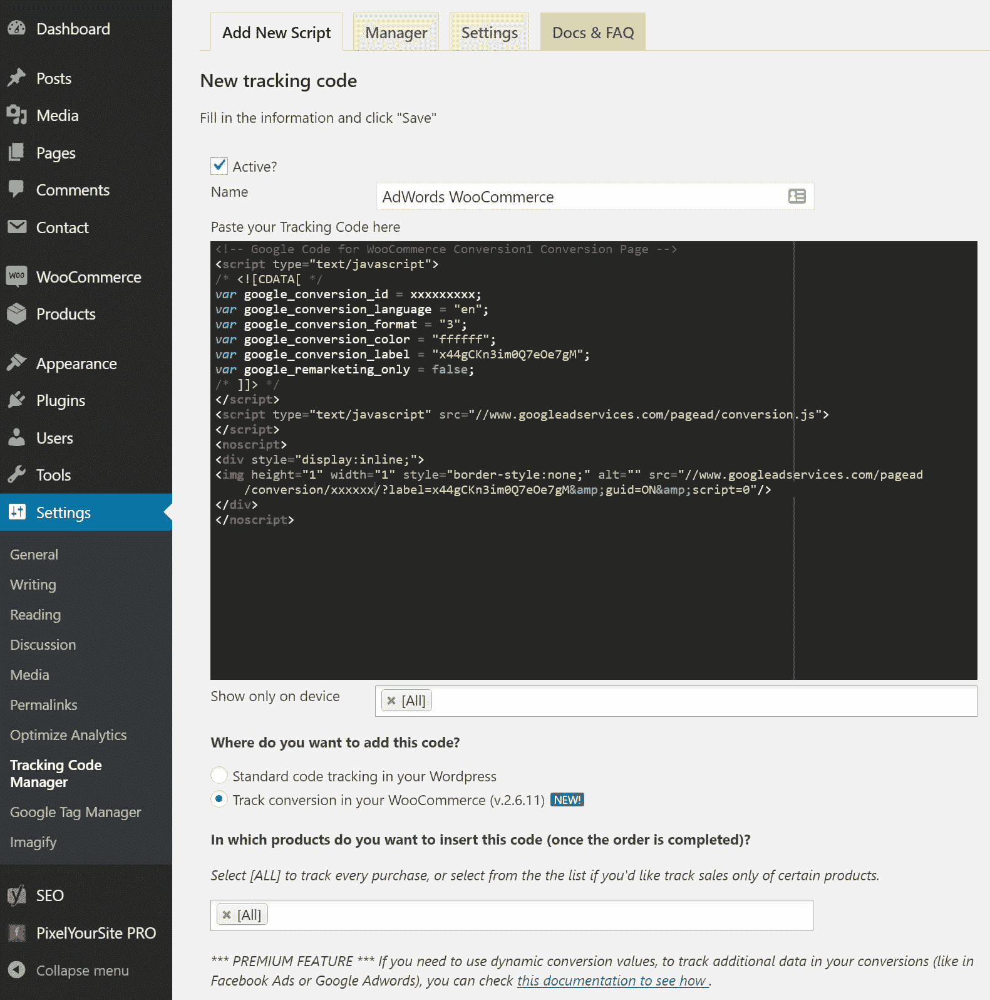

Add AdWords WooCommerce pixel


**第五步(可选)**

如果你想把你的 WooCommerce 产品的动态值传递回 AdWords，你需要这个插件的高级版本，并修改你的 AdWords 转换脚本。这些变化在下面用粗体显示。也可以参考[文档](http://support.intellywp.com/article/28-dynamic-conversion-values)。

```
<!-- Google Code for WooCommerce Conversion Page -->
<script type="text/javascript">
/* <![CDATA[ */
var google_conversion_id = xxxxxxxxx;
var google_conversion_language = "en";
var google_conversion_format = "3";
var google_conversion_color = "ffffff";
var google_conversion_label = "x44gCKn3im0Q7eOe7gM";
var google_conversion_currency = "USD";
var google_conversion_value = @@[[email protected]](/cdn-cgi/l/email-protection)@;
var google_remarketing_only = false;
/* ]]> */
</script>
<script type="text/javascript" src="//www.googleadservices.com/pagead/conversion.js">
</script>
<noscript>
<div style="display:inline;">

</div>
</noscript>
```

就是这样！你现在可以追踪你所有的 WooCommerce 销售，一直追溯到你的 Google AdWords 活动。

### 如何在轻松数字下载中设置 Google AdWords 转换跟踪

现在是时候在轻松数字下载中设置 Google AdWords 转换跟踪了。这与上面的 WooCommerce 设置非常相似。我们将再次使用同一个免费的[跟踪代码管理器](https://wordpress.org/plugins/tracking-code-manager/)插件。

**第一步**

在 Google AdWords 中，点击进入工具，然后点击“+转换”


Create AdWords conversion


**第二步**

选择“网站”


AdWords website conversion


**第三步**

我们会给我们的转换一个名字，轻松数字下载转换。对于这个值，你有两个选择。您可以不导入该值，也可以使用动态值来获取简易数字下载值。我们建议这样做。但是请注意，它需要高级版本的[跟踪代码管理器](https://wordpress.org/plugins/tracking-code-manager/)插件来跟踪动态值。如果你只是想跟踪广告的转化，你可以选择不赋值，使用插件的免费版本。对于这第一步，选择“不赋值”对于类别，选择“购买”，然后单击“保存并继续”

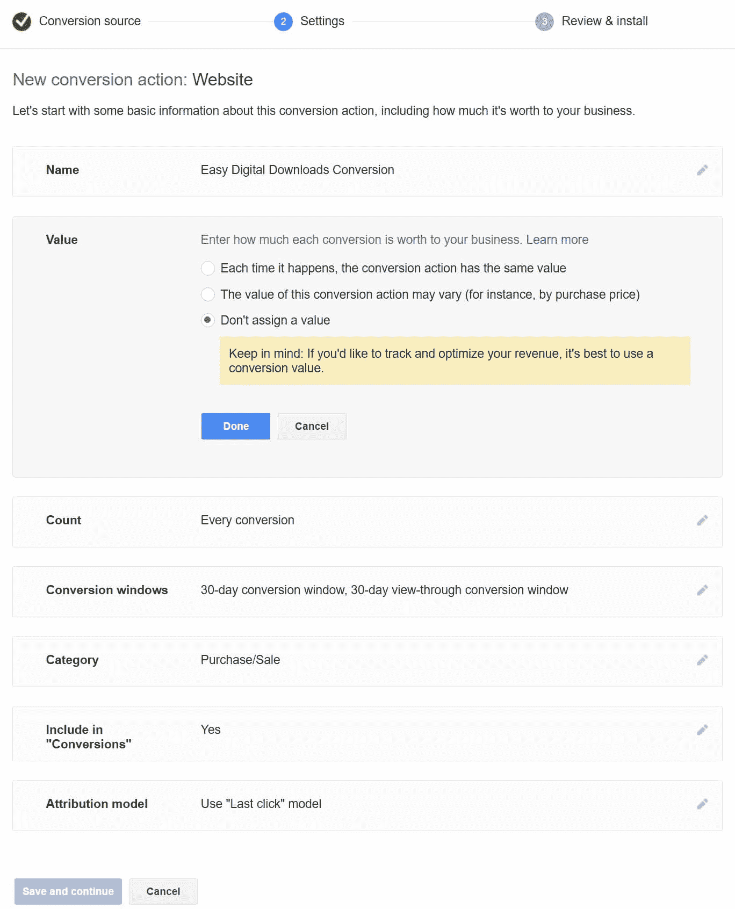

Custom AdWords conversion code in Easy Digital Downloads


**第四步**

在跟踪代码管理器插件的设置中，单击“添加新脚本”标签。你可以给它一个名字，然后粘贴你的 AdWords 自定义转换代码。选择“轻松数码下载中的音轨转换”然后点击“保存”

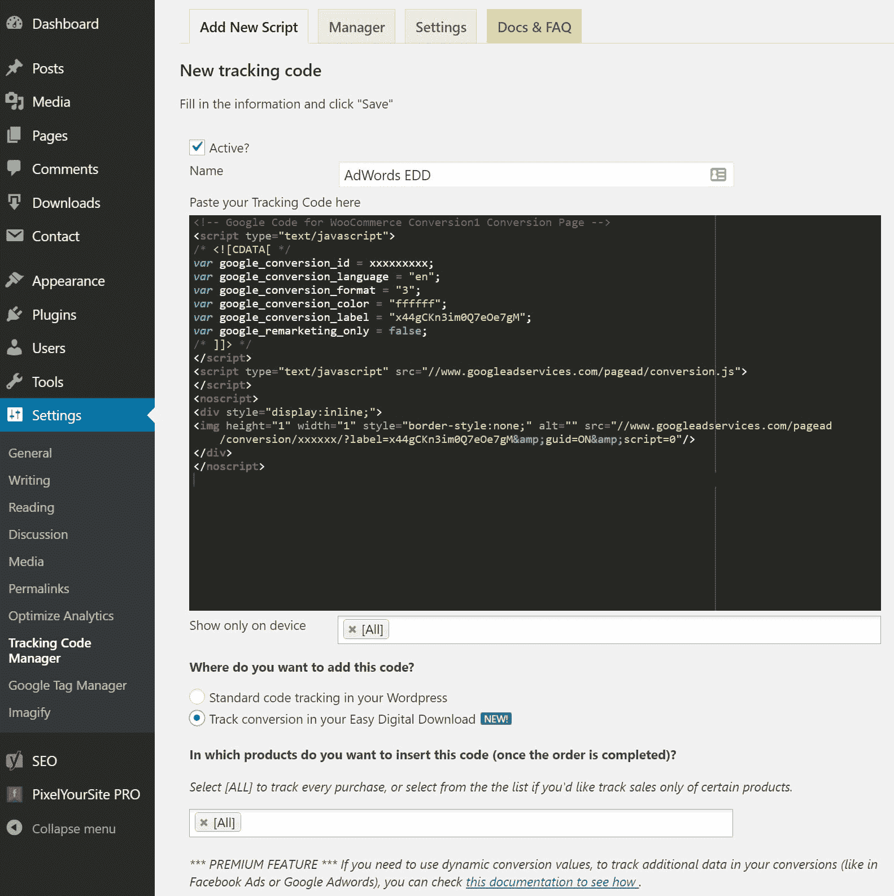

Add AdWords Easy Digital Downloads pixel


**第五步(可选)**

如果您想将轻松数字下载产品的动态值传递回 AdWords，您将需要该插件的高级版本并修改您的 AdWords 转换脚本。这些变化在下面用粗体显示。也可以参考[文档](http://support.intellywp.com/article/28-dynamic-conversion-values)。

```
<!-- Google Code for Easy Digital Downloads Conversion Page -->
<script type="text/javascript">
/* <![CDATA[ */
var google_conversion_id = xxxxxxxxx;
var google_conversion_language = "en";
var google_conversion_format = "3";
var google_conversion_color = "ffffff";
var google_conversion_label = "x44gCKn3im0Q7eOe7gM";
var google_conversion_currency = "USD";
var google_conversion_value = @@[[email protected]](/cdn-cgi/l/email-protection)@;
var google_remarketing_only = false;
/* ]]> */
</script>
<script type="text/javascript" src="//www.googleadservices.com/pagead/conversion.js">
</script>
<noscript>
<div style="display:inline;">

</div>
</noscript>
```

就是这样！你现在可以追踪你所有的 EDD 销售，一直追溯到你的 Google AdWords 活动。

## 跟踪同一活动中的不同广告

在同一个活动中有两个不同的广告，都导致相同的转换和/或感谢页面？别担心，有几种方法可以让你深入了解，看看到底是哪个广告被转换了。

### 选项 1–链接 AdWords 和 Google Analytics

第一个也是最简单的方法就是[将 AdWords 和 Google Analytics](https://woorkup.com/link-google-adwords-google-analytics/) 连接起来。详细的转换数据，包括广告，然后通过双方。然后你可以深入到“收购→谷歌广告→活动→广告内容”来查看哪些广告被转化了。

### 选项 2–使用 UTM 参数

您也可以使用 UTM 参数。事实上，你应该总是使用这些来获得额外的数据。您可以使用[谷歌营销活动 URL 构建器](https://ga-dev-tools.appspot.com/campaign-url-builder/)工具来创建这些。

例如，下面是我们将用来跟踪 AdWords 中两个不同的广告，导致同一页面。

```
https://kinsta.com/?utm_source=ad-campaign&utm_medium=cpc&utm_content=ad1
https://kinsta.com/?utm_source=ad-campaign&utm_medium=cpc&utm_content=ad2
```

然后你可以在 Google Analytics 中向下钻取“收购→活动→所有活动→广告内容”来查看哪些广告被转化了。

## 摘要

正如你所看到的，WordPress 转换跟踪并不需要太难。肯定有很多不同的方法可以设置它。但是希望上面的教程能让你快速上手，并对一些容易实现的解决方案有更好的理解。我们计划在未来更新这个指南，增加一个额外的谷歌标签管理器部分，所以一定要把它收藏起来。有任何 WordPress 转换跟踪技巧吗？如果是这样，我们很想听听他们的下文。

* * *

让你所有的[应用程序](https://kinsta.com/application-hosting/)、[数据库](https://kinsta.com/database-hosting/)和 [WordPress 网站](https://kinsta.com/wordpress-hosting/)在线并在一个屋檐下。我们功能丰富的高性能云平台包括:

*   在 MyKinsta 仪表盘中轻松设置和管理
*   24/7 专家支持
*   最好的谷歌云平台硬件和网络，由 Kubernetes 提供最大的可扩展性
*   面向速度和安全性的企业级 Cloudflare 集成
*   全球受众覆盖全球多达 35 个数据中心和 275 多个 pop

在第一个月使用托管的[应用程序或托管](https://kinsta.com/application-hosting/)的[数据库，您可以享受 20 美元的优惠，亲自测试一下。探索我们的](https://kinsta.com/database-hosting/)[计划](https://kinsta.com/plans/)或[与销售人员交谈](https://kinsta.com/contact-us/)以找到最适合您的方式。