# 看看新的 Amazon Associates 链接生成器

> 原文：<https://kinsta.com/blog/amazon-associates-link-builder/>

有很多插件支持 Amazon Associates 计划。这些插件中的一些可以在 WordPress 插件目录中免费获得，其他的在商业许可下分发。在本帖中，我们将深入探究官方的[Amazon Associates Link Builder](https://wordpress.org/plugins-wp/amazon-associates-link-builder/)插件，该插件仅在几周前发布，目前处于测试版。

*   [亚马逊联盟链接生成器](#amazon-associates-link-builder)
*   [配置 Amazon Associates Link Builder](#configuring-amazon-associates-link-builder)
*   [广告模板](#advertising-templates)
*   [构建自定义模板](#building-custom-templates)
*   [亚马逊 WordPress 联盟(AAWP)](#aawp)

## 亚马逊协会链接生成器

Amazon Associates Link Builder 插件是 WordPress 用户的新选择。该插件于几周前(2016 年 12 月)发布，提供了一个易于使用的短代码，使会员能够将广告单元包含到不同格式的帖子内容中。

At the time of writing, Amazon Associates Link Builder (v. 1.3) works only with WordPress table prefixes of  ‘wp_’. [This is a known issue](https://wordpress.org/support/topic/errors-in-templates-settings-page/) and should be solved in the near future. If your WordPress database uses the default prefix you can safely ignore this.

该插件在 WordPress 内容编辑器中添加了一个搜索框，用于搜索亚马逊产品目录中的商品。

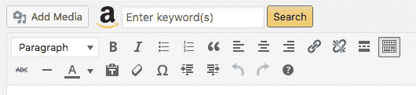

The Amazon Associate Link Builder search form


链接生成器提供了一个管理面板，用户可以从中选择多达九个项目，广告单元模板，关联 ID 和亚马逊市场。

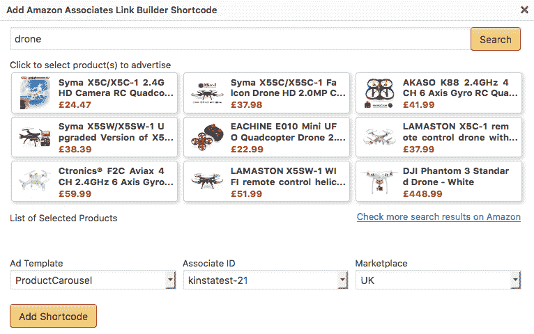

The Amazon Associate Link Builder interface allows to easily build the amazon_link shortcode


完成后，用户提交表单，插件将 **amazon_link** 短代码嵌入到文章内容中。这里有一个例子:


> 需要在这里大声喊出来。Kinsta 太神奇了，我用它做我的个人网站。支持是迅速和杰出的，他们的服务器是 WordPress 最快的。
> 
> <footer class="wp-block-kinsta-client-quote__footer">
> 
> 
> 
> <cite class="wp-block-kinsta-client-quote__cite">Phillip Stemann</cite></footer>

[View plans](https://kinsta.com/plans/)

```
[amazon_link 
asins='B00OCFMVHE,B01KHV5O1G,B01JRS6WR0' 
template='ProductCarousel' 
store='kinstatest-21' 
marketplace='UK' 
link_id='6d481d2c-c629-11e6-bd13-b900ba731a80'] 
```

短代码具有以下属性:

*   **‘asins’**:一个或多个 ASINs(亚马逊标准识别号)的逗号分隔列表。ASIN 是一个字母数字标记，它唯一地标识一个项目。
*   **‘template’**:用于向站点用户显示广告的 HTML 模板。该插件提供了四种模板可供选择:ProductCarousel、ProductAd、ProductGrid、PriceLink。此外，用户可以构建自己的模板。
*   **【store】**:关联 ID，用于监控关联网站的流量和销售额。它的值可以是商店 ID 或跟踪 ID。
*   **‘市场’**:指定亚马逊市场。
*   **‘link-id’**:是广告单元的链接标识符。它由短码生成器生成。

## 配置 Amazon Associates 链接生成器

Amazon Associates Link Builder 的设置页面提供了在我们开始使用该插件之前需要设置的选项列表。

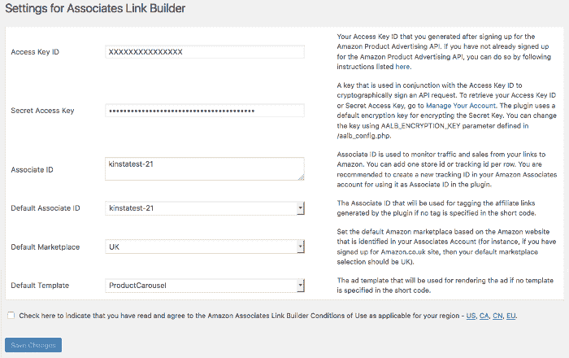

The Amazon Associates Link Builder Settings page


前两个选项字段需要访问密钥和相关秘密，会员可以在[亚马逊的 API 账户页面](https://affiliate-program.amazon.com/gp/advertising/api/detail/your-account.html)中生成(参见[亚马逊在线文档](http://docs.aws.amazon.com/AWSECommerceService/latest/DG/becomingAssociate.html)中的如何成为会员)。

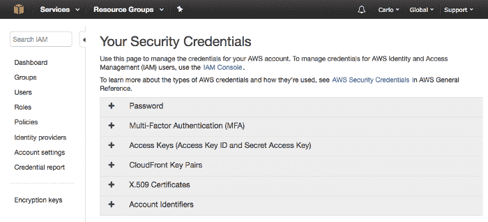

Your Security Credentials console


接下来，associate ID 字段允许注册一个商店 ID 或一个或多个跟踪 ID，Amazon 使用这些 ID 来监控流量和销售额。商店 ID 和跟踪 ID 可以在亚马逊联盟中心创建(参见[联盟文档](http://docs.aws.amazon.com/AWSECommerceService/latest/DG/becomingAssociate.html)了解亚马逊网站的完整列表)。

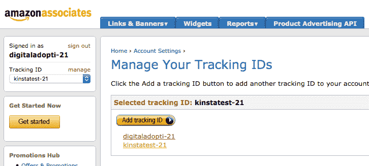

Associates can set their tracking IDs on the Amazon Affiliate Central website


一旦我们确定了关联 ID 的值，我们就可以设置默认的市场。我们可以从几个市场推广商品，但我们必须考虑到任何关联 ID 在特定市场都是有效的。如果你计划在几个亚马逊网站推广产品，你应该在每个市场激活一个商店 ID 或一个(或多个)追踪 ID。最后，我们可以设置默认的广告模板。

## 广告模板

Amazon Associates Link Builder 插件提供了四个向帖子添加广告的模板。

**产品传送带**:该模板在[传送带滑块](https://kinsta.com/blog/wordpress-slider/)中一次显示一个或多个商品。

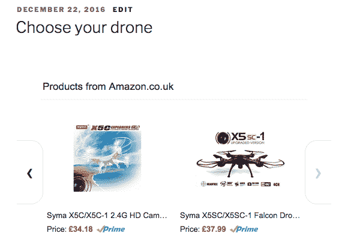

The first built-in template displays items in a carousel slider


**产品广告**:第二个模板与 carousel 模板非常相似，只是它一次只显示一个产品。

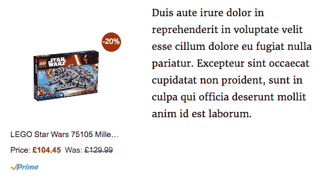

The Product Ad Template embeds a single item ad into post content


**产品网格**:这个模板在文章内容中显示一个项目网格，让读者可以方便地比较产品。

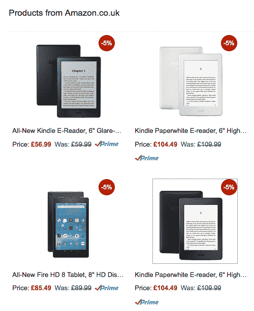

The Product Grid Template displays several items in the same grid


**价格链接**:这个模板包含一个到文章内容的文本链接

## 注册订阅时事通讯


### 想知道我们是怎么让流量增长超过 1000%的吗？

加入 20，000 多名获得我们每周时事通讯和内部消息的人的行列吧！

[Subscribe Now](#newsletter)

除了内置模板，亚马逊的插件允许用户通过创建自定义模板来定制广告单元的外观和感觉，这要归功于 [Mustache 模板引擎](https://github.com/bobthecow/mustache.php/wiki)。让我们深潜。

## 构建自定义模板

Mustache 是一个简单的 web 模板系统，基于用花括号括起来的标签。
小胡子标签可以作为[变量](https://github.com/bobthecow/mustache.php/wiki/Mustache-Tags#variables)或[部分](https://github.com/bobthecow/mustache.php/wiki/Mustache-Tags#sections):

*   **变量**在当前上下文中找到一个值(即{{Title}})。如果找不到值，将不打印任何内容。
*   **sections** 根据当前上下文中的键值，生成一个或多个文本块。开始部分标签以一个英镑开始，而结束标签以一个斜线开始(即**{ { # InStock } } text { {/InStock } }**)。

通过支持 Mustache 模板引擎，链接生成器提供了以下标签:

*   **{{ASIN}}** :产品的亚马逊标准识别号
*   **{{Title}}** :项目的标题或名称
*   **{{DetailPageURL}}** :链接回亚马逊的 URL
*   **{{LargeImageURL}}** :大图片 URL
*   **{{MediumImageURL}}** :中等图像 URL
*   **{{SmallImageURL}}** :小图片网址
*   **{{By}}** :作者、艺术家或品牌名称
*   **{{CurrentPrice}}** :当前价格。如果没有价格，将会显示亚马逊的链接
*   **{{CurrentPriceValue}}** :原始格式的当前价格
*   **{{StrikePrice}}** :厂商建议价格
*   **{{StrikePriceValue}}** :原始格式的执行价格
*   **{{Saving}}** :执行价格的减少
*   **{ {保存百分比}}** :保存百分比
*   **{{SavingValue}}** :以 raw 格式保存
*   **{{Prime}}** :表示物品是否符合 Prime 条件
*   **{{Merchant}}** :如果商品由亚马逊售出并发货，则返回亚马逊。对市场商人没有价值
*   **{{MinimumPrice}}** :新物品的最低价格
*   **{{MinimumPriceValue}}** :原始格式的最低价格
*   **{{InStock}}** :表示产品是否有货。

这个列表并不详尽，学习如何在 Amazon Associates Link Builder 中使用 Mustache 标签的最好地方是插件的模板管理页面。如果你计划构建高级模板，你应该花时间阅读一下 [Mustache 在线文档](https://github.com/bobthecow/mustache.php/wiki)。

也就是说，让我们建立一个非常基本的自定义广告单元模板。首先，我们将获得 PriceLink 模板的代码:

```
{{#Items}}
  {{#Item}}
    {{#aalb}}
     <a href="{{DetailPageURL}}" target="_blank" rel="nofollow">{{CurrentPrice}}!</a>
    {{/aalb}}
  {{/Item}}
{{/Items}} 
```

内置模板不可编辑。为了定制一个内置模板，首先我们必须克隆模板并为副本设置一个新名称。然后，我们可以进行编辑，如下例所示:

Struggling with downtime and WordPress problems? Kinsta is the hosting solution designed to save you time! [Check out our features](https://kinsta.com/features/)

```
{{#Items}}
  {{#Item}}
    {{#aalb}}
      {{#InStock}}{{Title}}: <a href="{{DetailPageURL}}" target="_blank" rel="nofollow">{{CurrentPrice}}!</a> {{/InStock}}
    {{/aalb}}
  {{/Item}}
{{/Items}} 
```

在这个自定义模板中，我们添加了 **{{InStock}}** 部分标签，这样，如果商品缺货，HTML 内容就不会显示出来。
**{{Title}}** ， **{{DetailPageURL}}** ， **{{CurrentPrice}}** 变量会显示相应的项目数据。

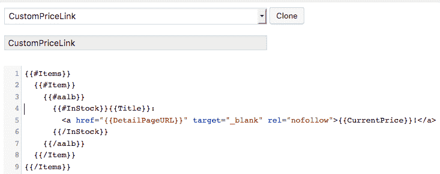

The Templates admin page allows affiliates to create and edit ad templates


得益于大量的 CSS 类，我们可以定制单元结构和单元表示。不幸的是，在撰写本文时，亚马逊开发团队没有提供这些类的文档，所以我们只能在模板管理界面中查看样式表。

ad 单元被包装在具有 **aalb-pc-ad-unit** 类的 **div** 中，而 **aalb-pc-ad-header** 类应用于 **h2** 标题。例如，我们可以通过编辑以下声明块来自定义 ProductCarousel 克隆中文本内容的外观:

```
.aalb-363-pc-ad-unit .aalb-363-pc-product-title a {
  display: block;
  width: 100%;
  overflow: hidden;
  white-space: nowrap;
  text-overflow: ellipsis;
  font-size: 13px;
  color: #111111;
  text-decoration: none;
} 
```

注意类选择器中的数字子串。当模板被复制时，它是插件添加到所有类名中的一个数字。我们应该在编辑模板时考虑到这一点。现在只需将文本颜色的值从默认的深灰色改为红色:

```
.aalb-363-pc-ad-unit .aalb-363-pc-ad-header a {
  color: red;
} 
```

另一个需要考虑的有用的类是 **no-truncate** ，它可以防止插件截断广告单元的文本内容。 **no-truncate** 应该和 **aalb-pc-ad-unit** 类一起添加。这里有一个例子:

```
<div class="aalb-363-pc-ad-unit no-truncate" id="{{ID}}">...</div>
```

最后，我们可以欣赏内置 ProductCarousel 模板和它的定制克隆之间的差异。

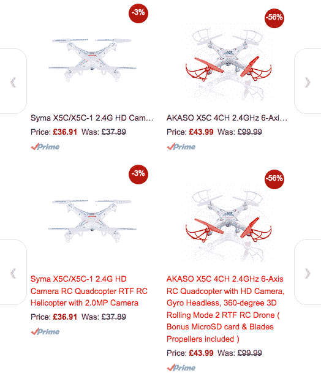

The image shows the output of built-in ProductCarousel template and a custom version of the same template


Amazon Associates Link Builder 为在 WordPress 网站上推广亚马逊的产品提供了一种快速简便的方法。它不需要编程技能和模板功能应涵盖网站所有者的最常见的要求。但是如果你需要更高级的特性、支持服务和对产品展示的更深层次的控制，你应该将官方插件与商业许可下发布的一个或多个工具进行比较。

## WordPress 的亚马逊联盟(AAWP)

另一个流行的高级插件是 WordPress 的亚马逊联盟插件，这是一个强大而易于使用的亚马逊联盟插件。像 Amazion Associates Link Builder 一样，AAWP 使用亚马逊产品广告 API 从亚马逊目录中检索产品信息。该插件提供了一套四个内置模板，可以轻松地为选定的产品构建广告单元。此外，用户可以通过编辑现有模板或构建自己的定制模板来定制广告展示，如 [AAWP 模板教程](https://getaawp.com/docs/article/templating)中所述。

此外，该插件允许检索和显示**单个数据字段**，网站所有者可以使用它来构建高级产品表。

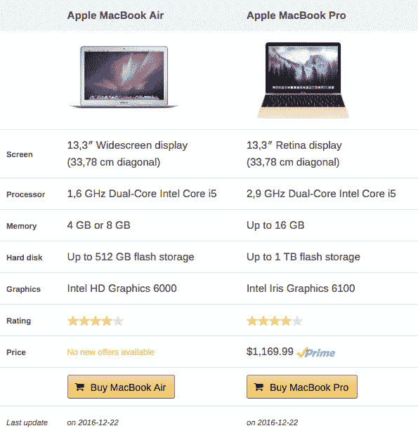

A product table built using single data fields


AAWP 的其他优势是**小工具**、一个**缓存功能**、**畅销书和新发布作品的自动列表**，以及一个高效的**支持服务**。该插件分三个版本:标准版(39.00 欧元)、商业版(99.00 欧元)和开发者版(199.00 欧元)。每个计划包括一年的更新和支持。亚马逊联盟目前支持以下市场:德国，美国，英国，法国，日本，意大利，加拿大，西班牙，印度和巴西。

## 摘要

官方的 Amazon Associates Link Builder 提供了一种快速简单的方法来推广 Amazon 产品。它易于使用，易于配置，并配备了你可能需要的所有基本功能[货币化你的网站内容](https://kinsta.com/blog/how-to-monetize-a-blog/)。而且是免费的！

另一方面，像 AAWP 这样的商业插件通常允许对产品广告进行更高级的控制，但它们不是免费的。因此，如果你的网站的主要目标是推广亚马逊的产品，AAWP 可能是一个不错的选择。相反，如果你的目标主要是生产内容和剩余推广产品，你可能会更喜欢亚马逊准链接生成器插件。

* * *

让你所有的[应用程序](https://kinsta.com/application-hosting/)、[数据库](https://kinsta.com/database-hosting/)和 [WordPress 网站](https://kinsta.com/wordpress-hosting/)在线并在一个屋檐下。我们功能丰富的高性能云平台包括:

*   在 MyKinsta 仪表盘中轻松设置和管理
*   24/7 专家支持
*   最好的谷歌云平台硬件和网络，由 Kubernetes 提供最大的可扩展性
*   面向速度和安全性的企业级 Cloudflare 集成
*   全球受众覆盖全球多达 35 个数据中心和 275 多个 pop

在第一个月使用托管的[应用程序或托管](https://kinsta.com/application-hosting/)的[数据库，您可以享受 20 美元的优惠，亲自测试一下。探索我们的](https://kinsta.com/database-hosting/)[计划](https://kinsta.com/plans/)或[与销售人员交谈](https://kinsta.com/contact-us/)以找到最适合您的方式。