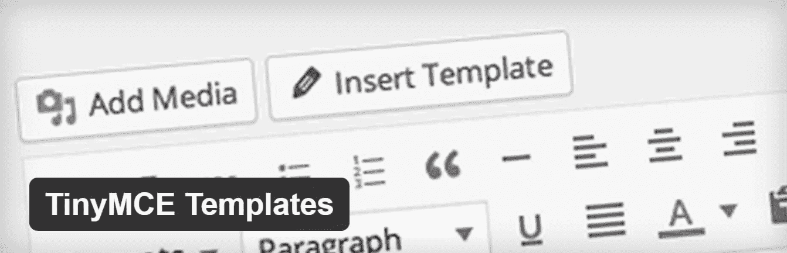
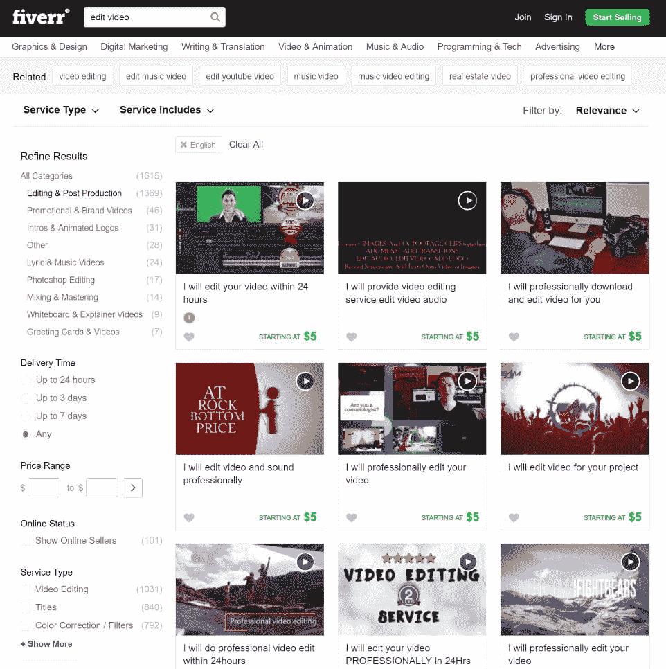
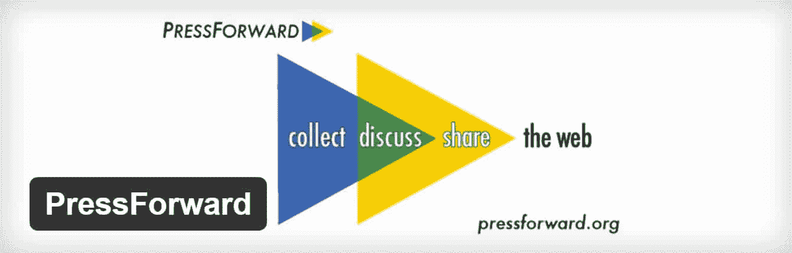
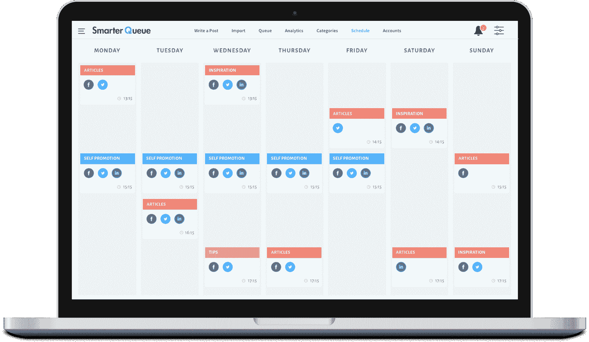
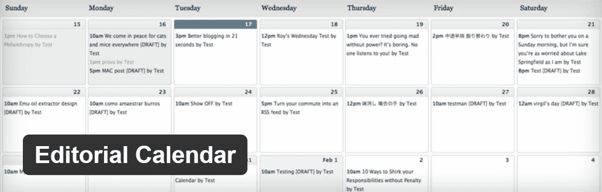
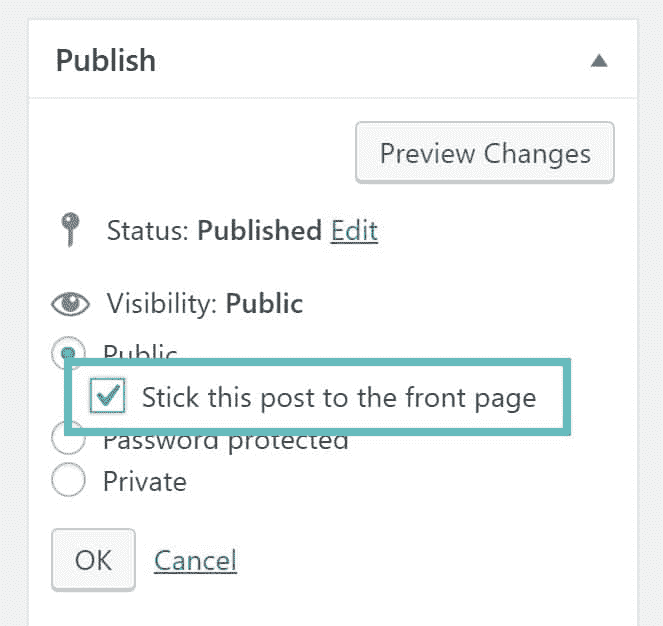

# 如何用 WordPress 做一个单人内容营销忍者

> 原文：<https://kinsta.com/blog/content-marketing-ninja/>

内容营销风靡一时。但是有如此多的活动要处理——从内容编写和分发到 [SEO](https://kinsta.com/blog/what-does-seo-stand-for/) 和性能优化——有效地执行和管理它变得非常困难。因此，市场正受到来自四面八方的内容营销自动化工具的狂轰滥炸。无论是 Hubspot、Marketo 还是 Act-On，每一个都需要数千美元的实施和维护投资，并承诺让你的业务好转。

但有两个大问题让我对这种情况感到畏缩:

*   在他们寻求从单一软件平台实现一切的过程中，所有这些工具都牺牲了独立应用程序可实现的灵活性和质量。然而，价格被吹到了屋顶。
*   这些工具**主要是为拥有专门内容营销团队的大企业**打造的。但是根据这些数字，我可以有把握地假设你是一个独立创业者，或者是你团队中唯一负责内容营销的人。

那么，作为你企业的一个人内容营销部门，你如何才能以一种既有效又负担得起的方式推广你的内容，同时又能留出足够的时间去做其他同样重要的事情呢？好消息是，WordPress，以及一些第三方应用和插件，可以成为你从你的内容中获得最大回报所需要的一切，而且成本要低得多。

## 成为单人内容营销忍者的技巧

这里有一些在 WordPress 中成为一个更有效率的内容营销忍者的最好方法。

1.  [获得托管 WordPress 主机](#managed-wordpress-hosting)
2.  [利用内容模板](#content-templates)
3.  [外包大部分活动](#outsource)
4.  [策划内容](#curate-content)
5.  [使用自动内容分发](#automate-content-distribution)
6.  [利用清单](#checklists)
7.  [改变内容用途](#repurpose-content)
8.  利用编辑日历
9.  [重新发布旧内容](#republish-content)
10.  [重复有用的&抛弃无用的](#repeat)

### 1.获取托管 WordPress 主机

获得[廉价主机](https://kinsta.com/blog/cheap-wordpress-hosting/)是刚入门[内容营销](https://kinsta.com/learn/content-marketing/)的创业者最大的缺点之一。像 [Hostinger](https://kinsta.com/hostinger-alternative/) 和 [SiteGround](https://kinsta.com/siteground-alternative/) 这样的托管公司提供便宜的方案，但是从长远来看，选择低成本托管会让你付出代价。你不能让你的网站有低标准。一个低质量的主机提供商不仅在出现问题时缺乏适当的支持，比如[被黑客攻击](https://kinsta.com/blog/wordpress-hacked/)或者系统停机，而且还会让你独自保护和备份你的网站。

> Kinsta 把我宠坏了，所以我现在要求每个供应商都提供这样的服务。我们还试图通过我们的 SaaS 工具支持达到这一水平。
> 
> <footer class="wp-block-kinsta-client-quote__footer">
> 
> 
> 
> <cite class="wp-block-kinsta-client-quote__cite">Suganthan Mohanadasan from @Suganthanmn</cite></footer>

[View plans](https://kinsta.com/plans/)

一个高质量的应用程序、数据库和托管的 WordPress 主机(比如 Kinsta)不仅会节省你更新和管理网站的宝贵时间，还会让你比竞争对手更有优势。您可以获得改进的网站功能和卓越的速度。

托管 WordPress 主机可能会让你花更多的钱，但是这不是一笔开销。这是一项投资，以确保坚实的基础。

[Managed WordPress hosting is an investment to ensure a solid foundation.Click to Tweet](https://twitter.com/intent/tweet?url=https%3A%2F%2Fbit.ly%2F2txALcd&via=kinsta&text=Managed+WordPress+hosting+is+an+investment+to+ensure+a+solid+foundation.&hashtags=WordPress%2Chosting)

### 2.利用内容模板

与你可能相信的相反，大多数读者不仅对遵循某个模板的内容感到满意，而且他们甚至很难注意到这一点。最好的内容营销者是那些知道并利用这一事实来节省时间的人。这并不是说你写的每篇博文都应该遵循一个模板，但是很多都可以。事实上，你可以根据你写的文章类型创建几个模板。

例如，一个模板可以被创建并用于你所有的“如何”文章，另一个用于“回顾”文章，还有一个用于“列表”文章等等。你明白了吗？

 **免费的现成内容模板**

幸运的是，Neil Patel 非常慷慨地提供了 [12 个现成的模板，用于快速轻松地创建内容](https://www.quicksprout.com/the-advanced-guide-to-content-marketing-chapter-6/)。把它们当作你的灵感或者用它们来写高质量的内容。

**向 WordPress 编辑器添加内容模板**

一旦你创建了可以应用于你想写的几篇文章的模板，问题是你如何让它们与 [WordPress 文章编辑器](https://kinsta.com/blog/wordpress-text-editor/)一起工作？一个显而易见的解决方案是将每个模板保存为 HTML 文件或记事本中的内容块。但是你总是需要一些时间来访问保存的文件，并从那里粘贴内容来开始你的文章。

此外，每次你在不同的电脑上，你都会诅咒你的运气。如果你能把你的模板和你的 WordPress 集成在一起，那不是很好吗？然后你可以在任何 WordPress 帖子或页面中轻松使用它们，而无需离开帖子编辑器。我知道你在想什么。是啊！有一个插件可以做到这一点。它叫做 [TinyMCE 模板](https://wordpress.org/plugins/tinymce-templates/)。

[T2】](https://wordpress.org/plugins/tinymce-templates/)

### 3.外包大多数活动

正如我在开始时提到的，作为一个内容营销人员，有太多的事情要做，所以最好尝试外包你的大部分任务。此外，某个只在那个领域有专长的人会比你做得更好更快。例如:

*   为了让你的内容在社交媒体上疯狂分享，使用像 [Quuu Promotions](http://quuupromote.co/) 、 [Viral Content Bee](http://viralcontentbee.com/) 、 [CoPromote](https://copromote.com/) 或 [JustReTweet](http://www.justretweet.com/) 这样的服务。
*   如果你想研究或影响者外联完成，你可以尝试像[红管家](https://www.redbutler.com/)或[花式手](https://www.fancyhands.com/)的网站。
*   如果你需要完成一些设计工作(比如一个很酷的信息图、电子书封面、你的社交媒体帖子的图片或博客标题)，请查看 [99Designs](https://99designs.com/) 、 [DesignPickle](http://designpickle.com/) 、 [Undullify](http://www.undullify.com/) 或 [Flocksy](http://flocksy.com/) 。这就像让一个平面设计师处于“待机状态”，每月只需 125-400 美元。
*   如果需要引人注目的或者[常青的内容](https://kinsta.com/blog/evergreen-content/)，可以[聘请文案](http://smemark.com/)(我无耻的插一句)。给他们你的草稿，或者只是告诉他们你需要什么，他们会根据你的需要写一份经过润色和具体的副本。此外，确保在发布前校对每一条内容。以下是我们最好的[校对技巧](https://kinsta.com/blog/proofreading-tips/)。
*   对于这份名单上和名单外的任何工作，也有通用的自由职业者平台，如 [Upwork](http://upwork.com/) 和[自由职业者](https://www.freelancer.com)。如果你有一个定制的项目，你可以在那里发布你的需求。
*   如果你想制作或编辑视频或音频播客，你可以选择一个免费的视频编辑软件解决方案，或者从 T2 上的几家低成本提供商那里获得(这里是如何开始使用 T4 播客和 WordPress 的方法)。我们整理了一个可能有用的指南:[如何使用 Fiverr 减少业务繁忙](https://kinsta.com/blog/hire-wordpress-developer/)。

正如你所看到的，当涉及到有效和负担得起的外包内容营销时，并不缺乏资源。

### 4.管理内容

内容监管是一种分享他人创作的内容的艺术(你可以给他们一个荣誉或链接)。正如许多人错误认为的那样，这不是懒惰型内容营销者的策略。

这个想法是从外部资源中精选优秀的内容，并在你的潜在客户中分发，加入你自己独特的视角或观点。[这里是](http://www.scribblelive.com/blog/2016/05/03/invest-content-curation/)一些在内容监管方面取得成功的企业的主要优势和例子。监管可以帮助你将花在内容营销上的时间减少 20%以上，同时给你更多(如果不是相同的话)权威、社交分享和流量，就像你自己的新鲜内容一样。

但是请记住，管理和窃取内容之间只有一线之隔。在内容监管中，必须给出关于内容和上下文的细节。除了过滤各种各样的内容，通过使用注释增加价值，帮助观众更好地理解你为什么与他们分享这个资源。

**WordPress 中的内容管理**

## 注册订阅时事通讯

### 想知道我们是怎么让流量增长超过 1000%的吗？

加入 20，000 多名获得我们每周时事通讯和内部消息的人的行列吧！

[Subscribe Now](#newsletter)

有许多第三方应用程序和插件的设计都考虑到了监管。还有一些网站的核心是内容聚合，但也有监管功能。

[T2】](https://wordpress.org/plugins/pressforward/)

*   [Press Forward](https://wordpress.org/plugins/pressforward/) 是一个免费的插件，它提供了一个工作流程来收集和管理你的 WordPress 仪表盘上的大量来源的内容。它的一长串功能包括:一个集成的 feed 阅读器，一个在浏览时收集内容的 bookmarklet，以及重新发布聚合内容的能力。
*   [策展套件](https://curationsuite.com/)是 WordPress 的可视化策展解决方案，可以轻松搜索内容，快速发布带有引用的帖子，并通过社交媒体渠道即时分发内容。最好的部分是:内容以一种不会与你的主题或其他安装的插件发生冲突的方式被添加到帖子编辑器中。
*   我的馆长一直在后台工作，为你提供源源不断的有趣内容。它的 bookmarklet 可以让你在浏览网页的同时管理内容，笔记本功能可以让你保存你想要在管理的文章中使用的内容。

通过使用这些插件中的一个或多个，你可以为你的网站添加有价值的内容，而不必自己编写。

### 5.使用自动化内容分发

除了节省宝贵的时间，分发工具最大的优势是分析。当你使用内容调度和分发工具，如 [SmarterQueue](https://smarterqueue.com/) 、 [Buffer](https://buffer.com/) 或 [Hootsuite](https://hootsuite.com/) 时，你会获得关于什么类型的内容和社交媒体渠道[产生更多流量](https://kinsta.com/blog/how-to-drive-traffic-to-your-website/)和线索以及什么不起作用的宝贵见解。

[T2】](https://smarterqueue.com/)

然后，你可以根据客观数据而不是有偏见的理论或直觉来改变你的内容管理和创作。如果你经常发现自己不知道哪些内容需要重新分享，或者被困在谷歌分析中，这些工具中的一个可以减轻你的负担。

**用 WordPress 整合缓冲区**

使用 [WordPress To Buffer 插件](https://wordpress.org/plugins/wp-to-buffer/)，你可以很容易地将 WordPress 页面和帖子发送到你的 Buffer(bufferapp.com)账户，以安排内容在你活跃的社交网络上发布。还有一个专业版，具有大量其他功能，如 Pinterest 集成，每个帖子的不同状态，每个帖子的特色图片，自定义日程安排设置等。

**回收万年青内容**

使用 SmarterQueue，您甚至可以将您的 [evergreen 内容](https://kinsta.com/blog/evergreen-content/)回收到一个永无止境的队列中。这样可以节省很多时间，保证大家最终看到你有价值的内容。

### 6.利用清单

错误会消耗你大量的时间，并造成不可挽回的损失。这就是为什么清单是飞行员日常工作不可或缺的一部分。即使非飞行员也能从使用清单中受益匪浅。此外，清单不仅会简化你的内容营销，还会让你更容易将任务委托给别人。作为内容营销策略的一部分，你所做的每一件事都可以用一个清单来确保质量和一致性。这里有一些很棒的免费清单资源，你可以马上开始使用。

Struggling with downtime and WordPress problems? Kinsta is the hosting solution designed to save you time! [Check out our features](https://kinsta.com/features/)

*   [终极内容推广清单](https://wpcurve.com/the-ultimate-content-promotion-checklist/) : 97 个优化内容营销各个方面的问题
*   [SEO 文案技巧](https://www.authorityhacker.com/seo-copywriting/):点击发布按钮之前，确保你的内容已经过搜索引擎优化
*   [WordPress SEO 清单](https://kinsta.com/blog/wordpress-seo/)–2017 年的 45 条建议–确保你使用 WordPress 和 SERPs 的最佳实践
*   WordPress 的最佳 SEO 插件(和必备的 SEO 工具)
*   一份详细的备忘单描述了脸书、推特、YouTube 等社交媒体渠道的正确图片尺寸
*   初创公司&小企业网络文案的 101 条该做和不该做的终极清单。
*   Trello 有一个[便捷的清单功能](http://help.trello.com/article/737-adding-checklists-to-cards)来促进内容创建过程。建议阅读:[特雷罗 vs 阿萨纳](https://kinsta.com/blog/trello-vs-asana/)。

### 7.改变内容的用途

你可以使用我上面列出的内容模板来发布你的大部分内容，而其余的可以使用[各种内容格式](http://www.siegemedia.com/creation/15-content-templates-to-help-scale-quality)来发布，包括你以前没有尝试过的格式。释放你的创造力，以各种方式重新利用你的内容。例如，你可以把你的内容变成:

*   全面的 PDF 电子书或报告。这可以通过创建一个 Word 文档并[将其转换为 PDF](http://smallpdf.com) 来完成，或者使用 PDF 创建工具，如 [PDFForge](http://www.primopdf.com/) 或 [Adobe Acrobat Pro](https://acrobat.adobe.com/us/en/acrobat/acrobat-pro.html) 。确保你在最好的 [WordPress PDF Viewer 插件](https://kinsta.com/blog/wordpress-pdf-viewer-plugins/)上阅读了我们的帖子。
*   与各种专家合作的一系列网络研讨会。这里有一个很好的[分步指南](http://techbloke.com/host-webinar-with-google-hangouts-on-air/)来主持一个关于 Google Hangouts 的网上研讨会。
*   可以反复参考的测验、清单或模板。有许多[高质量的测验插件](https://kinsta.com/blog/wordpress-quiz-plugins/)可以用来测试你的潜在客户。
*   社交媒体更新会在几周或几个月内传播，并通过 Buffer 或 Hootsuite 在脸书、Twitter 等网站上分享。
*   使用 [Canva](http://www.canva.com) 和 [Animoto](https://animoto.com/) 可以轻松创建视频、信息图表、幻灯片分享和更多可视化内容。

### 8.利用编辑日历

与生活中的大多数事情一样，管理内容营销活动的过程中会有惊喜。有一个编辑日历对于节省时间和完成工作是至关重要的。它可以让你提前计划内容，并在吸引你的潜在客户和产生更多的线索方面大有作为。一种选择是使用 Trello 或 MS Excel 等应用程序来创建和管理内容日历。但是和其他步骤一样，有很多 WordPress 插件可以让这个过程变得更容易更快。

**整合内容日历和 WordPress**

[编辑日历](https://wordpress.org/plugins/editorial-calendar/)拥有 50，000+的安装量和大部分 5 星评论，是这一类别中最受欢迎的 WordPress 插件。它可以让你从一个地方获得所有预定帖子的整体视图，以及它们将被发布的日期和时间。

[T2】](https://wordpress.org/plugins/editorial-calendar/)

使用内置的拖放功能，您可以通过鼠标点击将帖子从一个时间移动到另一个时间。作为个人营销者，编辑日历插件足以满足你的内容营销工作。内容创意用完了？看看这些[热门博客话题](https://blogging.org/blog/popular-blogging-topics/)。

### 9.重新发布旧内容

如果你写博客已经有一段时间了，我敢肯定你已经写了一些优秀的和常青的帖子。然而，根据博客的工作方式，旧帖子不断被新帖子取代。重新发布内容是从你以前的帖子中获得更多收益的一种行之有效的方法，尤其是从你表现最好的内容中。

**重新发布旧的 WordPress 帖子**

要在 WordPress 中重新发布以前的文章，编辑文章以打开编辑器。然后导航到右侧的发布框。然后点击“编辑”链接。但请记住，重新发布并不意味着简单地改变发布日期，并将帖子放在主页上。相反，你应该用最新的信息和数据更新帖子。有价值的读者总是喜欢更新的内容；这是告诉他们你真的在乎他们的一种方式。

你也可以使用[类别粘帖插件](https://wordpress.org/plugins/category-sticky-post/)来恢复旧帖子，并使它们回到顶部。或者使用 WordPress 自带的“贴吧”选项。

### 10.重复有用的东西，抛弃无用的东西

一旦您开始遵循这些最佳实践，将会有源源不断的有价值的分析数据来帮助您做出明智的决策。这包括:

*   [脸书页面](https://kinsta.com/blog/how-to-create-a-facebook-page)洞察您的脸书更新的覆盖范围和参与度
*   Twitter 分析哪些推文获得了最多的点赞和转发
*   缓冲或 Hootsuite 分析哪些内容在哪些频道上表现最好
*   谷歌分析关于哪些内容和分销渠道获得了最多线索的数据
*   你在博客帖子上获得的社交分享和评论

连同你的链接跟踪数据(例如使用 bit.ly ),上面的信息对于评估你的内容的有效性非常有用。因此，你可以创建和策划更多有用的内容，而不要在无用的内容上浪费精力。

## 摘要

它周围没有糖衣。我承认，成为一名独立的内容营销者并不容易。但是我确信在工具的帮助下你会更有效率。直到你有预算雇用更多的员工，使用这些技巧和资源，让你的内容营销更上一层楼！

* * *

让你所有的[应用程序](https://kinsta.com/application-hosting/)、[数据库](https://kinsta.com/database-hosting/)和 [WordPress 网站](https://kinsta.com/wordpress-hosting/)在线并在一个屋檐下。我们功能丰富的高性能云平台包括:

*   在 MyKinsta 仪表盘中轻松设置和管理
*   24/7 专家支持
*   最好的谷歌云平台硬件和网络，由 Kubernetes 提供最大的可扩展性
*   面向速度和安全性的企业级 Cloudflare 集成
*   全球受众覆盖全球多达 35 个数据中心和 275 多个 pop

在第一个月使用托管的[应用程序或托管](https://kinsta.com/application-hosting/)的[数据库，您可以享受 20 美元的优惠，亲自测试一下。探索我们的](https://kinsta.com/database-hosting/)[计划](https://kinsta.com/plans/)或[与销售人员交谈](https://kinsta.com/contact-us/)以找到最适合您的方式。