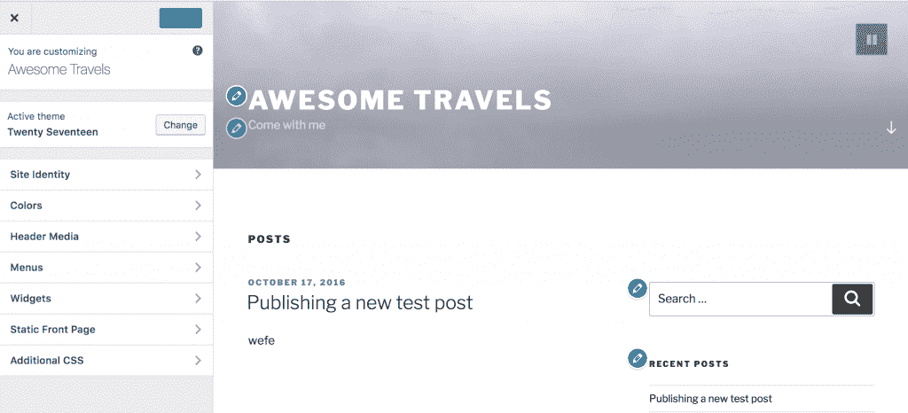
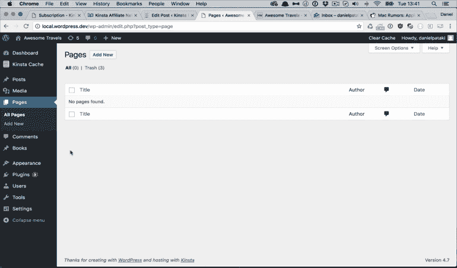
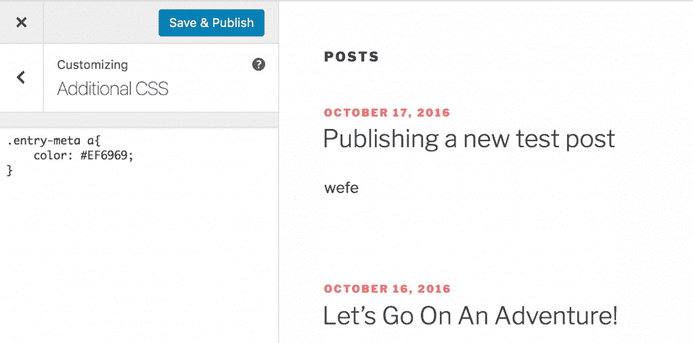
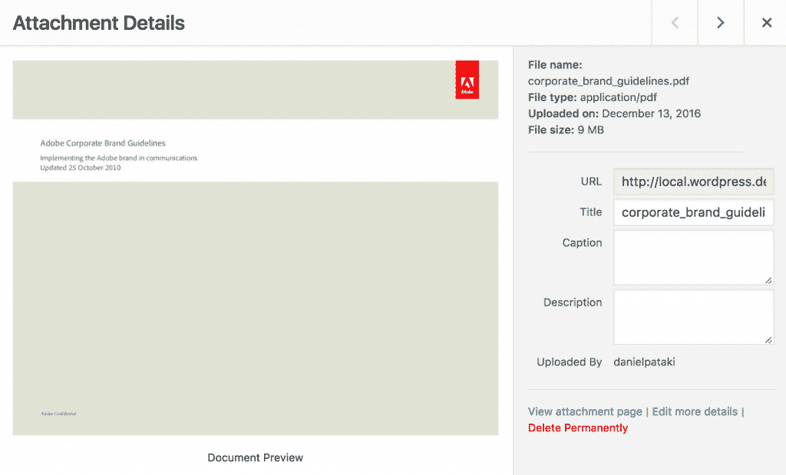

# WordPress 4.7 的新功能

> 原文：<https://kinsta.com/blog/wordpress-4-7/>

我们最喜欢的 CMS 的最新也是最棒的版本，[WordPress 4.7](https://wordpress.org/news/2016/12/vaughan/)“Vaughan”于一周前的 12 月 6 日发布。它包括一个全新的默认主题，新的定制选项和许多开发者特性。

**更新**:[WordPress 5.3 的新功能](https://kinsta.com/blog/wordpress-5-3/)

*   [用户体验](#user-experience)
*   [WordPress 4.7 中更好的菜单构建体验](#menu-building-wordpress-4-7)
*   [开发者的改变](#changes-developers)
*   [在 Kinsta 上更新到 WordPress 4.7](#updating-to-wordpress-4-7-kinsta)

## 用户体验

我们最喜欢的 WordPress 4.7 特性是改善用户体验的特性(UX)。WordPress 长期以来一直是一个技术上有能力的系统，但在用户界面和体验方面明显落后了一段时间。

### 视频标题

某种运动已经在头球中使用了一段时间了。从动画 gif 到精心制作的[滑块](https://kinsta.com/blog/wordpress-slider/)和视频。视频经常被归入自定义实现，但由于核心团队的努力，应该会得到更广泛的应用。

Header video in WordPress 4.7

### 编辑快捷方式

主题定制器通过快捷图标得到了增强，您可以单击这些图标直接进入控制相关元素的字段。对于更复杂的主题来说，这是一个很好的特性，因为你甚至不知道什么可以编辑，更不用说它在哪里了。

Editor Shortcuts in WordPress 4.7

真的感觉这是前端编辑器般体验的下一步，在这里你可以编辑任何你需要的东西。这可能还需要一段时间，但这已经大大改善了网站创建体验。

## WordPress 4.7 中更好的菜单构建体验

我认为这个最能代表发展方向。如果你经常建立新网站，你就会知道菜单有多烦人。当你构建这个东西的时候，你想放在菜单里的页面需要存在。然而，如果你先构建菜单，绘制页面就容易多了，它就像一个快速原型工具。

Menu Building In WordPress 4.7

### 自定义 CSS

过去许多主题都添加了这个功能，现在它终于出现在核心代码中了。你可以在主题定制器中添加你的自定义 CSS，包括实时预览，太棒了！

Custom CSS in WordPress 4.7

### PDF 预览

上传 pdf 现在将生成缩略图预览，这使得区分项目更加容易。使用 WordPress 上传文档的人会喜欢这个功能的！

## 注册订阅时事通讯

### 想知道我们是怎么让流量增长超过 1000%的吗？

加入 20，000 多名获得我们每周时事通讯和内部消息的人的行列吧！

[Subscribe Now](#newsletter)

PDF Preview in WordPress 4.7

### 用户语言

用户现在可以更改他们看到管理员时使用的语言。用户级别的更改不会以任何方式影响前端或其他用户。这对于管理多语言网站的管理员和网站管理者来说是天赐之物。

## 开发人员的变化

除了这些 UX 的改进，WordPress 4.7 还为开发者提供了很多好处。

### 帖子类型模板

我们已经使用页面模板很多年了，它们为主题中的一些伟大功能提供了架构。开发者现在可以注册[帖子类型模板](https://make.wordpress.org/core/2016/11/03/post-type-templates-in-4-7/)，使得 WordPress 在 CMS 部门更加强大。

### 自定义批量操作

从 4.7 开始，您现在可以在列表屏幕上注册[批量操作](https://make.wordpress.org/core/2016/10/04/custom-bulk-actions/)。这意味着，除了将多篇文章移至垃圾箱，你还可以批量“删除所有类别”或批量“主页上的功能”。这确实需要一些自定义编码，但在将来对开发人员来说将是一个方便的特性。

### Rest API 附加

关于 WordPress REST API，[内容端点](https://make.wordpress.org/core/2016/10/08/rest-api-merge-proposal-part-2-content-api/)已经被合并到核心中。这将为应用程序提供发布、评论、术语、用户和元数据以及设置的编程访问。

## 然后一些！

还有一些其他伟大的开发更新，如对 WP_Hook 系统的返工，自定义变更集等等。看一下官方[发布帖](https://wordpress.org/news/2016/12/vaughan/)了解全貌。

如果你对 WordPress 的开发感兴趣，想尝试最新的夜生活或者只是想在其他人之前了解最新的变化，我建议你去 make.wordpress.org。[核心](https://make.wordpress.org/core/)部分将包含最具影响力的变化，但其他部分也同样有趣。

## 在 Kinsta 上更新到 WordPress 4.7

我们已经收到一些客户在更新到 WordPress 4.7 时经历[白屏死亡](https://kinsta.com/blog/wordpress-white-screen-of-death/)的报告。这通常可以通过简单的[重启 PHP/HHVM](https://kinsta.com/help/restart-php/) 和[删除你的 WordPress 站点上的整个页面缓存](https://kinsta.com/blog/wordpress-clear-cache/)来解决。

由于每个客户的站点都不同，我们总是建议利用[暂存环境](https://kinsta.com/help/staging-environment/)或者更进一步，利用我们的[高级暂存环境](https://kinsta.com/help/premium-staging-environments/)。你可以在几秒钟内克隆你的网站，然后用你现有的主题和插件测试 WordPress 4.7 来检查兼容性。

当然，为了安全起见，你也可以在更新你的网站之前进行手动备份。

—

相片信用:[维基媒体公社](https://commons.wikimedia.org/wiki/File:Sarah_Vaughan_-_William_P._Gottlieb_-_No._1.jpg)

* * *

让你所有的[应用程序](https://kinsta.com/application-hosting/)、[数据库](https://kinsta.com/database-hosting/)和 [WordPress 网站](https://kinsta.com/wordpress-hosting/)在线并在一个屋檐下。我们功能丰富的高性能云平台包括:

*   在 MyKinsta 仪表盘中轻松设置和管理
*   24/7 专家支持
*   最好的谷歌云平台硬件和网络，由 Kubernetes 提供最大的可扩展性
*   面向速度和安全性的企业级 Cloudflare 集成
*   全球受众覆盖全球多达 35 个数据中心和 275 多个 pop

在第一个月使用托管的[应用程序或托管](https://kinsta.com/application-hosting/)的[数据库，您可以享受 20 美元的优惠，亲自测试一下。探索我们的](https://kinsta.com/database-hosting/)[计划](https://kinsta.com/plans/)或[与销售人员交谈](https://kinsta.com/contact-us/)以找到最适合您的方式。