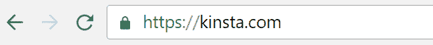
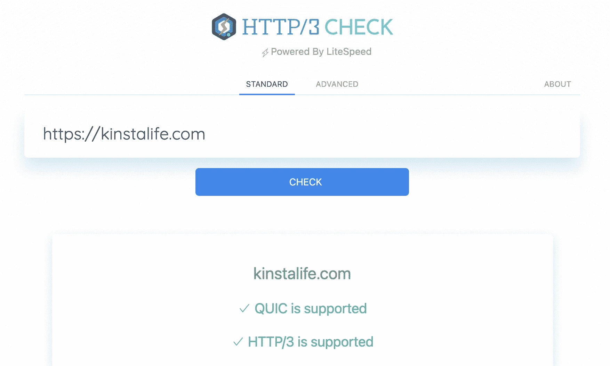
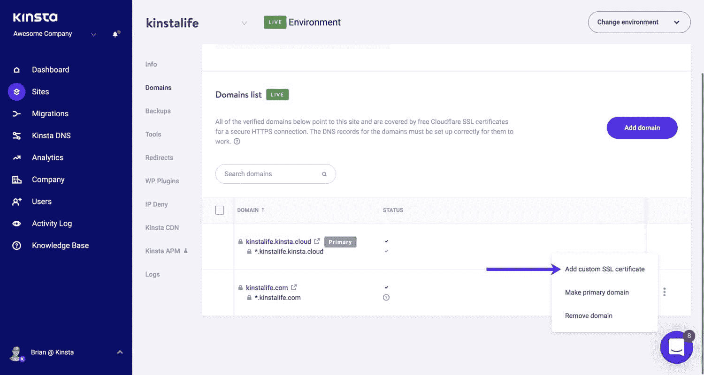
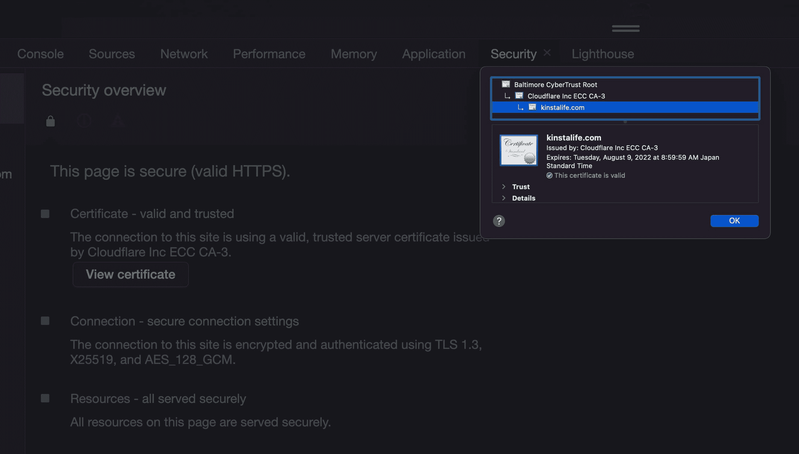
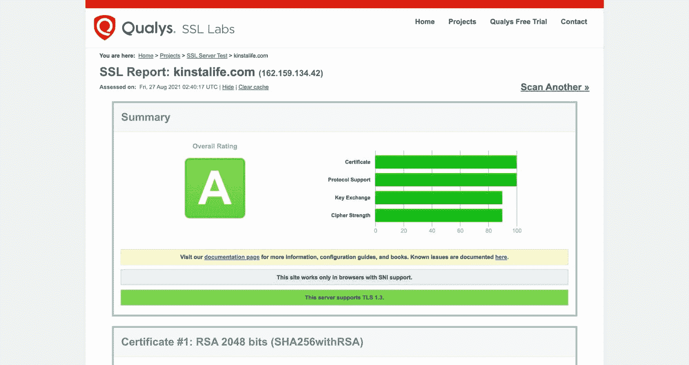

# 来自 Kinsta 的免费 SSL 证书和托管

> 原文：<https://kinsta.com/blog/free-ssl-certificate/>

Kinsta 的客户可以利用 Kinsta 的 [Cloudflare integration](https://kinsta.com/cloudflare-integration/) ，它包括所有 WordPress 站点的自动和免费 SSL 证书。最重要的是，我们的免费 Cloudflare SSLs 甚至支持通配符域。在本文中，您将了解更多关于 HTTPS 的重要性，以及在管理 WordPress 站点的 SSL 证书时，Kinsta 的免费 Cloudflare SSLs 如何简化您的工作流程。

## 免费 SSL 对你来说意味着什么？

通过我们的 Cloudflare 集成访问免费的 SSL 证书，您不再需要处理获取证书密钥、私钥、调试中间证书、生成 CSR 以及安装 SSL 的混乱过程。

一旦你的[域](https://kinsta.com/help/add-domain/)建立了一个 Kinsta，SSL 就自动开始工作，不需要任何额外的步骤！这些来自 Kinsta 的免费 SSL 也是完全安全的。Cloudflare 是全球领先的网络安全公司之一，他们为全球数百万个网站处理 SSL 终端。

Valid SSL padlock.

免费的 SSL 证书并不意味着它们不安全。实际上，它们和付费 SSL 一样安全，因为这两个选项都使用安全的 256 位加密(SHA256)，这是全球主要金融和政府机构使用的相同加密算法。此外，您再也不必担心由于 SSL 证书过期而导致站点停机，因为我们实施的免费 SSL 证书会自动更新。！

Cloudflare SSLs 不提供组织验证(OV)或扩展验证(EV)功能。这意味着证书没有担保，担保是最终用户在受 SSL 保护的网站上提交付款时防止财务损失的保险。

OV 和电动汽车 SSL 是利基产品，它们通常需要一个人来处理购买申请。因此，如果你是一家需要 OV 或 EV SSL 来满足某些业务需求的企业或企业，你需要从第三方供应商那里购买，然后作为自定义 SSL 安装在 Kinsta 上。

除了根域和子域，Kinsta 通过 Cloudflare 提供的免费 SSL 还附带了通配符域支持！一个[通配符 SSL](https://kinsta.com/knowledgebase/wildcard-ssl/) 可以保护任意数量的[子域名](https://kinsta.com/blog/wordpress-subdomain/)(例如* . domain . com)——这对于依赖大量子域名的商业和教育网站尤其有用。这允许对一个域及其所有子域使用单个证书和密钥对，从而大大简化了 HTTPS 部署。

### HTTPS 的好处

在 HTTPS 上实现一个免费的 SSL 证书和运行你的 WordPress 站点有很多好处:

*   您的数据现已加密且安全。从不传递纯文本。这对电子商务交易很重要，甚至对登录你的 WordPress 网站也很重要。
*   谷歌官方称 [HTTPS 是排名因素](https://kinsta.com/blog/wordpress-seo/#30-install-an-ssl-certificate)。
*   绿色挂锁栏有助于为你的访客建立信任和信誉。
*   避免 Chrome 警告，它会将收集密码或信用卡的 HTTP 页面标记为不安全。
*   您将获得更好、更准确的推荐数据。默认情况下，HTTPS 到 HTTP 的推荐数据在[谷歌分析](https://kinsta.com/blog/how-to-use-google-analytics/)中被阻止。
*   通过使用 SSL 证书并启用 HTTPS，您可以从 [HTTP/2](https://kinsta.com/learn/what-is-http2/) 中获得更好的性能。在 Kinsta 上，我们通过我们的 Cloudflare 集成提供对 [HTTP/3](https://kinsta.com/blog/http3/) 的支持，这提供了比 HTTP/2 更大的性能提升。

## 如何在你的 WordPress 网站上获得免费的 SSL 证书

如果你的站点是由 WordPress 支持的，那么你的主机的仪表板很可能内置了某种免费的 SSL 特性。如果你的主机在 2022 年不提供免费的 SSL 证书，是时候[迁移到一个提供](https://kinsta.com/knowledgebase/wordpress-migrations/)的了！

## 注册订阅时事通讯

### 想知道我们是怎么让流量增长超过 1000%的吗？

加入 20，000 多名获得我们每周时事通讯和内部消息的人的行列吧！

[Subscribe Now](#newsletter)

大多数 WordPress 主机使用[让我们加密](https://letsencrypt.org/)来生成免费的 SSL 证书。Let's Encrypt 是一个免费、自动化、开放的认证机构，于 2016 年 4 月正式上线。它最初是由两名 Mozilla 员工在 2012 年创立的。他们的目标？其实很简单:给整个网络加密，让它成为一个更加尊重隐私的环境。

这听起来可能有点疯狂，但正如你所知，在过去的几年里，谷歌一直在大力推动 HTTPS 无处不在，让我们加密真的已经开始在这个行业产生巨大的影响。

2022 年，有超过 2.5 亿个域使用 Let's Encrypt certificates，并且这一增长趋势将逐年持续。如果你想为你的 WordPress 站点使用 Let's Encrypt，首先检查你的主机是否已经内置了这个功能。如果没有，您可以使用简单易用的 [certbot 工具](https://certbot.eff.org/)免费发布 Let 's Encrypt SSLs。

### Kinsta 的免费 SSL

在 Kinsta，托管在我们的基础架构上的所有站点都自动受到具有通配符域支持的 Cloudflare SSL 证书的保护。通过利用 Cloudflare 广泛的 edge 网络，我们能够为 Kinsta 客户提供更好的网站性能，这得益于现代 web 浏览器上更快的 [SSL 握手](https://kinsta.com/knowledgebase/how-ssl-works/)和 HTTP/3 支持。

Sites hosted on Kinsta support HTTP/3 for faster SSL handshakes.

我们免费的 Cloudflare SSLs 完全支持通配符域。这意味着，如果你在多站点模式下使用有几十个子域名的 WordPress，你所有的子站点都将被自动保护，而不必在每次添加子站点时都生成一个更新的 SSL 证书。

Struggling with downtime and WordPress problems? Kinsta is the hosting solution designed to save you time! [Check out our features](https://kinsta.com/features/)

虽然 Let's Encrypt 也支持通配符域，但我们发现大多数使用 Let's Encrypt 发布免费 SSL 的主机并不像 MyKinsta 那样支持通配符域。

In addition to free Cloudflare SSLs, Kinsta supports custom SSLs as well.

在 Kinsta 上为您的站点设置 SSL 非常简单。你什么都不用做！在您[添加您的域并将其指向 Kinsta](https://kinsta.com/help/dns/) 后，一个免费的 Cloudflare SSL 将自动生成，无需您手动添加。如果你需要[安装一个定制的 SSL 证书](https://kinsta.com/help/how-to-install-ssl-certificate/#option-2--install-custom-ssl-certificate)，你只需在 [MyKinsta 仪表盘](https://kinsta.com/mykinsta)中点击几下就可以完成。

## 如何验证您的 SSL 证书

有几种方法可以验证您的站点现在是否正在使用免费的 Cloudflare SSL。如果您要覆盖当前的自定义 SSL 证书，最好检查一下是否设置正确。一种方法是通过 https://浏览到你的站点，打开 Chrome Devtools。

*   **视窗:** `F12`或者也可以是`Ctrl + Shift + I`
*   **Mac:**T0】

点击进入“安全”面板，然后点击“查看证书”然后，您可以检查发行者。它应该显示为“Cloudflare Inc ECC CA-3”。

Cloudflare SSL in Chrome dev tools.

我们也总是建议在你的 WordPress 网站上运行一个 SSL 检查。如果一切设置正确，你应该得到 A 级。最简单的方法是使用 Qualys SSL Labs 的[免费 SSL 检查工具](https://www.ssllabs.com/ssltest/analyze.html)。输入你的域名，让它扫描你的网站。

Qualys SSL test.

## 摘要

在 2022 年，SSL 证书应该不再被认为是可选的。与 HTTP 相比，HTTPS 提供了改进的安全性、性能和 SEO，这意味着用 SSL 证书来保护您的站点不再有任何缺点！在 Kinsta，我们让发布免费 SSL 证书的过程变得非常简单。此外，我们还提供通配符支持和自定义 SSL 证书。

* * *

让你所有的[应用程序](https://kinsta.com/application-hosting/)、[数据库](https://kinsta.com/database-hosting/)和 [WordPress 网站](https://kinsta.com/wordpress-hosting/)在线并在一个屋檐下。我们功能丰富的高性能云平台包括:

*   在 MyKinsta 仪表盘中轻松设置和管理
*   24/7 专家支持
*   最好的谷歌云平台硬件和网络，由 Kubernetes 提供最大的可扩展性
*   面向速度和安全性的企业级 Cloudflare 集成
*   全球受众覆盖全球多达 35 个数据中心和 275 多个 pop

在第一个月使用托管的[应用程序或托管](https://kinsta.com/application-hosting/)的[数据库，您可以享受 20 美元的优惠，亲自测试一下。探索我们的](https://kinsta.com/database-hosting/)[计划](https://kinsta.com/plans/)或[与销售人员交谈](https://kinsta.com/contact-us/)以找到最适合您的方式。